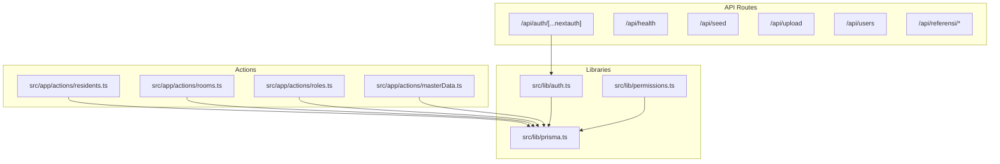
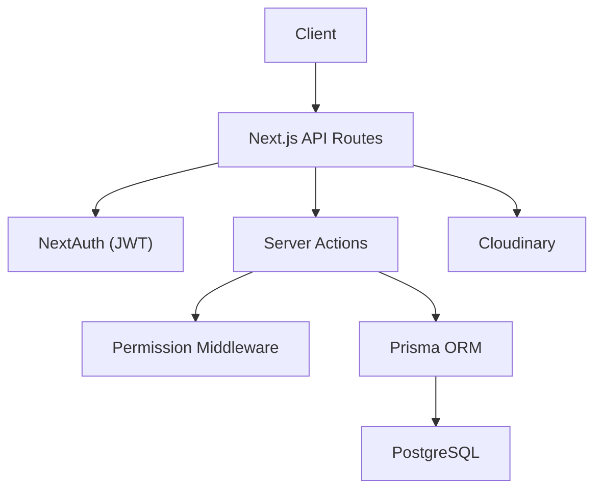
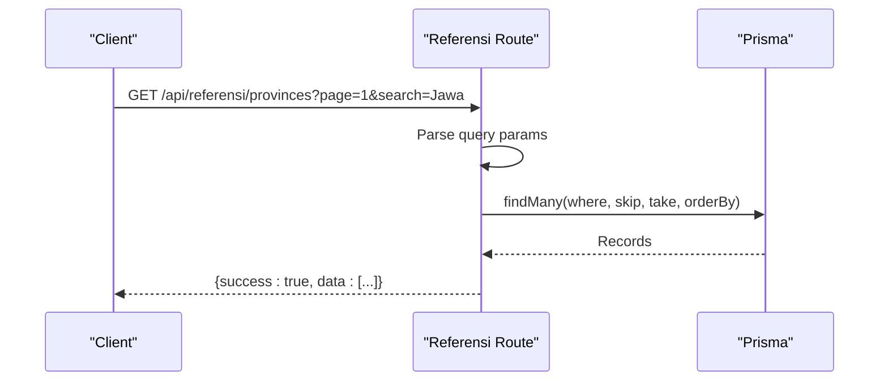
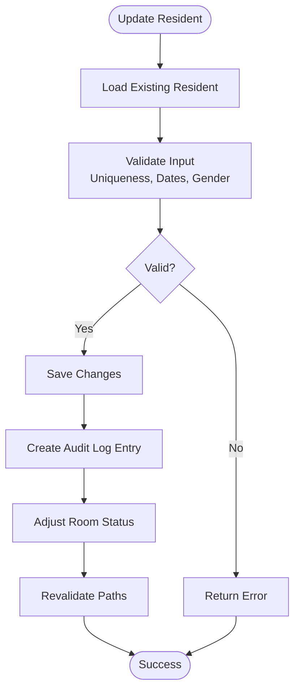
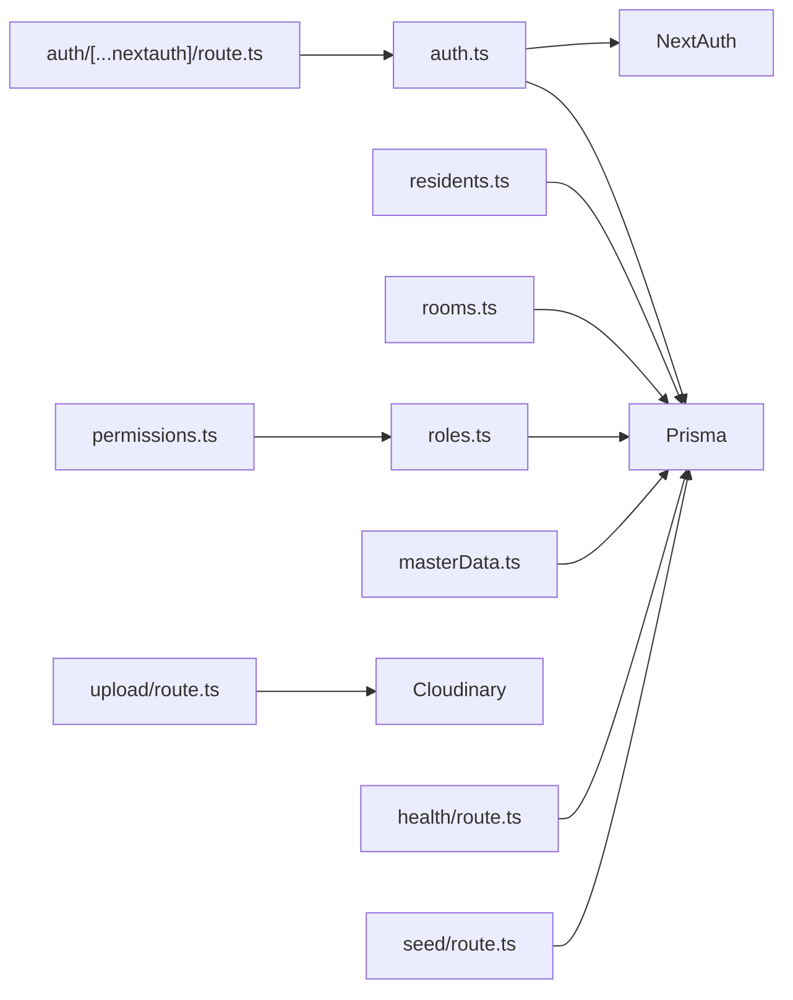

# API Documentation

<cite>
**Referenced Files in This Document**
- [auth route](file://src/app/api/auth/[...nextauth]/route.ts)
- [health route](file://src/app/api/health/route.ts)
- [seed route](file://src/app/api/seed/route.ts)
- [upload route](file://src/app/api/upload/route.ts)
- [users route](file://src/app/api/users/route.ts)
- [countries route](file://src/app/api/referensi/countries/route.ts)
- [provinces route](file://src/app/api/referensi/provinces/route.ts)
- [regencies route](file://src/app/api/referensi/regencies/route.ts)
- [districts route](file://src/app/api/referensi/districts/route.ts)
- [villages route](file://src/app/api/referensi/villages/route.ts)
- [auth config](file://src/lib/auth.ts)
- [prisma client](file://src/lib/prisma.ts)
- [permissions](file://src/lib/permissions.ts)
- [residents actions](file://src/app/actions/residents.ts)
- [rooms actions](file://src/app/actions/rooms.ts)
- [roles actions](file://src/app/actions/roles.ts)
- [master data actions](file://src/app/actions/masterData.ts)
</cite>

## Table of Contents
1. [Introduction](#introduction)
2. [Project Structure](#project-structure)
3. [Core Components](#core-components)
4. [Architecture Overview](#architecture-overview)
5. [Detailed Component Analysis](#detailed-component-analysis)
6. [Dependency Analysis](#dependency-analysis)
7. [Performance Considerations](#performance-considerations)
8. [Troubleshooting Guide](#troubleshooting-guide)
9. [Conclusion](#conclusion)
10. [Appendices](#appendices)

## Introduction
This document provides comprehensive API documentation for the REST endpoints and server actions in the application. It covers authentication, CRUD operations for residents and rooms, geographic data retrieval, file uploads, administrative seeding, and health checks. For each endpoint, we describe authentication requirements, request/response schemas, error handling, and practical integration guidelines. Security considerations, rate limiting, and versioning strategies are also included.

## Project Structure
The API surface is primarily implemented as Next.js App Router API routes under src/app/api, with shared authentication and database utilities located in src/lib. Business logic for domain-specific operations is encapsulated in server actions under src/app/actions.

**Diagram sources**
- [auth route:1-7](file://src/app/api/auth/[...nextauth]/route.ts#L1-L7)
- [health route:1-24](file://src/app/api/health/route.ts#L1-L24)
- [seed route:1-183](file://src/app/api/seed/route.ts#L1-L183)
- [upload route:1-37](file://src/app/api/upload/route.ts#L1-L37)
- [users route:1-6](file://src/app/api/users/route.ts#L1-L6)
- [countries route:1-29](file://src/app/api/referensi/countries/route.ts#L1-L29)
- [provinces route:1-32](file://src/app/api/referensi/provinces/route.ts#L1-L32)
- [regencies route:1-32](file://src/app/api/referensi/regencies/route.ts#L1-L32)
- [districts route:1-32](file://src/app/api/referensi/districts/route.ts#L1-L32)
- [villages route:1-32](file://src/app/api/referensi/villages/route.ts#L1-L32)
- [auth config:1-81](file://src/lib/auth.ts#L1-L81)
- [prisma client](file://src/lib/prisma.ts)
- [permissions](file://src/lib/permissions.ts)
- [residents actions:1-666](file://src/app/actions/residents.ts#L1-L666)
- [rooms actions:1-118](file://src/app/actions/rooms.ts#L1-L118)
- [roles actions:1-119](file://src/app/actions/roles.ts#L1-L119)
- [master data actions:1-191](file://src/app/actions/masterData.ts#L1-L191)

**Section sources**
- [auth route:1-7](file://src/app/api/auth/[...nextauth]/route.ts#L1-L7)
- [health route:1-24](file://src/app/api/health/route.ts#L1-L24)
- [seed route:1-183](file://src/app/api/seed/route.ts#L1-L183)
- [upload route:1-37](file://src/app/api/upload/route.ts#L1-L37)
- [users route:1-6](file://src/app/api/users/route.ts#L1-L6)
- [countries route:1-29](file://src/app/api/referensi/countries/route.ts#L1-L29)
- [provinces route:1-32](file://src/app/api/referensi/provinces/route.ts#L1-L32)
- [regencies route:1-32](file://src/app/api/referensi/regencies/route.ts#L1-L32)
- [districts route:1-32](file://src/app/api/referensi/districts/route.ts#L1-L32)
- [villages route:1-32](file://src/app/api/referensi/villages/route.ts#L1-L32)
- [auth config:1-81](file://src/lib/auth.ts#L1-L81)
- [prisma client](file://src/lib/prisma.ts)
- [permissions](file://src/lib/permissions.ts)
- [residents actions:1-666](file://src/app/actions/residents.ts#L1-L666)
- [rooms actions:1-118](file://src/app/actions/rooms.ts#L1-L118)
- [roles actions:1-119](file://src/app/actions/roles.ts#L1-L119)
- [master data actions:1-191](file://src/app/actions/masterData.ts#L1-L191)

## Core Components
- Authentication: NextAuth-based JWT authentication with credentials provider and session persistence.
- Authorization: Role-based permissions enforced via middleware and server actions.
- Data Access: Prisma ORM for database operations across entities (users, roles, permissions, residents, rooms, geographic entities).
- File Uploads: Cloudinary integration for secure image storage.
- Administrative Utilities: Seeding endpoints for permissions, roles, and initial admin user.
- Health Checks: Lightweight endpoint to warm database connections.

**Section sources**
- [auth config:1-81](file://src/lib/auth.ts#L1-L81)
- [permissions](file://src/lib/permissions.ts)
- [prisma client](file://src/lib/prisma.ts)
- [upload route:1-37](file://src/app/api/upload/route.ts#L1-L37)
- [seed route:1-183](file://src/app/api/seed/route.ts#L1-L183)
- [health route:1-24](file://src/app/api/health/route.ts#L1-L24)

## Architecture Overview
The API follows a layered architecture:
- Presentation Layer: Next.js App Router API routes.
- Application Layer: Server actions for complex workflows and permission checks.
- Domain Services: Prisma models and relations.
- External Integrations: Cloudinary for media and NextAuth for identity.

**Diagram sources**
- [auth route:1-7](file://src/app/api/auth/[...nextauth]/route.ts#L1-L7)
- [auth config:1-81](file://src/lib/auth.ts#L1-L81)
- [permissions](file://src/lib/permissions.ts)
- [residents actions:1-666](file://src/app/actions/residents.ts#L1-L666)
- [rooms actions:1-118](file://src/app/actions/rooms.ts#L1-L118)
- [roles actions:1-119](file://src/app/actions/roles.ts#L1-L119)
- [prisma client](file://src/lib/prisma.ts)
- [upload route:1-37](file://src/app/api/upload/route.ts#L1-L37)

## Detailed Component Analysis

### Authentication Endpoints
- Endpoint: POST /api/auth/[...nextauth]
  - Description: Handles NextAuth authentication lifecycle (sign-in/sign-out).
  - Authentication: Not required at API level; relies on NextAuth cookies/JWT.
  - Request: Form-encoded credentials (email, password).
  - Response: Redirects to dashboard or login page; session stored in cookies.
  - Errors: Invalid credentials, account not found, password mismatch.
  - Notes: Uses credentials provider with bcrypt comparison and JWT/session callbacks.

- Endpoint: GET /api/auth/[...nextauth]
  - Description: Supports NextAuth introspection and session retrieval.
  - Authentication: Not required; returns current session if available.
  - Response: Session payload including user role and permissions.
  - Errors: Session invalid or expired.

Security considerations:
- Password hashing with bcrypt.
- JWT session strategy with secret configured via environment variable.
- Session callbacks attach role and permissions to tokens.

**Section sources**
- [auth route:1-7](file://src/app/api/auth/[...nextauth]/route.ts#L1-L7)
- [auth config:1-81](file://src/lib/auth.ts#L1-L81)

### Geographic Data Endpoints
All endpoints support pagination and optional filtering:
- Query parameters:
  - search: Text filter (case-insensitive substring match).
  - page: Page number (default 1).
  - Limit: Fixed page size (100 items per page).
  - Additional filters by parent entity ID (e.g., countryId, provinceId, regencyId, districtId).

Responses:
- Success: { success: true, data: [...] }
- Error: { success: false, error: string }

#### Countries
- Method: GET
- Path: /api/referensi/countries
- Filters: search, page
- Response: Array of country records.

#### Provinces
- Method: GET
- Path: /api/referensi/provinces
- Filters: search, page, countryId
- Response: Array of province records.

#### Regencies (Cities)
- Method: GET
- Path: /api/referensi/regencies
- Filters: search, page, provinceId
- Response: Array of regency records.

#### Districts
- Method: GET
- Path: /api/referensi/districts
- Filters: search, page, regencyId
- Response: Array of district records.

#### Villages
- Method: GET
- Path: /api/referensi/villages
- Filters: search, page, districtId
- Response: Array of village records.

**Diagram sources**
- [provinces route:1-32](file://src/app/api/referensi/provinces/route.ts#L1-L32)
- [prisma client](file://src/lib/prisma.ts)

**Section sources**
- [countries route:1-29](file://src/app/api/referensi/countries/route.ts#L1-L29)
- [provinces route:1-32](file://src/app/api/referensi/provinces/route.ts#L1-L32)
- [regencies route:1-32](file://src/app/api/referensi/regencies/route.ts#L1-L32)
- [districts route:1-32](file://src/app/api/referensi/districts/route.ts#L1-L32)
- [villages route:1-32](file://src/app/api/referensi/villages/route.ts#L1-L32)

### File Upload Endpoint
- Method: POST
- Path: /api/upload
- Authentication: Required (JWT session cookie).
- Request: multipart/form-data with field "file".
- Response:
  - Success: { success: true, url: string }
  - Error: { success: false, error: string }
- Errors: No file provided (400), upload failure (500), Cloudinary configuration errors.

Integration notes:
- Configure Cloudinary environment variables (cloud name, API key, API secret).
- Uploaded images are stored under a fixed folder path.

**Section sources**
- [upload route:1-37](file://src/app/api/upload/route.ts#L1-L37)

### Administrative Endpoints
- Method: GET
- Path: /api/seed
- Authentication: Not required.
- Purpose: Seeds default permissions, creates SUPER_ADMIN role, assigns all permissions, seeds admin user, and ensures system roles.
- Response: JSON with operation outcome and admin details.
- Errors: Internal server error (500).

- Method: GET
- Path: /api/health
- Authentication: Not required.
- Purpose: Health check to warm database connection.
- Response: { status: "ok" | "error", timestamp: ISO string }.
- Status Codes: 200 (ok), 503 (error).

- Method: GET
- Path: /api/users
- Authentication: Not required.
- Purpose: Returns a 404 Not Found response.
- Response: Plain text "Not Found".

**Section sources**
- [seed route:1-183](file://src/app/api/seed/route.ts#L1-L183)
- [health route:1-24](file://src/app/api/health/route.ts#L1-L24)
- [users route:1-6](file://src/app/api/users/route.ts#L1-L6)

### CRUD Operations (Server Actions)
These operations are implemented as server actions and are invoked from the UI. They enforce authorization and perform database updates with revalidation.

#### Residents
Endpoints (server actions):
- Create Resident
  - Action: createResident(formData)
  - Permissions: Required permission code for creating residents.
  - Validation: Full validation for required fields, date formats, gender normalization, uniqueness of NIM/NIUP, room availability.
  - Response: { success: true, resident } or { error: string }.
  - Side effects: Room status update if capacity met.

- Update Resident
  - Action: updateResident(id, formData)
  - Permissions: Required permission code for updating residents.
  - Validation: Same as create plus uniqueness exclusion for self.
  - Response: { success: true, resident } or { error: string }.
  - Side effects: Audit log entry for tracked changes, room status adjustments.

- Delete Resident
  - Action: deleteResident(id)
  - Permissions: Required permission code for deleting residents.
  - Response: { success: true } or { error: string }.
  - Side effects: Frees room status.

- Bulk Create Residents
  - Action: bulkCreateResidents(rows[])
  - Permissions: Required permission code for creating residents.
  - Response: { success: true, successCount, skippedCount } or { error: string }.

- Bulk Delete Residents
  - Action: bulkDeleteResidents(ids[])
  - Permissions: Required permission code for deleting residents.
  - Response: { success: true } or { error: string }.

- Bulk Move Residents
  - Action: bulkMoveResidents(ids[], { roomId? })
  - Permissions: Required permission code for updating residents.
  - Response: { success: true } or { error: string }.

**Diagram sources**
- [residents actions:246-442](file://src/app/actions/residents.ts#L246-L442)

**Section sources**
- [residents actions:1-666](file://src/app/actions/residents.ts#L1-L666)

#### Rooms
Endpoints (server actions):
- Create Room
  - Action: createRoom({ number, floor, capacity, status })
  - Permissions: Required permission code for creating rooms.
  - Response: { success: true, room } or { error: string }.

- Update Room
  - Action: updateRoom(id, { number, floor, capacity, status })
  - Permissions: Required permission code for updating rooms.
  - Response: { success: true, room } or { error: string }.

- Delete Room
  - Action: deleteRoom(id)
  - Permissions: Required permission code for deleting rooms.
  - Response: { success: true } or { error: string }.

Constraints:
- Room number uniqueness enforced.
- Deletion blocked if residents are assigned.

**Section sources**
- [rooms actions:1-118](file://src/app/actions/rooms.ts#L1-L118)

#### Roles
Endpoints (server actions):
- Get Roles
  - Action: getRoles()
  - Permissions: role.view required.
  - Response: Array of roles with permissions and user counts.

- Get Permissions
  - Action: getPermissions()
  - Permissions: role.view required.
  - Response: Array of permission records.

- Create Role
  - Action: createRole({ name, permissions[] })
  - Permissions: role.create required.
  - Response: Role object.

- Update Role
  - Action: updateRole(id, { name, permissions[] })
  - Permissions: role.update required.
  - Constraints: SUPER_ADMIN role cannot be modified directly.
  - Response: { success: true } or throws error.

- Delete Role
  - Action: deleteRole(id)
  - Permissions: role.delete required.
  - Constraints: System roles and roles assigned to users cannot be deleted.
  - Response: { success: true } or throws error.

**Section sources**
- [roles actions:1-119](file://src/app/actions/roles.ts#L1-L119)

#### Master Data (Legacy/Reference Entities)
Endpoints (server actions):
- Wilayah: CRUD operations for administrative regions.
- Daerah: CRUD operations for areas.
- Fakultas: CRUD operations for faculties.
- Prodi: CRUD operations for programs with faculty linkage.
- Angkatan: CRUD operations for cohorts with program linkage.

Each action returns either { success: true, data } or { error: string } and triggers path revalidation.

**Section sources**
- [master data actions:1-191](file://src/app/actions/masterData.ts#L1-L191)

## Dependency Analysis
Key dependencies and their roles:
- NextAuth: Authentication provider and session management.
- Prisma: Database ORM for all domain entities.
- Cloudinary: Media storage service for uploads.
- Permissions: Authorization enforcement for roles and actions.

**Diagram sources**
- [auth config:1-81](file://src/lib/auth.ts#L1-L81)
- [residents actions:1-666](file://src/app/actions/residents.ts#L1-L666)
- [rooms actions:1-118](file://src/app/actions/rooms.ts#L1-L118)
- [roles actions:1-119](file://src/app/actions/roles.ts#L1-L119)
- [master data actions:1-191](file://src/app/actions/masterData.ts#L1-L191)
- [permissions](file://src/lib/permissions.ts)
- [upload route:1-37](file://src/app/api/upload/route.ts#L1-L37)
- [auth route:1-7](file://src/app/api/auth/[...nextauth]/route.ts#L1-L7)
- [health route:1-24](file://src/app/api/health/route.ts#L1-L24)
- [seed route:1-183](file://src/app/api/seed/route.ts#L1-L183)

**Section sources**
- [auth config:1-81](file://src/lib/auth.ts#L1-L81)
- [permissions](file://src/lib/permissions.ts)
- [prisma client](file://src/lib/prisma.ts)
- [upload route:1-37](file://src/app/api/upload/route.ts#L1-L37)
- [residents actions:1-666](file://src/app/actions/residents.ts#L1-L666)
- [rooms actions:1-118](file://src/app/actions/rooms.ts#L1-L118)
- [roles actions:1-119](file://src/app/actions/roles.ts#L1-L119)
- [master data actions:1-191](file://src/app/actions/masterData.ts#L1-L191)

## Performance Considerations
- Pagination: Geographic endpoints use fixed page size (100) to prevent large payloads.
- Database warming: Health endpoint executes a lightweight query to reduce cold starts.
- Batch operations: Bulk resident creation/move/delete minimize round-trips and optimize room capacity checks.
- Revalidation: Server actions trigger selective path revalidation to maintain cache freshness efficiently.

[No sources needed since this section provides general guidance]

## Troubleshooting Guide
Common issues and resolutions:
- Authentication failures:
  - Verify credentials and ensure user exists with a valid role.
  - Check NEXTAUTH_SECRET and session strategy configuration.
- Permission denied:
  - Confirm user role includes required permission codes for the requested action.
- Upload failures:
  - Validate Cloudinary environment variables and network connectivity.
  - Ensure file field is present in multipart form data.
- Database errors:
  - Review Prisma logs and connection settings.
  - Use health endpoint to warm connections in serverless environments.
- Geographic queries returning empty:
  - Adjust search terms or filter by parent entity ID.
  - Increase page number if results span multiple pages.

**Section sources**
- [auth config:1-81](file://src/lib/auth.ts#L1-L81)
- [permissions](file://src/lib/permissions.ts)
- [upload route:1-37](file://src/app/api/upload/route.ts#L1-L37)
- [health route:1-24](file://src/app/api/health/route.ts#L1-L24)
- [provinces route:1-32](file://src/app/api/referensi/provinces/route.ts#L1-L32)

## Conclusion
The API provides a cohesive set of endpoints and server actions for authentication, geographic data retrieval, file uploads, administrative tasks, and core CRUD operations. Strong separation of concerns, explicit permission enforcement, and pragmatic performance optimizations enable reliable integration. Adhering to the documented authentication, request/response schemas, and error handling patterns ensures predictable behavior across clients.

[No sources needed since this section summarizes without analyzing specific files]

## Appendices

### Authentication and Authorization Reference
- Authentication method: JWT via NextAuth credentials provider.
- Authorization model: Role-permission matrix enforced in server actions.
- Session storage: Cookies with JWT payload containing role and permissions.

**Section sources**
- [auth config:1-81](file://src/lib/auth.ts#L1-L81)
- [permissions](file://src/lib/permissions.ts)
- [roles actions:1-119](file://src/app/actions/roles.ts#L1-L119)

### Rate Limiting and Security Considerations
- Rate limiting: Not implemented at the API layer; consider deploying platform-level limits or application-level throttling.
- Security headers: Add CSP, HSTS, and CSRF protections at the edge or middleware.
- Secrets management: Store NEXTAUTH_SECRET, Cloudinary keys, and database credentials in environment variables.
- Input sanitization: Server actions already trim and normalize inputs; validate at the edge and enforce strict schemas.

[No sources needed since this section provides general guidance]

### Versioning Strategy
- Current state: No explicit API versioning is implemented.
- Recommendation: Adopt URL-based versioning (/api/v1/...) or header-based versioning to evolve endpoints safely.

[No sources needed since this section provides general guidance]

### Client Integration Examples
- Authentication:
  - Send credentials to /api/auth/[...nextauth] using form encoding.
  - Persist returned session cookies and include them in subsequent requests.
- Geographic queries:
  - Use GET with query parameters (search, page, parentId) to paginate results.
- File uploads:
  - POST multipart/form-data with field "file" to /api/upload.
- Residents/Rooms/Roles:
  - Invoke server actions from the UI; handle returned success/error objects.

[No sources needed since this section provides general guidance]