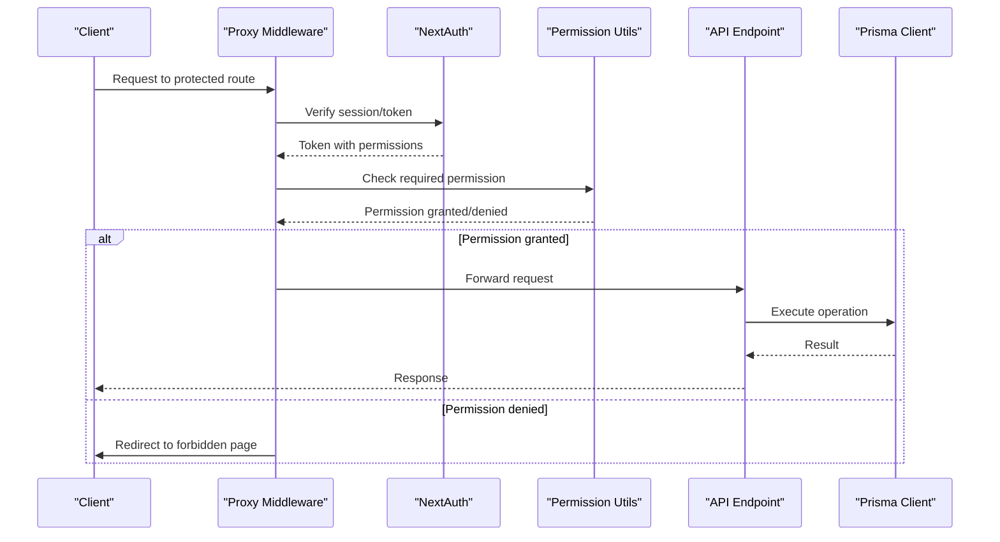
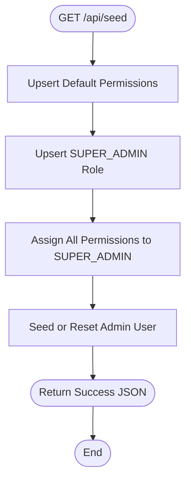
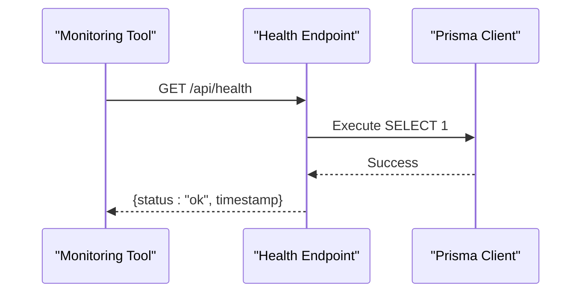
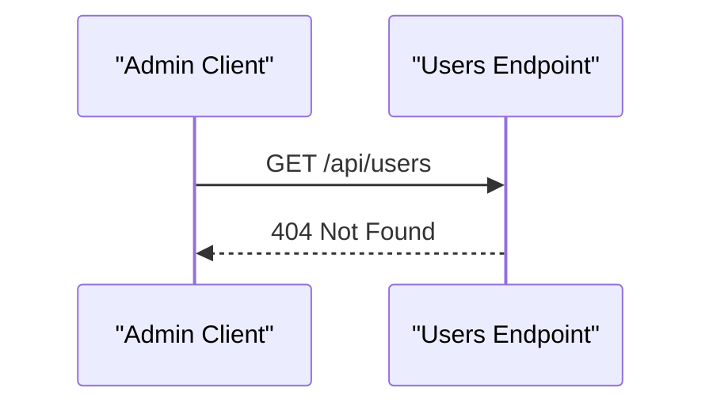
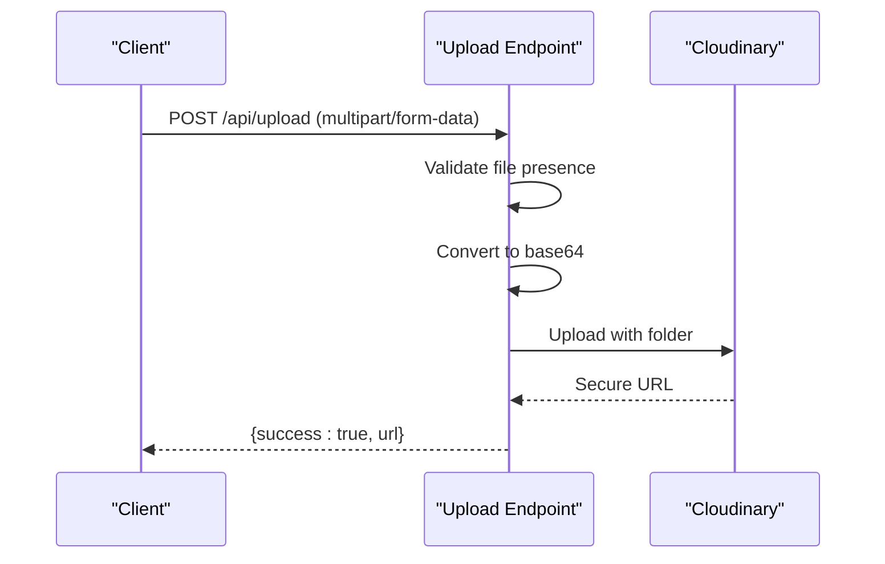
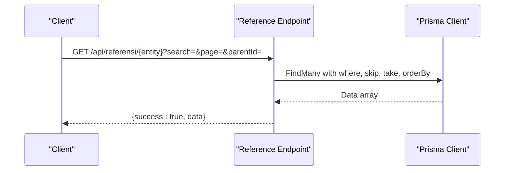
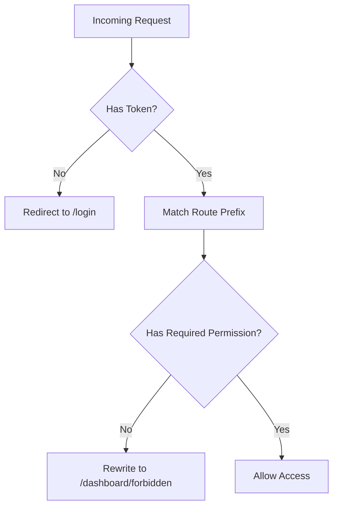
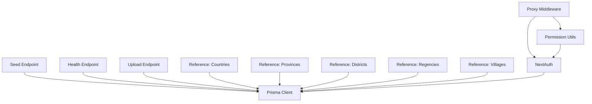

# Administrative & Utility Endpoints

<cite>
**Referenced Files in This Document**
- [route.ts](file://src/app/api/seed/route.ts)
- [route.ts](file://src/app/api/health/route.ts)
- [route.ts](file://src/app/api/users/route.ts)
- [route.ts](file://src/app/api/upload/route.ts)
- [route.ts](file://src/app/api/referensi/countries/route.ts)
- [route.ts](file://src/app/api/referensi/provinces/route.ts)
- [route.ts](file://src/app/api/referensi/districts/route.ts)
- [route.ts](file://src/app/api/referensi/regencies/route.ts)
- [route.ts](file://src/app/api/referensi/villages/route.ts)
- [auth.ts](file://src/lib/auth.ts)
- [permissions.ts](file://src/lib/permissions.ts)
- [prisma.ts](file://src/lib/prisma.ts)
- [seed.ts](file://prisma/seed.ts)
- [proxy.ts](file://src/proxy.ts)
- [package.json](file://package.json)
</cite>

## Table of Contents
1. [Introduction](#introduction)
2. [Project Structure](#project-structure)
3. [Core Components](#core-components)
4. [Architecture Overview](#architecture-overview)
5. [Detailed Component Analysis](#detailed-component-analysis)
6. [Dependency Analysis](#dependency-analysis)
7. [Performance Considerations](#performance-considerations)
8. [Troubleshooting Guide](#troubleshooting-guide)
9. [Conclusion](#conclusion)

## Introduction
This document provides comprehensive API documentation for administrative and utility endpoints within the application. It covers seed data management, system health monitoring, user administration, and proxy routing. The documentation details endpoint specifications, administrative privileges, security requirements, operational monitoring, and integration with external services such as Cloudinary for image uploads. Examples of system maintenance operations and troubleshooting endpoints are included to support operational tasks.

## Project Structure
The administrative and utility endpoints are organized under the Next.js App Router at `src/app/api`. Key areas include:
- Seed management: `/api/seed`
- System health: `/api/health`
- User administration: `/api/users`
- Upload service: `/api/upload`
- Reference data: `/api/referensi/{countries, provinces, districts, regencies, villages}`
- Proxy routing middleware: `src/proxy.ts`
- Authentication and permissions: `src/lib/auth.ts`, `src/lib/permissions.ts`
- Database client: `src/lib/prisma.ts`
- Prisma seed script: `prisma/seed.ts`

```mermaid
graph TB
subgraph "API Endpoints"
Seed["Seed Management<br/>GET /api/seed"]
Health["Health Check<br/>GET /api/health"]
Users["User Administration<br/>GET /api/users"]
Upload["Upload Service<br/>POST /api/upload"]
RefCountries["Reference: Countries<br/>GET /api/referensi/countries"]
RefProvinces["Reference: Provinces<br/>GET /api/referensi/provinces"]
RefDistricts["Reference: Districts<br/>GET /api/referensi/districts"]
RefRegencies["Reference: Regencies<br/>GET /api/referensi/regencies"]
RefVillages["Reference: Villages<br/>GET /api/referensi/villages"]
end
subgraph "Middleware"
Proxy["Proxy Routing<br/>src/proxy.ts"]
end
subgraph "Security & Auth"
Auth["NextAuth Config<br/>src/lib/auth.ts"]
Perm["Permission Utils<br/>src/lib/permissions.ts"]
end
subgraph "Data Layer"
Prisma["Prisma Client<br/>src/lib/prisma.ts"]
SeedScript["Prisma Seed Script<br/>prisma/seed.ts"]
end
Seed --> Prisma
Users --> Auth
Users --> Perm
Upload --> Prisma
RefCountries --> Prisma
RefProvinces --> Prisma
RefDistricts --> Prisma
RefRegencies --> Prisma
RefVillages --> Prisma
Proxy --> Perm
Proxy --> Auth
SeedScript --> Prisma
```

**Diagram sources**
- [route.ts:1-183](file://src/app/api/seed/route.ts#L1-L183)
- [route.ts:1-24](file://src/app/api/health/route.ts#L1-L24)
- [route.ts:1-6](file://src/app/api/users/route.ts#L1-L6)
- [route.ts:1-37](file://src/app/api/upload/route.ts#L1-L37)
- [route.ts:1-29](file://src/app/api/referensi/countries/route.ts#L1-L29)
- [route.ts:1-32](file://src/app/api/referensi/provinces/route.ts#L1-L32)
- [route.ts:1-32](file://src/app/api/referensi/districts/route.ts#L1-L32)
- [route.ts:1-32](file://src/app/api/referensi/regencies/route.ts#L1-L32)
- [route.ts:1-32](file://src/app/api/referensi/villages/route.ts#L1-L32)
- [proxy.ts:1-60](file://src/proxy.ts#L1-L60)
- [auth.ts:1-81](file://src/lib/auth.ts#L1-L81)
- [permissions.ts:1-21](file://src/lib/permissions.ts#L1-L21)
- [prisma.ts:1-31](file://src/lib/prisma.ts#L1-L31)
- [seed.ts:1-174](file://prisma/seed.ts#L1-L174)

**Section sources**
- [route.ts:1-183](file://src/app/api/seed/route.ts#L1-L183)
- [route.ts:1-24](file://src/app/api/health/route.ts#L1-L24)
- [route.ts:1-6](file://src/app/api/users/route.ts#L1-L6)
- [route.ts:1-37](file://src/app/api/upload/route.ts#L1-L37)
- [route.ts:1-29](file://src/app/api/referensi/countries/route.ts#L1-L29)
- [route.ts:1-32](file://src/app/api/referensi/provinces/route.ts#L1-L32)
- [route.ts:1-32](file://src/app/api/referensi/districts/route.ts#L1-L32)
- [route.ts:1-32](file://src/app/api/referensi/regencies/route.ts#L1-L32)
- [route.ts:1-32](file://src/app/api/referensi/villages/route.ts#L1-L32)
- [proxy.ts:1-60](file://src/proxy.ts#L1-L60)
- [auth.ts:1-81](file://src/lib/auth.ts#L1-L81)
- [permissions.ts:1-21](file://src/lib/permissions.ts#L1-L21)
- [prisma.ts:1-31](file://src/lib/prisma.ts#L1-L31)
- [seed.ts:1-174](file://prisma/seed.ts#L1-L174)

## Core Components
This section outlines the primary administrative and utility endpoints, their purpose, and operational characteristics.

- Seed Management (`/api/seed`)
  - Purpose: Initialize or reset system RBAC (roles, permissions, and admin user).
  - Method: GET
  - Behavior: Upserts default permissions, creates or updates the SUPER_ADMIN role, assigns all permissions to SUPER_ADMIN, seeds or resets the admin user, and returns metadata about the operation.
  - Security: No explicit authentication enforced in the endpoint; intended for controlled environments.
  - Response: JSON with operation status and admin details; on error returns 500 with error message.

- System Health (`/api/health`)
  - Purpose: Lightweight health check to warm up serverless runtime and database connections.
  - Method: GET
  - Behavior: Executes a minimal database query; responds with status "ok" and timestamp on success, otherwise "error" with 503.
  - Security: No authentication required; suitable for load balancer or monitoring pings.

- User Administration (`/api/users`)
  - Purpose: Placeholder endpoint returning Not Found.
  - Method: GET
  - Behavior: Returns 404 Not Found.
  - Security: No authentication enforced; intended to be extended for user CRUD operations.

- Upload Service (`/api/upload`)
  - Purpose: Upload files to Cloudinary via multipart form data.
  - Method: POST
  - Behavior: Validates presence of file, converts to base64, uploads to Cloudinary, and returns secure URL; on error returns 500 with error message.
  - Security: Requires Cloudinary credentials configured via environment variables.
  - Response: JSON with success flag and secure URL on success.

- Reference Data Endpoints (`/api/referensi/{countries, provinces, districts, regencies, villages}`)
  - Purpose: Paginated retrieval of geographic reference data with optional filters.
  - Methods: GET
  - Behavior: Supports search query parameter and pagination; filters by parent entity ID when provided; returns paginated results sorted alphabetically.
  - Security: No authentication required; designed for public or internal use depending on deployment.

**Section sources**
- [route.ts:76-182](file://src/app/api/seed/route.ts#L76-L182)
- [route.ts:8-23](file://src/app/api/health/route.ts#L8-L23)
- [route.ts:3-5](file://src/app/api/users/route.ts#L3-L5)
- [route.ts:12-36](file://src/app/api/upload/route.ts#L12-L36)
- [route.ts:5-31](file://src/app/api/referensi/countries/route.ts#L5-L31)
- [route.ts:5-31](file://src/app/api/referensi/provinces/route.ts#L5-L31)
- [route.ts:5-31](file://src/app/api/referensi/districts/route.ts#L5-L31)
- [route.ts:5-31](file://src/app/api/referensi/regencies/route.ts#L5-L31)
- [route.ts:5-31](file://src/app/api/referensi/villages/route.ts#L5-L31)

## Architecture Overview
The administrative and utility endpoints integrate with NextAuth for authentication, a permission utility for authorization checks, and Prisma for database operations. Proxy routing enforces permission-based access to protected dashboard routes.

**Diagram sources**
- [proxy.ts:25-55](file://src/proxy.ts#L25-L55)
- [auth.ts:53-80](file://src/lib/auth.ts#L53-L80)
- [permissions.ts:4-20](file://src/lib/permissions.ts#L4-L20)

## Detailed Component Analysis

### Seed Management Endpoint
The seed endpoint initializes the system with default permissions, roles, and an admin user. It ensures idempotent creation/upserts and maintains backward compatibility with legacy roles.

**Diagram sources**
- [route.ts:76-182](file://src/app/api/seed/route.ts#L76-L182)

**Section sources**
- [route.ts:76-182](file://src/app/api/seed/route.ts#L76-L182)

### System Health Endpoint
The health endpoint performs a lightweight database ping to prevent cold starts and reports status.

**Diagram sources**
- [route.ts:8-23](file://src/app/api/health/route.ts#L8-L23)

**Section sources**
- [route.ts:8-23](file://src/app/api/health/route.ts#L8-L23)

### User Administration Endpoint
The user administration endpoint currently returns a Not Found response and is intended for future expansion to support user CRUD operations.

**Diagram sources**
- [route.ts:3-5](file://src/app/api/users/route.ts#L3-L5)

**Section sources**
- [route.ts:3-5](file://src/app/api/users/route.ts#L3-L5)

### Upload Service Endpoint
The upload endpoint integrates with Cloudinary for file storage, validating input and handling errors gracefully.

**Diagram sources**
- [route.ts:12-36](file://src/app/api/upload/route.ts#L12-L36)

**Section sources**
- [route.ts:12-36](file://src/app/api/upload/route.ts#L12-L36)

### Reference Data Endpoints
Reference endpoints provide paginated queries for geographic data with optional filtering and search capabilities.

**Diagram sources**
- [route.ts:5-31](file://src/app/api/referensi/countries/route.ts#L5-L31)
- [route.ts:5-31](file://src/app/api/referensi/provinces/route.ts#L5-L31)
- [route.ts:5-31](file://src/app/api/referensi/districts/route.ts#L5-L31)
- [route.ts:5-31](file://src/app/api/referensi/regencies/route.ts#L5-L31)
- [route.ts:5-31](file://src/app/api/referensi/villages/route.ts#L5-L31)

**Section sources**
- [route.ts:5-31](file://src/app/api/referensi/countries/route.ts#L5-L31)
- [route.ts:5-31](file://src/app/api/referensi/provinces/route.ts#L5-L31)
- [route.ts:5-31](file://src/app/api/referensi/districts/route.ts#L5-L31)
- [route.ts:5-31](file://src/app/api/referensi/regencies/route.ts#L5-L31)
- [route.ts:5-31](file://src/app/api/referensi/villages/route.ts#L5-L31)

### Proxy Routing and Permissions
Proxy routing enforces permission-based access to dashboard routes and redirects unauthorized users to a forbidden page.

**Diagram sources**
- [proxy.ts:25-55](file://src/proxy.ts#L25-L55)

**Section sources**
- [proxy.ts:4-59](file://src/proxy.ts#L4-L59)

## Dependency Analysis
Administrative and utility endpoints depend on shared libraries for authentication, permissions, and database connectivity.

**Diagram sources**
- [route.ts:1-3](file://src/app/api/seed/route.ts#L1-L3)
- [route.ts:1-3](file://src/app/api/health/route.ts#L1-L3)
- [route.ts:1-3](file://src/app/api/upload/route.ts#L1-L3)
- [route.ts:1-3](file://src/app/api/referensi/countries/route.ts#L1-L3)
- [route.ts:1-3](file://src/app/api/referensi/provinces/route.ts#L1-L3)
- [route.ts:1-3](file://src/app/api/referensi/districts/route.ts#L1-L3)
- [route.ts:1-3](file://src/app/api/referensi/regencies/route.ts#L1-L3)
- [route.ts:1-3](file://src/app/api/referensi/villages/route.ts#L1-L3)
- [proxy.ts:1-2](file://src/proxy.ts#L1-L2)
- [auth.ts:1-5](file://src/lib/auth.ts#L1-L5)
- [permissions.ts:1-2](file://src/lib/permissions.ts#L1-L2)
- [prisma.ts:1-3](file://src/lib/prisma.ts#L1-L3)

**Section sources**
- [prisma.ts:1-31](file://src/lib/prisma.ts#L1-L31)
- [auth.ts:1-81](file://src/lib/auth.ts#L1-L81)
- [permissions.ts:1-21](file://src/lib/permissions.ts#L1-L21)
- [proxy.ts:1-60](file://src/proxy.ts#L1-L60)

## Performance Considerations
- Health endpoint uses a minimal database query to avoid heavy operations and reduce latency for monitoring systems.
- Reference endpoints implement pagination and filtering to limit payload sizes and improve responsiveness.
- Upload endpoint converts files to base64 in memory; consider streaming for very large files to reduce memory usage.
- Prisma client is configured with conservative connection limits for serverless environments to prevent resource exhaustion.

## Troubleshooting Guide
Common issues and resolutions:
- Seed endpoint failures: Verify database connectivity and Prisma schema; ensure environment variables are set. Review error responses for detailed messages.
- Health endpoint returns error: Confirm database availability and connection string; check for network or timeout issues.
- Upload endpoint returns 500: Validate Cloudinary credentials and folder permissions; inspect logs for conversion or upload errors.
- Reference endpoints return 500: Check Prisma query filters and pagination parameters; ensure parent IDs are valid.
- Proxy routing denies access: Confirm user permissions and NextAuth session; verify route-to-permission mappings.

**Section sources**
- [route.ts:176-181](file://src/app/api/seed/route.ts#L176-L181)
- [route.ts:17-22](file://src/app/api/health/route.ts#L17-L22)
- [route.ts:32-36](file://src/app/api/upload/route.ts#L32-L36)
- [route.ts:27-30](file://src/app/api/referensi/countries/route.ts#L27-L30)
- [route.ts:27-30](file://src/app/api/referensi/provinces/route.ts#L27-L30)
- [route.ts:27-30](file://src/app/api/referensi/districts/route.ts#L27-L30)
- [route.ts:27-30](file://src/app/api/referensi/regencies/route.ts#L27-L30)
- [route.ts:27-30](file://src/app/api/referensi/villages/route.ts#L27-L30)
- [proxy.ts:34-46](file://src/proxy.ts#L34-L46)

## Conclusion
The administrative and utility endpoints provide essential infrastructure for system initialization, monitoring, data management, and access control. By leveraging NextAuth for authentication, a permission utility for authorization, and Prisma for data operations, the system supports secure and maintainable administrative workflows. The proxy routing mechanism ensures that protected routes are accessible only to authorized users. Integrations with external services like Cloudinary enable scalable file handling. Proper configuration of environment variables and database connectivity is critical for reliable operation.