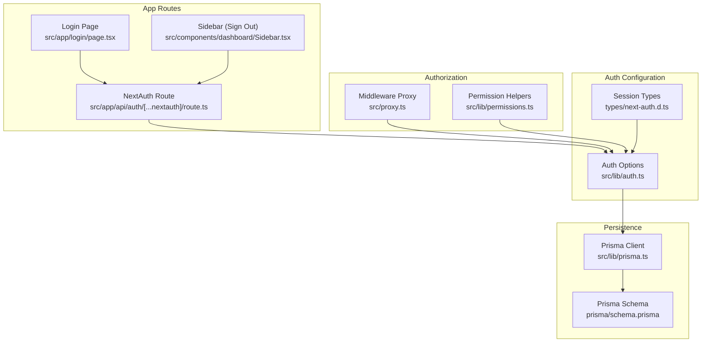
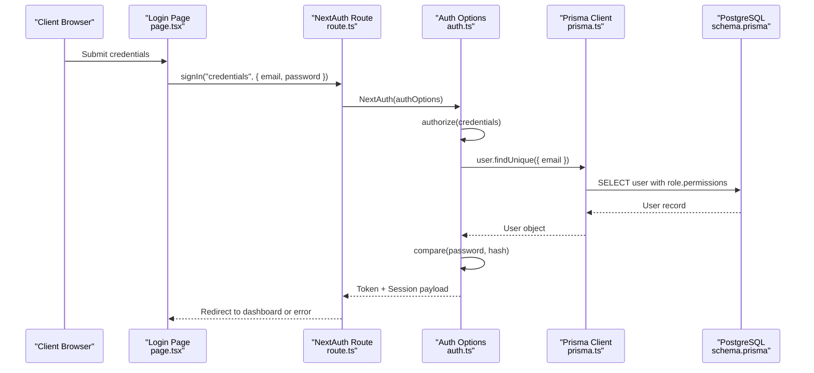
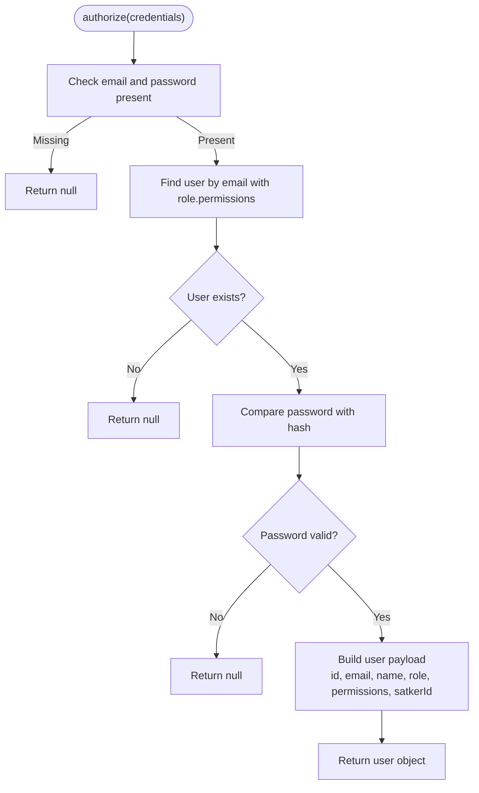
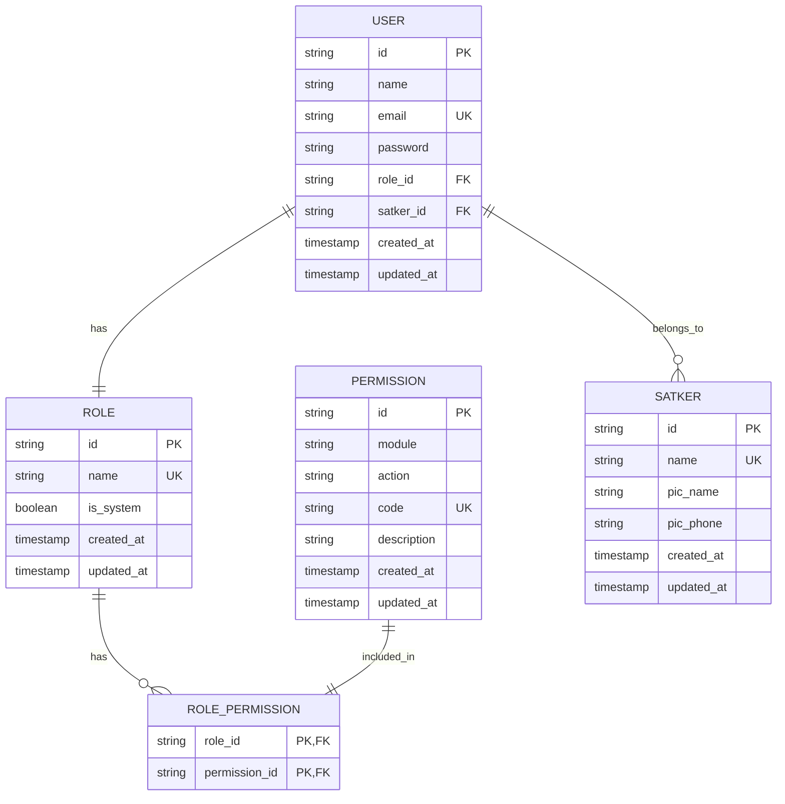
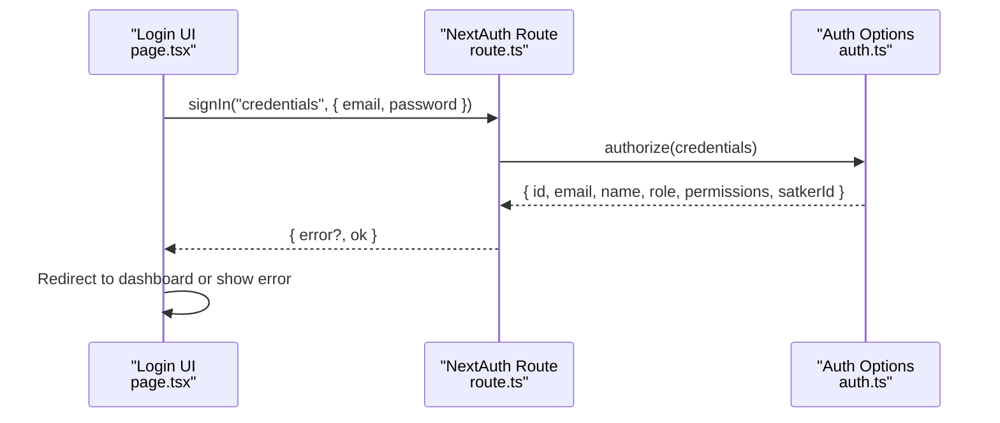
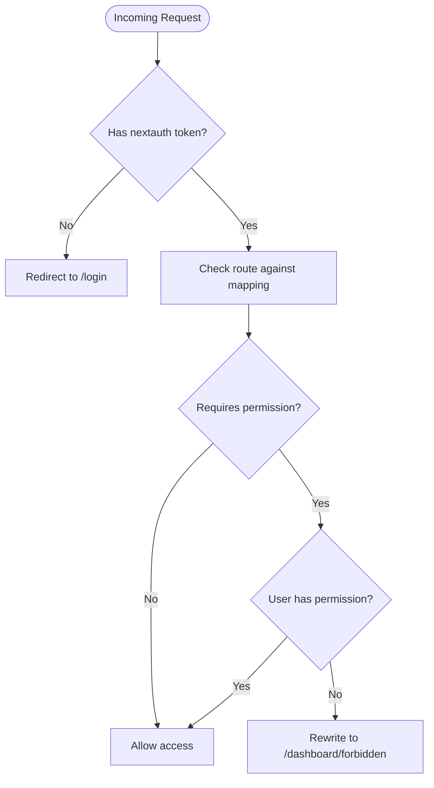
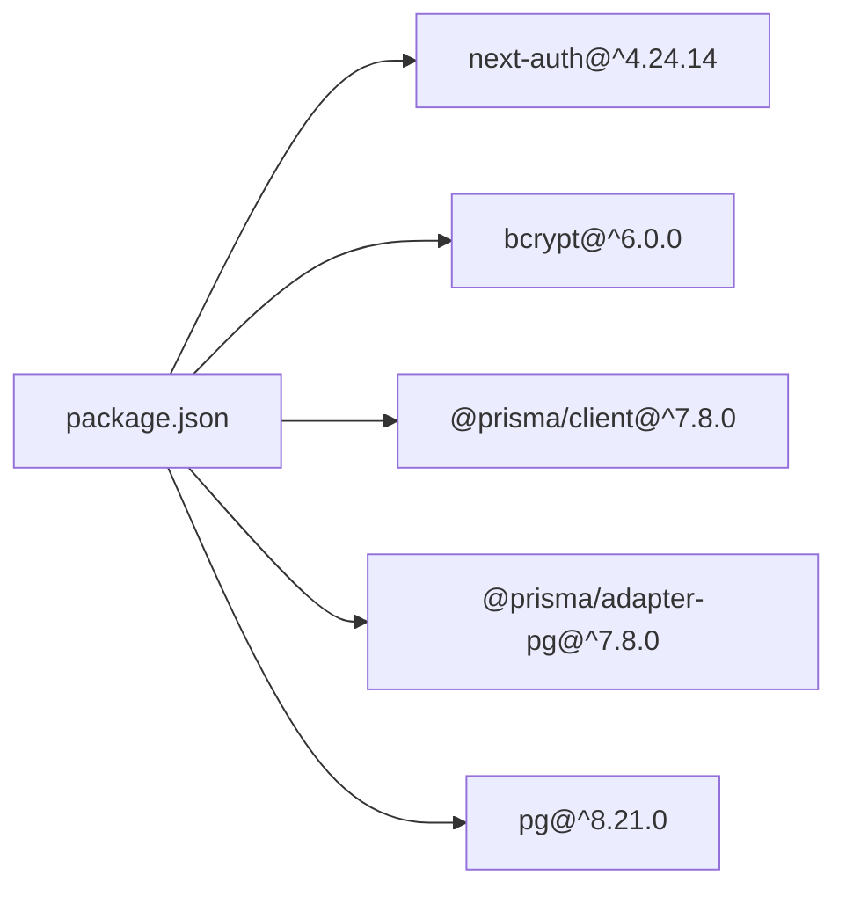

# Authentication Endpoints

<cite>
**Referenced Files in This Document**
- [route.ts](file://src/app/api/auth/[...nextauth]/route.ts)
- [auth.ts](file://src/lib/auth.ts)
- [next-auth.d.ts](file://types/next-auth.d.ts)
- [prisma.ts](file://src/lib/prisma.ts)
- [schema.prisma](file://prisma/schema.prisma)
- [page.tsx](file://src/app/login/page.tsx)
- [Sidebar.tsx](file://src/components/dashboard/Sidebar.tsx)
- [proxy.ts](file://src/proxy.ts)
- [permissions.ts](file://src/lib/permissions.ts)
- [package.json](file://package.json)
</cite>

## Table of Contents
1. [Introduction](#introduction)
2. [Project Structure](#project-structure)
3. [Core Components](#core-components)
4. [Architecture Overview](#architecture-overview)
5. [Detailed Component Analysis](#detailed-component-analysis)
6. [Dependency Analysis](#dependency-analysis)
7. [Performance Considerations](#performance-considerations)
8. [Troubleshooting Guide](#troubleshooting-guide)
9. [Conclusion](#conclusion)

## Introduction
This document provides comprehensive API documentation for the authentication system built with NextAuth.js. It covers the NextAuth.js integration, OAuth flows, session management, token handling, authentication middleware, credential validation, user session lifecycle, request/response schemas, session refresh mechanisms, permission checking, supported authentication providers, and custom credential handling. It also includes examples of authentication headers, error responses for invalid credentials, and security considerations.

## Project Structure
The authentication system is organized around a single NextAuth.js route handler that exposes NextAuth endpoints, a configuration module that defines providers and callbacks, TypeScript module augmentations for session typings, a Prisma client wrapper for database access, and a middleware-based authorization guard for protected routes.

**Diagram sources**
- [route.ts:1-7](file://src/app/api/auth/[...nextauth]/route.ts#L1-L7)
- [auth.ts:1-81](file://src/lib/auth.ts#L1-L81)
- [next-auth.d.ts:1-19](file://types/next-auth.d.ts#L1-L19)
- [prisma.ts:1-31](file://src/lib/prisma.ts#L1-L31)
- [schema.prisma:10-25](file://prisma/schema.prisma#L10-L25)
- [page.tsx:1-117](file://src/app/login/page.tsx#L1-L117)
- [Sidebar.tsx:393-400](file://src/components/dashboard/Sidebar.tsx#L393-L400)
- [proxy.ts:1-59](file://src/proxy.ts#L1-L59)
- [permissions.ts:1-21](file://src/lib/permissions.ts#L1-L21)

**Section sources**
- [route.ts:1-7](file://src/app/api/auth/[...nextauth]/route.ts#L1-L7)
- [auth.ts:1-81](file://src/lib/auth.ts#L1-L81)
- [next-auth.d.ts:1-19](file://types/next-auth.d.ts#L1-L19)
- [prisma.ts:1-31](file://src/lib/prisma.ts#L1-L31)
- [schema.prisma:10-25](file://prisma/schema.prisma#L10-L25)
- [page.tsx:1-117](file://src/app/login/page.tsx#L1-L117)
- [Sidebar.tsx:393-400](file://src/components/dashboard/Sidebar.tsx#L393-L400)
- [proxy.ts:1-59](file://src/proxy.ts#L1-L59)
- [permissions.ts:1-21](file://src/lib/permissions.ts#L1-L21)

## Core Components
- NextAuth Route Handler: Exposes NextAuth endpoints under the path `/api/auth/[...nextauth]`. It initializes NextAuth with configured options and exports handlers for GET and POST requests.
- Auth Options: Defines the Credentials provider, JWT/session callbacks, pages configuration, session strategy, and secret.
- Session Typings: Augments NextAuth types to include user role, permissions, and optional satker ID.
- Prisma Client: Provides a singleton Prisma client connected via PostgreSQL adapter for database operations.
- Middleware Authorization: Enforces route-level permissions using NextAuth middleware and a route-to-permission mapping.
- Permission Helpers: Provides server-side helpers to check and enforce permissions during SSR/SSG and API routes.

**Section sources**
- [route.ts:1-7](file://src/app/api/auth/[...nextauth]/route.ts#L1-L7)
- [auth.ts:6-80](file://src/lib/auth.ts#L6-L80)
- [next-auth.d.ts:3-18](file://types/next-auth.d.ts#L3-L18)
- [prisma.ts:5-28](file://src/lib/prisma.ts#L5-L28)
- [proxy.ts:4-55](file://src/proxy.ts#L4-L55)
- [permissions.ts:4-20](file://src/lib/permissions.ts#L4-L20)

## Architecture Overview
The authentication architecture integrates NextAuth.js with a custom Credentials provider backed by a PostgreSQL database via Prisma. Sessions are stored using JWT strategy, and middleware enforces route-level permissions derived from user roles.

**Diagram sources**
- [page.tsx:16-34](file://src/app/login/page.tsx#L16-L34)
- [route.ts:1-7](file://src/app/api/auth/[...nextauth]/route.ts#L1-L7)
- [auth.ts:14-50](file://src/lib/auth.ts#L14-L50)
- [prisma.ts:1-31](file://src/lib/prisma.ts#L1-L31)
- [schema.prisma:10-25](file://prisma/schema.prisma#L10-L25)

## Detailed Component Analysis

### NextAuth Route Handler
- Purpose: Initialize NextAuth with configured options and expose GET/POST handlers for NextAuth endpoints.
- Behavior: Delegates all NextAuth actions to the NextAuth runtime using the exported handler.

**Section sources**
- [route.ts:1-7](file://src/app/api/auth/[...nextauth]/route.ts#L1-L7)

### Auth Options (Credentials Provider, Callbacks, Pages, Session)
- Providers:
  - Credentials provider with email and password fields.
- authorize(credentials):
  - Validates presence of credentials.
  - Fetches user with role and permissions.
  - Compares password hash.
  - Returns user payload with role, permissions, and optional satkerId.
- callbacks.jwt:
  - Stores role, permissions, id, and satkerId on the JWT token.
- callbacks.session:
  - Injects role, permissions, id, and satkerId into the session object.
- pages.signIn:
  - Redirects unauthenticated users to the login page.
- session.strategy:
  - Uses JWT for session storage.
- secret:
  - Uses NEXTAUTH_SECRET environment variable.

**Diagram sources**
- [auth.ts:14-50](file://src/lib/auth.ts#L14-L50)

**Section sources**
- [auth.ts:6-80](file://src/lib/auth.ts#L6-L80)

### Session Typings (Module Augmentation)
- Extends NextAuth Session and User interfaces to include:
  - user.id: string
  - user.role: string
  - user.permissions: string[]
  - user.satkerId?: string

**Section sources**
- [next-auth.d.ts:3-18](file://types/next-auth.d.ts#L3-L18)

### Prisma Client and Database Schema
- Prisma Client:
  - Singleton pattern with PostgreSQL adapter.
  - Uses DATABASE_URL environment variable.
  - Limits connections for serverless environments.
- Relevant Models:
  - User: id, name, email, password, roleId, satkerId, timestamps.
  - Role: id, name, isSystem, timestamps.
  - RolePermission: composite relation between Role and Permission.
  - Permission: id, module, action, code, description.

**Diagram sources**
- [schema.prisma:10-25](file://prisma/schema.prisma#L10-L25)
- [schema.prisma:165-173](file://prisma/schema.prisma#L165-L173)
- [schema.prisma:175-184](file://prisma/schema.prisma#L175-L184)
- [schema.prisma:186-193](file://prisma/schema.prisma#L186-L193)
- [schema.prisma:103-113](file://prisma/schema.prisma#L103-L113)

**Section sources**
- [prisma.ts:5-28](file://src/lib/prisma.ts#L5-L28)
- [schema.prisma:10-25](file://prisma/schema.prisma#L10-L25)
- [schema.prisma:165-184](file://prisma/schema.prisma#L165-L184)

### Login Endpoint and Client-Side Flow
- Client-side login:
  - Captures email and password.
  - Calls signIn("credentials", { email, password, redirect: false }).
  - Handles error response and redirects on success.
- NextAuth endpoint:
  - Receives credentials and delegates to authOptions.authorize.

**Diagram sources**
- [page.tsx:16-34](file://src/app/login/page.tsx#L16-L34)
- [route.ts:1-7](file://src/app/api/auth/[...nextauth]/route.ts#L1-L7)
- [auth.ts:14-50](file://src/lib/auth.ts#L14-L50)

**Section sources**
- [page.tsx:16-34](file://src/app/login/page.tsx#L16-L34)
- [route.ts:1-7](file://src/app/api/auth/[...nextauth]/route.ts#L1-L7)
- [auth.ts:14-50](file://src/lib/auth.ts#L14-L50)

### Logout Endpoint and Client-Side Sign Out
- Client-side logout:
  - Uses signOut({ callbackUrl: "/login" }) to invalidate session and redirect.
- NextAuth endpoint:
  - Exposes NextAuth handlers that manage session termination.

**Section sources**
- [Sidebar.tsx:393-400](file://src/components/dashboard/Sidebar.tsx#L393-L400)
- [route.ts:1-7](file://src/app/api/auth/[...nextauth]/route.ts#L1-L7)

### Authentication Middleware and Permission Checking
- Middleware:
  - Uses withAuth to protect routes under /dashboard.
  - Extracts user permissions from the JWT token.
  - Enforces route-specific permissions via a mapping.
  - Redirects to forbidden page if unauthorized.
- Permission Helpers:
  - hasPermission(action): checks if the current session has a given permission.
  - requirePermission(action): throws an error if missing permission.
  - hasPermissionClient(permissions, action): client-side helper.

**Diagram sources**
- [proxy.ts:25-55](file://src/proxy.ts#L25-L55)
- [permissions.ts:4-20](file://src/lib/permissions.ts#L4-L20)

**Section sources**
- [proxy.ts:4-55](file://src/proxy.ts#L4-L55)
- [permissions.ts:1-21](file://src/lib/permissions.ts#L1-L21)

### Supported Authentication Providers
- Credentials Provider:
  - Email/password authentication with bcrypt comparison.
  - Returns user payload enriched with role and permissions.
- OAuth Providers:
  - No OAuth providers are configured in the current setup.
  - The configuration supports adding OAuth providers by extending the providers array.

**Section sources**
- [auth.ts:7-52](file://src/lib/auth.ts#L7-L52)

### Custom Credential Handling
- authorize(credentials):
  - Validates presence of email and password.
  - Loads user with role and nested permissions.
  - Compares password hash.
  - Returns structured user payload for JWT/session injection.

**Section sources**
- [auth.ts:14-50](file://src/lib/auth.ts#L14-L50)

### Session Management and Token Handling
- Strategy:
  - JWT strategy is enabled.
- Storage:
  - Token stored in browser cookies managed by NextAuth.
- Refresh:
  - NextAuth handles automatic token refresh based on configured sliding window and max age.
- Session Payload:
  - Includes id, email, name, role, permissions, and optional satkerId.

**Section sources**
- [auth.ts:76-80](file://src/lib/auth.ts#L76-L80)
- [auth.ts:54-71](file://src/lib/auth.ts#L54-L71)

### Request/Response Schemas

- Login Request (Client → NextAuth Route)
  - Method: POST
  - Path: /api/auth/callback/credentials
  - Body:
    - email: string
    - password: string
  - Headers:
    - Content-Type: application/json
  - Response:
    - Success: Redirects to dashboard or returns { error: null }
    - Failure: Returns { error: "Invalid email or password" }

- Logout Request (Client → NextAuth Route)
  - Method: GET/POST
  - Path: /api/auth/signout
  - Query/Body:
    - callbackUrl: string (optional)
  - Response:
    - Redirects to callbackUrl or login page

- Session Refresh
  - Triggered automatically by NextAuth when the JWT expires or near expiry.
  - Client receives updated token via cookie updates.

- Permission Checking
  - Server-side: hasPermission(action) returns boolean.
  - Client-side: hasPermissionClient(permissions, action) returns boolean.

**Section sources**
- [page.tsx:16-34](file://src/app/login/page.tsx#L16-L34)
- [route.ts:1-7](file://src/app/api/auth/[...nextauth]/route.ts#L1-L7)
- [permissions.ts:4-20](file://src/lib/permissions.ts#L4-L20)

### Examples

- Authentication Headers
  - Cookie header containing NextAuth JWT cookie.
  - Authorization header is not used by this JWT-based setup.

- Error Responses for Invalid Credentials
  - Client receives { error: "Invalid email or password" } on failed login.

- Permission Denied
  - Middleware redirects to /dashboard/forbidden when user lacks required permission.

**Section sources**
- [page.tsx:27-30](file://src/app/login/page.tsx#L27-L30)
- [proxy.ts:37-40](file://src/proxy.ts#L37-L40)

## Dependency Analysis
- NextAuth.js Version: 4.24.14
- Dependencies:
  - next-auth: ^4.24.14
  - bcrypt: ^6.0.0
  - @prisma/client: ^7.8.0
  - @prisma/adapter-pg: ^7.8.0
  - pg: ^8.21.0

**Diagram sources**
- [package.json:12-32](file://package.json#L12-L32)

**Section sources**
- [package.json:12-32](file://package.json#L12-L32)

## Performance Considerations
- Database Connections:
  - Prisma client limits concurrent connections to 1 per serverless instance to reduce contention.
- Password Hashing:
  - bcrypt is computationally intensive; ensure appropriate server resources.
- Session Strategy:
  - JWT strategy avoids database reads for subsequent requests but increases cookie size; keep claims minimal.

[No sources needed since this section provides general guidance]

## Troubleshooting Guide
- Missing NEXTAUTH_SECRET:
  - Symptom: NextAuth initialization errors.
  - Resolution: Set NEXTAUTH_SECRET environment variable.

- Invalid Credentials:
  - Symptom: Login form displays "Invalid email or password".
  - Resolution: Verify email exists and password matches hash.

- Permission Denied:
  - Symptom: Redirect to forbidden page.
  - Resolution: Ensure user role includes required permission code.

- Database URL Not Defined:
  - Symptom: Prisma client throws error.
  - Resolution: Set DATABASE_URL environment variable.

**Section sources**
- [auth.ts:79-80](file://src/lib/auth.ts#L79-L80)
- [page.tsx:27-30](file://src/app/login/page.tsx#L27-L30)
- [proxy.ts:37-40](file://src/proxy.ts#L37-L40)
- [prisma.ts:7-9](file://src/lib/prisma.ts#L7-L9)

## Conclusion
The authentication system leverages NextAuth.js with a custom Credentials provider, JWT-based sessions, and middleware-driven permission enforcement. It securely validates credentials against hashed passwords, enriches tokens with role and permissions, and protects routes using a declarative permission mapping. The architecture is modular, maintainable, and extensible for future OAuth integrations.