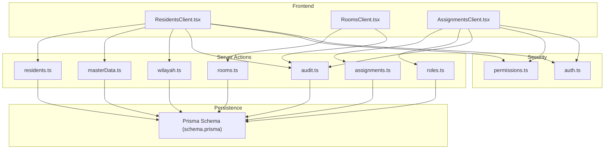
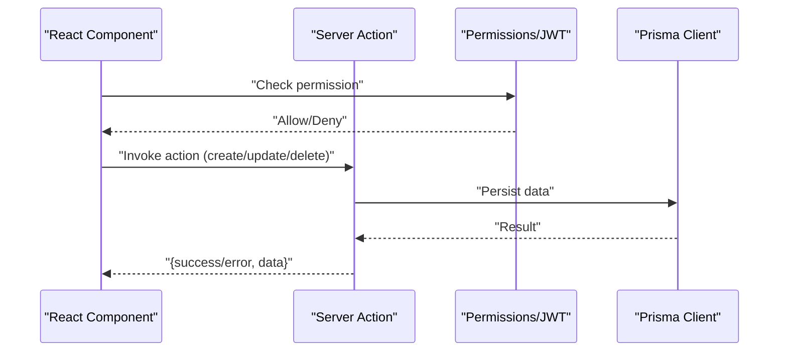
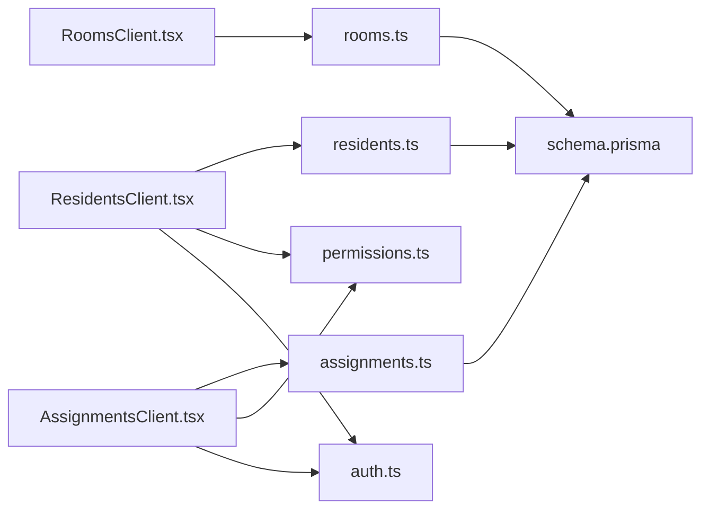

# CRUD Operation Endpoints

<cite>
**Referenced Files in This Document**
- [residents.ts](file://src/app/actions/residents.ts)
- [rooms.ts](file://src/app/actions/rooms.ts)
- [assignments.ts](file://src/app/actions/assignments.ts)
- [masterData.ts](file://src/app/actions/masterData.ts)
- [roles.ts](file://src/app/actions/roles.ts)
- [audit.ts](file://src/app/actions/audit.ts)
- [wilayah.ts](file://src/app/actions/wilayah.ts)
- [schema.prisma](file://prisma/schema.prisma)
- [auth.ts](file://src/lib/auth.ts)
- [permissions.ts](file://src/lib/permissions.ts)
- [ResidentsClient.tsx](file://src/components/dashboard/ResidentsClient.tsx)
- [RoomsClient.tsx](file://src/components/dashboard/RoomsClient.tsx)
- [AssignmentsClient.tsx](file://src/components/dashboard/AssignmentsClient.tsx)
</cite>

## Table of Contents
1. [Introduction](#introduction)
2. [Project Structure](#project-structure)
3. [Core Components](#core-components)
4. [Architecture Overview](#architecture-overview)
5. [Detailed Component Analysis](#detailed-component-analysis)
6. [Dependency Analysis](#dependency-analysis)
7. [Performance Considerations](#performance-considerations)
8. [Troubleshooting Guide](#troubleshooting-guide)
9. [Conclusion](#conclusion)

## Introduction
This document describes the CRUD operation endpoints and related APIs for major entities in the application. It covers:
- Residents (students), Rooms (dormitories), Assignments (student work units), Academic data (faculties, programs, cohorts), Administrative records (roles, permissions, audit logs), and Geographic reference data (countries, provinces, regencies, districts, villages).
- HTTP methods, URL patterns, request/response formats, filtering, pagination, sorting, bulk operations, validation, and error handling.
- Data relationships, foreign keys, and cascade behaviors.
- Access control via permissions and authentication.

Note: The backend uses Next.js Server Actions rather than traditional REST endpoints. API surfaces are exposed via React components that call server action functions. Authentication uses JWT via NextAuth, and access control is enforced via permission checks.

## Project Structure
The application follows a feature-based structure with server actions encapsulating CRUD logic and React components orchestrating UI and user interactions.

**Diagram sources**
- [ResidentsClient.tsx:1-327](file://src/components/dashboard/ResidentsClient.tsx#L1-L327)
- [RoomsClient.tsx:1-433](file://src/components/dashboard/RoomsClient.tsx#L1-L433)
- [AssignmentsClient.tsx:1-866](file://src/components/dashboard/AssignmentsClient.tsx#L1-L866)
- [residents.ts:1-666](file://src/app/actions/residents.ts#L1-L666)
- [rooms.ts:1-118](file://src/app/actions/rooms.ts#L1-L118)
- [assignments.ts:1-215](file://src/app/actions/assignments.ts#L1-L215)
- [masterData.ts:1-191](file://src/app/actions/masterData.ts#L1-L191)
- [roles.ts:1-119](file://src/app/actions/roles.ts#L1-L119)
- [audit.ts:1-118](file://src/app/actions/audit.ts#L1-L118)
- [wilayah.ts:1-326](file://src/app/actions/wilayah.ts#L1-L326)
- [schema.prisma:1-487](file://prisma/schema.prisma#L1-L487)
- [auth.ts:1-81](file://src/lib/auth.ts#L1-L81)
- [permissions.ts:1-21](file://src/lib/permissions.ts#L1-L21)

**Section sources**
- [ResidentsClient.tsx:1-327](file://src/components/dashboard/ResidentsClient.tsx#L1-L327)
- [RoomsClient.tsx:1-433](file://src/components/dashboard/RoomsClient.tsx#L1-L433)
- [AssignmentsClient.tsx:1-866](file://src/components/dashboard/AssignmentsClient.tsx#L1-L866)
- [residents.ts:1-666](file://src/app/actions/residents.ts#L1-L666)
- [rooms.ts:1-118](file://src/app/actions/rooms.ts#L1-L118)
- [assignments.ts:1-215](file://src/app/actions/assignments.ts#L1-L215)
- [masterData.ts:1-191](file://src/app/actions/masterData.ts#L1-L191)
- [roles.ts:1-119](file://src/app/actions/roles.ts#L1-L119)
- [audit.ts:1-118](file://src/app/actions/audit.ts#L1-L118)
- [wilayah.ts:1-326](file://src/app/actions/wilayah.ts#L1-L326)
- [schema.prisma:1-487](file://prisma/schema.prisma#L1-L487)
- [auth.ts:1-81](file://src/lib/auth.ts#L1-L81)
- [permissions.ts:1-21](file://src/lib/permissions.ts#L1-L21)

## Core Components
- Residents: Student profiles, dormitory assignment, academic program linkage, and audit logging on updates.
- Rooms: Dormitory management with occupancy and maintenance statuses.
- Assignments: Student placement into organizational units (Satker) with roles and dates.
- Academic Data: Faculties, Programs, Cohorts with hierarchical relationships.
- Administrative Records: Roles, Permissions, and Audit Logs.
- Geographic Reference: Countries, Provinces, Regencies, Districts, Villages with cascading deletes.

Response format: Server actions return either:
- `{ success: true, data }` on successful operations.
- `{ error: "message" }` on failures.
- Pagination-aware lists for geographic reference data.

Access control: Permission checks via `hasPermission` guard the retrieval and mutation of protected resources.

**Section sources**
- [residents.ts:76-475](file://src/app/actions/residents.ts#L76-L475)
- [rooms.ts:7-117](file://src/app/actions/rooms.ts#L7-L117)
- [assignments.ts:15-214](file://src/app/actions/assignments.ts#L15-L214)
- [masterData.ts:7-191](file://src/app/actions/masterData.ts#L7-L191)
- [roles.ts:7-118](file://src/app/actions/roles.ts#L7-L118)
- [audit.ts:8-117](file://src/app/actions/audit.ts#L8-L117)
- [wilayah.ts:29-325](file://src/app/actions/wilayah.ts#L29-L325)
- [permissions.ts:4-20](file://src/lib/permissions.ts#L4-L20)

## Architecture Overview
The system uses Next.js Server Actions invoked by client components. Authentication relies on JWT via NextAuth. Authorization is enforced by checking user permissions against a permission matrix.

**Diagram sources**
- [ResidentsClient.tsx:77-110](file://src/components/dashboard/ResidentsClient.tsx#L77-L110)
- [RoomsClient.tsx:79-121](file://src/components/dashboard/RoomsClient.tsx#L79-L121)
- [AssignmentsClient.tsx:237-335](file://src/components/dashboard/AssignmentsClient.tsx#L237-L335)
- [permissions.ts:4-20](file://src/lib/permissions.ts#L4-L20)
- [auth.ts:6-80](file://src/lib/auth.ts#L6-L80)
- [residents.ts:143-244](file://src/app/actions/residents.ts#L143-L244)
- [rooms.ts:26-51](file://src/app/actions/rooms.ts#L26-L51)
- [assignments.ts:128-173](file://src/app/actions/assignments.ts#L128-L173)

## Detailed Component Analysis

### Residents
- Purpose: Manage student profiles, dormitory assignments, and academic affiliations.
- Validation: Required fields, date format, gender normalization, uniqueness of NIM/NIUP, room capacity and status checks.
- Bulk Operations: Import template-driven batch creation and bulk delete/move.
- Audit: Automatic audit log entries on updates with field diffs.

Endpoints (via Server Actions):
- GET /api/residents (via getResidents)
  - Method: GET
  - URL pattern: Not a REST endpoint; accessed via getResidents server action
  - Query: None
  - Response: Array of residents with nested room and assignments
  - Sorting: Name ascending
- POST /api/residents (via createResident)
  - Method: POST
  - URL pattern: Not a REST endpoint; accessed via createResident server action
  - Request body: Resident fields including personal, contact, academic, origin, and optional room assignment
  - Response: `{ success: true, resident }` or `{ error: string }`
  - Validation: Required fields, date validation, gender normalization, uniqueness, room availability
- PUT /api/residents/:id (via updateResident)
  - Method: PUT
  - URL pattern: Not a REST endpoint; accessed via updateResident server action
  - Path params: id
  - Request body: Same as create plus optional room change
  - Response: `{ success: true, resident }` or `{ error: string }`
  - Validation: Same as create, plus room capacity checks and audit diff logging
- DELETE /api/residents/:id (via deleteResident)
  - Method: DELETE
  - URL pattern: Not a REST endpoint; accessed via deleteResident server action
  - Path params: id
  - Response: `{ success: true }` or `{ error: string }`
  - Behavior: Frees room status to AVAILABLE
- Bulk POST /api/residents/bulk-create (via bulkCreateResidents)
  - Method: POST
  - URL pattern: Not a REST endpoint; accessed via bulkCreateResidents server action
  - Request body: Array of resident rows with optional room number resolution
  - Response: `{ success: true, successCount, skippedCount }`
- Bulk DELETE /api/residents/bulk-delete (via bulkDeleteResidents)
  - Method: DELETE
  - URL pattern: Not a REST endpoint; accessed via bulkDeleteResidents server action
  - Request body: Array of ids
  - Response: `{ success: true }`
- Bulk PUT /api/residents/bulk-move (via bulkMoveResidents)
  - Method: PUT
  - URL pattern: Not a REST endpoint; accessed via bulkMoveResidents server action
  - Request body: `{ ids: string[], roomId?: string }`
  - Response: `{ success: true }` or `{ error: string }`

Filtering, Pagination, Sorting:
- Filtering: UI-level filters in ResidentsClient (search, region/prodi/angkatan/kamar)
- Pagination: Not applicable for residents server action; UI paginates client-side
- Sorting: Server action sorts by name asc; UI supports additional client-side sorting

Examples:
- Success response: `{ success: true, resident: Resident }`
- Validation error: `{ error: "Tanggal Lahir harus memakai format tanggal yang valid, contoh 2000-01-31." }`
- Bulk success: `{ success: true, successCount: 10, skippedCount: 2 }`

Data Relationships and Constraints:
- Room: One-to-many with Resident; room capacity checked on create/update/move
- Assignments: One-to-many with Resident; cascade delete on resident removal
- Academic relations: fakultasId/prodiId/angkatanId link to respective entities

**Section sources**
- [residents.ts:76-475](file://src/app/actions/residents.ts#L76-L475)
- [residents.ts:477-665](file://src/app/actions/residents.ts#L477-L665)
- [schema.prisma:44-101](file://prisma/schema.prisma#L44-L101)
- [schema.prisma:115-131](file://prisma/schema.prisma#L115-L131)
- [ResidentsClient.tsx:77-110](file://src/components/dashboard/ResidentsClient.tsx#L77-L110)

### Rooms
- Purpose: Manage dormitory inventory and occupancy status.
- Validation: Unique room number, capacity and floor numeric conversion, status enum.

Endpoints (via Server Actions):
- GET /api/rooms (via getRooms)
  - Method: GET
  - URL pattern: Not a REST endpoint; accessed via getRooms server action
  - Query: None
  - Response: Array of rooms with nested residents
  - Sorting: Number ascending
- POST /api/rooms (via createRoom)
  - Method: POST
  - URL pattern: Not a REST endpoint; accessed via createRoom server action
  - Request body: `{ number, floor, capacity, status }`
  - Response: `{ success: true, room }` or `{ error: string }`
  - Validation: Unique room number
- PUT /api/rooms/:id (via updateRoom)
  - Method: PUT
  - URL pattern: Not a REST endpoint; accessed via updateRoom server action
  - Path params: id
  - Request body: `{ number, floor, capacity, status }`
  - Response: `{ success: true, room }` or `{ error: string }`
  - Validation: Unique room number (excluding self)
- DELETE /api/rooms/:id (via deleteRoom)
  - Method: DELETE
  - URL pattern: Not a REST endpoint; accessed via deleteRoom server action
  - Path params: id
  - Response: `{ success: true }` or `{ error: string }`
  - Validation: Cannot delete if residents assigned

Filtering, Pagination, Sorting:
- Filtering: UI-level search by room number
- Pagination: Not applicable for rooms server action; UI paginates client-side
- Sorting: Server action sorts by number asc

Examples:
- Success response: `{ success: true, room: Room }`
- Error: `{ error: "Cannot delete room. There are residents currently assigned to this room." }`

Data Relationships and Constraints:
- Residents: One-to-many; deletion blocked if any resident assigned

**Section sources**
- [rooms.ts:7-117](file://src/app/actions/rooms.ts#L7-L117)
- [schema.prisma:27-42](file://prisma/schema.prisma#L27-L42)
- [schema.prisma:44-96](file://prisma/schema.prisma#L44-L96)
- [RoomsClient.tsx:79-121](file://src/components/dashboard/RoomsClient.tsx#L79-L121)

### Assignments
- Purpose: Place students into organizational units (Satker) with roles and timeframes.
- Validation: Prevents duplicate active assignment for the same resident-Satker pair.

Endpoints (via Server Actions):
- GET /api/assignments (via getAssignments)
  - Method: GET
  - URL pattern: Not a REST endpoint; accessed via getAssignments server action
  - Query: None
  - Response: Array of assignments with nested resident and satker
  - Sorting: Created desc
- GET /api/satkers (via getSatkers)
  - Method: GET
  - URL pattern: Not a REST endpoint; accessed via getSatkers server action
  - Query: None
  - Response: Array of satkers with nested assignments
  - Sorting: Name asc
- POST /api/satkers (via createSatker)
  - Method: POST
  - URL pattern: Not a REST endpoint; accessed via createSatker server action
  - Request body: `{ name, picName, picPhone? }`
  - Response: `{ success: true, satker }` or `{ error: string }`
  - Validation: Unique name
- PUT /api/satkers/:id (via updateSatker)
  - Method: PUT
  - URL pattern: Not a REST endpoint; accessed via updateSatker server action
  - Path params: id
  - Request body: `{ name, picName, picPhone? }`
  - Response: `{ success: true, satker }` or `{ error: string }`
  - Validation: Unique name (excluding self)
- DELETE /api/satkers/:id (via deleteSatker)
  - Method: DELETE
  - URL pattern: Not a REST endpoint; accessed via deleteSatker server action
  - Path params: id
  - Response: `{ success: true }` or `{ error: string }`
  - Behavior: Deletes all related assignments (cascade)
- POST /api/assignments (via createAssignment)
  - Method: POST
  - URL pattern: Not a REST endpoint; accessed via createAssignment server action
  - Request body: `{ residentId, satkerId, position?, status?, startDate?, endDate? }`
  - Response: `{ success: true, assignment }` or `{ error: string }`
  - Validation: Prevents duplicate active assignment
- PUT /api/assignments/:id (via updateAssignment)
  - Method: PUT
  - URL pattern: Not a REST endpoint; accessed via updateAssignment server action
  - Path params: id
  - Request body: Same as create
  - Response: `{ success: true, assignment }` or `{ error: string }`
- DELETE /api/assignments/:id (via deleteAssignment)
  - Method: DELETE
  - URL pattern: Not a REST endpoint; accessed via deleteAssignment server action
  - Path params: id
  - Response: `{ success: true }` or `{ error: string }`

Filtering, Pagination, Sorting:
- Filtering: UI-level search by resident name/NIM/satker/position
- Pagination: Not applicable for assignments server action; UI paginates client-side
- Sorting: Assignments ordered by created desc; Satkers by name asc

Examples:
- Success response: `{ success: true, assignment: Assignment }`
- Error: `{ error: "Santri tersebut sudah terdaftar aktif di Satuan Kerja ini." }`

Data Relationships and Constraints:
- Assignment: Foreign keys residentId/satkerId; cascade delete on resident/satker removal
- Satker: One-to-many with Assignment; cascade delete removes assignments

**Section sources**
- [assignments.ts:15-214](file://src/app/actions/assignments.ts#L15-L214)
- [schema.prisma:103-131](file://prisma/schema.prisma#L103-L131)
- [AssignmentsClient.tsx:237-335](file://src/components/dashboard/AssignmentsClient.tsx#L237-L335)

### Academic Data (Master Data)
- Faculties, Programs, Cohorts with hierarchical relationships and unique constraints.
- CRUD operations for each entity with unique-name enforcement.

Endpoints (via Server Actions):
- GET /api/academic/faculty (via getFakultas)
  - Method: GET
  - URL pattern: Not a REST endpoint; accessed via getFakultas server action
  - Response: Array of faculties
- POST /api/academic/faculty (via createFakultas)
  - Method: POST
  - URL pattern: Not a REST endpoint; accessed via createFakultas server action
  - Request body: `{ name }`
  - Response: `{ success: true, data }` or `{ error: string }`
- PUT /api/academic/faculty/:id (via updateFakultas)
  - Method: PUT
  - URL pattern: Not a REST endpoint; accessed via updateFakultas server action
  - Path params: id
  - Request body: `{ name }`
  - Response: `{ success: true, data }` or `{ error: string }`
- DELETE /api/academic/faculty/:id (via deleteFakultas)
  - Method: DELETE
  - URL pattern: Not a REST endpoint; accessed via deleteFakultas server action
  - Path params: id
  - Response: `{ success: true }` or `{ error: string }`
- GET /api/academic/program (via getProdi)
  - Method: GET
  - URL pattern: Not a REST endpoint; accessed via getProdi server action
  - Response: Array of programs
- POST /api/academic/program (via createProdi)
  - Method: POST
  - URL pattern: Not a REST endpoint; accessed via createProdi server action
  - Request body: `{ name, fakultasId }`
  - Response: `{ success: true, data }` or `{ error: string }`
- PUT /api/academic/program/:id (via updateProdi)
  - Method: PUT
  - URL pattern: Not a REST endpoint; accessed via updateProdi server action
  - Path params: id
  - Request body: `{ name, fakultasId }`
  - Response: `{ success: true, data }` or `{ error: string }`
- DELETE /api/academic/program/:id (via deleteProdi)
  - Method: DELETE
  - URL pattern: Not a REST endpoint; accessed via deleteProdi server action
  - Path params: id
  - Response: `{ success: true }` or `{ error: string }`
- GET /api/academic/cohort (via getAngkatan)
  - Method: GET
  - URL pattern: Not a REST endpoint; accessed via getAngkatan server action
  - Response: Array of cohorts
- POST /api/academic/cohort (via createAngkatan)
  - Method: POST
  - URL pattern: Not a REST endpoint; accessed via createAngkatan server action
  - Request body: `{ name, prodiId }`
  - Response: `{ success: true, data }` or `{ error: string }`
- PUT /api/academic/cohort/:id (via updateAngkatan)
  - Method: PUT
  - URL pattern: Not a REST endpoint; accessed via updateAngkatan server action
  - Path params: id
  - Request body: `{ name, prodiId }`
  - Response: `{ success: true, data }` or `{ error: string }`
- DELETE /api/academic/cohort/:id (via deleteAngkatan)
  - Method: DELETE
  - URL pattern: Not a REST endpoint; accessed via deleteAngkatan server action
  - Path params: id
  - Response: `{ success: true }` or `{ error: string }`

Filtering, Pagination, Sorting:
- Not applicable; returned arrays are sorted by name asc.

Examples:
- Success response: `{ success: true, data: Entity }`
- Error: `{ error: "Prodi sudah ada di fakultas ini." }`

Data Relationships and Constraints:
- Program belongs to Faculty; Cohort belongs to Program; cascade deletes propagate to dependent entities

**Section sources**
- [masterData.ts:82-191](file://src/app/actions/masterData.ts#L82-L191)
- [schema.prisma:326-358](file://prisma/schema.prisma#L326-L358)

### Administrative Records (Roles, Permissions, Audit)
- Roles and Permissions: CRUD for roles with permission attachments and system role protections.
- Audit Logs: Retrieve entity-specific logs and global audit logs with filtering and pagination.

Endpoints (via Server Actions):
- GET /api/admin/roles (via getRoles)
  - Method: GET
  - URL pattern: Not a REST endpoint; accessed via getRoles server action
  - Response: Array of roles with permissions and user counts
  - Sorting: Created asc
- GET /api/admin/permissions (via getPermissions)
  - Method: GET
  - URL pattern: Not a REST endpoint; accessed via getPermissions server action
  - Response: Array of permissions
  - Sorting: Module asc
- POST /api/admin/roles (via createRole)
  - Method: POST
  - URL pattern: Not a REST endpoint; accessed via createRole server action
  - Request body: `{ name, permissions: string[] }`
  - Response: `{ success: true, role }` or `{ error: string }`
- PUT /api/admin/roles/:id (via updateRole)
  - Method: PUT
  - URL pattern: Not a REST endpoint; accessed via updateRole server action
  - Path params: id
  - Request body: `{ name, permissions: string[] }`
  - Response: `{ success: true }` or `{ error: string }`
  - Behavior: Prevents modifying system SUPER_ADMIN role
- DELETE /api/admin/roles/:id (via deleteRole)
  - Method: DELETE
  - URL pattern: Not a REST endpoint; accessed via deleteRole server action
  - Path params: id
  - Response: `{ success: true }` or `{ error: string }`
  - Behavior: Prevents deleting system roles and roles assigned to users
- GET /api/audit/logs (via getAuditLogs)
  - Method: GET
  - URL pattern: Not a REST endpoint; accessed via getAuditLogs server action
  - Query: page, limit, action, performedBy, entityType, dateFrom, dateTo, search
  - Response: `{ success: true, logs, total, totalPages, page }` or `{ error: string }`
  - Sorting: Created desc
- GET /api/audit/logs/:entityType/:entityId (via getEntityAuditLogs)
  - Method: GET
  - URL pattern: Not a REST endpoint; accessed via getEntityAuditLogs server action
  - Path params: entityType, entityId
  - Response: `{ success: true, logs }` or `{ error: string }`
  - Sorting: Created desc

Filtering, Pagination, Sorting:
- getAuditLogs supports pagination and multiple filters; search scans JSON fields.

Examples:
- Success response: `{ success: true, logs, total, totalPages, page }`
- Error: `{ error: "Unauthorized" }`

Data Relationships and Constraints:
- RolePermission: Junction table linking roles to permissions; cascade deletes on role/permission removal

**Section sources**
- [roles.ts:7-118](file://src/app/actions/roles.ts#L7-L118)
- [audit.ts:27-97](file://src/app/actions/audit.ts#L27-L97)
- [audit.ts:8-25](file://src/app/actions/audit.ts#L8-L25)
- [schema.prisma:165-193](file://prisma/schema.prisma#L165-L193)

### Geographic Reference Data (Countries, Provinces, Regencies, Districts, Villages)
- CRUD operations with unique constraints and cascading deletes.
- Pagination and search supported for lists.

Endpoints (via Server Actions):
- GET /api/referensi/countries (via getCountries)
  - Method: GET
  - URL pattern: Not a REST endpoint; accessed via getCountries server action
  - Query: search, page
  - Response: `{ data, total, totalPages }`
  - Sorting: Name asc
- POST /api/referensi/countries (via createCountry)
  - Method: POST
  - URL pattern: Not a REST endpoint; accessed via createCountry server action
  - Request body: `{ code, name }`
  - Response: `{ success: true }` or `{ error: string }`
- PUT /api/referensi/countries/:id (via updateCountry)
  - Method: PUT
  - URL pattern: Not a REST endpoint; accessed via updateCountry server action
  - Path params: id
  - Request body: `{ code, name }`
  - Response: `{ success: true }` or `{ error: string }`
- DELETE /api/referensi/countries/:id (via deleteCountry)
  - Method: DELETE
  - URL pattern: Not a REST endpoint; accessed via deleteCountry server action
  - Path params: id
  - Response: `{ success: true }` or `{ error: string }`
- GET /api/referensi/provinces (via getProvinces)
  - Method: GET
  - URL pattern: Not a REST endpoint; accessed via getProvinces server action
  - Query: search, page, countryId
  - Response: `{ data, total, totalPages }`
  - Sorting: Name asc
- POST /api/referensi/provinces (via createProvince)
  - Method: POST
  - URL pattern: Not a REST endpoint; accessed via createProvince server action
  - Request body: `{ code, name, countryId }`
  - Response: `{ success: true }` or `{ error: string }`
- PUT /api/referensi/provinces/:id (via updateProvince)
  - Method: PUT
  - URL pattern: Not a REST endpoint; accessed via updateProvince server action
  - Path params: id
  - Request body: `{ code, name, countryId }`
  - Response: `{ success: true }` or `{ error: string }`
- DELETE /api/referensi/provinces/:id (via deleteProvince)
  - Method: DELETE
  - URL pattern: Not a REST endpoint; accessed via deleteProvince server action
  - Path params: id
  - Response: `{ success: true }` or `{ error: string }`
- GET /api/referensi/regencies (via getRegencies)
  - Method: GET
  - URL pattern: Not a REST endpoint; accessed via getRegencies server action
  - Query: search, page, provinceId
  - Response: `{ data, total, totalPages }`
  - Sorting: Name asc
- POST /api/referensi/regencies (via createRegency)
  - Method: POST
  - URL pattern: Not a REST endpoint; accessed via createRegency server action
  - Request body: `{ code, name, provinceId }`
  - Response: `{ success: true }` or `{ error: string }`
- PUT /api/referensi/regencies/:id (via updateRegency)
  - Method: PUT
  - URL pattern: Not a REST endpoint; accessed via updateRegency server action
  - Path params: id
  - Request body: `{ code, name, provinceId }`
  - Response: `{ success: true }` or `{ error: string }`
- DELETE /api/referensi/regencies/:id (via deleteRegency)
  - Method: DELETE
  - URL pattern: Not a REST endpoint; accessed via deleteRegency server action
  - Path params: id
  - Response: `{ success: true }` or `{ error: string }`
- GET /api/referensi/districts (via getDistricts)
  - Method: GET
  - URL pattern: Not a REST endpoint; accessed via getDistricts server action
  - Query: search, page, regencyId
  - Response: `{ data, total, totalPages }`
  - Sorting: Name asc
- POST /api/referensi/districts (via createDistrict)
  - Method: POST
  - URL pattern: Not a REST endpoint; accessed via createDistrict server action
  - Request body: `{ code, name, regencyId }`
  - Response: `{ success: true }` or `{ error: string }`
- PUT /api/referensi/districts/:id (via updateDistrict)
  - Method: PUT
  - URL pattern: Not a REST endpoint; accessed via updateDistrict server action
  - Path params: id
  - Request body: `{ code, name, regencyId }`
  - Response: `{ success: true }` or `{ error: string }`
- DELETE /api/referensi/districts/:id (via deleteDistrict)
  - Method: DELETE
  - URL pattern: Not a REST endpoint; accessed via deleteDistrict server action
  - Path params: id
  - Response: `{ success: true }` or `{ error: string }`
- GET /api/referensi/villages (via getVillages)
  - Method: GET
  - URL pattern: Not a REST endpoint; accessed via getVillages server action
  - Query: search, page, districtId
  - Response: `{ data, total, totalPages }`
  - Sorting: Name asc
- POST /api/referensi/villages (via createVillage)
  - Method: POST
  - URL pattern: Not a REST endpoint; accessed via createVillage server action
  - Request body: `{ code, name, districtId }`
  - Response: `{ success: true }` or `{ error: string }`
- PUT /api/referensi/villages/:id (via updateVillage)
  - Method: PUT
  - URL pattern: Not a REST endpoint; accessed via updateVillage server action
  - Path params: id
  - Request body: `{ code, name, districtId }`
  - Response: `{ success: true }` or `{ error: string }`
- DELETE /api/referensi/villages/:id (via deleteVillage)
  - Method: DELETE
  - URL pattern: Not a REST endpoint; accessed via deleteVillage server action
  - Path params: id
  - Response: `{ success: true }` or `{ error: string }`
- POST /api/referensi/import (via importWilayah)
  - Method: POST
  - URL pattern: Not a REST endpoint; accessed via importWilayah server action
  - Request body: `{ rows: { code, name }[], type, parentId? }`
  - Response: `{ success: true, count }` or `{ error: string }`
  - Behavior: Transactional import with duplicate detection

Filtering, Pagination, Sorting:
- Search supports partial matches on name/code; pagination via page and ITEMS_PER_PAGE constant.

Examples:
- Success response: `{ success: true, data, total, totalPages }`
- Error: `{ error: "Terdapat duplikasi kode dalam file Excel." }`

Data Relationships and Constraints:
- Cascading deletes from Country -> Province -> Regency -> District -> Village
- Unique constraints on code/name combinations per level

**Section sources**
- [wilayah.ts:29-325](file://src/app/actions/wilayah.ts#L29-L325)
- [schema.prisma:380-453](file://prisma/schema.prisma#L380-L453)

## Dependency Analysis
Key dependencies and relationships:
- Server Actions depend on Prisma client for persistence.
- Access control depends on NextAuth JWT and permission checks.
- UI components orchestrate user interactions and call server actions.

**Diagram sources**
- [ResidentsClient.tsx:1-327](file://src/components/dashboard/ResidentsClient.tsx#L1-L327)
- [RoomsClient.tsx:1-433](file://src/components/dashboard/RoomsClient.tsx#L1-L433)
- [AssignmentsClient.tsx:1-866](file://src/components/dashboard/AssignmentsClient.tsx#L1-L866)
- [residents.ts:1-666](file://src/app/actions/residents.ts#L1-L666)
- [rooms.ts:1-118](file://src/app/actions/rooms.ts#L1-L118)
- [assignments.ts:1-215](file://src/app/actions/assignments.ts#L1-L215)
- [permissions.ts:1-21](file://src/lib/permissions.ts#L1-L21)
- [auth.ts:1-81](file://src/lib/auth.ts#L1-L81)
- [schema.prisma:1-487](file://prisma/schema.prisma#L1-L487)

**Section sources**
- [schema.prisma:1-487](file://prisma/schema.prisma#L1-L487)
- [permissions.ts:1-21](file://src/lib/permissions.ts#L1-L21)
- [auth.ts:1-81](file://src/lib/auth.ts#L1-L81)

## Performance Considerations
- Server actions execute synchronously; consider batching operations (e.g., bulk imports) to reduce round-trips.
- UI-level filtering reduces payload sizes; server actions return minimal necessary fields.
- Prisma queries include selective includes; avoid unnecessary nested relations to minimize overhead.
- Audit logging writes occur on updates; keep audit payloads concise to avoid excessive storage.

## Troubleshooting Guide
Common issues and resolutions:
- Permission Denied: Ensure the user has the required permission code; server actions throw or return unauthorized messages.
  - Example: `{ error: "Unauthorized" }` from audit logs retrieval.
- Validation Errors: Server actions return descriptive error messages for invalid inputs (dates, gender, uniqueness).
  - Examples: Invalid date format, duplicate NIM/NIUP, invalid gender values.
- Business Rule Violations: Room under maintenance, full capacity, or active assignment conflicts.
  - Examples: Selected room is under maintenance, room already at full capacity, duplicate active assignment.
- Deletion Conflicts: Entities with dependent records cannot be deleted.
  - Examples: Cannot delete room with assigned residents, cannot delete roles with users assigned.

**Section sources**
- [permissions.ts:11-16](file://src/lib/permissions.ts#L11-L16)
- [residents.ts:143-244](file://src/app/actions/residents.ts#L143-L244)
- [rooms.ts:92-117](file://src/app/actions/rooms.ts#L92-L117)
- [assignments.ts:128-173](file://src/app/actions/assignments.ts#L128-L173)
- [audit.ts:36-97](file://src/app/actions/audit.ts#L36-L97)

## Conclusion
The application exposes robust CRUD capabilities through Next.js Server Actions with strong validation, authorization, and audit trails. While not traditional REST endpoints, the server action surface provides a cohesive API for managing residents, rooms, assignments, academic data, administrative records, and geographic references. Pagination and filtering are primarily handled at the UI layer for most entities, while server actions enforce business rules and maintain referential integrity.