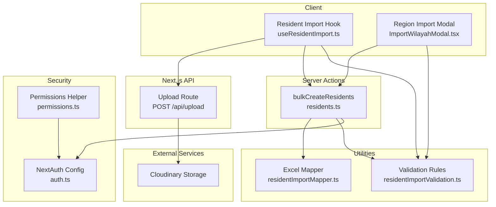
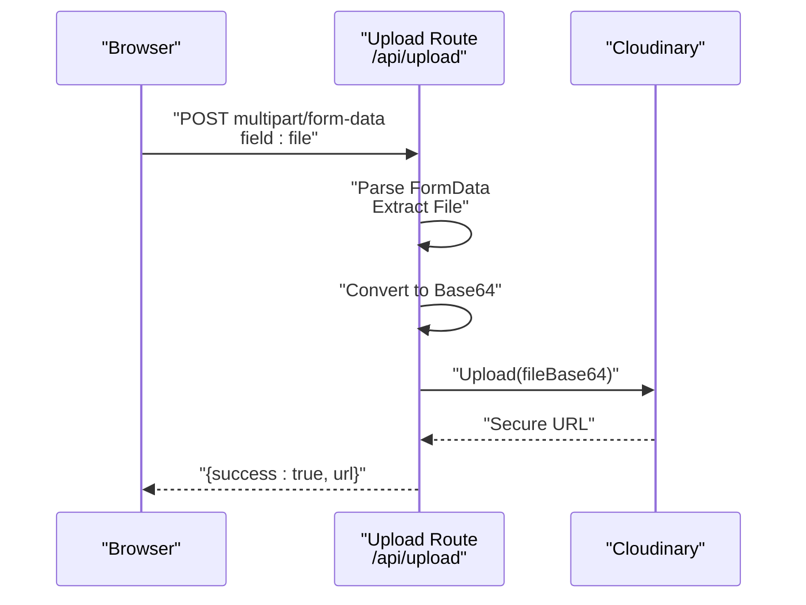
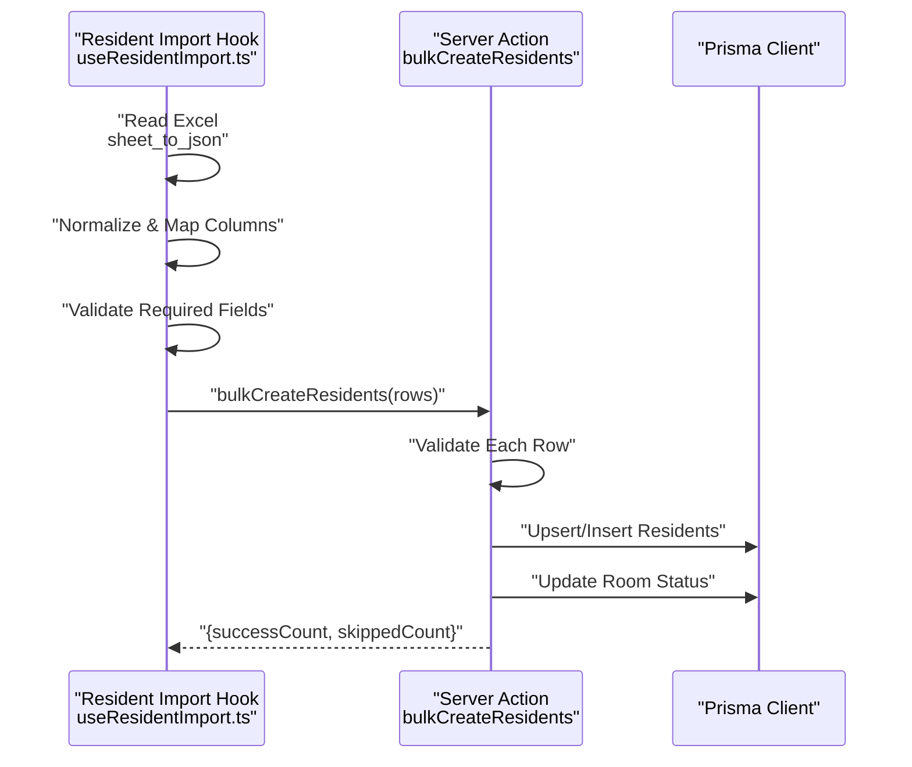
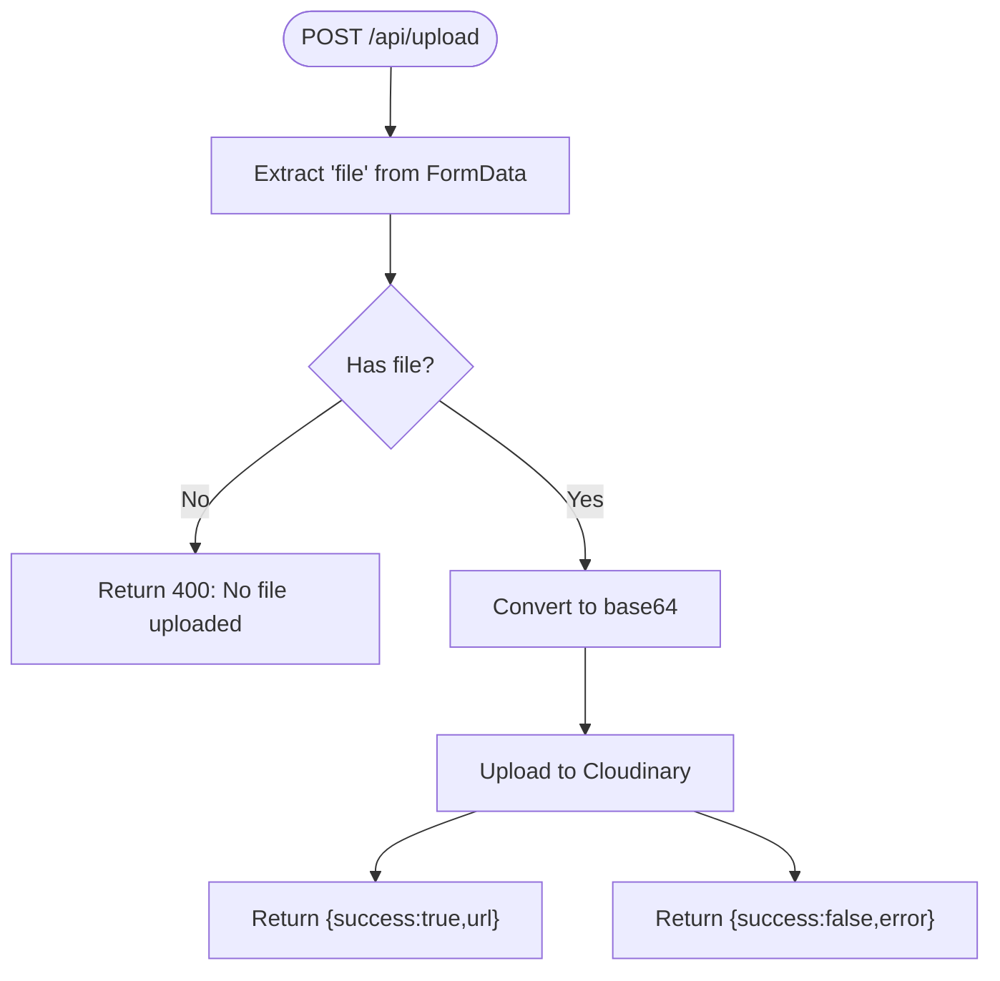
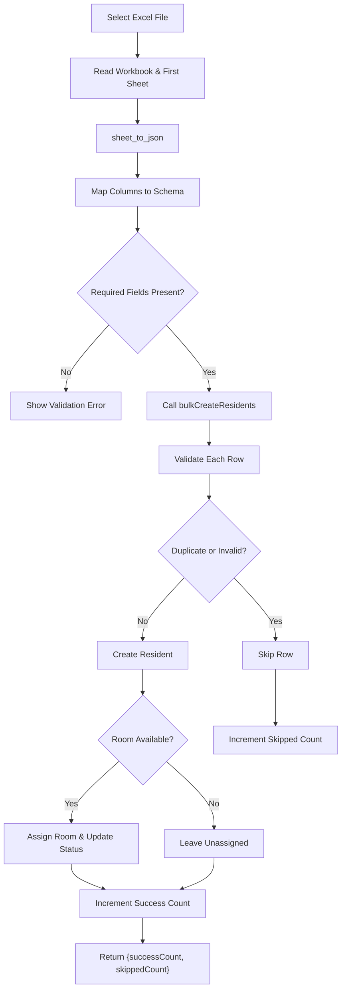
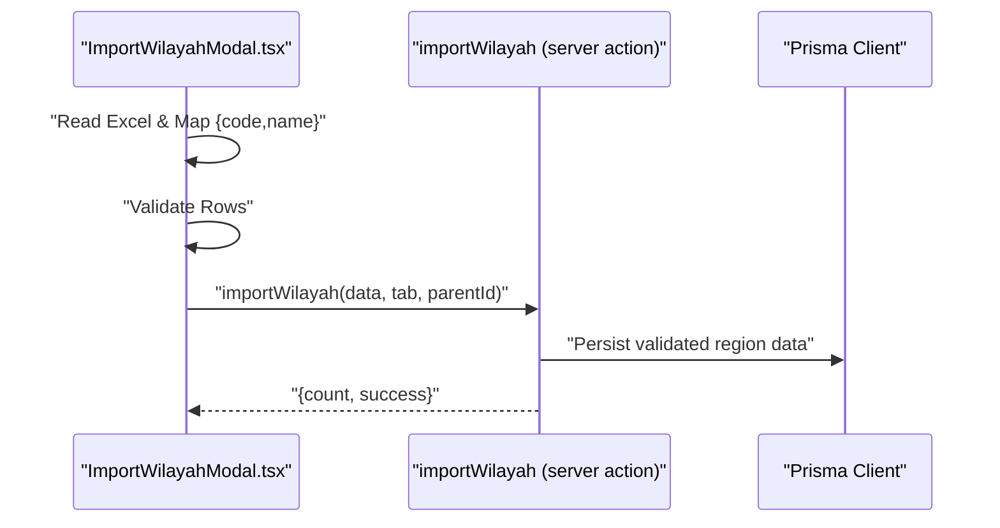
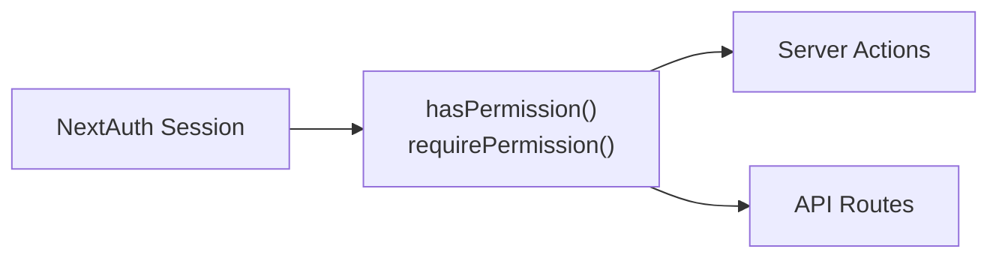
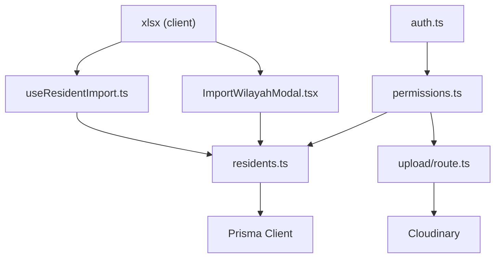

# File Upload & Processing Endpoints

<cite>
**Referenced Files in This Document**
- [route.ts](file://src/app/api/upload/route.ts)
- [residentImportMapper.ts](file://src/components/dashboard/residents/import/residentImportMapper.ts)
- [residentImportValidation.ts](file://src/components/dashboard/residents/import/residentImportValidation.ts)
- [useResidentImport.ts](file://src/components/dashboard/residents/import/useResidentImport.ts)
- [residents.ts](file://src/app/actions/residents.ts)
- [auth.ts](file://src/lib/auth.ts)
- [permissions.ts](file://src/lib/permissions.ts)
- [ImportWilayahModal.tsx](file://src/components/dashboard/referensi/wilayah/ImportWilayahModal.tsx)
- [route.ts](file://src/app/api/seed/route.ts)
- [seed.ts](file://prisma/seed.ts)
- [package.json](file://package.json)
</cite>

## Table of Contents
1. [Introduction](#introduction)
2. [Project Structure](#project-structure)
3. [Core Components](#core-components)
4. [Architecture Overview](#architecture-overview)
5. [Detailed Component Analysis](#detailed-component-analysis)
6. [Dependency Analysis](#dependency-analysis)
7. [Performance Considerations](#performance-considerations)
8. [Troubleshooting Guide](#troubleshooting-guide)
9. [Conclusion](#conclusion)
10. [Appendices](#appendices)

## Introduction
This document describes the file upload and processing endpoints for batch import operations, focusing on CSV and Excel (XLS/X/XLSX) support, multipart/form-data handling, validation, processing workflows, error handling, and security controls. It also covers progress tracking, result reporting, and client-side integration patterns. The system supports:
- Excel-based batch import for residents and administrative regions
- Client-side parsing and validation
- Server-side bulk creation with deduplication and room capacity checks
- Authentication and authorization via NextAuth and dynamic RBAC
- Optional cloud storage integration for file attachments

## Project Structure
The upload and processing capabilities span client components, server actions, API routes, and backend services:
- API route for generic file uploads to cloud storage
- Client-side Excel import for residents and regions
- Server actions orchestrating bulk database writes
- Authentication and permissions for access control
- Validation and mapping utilities for structured imports

**Diagram sources**
- [route.ts:12-36](file://src/app/api/upload/route.ts#L12-L36)
- [useResidentImport.ts:13-56](file://src/components/dashboard/residents/import/useResidentImport.ts#L13-L56)
- [ImportWilayahModal.tsx:26-78](file://src/components/dashboard/referensi/wilayah/ImportWilayahModal.tsx#L26-L78)
- [residents.ts:477-578](file://src/app/actions/residents.ts#L477-L578)
- [residentImportMapper.ts:54-82](file://src/components/dashboard/residents/import/residentImportMapper.ts#L54-L82)
- [residentImportValidation.ts:30-36](file://src/components/dashboard/residents/import/residentImportValidation.ts#L30-L36)
- [auth.ts:6-80](file://src/lib/auth.ts#L6-L80)
- [permissions.ts:4-20](file://src/lib/permissions.ts#L4-L20)

**Section sources**
- [route.ts:1-37](file://src/app/api/upload/route.ts#L1-L37)
- [useResidentImport.ts:1-66](file://src/components/dashboard/residents/import/useResidentImport.ts#L1-L66)
- [ImportWilayahModal.tsx:1-221](file://src/components/dashboard/referensi/wilayah/ImportWilayahModal.tsx#L1-L221)
- [residents.ts:477-578](file://src/app/actions/residents.ts#L477-L578)
- [residentImportMapper.ts:1-83](file://src/components/dashboard/residents/import/residentImportMapper.ts#L1-L83)
- [residentImportValidation.ts:1-37](file://src/components/dashboard/residents/import/residentImportValidation.ts#L1-L37)
- [auth.ts:1-81](file://src/lib/auth.ts#L1-L81)
- [permissions.ts:1-21](file://src/lib/permissions.ts#L1-L21)

## Core Components
- Generic file upload endpoint: Accepts multipart/form-data with a "file" field, converts to base64, and uploads to Cloudinary. Returns a secure URL on success or an error on failure.
- Resident import pipeline: Client reads Excel, normalizes headers, maps to a typed schema, validates required fields, and triggers a server action to bulk insert records while checking duplicates and room availability.
- Region import modal: Similar Excel import flow tailored for administrative regions with preview and parent selection.
- Security: NextAuth-based authentication and dynamic RBAC checks for protected operations.

Supported formats:
- CSV: Not directly handled by the provided code; the resident import uses Excel libraries and expects XLS/X/XLSX.
- Excel: XLS/X/XLSX via xlsx library on the client and server actions.
- PDF: Not handled by the provided code; the upload route targets Cloudinary and does not enforce PDF-specific validation.

Size limitations:
- Excel preview and processing cap at approximately 10,000 rows in UI components.
- Cloudinary upload endpoint does not specify explicit size limits; consult Cloudinary configuration and environment variables.

**Section sources**
- [route.ts:12-36](file://src/app/api/upload/route.ts#L12-L36)
- [residentImportMapper.ts:54-82](file://src/components/dashboard/residents/import/residentImportMapper.ts#L54-L82)
- [residentImportValidation.ts:30-36](file://src/components/dashboard/residents/import/residentImportValidation.ts#L30-L36)
- [useResidentImport.ts:13-56](file://src/components/dashboard/residents/import/useResidentImport.ts#L13-L56)
- [ImportWilayahModal.tsx:102-104](file://src/components/dashboard/referensi/wilayah/ImportWilayahModal.tsx#L102-L104)
- [package.json:31-31](file://package.json#L31-L31)

## Architecture Overview
The upload and processing architecture separates concerns between client-side parsing, server-side validation and persistence, and optional cloud storage.

**Diagram sources**
- [route.ts:12-36](file://src/app/api/upload/route.ts#L12-L36)

**Diagram sources**
- [useResidentImport.ts:13-56](file://src/components/dashboard/residents/import/useResidentImport.ts#L13-L56)
- [residents.ts:477-578](file://src/app/actions/residents.ts#L477-L578)

## Detailed Component Analysis

### Generic File Upload Endpoint
- Endpoint: POST /api/upload
- Request: multipart/form-data with field name "file"
- Processing:
  - Extracts the file from FormData
  - Converts ArrayBuffer to Buffer and encodes as base64 with MIME type
  - Uploads to Cloudinary under a configured folder
- Response:
  - On success: { success: true, url: "<secure_url>" }
  - On error: { success: false, error: "<message>" }
- Security:
  - No explicit file type or size validation in the route
  - Access controlled by NextAuth session (see Security section)

**Diagram sources**
- [route.ts:12-36](file://src/app/api/upload/route.ts#L12-L36)

**Section sources**
- [route.ts:1-37](file://src/app/api/upload/route.ts#L1-L37)

### Resident Import Pipeline
- Client-side:
  - Reads Excel via xlsx
  - Normalizes column names and maps to a typed schema
  - Validates presence of required fields
- Server-side:
  - Bulk inserts residents with deduplication on NIM/NIUP
  - Checks room availability and capacity
  - Updates room status when filled
  - Returns counts of successes and skips
- Error handling:
  - Client catches parsing errors and displays user-friendly messages
  - Server returns aggregated errors or success metrics

**Diagram sources**
- [residentImportMapper.ts:54-82](file://src/components/dashboard/residents/import/residentImportMapper.ts#L54-L82)
- [residentImportValidation.ts:30-36](file://src/components/dashboard/residents/import/residentImportValidation.ts#L30-L36)
- [useResidentImport.ts:13-56](file://src/components/dashboard/residents/import/useResidentImport.ts#L13-L56)
- [residents.ts:477-578](file://src/app/actions/residents.ts#L477-L578)

**Section sources**
- [residentImportMapper.ts:1-83](file://src/components/dashboard/residents/import/residentImportMapper.ts#L1-L83)
- [residentImportValidation.ts:1-37](file://src/components/dashboard/residents/import/residentImportValidation.ts#L1-L37)
- [useResidentImport.ts:1-66](file://src/components/dashboard/residents/import/useResidentImport.ts#L1-L66)
- [residents.ts:477-578](file://src/app/actions/residents.ts#L477-L578)

### Region Import Modal (Administrative Regions)
- Supports Excel import with preview and parent selection for hierarchical regions
- Enforces header expectations and filters invalid rows
- Calls a server action to persist validated data

**Diagram sources**
- [ImportWilayahModal.tsx:26-78](file://src/components/dashboard/referensi/wilayah/ImportWilayahModal.tsx#L26-L78)

**Section sources**
- [ImportWilayahModal.tsx:1-221](file://src/components/dashboard/referensi/wilayah/ImportWilayahModal.tsx#L1-L221)

### Security and Access Control
- Authentication: NextAuth with JWT strategy and credentials provider
- Authorization: Dynamic RBAC via permission codes; helpers to check and require permissions
- Protected operations: Server actions and API routes should be gated by session and permissions

**Diagram sources**
- [auth.ts:6-80](file://src/lib/auth.ts#L6-L80)
- [permissions.ts:4-20](file://src/lib/permissions.ts#L4-L20)

**Section sources**
- [auth.ts:1-81](file://src/lib/auth.ts#L1-L81)
- [permissions.ts:1-21](file://src/lib/permissions.ts#L1-L21)
- [route.ts:12-36](file://src/app/api/upload/route.ts#L12-L36)
- [residents.ts:477-578](file://src/app/actions/residents.ts#L477-L578)

## Dependency Analysis
- Client-side Excel parsing depends on xlsx
- Server actions depend on Prisma for database operations
- Upload route depends on Cloudinary SDK
- Security depends on NextAuth and permission utilities

**Diagram sources**
- [package.json:31-31](file://package.json#L31-L31)
- [useResidentImport.ts:1-66](file://src/components/dashboard/residents/import/useResidentImport.ts#L1-L66)
- [ImportWilayahModal.tsx:1-221](file://src/components/dashboard/referensi/wilayah/ImportWilayahModal.tsx#L1-L221)
- [residents.ts:1-666](file://src/app/actions/residents.ts#L1-L666)
- [route.ts:1-37](file://src/app/api/upload/route.ts#L1-L37)
- [auth.ts:1-81](file://src/lib/auth.ts#L1-L81)
- [permissions.ts:1-21](file://src/lib/permissions.ts#L1-L21)

**Section sources**
- [package.json:12-31](file://package.json#L12-L31)
- [residents.ts:1-666](file://src/app/actions/residents.ts#L1-L666)
- [route.ts:1-37](file://src/app/api/upload/route.ts#L1-L37)

## Performance Considerations
- Client-side parsing: Large Excel files can cause memory pressure; UI components limit preview rows to 100 and suggest a maximum of 10,000 rows.
- Server-side bulk operations: The bulk insert iterates rows sequentially, validating and inserting one by one. For very large datasets, consider chunking and transaction batching.
- Room capacity checks: Room queries and updates occur per row; ensure database indexing on room capacity and resident associations.
- Cloudinary uploads: Base64 conversion increases payload size; consider streaming uploads for very large files if needed.

[No sources needed since this section provides general guidance]

## Troubleshooting Guide
Common issues and resolutions:
- No file uploaded: Ensure the multipart field name is "file".
- Malformed Excel: Verify headers match expected aliases and required fields are present.
- Duplicate NIM/NIUP: Rows with existing identifiers are skipped; review skipped count and fix duplicates.
- Room not available: Selected room may be under maintenance or at capacity; choose another room or adjust capacity.
- Permission denied: Operations require a valid NextAuth session and appropriate RBAC codes.

**Section sources**
- [route.ts:17-19](file://src/app/api/upload/route.ts#L17-L19)
- [residentImportValidation.ts:23-24](file://src/components/dashboard/residents/import/residentImportValidation.ts#L23-L24)
- [residents.ts:517-525](file://src/app/actions/residents.ts#L517-L525)
- [permissions.ts:11-16](file://src/lib/permissions.ts#L11-L16)

## Conclusion
The system provides a robust foundation for file-based batch imports with strong validation, deduplication, and room management. While the current implementation focuses on Excel (XLS/X/XLSX), it can be extended to support CSV and PDF with additional parsers and validators. Security is enforced through NextAuth and RBAC, and optional cloud storage integration is available for file attachments.

[No sources needed since this section summarizes without analyzing specific files]

## Appendices

### API Definitions

- Generic Upload Endpoint
  - Method: POST
  - Path: /api/upload
  - Content-Type: multipart/form-data
  - Fields:
    - file: File (required)
  - Success Response: 200 OK with JSON { success: true, url: "<secure_url>" }
  - Error Responses:
    - 400 Bad Request: { success: false, error: "No file uploaded" }
    - 500 Internal Server Error: { success: false, error: "<message>" }

- Bulk Resident Import
  - Method: Client-side flow invoking server action
  - Input: Excel workbook with mapped columns
  - Validation: Required fields presence and date/gender normalization
  - Output: { successCount: number, skippedCount: number }

- Region Import
  - Method: Client-side flow invoking server action
  - Input: Excel with columns "code" and "name"
  - Validation: Presence of both fields
  - Output: { count: number, success: boolean }

**Section sources**
- [route.ts:12-36](file://src/app/api/upload/route.ts#L12-L36)
- [useResidentImport.ts:13-56](file://src/components/dashboard/residents/import/useResidentImport.ts#L13-L56)
- [ImportWilayahModal.tsx:26-78](file://src/components/dashboard/referensi/wilayah/ImportWilayahModal.tsx#L26-L78)

### Client-Side Integration Examples
- Excel upload with preview and import:
  - Use the resident import hook to read and validate Excel
  - Trigger the server action to persist data
  - Display success/skip counts and reload the page on completion

- Region import:
  - Use the modal to select parent region and upload Excel
  - Preview mapped data and confirm import

**Section sources**
- [useResidentImport.ts:13-56](file://src/components/dashboard/residents/import/useResidentImport.ts#L13-L56)
- [ImportWilayahModal.tsx:26-78](file://src/components/dashboard/referensi/wilayah/ImportWilayahModal.tsx#L26-L78)

### Security Considerations
- Authentication: Ensure requests include a valid NextAuth session
- Authorization: Enforce RBAC codes for sensitive operations
- File validation: Add MIME/type checks and size limits at the API boundary
- Virus scanning: Integrate external scanning service for uploaded files
- Access control: Gate all mutation endpoints with permission checks

**Section sources**
- [auth.ts:6-80](file://src/lib/auth.ts#L6-L80)
- [permissions.ts:4-20](file://src/lib/permissions.ts#L4-L20)
- [route.ts:12-36](file://src/app/api/upload/route.ts#L12-L36)