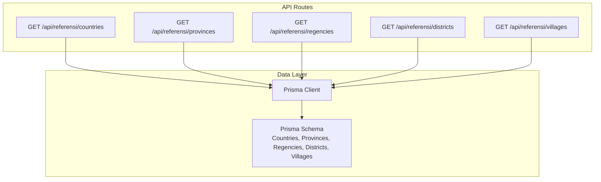
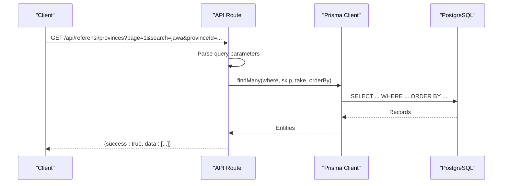
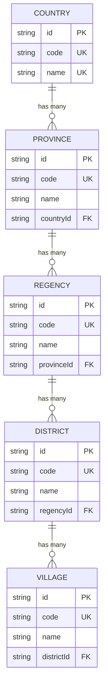
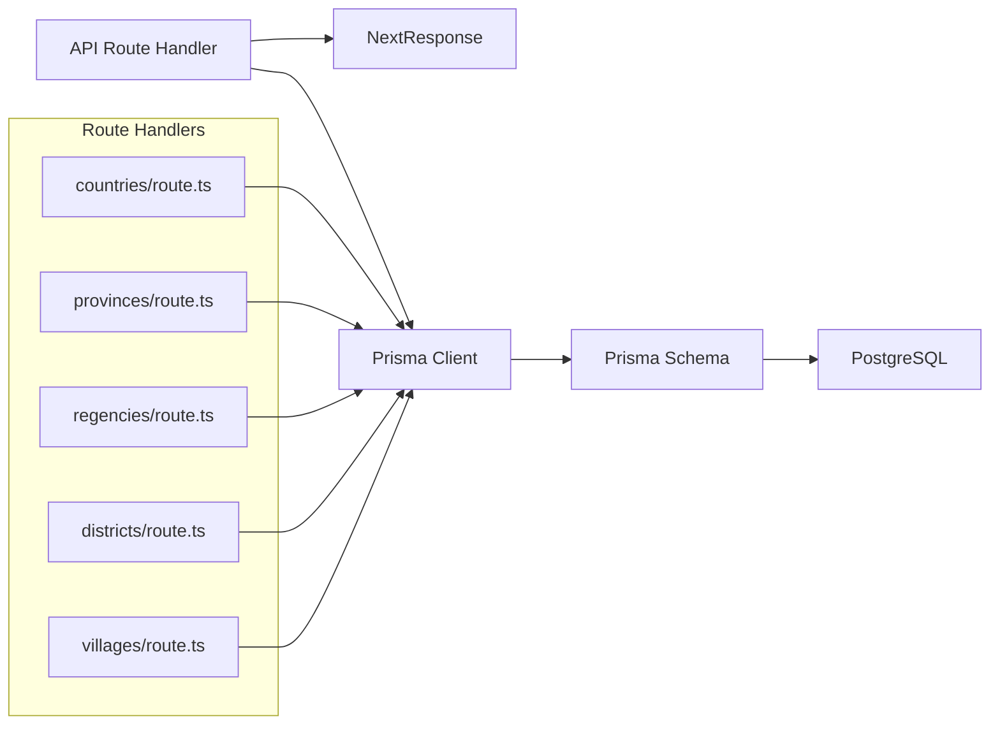

# Geographic Data Endpoints

<cite>
**Referenced Files in This Document**
- [provinces/route.ts](file://src/app/api/referensi/provinces/route.ts)
- [regencies/route.ts](file://src/app/api/referensi/regencies/route.ts)
- [districts/route.ts](file://src/app/api/referensi/districts/route.ts)
- [villages/route.ts](file://src/app/api/referensi/villages/route.ts)
- [countries/route.ts](file://src/app/api/referensi/countries/route.ts)
- [schema.prisma](file://prisma/schema.prisma)
- [wilayah.ts](file://src/app/actions/wilayah.ts)
- [AuditLogClient.tsx](file://src/components/dashboard/audit-log/AuditLogClient.tsx)
- [audit.ts](file://src/app/actions/audit.ts)
</cite>

## Table of Contents
1. [Introduction](#introduction)
2. [Project Structure](#project-structure)
3. [Core Components](#core-components)
4. [Architecture Overview](#architecture-overview)
5. [Detailed Component Analysis](#detailed-component-analysis)
6. [Dependency Analysis](#dependency-analysis)
7. [Performance Considerations](#performance-considerations)
8. [Troubleshooting Guide](#troubleshooting-guide)
9. [Conclusion](#conclusion)

## Introduction
This document provides comprehensive API documentation for geographic reference data endpoints that expose hierarchical administrative boundaries. The system supports five levels of geographic data: countries, provinces, regencies (cities/districts), districts, and villages. Each endpoint supports search, pagination, and parent-child filtering to enable efficient cascading UI experiences and robust data queries.

## Project Structure
The geographic reference endpoints are implemented as Next.js App Router API routes under the `/api/referensi` namespace. Each route corresponds to a geographic level and follows a consistent pattern for request parameters, filtering, and response formatting.

**Diagram sources**
- [provinces/route.ts:1-32](file://src/app/api/referensi/provinces/route.ts#L1-L32)
- [regencies/route.ts:1-32](file://src/app/api/referensi/regencies/route.ts#L1-L32)
- [districts/route.ts:1-32](file://src/app/api/referensi/districts/route.ts#L1-L32)
- [villages/route.ts:1-32](file://src/app/api/referensi/villages/route.ts#L1-L32)
- [countries/route.ts:1-29](file://src/app/api/referensi/countries/route.ts#L1-L29)
- [schema.prisma:380-453](file://prisma/schema.prisma#L380-L453)

**Section sources**
- [provinces/route.ts:1-32](file://src/app/api/referensi/provinces/route.ts#L1-L32)
- [regencies/route.ts:1-32](file://src/app/api/referensi/regencies/route.ts#L1-L32)
- [districts/route.ts:1-32](file://src/app/api/referensi/districts/route.ts#L1-L32)
- [villages/route.ts:1-32](file://src/app/api/referensi/villages/route.ts#L1-L32)
- [countries/route.ts:1-29](file://src/app/api/referensi/countries/route.ts#L1-L29)

## Core Components
This section documents the five geographic reference endpoints and their shared capabilities.

### Endpoint Catalog
- **GET /api/referensi/countries**
  - Purpose: Retrieve country-level geographic units
  - Supports: search, pagination
  - Response: Array of countries with administrative identifiers

- **GET /api/referensi/provinces**
  - Purpose: Retrieve province-level geographic units
  - Supports: search, pagination, parent filtering by countryId
  - Response: Array of provinces with associated country metadata

- **GET /api/referensi/regencies**
  - Purpose: Retrieve regency-level geographic units
  - Supports: search, pagination, parent filtering by provinceId
  - Response: Array of regencies with associated province metadata

- **GET /api/referensi/districts**
  - Purpose: Retrieve district-level geographic units
  - Supports: search, pagination, parent filtering by regencyId
  - Response: Array of districts with associated regency metadata

- **GET /api/referensi/villages**
  - Purpose: Retrieve village-level geographic units
  - Supports: search, pagination, parent filtering by districtId
  - Response: Array of villages with associated district metadata

### Request Parameters
All endpoints accept the following query parameters:
- search: Text search across name and code fields (case-insensitive substring match)
- page: Page number for pagination (default: 1)
- Limit: Fixed page size of 100 items per page

Parent-child filtering parameters:
- countryId: Filter provinces by country identifier
- provinceId: Filter regencies by province identifier
- regencyId: Filter districts by regency identifier
- districtId: Filter villages by district identifier

### Response Schema
Each endpoint returns a standardized envelope:
- success: Boolean indicating operation status
- data: Array of geographic entities (see entity schemas below)

Entity schemas (representative fields):
- Country: id, code, name
- Province: id, code, name, countryId
- Regency: id, code, name, provinceId
- District: id, code, name, regencyId
- Village: id, code, name, districtId

Notes:
- Coordinates are not exposed by these endpoints
- Administrative codes are included for each entity
- Hierarchical relationships are represented by foreign key fields

**Section sources**
- [provinces/route.ts:5-31](file://src/app/api/referensi/provinces/route.ts#L5-L31)
- [regencies/route.ts:5-31](file://src/app/api/referensi/regencies/route.ts#L5-L31)
- [districts/route.ts:5-31](file://src/app/api/referensi/districts/route.ts#L5-L31)
- [villages/route.ts:5-31](file://src/app/api/referensi/villages/route.ts#L5-L31)
- [countries/route.ts:5-28](file://src/app/api/referensi/countries/route.ts#L5-L28)

## Architecture Overview
The geographic endpoints follow a consistent pattern: parse query parameters, construct Prisma filters, query the database, and return a standardized response envelope. The underlying Prisma schema defines the hierarchical relationships and constraints.

**Diagram sources**
- [provinces/route.ts:5-31](file://src/app/api/referensi/provinces/route.ts#L5-L31)
- [schema.prisma:392-406](file://prisma/schema.prisma#L392-L406)

**Section sources**
- [provinces/route.ts:1-32](file://src/app/api/referensi/provinces/route.ts#L1-L32)
- [regencies/route.ts:1-32](file://src/app/api/referensi/regencies/route.ts#L1-L32)
- [districts/route.ts:1-32](file://src/app/api/referensi/districts/route.ts#L1-L32)
- [villages/route.ts:1-32](file://src/app/api/referensi/villages/route.ts#L1-L32)
- [countries/route.ts:1-29](file://src/app/api/referensi/countries/route.ts#L1-L29)

## Detailed Component Analysis

### Countries Endpoint
- Path: `/api/referensi/countries`
- Parameters: search, page
- Filtering: Text search across name and code
- Pagination: 100 items per page
- Response: Array of Country entities

Example requests:
- GET /api/referensi/countries?page=1&search=indonesia
- GET /api/referensi/countries?page=2&search=asia

Response envelope:
- success: true/false
- data: Array of Country objects

**Section sources**
- [countries/route.ts:5-28](file://src/app/api/referensi/countries/route.ts#L5-L28)

### Provinces Endpoint
- Path: `/api/referensi/provinces`
- Parameters: search, page, countryId
- Filtering: Text search across name and code; countryId parent filter
- Pagination: 100 items per page
- Response: Array of Province entities

Example requests:
- GET /api/referensi/provinces?page=1&search=jawa
- GET /api/referensi/provinces?countryId=ID-JW&page=1

Response envelope:
- success: true/false
- data: Array of Province objects

**Section sources**
- [provinces/route.ts:5-31](file://src/app/api/referensi/provinces/route.ts#L5-L31)

### Regencies Endpoint
- Path: `/api/referensi/regencies`
- Parameters: search, page, provinceId
- Filtering: Text search across name and code; provinceId parent filter
- Pagination: 100 items per page
- Response: Array of Regency entities

Example requests:
- GET /api/referensi/regencies?page=1&search=bandung
- GET /api/referensi/regencies?provinceId=ID-JW-12&page=1

Response envelope:
- success: true/false
- data: Array of Regency objects

**Section sources**
- [regencies/route.ts:5-31](file://src/app/api/referensi/regencies/route.ts#L5-L31)

### Districts Endpoint
- Path: `/api/referensi/districts`
- Parameters: search, page, regencyId
- Filtering: Text search across name and code; regencyId parent filter
- Pagination: 100 items per page
- Response: Array of District entities

Example requests:
- GET /api/referensi/districts?page=1&search=purwakarta
- GET /api/referensi/districts?regencyId=ID-JW-1201&page=1

Response envelope:
- success: true/false
- data: Array of District objects

**Section sources**
- [districts/route.ts:5-31](file://src/app/api/referensi/districts/route.ts#L5-L31)

### Villages Endpoint
- Path: `/api/referensi/villages`
- Parameters: search, page, districtId
- Filtering: Text search across name and code; districtId parent filter
- Pagination: 100 items per page
- Response: Array of Village entities

Example requests:
- GET /api/referensi/villages?page=1&search=cibodas
- GET /api/referensi/villages?districtId=ID-JW-120101&page=1

Response envelope:
- success: true/false
- data: Array of Village objects

**Section sources**
- [villages/route.ts:5-31](file://src/app/api/referensi/villages/route.ts#L5-L31)

### Data Model Relationships
The Prisma schema defines the hierarchical relationships among geographic entities:

**Diagram sources**
- [schema.prisma:380-453](file://prisma/schema.prisma#L380-L453)

**Section sources**
- [schema.prisma:380-453](file://prisma/schema.prisma#L380-L453)

## Dependency Analysis
The geographic endpoints depend on Prisma for data access and NextResponse for HTTP responses. The Prisma schema enforces referential integrity and uniqueness constraints.

**Diagram sources**
- [provinces/route.ts:1-3](file://src/app/api/referensi/provinces/route.ts#L1-L3)
- [regencies/route.ts:1-3](file://src/app/api/referensi/regencies/route.ts#L1-L3)
- [districts/route.ts:1-3](file://src/app/api/referensi/districts/route.ts#L1-L3)
- [villages/route.ts:1-3](file://src/app/api/referensi/villages/route.ts#L1-L3)
- [countries/route.ts:1-3](file://src/app/api/referensi/countries/route.ts#L1-L3)
- [schema.prisma:380-453](file://prisma/schema.prisma#L380-L453)

**Section sources**
- [provinces/route.ts:1-3](file://src/app/api/referensi/provinces/route.ts#L1-L3)
- [regencies/route.ts:1-3](file://src/app/api/referensi/regencies/route.ts#L1-L3)
- [districts/route.ts:1-3](file://src/app/api/referensi/districts/route.ts#L1-L3)
- [villages/route.ts:1-3](file://src/app/api/referensi/villages/route.ts#L1-L3)
- [countries/route.ts:1-3](file://src/app/api/referensi/countries/route.ts#L1-L3)

## Performance Considerations
- Fixed page size: All endpoints use a fixed page size of 100 items to prevent large payloads and ensure predictable performance.
- Indexes: The Prisma schema defines indexes on name and foreign key fields to optimize search and join operations.
- Sorting: Results are sorted by name in ascending order for consistent ordering.
- Search: Case-insensitive substring search is applied across name and code fields.

## Troubleshooting Guide
Common issues and resolutions:
- Unauthorized access: Ensure proper authentication and permissions for accessing geographic data endpoints.
- Invalid parameters: Verify that page numbers are positive integers and parent filter IDs correspond to existing entities.
- Large result sets: Use pagination and search parameters to limit result sets.
- Database errors: Check Prisma connection and PostgreSQL availability.

Audit logging:
- All mutations to geographic data are recorded in the AuditLog table with action, entity type, entity ID, old/new values, and performer.
- Use the audit log endpoints to track changes and troubleshoot data synchronization issues.

**Section sources**
- [audit.ts:27-98](file://src/app/actions/audit.ts#L27-L98)
- [AuditLogClient.tsx:105-200](file://src/components/dashboard/audit-log/AuditLogClient.tsx#L105-L200)

## Conclusion
The geographic reference endpoints provide a consistent, scalable foundation for hierarchical administrative boundary data. They support efficient cascading UI experiences through parent-child filtering, robust search capabilities, and standardized response envelopes. The underlying Prisma schema ensures referential integrity and performance through strategic indexing. Audit logging enables comprehensive data change tracking for compliance and troubleshooting.