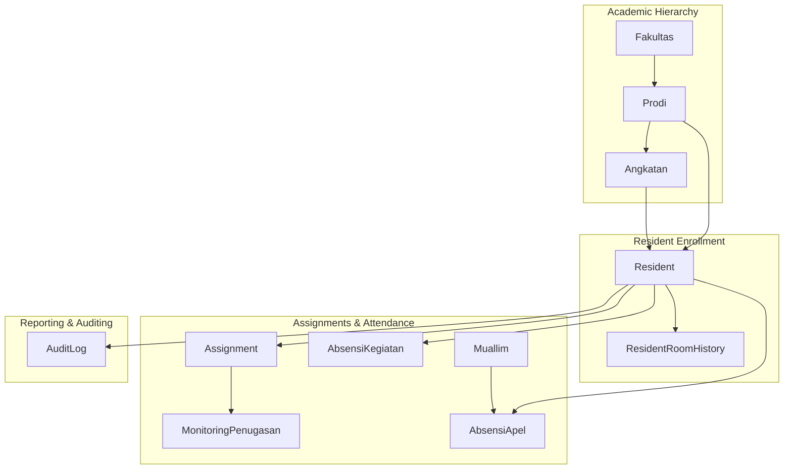
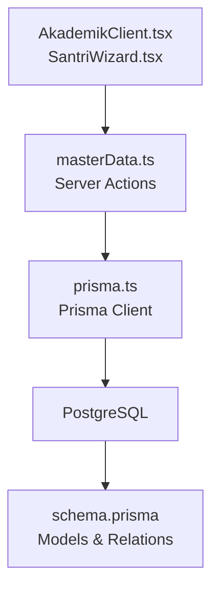
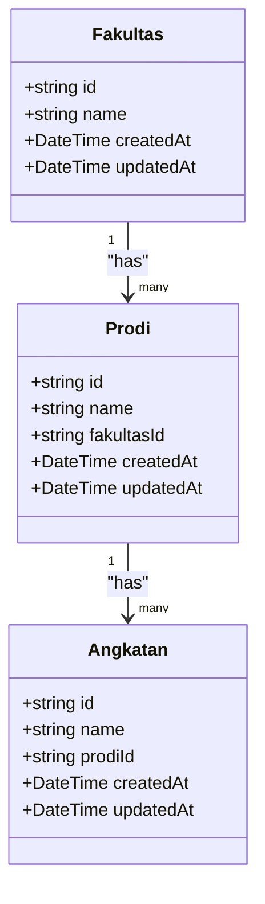
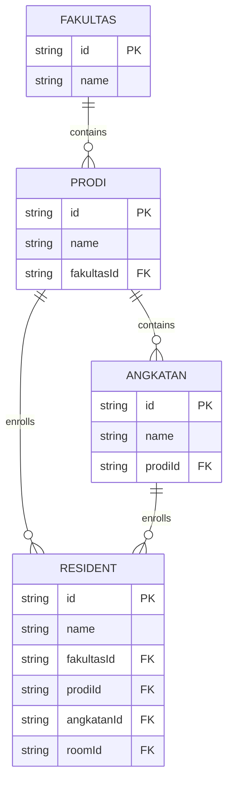
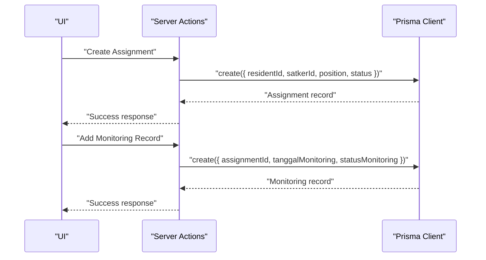
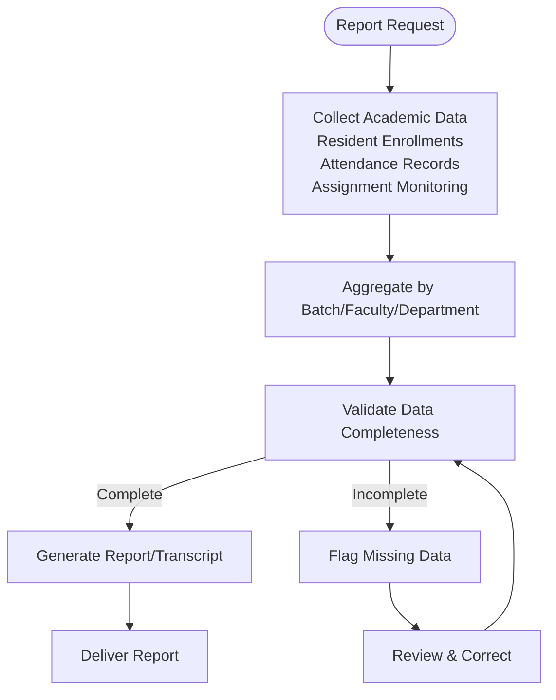
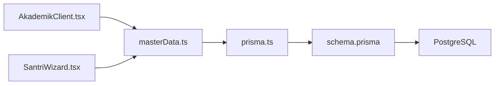

# Academic Data Management

<cite>
**Referenced Files in This Document**
- [schema.prisma](file://prisma/schema.prisma)
- [prisma.ts](file://src/lib/prisma.ts)
- [masterData.ts](file://src/app/actions/masterData.ts)
- [akademik/page.tsx](file://src/app/dashboard/akademik/page.tsx)
- [AkademikClient.tsx](file://src/components/dashboard/AkademikClient.tsx)
- [SantriWizard.tsx](file://src/components/dashboard/santri/wizard/SantriWizard.tsx)
- [Resident.ts](file://prisma/schema.prisma)
- [Fakultas.ts](file://prisma/schema.prisma)
- [Prodi.ts](file://prisma/schema.prisma)
- [Angkatan.ts](file://prisma/schema.prisma)
- [ResidentRoomHistory.ts](file://prisma/schema.prisma)
- [Assignment.ts](file://prisma/schema.prisma)
- [MonitoringPenugasan.ts](file://prisma/schema.prisma)
- [AbsensiKegiatan.ts](file://prisma/schema.prisma)
- [AbsensiApel.ts](file://prisma/schema.prisma)
- [Muallim.ts](file://prisma/schema.prisma)
- [AuditLog.ts](file://prisma/schema.prisma)
</cite>

## Table of Contents
1. [Introduction](#introduction)
2. [Project Structure](#project-structure)
3. [Core Components](#core-components)
4. [Architecture Overview](#architecture-overview)
5. [Detailed Component Analysis](#detailed-component-analysis)
6. [Dependency Analysis](#dependency-analysis)
7. [Performance Considerations](#performance-considerations)
8. [Troubleshooting Guide](#troubleshooting-guide)
9. [Conclusion](#conclusion)

## Introduction
This document provides comprehensive documentation for academic data management within the ApsAsrama system. It covers the academic hierarchy structure (faculty, department, program study, and batch), enrollment tracking, degree progression monitoring, integration with resident academic records, assignment management, and reporting systems. It also details data validation rules, academic calendar integration, transcript generation pathways, program evaluation, accreditation tracking, and academic performance analytics.

## Project Structure
The academic data management system is built on a Next.js application with Prisma ORM for database modeling and PostgreSQL as the data store. The academic hierarchy is modeled through dedicated entities for faculty, department, program study, and batch. Resident enrollment integrates with these academic structures via foreign keys. Assignment management and attendance tracking complement academic progress monitoring.

**Diagram sources**
- [schema.prisma](file://prisma/schema.prisma)
- [masterData.ts](file://src/app/actions/masterData.ts)

**Section sources**
- [prisma.ts](file://src/lib/prisma.ts)
- [akademik/page.tsx](file://src/app/dashboard/akademik/page.tsx)

## Core Components
This section outlines the primary components involved in academic data management:

- Academic Hierarchy Models: Faculty (Fakultas), Department (Prodi), and Batch (Angkatan) form the academic structure. These models support CRUD operations via server actions and are rendered in the academic dashboard.
- Resident Enrollment: The Resident model captures student information and links to academic entities (faculty, program study, batch) via foreign keys. Enrollment tracking is supported by resident-room history for transfers and room assignments.
- Assignment Management: Assignments connect residents to organizational units (Satker) with positions and status tracking. Monitoring records capture progress and feedback.
- Attendance Tracking: Attendance for activities (AbsensiKegiatan) and daily assemblies (AbsensiApel) supports real-time presence monitoring linked to residents.
- Reporting and Auditing: Audit logs track changes to academic and resident data, enabling compliance and transparency.

**Section sources**
- [schema.prisma](file://prisma/schema.prisma)
- [masterData.ts](file://src/app/actions/masterData.ts)
- [AkademikClient.tsx](file://src/components/dashboard/AkademikClient.tsx)

## Architecture Overview
The system follows a layered architecture:
- Presentation Layer: React components render academic hierarchy, enrollment forms, and dashboards.
- Action Layer: Server actions manage academic CRUD operations and enforce validation rules.
- Data Access Layer: Prisma client connects to PostgreSQL using a connection pool adapter.
- Data Modeling: Prisma schema defines entities, relationships, and constraints.

**Diagram sources**
- [AkademikClient.tsx](file://src/components/dashboard/AkademikClient.tsx)
- [SantriWizard.tsx](file://src/components/dashboard/santri/wizard/SantriWizard.tsx)
- [masterData.ts](file://src/app/actions/masterData.ts)
- [prisma.ts](file://src/lib/prisma.ts)
- [schema.prisma](file://prisma/schema.prisma)

## Detailed Component Analysis

### Academic Hierarchy Management
The academic hierarchy consists of three nested entities:
- Faculty (Fakultas): Top-level academic unit.
- Department (Prodi): Child of faculty, contains multiple batches.
- Batch (Angkatan): Child of department, groups students by admission year.

Key characteristics:
- Unique constraints prevent duplicates within the same parent entity.
- Cascading deletes ensure child entities are removed when parents are deleted.
- Ordering by name ensures consistent presentation.

**Diagram sources**
- [Fakultas.ts](file://prisma/schema.prisma)
- [Prodi.ts](file://prisma/schema.prisma)
- [Angkatan.ts](file://prisma/schema.prisma)

Operational flow for managing hierarchy:
- Fetch hierarchy with nested inclusion for departments and batches.
- Create/update/delete operations enforced by unique constraints and cascading rules.
- UI components provide expandable views and modal forms for CRUD actions.

**Section sources**
- [akademik/page.tsx](file://src/app/dashboard/akademik/page.tsx)
- [AkademikClient.tsx](file://src/components/dashboard/AkademikClient.tsx)
- [masterData.ts](file://src/app/actions/masterData.ts)

### Enrollment Tracking and Degree Progression
Enrollment ties residents to academic entities:
- Resident model includes foreign keys to faculty, program study, and batch.
- Enrollment progression is tracked through batch associations and room history for transfers.

**Diagram sources**
- [Resident.ts](file://prisma/schema.prisma)
- [Fakultas.ts](file://prisma/schema.prisma)
- [Prodi.ts](file://prisma/schema.prisma)
- [Angkatan.ts](file://prisma/schema.prisma)

Progression monitoring:
- Wizard-driven enrollment ensures correct selection of faculty, program study, and batch.
- Room history tracks physical movement, supporting residency and location-based reporting.

**Section sources**
- [SantriWizard.tsx](file://src/components/dashboard/santri/wizard/SantriWizard.tsx)
- [ResidentRoomHistory.ts](file://prisma/schema.prisma)

### Assignment Management and Academic Calendar Integration
Assignment management supports academic supervision and activity oversight:
- Assignments link residents to organizational units with positions and status.
- Monitoring records capture progress and feedback over time.
- Activity attendance (AbsensiKegiatan) and assembly attendance (AbsensiApel) integrate with academic calendars.

**Diagram sources**
- [Assignment.ts](file://prisma/schema.prisma)
- [MonitoringPenugasan.ts](file://prisma/schema.prisma)

Calendar integration:
- Activities and assemblies are scheduled with dates, enabling monthly reporting and attendance analytics.

**Section sources**
- [Assignment.ts](file://prisma/schema.prisma)
- [MonitoringPenugasan.ts](file://prisma/schema.prisma)
- [AbsensiKegiatan.ts](file://prisma/schema.prisma)
- [AbsensiApel.ts](file://prisma/schema.prisma)
- [Muallim.ts](file://prisma/schema.prisma)

### Reporting Systems and Transcript Generation
Reporting and auditing:
- Audit logs capture create, update, delete, and import actions with old/new values, enabling compliance and transparency.
- Monthly reports aggregate activity and attendance data for supervisors.

Transcript generation pathway:
- Academic transcripts can be derived from resident academic records, attendance, and assignment monitoring data stored in the system.

**Diagram sources**
- [AuditLog.ts](file://prisma/schema.prisma)
- [Resident.ts](file://prisma/schema.prisma)
- [AbsensiKegiatan.ts](file://prisma/schema.prisma)
- [AbsensiApel.ts](file://prisma/schema.prisma)
- [Assignment.ts](file://prisma/schema.prisma)
- [MonitoringPenugasan.ts](file://prisma/schema.prisma)

### Program Evaluation, Accreditation Tracking, and Performance Analytics
Program evaluation:
- Enrollment trends by batch and department inform program capacity planning.
- Attendance analytics help assess student engagement and retention.

Accreditation tracking:
- Unique constraints on academic entities ensure standardized naming and structure.
- Audit logs provide evidence of governance and compliance.

Performance analytics:
- Monthly supervisor reports aggregate attendance and assignment outcomes.
- Resident statistics and filters enable targeted interventions.

**Section sources**
- [masterData.ts](file://src/app/actions/masterData.ts)
- [AuditLog.ts](file://prisma/schema.prisma)

## Dependency Analysis
The academic data management system exhibits clear separation of concerns:
- UI components depend on server actions for data mutations.
- Server actions rely on Prisma client for database operations.
- Prisma client uses a PostgreSQL adapter with connection pooling.

**Diagram sources**
- [AkademikClient.tsx](file://src/components/dashboard/AkademikClient.tsx)
- [SantriWizard.tsx](file://src/components/dashboard/santri/wizard/SantriWizard.tsx)
- [masterData.ts](file://src/app/actions/masterData.ts)
- [prisma.ts](file://src/lib/prisma.ts)
- [schema.prisma](file://prisma/schema.prisma)

**Section sources**
- [prisma.ts](file://src/lib/prisma.ts)
- [schema.prisma](file://prisma/schema.prisma)

## Performance Considerations
- Connection pooling: The Prisma adapter configures a single connection per serverless instance with timeout settings to optimize resource usage.
- Indexes: Strategic indexing on frequently queried fields (e.g., status, floor, room, date) improves query performance.
- Revalidation: Controlled revalidation in dashboard pages balances freshness with performance.

[No sources needed since this section provides general guidance]

## Troubleshooting Guide
Common issues and resolutions:
- Duplicate entries: Unique constraint violations return specific error messages for faculty, program study, and batch entities.
- Deletion conflicts: Cascading rules remove dependent entities; ensure proper cascade configuration to avoid orphaned records.
- Audit trail gaps: Verify audit log triggers and permissions to ensure all mutations are recorded.

**Section sources**
- [masterData.ts](file://src/app/actions/masterData.ts)
- [AuditLog.ts](file://prisma/schema.prisma)

## Conclusion
The ApsAsrama academic data management system provides a robust foundation for managing academic hierarchies, enrollment tracking, assignment supervision, and reporting. Its modular design, clear data models, and audit capabilities support program evaluation, accreditation compliance, and performance analytics. Future enhancements could include automated transcript generation workflows and advanced analytics dashboards.