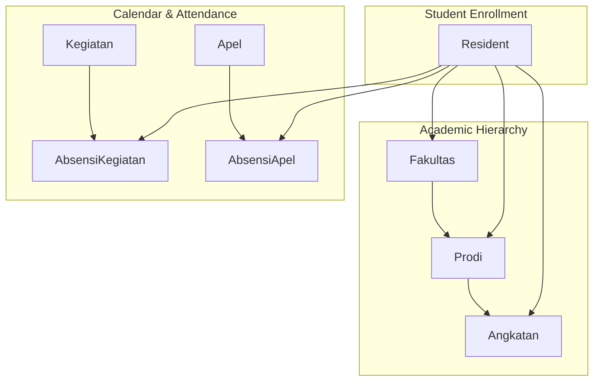
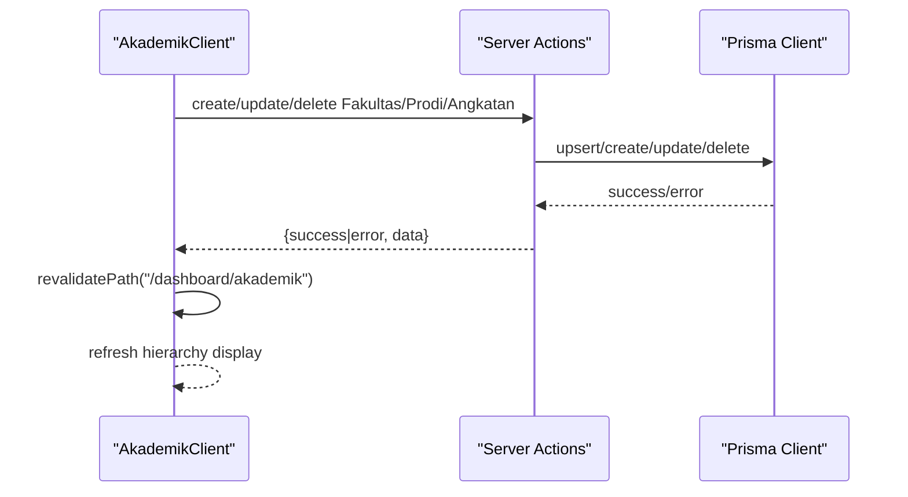
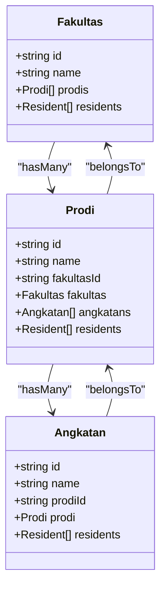
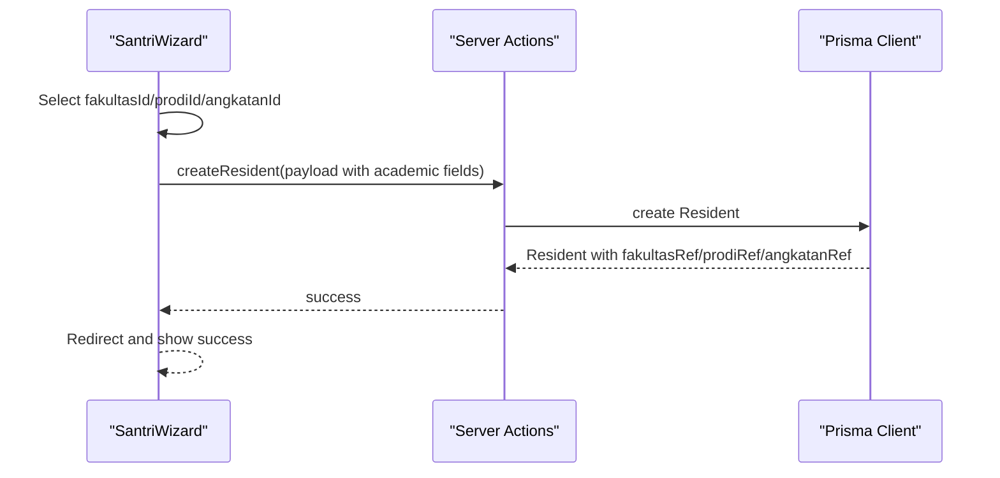
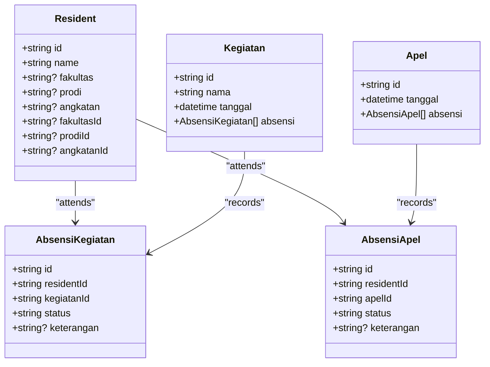
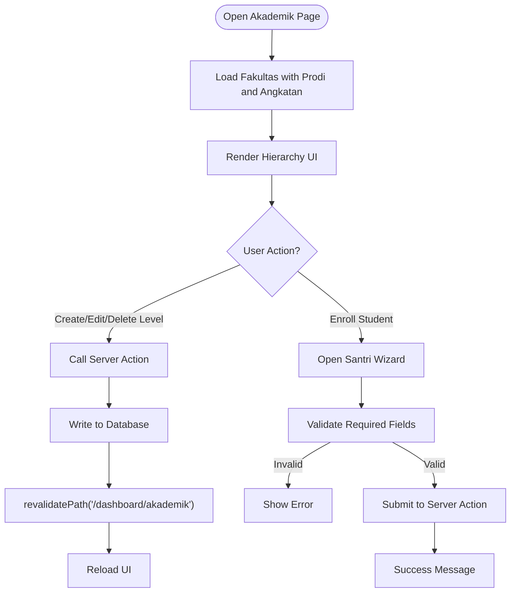
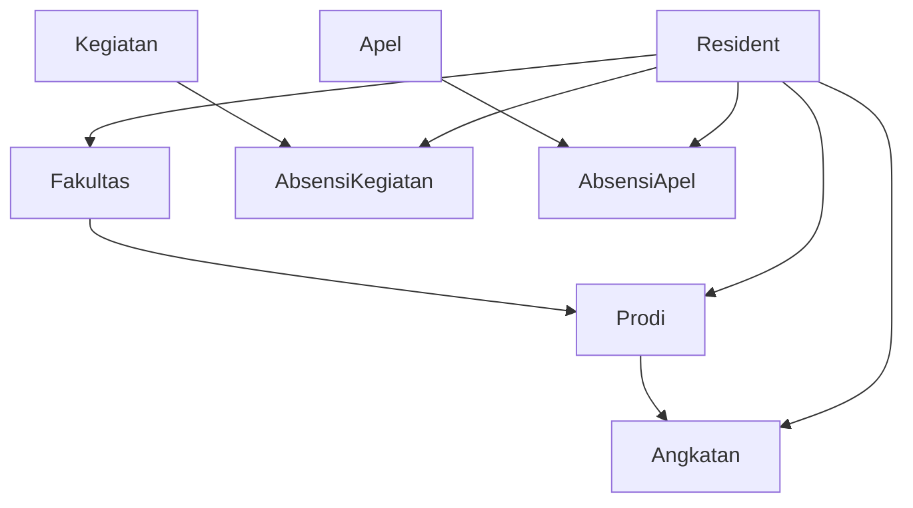

# Academic Hierarchy Integration

<cite>
**Referenced Files in This Document**
- [schema.prisma](file://prisma/schema.prisma)
- [masterData.ts](file://src/app/actions/masterData.ts)
- [AkademikClient.tsx](file://src/components/dashboard/AkademikClient.tsx)
- [page.tsx](file://src/app/dashboard/akademik/page.tsx)
- [SantriWizard.tsx](file://src/components/dashboard/santri/wizard/SantriWizard.tsx)
- [page.tsx](file://src/app/dashboard/residents/page.tsx)
- [ResidentsStats.tsx](file://src/components/dashboard/residents/ResidentsStats.tsx)
- [useResidentStats.ts](file://src/components/dashboard/residents/useResidentStats.ts)
- [seed.ts](file://prisma/seed.ts)
</cite>

## Table of Contents
1. [Introduction](#introduction)
2. [Project Structure](#project-structure)
3. [Core Components](#core-components)
4. [Architecture Overview](#architecture-overview)
5. [Detailed Component Analysis](#detailed-component-analysis)
6. [Dependency Analysis](#dependency-analysis)
7. [Performance Considerations](#performance-considerations)
8. [Troubleshooting Guide](#troubleshooting-guide)
9. [Conclusion](#conclusion)

## Introduction
This document explains how the academic hierarchy integrates with student enrollment and administrative operations. It covers the relationships between faculty (Fakultas), departments (Prodi), programs (Angkatan), and students (Resident), along with referential integrity, cascade operations, validation rules, and reporting aggregation across academic levels. It also documents how academic calendar events (Kegiatan, Apel) connect to the hierarchy via attendance tracking and how data synchronization occurs between related entities.

## Project Structure
The academic hierarchy spans three primary layers:
- Academic hierarchy models: Fakultas → Prodi → Angkatan
- Student enrollment model: Resident with academic relations (fakultasRef, prodiRef, angkatanRef)
- Attendance and calendar integration: Kegiatan and Apel linked to Residents through AbsensiKegiatan and AbsensiApel
- UI and actions: Server Actions for CRUD operations and a client-side hierarchy editor

**Diagram sources**
- [schema.prisma:326-358](file://prisma/schema.prisma#L326-L358)
- [schema.prisma:44-101](file://prisma/schema.prisma#L44-L101)
- [schema.prisma:242-306](file://prisma/schema.prisma#L242-L306)

**Section sources**
- [schema.prisma:326-358](file://prisma/schema.prisma#L326-L358)
- [schema.prisma:44-101](file://prisma/schema.prisma#L44-L101)
- [schema.prisma:242-306](file://prisma/schema.prisma#L242-L306)

## Core Components
- Academic hierarchy models and relations:
  - Fakultas has many Prodi; Prodi belongs to one Fakultas and has many Angkatan; Angkatan belongs to one Prodi and has many Residents.
  - Unique constraints ensure name uniqueness within parent scope (e.g., Prodi name + fakultasId).
- Student enrollment:
  - Resident stores both denormalized academic fields (fakultas, prodi, angkatan) and normalized relations (fakultasRef, prodiRef, angkatanRef).
- Calendar and attendance:
  - Kegiatan and Apel represent academic calendar events; AbsensiKegiatan and AbsensiApel track Resident attendance.
- UI and actions:
  - Server Actions provide CRUD for Fakultas, Prodi, and Angkatan.
  - Client component renders the hierarchy and triggers mutations.
  - Student registration wizard integrates academic hierarchy selection during enrollment.

**Section sources**
- [schema.prisma:326-358](file://prisma/schema.prisma#L326-L358)
- [schema.prisma:44-101](file://prisma/schema.prisma#L44-L101)
- [schema.prisma:242-306](file://prisma/schema.prisma#L242-L306)
- [masterData.ts:81-190](file://src/app/actions/masterData.ts#L81-L190)
- [AkademikClient.tsx:1-178](file://src/components/dashboard/AkademikClient.tsx#L1-L178)
- [SantriWizard.tsx:585-628](file://src/components/dashboard/santri/wizard/SantriWizard.tsx#L585-L628)

## Architecture Overview
The system enforces referential integrity at the database level and augments it with application-level validation and cascading behavior. The hierarchy is edited via a client component backed by Server Actions, while student enrollment synchronizes academic fields and relations.

**Diagram sources**
- [AkademikClient.tsx:108-144](file://src/components/dashboard/AkademikClient.tsx#L108-L144)
- [masterData.ts:86-116](file://src/app/actions/masterData.ts#L86-L116)

**Section sources**
- [AkademikClient.tsx:1-178](file://src/components/dashboard/AkademikClient.tsx#L1-L178)
- [masterData.ts:81-190](file://src/app/actions/masterData.ts#L81-L190)
- [page.tsx:1-22](file://src/app/dashboard/akademik/page.tsx#L1-L22)

## Detailed Component Analysis

### Academic Hierarchy Models and Relations
- Fakultas
  - Unique constraint on name ensures no duplicates.
  - Contains Prodi children; cascade delete on Prodi deletion.
- Prodi
  - Unique composite constraint on (name, fakultasId) prevents duplicate program names within the same faculty.
  - Relation to Fakultas with cascade delete.
  - Contains Angkatan children; cascade delete on Angkatan deletion.
- Angkatan
  - Unique composite constraint on (name, prodiId) prevents duplicate cohorts within the same program.
  - Relation to Prodi with cascade delete.
  - Contains Residents; cascade delete on Resident deletion.

**Diagram sources**
- [schema.prisma:326-358](file://prisma/schema.prisma#L326-L358)

**Section sources**
- [schema.prisma:326-358](file://prisma/schema.prisma#L326-L358)

### Student Enrollment and Academic Synchronization
- Resident academic fields:
  - Denormalized fields: fakultas, prodi, angkatan (strings).
  - Normalized relations: fakultasRef, prodiRef, angkatanRef (foreign keys).
- Enrollment flow:
  - The wizard collects academic selections (fakultasId, prodiId, angkatanId).
  - On submit, the payload includes both denormalized and normalized fields.
  - The system maintains referential integrity via foreign keys and unique constraints.

**Diagram sources**
- [SantriWizard.tsx:585-628](file://src/components/dashboard/santri/wizard/SantriWizard.tsx#L585-L628)
- [SantriWizard.tsx:199-267](file://src/components/dashboard/santri/wizard/SantriWizard.tsx#L199-L267)

**Section sources**
- [schema.prisma:44-101](file://prisma/schema.prisma#L44-L101)
- [SantriWizard.tsx:585-628](file://src/components/dashboard/santri/wizard/SantriWizard.tsx#L585-L628)
- [SantriWizard.tsx:199-267](file://src/components/dashboard/santri/wizard/SantriWizard.tsx#L199-L267)

### Academic Calendar Integration and Attendance Tracking
- Events:
  - Kegiatan: represents academic activities with date and attendance records.
  - Apel: represents assembly events with date and attendance records.
- Attendance:
  - AbsensiKegiatan links Resident to Kegiatan with status and optional notes.
  - AbsensiApel links Resident to Apel with status and optional notes.
- Cross-domain operations:
  - Attendance records maintain referential integrity to both Resident and event entities.
  - Status enums define standardized presence categories.

**Diagram sources**
- [schema.prisma:242-306](file://prisma/schema.prisma#L242-L306)
- [schema.prisma:44-101](file://prisma/schema.prisma#L44-L101)

**Section sources**
- [schema.prisma:242-306](file://prisma/schema.prisma#L242-L306)
- [schema.prisma:44-101](file://prisma/schema.prisma#L44-L101)

### Hierarchy Management UI and Validation
- Client component:
  - Renders Fakultas → Prodi → Angkatan hierarchy with expandable sections.
  - Provides create/edit/delete actions for each level.
  - Uses Server Actions for mutations and triggers cache revalidation.
- Validation rules:
  - Unique constraints enforced at the database level prevent duplicates.
  - Client-side validation in the wizard ensures required academic fields are present during enrollment.

**Diagram sources**
- [page.tsx:6-17](file://src/app/dashboard/akademik/page.tsx#L6-L17)
- [AkademikClient.tsx:108-144](file://src/components/dashboard/AkademikClient.tsx#L108-L144)
- [masterData.ts:86-116](file://src/app/actions/masterData.ts#L86-L116)
- [SantriWizard.tsx:163-185](file://src/components/dashboard/santri/wizard/SantriWizard.tsx#L163-L185)

**Section sources**
- [page.tsx:1-22](file://src/app/dashboard/akademik/page.tsx#L1-L22)
- [AkademikClient.tsx:1-178](file://src/components/dashboard/AkademikClient.tsx#L1-L178)
- [masterData.ts:81-190](file://src/app/actions/masterData.ts#L81-L190)
- [SantriWizard.tsx:163-185](file://src/components/dashboard/santri/wizard/SantriWizard.tsx#L163-L185)

### Reporting Aggregation by Academic Levels
- Current reporting focuses on assignment monitoring metrics aggregated per Resident and Satker.
- Academic hierarchy aggregation could be extended to compute counts and averages by Fakultas → Prodi → Angkatan using similar patterns:
  - Group Resident records by academic fields (fakultas, prodi, angkatan).
  - Compute totals, statuses, and averages aligned with existing monitoring scoring logic.

[No sources needed since this section provides conceptual guidance]

## Dependency Analysis
- Academic hierarchy dependencies:
  - Prodi depends on Fakultas; Angkatan depends on Prodi.
  - Cascade deletes propagate from higher to lower levels.
- Student enrollment dependencies:
  - Resident depends on normalized relations (fakultasRef, prodiRef, angkatanRef) and denormalized fields for quick reporting.
- Attendance dependencies:
  - AbsensiKegiatan and AbsensiApel depend on Resident and event entities respectively.
- UI and actions:
  - Client component depends on Server Actions for mutations.
  - Pages orchestrate parallel data fetching for hierarchy, areas, and academic options.

**Diagram sources**
- [schema.prisma:326-358](file://prisma/schema.prisma#L326-L358)
- [schema.prisma:44-101](file://prisma/schema.prisma#L44-L101)
- [schema.prisma:242-306](file://prisma/schema.prisma#L242-L306)

**Section sources**
- [schema.prisma:326-358](file://prisma/schema.prisma#L326-L358)
- [schema.prisma:44-101](file://prisma/schema.prisma#L44-L101)
- [schema.prisma:242-306](file://prisma/schema.prisma#L242-L306)

## Performance Considerations
- Database indexing:
  - Unique constraints on (name, fakultasId) and (name, prodiId) support efficient lookups and prevent duplicates.
  - Indexes on Resident fields (roomId, status, angkatan) improve filtering and reporting performance.
- Query optimization:
  - Hierarchical loads use include with ordering to minimize client-side sorting.
  - Parallel data fetching in pages reduces round trips.
- Cascading operations:
  - Cascade deletes reduce orphaned records but can trigger significant deletions; use with caution in production.

[No sources needed since this section provides general guidance]

## Troubleshooting Guide
- Duplicate academic entries:
  - Symptom: Error indicating entity already exists.
  - Cause: Unique constraint violation (e.g., duplicate Prodi name within a Fakultas).
  - Resolution: Change the name or ensure uniqueness within the parent scope.
- Cascade deletion side effects:
  - Symptom: Deleting a Fakultas removes all Prodi and Angkatan.
  - Cause: Cascade delete configured in schema.
  - Resolution: Confirm intent before deletion; back up data if necessary.
- Student enrollment validation failures:
  - Symptom: Wizard blocks submission with validation errors.
  - Cause: Missing required academic fields (e.g., Prodi and Angkatan).
  - Resolution: Complete required fields in the wizard before submitting.
- UI not updating after edits:
  - Symptom: Changes not reflected in the hierarchy view.
  - Cause: Cache not invalidated.
  - Resolution: Server Actions call revalidatePath to refresh cached data.

**Section sources**
- [masterData.ts:86-116](file://src/app/actions/masterData.ts#L86-L116)
- [masterData.ts:123-153](file://src/app/actions/masterData.ts#L123-L153)
- [masterData.ts:160-190](file://src/app/actions/masterData.ts#L160-L190)
- [SantriWizard.tsx:163-185](file://src/components/dashboard/santri/wizard/SantriWizard.tsx#L163-L185)
- [page.tsx:4-4](file://src/app/dashboard/akademik/page.tsx#L4-L4)

## Conclusion
The academic hierarchy is modeled with strong referential integrity and cascade behavior, ensuring data consistency across Fakultas, Prodi, and Angkatan. Student enrollment synchronizes both denormalized and normalized academic fields, enabling efficient reporting and cross-domain operations. Calendar events integrate through attendance records, linking Residents to academic activities. The UI and Server Actions provide a robust foundation for managing the hierarchy and maintaining data quality.