# Batch/Cohort Management

<cite>
**Referenced Files in This Document**
- [schema.prisma](file://prisma/schema.prisma)
- [masterData.ts](file://src/app/actions/masterData.ts)
- [AkademikClient.tsx](file://src/components/dashboard/AkademikClient.tsx)
- [residents.ts](file://src/app/actions/residents.ts)
- [residents.tsx](file://src/components/dashboard/residents/ResidentsTable.tsx)
- [types.ts](file://src/components/dashboard/residents/types.ts)
- [constants.ts](file://src/components/dashboard/residents/constants.ts)
- [assignments.ts](file://src/app/actions/assignments.ts)
- [AssignmentListClient.tsx](file://src/components/dashboard/AssignmentListClient.tsx)
- [roomTransfer.ts](file://src/app/actions/roomTransfer.ts)
- [audit.ts](file://src/app/actions/audit.ts)
- [laporan.ts](file://src/app/actions/laporan.ts)
- [monitoring.ts](file://src/app/actions/monitoring.ts)
</cite>

## Table of Contents
1. [Introduction](#introduction)
2. [Project Structure](#project-structure)
3. [Core Components](#core-components)
4. [Architecture Overview](#architecture-overview)
5. [Detailed Component Analysis](#detailed-component-analysis)
6. [Dependency Analysis](#dependency-analysis)
7. [Performance Considerations](#performance-considerations)
8. [Troubleshooting Guide](#troubleshooting-guide)
9. [Conclusion](#conclusion)

## Introduction
This document explains batch and cohort management capabilities within the system, focusing on academic year tracking, student cohort grouping, and enrollment cycles. It covers batch creation workflows, cohort assignment mechanisms, academic progression tracking, batch-specific reporting, cohort analytics, and historical cohort management. The system supports hierarchical academic structures (Faculty → Department → Cohort/Batch) and integrates with student assignment tracking and monitoring systems to enable cohort analytics and progress reporting.

## Project Structure
The batch/cohort management functionality spans database modeling, server actions, and client components:
- Academic hierarchy modeling via Prisma (Faculty, Department, Cohort)
- Server actions for CRUD operations on academic hierarchy and resident cohort associations
- Client components for interactive management and reporting
- Assignment and monitoring actions supporting cohort analytics

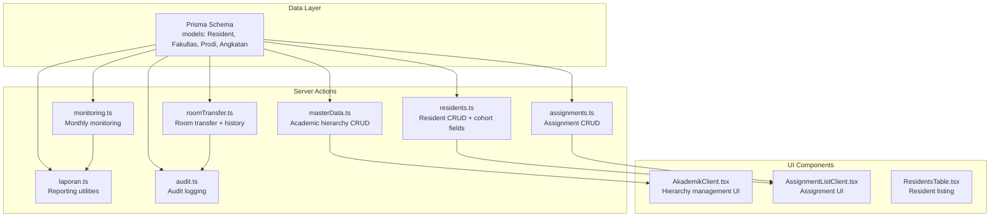

**Diagram sources**
- [schema.prisma](file://prisma/schema.prisma)
- [masterData.ts](file://src/app/actions/masterData.ts)
- [AkademikClient.tsx](file://src/components/dashboard/AkademikClient.tsx)
- [residents.ts](file://src/app/actions/residents.ts)
- [assignments.ts](file://src/app/actions/assignments.ts)
- [AssignmentListClient.tsx](file://src/components/dashboard/AssignmentListClient.tsx)
- [roomTransfer.ts](file://src/app/actions/roomTransfer.ts)
- [audit.ts](file://src/app/actions/audit.ts)
- [laporan.ts](file://src/app/actions/laporan.ts)
- [monitoring.ts](file://src/app/actions/monitoring.ts)

**Section sources**
- [schema.prisma](file://prisma/schema.prisma)
- [masterData.ts](file://src/app/actions/masterData.ts)
- [AkademikClient.tsx](file://src/components/dashboard/AkademikClient.tsx)
- [residents.ts](file://src/app/actions/residents.ts)
- [assignments.ts](file://src/app/actions/assignments.ts)
- [AssignmentListClient.tsx](file://src/components/dashboard/AssignmentListClient.tsx)
- [roomTransfer.ts](file://src/app/actions/roomTransfer.ts)
- [audit.ts](file://src/app/actions/audit.ts)
- [laporan.ts](file://src/app/actions/laporan.ts)
- [monitoring.ts](file://src/app/actions/monitoring.ts)

## Core Components
- Academic hierarchy models (Faculty, Department, Cohort) define the cohort structure and relationships.
- Server actions manage CRUD operations for hierarchy entities and resident cohort associations.
- Client components render the hierarchy UI, manage cohort assignments, and support reporting.
- Assignment and monitoring actions enable cohort analytics and progress tracking.

Key implementation references:
- Academic hierarchy CRUD: [masterData.ts](file://src/app/actions/masterData.ts)
- Cohort-aware resident operations: [residents.ts](file://src/app/actions/residents.ts)
- Cohort assignment management: [assignments.ts](file://src/app/actions/assignments.ts)
- Cohort analytics and reporting: [laporan.ts](file://src/app/actions/laporan.ts), [monitoring.ts](file://src/app/actions/monitoring.ts)
- Cohort transfer and room history: [roomTransfer.ts](file://src/app/actions/roomTransfer.ts), [audit.ts](file://src/app/actions/audit.ts)

**Section sources**
- [masterData.ts](file://src/app/actions/masterData.ts)
- [residents.ts](file://src/app/actions/residents.ts)
- [assignments.ts](file://src/app/actions/assignments.ts)
- [laporan.ts](file://src/app/actions/laporan.ts)
- [monitoring.ts](file://src/app/actions/monitoring.ts)
- [roomTransfer.ts](file://src/app/actions/roomTransfer.ts)
- [audit.ts](file://src/app/actions/audit.ts)

## Architecture Overview
The system implements a layered architecture:
- Data model layer defines academic hierarchy and cohort relationships.
- Server action layer encapsulates business logic for cohort management and analytics.
- UI component layer provides interactive dashboards for managing cohorts and assignments.
- Reporting layer aggregates cohort performance metrics from monitoring data.

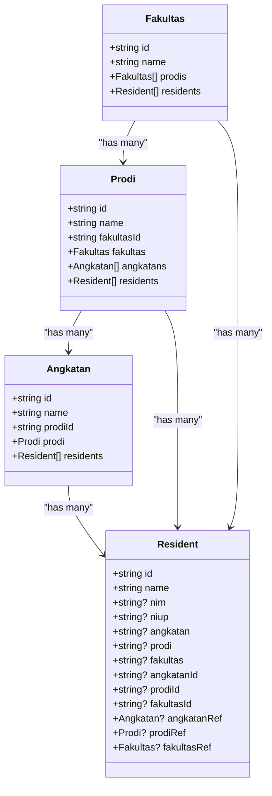

**Diagram sources**
- [schema.prisma](file://prisma/schema.prisma)

**Section sources**
- [schema.prisma](file://prisma/schema.prisma)

## Detailed Component Analysis

### Academic Year Tracking and Cohort Grouping
The academic year tracking and cohort grouping are modeled through the hierarchy:
- Faculty (Fakultas): Top-level academic unit.
- Department (Prodi): Contains multiple cohorts.
- Cohort/Batch (Angkatan): Defines the academic year cohort within a department.

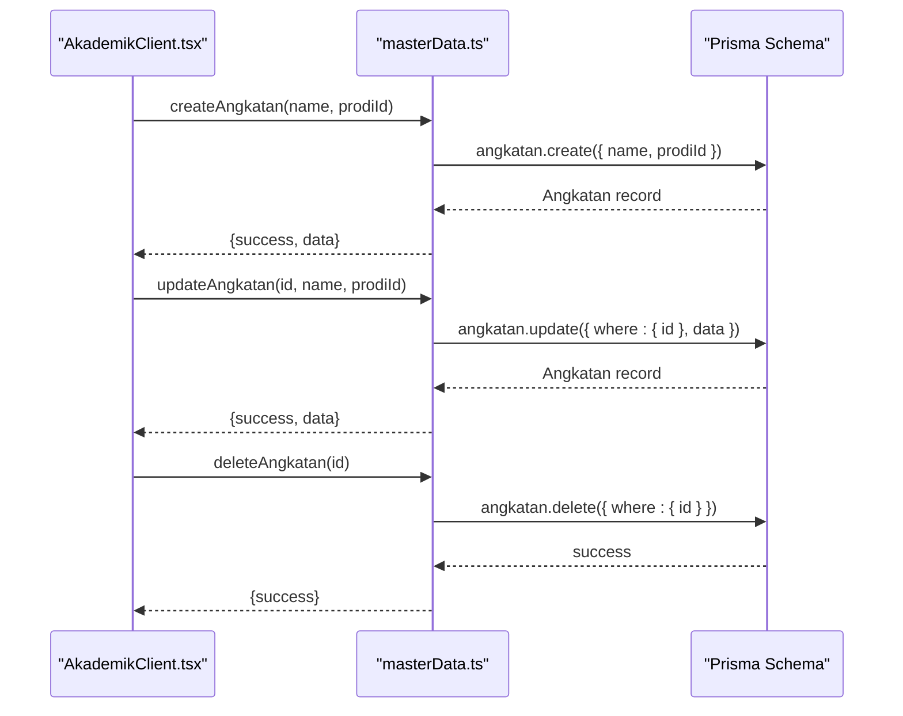

**Diagram sources**
- [AkademikClient.tsx](file://src/components/dashboard/AkademikClient.tsx)
- [masterData.ts](file://src/app/actions/masterData.ts)
- [schema.prisma](file://prisma/schema.prisma)

**Section sources**
- [masterData.ts](file://src/app/actions/masterData.ts)
- [AkademikClient.tsx](file://src/components/dashboard/AkademikClient.tsx)
- [schema.prisma](file://prisma/schema.prisma)

### Student Cohort Assignment and Enrollment Cycles
Students are associated with cohorts via both legacy string fields and new foreign keys. The wizard and resident actions support cohort assignment during registration and updates.

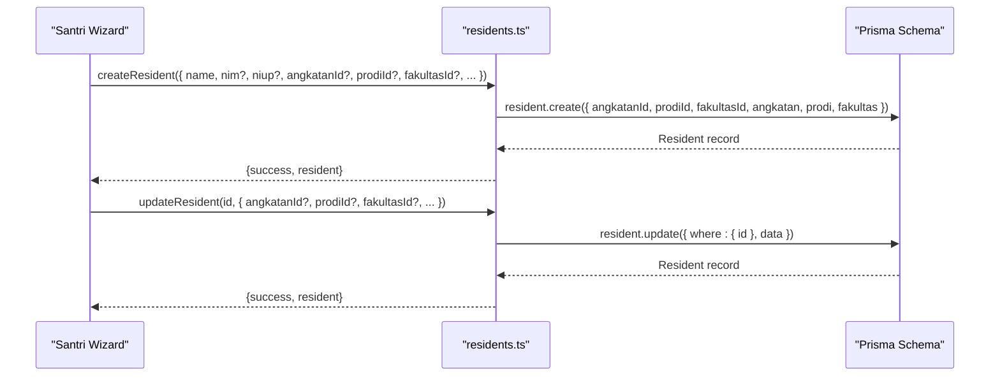

**Diagram sources**
- [residents.ts](file://src/app/actions/residents.ts)
- [schema.prisma](file://prisma/schema.prisma)

**Section sources**
- [residents.ts](file://src/app/actions/residents.ts)
- [schema.prisma](file://prisma/schema.prisma)

### Cohort Assignment Algorithms and Enrollment Cycles
Enrollment cycles are managed through the assignment system, which links students to organizational units (Satker) with defined roles and periods.

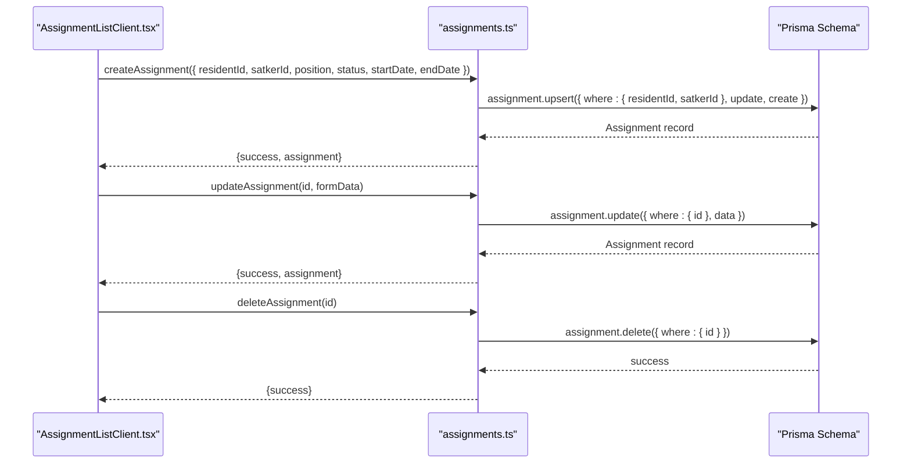

**Diagram sources**
- [AssignmentListClient.tsx](file://src/components/dashboard/AssignmentListClient.tsx)
- [assignments.ts](file://src/app/actions/assignments.ts)
- [schema.prisma](file://prisma/schema.prisma)

**Section sources**
- [assignments.ts](file://src/app/actions/assignments.ts)
- [AssignmentListClient.tsx](file://src/components/dashboard/AssignmentListClient.tsx)
- [schema.prisma](file://prisma/schema.prisma)

### Academic Progression Tracking
Progression tracking leverages monthly monitoring data aggregated per assignment, enabling cohort-level analytics.

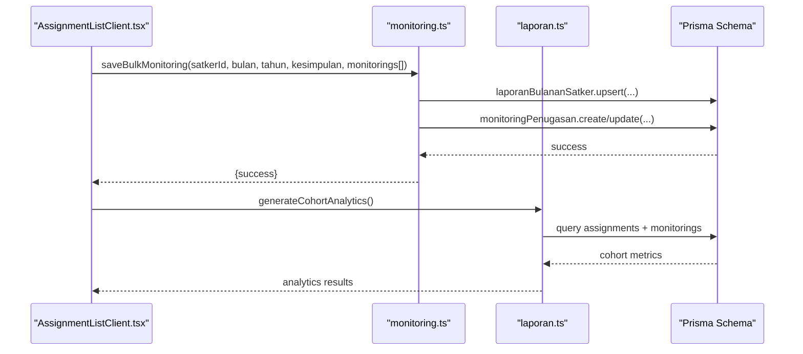

**Diagram sources**
- [monitoring.ts](file://src/app/actions/monitoring.ts)
- [laporan.ts](file://src/app/actions/laporan.ts)
- [AssignmentListClient.tsx](file://src/components/dashboard/AssignmentListClient.tsx)
- [schema.prisma](file://prisma/schema.prisma)

**Section sources**
- [monitoring.ts](file://src/app/actions/monitoring.ts)
- [laporan.ts](file://src/app/actions/laporan.ts)
- [AssignmentListClient.tsx](file://src/components/dashboard/AssignmentListClient.tsx)
- [schema.prisma](file://prisma/schema.prisma)

### Batch-Specific Reporting and Cohort Analytics
Cohort analytics compile average scores and activity statuses from monitoring records, enabling batch-specific reporting.

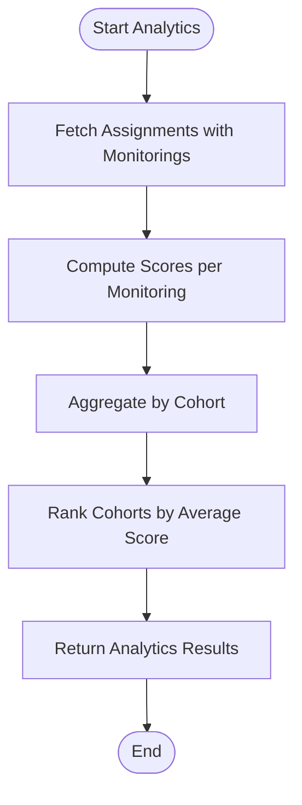

**Diagram sources**
- [laporan.ts](file://src/app/actions/laporan.ts)
- [monitoring.ts](file://src/app/actions/monitoring.ts)

**Section sources**
- [laporan.ts](file://src/app/actions/laporan.ts)
- [monitoring.ts](file://src/app/actions/monitoring.ts)

### Graduation Tracking
Graduation tracking is supported by marking assignments as completed and associating students with their final cohorts. Historical cohort membership is preserved through audit logs and room transfer history.

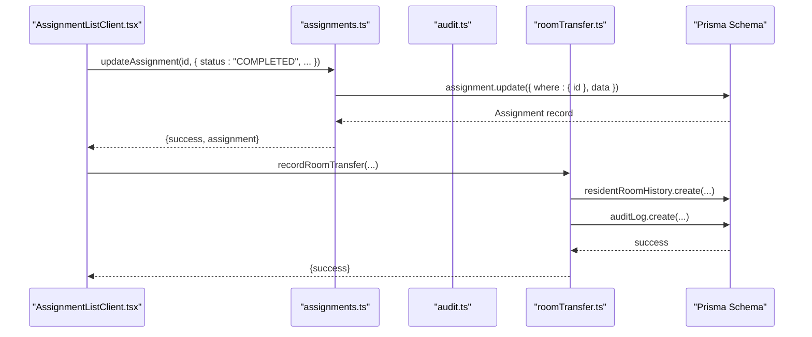

**Diagram sources**
- [assignments.ts](file://src/app/actions/assignments.ts)
- [audit.ts](file://src/app/actions/audit.ts)
- [roomTransfer.ts](file://src/app/actions/roomTransfer.ts)
- [AssignmentListClient.tsx](file://src/components/dashboard/AssignmentListClient.tsx)
- [schema.prisma](file://prisma/schema.prisma)

**Section sources**
- [assignments.ts](file://src/app/actions/assignments.ts)
- [audit.ts](file://src/app/actions/audit.ts)
- [roomTransfer.ts](file://src/app/actions/roomTransfer.ts)
- [AssignmentListClient.tsx](file://src/components/dashboard/AssignmentListClient.tsx)
- [schema.prisma](file://prisma/schema.prisma)

### Batch Data Synchronization and Cohort Transfer Operations
Data synchronization ensures consistency across legacy and new cohort fields. Cohort transfers are handled via room transfer actions with historical tracking.

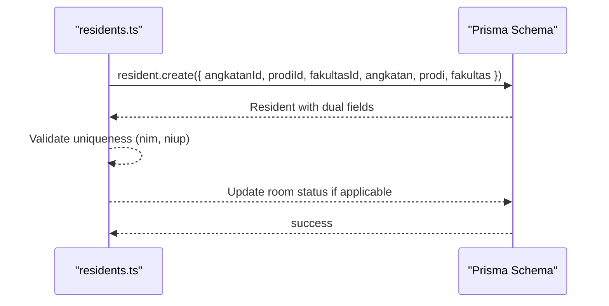

**Diagram sources**
- [residents.ts](file://src/app/actions/residents.ts)
- [schema.prisma](file://prisma/schema.prisma)

**Section sources**
- [residents.ts](file://src/app/actions/residents.ts)
- [schema.prisma](file://prisma/schema.prisma)

### Historical Cohort Management
Historical cohort membership is maintained through:
- Audit logs capturing cohort field changes
- Room transfer history preserving cohort transitions
- Cohort analytics leveraging historical monitoring data

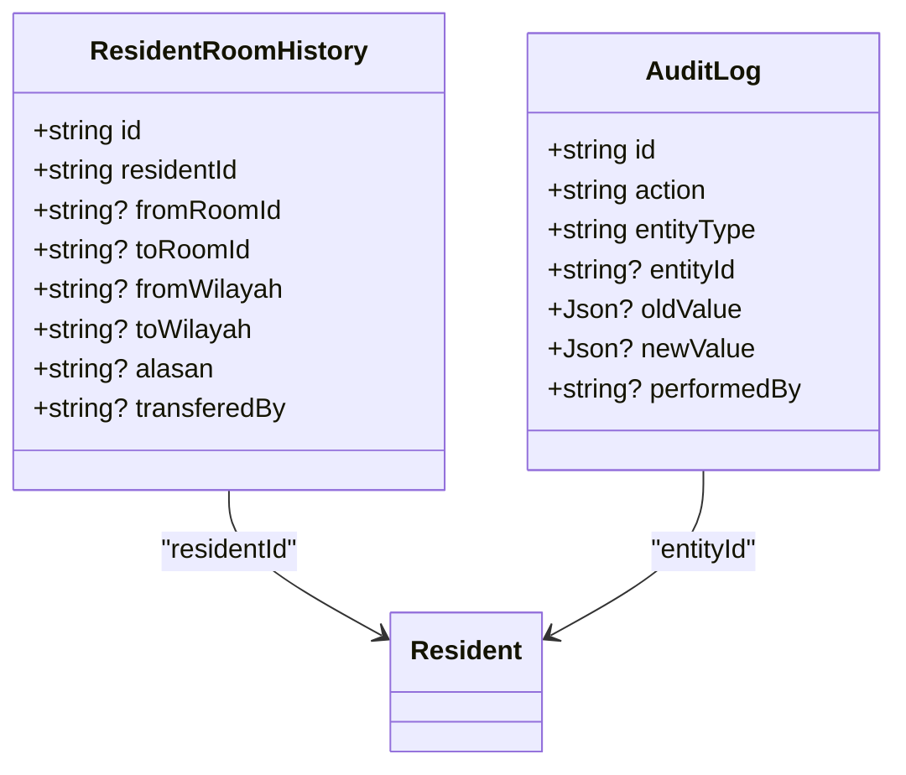

**Diagram sources**
- [audit.ts](file://src/app/actions/audit.ts)
- [roomTransfer.ts](file://src/app/actions/roomTransfer.ts)
- [schema.prisma](file://prisma/schema.prisma)

**Section sources**
- [audit.ts](file://src/app/actions/audit.ts)
- [roomTransfer.ts](file://src/app/actions/roomTransfer.ts)
- [schema.prisma](file://prisma/schema.prisma)

## Dependency Analysis
The system exhibits clear separation of concerns:
- Data models define academic hierarchy and cohort relationships.
- Server actions encapsulate business logic for cohort management and analytics.
- UI components depend on server actions for data persistence and retrieval.
- Reporting depends on monitoring data aggregation.

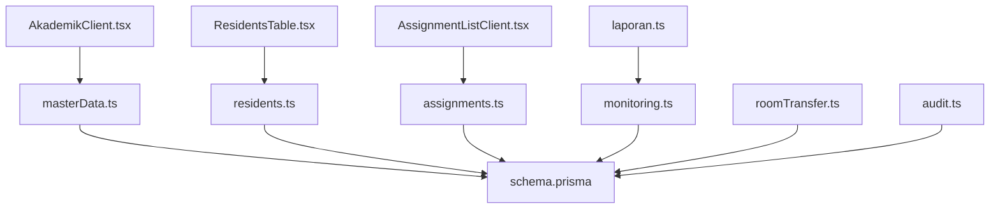

**Diagram sources**
- [masterData.ts](file://src/app/actions/masterData.ts)
- [residents.ts](file://src/app/actions/residents.ts)
- [assignments.ts](file://src/app/actions/assignments.ts)
- [monitoring.ts](file://src/app/actions/monitoring.ts)
- [laporan.ts](file://src/app/actions/laporan.ts)
- [roomTransfer.ts](file://src/app/actions/roomTransfer.ts)
- [audit.ts](file://src/app/actions/audit.ts)
- [schema.prisma](file://prisma/schema.prisma)
- [AkademikClient.tsx](file://src/components/dashboard/AkademikClient.tsx)
- [AssignmentListClient.tsx](file://src/components/dashboard/AssignmentListClient.tsx)
- [residents.tsx](file://src/components/dashboard/residents/ResidentsTable.tsx)

**Section sources**
- [masterData.ts](file://src/app/actions/masterData.ts)
- [residents.ts](file://src/app/actions/residents.ts)
- [assignments.ts](file://src/app/actions/assignments.ts)
- [monitoring.ts](file://src/app/actions/monitoring.ts)
- [laporan.ts](file://src/app/actions/laporan.ts)
- [roomTransfer.ts](file://src/app/actions/roomTransfer.ts)
- [audit.ts](file://src/app/actions/audit.ts)
- [schema.prisma](file://prisma/schema.prisma)
- [AkademikClient.tsx](file://src/components/dashboard/AkademikClient.tsx)
- [AssignmentListClient.tsx](file://src/components/dashboard/AssignmentListClient.tsx)
- [residents.tsx](file://src/components/dashboard/residents/ResidentsTable.tsx)

## Performance Considerations
- Use database indexes on frequently queried fields (e.g., resident cohort fields, assignment dates).
- Batch operations for cohort analytics reduce round-trips and improve throughput.
- Transaction boundaries in monitoring and reporting actions ensure data consistency.
- Client-side pagination and filtering minimize rendering overhead for large datasets.

## Troubleshooting Guide
Common issues and resolutions:
- Unique constraint violations for cohort names or student identifiers are handled with explicit error messages in server actions.
- Room capacity checks prevent over-occupancy during cohort transfers.
- Audit logs capture cohort-related changes for traceability and reconciliation.
- Monitoring data validation ensures only valid scores contribute to analytics.

**Section sources**
- [residents.ts](file://src/app/actions/residents.ts)
- [roomTransfer.ts](file://src/app/actions/roomTransfer.ts)
- [audit.ts](file://src/app/actions/audit.ts)
- [monitoring.ts](file://src/app/actions/monitoring.ts)

## Conclusion
The system provides robust batch and cohort management through a clear academic hierarchy, cohort-aware resident operations, assignment-driven progression tracking, and cohort analytics powered by monitoring data. Historical cohort management is ensured via audit logs and room transfer history, while batch-specific reporting enables actionable insights for academic administration.