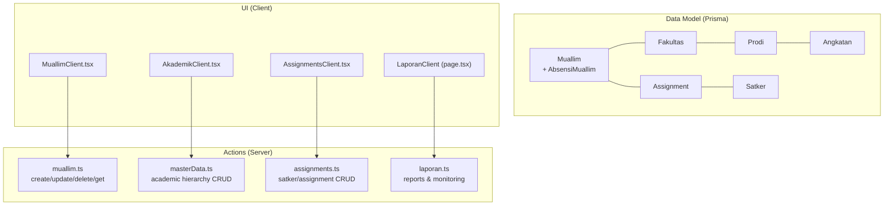
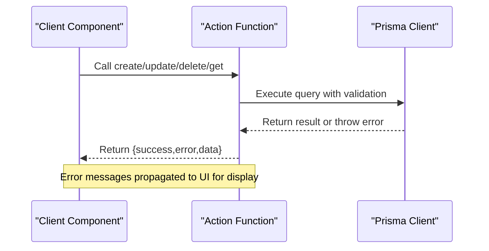
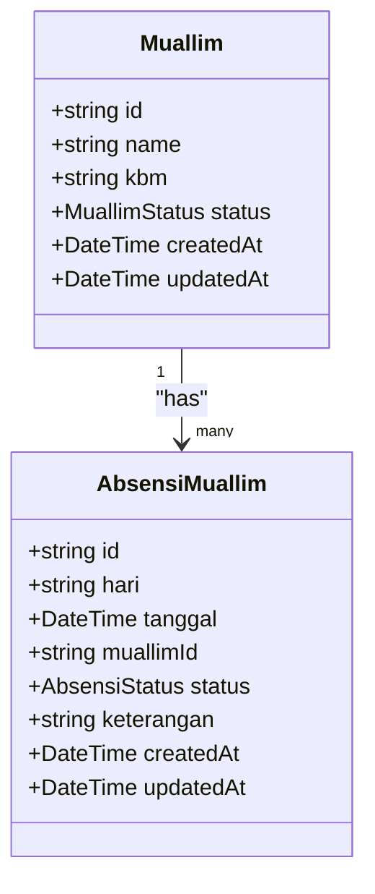
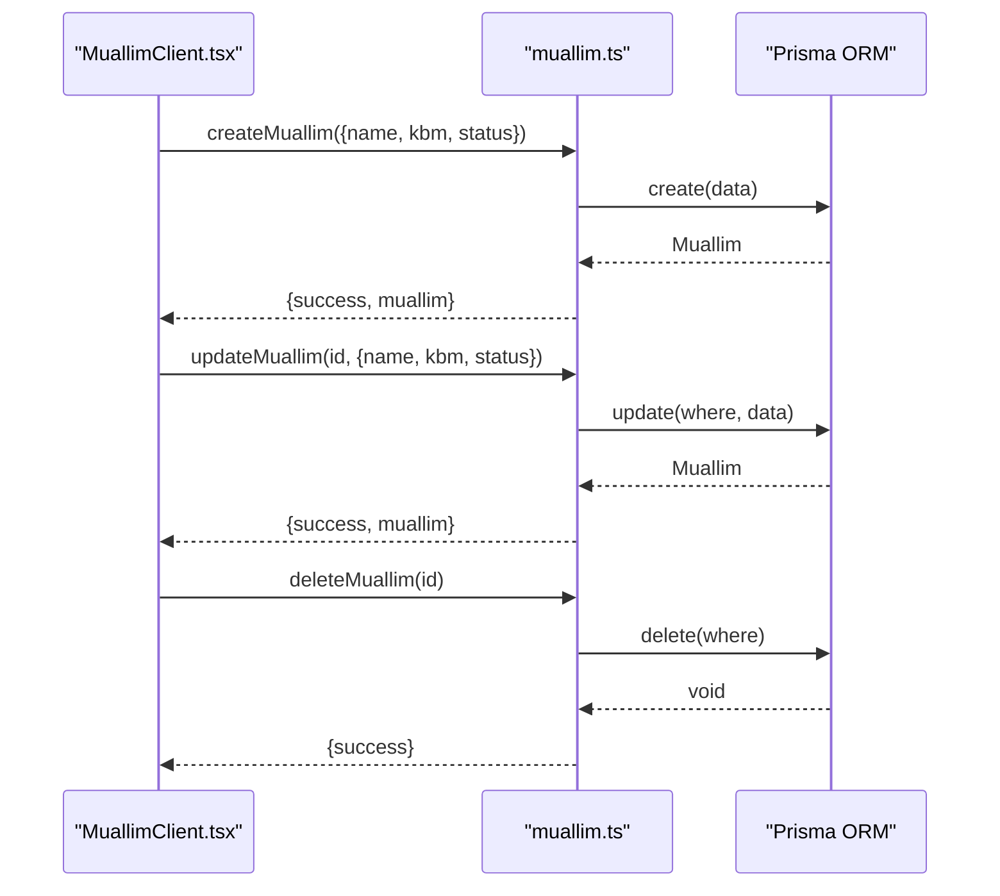
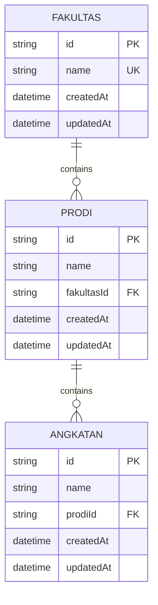
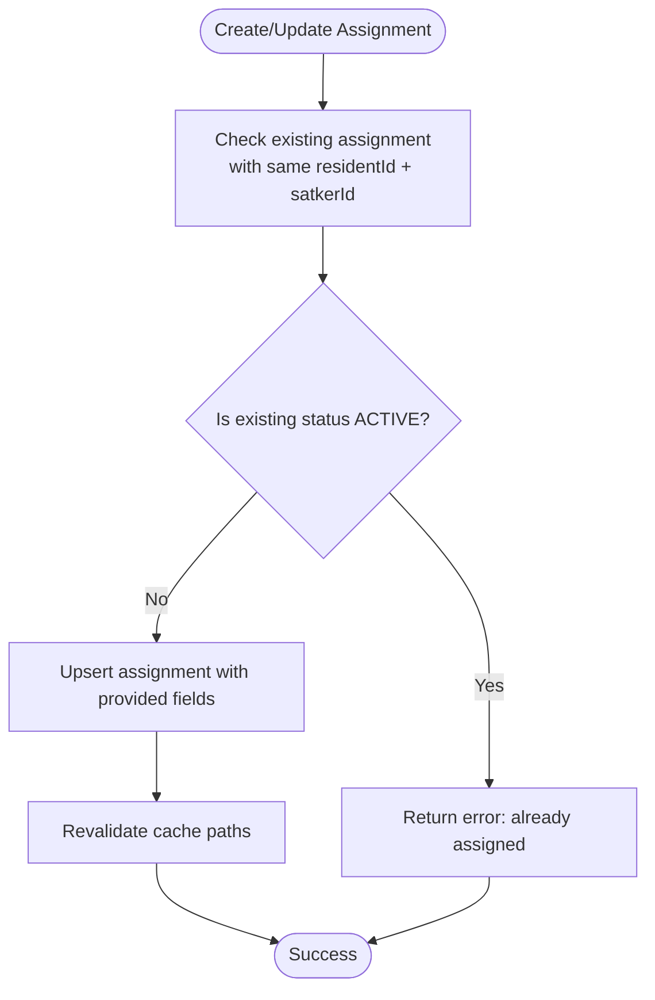
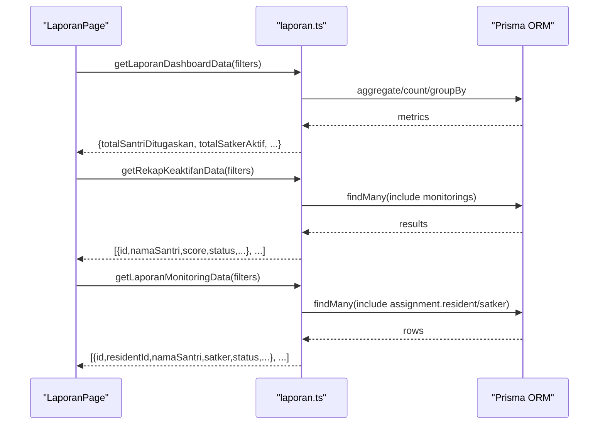
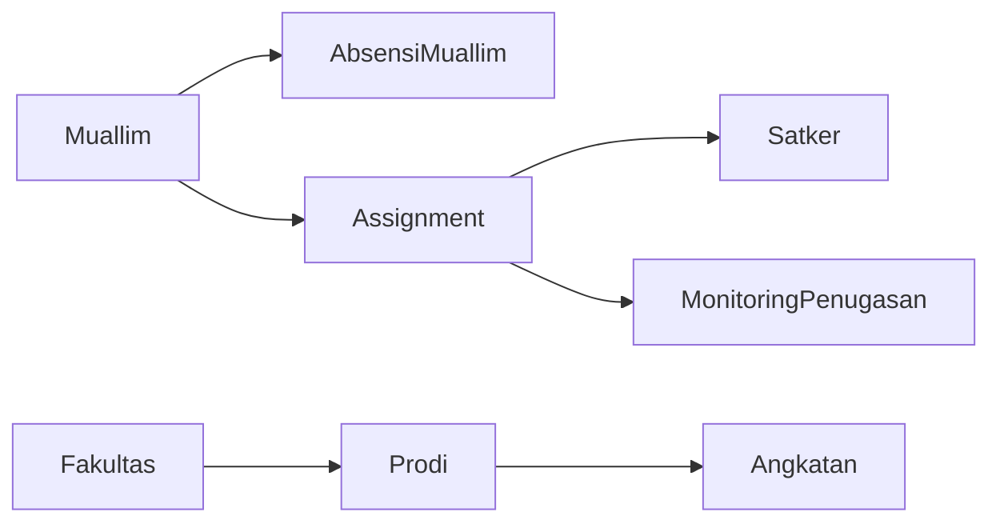

# Faculty Management

<cite>
**Referenced Files in This Document**
- [schema.prisma](file://prisma/schema.prisma)
- [muallim.ts](file://src/app/actions/muallim.ts)
- [MuallimClient.tsx](file://src/components/dashboard/MuallimClient.tsx)
- [page.tsx](file://src/app/dashboard/muallim/page.tsx)
- [masterData.ts](file://src/app/actions/masterData.ts)
- [AkademikClient.tsx](file://src/components/dashboard/AkademikClient.tsx)
- [assignments.ts](file://src/app/actions/assignments.ts)
- [AssignmentsClient.tsx](file://src/components/dashboard/AssignmentsClient.tsx)
- [page.tsx](file://src/app/dashboard/assignments/page.tsx)
- [laporan.ts](file://src/app/actions/laporan.ts)
- [page.tsx](file://src/app/dashboard/laporan/page.tsx)
</cite>

## Table of Contents
1. [Introduction](#introduction)
2. [Project Structure](#project-structure)
3. [Core Components](#core-components)
4. [Architecture Overview](#architecture-overview)
5. [Detailed Component Analysis](#detailed-component-analysis)
6. [Dependency Analysis](#dependency-analysis)
7. [Performance Considerations](#performance-considerations)
8. [Troubleshooting Guide](#troubleshooting-guide)
9. [Conclusion](#conclusion)

## Introduction
This document describes the faculty management capabilities implemented in the project, focusing on the teacher/staff entity (named "Muallim" in the codebase) and its surrounding workflows. It covers creation, modification, and deletion of faculty records, integration with academic hierarchy (faculty/prodi/angkatan), assignment tracking to organizational units (Satker), and reporting features. It also documents data validation rules, unique constraints, error handling mechanisms, and administrative workflows.

## Project Structure
Faculty management spans three primary areas:
- Data model: Prisma schema defines the Muallim entity and related academic hierarchy and assignment structures.
- Actions: Server-side functions encapsulate CRUD operations and validation for Muallim, academic hierarchy, and assignments.
- UI: Client components provide interactive forms and lists for managing Muallim and academic hierarchy, plus assignment tracking and reporting.

**Diagram sources**
- [schema.prisma](file://prisma/schema.prisma)
- [muallim.ts](file://src/app/actions/muallim.ts)
- [masterData.ts](file://src/app/actions/masterData.ts)
- [assignments.ts](file://src/app/actions/assignments.ts)
- [laporan.ts](file://src/app/actions/laporan.ts)
- [MuallimClient.tsx](file://src/components/dashboard/MuallimClient.tsx)
- [AkademikClient.tsx](file://src/components/dashboard/AkademikClient.tsx)
- [AssignmentsClient.tsx](file://src/components/dashboard/AssignmentsClient.tsx)
- [page.tsx](file://src/app/dashboard/laporan/page.tsx)

**Section sources**
- [schema.prisma](file://prisma/schema.prisma)
- [muallim.ts](file://src/app/actions/muallim.ts)
- [masterData.ts](file://src/app/actions/masterData.ts)
- [assignments.ts](file://src/app/actions/assignments.ts)
- [laporan.ts](file://src/app/actions/laporan.ts)
- [MuallimClient.tsx](file://src/components/dashboard/MuallimClient.tsx)
- [AkademikClient.tsx](file://src/components/dashboard/AkademikClient.tsx)
- [AssignmentsClient.tsx](file://src/components/dashboard/AssignmentsClient.tsx)
- [page.tsx](file://src/app/dashboard/laporan/page.tsx)

## Core Components
- Muallim management: Create, update, delete, and list teachers/staff with status control.
- Academic hierarchy: Manage Fakultas, Prodi, and Angkatan with unique constraints and cascading deletes.
- Assignment tracking: Link residents to Satker units with position, status, and date ranges.
- Reporting: Dashboard metrics, activity summaries, monitoring reports, and export history.

**Section sources**
- [muallim.ts](file://src/app/actions/muallim.ts)
- [masterData.ts](file://src/app/actions/masterData.ts)
- [assignments.ts](file://src/app/actions/assignments.ts)
- [laporan.ts](file://src/app/actions/laporan.ts)

## Architecture Overview
The system follows a layered architecture:
- UI Layer: Next.js Client Components render forms and lists.
- Action Layer: "use server" functions encapsulate database operations and validation.
- Data Layer: Prisma ORM models define entities, relations, and constraints.

**Diagram sources**
- [muallim.ts](file://src/app/actions/muallim.ts)
- [masterData.ts](file://src/app/actions/masterData.ts)
- [assignments.ts](file://src/app/actions/assignments.ts)
- [laporan.ts](file://src/app/actions/laporan.ts)

## Detailed Component Analysis

### Faculty Entity (Muallim)
- Purpose: Represents teachers/staff members with name, teaching activity (KBM), and status.
- Key attributes: id, name, kbm, status, timestamps.
- Status enum: ACTIVE, INACTIVE.
- Related entities: AbsensiMuallim for attendance tracking.

**Diagram sources**
- [schema.prisma](file://prisma/schema.prisma)

**Section sources**
- [schema.prisma](file://prisma/schema.prisma)
- [muallim.ts](file://src/app/actions/muallim.ts)
- [MuallimClient.tsx](file://src/components/dashboard/MuallimClient.tsx)
- [page.tsx](file://src/app/dashboard/muallim/page.tsx)

### Faculty Workflows
- Creation: Validates presence of required fields and persists via Prisma. On success, triggers cache revalidation; on failure, returns error message.
- Modification: Updates name, KBM, and status atomically; revalidates cache.
- Deletion: Removes record and revalidates cache; errors surfaced to UI.

**Diagram sources**
- [muallim.ts](file://src/app/actions/muallim.ts)
- [MuallimClient.tsx](file://src/components/dashboard/MuallimClient.tsx)

**Section sources**
- [muallim.ts](file://src/app/actions/muallim.ts)
- [MuallimClient.tsx](file://src/components/dashboard/MuallimClient.tsx)

### Academic Hierarchy (Fakultas, Prodi, Angkatan)
- Purpose: Define institutional academic structure with unique constraints and cascading deletes.
- Unique constraints:
  - Fakultas.name is unique.
  - Prodi.name + fakultasId is unique.
  - Angkatan.name + prodiId is unique.
- Cascading behavior:
  - Deleting Fakultas deletes associated Prodis and Angkatans.
  - Deleting Prodi deletes associated Angkatans.

**Diagram sources**
- [schema.prisma](file://prisma/schema.prisma)

**Section sources**
- [schema.prisma](file://prisma/schema.prisma)
- [masterData.ts](file://src/app/actions/masterData.ts)
- [AkademikClient.tsx](file://src/components/dashboard/AkademikClient.tsx)

### Faculty Assignment Tracking (Satker and Assignments)
- Purpose: Track which residents are assigned to which Satker units with positions and statuses.
- Unique constraint: residentId + satkerId must be unique for active assignments.
- Upsert logic: If an active assignment exists for the same resident-Satker pair, the system prevents duplication; otherwise, it creates or updates the assignment.

**Diagram sources**
- [assignments.ts](file://src/app/actions/assignments.ts)

**Section sources**
- [schema.prisma](file://prisma/schema.prisma)
- [assignments.ts](file://src/app/actions/assignments.ts)
- [AssignmentsClient.tsx](file://src/components/dashboard/AssignmentsClient.tsx)
- [page.tsx](file://src/app/dashboard/assignments/page.tsx)

### Reporting and Administrative Workflows
- Dashboard metrics: Aggregate counts for assigned residents, active Satkers, monthly monitoring counts, and activity distribution.
- Activity summaries: Recaps student activity scores per resident across monitored periods.
- Monitoring reports: Monthly monitoring entries with status and notes.
- Export history: Logs of exported reports with user attribution.

**Diagram sources**
- [laporan.ts](file://src/app/actions/laporan.ts)
- [page.tsx](file://src/app/dashboard/laporan/page.tsx)

**Section sources**
- [laporan.ts](file://src/app/actions/laporan.ts)
- [page.tsx](file://src/app/dashboard/laporan/page.tsx)

## Dependency Analysis
- Muallim depends on AbsensiMuallim for attendance records.
- Academic hierarchy enforces referential integrity via foreign keys and cascades.
- Assignments link residents to Satkers and include monitoring entries.
- Reports depend on assignments and monitoring data.

**Diagram sources**
- [schema.prisma](file://prisma/schema.prisma)

**Section sources**
- [schema.prisma](file://prisma/schema.prisma)

## Performance Considerations
- Use of Prisma indexes on frequently queried fields (e.g., Assignment.unique residentId_satkerId, MonitoringPenugasan indexes) improves lookup performance.
- Batch operations and upserts minimize redundant queries for assignment management.
- Cache revalidation via Next.js revalidatePath ensures UI consistency without manual refresh.

## Troubleshooting Guide
Common issues and resolutions:
- Duplicate academic entries: Unique constraint violations return specific error messages for Fakultas, Prodi, and Angkatan. Validate inputs before submission.
- Duplicate active assignment: Attempting to create another active assignment for the same resident-Satker pair returns an error; use the edit form to update the existing assignment.
- Unauthorized access: Report pages enforce permission checks; ensure the user has appropriate permissions before navigating to restricted tabs.
- Validation failures: Action functions catch Prisma errors and return user-friendly messages; inspect returned error fields in UI modals.

**Section sources**
- [masterData.ts](file://src/app/actions/masterData.ts)
- [assignments.ts](file://src/app/actions/assignments.ts)
- [laporan.ts](file://src/app/actions/laporan.ts)

## Conclusion
The faculty management subsystem centers on the Muallim entity with robust CRUD actions, integrates tightly with the academic hierarchy and assignment tracking, and supports comprehensive reporting. Unique constraints and cascading rules maintain data integrity, while error handling and cache revalidation ensure a responsive user experience. Administrators can manage faculty profiles, track assignments, and generate meaningful reports aligned with operational needs.