# Program Study Management

<cite>
**Referenced Files in This Document**
- [schema.prisma](file://prisma/schema.prisma)
- [masterData.ts](file://src/app/actions/masterData.ts)
- [AkademikClient.tsx](file://src/components/dashboard/AkademikClient.tsx)
- [akademik/page.tsx](file://src/app/dashboard/akademik/page.tsx)
- [residents.ts](file://src/app/actions/residents.ts)
- [prisma.ts](file://src/lib/prisma.ts)
- [audit.ts](file://src/app/actions/audit.ts)
- [audit-logs/page.tsx](file://src/app/dashboard/audit-logs/page.tsx)
- [AuditLogClient.tsx](file://src/components/dashboard/audit-log/AuditLogClient.tsx)
- [laporan.ts](file://src/app/actions/laporan.ts)
- [LaporanClient.tsx](file://src/components/dashboard/laporan/LaporanClient.tsx)
- [202606230001_make_resident_nim_optional/migration.sql](file://prisma/migrations/202606230001_make_resident_nim_optional/migration.sql)
</cite>

## Table of Contents
1. [Introduction](#introduction)
2. [Project Structure](#project-structure)
3. [Core Components](#core-components)
4. [Architecture Overview](#architecture-overview)
5. [Detailed Component Analysis](#detailed-component-analysis)
6. [Dependency Analysis](#dependency-analysis)
7. [Performance Considerations](#performance-considerations)
8. [Troubleshooting Guide](#troubleshooting-guide)
9. [Conclusion](#conclusion)

## Introduction
This document provides comprehensive coverage of Program Study Management within the Asrama system. It focuses on department (faculty) creation, faculty-to-program associations, and program tracking through the academic hierarchy. The documentation explains the hierarchical relationships between faculties and programs, program-specific data validation, faculty dependency constraints, program enrollment tracking, curriculum management integration via academic hierarchy, and program reporting features. It also covers program data migration, batch operations, and administrative oversight capabilities.

## Project Structure
The Program Study Management functionality spans database modeling, server actions, UI components, and administrative dashboards:

- Database schema defines the academic hierarchy (Faculty → Program → Cohort/Generation) and links to resident enrollment data.
- Server actions encapsulate CRUD operations for academic entities and enrollment/batch operations.
- UI components render the academic hierarchy and enable interactive management.
- Administrative dashboards provide oversight via audit logging and reporting.

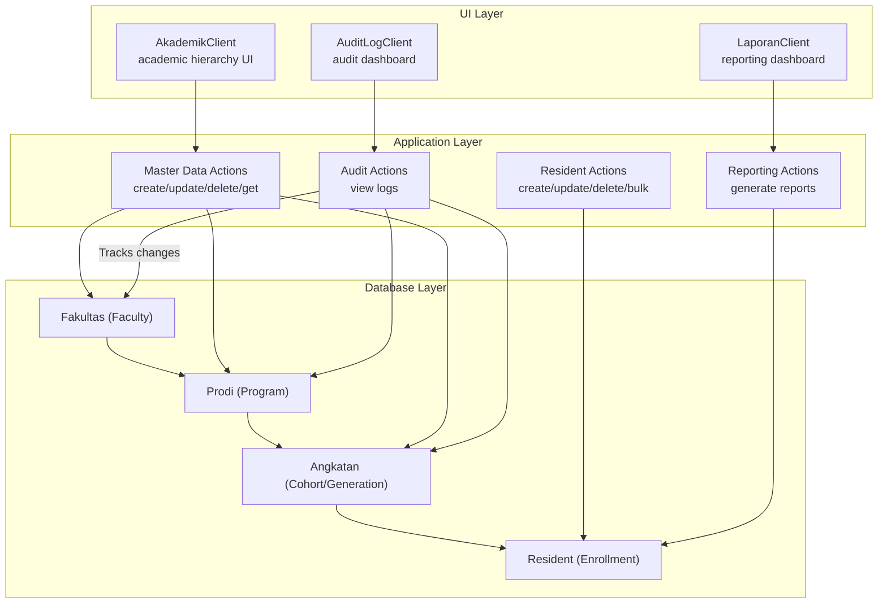

**Diagram sources**
- [schema.prisma](file://prisma/schema.prisma)
- [masterData.ts](file://src/app/actions/masterData.ts)
- [residents.ts](file://src/app/actions/residents.ts)
- [audit.ts](file://src/app/actions/audit.ts)
- [laporan.ts](file://src/app/actions/laporan.ts)
- [AkademikClient.tsx](file://src/components/dashboard/AkademikClient.tsx)
- [AuditLogClient.tsx](file://src/components/dashboard/audit-log/AuditLogClient.tsx)
- [LaporanClient.tsx](file://src/components/dashboard/laporan/LaporanClient.tsx)

**Section sources**
- [schema.prisma](file://prisma/schema.prisma)
- [masterData.ts](file://src/app/actions/masterData.ts)
- [AkademikClient.tsx](file://src/components/dashboard/AkademikClient.tsx)
- [akademik/page.tsx](file://src/app/dashboard/akademik/page.tsx)
- [residents.ts](file://src/app/actions/residents.ts)
- [audit.ts](file://src/app/actions/audit.ts)
- [audit-logs/page.tsx](file://src/app/dashboard/audit-logs/page.tsx)
- [AuditLogClient.tsx](file://src/components/dashboard/audit-log/AuditLogClient.tsx)
- [laporan.ts](file://src/app/actions/laporan.ts)
- [LaporanClient.tsx](file://src/components/dashboard/laporan/LaporanClient.tsx)

## Core Components
- Academic Hierarchy Models: Faculty, Program, and Cohort are modeled with unique constraints and cascading deletes to maintain referential integrity.
- Enrollment Integration: Resident records capture both legacy string fields and new foreign keys for faculty, program, and cohort, enabling curriculum integration.
- Academic Management Actions: Server actions provide create, update, delete, and list operations for the academic hierarchy with validation and error handling.
- Academic UI: The AkademikClient renders a collapsible hierarchy with create/edit/delete operations and auto-expansion behavior.
- Batch Operations: Bulk create, delete, and move residents support administrative-scale enrollment management.
- Audit Logging: Comprehensive audit logging tracks changes to academic entities and enrollment data.
- Reporting: Reporting actions aggregate monitoring and assignment data for program-level insights.

**Section sources**
- [schema.prisma](file://prisma/schema.prisma)
- [masterData.ts](file://src/app/actions/masterData.ts)
- [AkademikClient.tsx](file://src/components/dashboard/AkademikClient.tsx)
- [residents.ts](file://src/app/actions/residents.ts)
- [audit.ts](file://src/app/actions/audit.ts)
- [laporan.ts](file://src/app/actions/laporan.ts)

## Architecture Overview
The system follows a layered architecture:
- Database layer: Prisma schema defines entities and relationships.
- Application layer: Server actions encapsulate business logic and data access.
- Presentation layer: Client components manage UI interactions and state.
- Administrative layer: Audit and reporting actions provide oversight and analytics.

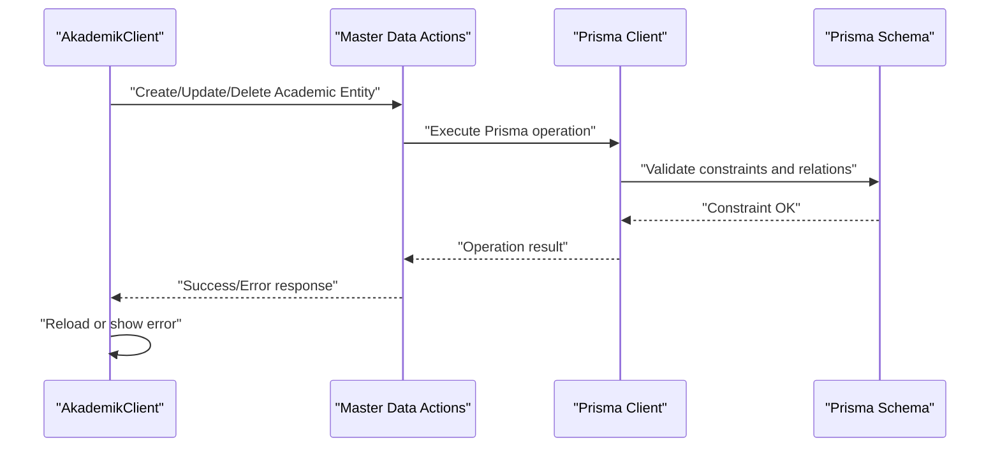

**Diagram sources**
- [masterData.ts](file://src/app/actions/masterData.ts)
- [prisma.ts](file://src/lib/prisma.ts)
- [schema.prisma](file://prisma/schema.prisma)

## Detailed Component Analysis

### Academic Hierarchy Models and Relationships
The Prisma schema establishes a strict hierarchy:
- Faculty (Fakultas) uniquely identifies departments.
- Program (Prodi) belongs to a single Faculty and can have multiple cohorts.
- Cohort (Angkatan) belongs to a single Program.
- Resident enrollment references both legacy string fields and new foreign keys for faculty, program, and cohort.

Key constraints:
- Unique combinations prevent duplicates across the hierarchy.
- Cascading deletes ensure dependent entities are removed when parents are deleted.

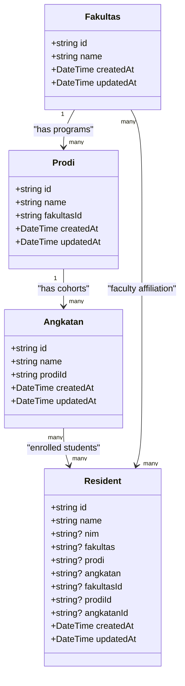

**Diagram sources**
- [schema.prisma](file://prisma/schema.prisma)

**Section sources**
- [schema.prisma](file://prisma/schema.prisma)

### Academic Management Actions
The master data actions provide:
- CRUD operations for Faculty, Program, and Cohort with validation and unique constraint handling.
- Automatic cache invalidation to refresh UI after changes.
- Error handling for duplicate entries and general failures.

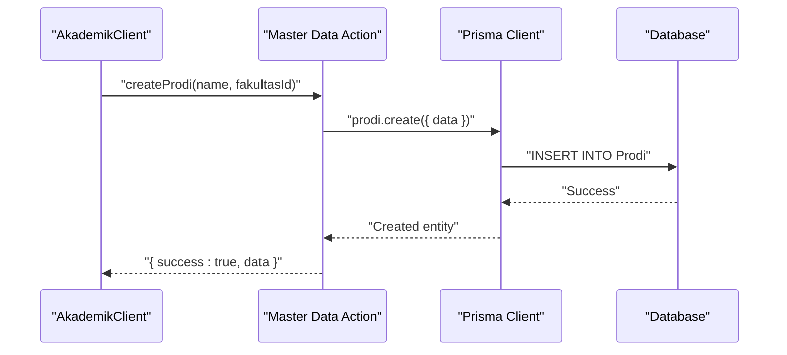

**Diagram sources**
- [masterData.ts](file://src/app/actions/masterData.ts)
- [prisma.ts](file://src/lib/prisma.ts)

**Section sources**
- [masterData.ts](file://src/app/actions/masterData.ts)

### Academic UI: Hierarchical Management
The AkademikClient renders:
- Expandable Faculty nodes with nested Programs and Cohorts.
- Inline create/edit/delete controls with auto-expansion for parent entities.
- Confirmation dialogs for destructive operations.
- Real-time updates via page reload after successful operations.

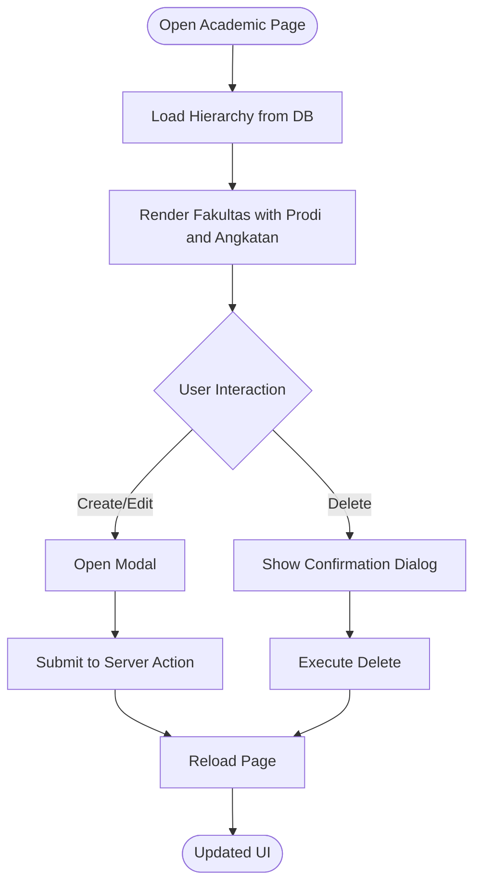

**Diagram sources**
- [akademik/page.tsx](file://src/app/dashboard/akademik/page.tsx)
- [AkademikClient.tsx](file://src/components/dashboard/AkademikClient.tsx)
- [masterData.ts](file://src/app/actions/masterData.ts)

**Section sources**
- [akademik/page.tsx](file://src/app/dashboard/akademik/page.tsx)
- [AkademikClient.tsx](file://src/components/dashboard/AkademikClient.tsx)

### Program-Specific Data Validation and Faculty Dependencies
Validation ensures:
- Required fields for academic entities are present.
- Unique constraints are enforced at the database level.
- Faculty dependency constraints prevent orphaned programs.

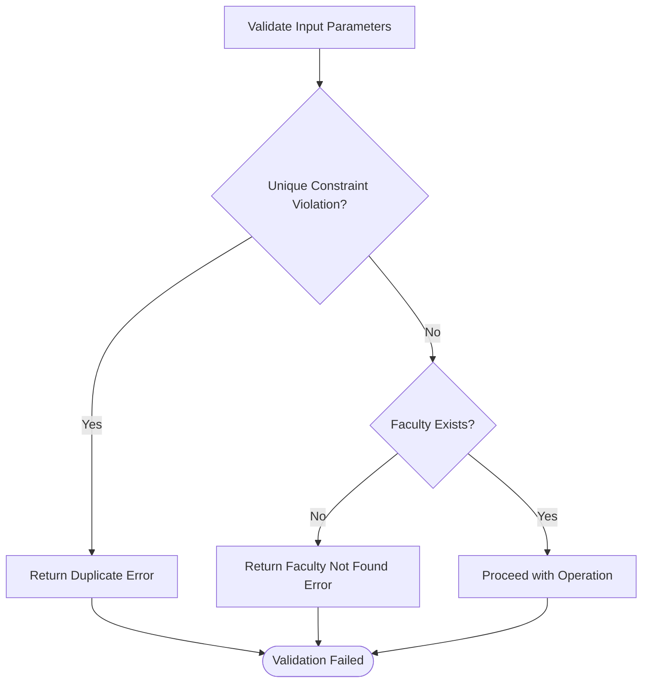

**Diagram sources**
- [masterData.ts](file://src/app/actions/masterData.ts)
- [schema.prisma](file://prisma/schema.prisma)

**Section sources**
- [masterData.ts](file://src/app/actions/masterData.ts)
- [schema.prisma](file://prisma/schema.prisma)

### Program Enrollment Tracking and Curriculum Integration
Enrollment tracking integrates with the academic hierarchy:
- Resident records store both legacy string fields and new foreign keys for faculty, program, and cohort.
- Validation enforces required enrollment fields (name, gender, place/date of birth, program, cohort).
- Optional NIM migration allows backward compatibility while transitioning to foreign keys.

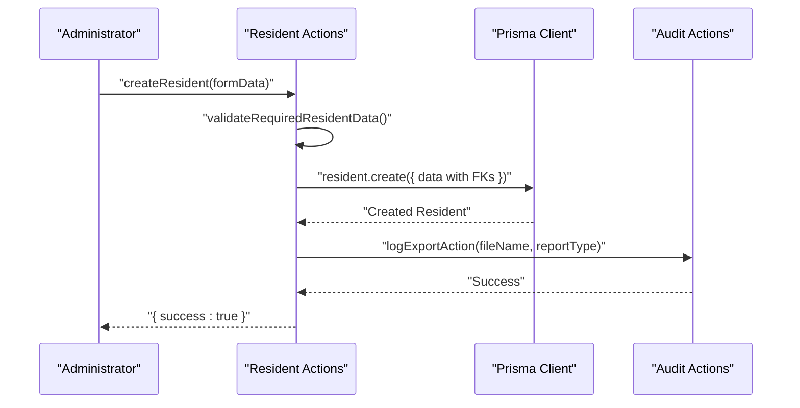

**Diagram sources**
- [residents.ts](file://src/app/actions/residents.ts)
- [audit.ts](file://src/app/actions/audit.ts)
- [schema.prisma](file://prisma/schema.prisma)

**Section sources**
- [residents.ts](file://src/app/actions/residents.ts)
- [202606230001_make_resident_nim_optional/migration.sql](file://prisma/migrations/202606230001_make_resident_nim_optional/migration.sql)

### Batch Operations and Administrative Oversight
Batch operations support large-scale administrative tasks:
- Bulk create residents with validation and room assignment.
- Bulk delete and move residents with capacity checks and room status updates.
- Audit logging captures all mutations for oversight and compliance.

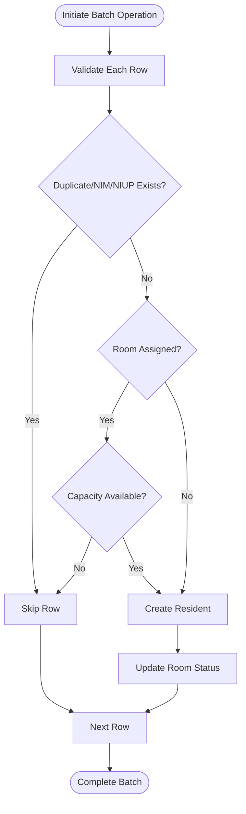

**Diagram sources**
- [residents.ts](file://src/app/actions/residents.ts)
- [schema.prisma](file://prisma/schema.prisma)

**Section sources**
- [residents.ts](file://src/app/actions/residents.ts)

### Reporting Features
Reporting aggregates monitoring and assignment data:
- Calculates average scores per resident based on monitoring statuses.
- Generates ranking lists and status categorization.
- Supports filtering by month/year and organizational unit.

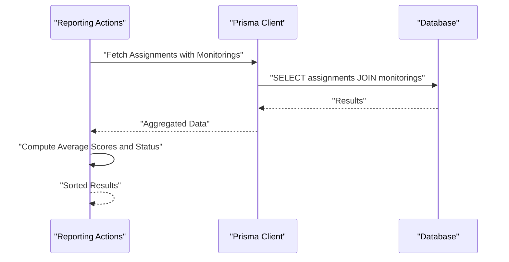

**Diagram sources**
- [laporan.ts](file://src/app/actions/laporan.ts)
- [prisma.ts](file://src/lib/prisma.ts)

**Section sources**
- [laporan.ts](file://src/app/actions/laporan.ts)
- [LaporanClient.tsx](file://src/components/dashboard/laporan/LaporanClient.tsx)

### Audit Logging and Administrative Oversight
Audit logging provides:
- Comprehensive tracking of create/update/delete/import actions.
- Filtering by action type, user, date range, and search terms.
- Pagination and detailed change diffs for transparency.

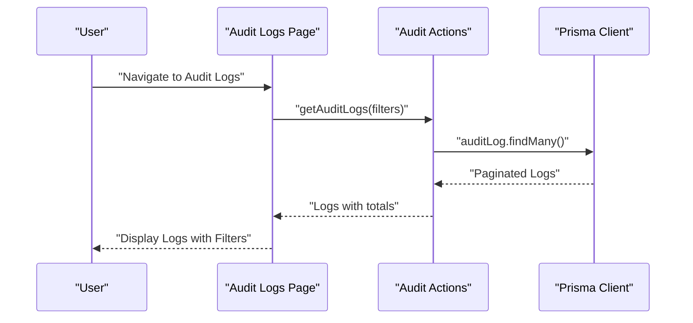

**Diagram sources**
- [audit-logs/page.tsx](file://src/app/dashboard/audit-logs/page.tsx)
- [audit.ts](file://src/app/actions/audit.ts)
- [AuditLogClient.tsx](file://src/components/dashboard/audit-log/AuditLogClient.tsx)
- [prisma.ts](file://src/lib/prisma.ts)

**Section sources**
- [audit-logs/page.tsx](file://src/app/dashboard/audit-logs/page.tsx)
- [audit.ts](file://src/app/actions/audit.ts)
- [AuditLogClient.tsx](file://src/components/dashboard/audit-log/AuditLogClient.tsx)

## Dependency Analysis
The system exhibits clear separation of concerns:
- UI components depend on server actions for data mutations.
- Server actions depend on Prisma for database operations.
- Audit and reporting actions depend on server sessions and permissions.
- Database constraints enforce referential integrity across the academic hierarchy.

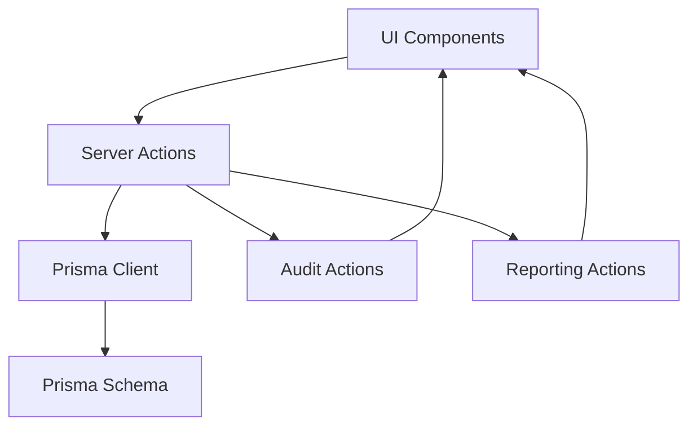

**Diagram sources**
- [AkademikClient.tsx](file://src/components/dashboard/AkademikClient.tsx)
- [masterData.ts](file://src/app/actions/masterData.ts)
- [residents.ts](file://src/app/actions/residents.ts)
- [audit.ts](file://src/app/actions/audit.ts)
- [laporan.ts](file://src/app/actions/laporan.ts)
- [prisma.ts](file://src/lib/prisma.ts)
- [schema.prisma](file://prisma/schema.prisma)

**Section sources**
- [prisma.ts](file://src/lib/prisma.ts)
- [schema.prisma](file://prisma/schema.prisma)

## Performance Considerations
- Database indexing: Unique and index constraints on academic entities optimize lookups and prevent duplicates.
- Server-side caching: Revalidation paths ensure UI consistency after mutations.
- Batch operations: Efficient bulk processing minimizes repeated database round-trips.
- Audit logging: Structured JSON snapshots enable fast filtering and pagination.

## Troubleshooting Guide
Common issues and resolutions:
- Duplicate Academic Entities: Unique constraint violations return specific error messages; adjust names or IDs accordingly.
- Faculty Dependency Errors: Ensure Faculty exists before creating Programs; cascade deletion removes dependent Programs and Cohorts.
- Enrollment Validation Failures: Verify required fields (name, gender, place/date of birth, program, cohort) and date formats.
- Batch Import Errors: Review skipped rows due to duplicates or capacity constraints; correct data and retry.
- Audit Log Access: Confirm proper permissions and session validity for viewing audit logs.

**Section sources**
- [masterData.ts](file://src/app/actions/masterData.ts)
- [residents.ts](file://src/app/actions/residents.ts)
- [audit.ts](file://src/app/actions/audit.ts)

## Conclusion
The Program Study Management system provides a robust foundation for academic administration:
- Clear hierarchical modeling supports scalable faculty and program management.
- Strong validation and constraints ensure data integrity.
- Integrated enrollment tracking enables curriculum alignment and reporting.
- Batch operations streamline administrative tasks.
- Comprehensive audit logging and reporting facilitate oversight and compliance.