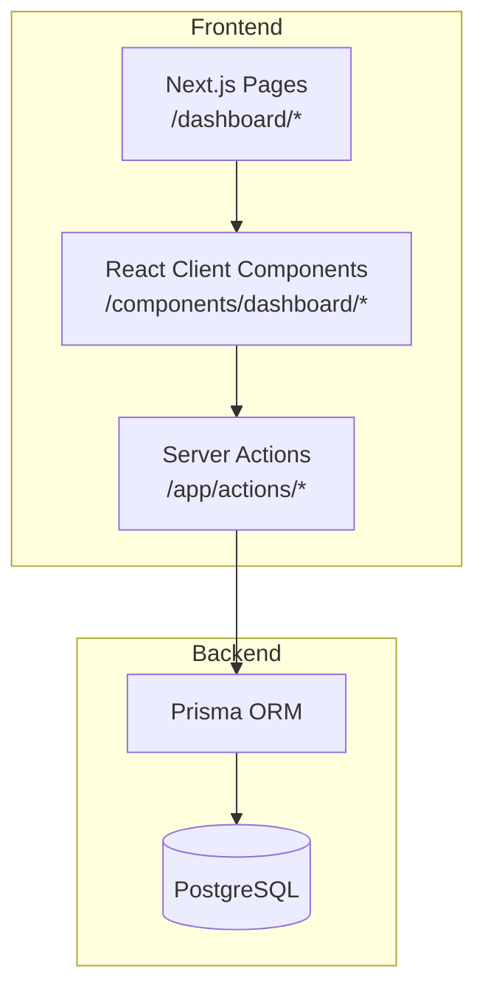
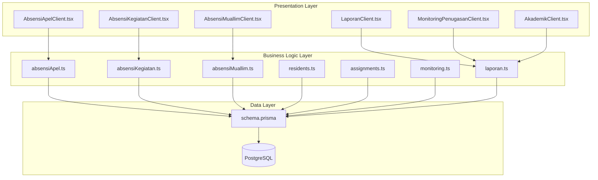
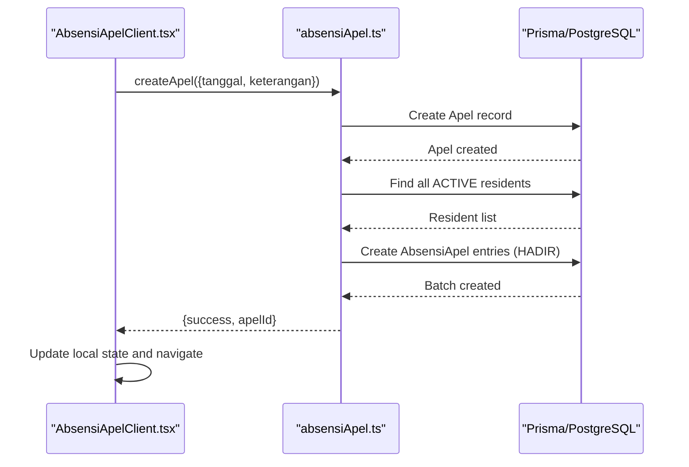
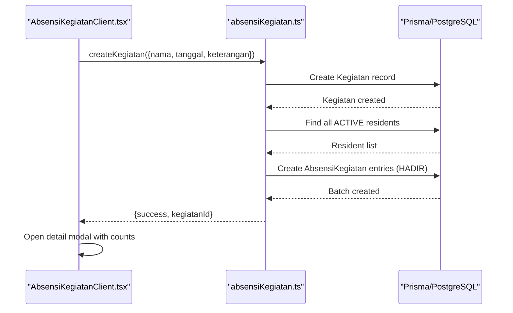
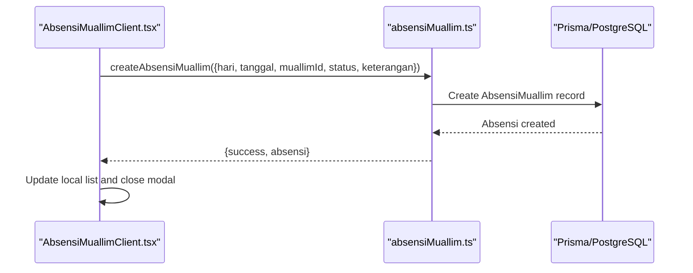
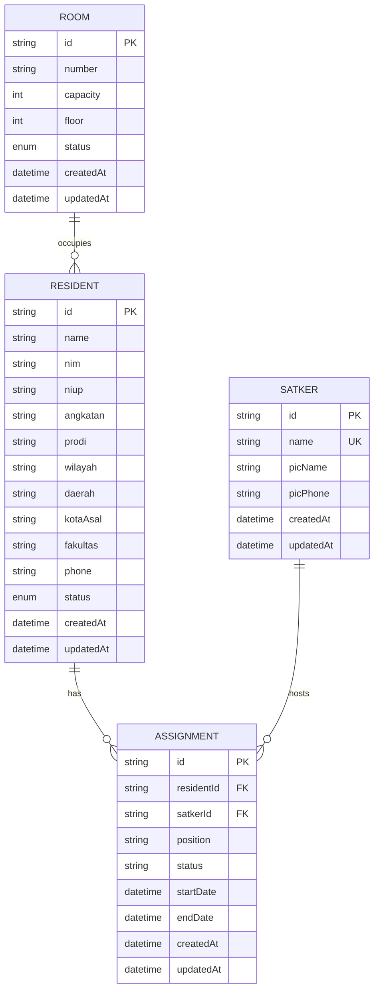
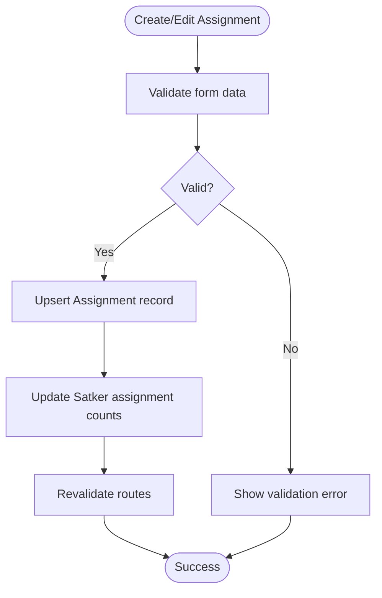
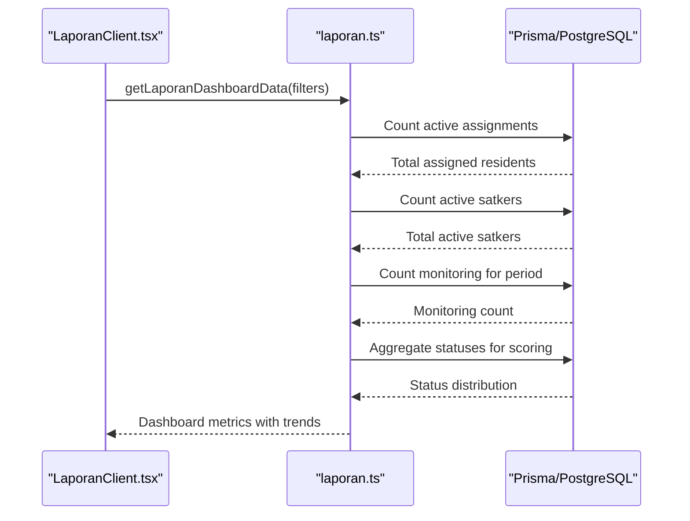
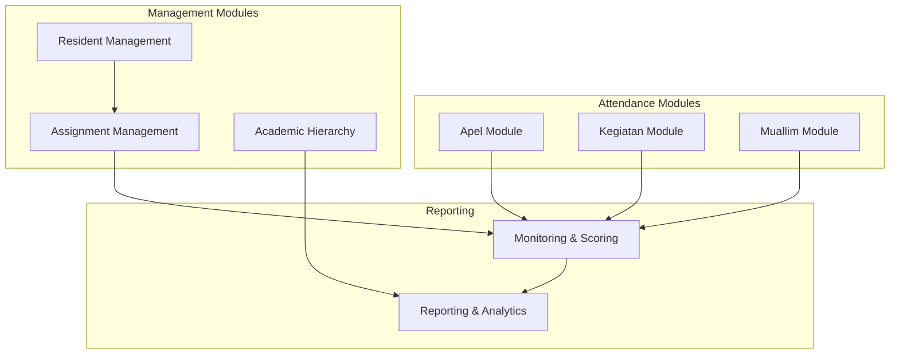

# Academic Tracking System

<cite>
**Referenced Files in This Document**
- [schema.prisma](file://prisma/schema.prisma)
- [absensiApel.ts](file://src/app/actions/absensiApel.ts)
- [absensiKegiatan.ts](file://src/app/actions/absensiKegiatan.ts)
- [absensiMuallim.ts](file://src/app/actions/absensiMuallim.ts)
- [AbsensiApelClient.tsx](file://src/components/dashboard/AbsensiApelClient.tsx)
- [AbsensiKegiatanClient.tsx](file://src/components/dashboard/AbsensiKegiatanClient.tsx)
- [AbsensiMuallimClient.tsx](file://src/components/dashboard/AbsensiMuallimClient.tsx)
- [page.tsx (Absensi Apel)](file://src/app/dashboard/absensi/apel/page.tsx)
- [page.tsx (Absensi Kegiatan)](file://src/app/dashboard/absensi/kegiatan/page.tsx)
- [page.tsx (Absensi Muallim)](file://src/app/dashboard/absensi/muallim/page.tsx)
- [assignments.ts](file://src/app/actions/assignments.ts)
- [residents.ts](file://src/app/actions/residents.ts)
- [monitoring.ts](file://src/app/actions/monitoring.ts)
- [laporan.ts](file://src/app/actions/laporan.ts)
- [LaporanClient.tsx](file://src/components/dashboard/laporan/LaporanClient.tsx)
- [MonitoringPenugasanClient.tsx](file://src/components/dashboard/MonitoringPenugasanClient.tsx)
- [AkademikClient.tsx](file://src/components/dashboard/AkademikClient.tsx)
</cite>

## Table of Contents
1. [Introduction](#introduction)
2. [Project Structure](#project-structure)
3. [Core Components](#core-components)
4. [Architecture Overview](#architecture-overview)
5. [Detailed Component Analysis](#detailed-component-analysis)
6. [Dependency Analysis](#dependency-analysis)
7. [Performance Considerations](#performance-considerations)
8. [Troubleshooting Guide](#troubleshooting-guide)
9. [Conclusion](#conclusion)

## Introduction
This document describes the Academic Tracking System designed for comprehensive monitoring of student activities within a dormitory environment. It focuses on three-tier attendance tracking (Apel, Kegiatan, and Muallim), integrated resident management, assignment tracking, and academic performance evaluation. The system provides real-time monitoring, automated reporting, data visualization, trend analysis, and compliance reporting capabilities.

## Project Structure
The system follows a Next.js pages router architecture with server actions for data persistence and client components for interactive dashboards. The backend uses Prisma ORM with PostgreSQL, and the frontend leverages React components with TypeScript.

**Diagram sources**
- [schema.prisma:1-487](file://prisma/schema.prisma#L1-L487)
- [absensiApel.ts:1-159](file://src/app/actions/absensiApel.ts#L1-L159)
- [absensiKegiatan.ts:1-160](file://src/app/actions/absensiKegiatan.ts#L1-L160)
- [absensiMuallim.ts:1-63](file://src/app/actions/absensiMuallim.ts#L1-L63)

**Section sources**
- [schema.prisma:1-487](file://prisma/schema.prisma#L1-L487)
- [absensiApel.ts:1-159](file://src/app/actions/absensiApel.ts#L1-L159)
- [absensiKegiatan.ts:1-160](file://src/app/actions/absensiKegiatan.ts#L1-L160)
- [absensiMuallim.ts:1-63](file://src/app/actions/absensiMuallim.ts#L1-L63)

## Core Components
The system comprises three primary attendance modules, resident and assignment management, monitoring and reporting, and academic data hierarchy.

- **Three-Tier Attendance System**
  - Apel (daily morning assembly): Daily roll-call with presence tracking and batch creation for active residents.
  - Kegiatan (activities): Event-based attendance with mass registration and status updates.
  - Muallim (teacher supervision): Attendance tracking for instructors and facilitators.

- **Resident Management**
  - Registration, profile updates, room allocation, and activity tracking.
  - Bulk import/export and audit logging for compliance.

- **Assignment Tracking**
  - Placement of students in organizational units (Satker), role assignment, and timeline management.

- **Monitoring and Reporting**
  - Real-time monitoring of student engagement with automated scoring and distribution analytics.
  - Monthly reporting, export history, and compliance tracking.

- **Academic Hierarchy**
  - Management of academic institutions (Fakultas), departments (Prodi), and cohorts (Angkatan).

**Section sources**
- [absensiApel.ts:7-37](file://src/app/actions/absensiApel.ts#L7-L37)
- [absensiKegiatan.ts:52-86](file://src/app/actions/absensiKegiatan.ts#L52-L86)
- [absensiMuallim.ts:21-48](file://src/app/actions/absensiMuallim.ts#L21-L48)
- [residents.ts:113-244](file://src/app/actions/residents.ts#L113-L244)
- [assignments.ts:128-173](file://src/app/actions/assignments.ts#L128-L173)
- [monitoring.ts:6-23](file://src/app/actions/monitoring.ts#L6-L23)
- [laporan.ts:20-120](file://src/app/actions/laporan.ts#L20-L120)
- [AkademikClient.tsx:1-330](file://src/components/dashboard/AkademikClient.tsx#L1-L330)

## Architecture Overview
The system architecture separates concerns across presentation, business logic, and data layers. Server actions encapsulate CRUD operations and integrate with Prisma for database interactions. Client components manage UI state, filtering, and export/printing capabilities.

**Diagram sources**
- [AbsensiApelClient.tsx:1-657](file://src/components/dashboard/AbsensiApelClient.tsx#L1-L657)
- [AbsensiKegiatanClient.tsx:1-756](file://src/components/dashboard/AbsensiKegiatanClient.tsx#L1-L756)
- [AbsensiMuallimClient.tsx:1-439](file://src/components/dashboard/AbsensiMuallimClient.tsx#L1-L439)
- [LaporanClient.tsx:1-430](file://src/components/dashboard/laporan/LaporanClient.tsx#L1-L430)
- [MonitoringPenugasanClient.tsx:1-540](file://src/components/dashboard/MonitoringPenugasanClient.tsx#L1-L540)
- [AkademikClient.tsx:1-330](file://src/components/dashboard/AkademikClient.tsx#L1-L330)
- [absensiApel.ts:1-159](file://src/app/actions/absensiApel.ts#L1-L159)
- [absensiKegiatan.ts:1-160](file://src/app/actions/absensiKegiatan.ts#L1-L160)
- [absensiMuallim.ts:1-63](file://src/app/actions/absensiMuallim.ts#L1-L63)
- [residents.ts:1-666](file://src/app/actions/residents.ts#L1-L666)
- [assignments.ts:1-215](file://src/app/actions/assignments.ts#L1-L215)
- [monitoring.ts:1-249](file://src/app/actions/monitoring.ts#L1-L249)
- [laporan.ts:1-565](file://src/app/actions/laporan.ts#L1-L565)
- [schema.prisma:1-487](file://prisma/schema.prisma#L1-L487)

## Detailed Component Analysis

### Three-Tier Attendance System

#### Apel (Daily Assembly)
The Apel module manages daily morning assembly attendance with automatic registration of all active residents upon creation.

**Diagram sources**
- [AbsensiApelClient.tsx:206-233](file://src/components/dashboard/AbsensiApelClient.tsx#L206-L233)
- [absensiApel.ts:7-37](file://src/app/actions/absensiApel.ts#L7-L37)

Key features:
- Automatic batch enrollment of active residents
- Real-time status cycling (Hadir → Alpa → Izin → Hadir)
- Export to Excel and PDF generation
- Date range filtering and search

**Section sources**
- [absensiApel.ts:7-37](file://src/app/actions/absensiApel.ts#L7-L37)
- [absensiApel.ts:39-65](file://src/app/actions/absensiApel.ts#L39-L65)
- [absensiApel.ts:67-88](file://src/app/actions/absensiApel.ts#L67-L88)
- [absensiApel.ts:90-102](file://src/app/actions/absensiApel.ts#L90-L102)
- [absensiApel.ts:104-115](file://src/app/actions/absensiApel.ts#L104-L115)
- [absensiApel.ts:117-135](file://src/app/actions/absensiApel.ts#L117-L135)
- [absensiApel.ts:137-159](file://src/app/actions/absensiApel.ts#L137-L159)
- [AbsensiApelClient.tsx:1-657](file://src/components/dashboard/AbsensiApelClient.tsx#L1-L657)
- [page.tsx (Absensi Apel):1-11](file://src/app/dashboard/absensi/apel/page.tsx#L1-L11)

#### Kegiatan (Activities)
The Kegiatan module handles event-based attendance with flexible filtering and status management.

**Diagram sources**
- [AbsensiKegiatanClient.tsx:221-254](file://src/components/dashboard/AbsensiKegiatanClient.tsx#L221-L254)
- [absensiKegiatan.ts:52-86](file://src/app/actions/absensiKegiatan.ts#L52-L86)

Key features:
- Mass registration for events
- Status cycling (Hadir → Alpa → Sakit → Izin → Hadir)
- Export to Excel and PDF printing
- Multi-criteria filtering (name, date range, dropdown)

**Section sources**
- [absensiKegiatan.ts:7-29](file://src/app/actions/absensiKegiatan.ts#L7-L29)
- [absensiKegiatan.ts:31-50](file://src/app/actions/absensiKegiatan.ts#L31-L50)
- [absensiKegiatan.ts:88-107](file://src/app/actions/absensiKegiatan.ts#L88-L107)
- [absensiKegiatan.ts:109-120](file://src/app/actions/absensiKegiatan.ts#L109-L120)
- [absensiKegiatan.ts:122-141](file://src/app/actions/absensiKegiatan.ts#L122-L141)
- [absensiKegiatan.ts:143-160](file://src/app/actions/absensiKegiatan.ts#L143-L160)
- [AbsensiKegiatanClient.tsx:1-756](file://src/components/dashboard/AbsensiKegiatanClient.tsx#L1-L756)
- [page.tsx (Absensi Kegiatan):1-15](file://src/app/dashboard/absensi/kegiatan/page.tsx#L1-L15)

#### Muallim (Teacher Supervision)
The Muallim module tracks instructor attendance with status categorization.

**Diagram sources**
- [AbsensiMuallimClient.tsx:73-93](file://src/components/dashboard/AbsensiMuallimClient.tsx#L73-L93)
- [absensiMuallim.ts:21-48](file://src/app/actions/absensiMuallim.ts#L21-L48)

Key features:
- Manual entry with auto-filled day-of-week
- Status tracking (Hadir, Izin, Diwakilkan)
- CSV export and PDF printing
- Search across instructor, subject, and day

**Section sources**
- [absensiMuallim.ts:7-19](file://src/app/actions/absensiMuallim.ts#L7-L19)
- [absensiMuallim.ts:21-48](file://src/app/actions/absensiMuallim.ts#L21-L48)
- [absensiMuallim.ts:50-62](file://src/app/actions/absensiMuallim.ts#L50-L62)
- [AbsensiMuallimClient.tsx:1-439](file://src/components/dashboard/AbsensiMuallimClient.tsx#L1-L439)
- [page.tsx (Absensi Muallim):1-15](file://src/app/dashboard/absensi/muallim/page.tsx#L1-L15)

### Resident Management and Academic Hierarchy
The system integrates resident profiles with academic hierarchy and room assignments.

**Diagram sources**
- [schema.prisma:44-131](file://prisma/schema.prisma#L44-L131)

Key features:
- Academic hierarchy management (Fakultas → Prodi → Angkatan)
- Room allocation and capacity management
- Bulk resident operations (import, move, delete)
- Audit logging for profile changes

**Section sources**
- [residents.ts:76-93](file://src/app/actions/residents.ts#L76-L93)
- [residents.ts:95-111](file://src/app/actions/residents.ts#L95-L111)
- [residents.ts:113-244](file://src/app/actions/residents.ts#L113-L244)
- [residents.ts:246-442](file://src/app/actions/residents.ts#L246-L442)
- [residents.ts:444-475](file://src/app/actions/residents.ts#L444-L475)
- [residents.ts:477-578](file://src/app/actions/residents.ts#L477-L578)
- [residents.ts:580-608](file://src/app/actions/residents.ts#L580-L608)
- [residents.ts:610-666](file://src/app/actions/residents.ts#L610-L666)
- [AkademikClient.tsx:1-330](file://src/components/dashboard/AkademikClient.tsx#L1-L330)

### Assignment Tracking
Assignment management enables placement of students in organizational units with role and timeline tracking.

**Diagram sources**
- [assignments.ts:128-173](file://src/app/actions/assignments.ts#L128-L173)

Key features:
- Unique assignment constraint per resident-satker pair
- Position and status management
- Timeline filtering for reports
- Bulk operations support

**Section sources**
- [assignments.ts:15-28](file://src/app/actions/assignments.ts#L15-L28)
- [assignments.ts:30-42](file://src/app/actions/assignments.ts#L30-L42)
- [assignments.ts:128-173](file://src/app/actions/assignments.ts#L128-L173)
- [assignments.ts:175-200](file://src/app/actions/assignments.ts#L175-L200)
- [assignments.ts:201-215](file://src/app/actions/assignments.ts#L201-L215)

### Monitoring and Reporting
The monitoring system provides real-time engagement tracking with automated scoring and comprehensive reporting.

**Diagram sources**
- [LaporanClient.tsx:101-134](file://src/components/dashboard/laporan/LaporanClient.tsx#L101-L134)
- [laporan.ts:20-120](file://src/app/actions/laporan.ts#L20-L120)

Key features:
- Automated scoring (Sangat Aktif=4, Aktif=3, Cukup Aktif=2, Kurang Aktif=1)
- Trend analysis for six-month periods
- Distribution analytics and export capabilities
- Role-based access control for different report views

**Section sources**
- [laporan.ts:20-120](file://src/app/actions/laporan.ts#L20-L120)
- [laporan.ts:122-195](file://src/app/actions/laporan.ts#L122-L195)
- [laporan.ts:197-226](file://src/app/actions/laporan.ts#L197-L226)
- [laporan.ts:236-289](file://src/app/actions/laporan.ts#L236-L289)
- [laporan.ts:291-341](file://src/app/actions/laporan.ts#L291-L341)
- [laporan.ts:359-422](file://src/app/actions/laporan.ts#L359-L422)
- [laporan.ts:437-519](file://src/app/actions/laporan.ts#L437-L519)
- [laporan.ts:521-563](file://src/app/actions/laporan.ts#L521-L563)
- [LaporanClient.tsx:1-430](file://src/components/dashboard/laporan/LaporanClient.tsx#L1-L430)
- [MonitoringPenugasanClient.tsx:1-540](file://src/components/dashboard/MonitoringPenugasanClient.tsx#L1-L540)

## Dependency Analysis
The system exhibits clear separation of concerns with explicit dependencies between components.

**Diagram sources**
- [schema.prisma:44-131](file://prisma/schema.prisma#L44-L131)
- [absensiApel.ts:1-159](file://src/app/actions/absensiApel.ts#L1-L159)
- [absensiKegiatan.ts:1-160](file://src/app/actions/absensiKegiatan.ts#L1-L160)
- [absensiMuallim.ts:1-63](file://src/app/actions/absensiMuallim.ts#L1-L63)
- [residents.ts:1-666](file://src/app/actions/residents.ts#L1-L666)
- [assignments.ts:1-215](file://src/app/actions/assignments.ts#L1-L215)
- [monitoring.ts:1-249](file://src/app/actions/monitoring.ts#L1-L249)
- [laporan.ts:1-565](file://src/app/actions/laporan.ts#L1-L565)

**Section sources**
- [schema.prisma:44-131](file://prisma/schema.prisma#L44-L131)
- [absensiApel.ts:1-159](file://src/app/actions/absensiApel.ts#L1-L159)
- [absensiKegiatan.ts:1-160](file://src/app/actions/absensiKegiatan.ts#L1-L160)
- [absensiMuallim.ts:1-63](file://src/app/actions/absensiMuallim.ts#L1-L63)
- [residents.ts:1-666](file://src/app/actions/residents.ts#L1-L666)
- [assignments.ts:1-215](file://src/app/actions/assignments.ts#L1-L215)
- [monitoring.ts:1-249](file://src/app/actions/monitoring.ts#L1-L249)
- [laporan.ts:1-565](file://src/app/actions/laporan.ts#L1-L565)

## Performance Considerations
- Database indexing: Strategic indexing on foreign keys and frequently queried fields (e.g., residentId, apelId, tanggal) improves query performance.
- Batch operations: Server actions utilize createMany for efficient batch enrollment during Apel/Kegiatan creation.
- Caching: Next.js revalidatePath ensures cache invalidation after mutations while maintaining reasonable cache lifecycles.
- Pagination: Client components implement pagination for large datasets to reduce memory usage.
- Export optimization: Excel exports process filtered subsets rather than full datasets to minimize memory footprint.

## Troubleshooting Guide
Common issues and resolutions:

- **Attendance creation failures**: Verify resident status and active enrollment before Apel/Kegiatan creation. Check for duplicate entries and unique constraints.
- **Status update errors**: Confirm optimistic UI updates revert on failure and maintain data consistency.
- **Export/print issues**: Ensure filtered data exists before generating reports; handle empty datasets gracefully.
- **Permission errors**: Role-based access controls restrict report visibility; verify user permissions for sensitive data.
- **Audit trail problems**: Validate session context and ensure proper field tracking for resident updates.

**Section sources**
- [absensiApel.ts:34-36](file://src/app/actions/absensiApel.ts#L34-L36)
- [absensiKegiatan.ts:82-85](file://src/app/actions/absensiKegiatan.ts#L82-L85)
- [absensiMuallim.ts:44-47](file://src/app/actions/absensiMuallim.ts#L44-L47)
- [residents.ts:377-412](file://src/app/actions/residents.ts#L377-L412)
- [laporan.ts:197-215](file://src/app/actions/laporan.ts#L197-L215)

## Conclusion
The Academic Tracking System provides a comprehensive solution for dormitory academic oversight through integrated attendance tracking, resident management, assignment coordination, and robust reporting capabilities. Its modular architecture supports scalability, maintains data integrity through Prisma, and delivers real-time insights via intuitive dashboards and automated analytics.