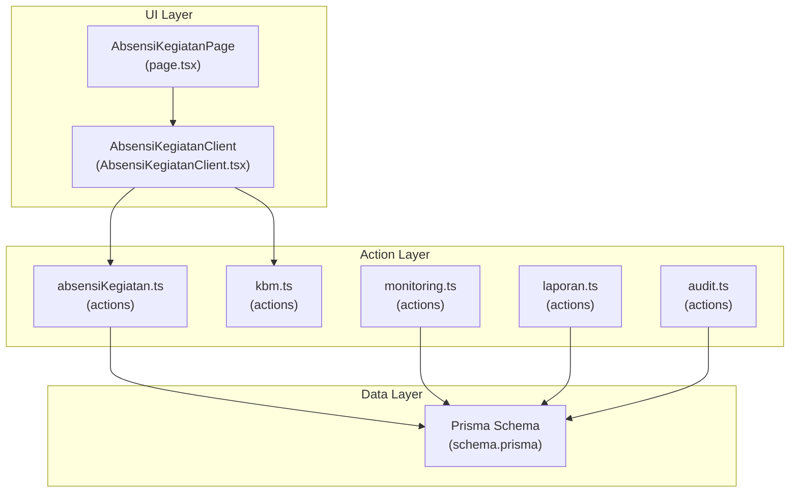
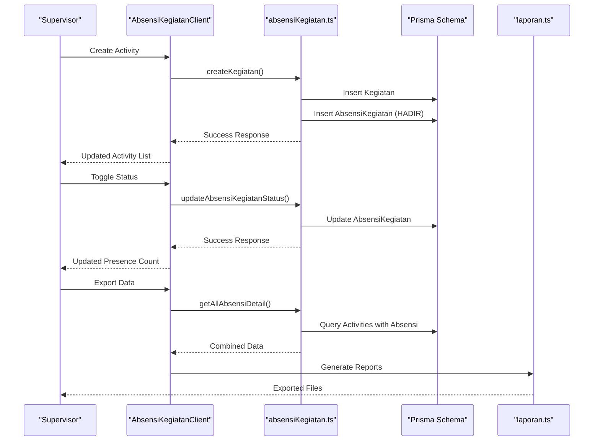
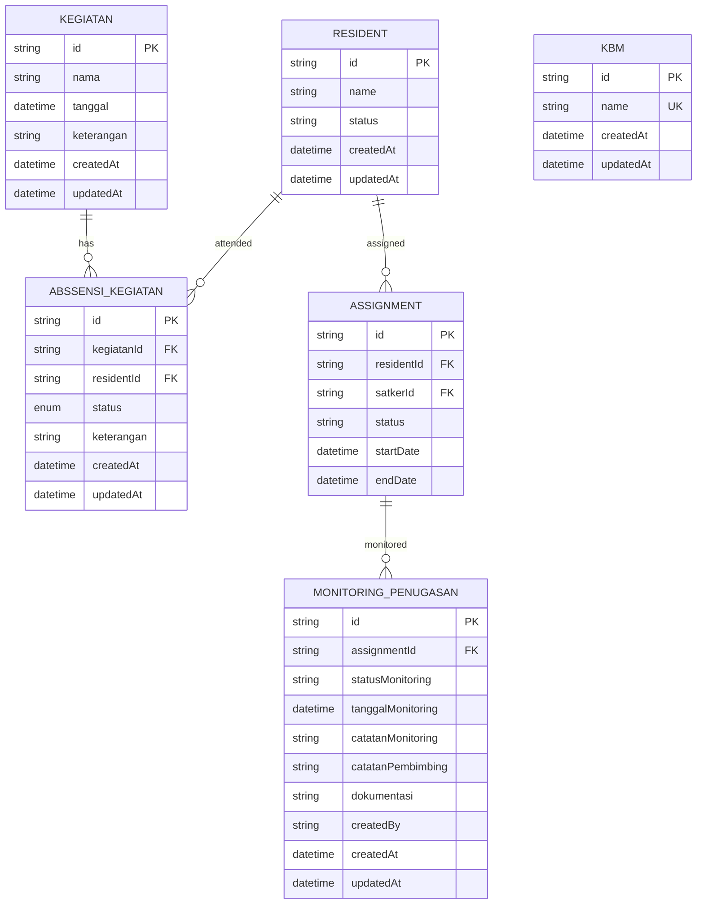
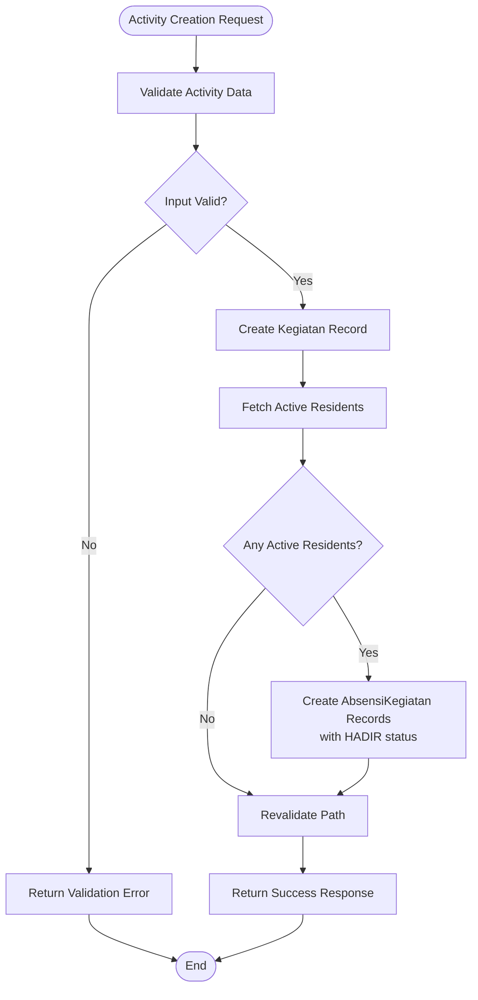
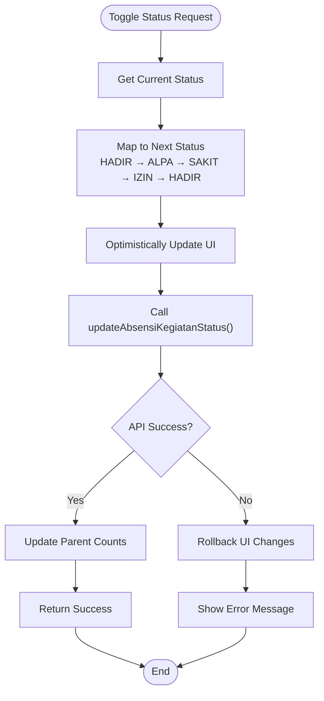
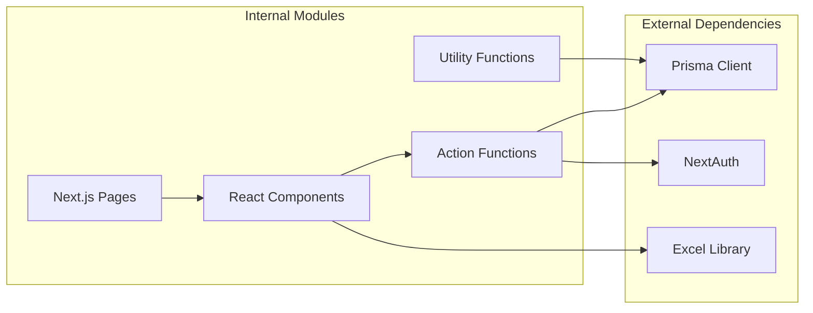

# Activity Tracking - Kegiatan System

<cite>
**Referenced Files in This Document**
- [absensiKegiatan.ts](file://src/app/actions/absensiKegiatan.ts)
- [AbsensiKegiatanClient.tsx](file://src/components/dashboard/AbsensiKegiatanClient.tsx)
- [page.tsx](file://src/app/dashboard/absensi/kegiatan/page.tsx)
- [schema.prisma](file://prisma/schema.prisma)
- [kbm.ts](file://src/app/actions/kbm.ts)
- [monitoring.ts](file://src/app/actions/monitoring.ts)
- [laporan.ts](file://src/app/actions/laporan.ts)
- [audit.ts](file://src/app/actions/audit.ts)
</cite>

## Table of Contents
1. [Introduction](#introduction)
2. [Project Structure](#project-structure)
3. [Core Components](#core-components)
4. [Architecture Overview](#architecture-overview)
5. [Detailed Component Analysis](#detailed-component-analysis)
6. [Dependency Analysis](#dependency-analysis)
7. [Performance Considerations](#performance-considerations)
8. [Troubleshooting Guide](#troubleshooting-guide)
9. [Conclusion](#conclusion)

## Introduction
The Kegiatan (activity) tracking system manages attendance for dormitory activities, enabling supervisors to record participant presence, track status changes, and generate compliance reports. It integrates with academic programs and extracurricular assignments while supporting behavioral assessment through monitoring systems. The system provides real-time dashboards, filtering, export capabilities, and audit logging for transparency and accountability.

## Project Structure
The activity tracking system follows a layered architecture:
- Action layer: Server-side functions handling CRUD operations and data transformations
- Component layer: Client-side React components managing UI state and user interactions
- Data layer: Prisma ORM models defining the database schema and relationships
- Dashboard pages: Next.js pages orchestrating data fetching and rendering

**Diagram sources**
- [page.tsx:1-15](file://src/app/dashboard/absensi/kegiatan/page.tsx#L1-L15)
- [AbsensiKegiatanClient.tsx:1-756](file://src/components/dashboard/AbsensiKegiatanClient.tsx#L1-L756)
- [absensiKegiatan.ts:1-160](file://src/app/actions/absensiKegiatan.ts#L1-L160)
- [kbm.ts:1-72](file://src/app/actions/kbm.ts#L1-L72)
- [monitoring.ts:1-249](file://src/app/actions/monitoring.ts#L1-L249)
- [laporan.ts:1-565](file://src/app/actions/laporan.ts#L1-L565)
- [audit.ts:1-118](file://src/app/actions/audit.ts#L1-L118)
- [schema.prisma:242-306](file://prisma/schema.prisma#L242-L306)

**Section sources**
- [page.tsx:1-15](file://src/app/dashboard/absensi/kegiatan/page.tsx#L1-L15)
- [AbsensiKegiatanClient.tsx:1-756](file://src/components/dashboard/AbsensiKegiatanClient.tsx#L1-L756)
- [absensiKegiatan.ts:1-160](file://src/app/actions/absensiKegiatan.ts#L1-L160)
- [schema.prisma:242-306](file://prisma/schema.prisma#L242-L306)

## Core Components
The system comprises three primary components:

### Activity Management
- Activity creation with automatic participant enrollment
- Activity scheduling with date-based filtering
- Status tracking (HADIR, ALPA, IZIN, SAKIT)
- Bulk operations and batch updates

### Participant Management
- Automatic registration of active residents upon activity creation
- Individual status modification with cycle navigation
- Real-time presence statistics calculation
- Search and filtering capabilities

### Reporting and Analytics
- Export to Excel and PDF generation
- Compliance reporting with automated calculations
- Integration with monitoring and assignment systems
- Audit trail for all modifications

**Section sources**
- [absensiKegiatan.ts:52-160](file://src/app/actions/absensiKegiatan.ts#L52-L160)
- [AbsensiKegiatanClient.tsx:331-359](file://src/components/dashboard/AbsensiKegiatanClient.tsx#L331-L359)
- [laporan.ts:20-120](file://src/app/actions/laporan.ts#L20-L120)

## Architecture Overview
The system implements a client-server architecture with clear separation of concerns:

**Diagram sources**
- [AbsensiKegiatanClient.tsx:221-254](file://src/components/dashboard/AbsensiKegiatanClient.tsx#L221-L254)
- [absensiKegiatan.ts:52-107](file://src/app/actions/absensiKegiatan.ts#L52-L107)
- [laporan.ts:197-226](file://src/app/actions/laporan.ts#L197-L226)

The architecture ensures:
- **Data Integrity**: Unique constraints prevent duplicate enrollments
- **Real-time Updates**: Optimistic UI updates with rollback on failure
- **Scalable Queries**: Indexes on frequently queried fields
- **Audit Compliance**: Complete change tracking for all operations

## Detailed Component Analysis

### Database Schema Analysis
The system uses a normalized relational design optimized for activity tracking:

**Diagram sources**
- [schema.prisma:242-306](file://prisma/schema.prisma#L242-L306)
- [schema.prisma:115-131](file://prisma/schema.prisma#L115-L131)
- [schema.prisma:133-149](file://prisma/schema.prisma#L133-L149)

**Section sources**
- [schema.prisma:242-306](file://prisma/schema.prisma#L242-L306)

### Activity Creation Workflow
The activity creation process automates participant enrollment:

**Diagram sources**
- [absensiKegiatan.ts:52-86](file://src/app/actions/absensiKegiatan.ts#L52-L86)

**Section sources**
- [absensiKegiatan.ts:52-86](file://src/app/actions/absensiKegiatan.ts#L52-L86)

### Attendance Status Management
The system implements a cyclic status update mechanism:

**Diagram sources**
- [AbsensiKegiatanClient.tsx:331-359](file://src/components/dashboard/AbsensiKegiatanClient.tsx#L331-L359)
- [absensiKegiatan.ts:88-107](file://src/app/actions/absensiKegiatan.ts#L88-L107)

**Section sources**
- [AbsensiKegiatanClient.tsx:331-359](file://src/components/dashboard/AbsensiKegiatanClient.tsx#L331-L359)
- [absensiKegiatan.ts:88-107](file://src/app/actions/absensiKegiatan.ts#L88-L107)

### Reporting and Compliance Features
The system generates comprehensive compliance reports:

| Report Type | Data Source | Export Formats |
|-------------|-------------|----------------|
| Activity Details | Kegiatan + AbsensiKegiatan | Excel (.xlsx), PDF |
| Monthly Compliance | MonitoringPenugasan + Assignment | CSV, Excel |
| Audit Trail | AuditLog | CSV, Excel |
| Performance Analytics | Resident + Assignment + Monitoring | Interactive Dashboards |

**Section sources**
- [AbsensiKegiatanClient.tsx:88-115](file://src/components/dashboard/AbsensiKegiatanClient.tsx#L88-L115)
- [laporan.ts:236-289](file://src/app/actions/laporan.ts#L236-L289)
- [audit.ts:27-98](file://src/app/actions/audit.ts#L27-L98)

## Dependency Analysis
The system exhibits clean dependency management with minimal coupling:

**Diagram sources**
- [absensiKegiatan.ts:3-5](file://src/app/actions/absensiKegiatan.ts#L3-L5)
- [AbsensiKegiatanClient.tsx:6-7](file://src/components/dashboard/AbsensiKegiatanClient.tsx#L6-L7)
- [page.tsx:1-3](file://src/app/dashboard/absensi/kegiatan/page.tsx#L1-L3)

**Section sources**
- [absensiKegiatan.ts:1-10](file://src/app/actions/absensiKegiatan.ts#L1-L10)
- [AbsensiKegiatanClient.tsx:1-10](file://src/components/dashboard/AbsensiKegiatanClient.tsx#L1-L10)
- [page.tsx:1-5](file://src/app/dashboard/absensi/kegiatan/page.tsx#L1-L5)

## Performance Considerations
The system implements several optimization strategies:

### Database Optimization
- **Indexes**: Strategic indexing on frequently queried fields (tanggal, residentId, unique constraints)
- **Joins**: Efficient eager loading with include directives
- **Transactions**: Batch operations for bulk enrollment
- **Caching**: Next.js revalidation for optimal cache refresh

### Frontend Optimization
- **Optimistic Updates**: Immediate UI feedback with rollback on failure
- **Lazy Loading**: Component-level imports for reduced bundle size
- **Efficient Filtering**: Client-side filtering with debouncing
- **Export Optimization**: Streaming exports for large datasets

### Scalability Features
- **Pagination**: Built-in pagination support for audit logs
- **Search Optimization**: Indexed search across multiple fields
- **Batch Operations**: Efficient bulk updates and exports
- **Role-based Access**: Permission-driven data filtering

## Troubleshooting Guide

### Common Issues and Solutions

**Activity Creation Failures**
- Verify active resident records exist
- Check for duplicate activity names
- Ensure proper date selection
- Confirm database connectivity

**Attendance Update Errors**
- Validate network connectivity
- Check user permissions
- Review database constraints
- Monitor API response errors

**Export Generation Problems**
- Verify sufficient memory allocation
- Check file system permissions
- Ensure Excel library compatibility
- Monitor concurrent export requests

**Performance Degradation**
- Monitor database query performance
- Check index utilization
- Review memory usage patterns
- Optimize filter queries

**Section sources**
- [absensiKegiatan.ts:82-85](file://src/app/actions/absensiKegiatan.ts#L82-L85)
- [AbsensiKegiatanClient.tsx:346-349](file://src/components/dashboard/AbsensiKegiatanClient.tsx#L346-L349)

## Conclusion
The Kegiatan system provides a comprehensive solution for dormitory activity management with robust attendance tracking, participant management, and reporting capabilities. Its modular architecture ensures maintainability while supporting scalability through optimized database design and efficient frontend interactions. The integration with monitoring and audit systems creates a complete compliance framework suitable for institutional oversight and quality assurance.

The system's strength lies in its automated enrollment processes, real-time status updates, and comprehensive reporting features that enable supervisors to effectively manage student activities while maintaining transparent audit trails and performance metrics.