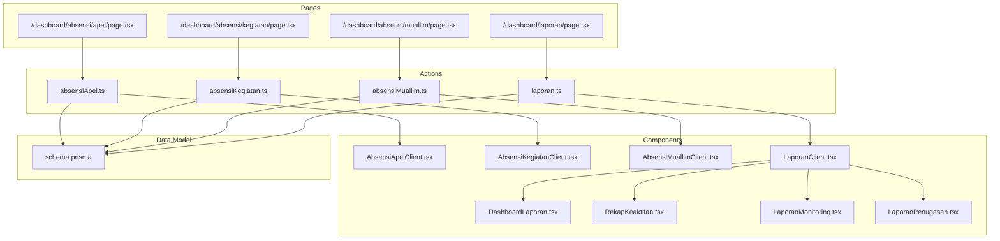
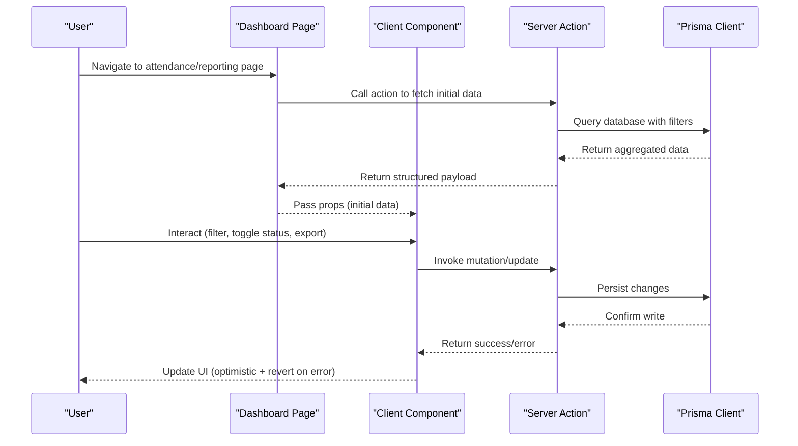
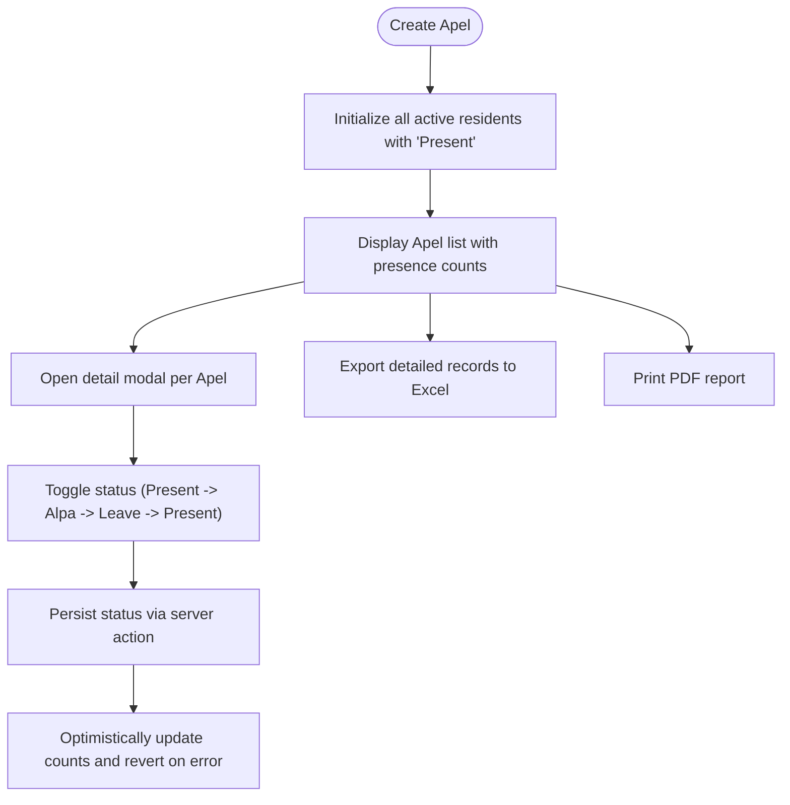
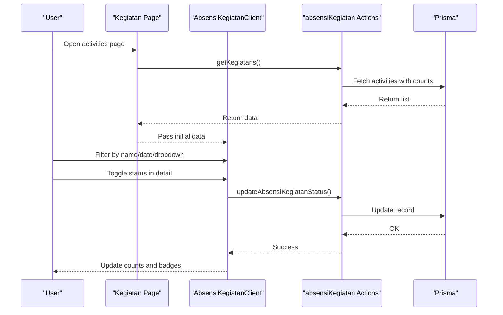
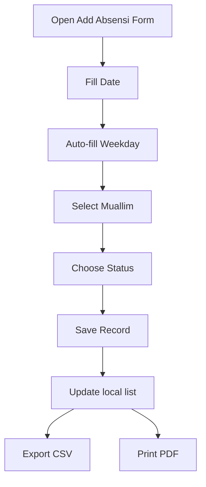
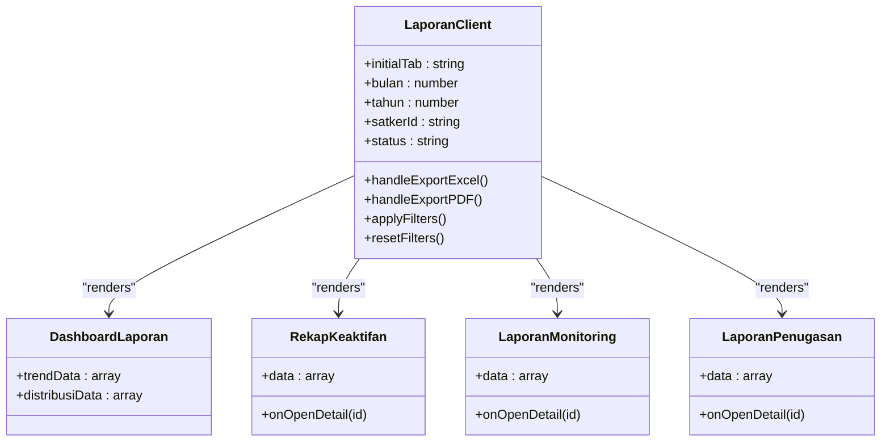
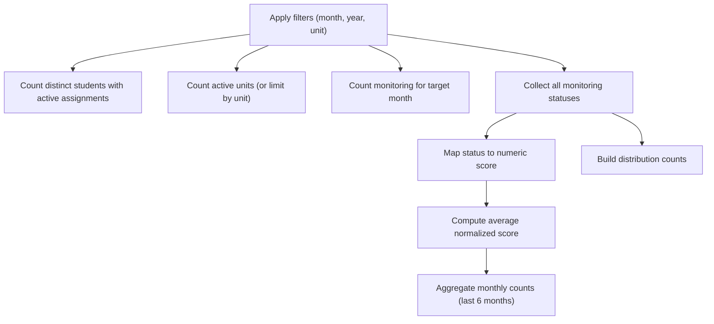
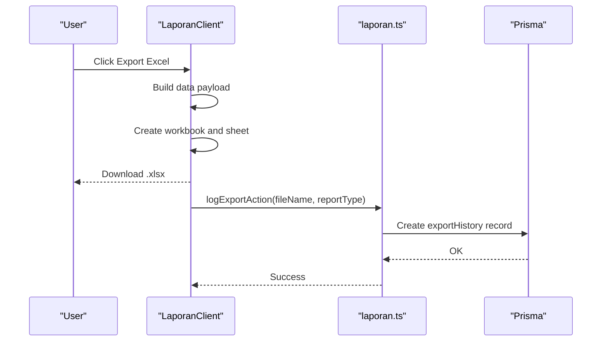
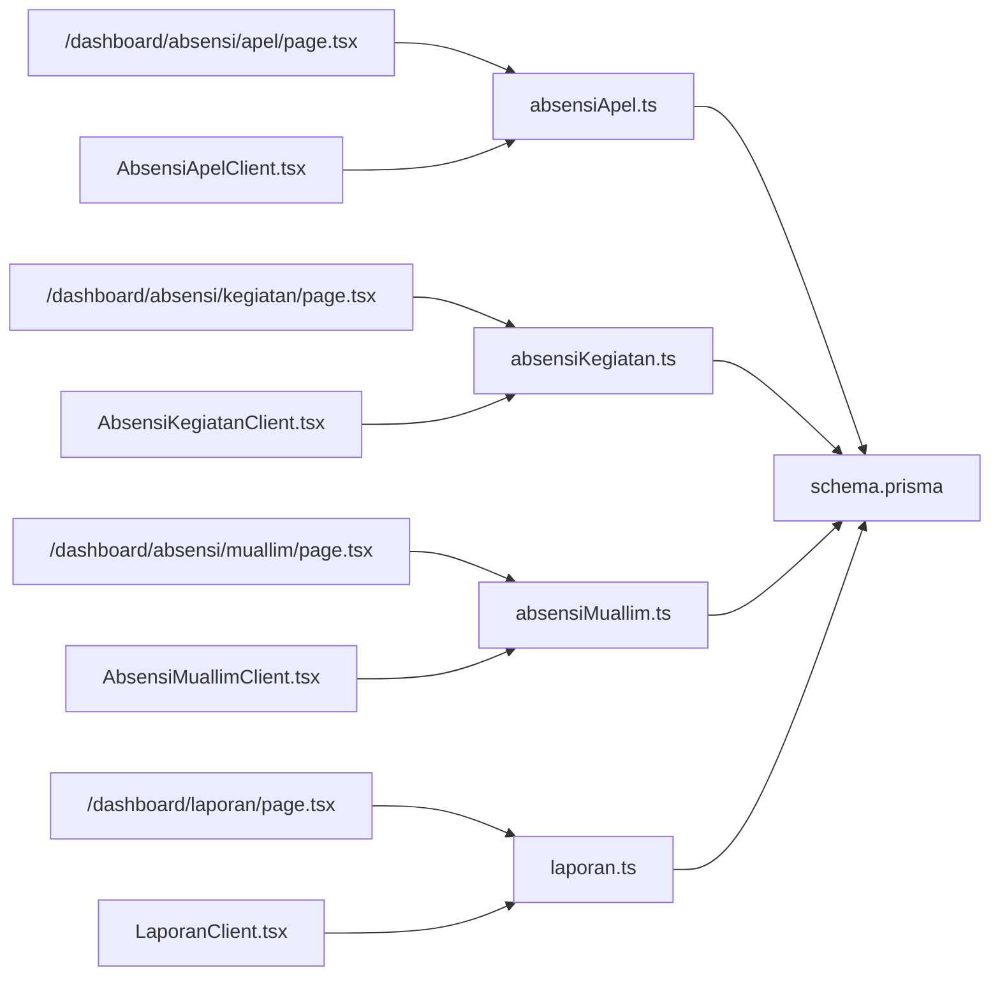

# Attendance Analytics & Reporting

<cite>
**Referenced Files in This Document**
- [absensiApel.ts](file://src/app/actions/absensiApel.ts)
- [absensiKegiatan.ts](file://src/app/actions/absensiKegiatan.ts)
- [absensiMuallim.ts](file://src/app/actions/absensiMuallim.ts)
- [laporan.ts](file://src/app/actions/laporan.ts)
- [page.tsx](file://src/app/dashboard/absensi/apel/page.tsx)
- [page.tsx](file://src/app/dashboard/absensi/kegiatan/page.tsx)
- [page.tsx](file://src/app/dashboard/absensi/muallim/page.tsx)
- [page.tsx](file://src/app/dashboard/laporan/page.tsx)
- [AbsensiApelClient.tsx](file://src/components/dashboard/AbsensiApelClient.tsx)
- [AbsensiKegiatanClient.tsx](file://src/components/dashboard/AbsensiKegiatanClient.tsx)
- [AbsensiMuallimClient.tsx](file://src/components/dashboard/AbsensiMuallimClient.tsx)
- [LaporanClient.tsx](file://src/components/dashboard/laporan/LaporanClient.tsx)
- [DashboardLaporan.tsx](file://src/components/dashboard/laporan/DashboardLaporan.tsx)
- [RekapKeaktifan.tsx](file://src/components/dashboard/laporan/RekapKeaktifan.tsx)
- [LaporanMonitoring.tsx](file://src/components/dashboard/laporan/LaporanMonitoring.tsx)
- [LaporanPenugasan.tsx](file://src/components/dashboard/laporan/LaporanPenugasan.tsx)
- [schema.prisma](file://prisma/schema.prisma)
</cite>

## Table of Contents
1. [Introduction](#introduction)
2. [Project Structure](#project-structure)
3. [Core Components](#core-components)
4. [Architecture Overview](#architecture-overview)
5. [Detailed Component Analysis](#detailed-component-analysis)
6. [Dependency Analysis](#dependency-analysis)
7. [Performance Considerations](#performance-considerations)
8. [Troubleshooting Guide](#troubleshooting-guide)
9. [Conclusion](#conclusion)

## Introduction
This document describes the attendance analytics and reporting system for ApsAsrama, focusing on consolidated reporting across three attendance systems: Apel (morning assembly), Kegiatan (activities), and Muallim (instructor attendance). It covers data aggregation, dashboard analytics, trend analysis, compliance monitoring, and export/reporting capabilities. The system integrates real-time attendance updates, statistical summaries, and institutional oversight features for supervisors and administrators.

## Project Structure
The attendance analytics system is organized around:
- Action modules for each attendance domain (Apel, Kegiatan, Muallim)
- Dashboard pages that load initial data and render client-side components
- Client components that manage UI interactions, filtering, and export/printing
- Reporting actions that aggregate statistics and support export logging
- Prisma schema defining the data model and relationships

**Diagram sources**
- [page.tsx:1-11](file://src/app/dashboard/absensi/apel/page.tsx#L1-L11)
- [page.tsx:1-15](file://src/app/dashboard/absensi/kegiatan/page.tsx#L1-L15)
- [page.tsx:1-15](file://src/app/dashboard/absensi/muallim/page.tsx#L1-L15)
- [page.tsx:1-79](file://src/app/dashboard/laporan/page.tsx#L1-L79)
- [absensiApel.ts:1-159](file://src/app/actions/absensiApel.ts#L1-L159)
- [absensiKegiatan.ts:1-160](file://src/app/actions/absensiKegiatan.ts#L1-L160)
- [absensiMuallim.ts:1-63](file://src/app/actions/absensiMuallim.ts#L1-L63)
- [laporan.ts:1-565](file://src/app/actions/laporan.ts#L1-L565)
- [AbsensiApelClient.tsx:1-657](file://src/components/dashboard/AbsensiApelClient.tsx#L1-L657)
- [AbsensiKegiatanClient.tsx:1-756](file://src/components/dashboard/AbsensiKegiatanClient.tsx#L1-L756)
- [AbsensiMuallimClient.tsx:1-439](file://src/components/dashboard/AbsensiMuallimClient.tsx#L1-L439)
- [LaporanClient.tsx:1-430](file://src/components/dashboard/laporan/LaporanClient.tsx#L1-L430)
- [DashboardLaporan.tsx:1-79](file://src/components/dashboard/laporan/DashboardLaporan.tsx#L1-L79)
- [RekapKeaktifan.tsx:1-188](file://src/components/dashboard/laporan/RekapKeaktifan.tsx#L1-L188)
- [LaporanMonitoring.tsx:1-115](file://src/components/dashboard/laporan/LaporanMonitoring.tsx#L1-L115)
- [LaporanPenugasan.tsx:1-117](file://src/components/dashboard/laporan/LaporanPenugasan.tsx#L1-L117)
- [schema.prisma:1-487](file://prisma/schema.prisma#L1-L487)

**Section sources**
- [page.tsx:1-11](file://src/app/dashboard/absensi/apel/page.tsx#L1-L11)
- [page.tsx:1-15](file://src/app/dashboard/absensi/kegiatan/page.tsx#L1-L15)
- [page.tsx:1-15](file://src/app/dashboard/absensi/muallim/page.tsx#L1-L15)
- [page.tsx:1-79](file://src/app/dashboard/laporan/page.tsx#L1-L79)

## Core Components
This section outlines the primary building blocks of the attendance analytics system.

- Attendance Systems
  - Apel: Daily assembly attendance with presence/absence/leave tracking and bulk initialization for active residents.
  - Kegiatan: Activity-based attendance with presence/absence/sickness/leave states and bulk registration.
  - Muallim: Instructor attendance with daily entries and status tracking.

- Reporting and Analytics
  - Consolidated dashboard with trend charts and distribution pie charts.
  - Recaps of activity levels with top performers and guidance needs.
  - Monitoring reports with status categorization and notes.
  - Assignment tracking with status and timeline.

- Export and Compliance
  - Excel export for detailed attendance records.
  - PDF printing for official reports.
  - Export history tracking with user attribution.

**Section sources**
- [absensiApel.ts:1-159](file://src/app/actions/absensiApel.ts#L1-L159)
- [absensiKegiatan.ts:1-160](file://src/app/actions/absensiKegiatan.ts#L1-L160)
- [absensiMuallim.ts:1-63](file://src/app/actions/absensiMuallim.ts#L1-L63)
- [laporan.ts:1-565](file://src/app/actions/laporan.ts#L1-L565)

## Architecture Overview
The system follows a Next.js server action pattern with client-side rendering for interactive dashboards. Pages fetch initial data, pass it to client components, and delegate user interactions to server actions for persistence and analytics computation.

**Diagram sources**
- [page.tsx:1-11](file://src/app/dashboard/absensi/apel/page.tsx#L1-L11)
- [AbsensiApelClient.tsx:1-657](file://src/components/dashboard/AbsensiApelClient.tsx#L1-L657)
- [absensiApel.ts:1-159](file://src/app/actions/absensiApel.ts#L1-L159)
- [laporan.ts:1-565](file://src/app/actions/laporan.ts#L1-L565)

## Detailed Component Analysis

### Apel Attendance System
The Apel module manages daily assembly attendance:
- Creation initializes all active residents with default present status.
- Real-time status toggling cycles through present/alpa/leave states.
- Filtering by date range and export/printing of detailed records.

**Diagram sources**
- [absensiApel.ts:7-37](file://src/app/actions/absensiApel.ts#L7-L37)
- [AbsensiApelClient.tsx:301-328](file://src/components/dashboard/AbsensiApelClient.tsx#L301-L328)
- [AbsensiApelClient.tsx:77-103](file://src/components/dashboard/AbsensiApelClient.tsx#L77-L103)
- [AbsensiApelClient.tsx:105-197](file://src/components/dashboard/AbsensiApelClient.tsx#L105-L197)

**Section sources**
- [absensiApel.ts:1-159](file://src/app/actions/absensiApel.ts#L1-L159)
- [AbsensiApelClient.tsx:1-657](file://src/components/dashboard/AbsensiApelClient.tsx#L1-L657)

### Kegiatan Attendance System
The Kegiatan module handles activity-based attendance:
- Bulk creation registers all active residents with default present status.
- Status cycling includes presence, alpa, sickness, and leave.
- Comprehensive filtering by name, date range, and dropdown selection.

**Diagram sources**
- [page.tsx:1-15](file://src/app/dashboard/absensi/kegiatan/page.tsx#L1-L15)
- [absensiKegiatan.ts:7-29](file://src/app/actions/absensiKegiatan.ts#L7-L29)
- [AbsensiKegiatanClient.tsx:331-359](file://src/components/dashboard/AbsensiKegiatanClient.tsx#L331-L359)

**Section sources**
- [absensiKegiatan.ts:1-160](file://src/app/actions/absensiKegiatan.ts#L1-L160)
- [AbsensiKegiatanClient.tsx:1-756](file://src/components/dashboard/AbsensiKegiatanClient.tsx#L1-L756)

### Muallim Attendance System
The Muallim module tracks instructor attendance:
- Daily entries with auto-filled weekday based on date.
- Status options include present, leave, and representative.
- CSV export and PDF printing for reporting.

**Diagram sources**
- [absensiMuallim.ts:21-48](file://src/app/actions/absensiMuallim.ts#L21-L48)
- [AbsensiMuallimClient.tsx:52-93](file://src/components/dashboard/AbsensiMuallimClient.tsx#L52-L93)
- [AbsensiMuallimClient.tsx:109-129](file://src/components/dashboard/AbsensiMuallimClient.tsx#L109-L129)
- [AbsensiMuallimClient.tsx:131-205](file://src/components/dashboard/AbsensiMuallimClient.tsx#L131-L205)

**Section sources**
- [absensiMuallim.ts:1-63](file://src/app/actions/absensiMuallim.ts#L1-L63)
- [AbsensiMuallimClient.tsx:1-439](file://src/components/dashboard/AbsensiMuallimClient.tsx#L1-L439)

### Consolidated Reporting Dashboard
The reporting dashboard aggregates institutional insights:
- Dashboard cards show total assigned students, active units, monthly monitoring counts, and overall activity level.
- Trend chart displays monthly monitoring volume over six months.
- Distribution pie chart shows activity level distribution.
- Export/PDF printing with audit logging.

**Diagram sources**
- [LaporanClient.tsx:87-430](file://src/components/dashboard/laporan/LaporanClient.tsx#L87-L430)
- [DashboardLaporan.tsx:14-79](file://src/components/dashboard/laporan/DashboardLaporan.tsx#L14-L79)
- [RekapKeaktifan.tsx:6-188](file://src/components/dashboard/laporan/RekapKeaktifan.tsx#L6-L188)
- [LaporanMonitoring.tsx:6-115](file://src/components/dashboard/laporan/LaporanMonitoring.tsx#L6-L115)
- [LaporanPenugasan.tsx:6-117](file://src/components/dashboard/laporan/LaporanPenugasan.tsx#L6-L117)

**Section sources**
- [page.tsx:1-79](file://src/app/dashboard/laporan/page.tsx#L1-L79)
- [LaporanClient.tsx:1-430](file://src/components/dashboard/laporan/LaporanClient.tsx#L1-L430)
- [DashboardLaporan.tsx:1-79](file://src/components/dashboard/laporan/DashboardLaporan.tsx#L1-L79)
- [RekapKeaktifan.tsx:1-188](file://src/components/dashboard/laporan/RekapKeaktifan.tsx#L1-L188)
- [LaporanMonitoring.tsx:1-115](file://src/components/dashboard/laporan/LaporanMonitoring.tsx#L1-L115)
- [LaporanPenugasan.tsx:1-117](file://src/components/dashboard/laporan/LaporanPenugasan.tsx#L1-L117)

### Data Aggregation and Statistical Analysis
The reporting actions compute:
- Dashboard metrics: total assigned students, active units, monthly monitoring counts, and average activity level.
- Trend data: monthly counts for the last six months.
- Distribution: counts across activity categories (very active, active, moderately active, inactive).
- Recaps: per-student averages with category assignment and top performers.

**Diagram sources**
- [laporan.ts:20-120](file://src/app/actions/laporan.ts#L20-L120)
- [laporan.ts:122-195](file://src/app/actions/laporan.ts#L122-L195)

**Section sources**
- [laporan.ts:1-565](file://src/app/actions/laporan.ts#L1-L565)

### Export Functionality and Compliance Logging
- Excel export: Generates workbooks for activity recaps, monitoring lists, and assignment data.
- PDF printing: Uses browser print dialog with embedded HTML/CSS for official reports.
- Export history: Logs each export with filename, report type, and user for audit trails.

**Diagram sources**
- [LaporanClient.tsx:161-212](file://src/components/dashboard/laporan/LaporanClient.tsx#L161-L212)
- [laporan.ts:197-215](file://src/app/actions/laporan.ts#L197-L215)

**Section sources**
- [LaporanClient.tsx:1-430](file://src/components/dashboard/laporan/LaporanClient.tsx#L1-L430)
- [laporan.ts:1-565](file://src/app/actions/laporan.ts#L1-L565)

## Dependency Analysis
The system exhibits clear separation of concerns:
- Pages depend on actions for data retrieval and mutations.
- Client components encapsulate UI logic and user interactions.
- Actions depend on Prisma for database operations and NextAuth for session checks.
- The schema defines relationships among residents, assignments, monitoring, and attendance entities.

**Diagram sources**
- [page.tsx:1-11](file://src/app/dashboard/absensi/apel/page.tsx#L1-L11)
- [page.tsx:1-15](file://src/app/dashboard/absensi/kegiatan/page.tsx#L1-L15)
- [page.tsx:1-15](file://src/app/dashboard/absensi/muallim/page.tsx#L1-L15)
- [page.tsx:1-79](file://src/app/dashboard/laporan/page.tsx#L1-L79)
- [absensiApel.ts:1-159](file://src/app/actions/absensiApel.ts#L1-L159)
- [absensiKegiatan.ts:1-160](file://src/app/actions/absensiKegiatan.ts#L1-L160)
- [absensiMuallim.ts:1-63](file://src/app/actions/absensiMuallim.ts#L1-L63)
- [laporan.ts:1-565](file://src/app/actions/laporan.ts#L1-L565)
- [schema.prisma:1-487](file://prisma/schema.prisma#L1-L487)

**Section sources**
- [schema.prisma:1-487](file://prisma/schema.prisma#L1-L487)

## Performance Considerations
- Efficient filtering: Client-side filtering reduces server load for small datasets; pagination could improve performance for large lists.
- Optimistic UI updates: Immediate feedback on status toggles improves responsiveness; errors trigger rollback to maintain consistency.
- Batch operations: Bulk creation initializes many records efficiently; consider batch sizes for very large resident counts.
- Database indexing: Existing indexes on dates and foreign keys support fast queries for trends and recaps.
- Export generation: Excel/PDF generation runs client-side; large exports may impact browser performance—consider server-side generation for heavy workloads.

## Troubleshooting Guide
Common issues and resolutions:
- Status toggle fails: Verify network connectivity and session validity; the client reverts changes on error.
- Empty export: Ensure filters yield results; confirm that the relevant data exists for the selected period.
- Unauthorized access: Dashboard and reporting require appropriate permissions; verify user roles and permissions.
- Missing monitoring data: Confirm that monitoring entries exist for the selected month/year and unit.

**Section sources**
- [AbsensiApelClient.tsx:314-318](file://src/components/dashboard/AbsensiApelClient.tsx#L314-L318)
- [AbsensiKegiatanClient.tsx:344-349](file://src/components/dashboard/AbsensiKegiatanClient.tsx#L344-L349)
- [LaporanClient.tsx:197-212](file://src/components/dashboard/laporan/LaporanClient.tsx#L197-L212)

## Conclusion
The ApsAsrama attendance analytics and reporting system consolidates three attendance domains into unified dashboards and reports. It provides real-time status management, robust statistical summaries, trend visualization, and comprehensive export/printing capabilities. With permission-based access and export auditing, it supports institutional oversight and compliance monitoring effectively.