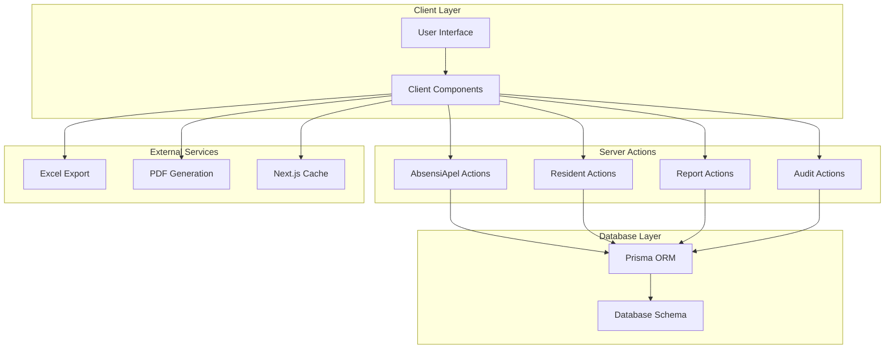
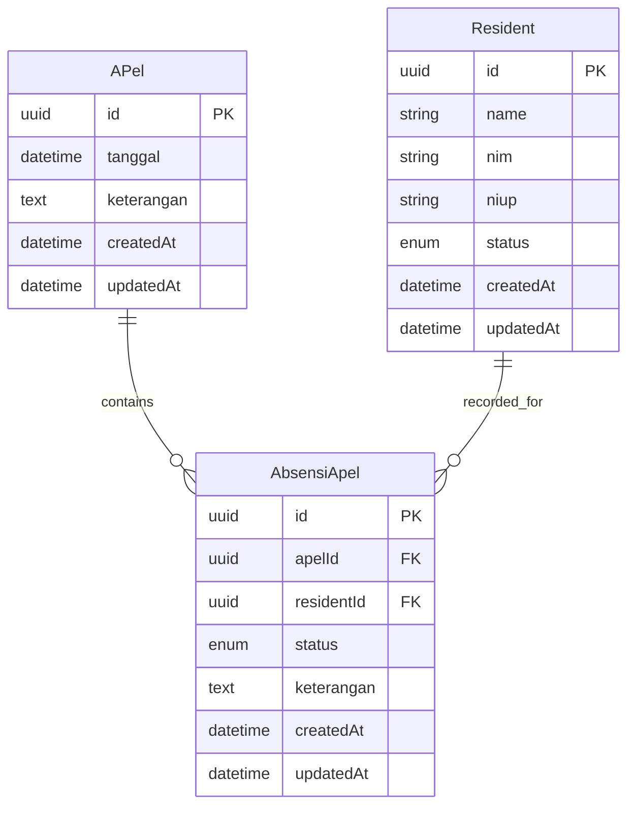
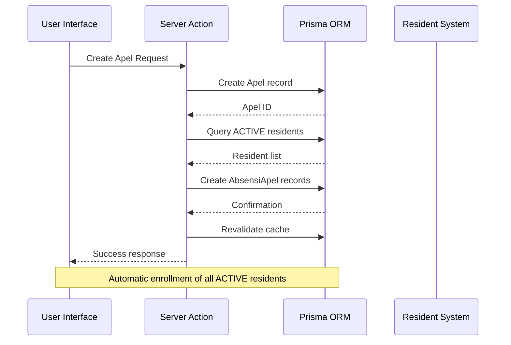
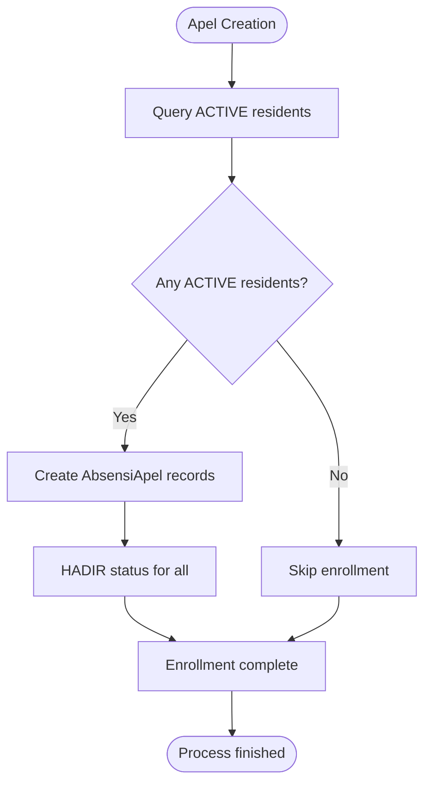
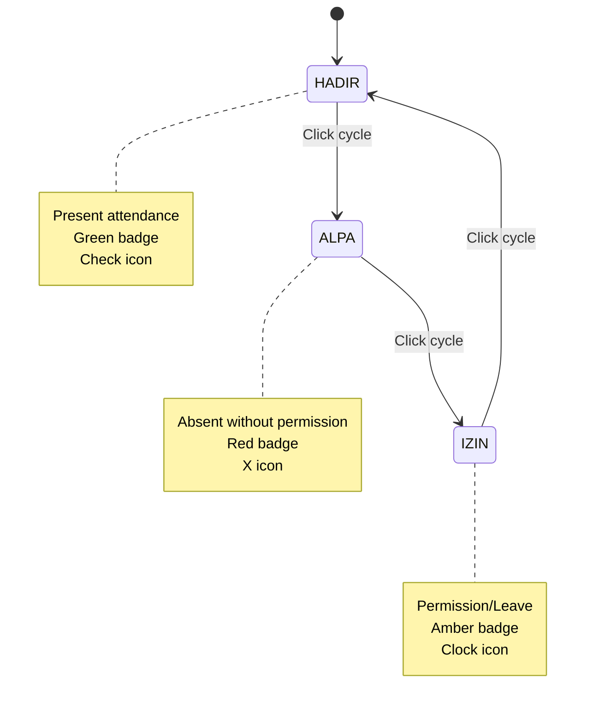
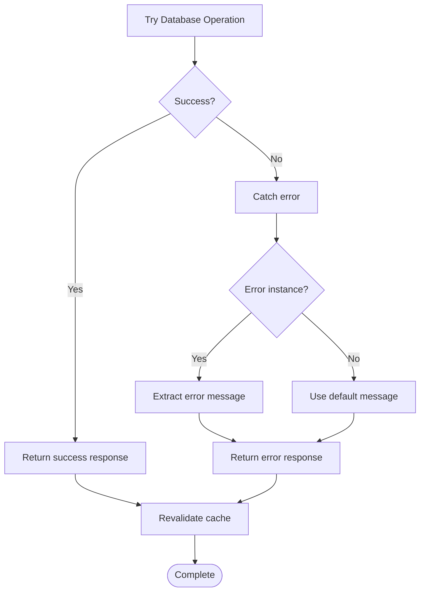
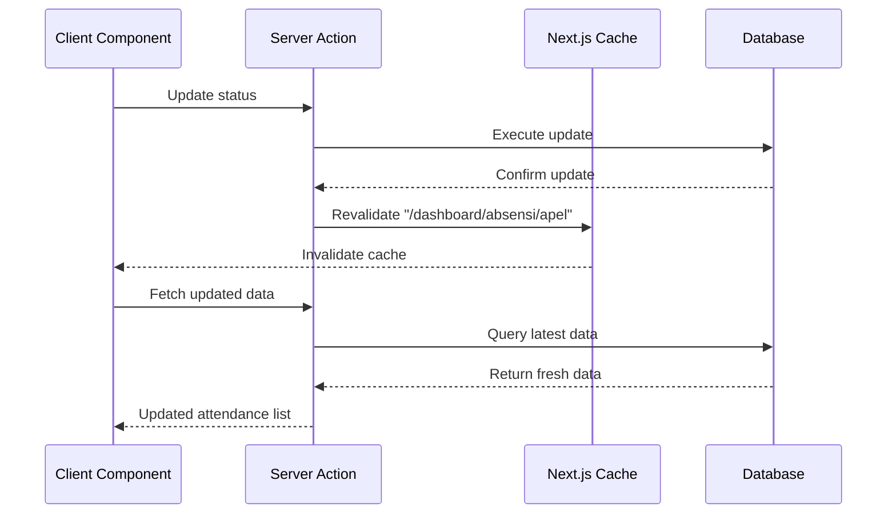
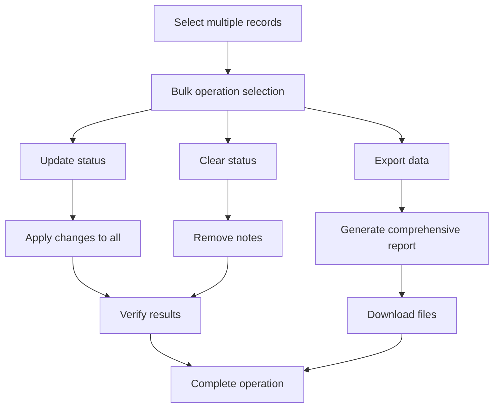
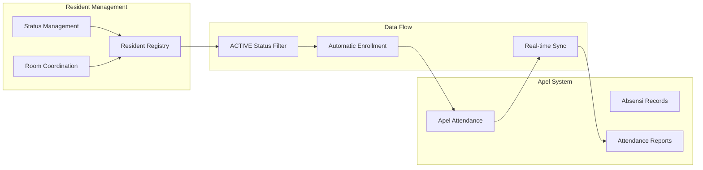
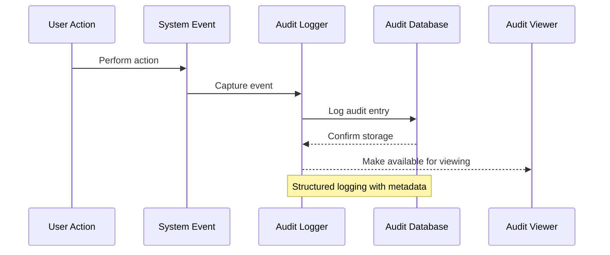

# Daily Attendance - Apel System

<cite>
**Referenced Files in This Document**
- [absensiApel.ts](file://src/app/actions/absensiApel.ts)
- [AbsensiApelClient.tsx](file://src/components/dashboard/AbsensiApelClient.tsx)
- [page.tsx](file://src/app/dashboard/absensi/apel/page.tsx)
- [schema.prisma](file://prisma/schema.prisma)
- [residents.ts](file://src/app/actions/residents.ts)
- [laporan.ts](file://src/app/actions/laporan.ts)
- [LaporanClient.tsx](file://src/components/dashboard/laporan/LaporanClient.tsx)
- [audit.ts](file://src/app/actions/audit.ts)
- [AuditLogClient.tsx](file://src/components/dashboard/audit-log/AuditLogClient.tsx)
</cite>

## Table of Contents
1. [Introduction](#introduction)
2. [System Architecture](#system-architecture)
3. [Core Components](#core-components)
4. [Daily Attendance Recording Process](#daily-attendance-recording-process)
5. [Automatic Resident Enrollment](#automatic-resident-enrollment)
6. [Status Management](#status-management)
7. [Server Actions Implementation](#server-actions-implementation)
8. [Real-time Tracking Features](#real-time-tracking-features)
9. [Bulk Operations and Reporting](#bulk-operations-and-reporting)
10. [Integration with Resident Management](#integration-with-resident-management)
11. [Compliance and Audit Features](#compliance-and-audit-features)
12. [Performance Considerations](#performance-considerations)
13. [Troubleshooting Guide](#troubleshooting-guide)
14. [Conclusion](#conclusion)

## Introduction

The Apel (morning assembly) attendance system is a comprehensive solution designed to manage daily attendance tracking for dormitory residents. This system provides real-time attendance recording, automatic resident enrollment, flexible status management, and integrated reporting capabilities. The system operates on a modern Next.js framework with Prisma ORM, offering a seamless experience for managing morning assembly attendance across multiple dormitories.

The system supports three primary attendance statuses: HADIR (Present), IZIN (Permission), and ALPA (Absent), with additional features for bulk operations, automated reporting, and compliance tracking through audit logs.

## System Architecture

The Apel attendance system follows a client-server architecture pattern built with Next.js App Router, featuring:

**Diagram sources**
- [absensiApel.ts:1-159](file://src/app/actions/absensiApel.ts#L1-L159)
- [schema.prisma:276-306](file://prisma/schema.prisma#L276-L306)

The architecture ensures separation of concerns with dedicated server actions handling database operations, while client components manage user interactions and real-time updates.

## Core Components

### Database Schema Overview

The system utilizes a relational database design with the following key entities:

**Diagram sources**
- [schema.prisma:276-306](file://prisma/schema.prisma#L276-L306)

### Attendance Status Enumerations

The system defines three primary attendance statuses through the `KehadiranApel` enumeration:

| Status | Description | Color Coding |
|--------|-------------|--------------|
| HADIR | Present attendance | Emerald Green |
| ALPA | Absent without permission | Red |
| IZIN | Permission/Leave status | Amber |

**Section sources**
- [schema.prisma:302-306](file://prisma/schema.prisma#L302-L306)

## Daily Attendance Recording Process

The daily attendance recording process follows a structured workflow designed for efficiency and accuracy:

**Diagram sources**
- [absensiApel.ts:7-37](file://src/app/actions/absensiApel.ts#L7-L37)

### Step-by-Step Process

1. **Apel Creation**: System creates a new Apel record with specified date and optional description
2. **Resident Discovery**: Queries all residents with ACTIVE status from the resident management system
3. **Automatic Enrollment**: Creates attendance records for all active residents with initial HADIR status
4. **Real-time Updates**: Implements optimistic UI updates for immediate feedback
5. **Cache Management**: Revalidates Next.js cache for real-time data synchronization

**Section sources**
- [absensiApel.ts:16-29](file://src/app/actions/absensiApel.ts#L16-L29)
- [AbsensiApelClient.tsx:206-233](file://src/components/dashboard/AbsensiApelClient.tsx#L206-L233)

## Automatic Resident Enrollment

The system automatically enrolls all active residents during Apel creation, ensuring comprehensive coverage without manual intervention:

### Enrollment Logic

**Diagram sources**
- [absensiApel.ts:16-29](file://src/app/actions/absensiApel.ts#L16-L29)

### Integration Points

The automatic enrollment leverages the resident management system's ACTIVE status filtering, ensuring that only currently enrolled residents participate in attendance tracking. This integration maintains data consistency and prevents orphaned attendance records.

**Section sources**
- [residents.ts:95-111](file://src/app/actions/residents.ts#L95-L111)
- [absensiApel.ts:16-19](file://src/app/actions/absensiApel.ts#L16-L19)

## Status Management

The system provides flexible status management with intelligent cycling between attendance states:

### Status Transition Logic

**Diagram sources**
- [AbsensiApelClient.tsx:301-328](file://src/components/dashboard/AbsensiApelClient.tsx#L301-L328)

### Real-time Status Updates

The system implements optimistic UI updates for immediate user feedback:

1. **Immediate Visual Feedback**: Status badges update instantly upon click
2. **Rollback Mechanism**: Automatically reverts changes if database operations fail
3. **Parent Count Updates**: Adjusts attendance statistics in real-time
4. **Error Handling**: Provides user-friendly error messages for failed operations

**Section sources**
- [AbsensiApelClient.tsx:301-328](file://src/components/dashboard/AbsensiApelClient.tsx#L301-L328)

## Server Actions Implementation

The server actions provide the backend logic for all Apel-related operations:

### Core Server Actions

| Action | Purpose | Parameters | Returns |
|--------|---------|------------|---------|
| `createApel` | Create new Apel record | `{ tanggal, keterangan }` | `{ success: boolean, apelId: string }` |
| `getApels` | Retrieve Apel list | None | Array of Apel summaries |
| `getApelDetail` | Get Apel with attendance details | `id: string` | Apel with resident attendance |
| `updateAbsensiApelStatus` | Change individual attendance status | `{ absensiId, status }` | `{ success: boolean }` |
| `deleteApel` | Remove Apel and all related records | `id: string` | `{ success: boolean }` |
| `updateApel` | Modify Apel date or description | `{ id, formData }` | `{ success: boolean }` |
| `getAllAbsensiApelDetail` | Export all attendance data | None | Complete attendance dataset |

**Section sources**
- [absensiApel.ts:7-159](file://src/app/actions/absensiApel.ts#L7-L159)

### Error Handling Strategy

The server actions implement comprehensive error handling:

**Diagram sources**
- [absensiApel.ts:33-36](file://src/app/actions/absensiApel.ts#L33-L36)

**Section sources**
- [absensiApel.ts:33-101](file://src/app/actions/absensiApel.ts#L33-L101)

## Real-time Tracking Features

The system provides sophisticated real-time tracking capabilities through Next.js caching and optimistic UI updates:

### Cache Management

**Diagram sources**
- [absensiApel.ts:96-97](file://src/app/actions/absensiApel.ts#L96-L97)

### Optimistic UI Updates

The client-side implementation includes intelligent state management:

1. **Immediate State Changes**: UI reflects status updates before server confirmation
2. **Automatic Rollback**: Reverts changes if server operations fail
3. **Progressive Enhancement**: Maintains functionality even with network delays
4. **User Experience**: Provides instant feedback for smooth interaction

**Section sources**
- [AbsensiApelClient.tsx:310-318](file://src/components/dashboard/AbsensiApelClient.tsx#L310-L318)

## Bulk Operations and Reporting

The system supports comprehensive bulk operations and detailed reporting capabilities:

### Bulk Status Updates

The system enables efficient management of multiple attendance records simultaneously:

### Reporting Features

The system provides multiple reporting formats and export options:

| Report Type | Format | Purpose | Export Options |
|-------------|--------|---------|----------------|
| Attendance Summary | Excel | Monthly overview | XLSX, CSV |
| Individual Records | PDF | Detailed tracking | Print-ready PDF |
| Compliance Reports | Excel | Audit trails | Structured datasets |
| Export History | List | Track downloads | Timestamped records |

**Section sources**
- [AbsensiApelClient.tsx:77-103](file://src/components/dashboard/AbsensiApelClient.tsx#L77-L103)
- [LaporanClient.tsx:161-221](file://src/components/dashboard/laporan/LaporanClient.tsx#L161-L221)

## Integration with Resident Management

The Apel system integrates seamlessly with the broader resident management ecosystem:

### Resident Status Synchronization

**Diagram sources**
- [residents.ts:95-111](file://src/app/actions/residents.ts#L95-L111)
- [absensiApel.ts:16-29](file://src/app/actions/absensiApel.ts#L16-L29)

### Cross-system Benefits

1. **Consistent Data**: Shared ACTIVE status ensures accurate attendance enrollment
2. **Real-time Updates**: Changes in resident status immediately reflect in attendance systems
3. **Single Source of Truth**: Eliminates data inconsistencies across systems
4. **Automated Workflows**: Reduces manual intervention requirements

**Section sources**
- [residents.ts:95-111](file://src/app/actions/residents.ts#L95-L111)

## Compliance and Audit Features

The system maintains comprehensive audit trails for compliance and accountability:

### Audit Logging Implementation

**Diagram sources**
- [audit.ts:8-25](file://src/app/actions/audit.ts#L8-L25)

### Audit Trail Capabilities

The audit system provides comprehensive tracking of all system activities:

| Audit Category | Tracking Details | Search Capability |
|----------------|------------------|-------------------|
| Resident Management | Create, Update, Delete | By entity, user, date range |
| Attendance Operations | Status changes, bulk updates | By action type, affected records |
| System Access | Login attempts, permission changes | By user, IP address, timestamps |
| Report Generation | Export requests, download history | By report type, user, date |

**Section sources**
- [audit.ts:27-98](file://src/app/actions/audit.ts#L27-L98)
- [AuditLogClient.tsx:95-103](file://src/components/dashboard/audit-log/AuditLogClient.tsx#L95-L103)

## Performance Considerations

The system is optimized for performance through several key strategies:

### Database Optimization

1. **Indexing Strategy**: Proper indexing on frequently queried fields (date, status, resident ID)
2. **Query Optimization**: Efficient queries using selective includes and proper ordering
3. **Connection Pooling**: Optimized database connection management
4. **Caching Strategy**: Strategic use of Next.js caching for improved response times

### Frontend Performance

1. **Lazy Loading**: Components load only when needed
2. **Optimistic Updates**: Reduce perceived latency through immediate UI feedback
3. **Efficient State Management**: Minimized re-renders through proper state organization
4. **Memory Management**: Proper cleanup of event listeners and subscriptions

### Scalability Features

1. **Pagination Support**: Efficient handling of large datasets
2. **Filtering Capabilities**: Client-side and server-side filtering options
3. **Batch Operations**: Support for bulk operations to reduce API calls
4. **Responsive Design**: Optimized for various device sizes and connection speeds

## Troubleshooting Guide

Common issues and their solutions:

### Attendance Recording Issues

**Problem**: New Apel creation fails
**Solution**: Check database connectivity and verify ACTIVE resident records exist

**Problem**: Automatic enrollment not working
**Solution**: Verify resident status filtering and database query permissions

### Status Update Problems

**Problem**: Status changes not reflecting
**Solution**: Check cache revalidation and network connectivity

**Problem**: Rollback occurs unexpectedly
**Solution**: Review server action error handling and database constraints

### Performance Issues

**Problem**: Slow page loads
**Solution**: Implement pagination, optimize queries, and leverage caching

**Problem**: Memory leaks in client components
**Solution**: Ensure proper cleanup of event listeners and subscriptions

**Section sources**
- [absensiApel.ts:33-36](file://src/app/actions/absensiApel.ts#L33-L36)
- [AbsensiApelClient.tsx:314-318](file://src/components/dashboard/AbsensiApelClient.tsx#L314-L318)

## Conclusion

The Apel (morning assembly) attendance system provides a comprehensive solution for managing daily attendance tracking in dormitory environments. Through its integration with resident management systems, real-time tracking capabilities, and robust reporting features, the system ensures accurate attendance recording while maintaining operational efficiency.

Key strengths of the system include:

- **Automated Enrollment**: Seamless integration with resident management eliminates manual enrollment tasks
- **Real-time Updates**: Optimistic UI updates provide immediate feedback for smooth user experience
- **Flexible Status Management**: Intelligent status cycling accommodates various attendance scenarios
- **Comprehensive Reporting**: Multiple export formats support diverse reporting needs
- **Audit Compliance**: Complete audit trails ensure transparency and accountability
- **Performance Optimization**: Strategic caching and query optimization maintain system responsiveness

The system's modular architecture and well-defined server actions ensure maintainability and extensibility for future enhancements. The integration with the broader resident management ecosystem provides a unified platform for dormitory operations management.