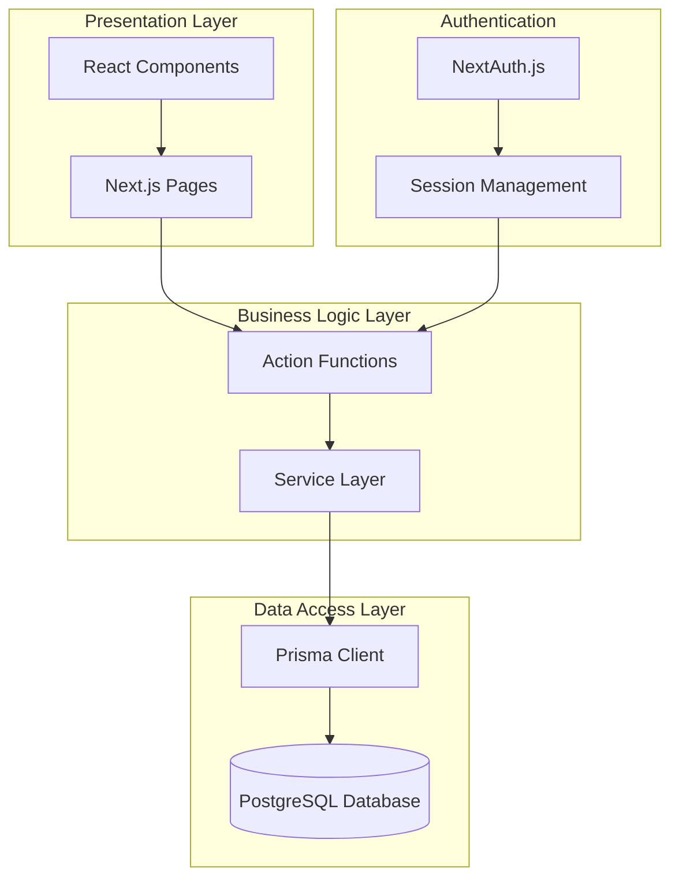
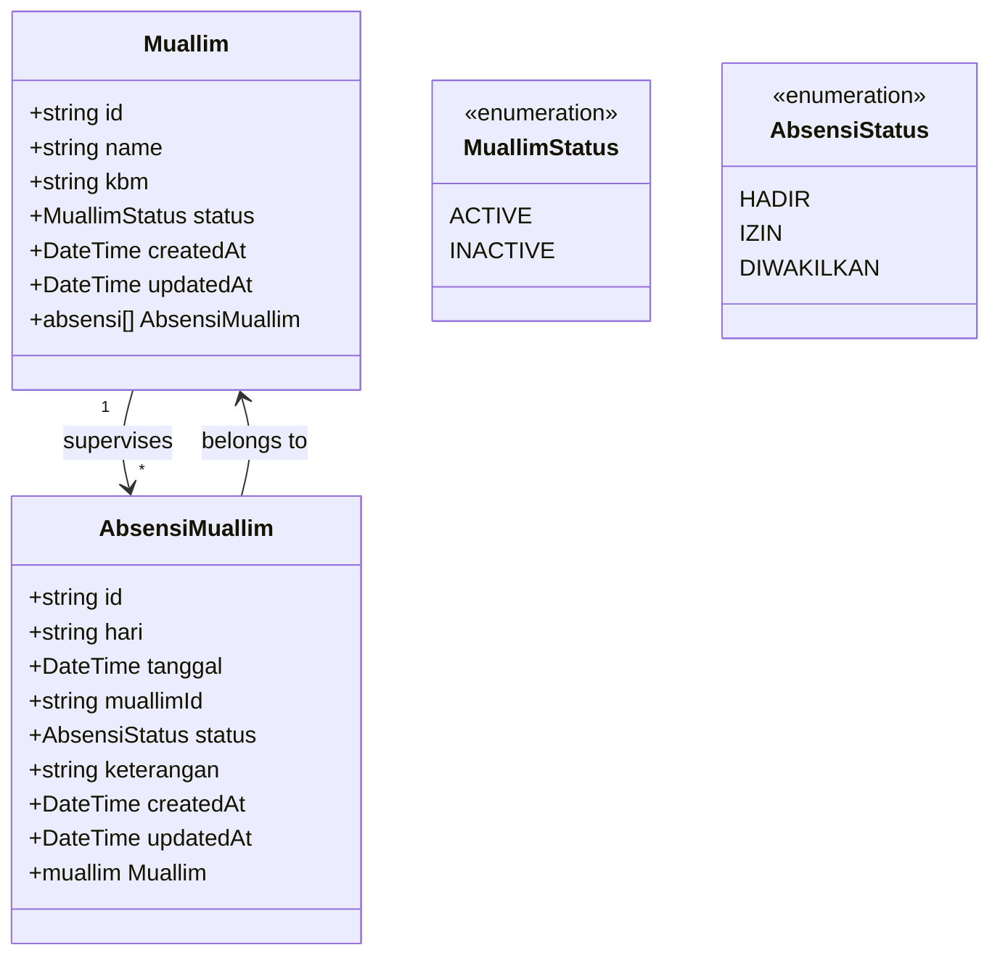
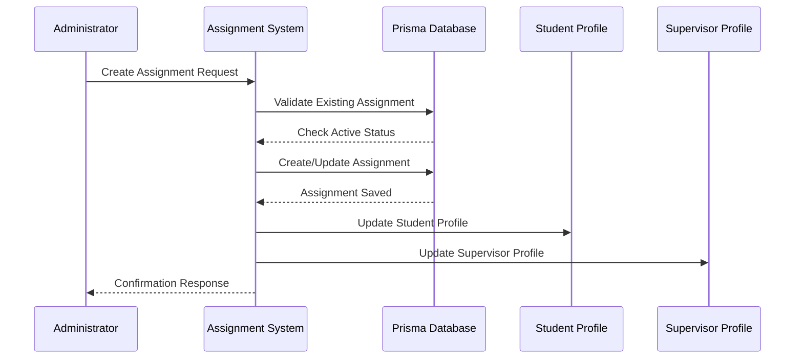
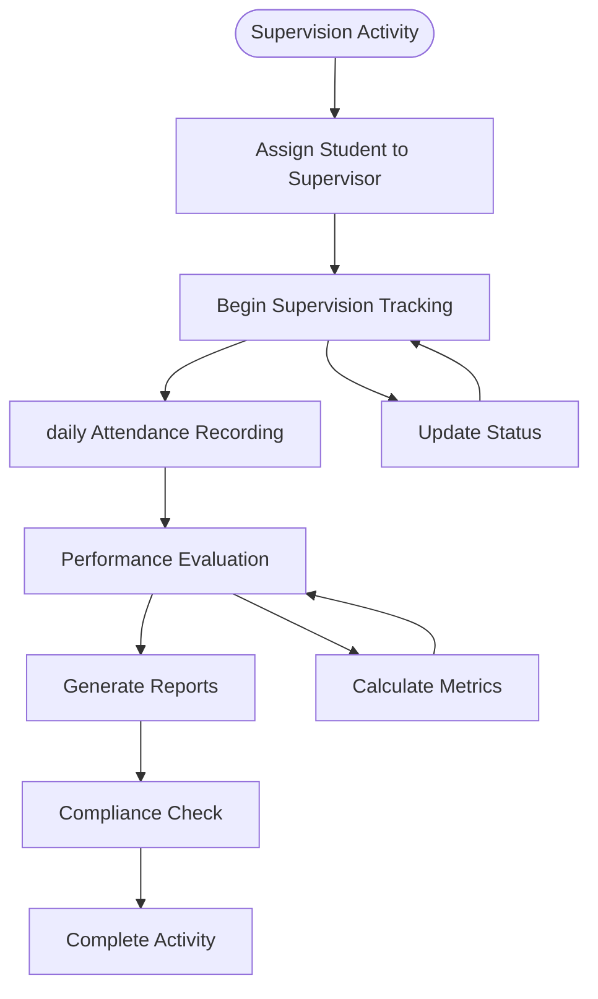
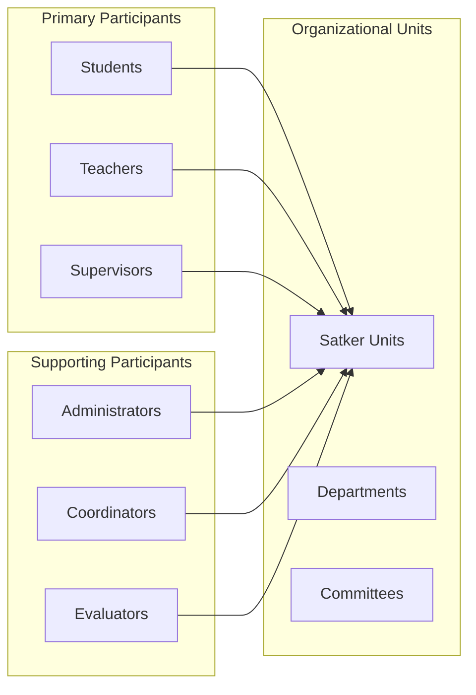
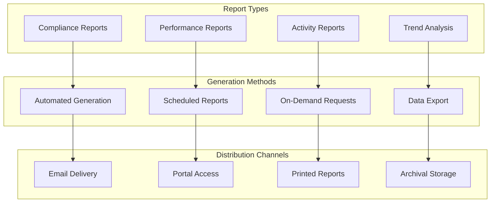
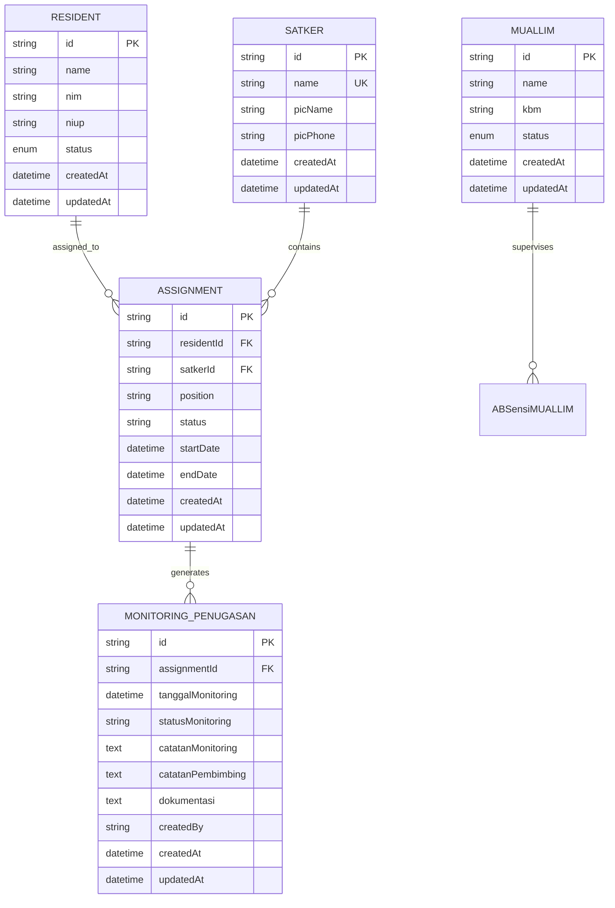
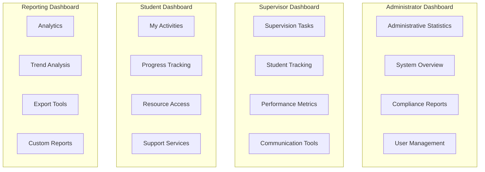

# Teacher Supervision - Muallim System

<cite>
**Referenced Files in This Document**
- [schema.prisma](file://prisma/schema.prisma)
- [muallim.ts](file://src/app/actions/muallim.ts)
- [absensiMuallim.ts](file://src/app/actions/absensiMuallim.ts)
- [assignments.ts](file://src/app/actions/assignments.ts)
- [monitoring.ts](file://src/app/actions/monitoring.ts)
- [MuallimClient.tsx](file://src/components/dashboard/MuallimClient.tsx)
- [AssignmentsClient.tsx](file://src/components/dashboard/AssignmentsClient.tsx)
- [MonitoringPenugasanClient.tsx](file://src/components/dashboard/MonitoringPenugasanClient.tsx)
- [page.tsx](file://src/app/dashboard/absensi/muallim/page.tsx)
- [page.tsx](file://src/app/dashboard/monitoring-penugasan/page.tsx)
- [prisma.ts](file://src/lib/prisma.ts)
</cite>

## Table of Contents
1. [Introduction](#introduction)
2. [System Architecture](#system-architecture)
3. [Core Components](#core-components)
4. [Supervision Session Management](#supervision-session-management)
5. [Assignment-Based Attendance Tracking](#assignment-based-attendance-tracking)
6. [Academic Oversight Features](#academic-oversight-features)
7. [Participant Tracking](#participant-tracking)
8. [Performance Evaluation Integration](#performance-evaluation-integration)
9. [Compliance Reporting](#compliance-reporting)
10. [Teacher Workload Tracking](#teacher-workload-tracking)
11. [Data Models and Relationships](#data-models-and-relationships)
12. [User Interface Components](#user-interface-components)
13. [Security and Permissions](#security-and-permissions)
14. [Conclusion](#conclusion)

## Introduction

The Muallim (teacher supervision) attendance system is a comprehensive academic oversight platform designed specifically for Islamic boarding school environments. This system manages teacher-student supervision relationships, assignment monitoring, and academic performance tracking within the pesantren (Islamic boarding school) ecosystem.

The platform addresses the unique needs of teacher supervision by providing structured attendance tracking, assignment-based monitoring, and performance evaluation capabilities tailored for religious education contexts. It integrates seamlessly with traditional pesantren structures while maintaining modern digital governance standards.

## System Architecture

The Muallim system follows a Next.js 13+ architecture with server-side rendering, utilizing Prisma ORM for database operations and PostgreSQL as the primary database. The system employs a modular component structure with clear separation between presentation, business logic, and data access layers.



**Diagram sources**
- [prisma.ts:1-31](file://src/lib/prisma.ts#L1-L31)
- [schema.prisma:1-487](file://prisma/schema.prisma#L1-L487)

## Core Components

The system consists of four primary functional modules that work together to provide comprehensive teacher supervision capabilities:

### 1. Muallim Management Module
Manages teacher profiles, supervision assignments, and attendance tracking for educational activities.

### 2. Assignment Management Module
Handles student placement within organizational units (Satker), role assignments, and supervision responsibilities.

### 3. Monitoring and Evaluation Module
Provides real-time supervision tracking, performance metrics, and reporting capabilities.

### 4. Academic Oversight Module
Integrates with the broader academic supervision framework to ensure comprehensive oversight of educational activities.

**Section sources**
- [muallim.ts:1-79](file://src/app/actions/muallim.ts#L1-L79)
- [assignments.ts:1-215](file://src/app/actions/assignments.ts#L1-L215)
- [monitoring.ts:1-249](file://src/app/actions/monitoring.ts#L1-L249)

## Supervision Session Management

The supervision session management system provides comprehensive tracking of teacher-student interactions and educational supervision activities within the pesantren environment.

### Muallim (Teacher) Management

The system maintains detailed records of teachers (Muallim) who supervise students during various educational activities. Each teacher profile includes essential information for effective supervision coordination.



**Diagram sources**
- [schema.prisma:206-240](file://prisma/schema.prisma#L206-L240)
- [muallim.ts:1-79](file://src/app/actions/muallim.ts#L1-L79)
- [absensiMuallim.ts:1-63](file://src/app/actions/absensiMuallim.ts#L1-L63)

### Supervision Session Tracking

The system tracks teacher attendance and participation in various supervision activities through structured session management:

- **Daily Supervision Records**: Individual teacher presence tracking for each supervision session
- **Status Management**: Real-time status updates (Present, Absent, Leave, Delegation)
- **Activity Logging**: Comprehensive logging of supervision activities and participant engagement
- **Performance Metrics**: Automated calculation of supervision effectiveness and participation rates

**Section sources**
- [absensiMuallim.ts:1-63](file://src/app/actions/absensiMuallim.ts#L1-L63)
- [MuallimClient.tsx:1-296](file://src/components/dashboard/MuallimClient.tsx#L1-L296)

## Assignment-Based Attendance Tracking

The assignment-based attendance system provides sophisticated tracking mechanisms for student supervision activities within organizational structures.

### Assignment Management System

The system manages student placements within various organizational units (Satker) with comprehensive role assignment and supervision tracking capabilities.



**Diagram sources**
- [assignments.ts:128-173](file://src/app/actions/assignments.ts#L128-L173)

### Attendance Recording Mechanisms

The system implements multiple layers of attendance tracking for academic supervision activities:

- **Direct Attendance Capture**: Real-time attendance recording during supervision sessions
- **Status-Based Tracking**: Automated status updates based on attendance patterns
- **Compliance Monitoring**: Ensures adherence to minimum supervision requirements
- **Reporting Integration**: Seamless data flow to compliance and performance reporting systems

**Section sources**
- [assignments.ts:1-215](file://src/app/actions/assignments.ts#L1-L215)
- [AssignmentsClient.tsx:1-866](file://src/components/dashboard/AssignmentsClient.tsx#L1-L866)

## Academic Oversight Features

The academic oversight module provides comprehensive monitoring and evaluation capabilities for educational supervision activities within the pesantren framework.

### Monitoring and Evaluation System

The system offers sophisticated monitoring capabilities through structured supervision tracking and performance evaluation:



**Diagram sources**
- [monitoring.ts:25-54](file://src/app/actions/monitoring.ts#L25-L54)

### Academic Performance Correlation

The system establishes correlations between supervision activities and academic performance indicators:

- **Participation Analytics**: Tracks supervisor-student interaction frequency and quality
- **Performance Indicators**: Links supervision consistency with academic achievement metrics
- **Trend Analysis**: Identifies patterns between supervision intensity and learning outcomes
- **Benchmarking**: Provides comparative analysis against established supervision standards

**Section sources**
- [monitoring.ts:1-249](file://src/app/actions/monitoring.ts#L1-L249)
- [MonitoringPenugasanClient.tsx:1-540](file://src/components/dashboard/MonitoringPenugasanClient.tsx#L1-L540)

## Participant Tracking

The participant tracking system provides comprehensive visibility into all stakeholders involved in the supervision ecosystem, ensuring effective coordination and accountability.

### Multi-Level Participant Management

The system manages three primary participant categories with distinct roles and responsibilities:



### Real-Time Tracking Capabilities

The system provides dynamic tracking mechanisms for participant engagement and activity monitoring:

- **Live Activity Streams**: Real-time updates on participant activities and supervision sessions
- **Geographic Tracking**: Location-based supervision activity monitoring for campus-wide oversight
- **Communication Channels**: Integrated messaging and notification systems for supervision coordination
- **Resource Allocation**: Dynamic allocation of supervision resources based on participant needs and availability

**Section sources**
- [AssignmentsClient.tsx:30-64](file://src/components/dashboard/AssignmentsClient.tsx#L30-L64)
- [MonitoringPenugasanClient.tsx:24-42](file://src/components/dashboard/MonitoringPenugasanClient.tsx#L24-L42)

## Performance Evaluation Integration

The performance evaluation system integrates supervision activities with comprehensive assessment mechanisms to ensure quality oversight and continuous improvement.

### Evaluation Framework

The system implements a multi-dimensional evaluation framework that assesses supervision effectiveness across multiple criteria:

```mermaid
mindmap
root((Performance Evaluation))
Supervision Quality
Consistency
Effectiveness
Engagement
Student Outcomes
Academic Performance
Behavioral Development
Participation Rates
Supervisor Competency
Professional Skills
Communication
Leadership
System Impact
Institutional Standards
Compliance Metrics
Improvement Trends
```

### Automated Assessment Tools

The system provides automated tools for performance assessment and continuous monitoring:

- **Scoring Algorithms**: AI-powered evaluation of supervision quality and effectiveness
- **Benchmark Comparisons**: Comparative analysis against institutional and industry standards
- **Trend Analysis**: Long-term performance trend identification and pattern recognition
- **Recommendation Engine**: Intelligent suggestions for improvement based on evaluation results

**Section sources**
- [monitoring.ts:107-134](file://src/app/actions/monitoring.ts#L107-L134)
- [MonitoringPenugasanClient.tsx:83-96](file://src/components/dashboard/MonitoringPenugasanClient.tsx#L83-L96)

## Compliance Reporting

The compliance reporting system ensures adherence to institutional standards and regulatory requirements through comprehensive documentation and automated reporting mechanisms.

### Regulatory Compliance Framework

The system maintains detailed compliance records for all supervision activities:

- **Documentation Requirements**: Complete audit trails for all supervision-related activities
- **Standard Adherence**: Verification of compliance with institutional supervision policies
- **Regulatory Reporting**: Automated generation of reports for external regulatory bodies
- **Quality Assurance**: Continuous monitoring of compliance metrics and corrective actions

### Reporting Dashboard

The system provides comprehensive reporting capabilities through an intuitive dashboard interface:



**Diagram sources**
- [monitoring.ts:136-202](file://src/app/actions/monitoring.ts#L136-L202)

**Section sources**
- [monitoring.ts:204-246](file://src/app/actions/monitoring.ts#L204-L246)
- [page.tsx:1-181](file://src/app/dashboard/monitoring-penugasan/page.tsx#L1-L181)

## Teacher Workload Tracking

The teacher workload tracking system provides comprehensive monitoring of supervision responsibilities and academic load distribution among educators.

### Workload Management

The system implements sophisticated workload tracking mechanisms:

- **Supervision Load Balancing**: Ensures equitable distribution of supervision responsibilities
- **Capacity Planning**: Predictive analysis of workload capacity and resource requirements
- **Burnout Prevention**: Early detection of excessive workload through automated monitoring
- **Performance Optimization**: Recommendations for workload adjustment based on performance metrics

### Workload Analytics

The system provides detailed analytics on teacher workload patterns:

- **Hourly Distribution**: Analysis of supervision hours across different time periods
- **Subject Specialization**: Tracking of teacher expertise areas and workload specialization
- **Seasonal Variations**: Identification of workload patterns based on academic calendar cycles
- **Comparative Analysis**: Benchmarking of workload distribution against institutional standards

**Section sources**
- [MuallimClient.tsx:34-36](file://src/components/dashboard/MuallimClient.tsx#L34-L36)
- [monitoring.ts:107-134](file://src/app/actions/monitoring.ts#L107-L134)

## Data Models and Relationships

The system's data architecture is built on a comprehensive relational model that supports the complex relationships inherent in educational supervision environments.

### Core Entity Relationships



**Diagram sources**
- [schema.prisma:103-163](file://prisma/schema.prisma#L103-L163)

### Data Integrity and Validation

The system implements comprehensive data validation and integrity mechanisms:

- **Unique Constraints**: Ensures uniqueness of critical identifiers (NIM, NIUP, Satker names)
- **Referential Integrity**: Maintains consistency across related entity relationships
- **Data Validation**: Real-time validation of input data against predefined business rules
- **Audit Trails**: Complete tracking of all data modifications for compliance and accountability

**Section sources**
- [schema.prisma:1-487](file://prisma/schema.prisma#L1-L487)

## User Interface Components

The system provides intuitive and responsive user interfaces designed specifically for educational supervision workflows.

### Dashboard Components

The system features specialized dashboard components for different user roles:



### Interactive Features

The user interfaces incorporate advanced interactive features:

- **Real-time Updates**: Live synchronization of supervision data across all user interfaces
- **Responsive Design**: Adaptive layouts that work across desktop, tablet, and mobile devices
- **Intuitive Navigation**: Streamlined navigation optimized for educational supervision workflows
- **Accessibility Features**: Comprehensive accessibility support for diverse user needs

**Section sources**
- [MuallimClient.tsx:103-296](file://src/components/dashboard/MuallimClient.tsx#L103-L296)
- [AssignmentsClient.tsx:337-866](file://src/components/dashboard/AssignmentsClient.tsx#L337-L866)
- [MonitoringPenugasanClient.tsx:123-540](file://src/components/dashboard/MonitoringPenugasanClient.tsx#L123-L540)

## Security and Permissions

The system implements comprehensive security measures and role-based access control to protect sensitive educational supervision data.

### Role-Based Access Control

The system employs a sophisticated RBAC system tailored for educational supervision environments:

- **Administrator Roles**: Full system access with comprehensive data management capabilities
- **Supervisor Roles**: Limited access focused on supervision activities and student tracking
- **Student Roles**: Restricted access to personal information and progress tracking
- **Guest Roles**: Basic access for visitors and external stakeholders

### Data Protection Measures

The system implements multiple layers of data protection:

- **Encryption**: End-to-end encryption for sensitive educational data
- **Access Logging**: Comprehensive audit trails of all system access and modifications
- **Data Retention**: Automated data lifecycle management with secure deletion protocols
- **Backup Systems**: Regular automated backups with disaster recovery capabilities

**Section sources**
- [page.tsx:16-69](file://src/app/dashboard/monitoring-penugasan/page.tsx#L16-L69)

## Conclusion

The Muallim teacher supervision system represents a comprehensive solution for managing academic oversight in Islamic boarding school environments. Through its integrated approach to supervision session management, assignment tracking, and performance evaluation, the system addresses the unique challenges of educational supervision while maintaining modern digital governance standards.

The system's modular architecture, comprehensive data models, and intuitive user interfaces provide a solid foundation for effective teacher supervision and academic oversight. Its emphasis on compliance reporting, workload tracking, and performance correlation ensures that supervision activities contribute meaningfully to educational outcomes.

Key strengths of the system include its comprehensive coverage of supervision workflows, robust data integrity mechanisms, and flexible reporting capabilities. The integration of modern technologies with traditional educational supervision practices positions the system as a valuable tool for enhancing the quality and effectiveness of academic oversight in pesantren environments.

Future enhancements could include expanded integration with learning management systems, advanced analytics capabilities, and mobile-first interfaces optimized for field supervision activities. The system's solid architectural foundation provides an excellent foundation for continued evolution and improvement.