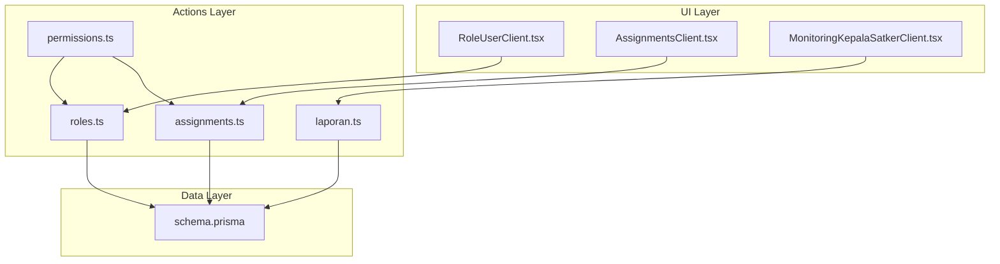
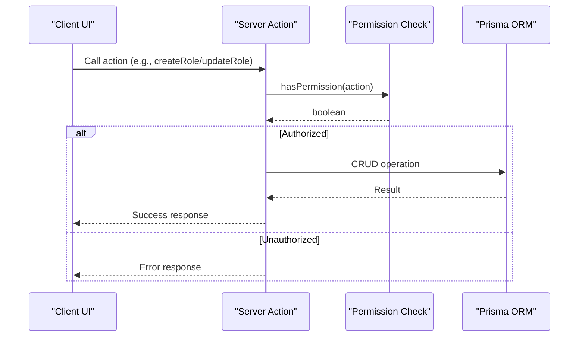
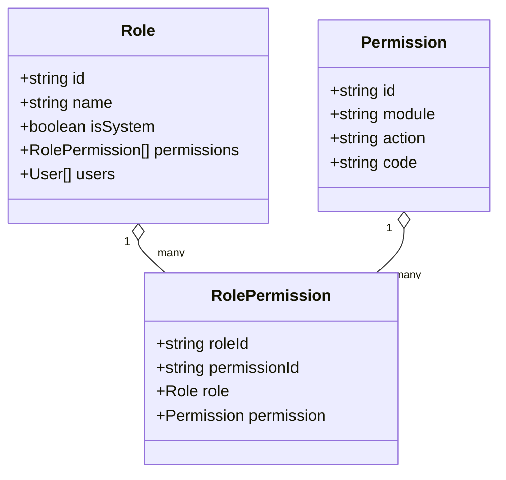
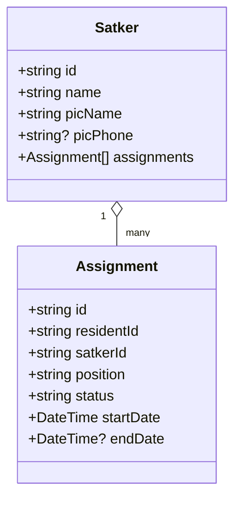
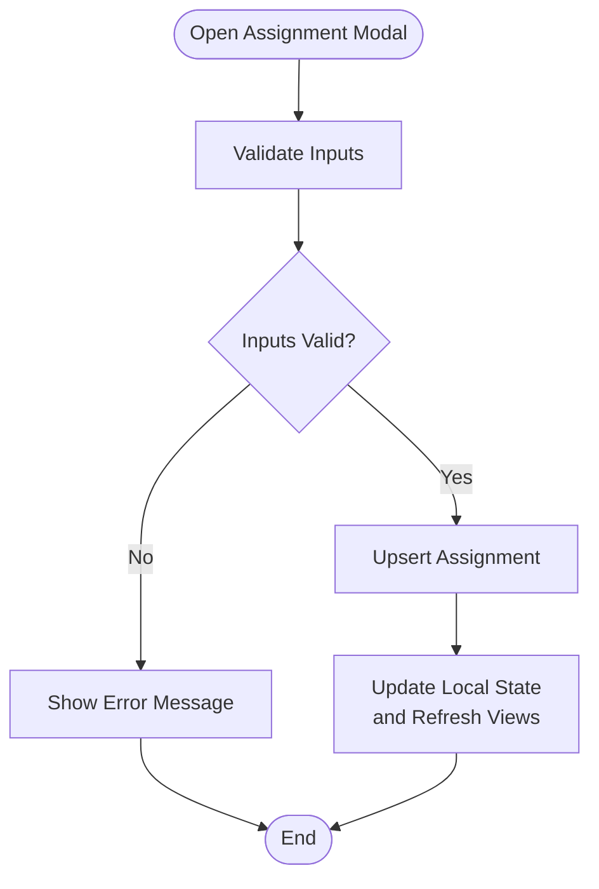
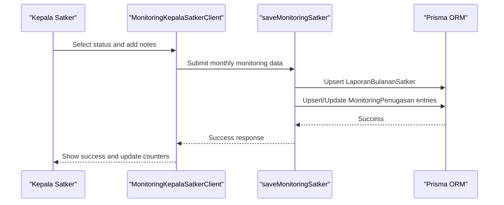
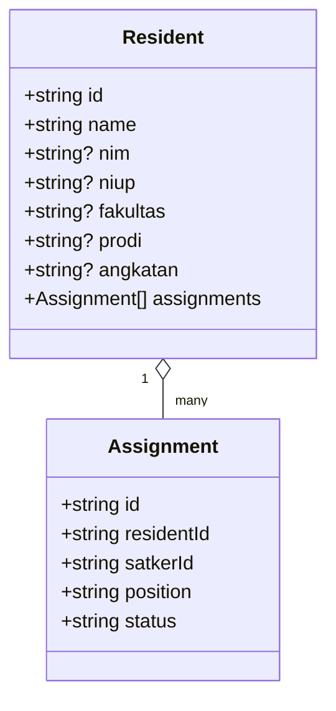
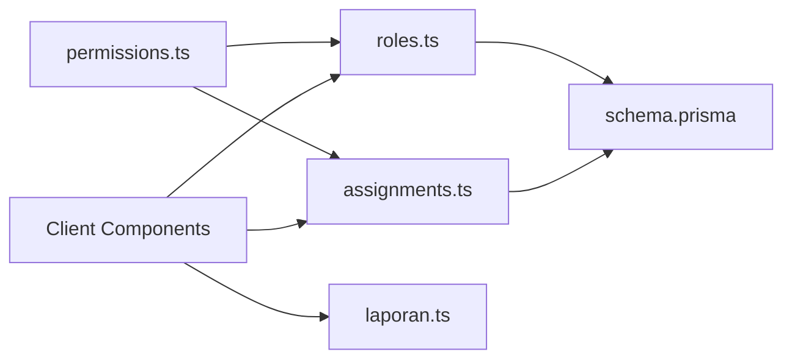

# Assignment & Leadership Management

<cite>
**Referenced Files in This Document**
- [roles.ts](file://src/app/actions/roles.ts)
- [assignments.ts](file://src/app/actions/assignments.ts)
- [permissions.ts](file://src/lib/permissions.ts)
- [AssignmentsClient.tsx](file://src/components/dashboard/AssignmentsClient.tsx)
- [RoleUserClient.tsx](file://src/components/dashboard/role-user/RoleUserClient.tsx)
- [page.tsx](file://src/app/dashboard/role-user/page.tsx)
- [page.tsx](file://src/app/dashboard/assignments/page.tsx)
- [schema.prisma](file://prisma/schema.prisma)
- [page.tsx](file://src/app/dashboard/monitoring-penugasan/page.tsx)
- [MonitoringKepalaSatkerClient.tsx](file://src/components/dashboard/kepala-satker/MonitoringKepalaSatkerClient.tsx)
- [laporan.ts](file://src/app/actions/laporan.ts)
- [page.tsx](file://src/app/dashboard/residents/page.tsx)
- [residents.ts](file://src/app/actions/residents.ts)
- [masterData.ts](file://src/app/actions/masterData.ts)
</cite>

## Table of Contents
1. [Introduction](#introduction)
2. [Project Structure](#project-structure)
3. [Core Components](#core-components)
4. [Architecture Overview](#architecture-overview)
5. [Detailed Component Analysis](#detailed-component-analysis)
6. [Dependency Analysis](#dependency-analysis)
7. [Performance Considerations](#performance-considerations)
8. [Troubleshooting Guide](#troubleshooting-guide)
9. [Conclusion](#conclusion)

## Introduction
This document describes the Assignment & Leadership Management system for managing student leadership roles, departmental assignments, and performance monitoring within the Asrama (residential campus) administration. It covers role hierarchy, responsibility matrices, transition procedures, integration with resident profiles and academic tracking, role-based dashboards, reporting capabilities, and performance evaluation systems. It also addresses succession planning, training requirements, and competency assessments.

## Project Structure
The system is built as a Next.js application with a Prisma ORM backend. Key areas include:
- Role and permission management via server actions and UI components
- Department/unit (Satker) creation and assignment management
- Resident profile integration and academic tracking
- Monthly monitoring and reporting for leadership performance
- Administrative dashboards and audit/log integration

**Diagram sources**
- [RoleUserClient.tsx](file://src/components/dashboard/role-user/RoleUserClient.tsx)
- [AssignmentsClient.tsx](file://src/components/dashboard/AssignmentsClient.tsx)
- [MonitoringKepalaSatkerClient.tsx](file://src/components/dashboard/kepala-satker/MonitoringKepalaSatkerClient.tsx)
- [roles.ts](file://src/app/actions/roles.ts)
- [assignments.ts](file://src/app/actions/assignments.ts)
- [laporan.ts](file://src/app/actions/laporan.ts)
- [permissions.ts](file://src/lib/permissions.ts)
- [schema.prisma](file://prisma/schema.prisma)

**Section sources**
- [roles.ts](file://src/app/actions/roles.ts)
- [assignments.ts](file://src/app/actions/assignments.ts)
- [permissions.ts](file://src/lib/permissions.ts)
- [AssignmentsClient.tsx](file://src/components/dashboard/AssignmentsClient.tsx)
- [RoleUserClient.tsx](file://src/components/dashboard/role-user/RoleUserClient.tsx)
- [page.tsx](file://src/app/dashboard/role-user/page.tsx)
- [page.tsx](file://src/app/dashboard/assignments/page.tsx)
- [schema.prisma](file://prisma/schema.prisma)
- [page.tsx](file://src/app/dashboard/monitoring-penugasan/page.tsx)
- [MonitoringKepalaSatkerClient.tsx](file://src/components/dashboard/kepala-satker/MonitoringKepalaSatkerClient.tsx)
- [laporan.ts](file://src/app/actions/laporan.ts)
- [page.tsx](file://src/app/dashboard/residents/page.tsx)
- [residents.ts](file://src/app/actions/residents.ts)
- [masterData.ts](file://src/app/actions/masterData.ts)

## Core Components
- Role and Permission Management: Centralized role definition, permission assignment, and enforcement.
- Department/Satker Management: Creation, editing, and deletion of organizational units with PIC contact info.
- Assignment Management: Placement of residents into Satkers with positions, statuses, and date ranges.
- Monitoring and Reporting: Monthly activity monitoring, evaluation scoring, and leadership reporting.
- Resident Integration: Academic and demographic data linked to assignments and monitoring.
- Dashboards and Auditing: Role-based dashboards, audit logs, and export history.

**Section sources**
- [roles.ts](file://src/app/actions/roles.ts)
- [assignments.ts](file://src/app/actions/assignments.ts)
- [laporan.ts](file://src/app/actions/laporan.ts)
- [residents.ts](file://src/app/actions/residents.ts)
- [schema.prisma](file://prisma/schema.prisma)

## Architecture Overview
The system follows a layered architecture:
- UI Components: Client-side React components with server action integrations
- Actions: Server functions orchestrating database operations and validations
- Data Model: Prisma schema defining entities, relationships, and enums
- Permissions: Session-based permission checks for role-based access control

**Diagram sources**
- [permissions.ts](file://src/lib/permissions.ts)
- [roles.ts](file://src/app/actions/roles.ts)

**Section sources**
- [permissions.ts](file://src/lib/permissions.ts)
- [roles.ts](file://src/app/actions/roles.ts)

## Detailed Component Analysis

### Role and Permission Management
- Role CRUD: Create, update, delete roles with permission sets; prevents modification of system roles like SUPER_ADMIN.
- Permission Matrix: Hierarchical grouping by module with granular actions (View, Create, Update, Delete, Export).
- Access Control: Server-side permission checks enforce role-based access to actions.

**Diagram sources**
- [schema.prisma](file://prisma/schema.prisma)

**Section sources**
- [roles.ts](file://src/app/actions/roles.ts)
- [RoleUserClient.tsx](file://src/components/dashboard/role-user/RoleUserClient.tsx)
- [page.tsx](file://src/app/dashboard/role-user/page.tsx)
- [permissions.ts](file://src/lib/permissions.ts)
- [schema.prisma](file://prisma/schema.prisma)

### Department/Satker Management
- Satker CRUD: Create, update, delete organizational units with PIC name and optional phone.
- Assignment Linkage: Satker holds multiple assignments; deletion cascades to assignments.
- UI Controls: Tabbed interface toggles between assignments and Satker lists with filtering/search.

**Diagram sources**
- [schema.prisma](file://prisma/schema.prisma)

**Section sources**
- [assignments.ts](file://src/app/actions/assignments.ts)
- [AssignmentsClient.tsx](file://src/components/dashboard/AssignmentsClient.tsx)
- [page.tsx](file://src/app/dashboard/assignments/page.tsx)
- [schema.prisma](file://prisma/schema.prisma)

### Assignment Management Workflow
- Assignment Creation/Update: Validates existing active assignments; supports position, status, and date range.
- Deletion: Removes assignment and updates Satker assignment counts locally.
- Filtering and Search: Supports filtering by resident name/NIM, Satker, and position.

**Diagram sources**
- [AssignmentsClient.tsx](file://src/components/dashboard/AssignmentsClient.tsx)
- [assignments.ts](file://src/app/actions/assignments.ts)

**Section sources**
- [AssignmentsClient.tsx](file://src/components/dashboard/AssignmentsClient.tsx)
- [assignments.ts](file://src/app/actions/assignments.ts)

### Monitoring and Performance Evaluation
- Monthly Monitoring: Captures status (Sangat Aktif, Aktif, Cukup Aktif, Kurang Aktif) and optional notes.
- Evaluation Scoring: Converts status to scores for calculating averages and distribution.
- Reporting: Monthly reports with summaries, charts, and export history.

**Diagram sources**
- [MonitoringKepalaSatkerClient.tsx](file://src/components/dashboard/kepala-satker/MonitoringKepalaSatkerClient.tsx)
- [laporan.ts](file://src/app/actions/laporan.ts)
- [schema.prisma](file://prisma/schema.prisma)

**Section sources**
- [page.tsx](file://src/app/dashboard/monitoring-penugasan/page.tsx)
- [MonitoringKepalaSatkerClient.tsx](file://src/components/dashboard/kepala-satker/MonitoringKepalaSatkerClient.tsx)
- [laporan.ts](file://src/app/actions/laporan.ts)
- [schema.prisma](file://prisma/schema.prisma)

### Resident Integration and Academic Tracking
- Resident Profiles: Full profile with academic fields (faculty, program, cohort) and biographical data.
- Assignment Context: Each resident record includes assignments and related Satker details.
- Academic Data Management: Master data actions for faculty, program, and cohort management.

**Diagram sources**
- [schema.prisma](file://prisma/schema.prisma)

**Section sources**
- [page.tsx](file://src/app/dashboard/residents/page.tsx)
- [residents.ts](file://src/app/actions/residents.ts)
- [masterData.ts](file://src/app/actions/masterData.ts)
- [schema.prisma](file://prisma/schema.prisma)

### Role-Based Dashboards and Reporting
- Dashboard Metrics: Total residents assigned, active Satkers, monthly monitoring counts, and submission status.
- Recaps and Trends: Distribution charts and trend analysis for leadership activity.
- Export History: Tracks report exports with user attribution.

**Section sources**
- [page.tsx](file://src/app/dashboard/monitoring-penugasan/page.tsx)
- [laporan.ts](file://src/app/actions/laporan.ts)

## Dependency Analysis
- Role-based Access Control: Permissions enforced via session checks before invoking actions.
- Data Integrity: Unique constraints on Satker name and resident identifiers; cascade deletes for assignments on Satker removal.
- UI-Action Coupling: Client components call server actions; server actions manage transactions and revalidation.

**Diagram sources**
- [permissions.ts](file://src/lib/permissions.ts)
- [roles.ts](file://src/app/actions/roles.ts)
- [assignments.ts](file://src/app/actions/assignments.ts)
- [laporan.ts](file://src/app/actions/laporan.ts)
- [schema.prisma](file://prisma/schema.prisma)

**Section sources**
- [permissions.ts](file://src/lib/permissions.ts)
- [roles.ts](file://src/app/actions/roles.ts)
- [assignments.ts](file://src/app/actions/assignments.ts)
- [laporan.ts](file://src/app/actions/laporan.ts)
- [schema.prisma](file://prisma/schema.prisma)

## Performance Considerations
- Parallel Data Fetching: Use of Promise.all for concurrent UI data loading reduces latency.
- Efficient Queries: Indexes on frequently queried fields (status, dates) improve filtering performance.
- Pagination and Filtering: Client-side filtering reduces server load; consider server-side pagination for large datasets.
- Transaction Safety: Atomic operations for role updates and monitoring saves prevent inconsistent states.

## Troubleshooting Guide
- Permission Denied: Ensure the user session includes required permissions before invoking actions.
- Validation Errors: UI displays actionable messages for invalid inputs (e.g., duplicate Satker name, missing resident fields).
- Cascading Deletions: Deleting a Satker removes related assignments; confirm impact before proceeding.
- Monitoring Submission: Prevents unauthorized edits after submission; draft mode allows corrections.

**Section sources**
- [permissions.ts](file://src/lib/permissions.ts)
- [roles.ts](file://src/app/actions/roles.ts)
- [assignments.ts](file://src/app/actions/assignments.ts)
- [MonitoringKepalaSatkerClient.tsx](file://src/components/dashboard/kepala-satker/MonitoringKepalaSatkerClient.tsx)

## Conclusion
The Assignment & Leadership Management system provides a robust framework for organizing student leadership roles, assigning responsibilities across departments, and monitoring performance through structured evaluations. Its modular design, strong permission controls, and integrated reporting enable scalable administration with clear accountability and transparency.