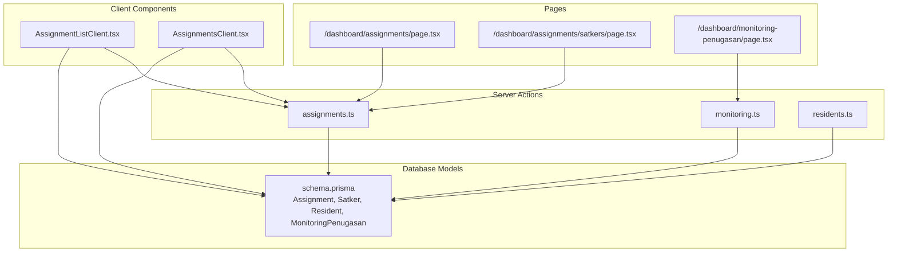
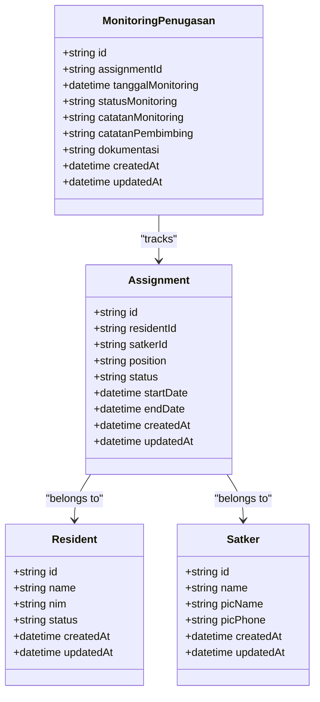
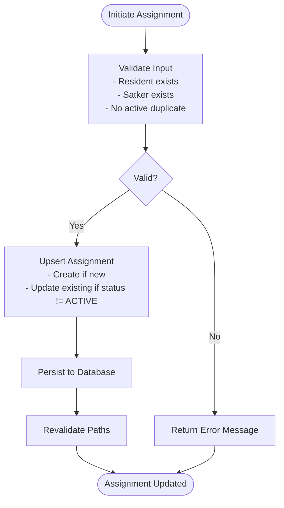
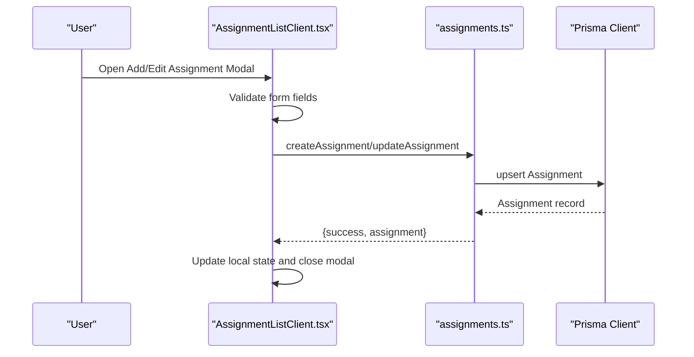
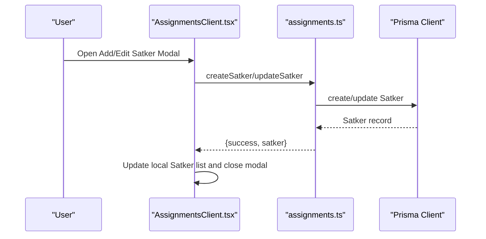
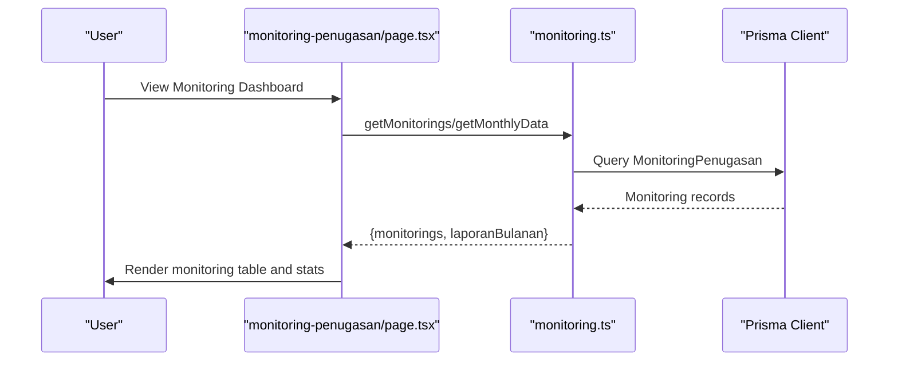
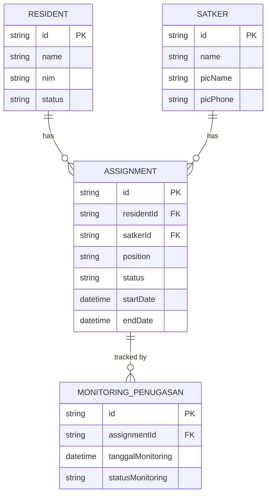
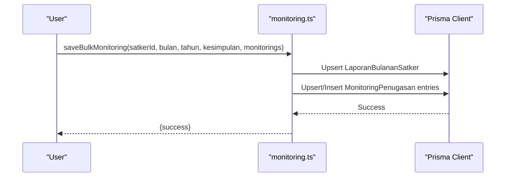
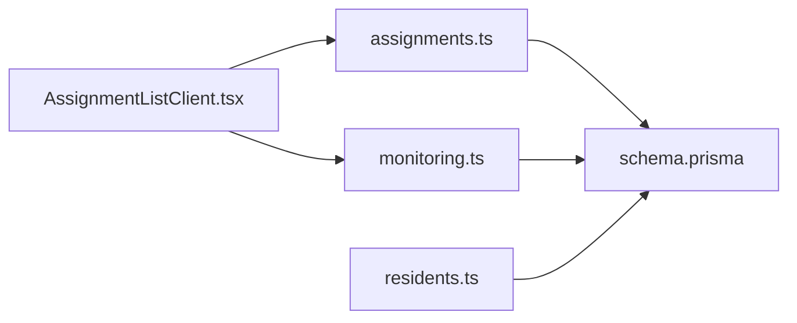

# Assignment Workflow

<cite>
**Referenced Files in This Document**
- [assignments.ts](file://src/app/actions/assignments.ts)
- [AssignmentListClient.tsx](file://src/components/dashboard/AssignmentListClient.tsx)
- [AssignmentsClient.tsx](file://src/components/dashboard/AssignmentsClient.tsx)
- [page.tsx](file://src/app/dashboard/assignments/page.tsx)
- [page.tsx](file://src/app/dashboard/assignments/satkers/page.tsx)
- [schema.prisma](file://prisma/schema.prisma)
- [monitoring.ts](file://src/app/actions/monitoring.ts)
- [page.tsx](file://src/app/dashboard/monitoring-penugasan/page.tsx)
- [laporan.ts](file://src/app/actions/laporan.ts)
- [residents.ts](file://src/app/actions/residents.ts)
</cite>

## Table of Contents
1. [Introduction](#introduction)
2. [Project Structure](#project-structure)
3. [Core Components](#core-components)
4. [Architecture Overview](#architecture-overview)
5. [Detailed Component Analysis](#detailed-component-analysis)
6. [Dependency Analysis](#dependency-analysis)
7. [Performance Considerations](#performance-considerations)
8. [Troubleshooting Guide](#troubleshooting-guide)
9. [Conclusion](#conclusion)

## Introduction
This document explains the complete assignment workflow system for student leadership roles within departments (referred to as Satkers). It covers the step-by-step process for assigning students to various positions, the lifecycle of assignments from initiation to completion, integration with resident profiles and academic records, validation rules, conflict resolution, approval workflows, batch operations, temporary assignments, rotation scheduling, and the relationship between assignments and performance tracking systems.

## Project Structure
The assignment workflow spans server actions, client components, and database models:
- Server Actions: Manage CRUD operations for assignments, Satkers, and related monitoring data.
- Client Components: Provide user interfaces for managing assignments and Satkers, including forms, lists, and modals.
- Database Models: Define the Assignment, Satker, Resident, and MonitoringPenugasan entities and their relationships.

**Diagram sources**
- [assignments.ts:1-215](file://src/app/actions/assignments.ts#L1-L215)
- [AssignmentListClient.tsx:1-523](file://src/components/dashboard/AssignmentListClient.tsx#L1-L523)
- [AssignmentsClient.tsx:1-866](file://src/components/dashboard/AssignmentsClient.tsx#L1-L866)
- [page.tsx:1-30](file://src/app/dashboard/assignments/page.tsx#L1-L30)
- [page.tsx:1-11](file://src/app/dashboard/assignments/satkers/page.tsx#L1-L11)
- [page.tsx:1-181](file://src/app/dashboard/monitoring-penugasan/page.tsx#L1-L181)
- [schema.prisma:115-149](file://prisma/schema.prisma#L115-L149)

**Section sources**
- [page.tsx:1-30](file://src/app/dashboard/assignments/page.tsx#L1-L30)
- [page.tsx:1-11](file://src/app/dashboard/assignments/satkers/page.tsx#L1-L11)
- [schema.prisma:115-149](file://prisma/schema.prisma#L115-L149)

## Core Components
- Assignment Management
  - Create, update, delete assignments with position, status, and date range.
  - Prevent duplicate active assignments for the same resident in the same Satker.
- Satker Management
  - Create, update, delete Satkers with PIC (Point of Contact) information.
- Monitoring and Performance Tracking
  - Track assignment performance via MonitoringPenugasan entries.
  - Generate monthly reports and summaries.
- Resident Integration
  - Link assignments to resident profiles and academic records.
- Batch Operations
  - Bulk monitoring updates and monthly reporting.

**Section sources**
- [assignments.ts:128-173](file://src/app/actions/assignments.ts#L128-L173)
- [monitoring.ts:25-55](file://src/app/actions/monitoring.ts#L25-L55)
- [schema.prisma:115-149](file://prisma/schema.prisma#L115-L149)

## Architecture Overview
The system follows a Next.js Server Actions pattern with a clear separation between server-side data operations and client-side UI rendering. The database model defines strong relationships among Assignment, Satker, Resident, and MonitoringPenugasan.

**Diagram sources**
- [schema.prisma:115-149](file://prisma/schema.prisma#L115-L149)

## Detailed Component Analysis

### Assignment Lifecycle and Validation Rules
The lifecycle covers creation, updates, and termination (completion). Validation ensures no duplicate active assignments for the same resident in the same Satker.

**Diagram sources**
- [assignments.ts:128-173](file://src/app/actions/assignments.ts#L128-L173)

**Section sources**
- [assignments.ts:128-173](file://src/app/actions/assignments.ts#L128-L173)

### Assignment Creation and Editing UI
The client components provide modal forms for adding and editing assignments, including resident selection, Satker selection, position, status, and date ranges.

**Diagram sources**
- [AssignmentListClient.tsx:123-184](file://src/components/dashboard/AssignmentListClient.tsx#L123-L184)
- [assignments.ts:128-199](file://src/app/actions/assignments.ts#L128-L199)

**Section sources**
- [AssignmentListClient.tsx:123-184](file://src/components/dashboard/AssignmentListClient.tsx#L123-L184)
- [assignments.ts:128-199](file://src/app/actions/assignments.ts#L128-L199)

### Satker Management
Satkers serve as organizational units where assignments are placed. The system supports creating, updating, and deleting Satkers with PIC details.

**Diagram sources**
- [AssignmentsClient.tsx:139-189](file://src/components/dashboard/AssignmentsClient.tsx#L139-L189)
- [assignments.ts:44-112](file://src/app/actions/assignments.ts#L44-L112)

**Section sources**
- [AssignmentsClient.tsx:139-189](file://src/components/dashboard/AssignmentsClient.tsx#L139-L189)
- [assignments.ts:44-112](file://src/app/actions/assignments.ts#L44-L112)

### Monitoring and Performance Tracking
Assignments are tracked through MonitoringPenugasan entries, enabling monthly reporting and performance summaries.

**Diagram sources**
- [page.tsx:79-121](file://src/app/dashboard/monitoring-penugasan/page.tsx#L79-L121)
- [monitoring.ts:6-23](file://src/app/actions/monitoring.ts#L6-L23)

**Section sources**
- [page.tsx:79-121](file://src/app/dashboard/monitoring-penugasan/page.tsx#L79-L121)
- [monitoring.ts:6-23](file://src/app/actions/monitoring.ts#L6-L23)

### Integration with Resident Profiles and Academic Records
Assignments link to resident profiles and academic records, enabling comprehensive tracking of student leadership roles alongside academic progress.

**Diagram sources**
- [schema.prisma:115-149](file://prisma/schema.prisma#L115-L149)

**Section sources**
- [schema.prisma:115-149](file://prisma/schema.prisma#L115-L149)
- [residents.ts:76-111](file://src/app/actions/residents.ts#L76-L111)

### Batch Operations and Monthly Reporting
The system supports batch monitoring updates and monthly reporting for Satkers, aggregating performance data across assignments.

**Diagram sources**
- [monitoring.ts:136-202](file://src/app/actions/monitoring.ts#L136-L202)

**Section sources**
- [monitoring.ts:136-202](file://src/app/actions/monitoring.ts#L136-L202)

### Temporary Assignments and Rotation Schedules
Temporary assignments can be modeled using startDate and endDate fields. Rotation schedules can be implemented by creating new assignments with updated dates and positions, leveraging the existing upsert logic to manage overlaps.

**Section sources**
- [assignments.ts:143-164](file://src/app/actions/assignments.ts#L143-L164)
- [schema.prisma:123-124](file://prisma/schema.prisma#L123-L124)

## Dependency Analysis
The assignment workflow depends on:
- Server Actions for data persistence and validation.
- Client Components for user interaction and state management.
- Database Models for entity relationships and constraints.
- Monitoring Actions for performance tracking and reporting.

**Diagram sources**
- [AssignmentListClient.tsx:1-523](file://src/components/dashboard/AssignmentListClient.tsx#L1-L523)
- [assignments.ts:1-215](file://src/app/actions/assignments.ts#L1-L215)
- [monitoring.ts:1-249](file://src/app/actions/monitoring.ts#L1-L249)
- [residents.ts:1-666](file://src/app/actions/residents.ts#L1-L666)
- [schema.prisma:115-149](file://prisma/schema.prisma#L115-L149)

**Section sources**
- [AssignmentListClient.tsx:1-523](file://src/components/dashboard/AssignmentListClient.tsx#L1-L523)
- [assignments.ts:1-215](file://src/app/actions/assignments.ts#L1-L215)
- [monitoring.ts:1-249](file://src/app/actions/monitoring.ts#L1-L249)
- [residents.ts:1-666](file://src/app/actions/residents.ts#L1-L666)
- [schema.prisma:115-149](file://prisma/schema.prisma#L115-L149)

## Performance Considerations
- Use database indexes on frequently queried fields (e.g., Assignment.satkerId, MonitoringPenugasan.tanggalMonitoring).
- Minimize payload sizes by serializing dates appropriately when passing data between server and client components.
- Leverage pagination and filtering to reduce the amount of data rendered in lists.
- Batch operations for monitoring updates to reduce transaction overhead.

## Troubleshooting Guide
Common issues and resolutions:
- Duplicate Active Assignment Error: Ensure the resident is not already assigned to the same Satker with ACTIVE status before creating a new assignment.
- Validation Failures: Verify required fields (residentId, satkerId) and valid date formats before submission.
- Monitoring Data Not Updating: Confirm that the monitoring date falls within the selected month/year filter and that the assignment belongs to the correct Satker.

**Section sources**
- [assignments.ts:139-141](file://src/app/actions/assignments.ts#L139-L141)
- [AssignmentListClient.tsx:127-134](file://src/components/dashboard/AssignmentListClient.tsx#L127-L134)
- [page.tsx:80-91](file://src/app/dashboard/monitoring-penugasan/page.tsx#L80-L91)

## Conclusion
The assignment workflow system provides a robust foundation for managing student leadership roles within departments. It integrates resident profiles, academic records, and performance tracking while enforcing validation rules and supporting batch operations. The modular architecture enables scalability and maintainability, with clear separation between UI, server actions, and data models.