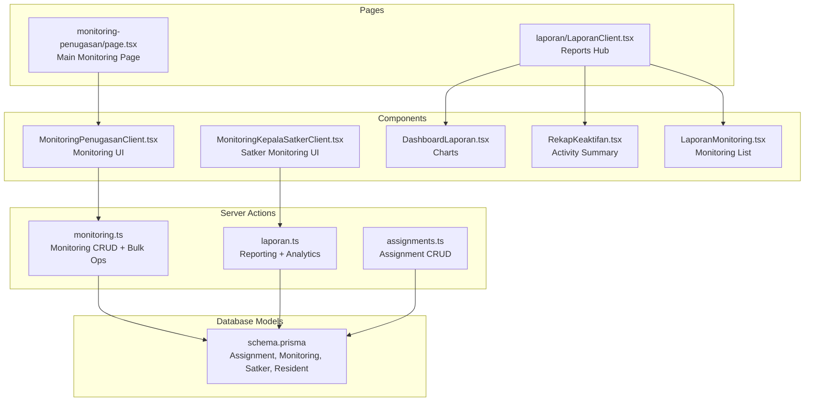
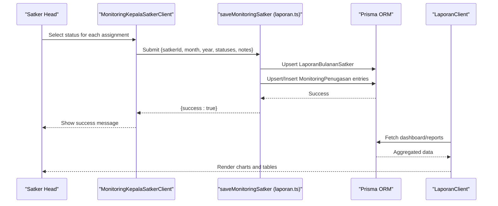
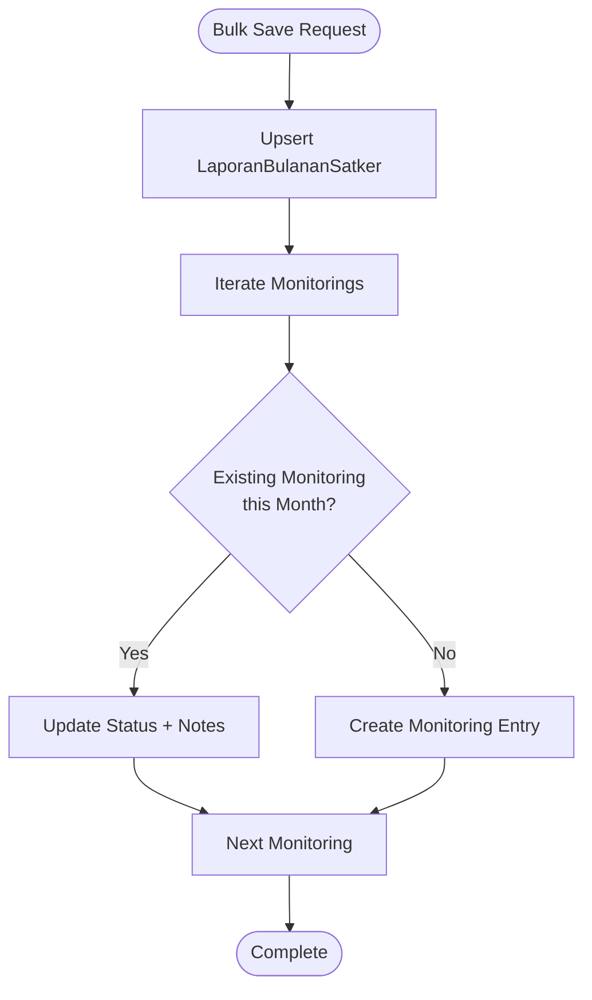
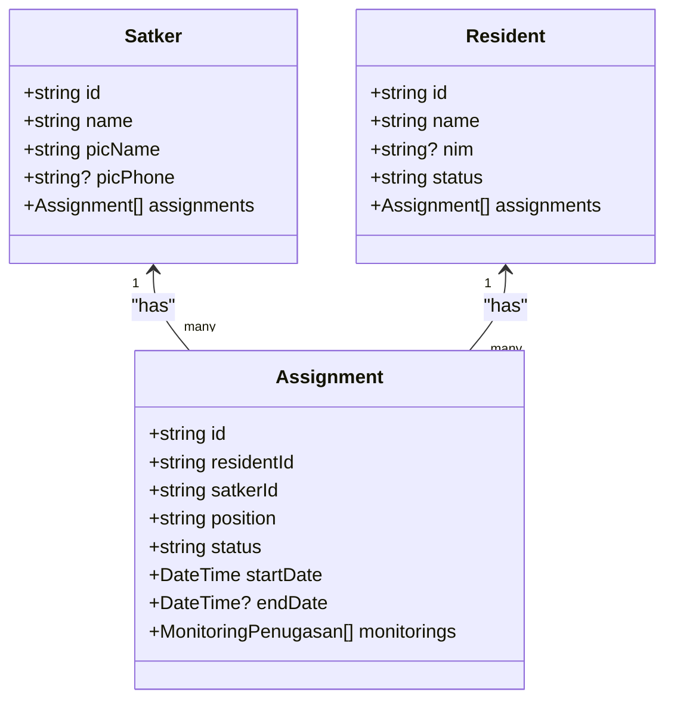
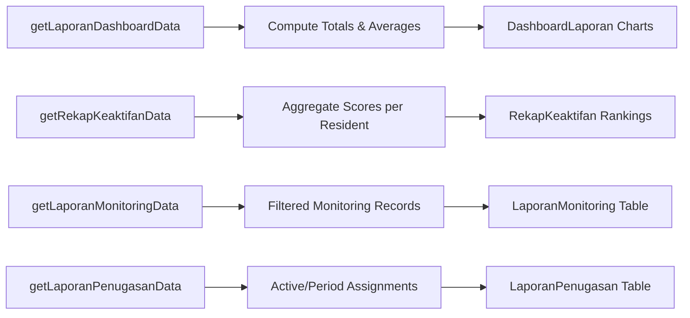
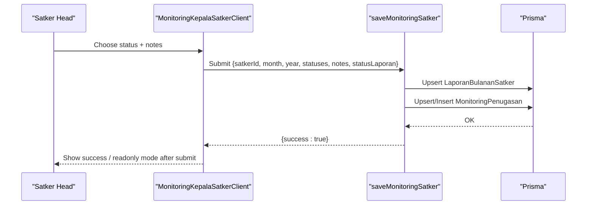
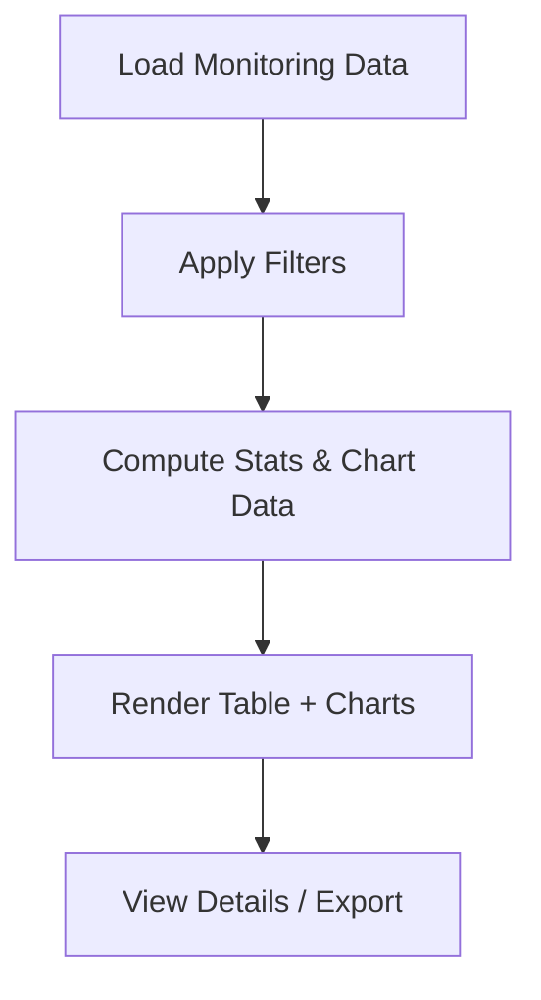
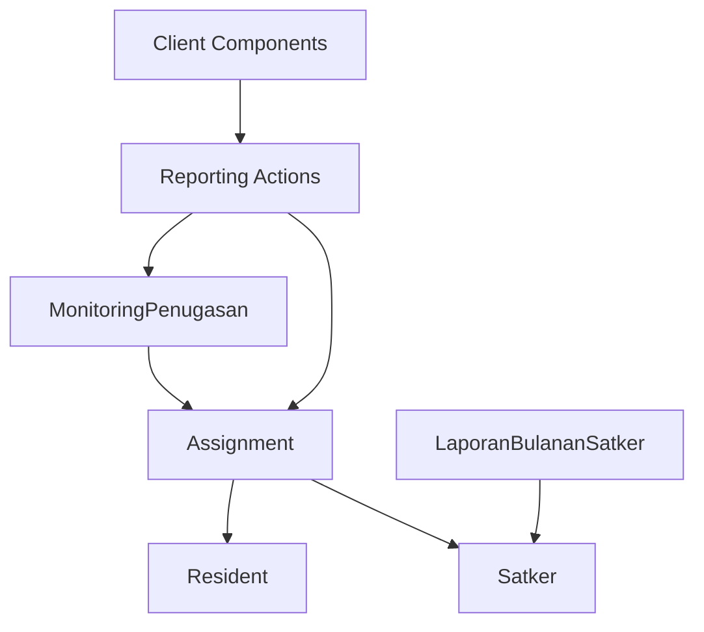

# Performance Monitoring

<cite>
**Referenced Files in This Document**
- [monitoring.ts](file://src/app/actions/monitoring.ts)
- [laporan.ts](file://src/app/actions/laporan.ts)
- [assignments.ts](file://src/app/actions/assignments.ts)
- [page.tsx](file://src/app/dashboard/monitoring-penugasan/page.tsx)
- [MonitoringPenugasanClient.tsx](file://src/components/dashboard/MonitoringPenugasanClient.tsx)
- [MonitoringKepalaSatkerClient.tsx](file://src/components/dashboard/kepala-satker/MonitoringKepalaSatkerClient.tsx)
- [LaporanClient.tsx](file://src/components/dashboard/laporan/LaporanClient.tsx)
- [DashboardLaporan.tsx](file://src/components/dashboard/laporan/DashboardLaporan.tsx)
- [RekapKeaktifan.tsx](file://src/components/dashboard/laporan/RekapKeaktifan.tsx)
- [LaporanMonitoring.tsx](file://src/components/dashboard/laporan/LaporanMonitoring.tsx)
- [schema.prisma](file://prisma/schema.prisma)
</cite>

## Table of Contents
1. [Introduction](#introduction)
2. [Project Structure](#project-structure)
3. [Core Components](#core-components)
4. [Architecture Overview](#architecture-overview)
5. [Detailed Component Analysis](#detailed-component-analysis)
6. [Dependency Analysis](#dependency-analysis)
7. [Performance Considerations](#performance-considerations)
8. [Troubleshooting Guide](#troubleshooting-guide)
9. [Conclusion](#conclusion)

## Introduction
This document describes the performance monitoring system integrated with assignment management. It explains how leadership performance is evaluated using attendance, responsibility fulfillment, and peer evaluations, along with data collection mechanisms, reporting cycles, and evaluation criteria. It also documents integrations with academic performance, behavioral tracking, and attendance systems, and outlines performance improvement plans, coaching requirements, remediation processes, succession planning, talent development, and career progression tracking within leadership roles.

## Project Structure
The performance monitoring system spans server actions, dashboard pages, client components, and database models. Key areas include:
- Assignment management (creation, updates, filtering)
- Monthly monitoring submissions by Satker heads
- Reporting dashboards and analytics
- Bulk monitoring operations and monthly summaries
- Attendance and activity tracking models

**Diagram sources**
- [monitoring.ts:1-249](file://src/app/actions/monitoring.ts#L1-L249)
- [laporan.ts:1-565](file://src/app/actions/laporan.ts#L1-L565)
- [assignments.ts:1-215](file://src/app/actions/assignments.ts#L1-L215)
- [page.tsx:1-181](file://src/app/dashboard/monitoring-penugasan/page.tsx#L1-L181)
- [LaporanClient.tsx:1-430](file://src/components/dashboard/laporan/LaporanClient.tsx#L1-L430)
- [MonitoringPenugasanClient.tsx:1-540](file://src/components/dashboard/MonitoringPenugasanClient.tsx#L1-L540)
- [MonitoringKepalaSatkerClient.tsx:1-336](file://src/components/dashboard/kepala-satker/MonitoringKepalaSatkerClient.tsx#L1-L336)
- [DashboardLaporan.tsx:1-79](file://src/components/dashboard/laporan/DashboardLaporan.tsx#L1-L79)
- [RekapKeaktifan.tsx:1-188](file://src/components/dashboard/laporan/RekapKeaktifan.tsx#L1-L188)
- [LaporanMonitoring.tsx:1-115](file://src/components/dashboard/laporan/LaporanMonitoring.tsx#L1-L115)
- [schema.prisma:115-149](file://prisma/schema.prisma#L115-L149)

**Section sources**
- [monitoring.ts:1-249](file://src/app/actions/monitoring.ts#L1-L249)
- [laporan.ts:1-565](file://src/app/actions/laporan.ts#L1-L565)
- [assignments.ts:1-215](file://src/app/actions/assignments.ts#L1-L215)
- [page.tsx:1-181](file://src/app/dashboard/monitoring-penugasan/page.tsx#L1-L181)
- [LaporanClient.tsx:1-430](file://src/components/dashboard/laporan/LaporanClient.tsx#L1-L430)
- [MonitoringPenugasanClient.tsx:1-540](file://src/components/dashboard/MonitoringPenugasanClient.tsx#L1-L540)
- [MonitoringKepalaSatkerClient.tsx:1-336](file://src/components/dashboard/kepala-satker/MonitoringKepalaSatkerClient.tsx#L1-L336)
- [DashboardLaporan.tsx:1-79](file://src/components/dashboard/laporan/DashboardLaporan.tsx#L1-L79)
- [RekapKeaktifan.tsx:1-188](file://src/components/dashboard/laporan/RekapKeaktifan.tsx#L1-L188)
- [LaporanMonitoring.tsx:1-115](file://src/components/dashboard/laporan/LaporanMonitoring.tsx#L1-L115)
- [schema.prisma:115-149](file://prisma/schema.prisma#L115-L149)

## Core Components
- Monitoring CRUD and Bulk Operations: Create, update, delete, and bulk save monitoring records; monthly summary generation.
- Assignment Management: Create, update, delete assignments; manage Satker structures and leadership roles.
- Reporting and Analytics: Dashboard statistics, trend charts, distribution pie charts, and detailed reports.
- Satker Monitoring UI: Monthly submission interface for Satker heads with draft/submission workflow.
- Monitoring UI: Filtering, pagination, and visualization of monitoring data across periods and Satkers.

Key metrics and KPIs:
- Attendance and Responsibility Fulfillment: Evaluated via monthly monitoring statuses ("Sangat Aktif", "Aktif", "Cukup Aktif", "Kurang Aktif").
- Peer Evaluations: Captured through optional notes and documentation fields.
- Academic Performance Integration: Through Resident academic fields (faculty, program, cohort) enabling cross-reference with activity.
- Behavioral Tracking: Through AbsensiKegiatan and AbsensiApel models for activity presence.
- Attendance Systems: Integrated via AbsensiKegiatan and AbsensiApel models.

**Section sources**
- [monitoring.ts:6-249](file://src/app/actions/monitoring.ts#L6-L249)
- [laporan.ts:9-119](file://src/app/actions/laporan.ts#L9-L119)
- [assignments.ts:128-215](file://src/app/actions/assignments.ts#L128-L215)
- [MonitoringPenugasanClient.tsx:83-122](file://src/components/dashboard/MonitoringPenugasanClient.tsx#L83-L122)
- [MonitoringKepalaSatkerClient.tsx:64-76](file://src/components/dashboard/kepala-satker/MonitoringKepalaSatkerClient.tsx#L64-L76)
- [schema.prisma:115-149](file://prisma/schema.prisma#L115-L149)

## Architecture Overview
The system follows a Next.js server action pattern with Prisma ORM for data persistence. The monitoring lifecycle involves:
- Data Entry: Satker heads submit monthly monitoring statuses.
- Aggregation: Server actions compute statistics and monthly summaries.
- Reporting: Client components render dashboards, charts, and detailed lists.
- Integrations: Attendance and activity models support cross-domain insights.

**Diagram sources**
- [MonitoringKepalaSatkerClient.tsx:82-114](file://src/components/dashboard/kepala-satker/MonitoringKepalaSatkerClient.tsx#L82-L114)
- [laporan.ts:437-519](file://src/app/actions/laporan.ts#L437-L519)
- [LaporanClient.tsx:101-160](file://src/components/dashboard/laporan/LaporanClient.tsx#L101-L160)

**Section sources**
- [MonitoringKepalaSatkerClient.tsx:1-336](file://src/components/dashboard/kepala-satker/MonitoringKepalaSatkerClient.tsx#L1-L336)
- [laporan.ts:437-519](file://src/app/actions/laporan.ts#L437-L519)
- [LaporanClient.tsx:1-430](file://src/components/dashboard/laporan/LaporanClient.tsx#L1-L430)

## Detailed Component Analysis

### Monitoring CRUD and Bulk Operations
- Purpose: Manage MonitoringPenugasan records, including single updates and bulk monthly submissions.
- Key Functions:
  - Retrieve monitoring records with assignment and resident details.
  - Create/update/delete individual monitoring entries.
  - Compute statistics (counts per status).
  - Bulk save: Upsert monthly summary and monitoring records atomically.

**Diagram sources**
- [monitoring.ts:136-202](file://src/app/actions/monitoring.ts#L136-L202)
- [laporan.ts:472-508](file://src/app/actions/laporan.ts#L472-L508)

**Section sources**
- [monitoring.ts:6-249](file://src/app/actions/monitoring.ts#L6-L249)
- [monitoring.ts:107-134](file://src/app/actions/monitoring.ts#L107-L134)
- [monitoring.ts:136-202](file://src/app/actions/monitoring.ts#L136-L202)
- [laporan.ts:437-519](file://src/app/actions/laporan.ts#L437-L519)

### Assignment Management
- Purpose: Define leadership roles and responsibilities within Satkers.
- Key Functions:
  - Create, update, delete Satker entries with PIC contact info.
  - Create, update, delete assignments linking residents to Satkers with positions and status.
  - Prevent duplicate active assignments for the same resident-Satker pair.

**Diagram sources**
- [schema.prisma:103-131](file://prisma/schema.prisma#L103-L131)
- [assignments.ts:128-173](file://src/app/actions/assignments.ts#L128-L173)

**Section sources**
- [assignments.ts:30-126](file://src/app/actions/assignments.ts#L30-L126)
- [assignments.ts:128-173](file://src/app/actions/assignments.ts#L128-L173)
- [schema.prisma:103-131](file://prisma/schema.prisma#L103-L131)

### Reporting and Analytics
- Purpose: Provide dashboards, trend analysis, and distribution views for leadership performance.
- Key Functions:
  - Dashboard data: counts, monthly totals, average activity level, trend over 6 months, distribution pie.
  - Recaps: per-resident averages, rankings, and status categorization.
  - Filters: month/year, Satker, status.

**Diagram sources**
- [laporan.ts:20-120](file://src/app/actions/laporan.ts#L20-L120)
- [laporan.ts:122-195](file://src/app/actions/laporan.ts#L122-L195)
- [laporan.ts:236-289](file://src/app/actions/laporan.ts#L236-L289)
- [laporan.ts:291-341](file://src/app/actions/laporan.ts#L291-L341)
- [DashboardLaporan.tsx:14-79](file://src/components/dashboard/laporan/DashboardLaporan.tsx#L14-L79)
- [RekapKeaktifan.tsx:6-188](file://src/components/dashboard/laporan/RekapKeaktifan.tsx#L6-L188)
- [LaporanMonitoring.tsx:6-115](file://src/components/dashboard/laporan/LaporanMonitoring.tsx#L6-L115)

**Section sources**
- [laporan.ts:20-120](file://src/app/actions/laporan.ts#L20-L120)
- [laporan.ts:122-195](file://src/app/actions/laporan.ts#L122-L195)
- [laporan.ts:236-289](file://src/app/actions/laporan.ts#L236-L289)
- [laporan.ts:291-341](file://src/app/actions/laporan.ts#L291-L341)
- [DashboardLaporan.tsx:1-79](file://src/components/dashboard/laporan/DashboardLaporan.tsx#L1-L79)
- [RekapKeaktifan.tsx:1-188](file://src/components/dashboard/laporan/RekapKeaktifan.tsx#L1-L188)
- [LaporanMonitoring.tsx:1-115](file://src/components/dashboard/laporan/LaporanMonitoring.tsx#L1-L115)

### Satker Monitoring UI
- Purpose: Enable Satker heads to submit monthly monitoring summaries with draft/submission workflow.
- Features:
  - Search/filter by resident name/NIM.
  - Status selection per assignment with optional notes.
  - Draft vs. submitted state management.
  - Print/export-ready layout.

**Diagram sources**
- [MonitoringKepalaSatkerClient.tsx:82-114](file://src/components/dashboard/kepala-satker/MonitoringKepalaSatkerClient.tsx#L82-L114)
- [laporan.ts:437-519](file://src/app/actions/laporan.ts#L437-L519)

**Section sources**
- [MonitoringKepalaSatkerClient.tsx:1-336](file://src/components/dashboard/kepala-satker/MonitoringKepalaSatkerClient.tsx#L1-L336)
- [laporan.ts:437-519](file://src/app/actions/laporan.ts#L437-L519)

### Monitoring UI (Admin/Coordinator View)
- Purpose: Provide administrative oversight of monitoring across Satkers.
- Features:
  - Filters: month, year, Satker, status.
  - Statistics cards and pie chart of activity distribution.
  - Detailed table with resident, Satker, status, period, and actions.

**Diagram sources**
- [page.tsx:79-120](file://src/app/dashboard/monitoring-penugasan/page.tsx#L79-L120)
- [MonitoringPenugasanClient.tsx:98-122](file://src/components/dashboard/MonitoringPenugasanClient.tsx#L98-L122)

**Section sources**
- [page.tsx:1-181](file://src/app/dashboard/monitoring-penugasan/page.tsx#L1-L181)
- [MonitoringPenugasanClient.tsx:1-540](file://src/components/dashboard/MonitoringPenugasanClient.tsx#L1-L540)

## Dependency Analysis
- MonitoringPenugasan depends on Assignment, which links to Resident and Satker.
- LaporanBulananSatker aggregates monthly summaries per Satker.
- Reporting actions depend on monitoring and assignment data.
- UI components depend on server actions for data fetching and mutations.

**Diagram sources**
- [schema.prisma:115-163](file://prisma/schema.prisma#L115-L163)
- [monitoring.ts:6-23](file://src/app/actions/monitoring.ts#L6-L23)
- [laporan.ts:20-120](file://src/app/actions/laporan.ts#L20-L120)

**Section sources**
- [schema.prisma:115-163](file://prisma/schema.prisma#L115-L163)
- [monitoring.ts:6-23](file://src/app/actions/monitoring.ts#L6-L23)
- [laporan.ts:20-120](file://src/app/actions/laporan.ts#L20-L120)

## Performance Considerations
- Efficient Filtering: Use database-level filters (month ranges, status, Satker) to minimize payload sizes.
- Batch Operations: Prefer bulk upserts for monthly summaries to reduce transaction overhead.
- Caching: Leverage Next.js revalidation paths to keep dashboards fresh without redundant computations.
- Pagination: Implement pagination for large datasets to improve UI responsiveness.
- Indexing: Ensure database indexes on frequently queried fields (assignmentId, tanggalMonitoring, satkerId).

## Troubleshooting Guide
Common issues and resolutions:
- Unauthorized Access: Ensure proper role checks for viewing and exporting reports.
- Duplicate Active Assignments: The system prevents duplicate active assignments for the same resident-Satker pair.
- Missing Data: Verify monthly date ranges and status filters when reports appear empty.
- Submission Conflicts: Satker heads can only edit drafts; submitted reports become read-only.

**Section sources**
- [laporan.ts:197-215](file://src/app/actions/laporan.ts#L197-L215)
- [assignments.ts:139-141](file://src/app/actions/assignments.ts#L139-L141)
- [MonitoringKepalaSatkerClient.tsx:120-121](file://src/components/dashboard/kepala-satker/MonitoringKepalaSatkerClient.tsx#L120-L121)

## Conclusion
The performance monitoring system integrates assignment management with monthly leadership evaluations, providing robust reporting, analytics, and compliance workflows. By leveraging structured monitoring statuses, optional notes, and monthly summaries, the system supports performance improvement plans, coaching requirements, remediation processes, and long-term succession planning and career progression tracking for leadership roles within Satkers.