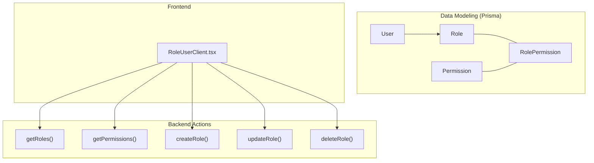
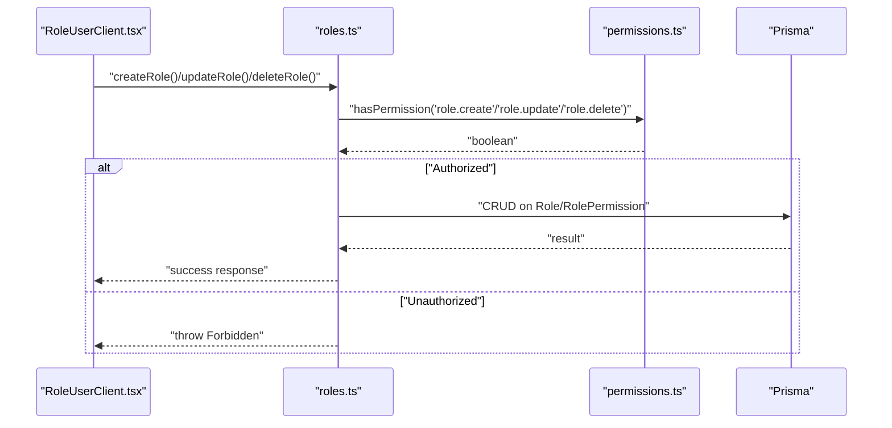
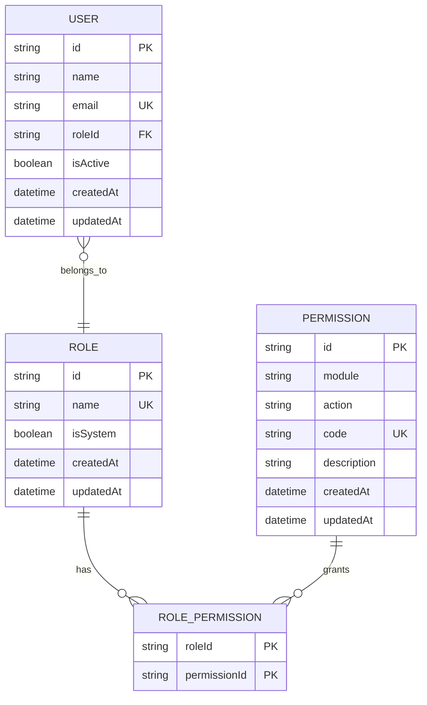
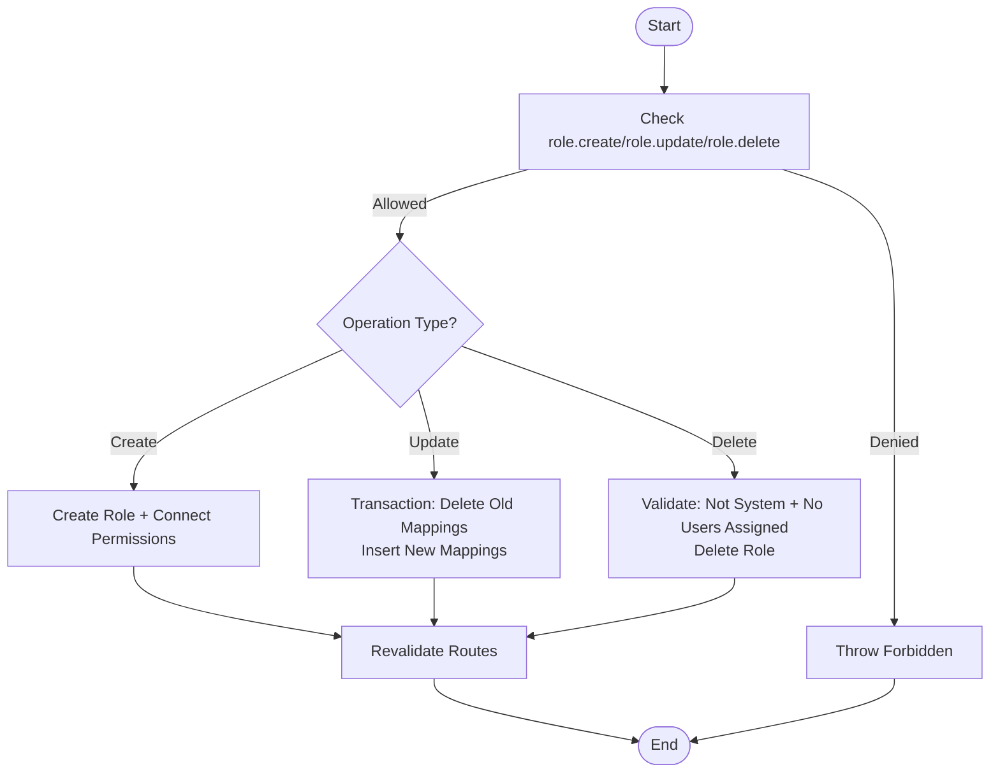
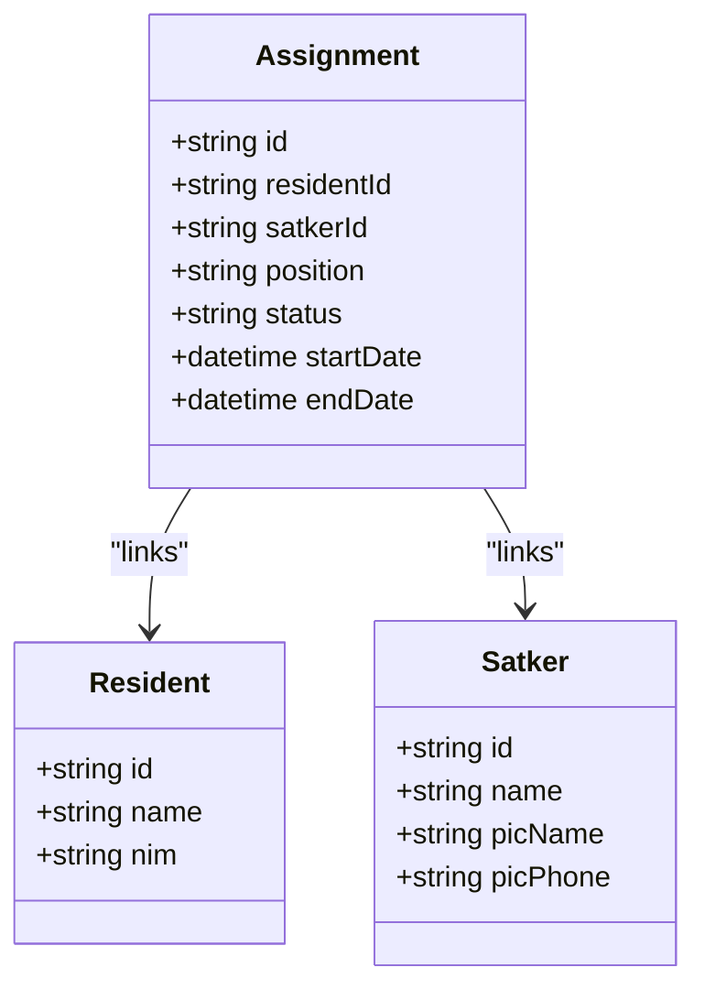
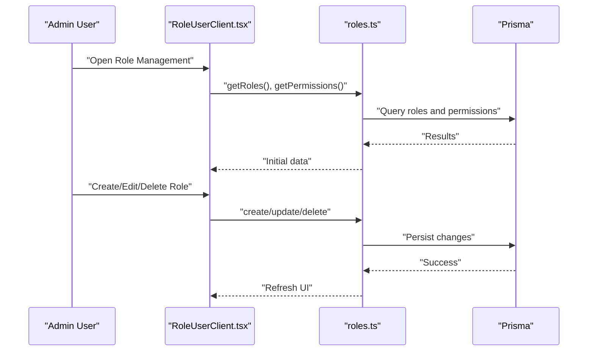
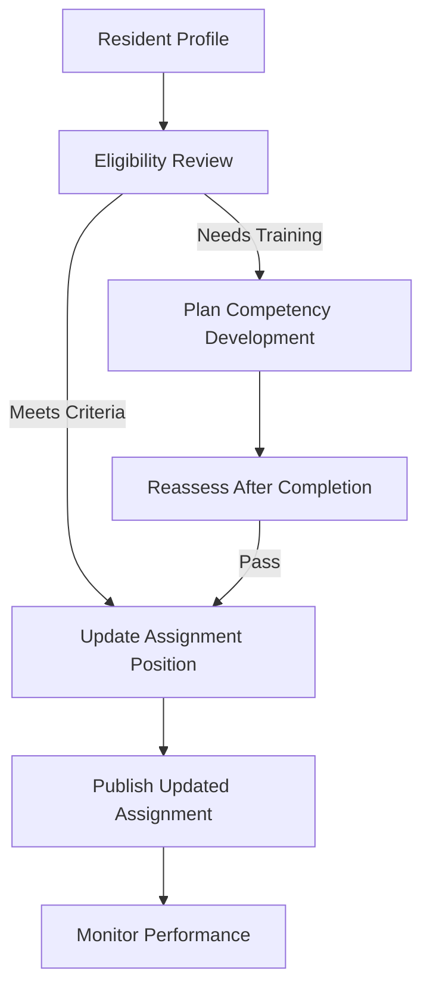
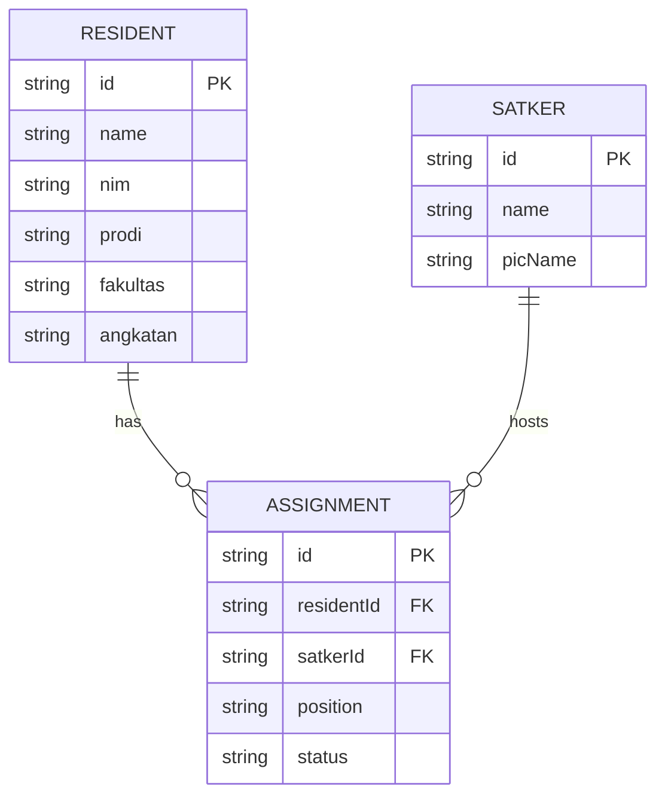
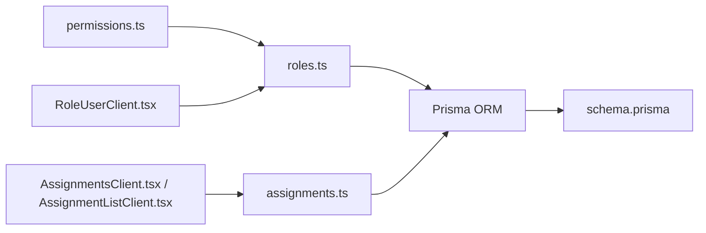

# Role Management

<cite>
**Referenced Files in This Document**
- [roles.ts](file://src/app/actions/roles.ts)
- [RoleUserClient.tsx](file://src/components/dashboard/role-user/RoleUserClient.tsx)
- [schema.prisma](file://prisma/schema.prisma)
- [permissions.ts](file://src/lib/permissions.ts)
- [seed.ts](file://prisma/seed.ts)
- [assignments.ts](file://src/app/actions/assignments.ts)
- [AssignmentsClient.tsx](file://src/components/dashboard/AssignmentsClient.tsx)
- [AssignmentListClient.tsx](file://src/components/dashboard/AssignmentListClient.tsx)
</cite>

## Table of Contents
1. [Introduction](#introduction)
2. [Project Structure](#project-structure)
3. [Core Components](#core-components)
4. [Architecture Overview](#architecture-overview)
5. [Detailed Component Analysis](#detailed-component-analysis)
6. [Dependency Analysis](#dependency-analysis)
7. [Performance Considerations](#performance-considerations)
8. [Troubleshooting Guide](#troubleshooting-guide)
9. [Conclusion](#conclusion)

## Introduction
This document describes the role management system within the assignment and leadership framework. It explains how roles and permissions are modeled, how leadership positions are represented and managed, and how role assignments integrate with resident profiles and academic performance indicators. It also documents creation, modification, and deletion workflows, eligibility and competency considerations, and transitions such as promotions and demotions.

## Project Structure
The role management system spans three primary areas:
- Data modeling: Prisma schema defines roles, permissions, and the relationship between users and roles.
- Backend actions: Server-side functions enforce permissions and manage role lifecycle operations.
- Frontend dashboards: Client components render role lists, permissions trees, and provide CRUD controls.

**Diagram sources**
- [schema.prisma](file://prisma/schema.prisma)
- [roles.ts](file://src/app/actions/roles.ts)
- [RoleUserClient.tsx](file://src/components/dashboard/role-user/RoleUserClient.tsx)

**Section sources**
- [schema.prisma](file://prisma/schema.prisma)
- [roles.ts](file://src/app/actions/roles.ts)
- [RoleUserClient.tsx](file://src/components/dashboard/role-user/RoleUserClient.tsx)

## Core Components
- Roles and Permissions
  - Roles are unique identifiers with optional system flags and associated permissions.
  - Permissions are granular capabilities grouped by module and action (View, Create, Update, Delete, Export).
  - Users belong to a single role, which determines their access to system features.

- Role Lifecycle Operations
  - Retrieve roles with permission counts and included permissions.
  - Retrieve all permissions for building the permission tree.
  - Create roles with selected permissions.
  - Update roles by replacing all permissions via transaction.
  - Delete roles with safety checks (system roles, assigned users).

- Leadership Positions and Assignments
  - Leadership positions (e.g., Ketua, Sekretaris, Bendahara, Anggota) are stored as free-text values in the assignment record.
  - Assignments link residents to Satker units and capture position, status, and date range.
  - UI surfaces position badges and color coding for visibility.

- Integration with Residents and Academic Indicators
  - Assignments are linked to resident profiles and can be viewed in resident detail modals.
  - Academic performance indicators are part of resident records and can be considered during eligibility and competency assessments.

**Section sources**
- [schema.prisma](file://prisma/schema.prisma)
- [roles.ts](file://src/app/actions/roles.ts)
- [RoleUserClient.tsx](file://src/components/dashboard/role-user/RoleUserClient.tsx)
- [assignments.ts](file://src/app/actions/assignments.ts)
- [AssignmentsClient.tsx](file://src/components/dashboard/AssignmentsClient.tsx)
- [AssignmentListClient.tsx](file://src/components/dashboard/AssignmentListClient.tsx)

## Architecture Overview
The system enforces authorization via a middleware that checks user permissions against the current session. Role management is exposed through server actions that validate permissions before performing operations.

**Diagram sources**
- [RoleUserClient.tsx](file://src/components/dashboard/role-user/RoleUserClient.tsx)
- [roles.ts](file://src/app/actions/roles.ts)
- [permissions.ts](file://src/lib/permissions.ts)

## Detailed Component Analysis

### Role Model and Permissions Matrix
Roles and permissions are modeled with a many-to-many relationship mediated by a join table. Permissions are grouped by module and action, enabling fine-grained access control.

**Diagram sources**
- [schema.prisma](file://prisma/schema.prisma)

**Section sources**
- [schema.prisma](file://prisma/schema.prisma)

### Role Creation, Modification, and Deletion Workflows
- Creation
  - Validates role.create permission.
  - Creates role and connects selected permissions.
  - Revalidates relevant dashboard routes.

- Update
  - Validates role.update permission.
  - Prevents modifying system SUPER_ADMIN role directly.
  - Uses a transaction to delete old role-permission mappings and insert new ones.
  - Revalidates routes.

- Deletion
  - Validates role.delete permission.
  - Prevents deleting system roles and roles still assigned to users.
  - Deletes the role after checks.

**Diagram sources**
- [roles.ts](file://src/app/actions/roles.ts)
- [permissions.ts](file://src/lib/permissions.ts)

**Section sources**
- [roles.ts](file://src/app/actions/roles.ts)
- [permissions.ts](file://src/lib/permissions.ts)

### Position Classifications and Responsibilities
Positions are stored as free-text values in the assignment record. Common classifications observed in the UI include:
- Ketua (Chairperson)
- Sekretaris (Secretary)
- Bendahara (Treasurer)
- Anggota (Member)

These positions are visually highlighted in the UI with distinct badges and colors to distinguish leadership roles from members.

**Diagram sources**
- [schema.prisma](file://prisma/schema.prisma)
- [AssignmentsClient.tsx](file://src/components/dashboard/AssignmentsClient.tsx)
- [AssignmentListClient.tsx](file://src/components/dashboard/AssignmentListClient.tsx)

**Section sources**
- [schema.prisma](file://prisma/schema.prisma)
- [AssignmentsClient.tsx](file://src/components/dashboard/AssignmentsClient.tsx)
- [AssignmentListClient.tsx](file://src/components/dashboard/AssignmentListClient.tsx)

### Role Assignment Workflows and Eligibility
- Role assignment is handled at the user level via the role-user dashboard. Users are assigned a single role that governs their permissions.
- Eligibility criteria for leadership positions are not enforced by the codebase. They can be considered during assignment decisions and documented separately.
- Competency requirements are not modeled in the schema and would need to be captured externally (e.g., in resident profiles or external evaluation systems).

**Diagram sources**
- [RoleUserClient.tsx](file://src/components/dashboard/role-user/RoleUserClient.tsx)
- [roles.ts](file://src/app/actions/roles.ts)
- [schema.prisma](file://prisma/schema.prisma)

**Section sources**
- [RoleUserClient.tsx](file://src/components/dashboard/role-user/RoleUserClient.tsx)
- [roles.ts](file://src/app/actions/roles.ts)
- [schema.prisma](file://prisma/schema.prisma)

### Role Transitions, Promotions, and Demotions
- Promotion/Demotion
  - Implemented by changing a resident’s assignment position (e.g., from Anggota to Ketua).
  - Use the assignment creation/update action to reflect the new position and effective dates.
- Transition to Another Unit
  - Create a new assignment for the resident in the target Satker while optionally marking the previous assignment as completed.
- Competency and Academic Integration
  - Academic performance indicators are part of resident records and can inform eligibility and competency decisions prior to transitions.

**Diagram sources**
- [assignments.ts](file://src/app/actions/assignments.ts)
- [AssignmentsClient.tsx](file://src/components/dashboard/AssignmentsClient.tsx)
- [AssignmentListClient.tsx](file://src/components/dashboard/AssignmentListClient.tsx)

**Section sources**
- [assignments.ts](file://src/app/actions/assignments.ts)
- [AssignmentsClient.tsx](file://src/components/dashboard/AssignmentsClient.tsx)
- [AssignmentListClient.tsx](file://src/components/dashboard/AssignmentListClient.tsx)

### Integration with Resident Profiles and Academic Indicators
- Assignments are linked to resident profiles and displayed in both assignment lists and resident detail modals.
- Academic data (faculty, program, cohort) resides in resident records and can be used to support eligibility and competency decisions.

**Diagram sources**
- [schema.prisma](file://prisma/schema.prisma)
- [AssignmentsClient.tsx](file://src/components/dashboard/AssignmentsClient.tsx)
- [AssignmentListClient.tsx](file://src/components/dashboard/AssignmentListClient.tsx)

**Section sources**
- [schema.prisma](file://prisma/schema.prisma)
- [AssignmentsClient.tsx](file://src/components/dashboard/AssignmentsClient.tsx)
- [AssignmentListClient.tsx](file://src/components/dashboard/AssignmentListClient.tsx)

## Dependency Analysis
- Authorization
  - Permission checks are centralized in a helper that reads the current session and compares requested actions against the user’s permissions.
- Role-Permission Relationship
  - Roles own permissions via a join table; updates replace all mappings atomically to avoid partial state.
- Assignment-Role Coupling
  - Users’ roles determine their access; assignments define leadership positions and unit membership.

**Diagram sources**
- [permissions.ts](file://src/lib/permissions.ts)
- [roles.ts](file://src/app/actions/roles.ts)
- [RoleUserClient.tsx](file://src/components/dashboard/role-user/RoleUserClient.tsx)
- [assignments.ts](file://src/app/actions/assignments.ts)
- [AssignmentsClient.tsx](file://src/components/dashboard/AssignmentsClient.tsx)
- [AssignmentListClient.tsx](file://src/components/dashboard/AssignmentListClient.tsx)
- [schema.prisma](file://prisma/schema.prisma)

**Section sources**
- [permissions.ts](file://src/lib/permissions.ts)
- [roles.ts](file://src/app/actions/roles.ts)
- [RoleUserClient.tsx](file://src/components/dashboard/role-user/RoleUserClient.tsx)
- [assignments.ts](file://src/app/actions/assignments.ts)
- [AssignmentsClient.tsx](file://src/components/dashboard/AssignmentsClient.tsx)
- [AssignmentListClient.tsx](file://src/components/dashboard/AssignmentListClient.tsx)
- [schema.prisma](file://prisma/schema.prisma)

## Performance Considerations
- Permission checks are O(1) lookups against session data.
- Role retrieval includes permission counts and nested counts; ensure appropriate indexing on role and permission tables.
- Assignment queries include resident and Satker relations; paginate and filter where necessary in UI components.

## Troubleshooting Guide
- Permission Denied
  - Symptom: Attempted role operation throws Forbidden.
  - Cause: Session lacks required role.* permission.
  - Resolution: Verify user role and permissions; ensure seed script has populated permissions for the role.

- Cannot Modify SUPER_ADMIN
  - Symptom: Update to SUPER_ADMIN fails.
  - Cause: System prevents direct updates to SUPER_ADMIN for safety.
  - Resolution: Do not attempt to alter SUPER_ADMIN via UI; adjust seed or backend logic if necessary.

- Cannot Delete Role
  - Symptom: Delete fails with “Role is still assigned to users” or “System roles cannot be deleted.”
  - Cause: Role has active assignments or is flagged as system.
  - Resolution: Remove all users from the role and unmark system flag if applicable, or delete the role via seed.

- Assignment Conflicts
  - Symptom: Creating an assignment for an active resident in the same Satker fails.
  - Cause: Duplicate active assignment detected.
  - Resolution: Mark the existing assignment as completed or remove it before creating a new one.

**Section sources**
- [roles.ts](file://src/app/actions/roles.ts)
- [seed.ts](file://prisma/seed.ts)
- [assignments.ts](file://src/app/actions/assignments.ts)

## Conclusion
The role management system provides a robust foundation for access control and leadership position management. Roles and permissions are modeled explicitly, with safe update and delete semantics. Assignments capture leadership positions and unit memberships, integrating with resident profiles. While eligibility and competency criteria are not enforced by the codebase, they can be considered during assignment decisions and complement academic performance indicators present in resident records.