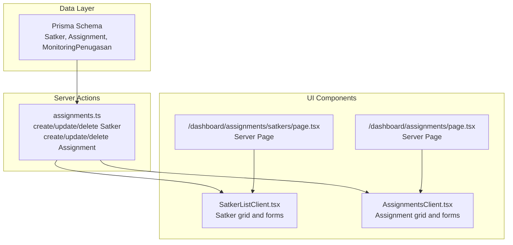
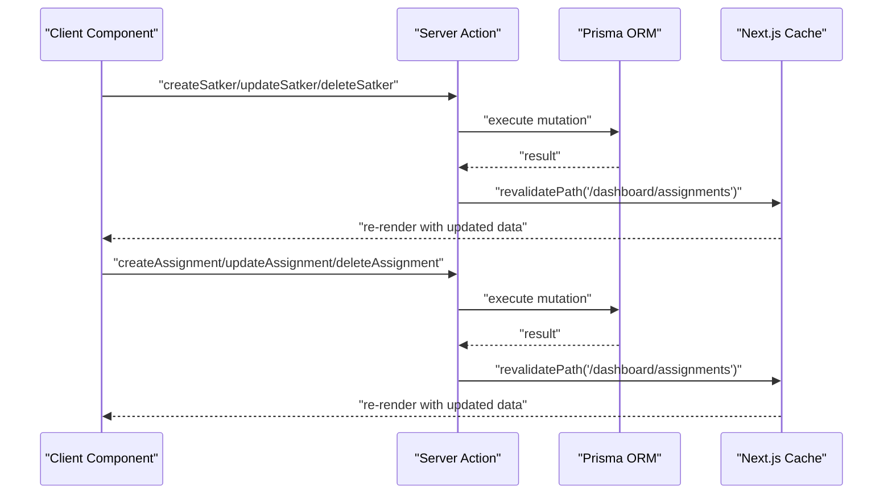
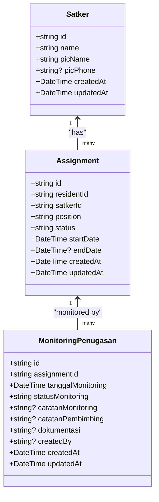
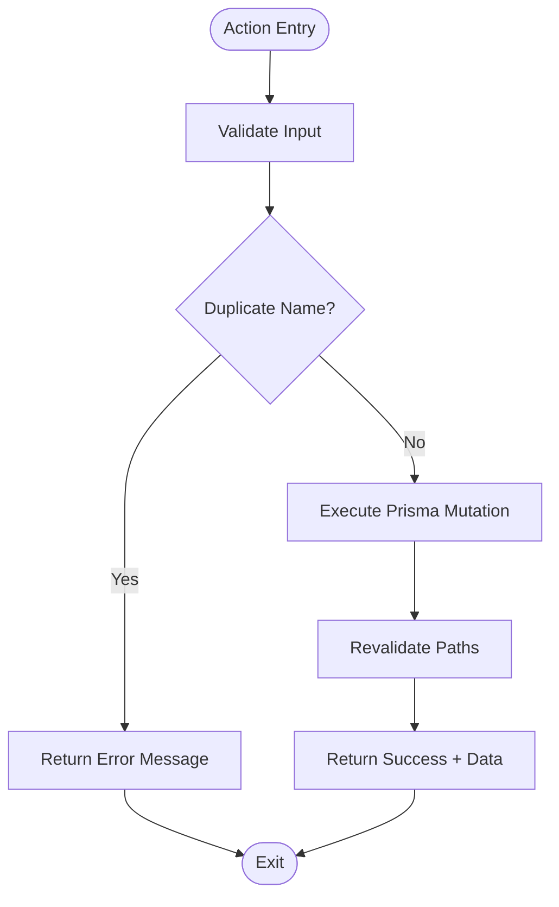
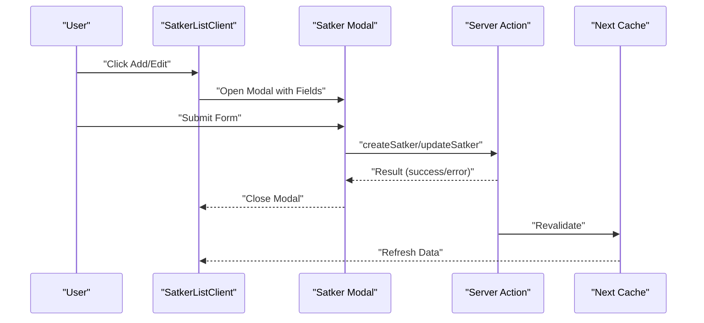
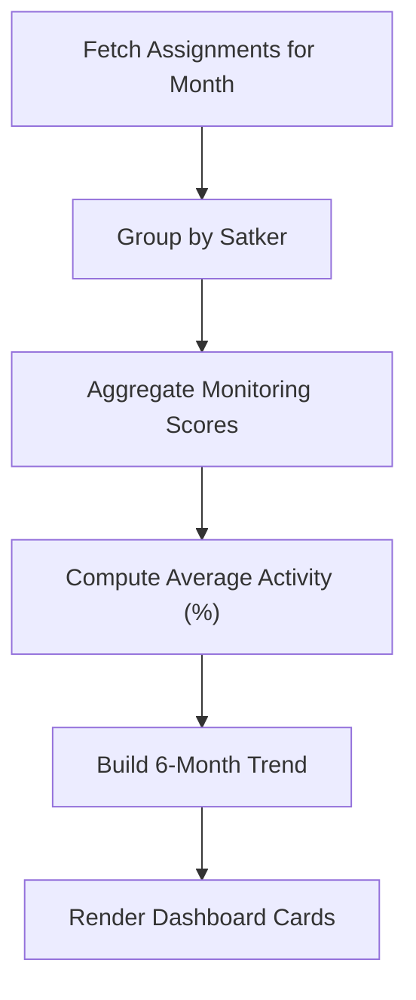
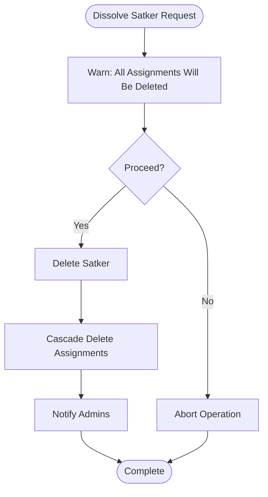
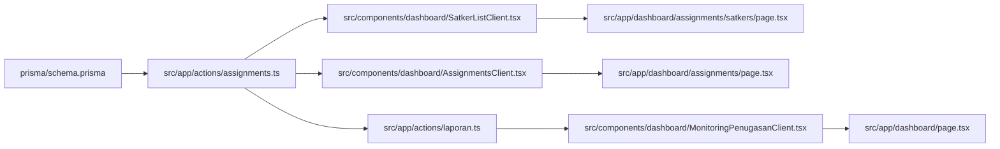

# Satker (Department) Management

<cite>
**Referenced Files in This Document**
- [schema.prisma](file://prisma/schema.prisma)
- [assignments.ts](file://src/app/actions/assignments.ts)
- [AssignmentsClient.tsx](file://src/components/dashboard/AssignmentsClient.tsx)
- [SatkerListClient.tsx](file://src/components/dashboard/SatkerListClient.tsx)
- [page.tsx](file://src/app/dashboard/assignments/satkers/page.tsx)
- [page.tsx](file://src/app/dashboard/assignments/page.tsx)
- [laporan.ts](file://src/app/actions/laporan.ts)
- [MonitoringPenugasanClient.tsx](file://src/components/dashboard/MonitoringPenugasanClient.tsx)
- [page.tsx](file://src/app/dashboard/page.tsx)
</cite>

## Table of Contents
1. [Introduction](#introduction)
2. [Project Structure](#project-structure)
3. [Core Components](#core-components)
4. [Architecture Overview](#architecture-overview)
5. [Detailed Component Analysis](#detailed-component-analysis)
6. [Dependency Analysis](#dependency-analysis)
7. [Performance Considerations](#performance-considerations)
8. [Troubleshooting Guide](#troubleshooting-guide)
9. [Conclusion](#conclusion)

## Introduction
This document describes the Satuan Kerja (department/unit) management system within the ApsAsrama application. It covers the organizational structure of academic departments, administrative units, and extracurricular organizations managed under the "Satker" concept. The system enables creation and configuration of new departments, assignment of Person In Charge (PIC), contact information management, hierarchical relationships, operational boundaries, capacity management, resource allocation, performance metrics, and procedures for transfers, mergers, and dissolution.

## Project Structure
The Satker management spans three primary areas:
- Data model definition in the Prisma schema
- Server actions for CRUD operations and business logic
- Client components for UI interaction and user workflows

**Diagram sources**
- [schema.prisma](file://prisma/schema.prisma)
- [assignments.ts](file://src/app/actions/assignments.ts)
- [SatkerListClient.tsx](file://src/components/dashboard/SatkerListClient.tsx)
- [AssignmentsClient.tsx](file://src/components/dashboard/AssignmentsClient.tsx)
- [page.tsx](file://src/app/dashboard/assignments/satkers/page.tsx)
- [page.tsx](file://src/app/dashboard/assignments/page.tsx)

**Section sources**
- [schema.prisma](file://prisma/schema.prisma)
- [assignments.ts](file://src/app/actions/assignments.ts)
- [SatkerListClient.tsx](file://src/components/dashboard/SatkerListClient.tsx)
- [AssignmentsClient.tsx](file://src/components/dashboard/AssignmentsClient.tsx)
- [page.tsx](file://src/app/dashboard/assignments/satkers/page.tsx)
- [page.tsx](file://src/app/dashboard/assignments/page.tsx)

## Core Components
- Satker entity: Represents departments/units with a unique name, PIC name, and optional PIC phone. It links to users and assignments.
- Assignment entity: Links residents to Satkers with position, status, and date range. Supports ACTIVE and COMPLETED statuses.
- MonitoringPenugasan: Tracks monthly activity and performance metrics for assignments.
- Server actions: Provide secure CRUD operations with validation and cache invalidation.
- Client components: Offer interactive forms and grids for managing Satkers and Assignments.

Key capabilities:
- Create/edit/delete Satkers with PIC and contact info
- Assign residents to Satkers with positions and status
- Track active vs completed assignments
- Compute performance metrics via monitoring data
- Revalidation ensures UI consistency after mutations

**Section sources**
- [schema.prisma](file://prisma/schema.prisma)
- [assignments.ts](file://src/app/actions/assignments.ts)
- [AssignmentsClient.tsx](file://src/components/dashboard/AssignmentsClient.tsx)
- [SatkerListClient.tsx](file://src/components/dashboard/SatkerListClient.tsx)

## Architecture Overview
The system follows a Next.js Server Actions pattern:
- Server-side data access via Prisma ORM
- Client components trigger mutations through typed server actions
- Cache revalidation keeps UI synchronized
- UI components render lists and forms for Satker and Assignment management

**Diagram sources**
- [assignments.ts](file://src/app/actions/assignments.ts)
- [page.tsx](file://src/app/dashboard/assignments/page.tsx)
- [page.tsx](file://src/app/dashboard/assignments/satkers/page.tsx)

## Detailed Component Analysis

### Satker Entity and Management
The Satker model defines:
- Unique name constraint
- PIC name and optional phone
- Relations to users, assignments, and monthly reports
- Automatic timestamps

**Diagram sources**
- [schema.prisma](file://prisma/schema.prisma)

Operational highlights:
- Name uniqueness enforced at database level
- PIC contact info stored for visibility and communication
- Assignments include position and status for role clarity
- Monthly reporting support via LaporanBulananSatker relation

**Section sources**
- [schema.prisma](file://prisma/schema.prisma)

### Server Actions: Satker and Assignment Management
Server actions encapsulate:
- Validation (e.g., unique name checks)
- Upsert/create/update/delete operations
- Cache revalidation for affected routes
- Error handling with user-friendly messages

**Diagram sources**
- [assignments.ts](file://src/app/actions/assignments.ts)

Key behaviors:
- Creating/updating Satkers validates uniqueness
- Deleting Satkers triggers cascade deletion of related assignments
- Creating/updating Assignments prevents duplicate active enrollments for the same resident-Satker pair
- Date serialization/deserialization ensures safe client-server transfer

**Section sources**
- [assignments.ts](file://src/app/actions/assignments.ts)
- [page.tsx](file://src/app/dashboard/assignments/page.tsx)

### Client Components: UI Workflows
Client components provide:
- Satker grid with search, stats, and edit/delete actions
- Assignment grid with filtering, status indicators, and detailed forms
- Dual-tab interface switching between Assignments and Satkers
- Local state updates for immediate UI feedback

**Diagram sources**
- [SatkerListClient.tsx](file://src/components/dashboard/SatkerListClient.tsx)
- [AssignmentsClient.tsx](file://src/components/dashboard/AssignmentsClient.tsx)
- [assignments.ts](file://src/app/actions/assignments.ts)

**Section sources**
- [SatkerListClient.tsx](file://src/components/dashboard/SatkerListClient.tsx)
- [AssignmentsClient.tsx](file://src/components/dashboard/AssignmentsClient.tsx)
- [page.tsx](file://src/app/dashboard/assignments/satkers/page.tsx)
- [page.tsx](file://src/app/dashboard/assignments/page.tsx)

### Department Hierarchies, Reporting Relationships, and Operational Boundaries
- Hierarchies: Positions within Satkers (e.g., Ketua, Sekretaris, Anggota) are represented by the position field in Assignment. There is no explicit parent-child relationship modeled in the schema; hierarchy is conceptualized via positions and roles.
- Reporting relationships: MonitoringPenugasan captures monthly performance, enabling supervisors to track progress and compliance. The dashboard aggregates these metrics per Satker.
- Operational boundaries: Satker serves as the operational boundary for organizing residents into structured units. Assignments define who belongs to which Satker during specific periods.

**Section sources**
- [schema.prisma](file://prisma/schema.prisma)
- [AssignmentsClient.tsx](file://src/components/dashboard/AssignmentsClient.tsx)
- [laporan.ts](file://src/app/actions/laporan.ts)
- [MonitoringPenugasanClient.tsx](file://src/components/dashboard/MonitoringPenugasanClient.tsx)
- [page.tsx](file://src/app/dashboard/page.tsx)

### Department Capacity Management, Resource Allocation, and Performance Metrics
- Capacity management: While Satker itself does not enforce capacity limits, the system supports resource allocation via Assignments. The number of active assignments per Satker is tracked and displayed in the UI.
- Resource allocation: Assignments allocate residents to Satkers with defined roles and timeframes.
- Performance metrics: Monthly monitoring data is aggregated to compute activity scores and trends. The dashboard computes counts for different activity levels (e.g., Sangat Aktif, Aktif, Cukup Aktif, Kurang Aktif) and presents them per Satker.

**Diagram sources**
- [laporan.ts](file://src/app/actions/laporan.ts)
- [MonitoringPenugasanClient.tsx](file://src/components/dashboard/MonitoringPenugasanClient.tsx)
- [page.tsx](file://src/app/dashboard/page.tsx)

**Section sources**
- [laporan.ts](file://src/app/actions/laporan.ts)
- [MonitoringPenugasanClient.tsx](file://src/components/dashboard/MonitoringPenugasanClient.tsx)
- [page.tsx](file://src/app/dashboard/page.tsx)

### Department Transfers, Mergers, and Dissolution Procedures
- Department transfers: The system does not provide a dedicated "transfer resident between Satkers" operation. To move a resident from one Satker to another, update their Assignment status to COMPLETED for the current Satker and create a new Assignment for the target Satker. This preserves historical records while reflecting current assignments.
- Department mergers: There is no built-in merge operation for Satkers. If consolidation is needed, administrators can:
  - Update existing Assignments to reflect the new organizational structure
  - Archive or delete redundant Satkers after ensuring all Assignments are reassigned
  - Use monitoring data to assess impact on performance metrics
- Department dissolution: Satkers can be deleted, which cascades to remove all related Assignments. Before deletion, ensure all Assignments are migrated to other Satkers to avoid orphaned records.

**Diagram sources**
- [assignments.ts](file://src/app/actions/assignments.ts)

**Section sources**
- [assignments.ts](file://src/app/actions/assignments.ts)

## Dependency Analysis
The following diagram shows key dependencies among components:

**Diagram sources**
- [schema.prisma](file://prisma/schema.prisma)
- [assignments.ts](file://src/app/actions/assignments.ts)
- [SatkerListClient.tsx](file://src/components/dashboard/SatkerListClient.tsx)
- [AssignmentsClient.tsx](file://src/components/dashboard/AssignmentsClient.tsx)
- [page.tsx](file://src/app/dashboard/assignments/satkers/page.tsx)
- [page.tsx](file://src/app/dashboard/assignments/page.tsx)
- [laporan.ts](file://src/app/actions/laporan.ts)
- [MonitoringPenugasanClient.tsx](file://src/components/dashboard/MonitoringPenugasanClient.tsx)
- [page.tsx](file://src/app/dashboard/page.tsx)

**Section sources**
- [schema.prisma](file://prisma/schema.prisma)
- [assignments.ts](file://src/app/actions/assignments.ts)
- [SatkerListClient.tsx](file://src/components/dashboard/SatkerListClient.tsx)
- [AssignmentsClient.tsx](file://src/components/dashboard/AssignmentsClient.tsx)
- [page.tsx](file://src/app/dashboard/assignments/satkers/page.tsx)
- [page.tsx](file://src/app/dashboard/assignments/page.tsx)
- [laporan.ts](file://src/app/actions/laporan.ts)
- [MonitoringPenugasanClient.tsx](file://src/components/dashboard/MonitoringPenugasanClient.tsx)
- [page.tsx](file://src/app/dashboard/page.tsx)

## Performance Considerations
- Database indexing: Unique constraints on Satker.name and composite unique on Assignment.residentId_satkerId optimize lookups and prevent duplicates.
- Pagination and filtering: Client components implement search and filtering to reduce rendering overhead for large datasets.
- Cache revalidation: After mutations, revalidatePath ensures fresh data without full page reloads.
- Monitoring aggregation: Batch queries for monthly monitoring data minimize repeated database calls for dashboard computations.

## Troubleshooting Guide
Common issues and resolutions:
- Duplicate Satker name: Creation/update returns an error when the name already exists. Choose a unique name.
- Active enrollment conflict: Cannot create a new active Assignment for a resident already enrolled in the same Satker. Mark the previous Assignment as COMPLETED or adjust dates.
- Deletion warnings: Deleting a Satker removes all related Assignments. Confirm the impact before proceeding.
- UI not updating: Verify cache revalidation occurs after mutations. Force-refresh if necessary.

**Section sources**
- [assignments.ts](file://src/app/actions/assignments.ts)
- [SatkerListClient.tsx](file://src/components/dashboard/SatkerListClient.tsx)
- [AssignmentsClient.tsx](file://src/components/dashboard/AssignmentsClient.tsx)

## Conclusion
The Satker management system provides a robust foundation for organizing academic departments, administrative units, and extracurricular organizations within the asrama. It supports PIC assignment, contact management, hierarchical roles via positions, operational boundaries through Assignments, and performance tracking via monthly monitoring. While direct transfer and merger operations are not built-in, the system accommodates these scenarios through Assignment updates and careful planning. The architecture balances data integrity, user experience, and maintainability through Prisma, Server Actions, and reactive UI components.