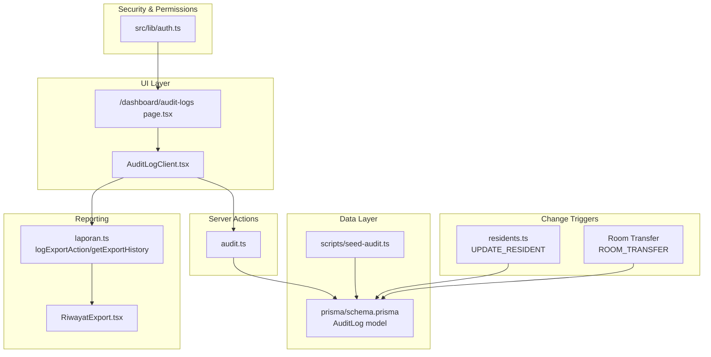
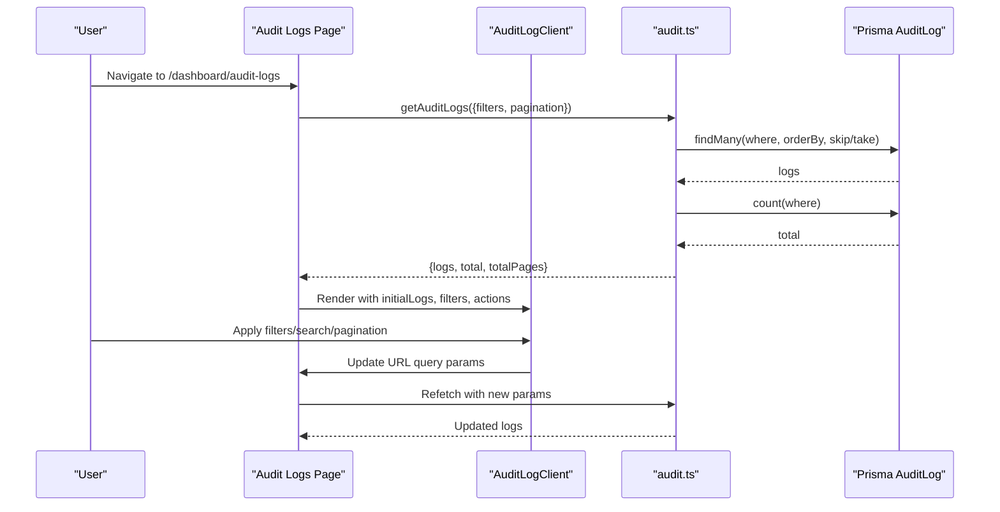
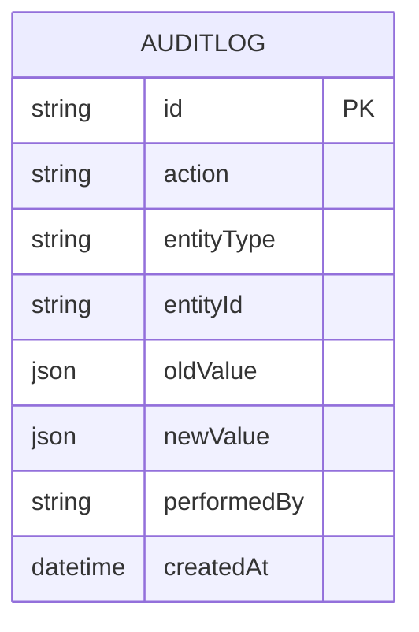
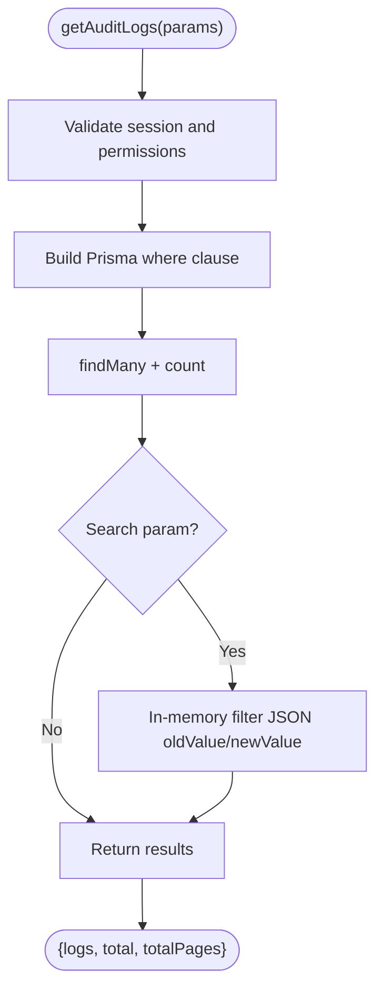
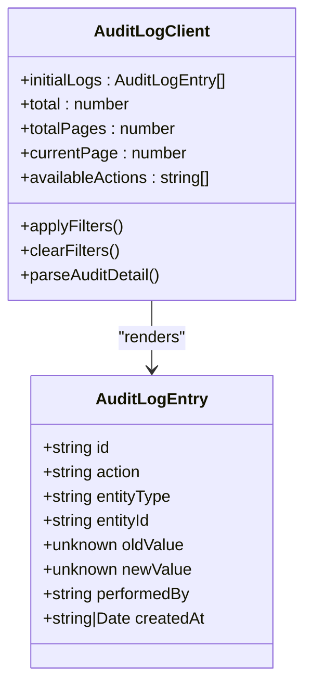
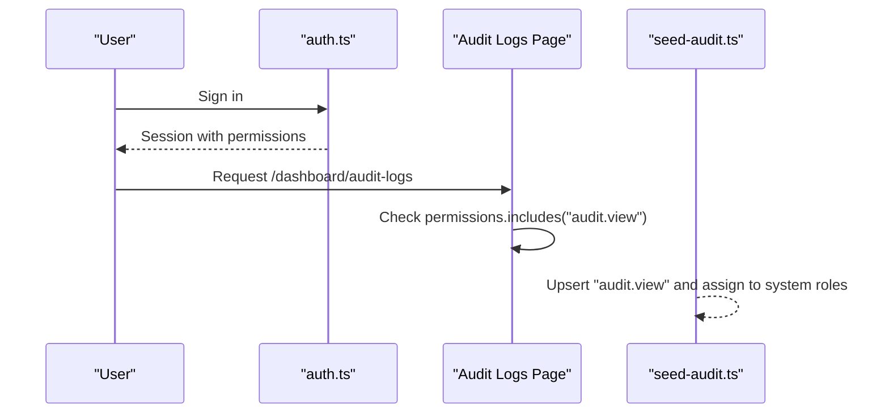
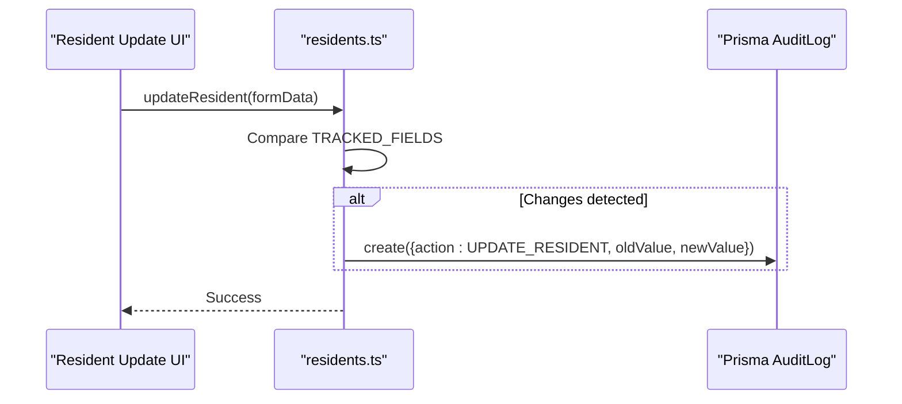
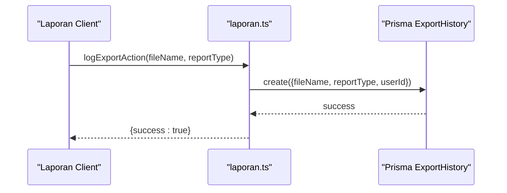
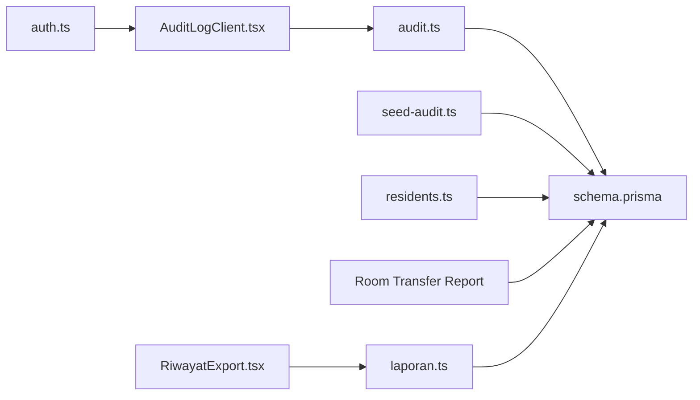

# Audit & Compliance System

<cite>
**Referenced Files in This Document**
- [audit.ts](file://src/app/actions/audit.ts)
- [AuditLogClient.tsx](file://src/components/dashboard/audit-log/AuditLogClient.tsx)
- [page.tsx](file://src/app/dashboard/audit-logs/page.tsx)
- [schema.prisma](file://prisma/schema.prisma)
- [seed-audit.ts](file://scripts/seed-audit.ts)
- [auth.ts](file://src/lib/auth.ts)
- [residents.ts](file://src/app/actions/residents.ts)
- [ROOM_TRANSFER_AND_PRINT_FEATURE_REPORT.md](file://ROOM_TRANSFER_AND_PRINT_FEATURE_REPORT.md)
- [AUDIT_LOG_INVESTIGATION_REPORT.md](file://AUDIT_LOG_INVESTIGATION_REPORT.md)
- [laporan.ts](file://src/app/actions/laporan.ts)
- [RiwayatExport.tsx](file://src/components/dashboard/laporan/RiwayatExport.tsx)
</cite>

## Table of Contents
1. [Introduction](#introduction)
2. [Project Structure](#project-structure)
3. [Core Components](#core-components)
4. [Architecture Overview](#architecture-overview)
5. [Detailed Component Analysis](#detailed-component-analysis)
6. [Dependency Analysis](#dependency-analysis)
7. [Performance Considerations](#performance-considerations)
8. [Troubleshooting Guide](#troubleshooting-guide)
9. [Conclusion](#conclusion)
10. [Appendices](#appendices)

## Introduction
This document describes the comprehensive audit and compliance system implemented in the application. It covers change tracking, audit log management, compliance reporting, audit trail functionality, data integrity monitoring, regulatory compliance features, investigation tools, anomaly detection, automated compliance checking, export functionality for regulatory submissions, retention policies, and security measures for sensitive data handling.

## Project Structure
The audit and compliance system spans server actions, UI components, database schema, and supporting scripts:

- Server actions manage audit log retrieval and filtering
- Client components render audit trails with advanced filtering and pagination
- Prisma schema defines the AuditLog model and related indices
- Seed script ensures proper permissions for audit viewing
- Authentication integrates permissions into session tokens
- Room transfer and resident updates generate audit entries
- Reporting actions and UI support export logging and history

**Diagram sources**
- [page.tsx:14-49](file://src/app/dashboard/audit-logs/page.tsx#L14-L49)
- [AuditLogClient.tsx:105-410](file://src/components/dashboard/audit-log/AuditLogClient.tsx#L105-L410)
- [audit.ts:8-117](file://src/app/actions/audit.ts#L8-L117)
- [schema.prisma:455-466](file://prisma/schema.prisma#L455-L466)
- [seed-audit.ts:11-36](file://scripts/seed-audit.ts#L11-L36)
- [auth.ts:53-80](file://src/lib/auth.ts#L53-L80)
- [residents.ts:380-442](file://src/app/actions/residents.ts#L380-L442)
- [ROOM_TRANSFER_AND_PRINT_FEATURE_REPORT.md:125-141](file://ROOM_TRANSFER_AND_PRINT_FEATURE_REPORT.md#L125-L141)
- [laporan.ts:197-226](file://src/app/actions/laporan.ts#L197-L226)
- [RiwayatExport.tsx:1-72](file://src/components/dashboard/laporan/RiwayatExport.tsx#L1-L72)

**Section sources**
- [page.tsx:14-49](file://src/app/dashboard/audit-logs/page.tsx#L14-L49)
- [AuditLogClient.tsx:105-410](file://src/components/dashboard/audit-log/AuditLogClient.tsx#L105-L410)
- [audit.ts:8-117](file://src/app/actions/audit.ts#L8-L117)
- [schema.prisma:455-466](file://prisma/schema.prisma#L455-L466)
- [seed-audit.ts:11-36](file://scripts/seed-audit.ts#L11-L36)
- [auth.ts:53-80](file://src/lib/auth.ts#L53-L80)
- [residents.ts:380-442](file://src/app/actions/residents.ts#L380-L442)
- [ROOM_TRANSFER_AND_PRINT_FEATURE_REPORT.md:125-141](file://ROOM_TRANSFER_AND_PRINT_FEATURE_REPORT.md#L125-L141)
- [laporan.ts:197-226](file://src/app/actions/laporan.ts#L197-L226)
- [RiwayatExport.tsx:1-72](file://src/components/dashboard/laporan/RiwayatExport.tsx#L1-L72)

## Core Components
- Audit log server actions: retrieve paginated, filterable audit logs and available actions
- Audit log client component: advanced filtering, search, pagination, and per-field diff display
- Prisma AuditLog model: structured JSON snapshots and entity indexing
- Permission seeding: ensure audit.view exists and is assigned to system roles
- Authentication integration: inject permissions into JWT/session
- Change triggers: resident updates and room transfers emit audit entries
- Export logging and history: track report exports with user attribution

Key implementation references:
- [audit.ts:8-117](file://src/app/actions/audit.ts#L8-L117)
- [AuditLogClient.tsx:105-410](file://src/components/dashboard/audit-log/AuditLogClient.tsx#L105-L410)
- [schema.prisma:455-466](file://prisma/schema.prisma#L455-L466)
- [seed-audit.ts:11-36](file://scripts/seed-audit.ts#L11-L36)
- [auth.ts:53-80](file://src/lib/auth.ts#L53-L80)
- [residents.ts:380-442](file://src/app/actions/residents.ts#L380-L442)
- [ROOM_TRANSFER_AND_PRINT_FEATURE_REPORT.md:125-141](file://ROOM_TRANSFER_AND_PRINT_FEATURE_REPORT.md#L125-L141)
- [laporan.ts:197-226](file://src/app/actions/laporan.ts#L197-L226)
- [RiwayatExport.tsx:1-72](file://src/components/dashboard/laporan/RiwayatExport.tsx#L1-L72)

**Section sources**
- [audit.ts:8-117](file://src/app/actions/audit.ts#L8-L117)
- [AuditLogClient.tsx:105-410](file://src/components/dashboard/audit-log/AuditLogClient.tsx#L105-L410)
- [schema.prisma:455-466](file://prisma/schema.prisma#L455-L466)
- [seed-audit.ts:11-36](file://scripts/seed-audit.ts#L11-L36)
- [auth.ts:53-80](file://src/lib/auth.ts#L53-L80)
- [residents.ts:380-442](file://src/app/actions/residents.ts#L380-L442)
- [ROOM_TRANSFER_AND_PRINT_FEATURE_REPORT.md:125-141](file://ROOM_TRANSFER_AND_PRINT_FEATURE_REPORT.md#L125-L141)
- [laporan.ts:197-226](file://src/app/actions/laporan.ts#L197-L226)
- [RiwayatExport.tsx:1-72](file://src/components/dashboard/laporan/RiwayatExport.tsx#L1-L72)

## Architecture Overview
The audit system follows a layered architecture:
- UI renders filters and displays audit entries
- Server actions enforce permissions and query the database
- Prisma models define audit storage and indices
- Seed script ensures baseline permissions
- Authentication supplies permission context
- Business logic (resident updates, room transfers) emits audit events

**Diagram sources**
- [page.tsx:14-49](file://src/app/dashboard/audit-logs/page.tsx#L14-L49)
- [AuditLogClient.tsx:139-158](file://src/components/dashboard/audit-log/AuditLogClient.tsx#L139-L158)
- [audit.ts:27-98](file://src/app/actions/audit.ts#L27-L98)

**Section sources**
- [page.tsx:14-49](file://src/app/dashboard/audit-logs/page.tsx#L14-L49)
- [AuditLogClient.tsx:139-158](file://src/components/dashboard/audit-log/AuditLogClient.tsx#L139-L158)
- [audit.ts:27-98](file://src/app/actions/audit.ts#L27-L98)

## Detailed Component Analysis

### Audit Log Model and Indices
The AuditLog model stores structured JSON snapshots of changes and supports efficient querying by entity type and ID.

- Indexes: composite index on (entityType, entityId) improves per-entity queries
- JSON fields: oldValue/newValue capture before/after snapshots
- Permissions: access controlled via audit.view permission

**Diagram sources**
- [schema.prisma:455-466](file://prisma/schema.prisma#L455-L466)

**Section sources**
- [schema.prisma:455-466](file://prisma/schema.prisma#L455-L466)

### Server Actions: Audit Retrieval and Filtering
The server actions provide:
- Paginated retrieval with configurable page size
- Multi-field filtering (action, performedBy, date range)
- Full-text search across JSON snapshots and identifiers
- Distinct action enumeration for UI dropdowns
- Permission enforcement using NextAuth session

**Diagram sources**
- [audit.ts:27-98](file://src/app/actions/audit.ts#L27-L98)

**Section sources**
- [audit.ts:27-98](file://src/app/actions/audit.ts#L27-L98)

### Client Component: Audit Log Viewer
The client component offers:
- Advanced filters: action dropdown, user/email search, date range
- Real-time URL synchronization for deep linking
- Pagination controls
- Expandable per-field diff view for UPDATE entries
- Color-coded action badges and entity labels

**Diagram sources**
- [AuditLogClient.tsx:105-410](file://src/components/dashboard/audit-log/AuditLogClient.tsx#L105-L410)

**Section sources**
- [AuditLogClient.tsx:105-410](file://src/components/dashboard/audit-log/AuditLogClient.tsx#L105-L410)

### Permission Management and Authentication
- Permissions are loaded into JWT/session during authorization
- The audit logs page checks for audit.view before rendering
- Seed script ensures audit.view exists and is assigned to system roles

**Diagram sources**
- [auth.ts:53-80](file://src/lib/auth.ts#L53-L80)
- [page.tsx:19-23](file://src/app/dashboard/audit-logs/page.tsx#L19-L23)
- [seed-audit.ts:11-36](file://scripts/seed-audit.ts#L11-L36)

**Section sources**
- [auth.ts:53-80](file://src/lib/auth.ts#L53-L80)
- [page.tsx:19-23](file://src/app/dashboard/audit-logs/page.tsx#L19-L23)
- [seed-audit.ts:11-36](file://scripts/seed-audit.ts#L11-L36)

### Change Triggers: Resident Updates and Room Transfers
- Resident updates: only tracked fields are compared; changedFields are recorded
- Room transfers: emit ROOM_TRANSFER audit entries with before/after room details

**Diagram sources**
- [residents.ts:380-442](file://src/app/actions/residents.ts#L380-L442)

**Section sources**
- [residents.ts:380-442](file://src/app/actions/residents.ts#L380-L442)
- [ROOM_TRANSFER_AND_PRINT_FEATURE_REPORT.md:125-141](file://ROOM_TRANSFER_AND_PRINT_FEATURE_REPORT.md#L125-L141)

### Export Logging and History
- Export actions are logged with filename, report type, and user
- Export history UI lists recent exports with file type icons and deletion capability

**Diagram sources**
- [laporan.ts:197-226](file://src/app/actions/laporan.ts#L197-L226)
- [RiwayatExport.tsx:1-72](file://src/components/dashboard/laporan/RiwayatExport.tsx#L1-L72)

**Section sources**
- [laporan.ts:197-226](file://src/app/actions/laporan.ts#L197-L226)
- [RiwayatExport.tsx:1-72](file://src/components/dashboard/laporan/RiwayatExport.tsx#L1-L72)

## Dependency Analysis
The audit system exhibits low coupling and high cohesion:
- UI depends on server actions for data
- Server actions depend on Prisma for persistence
- Authentication supplies permission context
- Seed script initializes baseline permissions
- Business logic emits audit events

**Diagram sources**
- [AuditLogClient.tsx:105-410](file://src/components/dashboard/audit-log/AuditLogClient.tsx#L105-L410)
- [audit.ts:8-117](file://src/app/actions/audit.ts#L8-L117)
- [schema.prisma:455-466](file://prisma/schema.prisma#L455-L466)
- [auth.ts:53-80](file://src/lib/auth.ts#L53-L80)
- [seed-audit.ts:11-36](file://scripts/seed-audit.ts#L11-L36)
- [residents.ts:380-442](file://src/app/actions/residents.ts#L380-L442)
- [ROOM_TRANSFER_AND_PRINT_FEATURE_REPORT.md:125-141](file://ROOM_TRANSFER_AND_PRINT_FEATURE_REPORT.md#L125-L141)
- [laporan.ts:197-226](file://src/app/actions/laporan.ts#L197-L226)
- [RiwayatExport.tsx:1-72](file://src/components/dashboard/laporan/RiwayatExport.tsx#L1-L72)

**Section sources**
- [AuditLogClient.tsx:105-410](file://src/components/dashboard/audit-log/AuditLogClient.tsx#L105-L410)
- [audit.ts:8-117](file://src/app/actions/audit.ts#L8-L117)
- [schema.prisma:455-466](file://prisma/schema.prisma#L455-L466)
- [auth.ts:53-80](file://src/lib/auth.ts#L53-L80)
- [seed-audit.ts:11-36](file://scripts/seed-audit.ts#L11-L36)
- [residents.ts:380-442](file://src/app/actions/residents.ts#L380-L442)
- [ROOM_TRANSFER_AND_PRINT_FEATURE_REPORT.md:125-141](file://ROOM_TRANSFER_AND_PRINT_FEATURE_REPORT.md#L125-L141)
- [laporan.ts:197-226](file://src/app/actions/laporan.ts#L197-L226)
- [RiwayatExport.tsx:1-72](file://src/components/dashboard/laporan/RiwayatExport.tsx#L1-L72)

## Performance Considerations
- Pagination: server-side skip/take reduces payload size
- Indexing: composite index on (entityType, entityId) accelerates per-entity queries
- In-memory search: limited to current page to avoid heavy JSON scanning
- Efficient filtering: Prisma where clauses minimize database work
- JSON normalization: dates serialized consistently for comparison

Recommendations:
- Add database-level JSON search indexes if search volume grows
- Consider partitioning or archiving older audit logs for long-term retention
- Monitor query latency and adjust page sizes based on dataset growth

[No sources needed since this section provides general guidance]

## Troubleshooting Guide
Common issues and resolutions:
- Missing audit.view permission: seed script must be executed to create and assign the permission
- No audit entries visible: verify that tracked changes exist and that the UI is using the correct action/entity filters
- Slow filtering: reduce search scope or switch to date/action filters
- Unauthorized access: ensure the user has audit.view permission and is properly authenticated

**Section sources**
- [seed-audit.ts:11-36](file://scripts/seed-audit.ts#L11-L36)
- [audit.ts:38-41](file://src/app/actions/audit.ts#L38-L41)
- [page.tsx:19-23](file://src/app/dashboard/audit-logs/page.tsx#L19-L23)

## Conclusion
The audit and compliance system provides robust change tracking, comprehensive audit log management, and secure access control. It enables effective investigation, compliance reporting, and export logging while maintaining data integrity and performance. The modular design allows for future enhancements such as anomaly detection hooks and extended retention policies.

[No sources needed since this section summarizes without analyzing specific files]

## Appendices

### Audit Trail Functionality
- Tracks CREATE, UPDATE, DELETE, IMPORT actions
- Records oldValue/newValue snapshots as JSON
- Supports per-entity and global filtering
- Provides per-field diff visualization for updates

**Section sources**
- [audit.ts:8-117](file://src/app/actions/audit.ts#L8-L117)
- [AuditLogClient.tsx:95-103](file://src/components/dashboard/audit-log/AuditLogClient.tsx#L95-L103)
- [schema.prisma:455-466](file://prisma/schema.prisma#L455-L466)

### Data Integrity Monitoring
- Only tracked fields are compared during updates
- Dates normalized for accurate string comparisons
- Room transfer events emit audit entries with before/after details

**Section sources**
- [residents.ts:380-442](file://src/app/actions/residents.ts#L380-L442)
- [ROOM_TRANSFER_AND_PRINT_FEATURE_REPORT.md:125-141](file://ROOM_TRANSFER_AND_PRINT_FEATURE_REPORT.md#L125-L141)

### Regulatory Compliance Features
- Permission-based access control (audit.view)
- Export logging with user attribution
- Historical audit logs for evidence generation
- Clear separation between audit logs and room transfer history

**Section sources**
- [auth.ts:53-80](file://src/lib/auth.ts#L53-L80)
- [page.tsx:19-23](file://src/app/dashboard/audit-logs/page.tsx#L19-L23)
- [laporan.ts:197-226](file://src/app/actions/laporan.ts#L197-L226)
- [AUDIT_LOG_INVESTIGATION_REPORT.md:30-39](file://AUDIT_LOG_INVESTIGATION_REPORT.md#L30-L39)

### Investigation Tools
- Advanced filters: action, user/email, date range
- Full-text search across JSON snapshots
- Pagination for large datasets
- Expandable per-field diff for updates

**Section sources**
- [AuditLogClient.tsx:139-158](file://src/components/dashboard/audit-log/AuditLogClient.tsx#L139-L158)
- [audit.ts:74-84](file://src/app/actions/audit.ts#L74-L84)

### Anomaly Detection and Automated Compliance Checking
- Not implemented in the current codebase
- Recommended extensions:
  - Add rule engine for compliance checks
  - Implement scheduled scans for suspicious patterns
  - Integrate with external SIEM for centralized monitoring

[No sources needed since this section provides general guidance]

### Export Functionality for Regulatory Submissions
- Export history tracking with user attribution
- Support for Excel and PDF exports
- File type icons and deletion capability

**Section sources**
- [laporan.ts:197-226](file://src/app/actions/laporan.ts#L197-L226)
- [RiwayatExport.tsx:1-72](file://src/components/dashboard/laporan/RiwayatExport.tsx#L1-L72)

### Retention Policies and Security Measures
- Retention policy not implemented in the current codebase
- Security measures:
  - JWT-based session with permissions
  - Permission checks before accessing audit logs
  - JSON snapshots stored securely in database

**Section sources**
- [auth.ts:53-80](file://src/lib/auth.ts#L53-L80)
- [page.tsx:19-23](file://src/app/dashboard/audit-logs/page.tsx#L19-L23)
- [schema.prisma:455-466](file://prisma/schema.prisma#L455-L466)