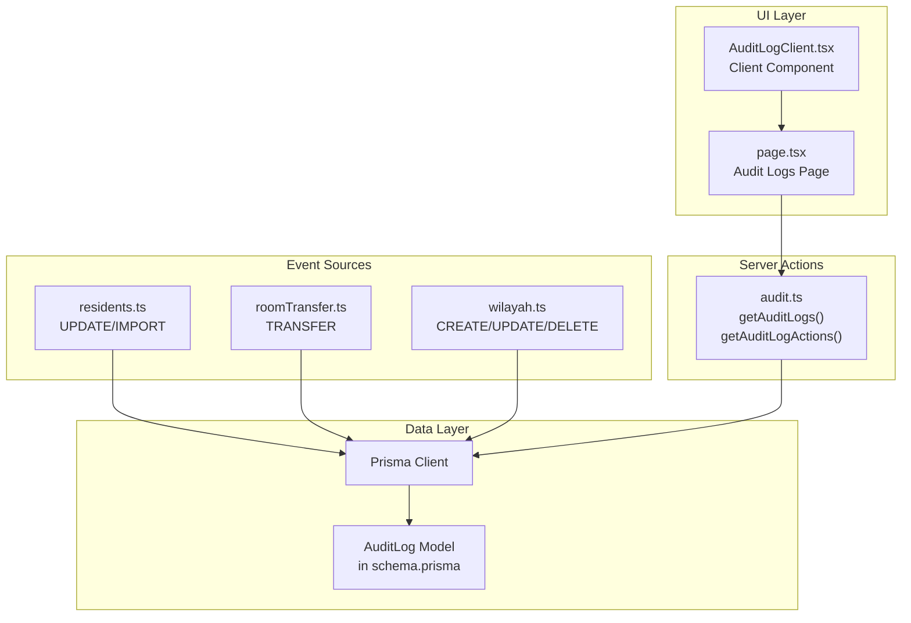
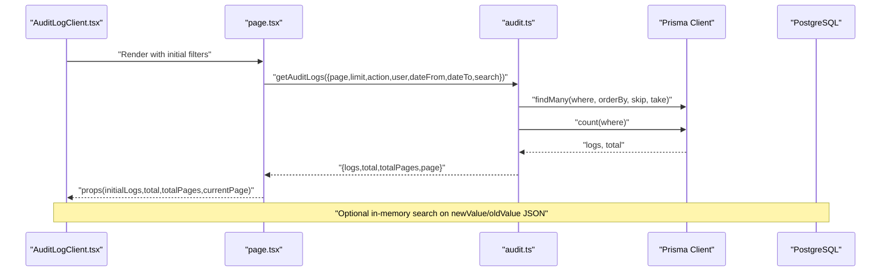
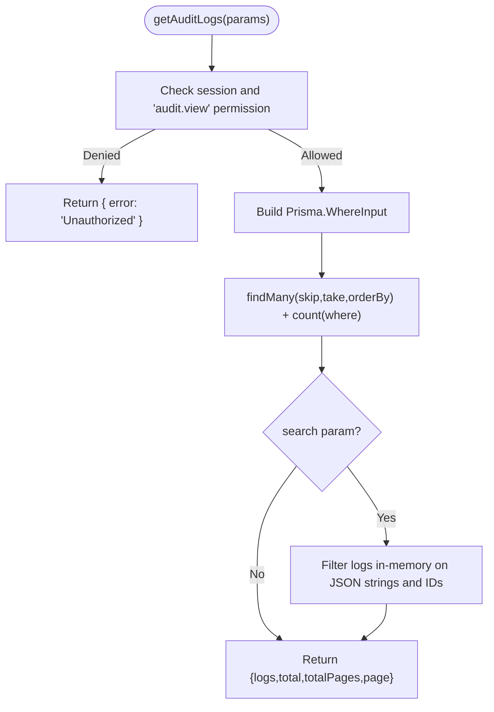
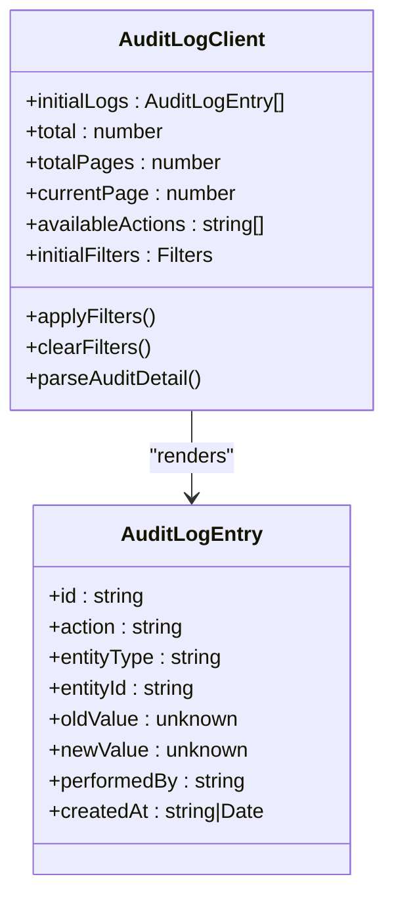
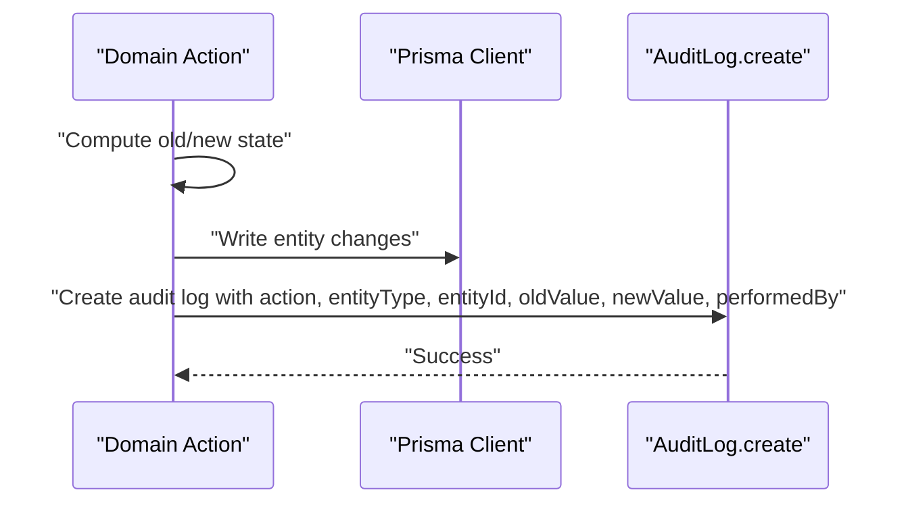
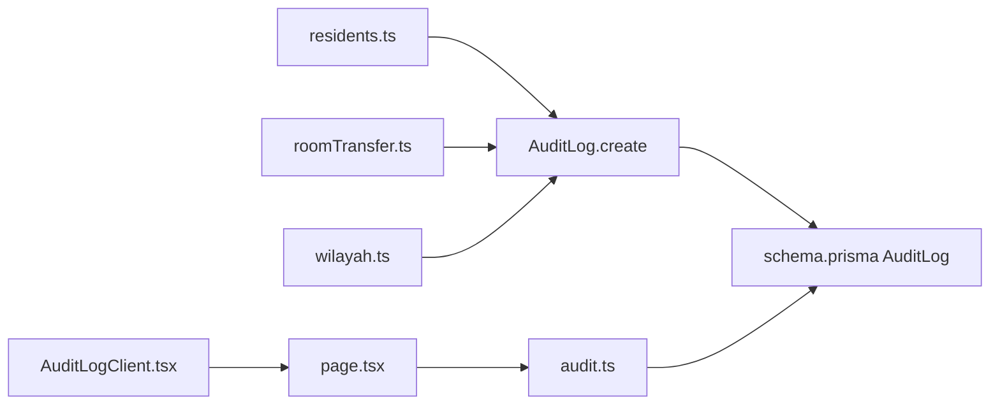

# Audit Logging

<cite>
**Referenced Files in This Document**
- [audit.ts](file://src/app/actions/audit.ts)
- [AuditLogClient.tsx](file://src/components/dashboard/audit-log/AuditLogClient.tsx)
- [page.tsx](file://src/app/dashboard/audit-logs/page.tsx)
- [schema.prisma](file://prisma/schema.prisma)
- [seed-audit.ts](file://scripts/seed-audit.ts)
- [residents.ts](file://src/app/actions/residents.ts)
- [roomTransfer.ts](file://src/app/actions/roomTransfer.ts)
- [wilayah.ts](file://src/app/actions/wilayah.ts)
- [permissions.ts](file://src/lib/permissions.ts)
</cite>

## Table of Contents
1. [Introduction](#introduction)
2. [Project Structure](#project-structure)
3. [Core Components](#core-components)
4. [Architecture Overview](#architecture-overview)
5. [Detailed Component Analysis](#detailed-component-analysis)
6. [Dependency Analysis](#dependency-analysis)
7. [Performance Considerations](#performance-considerations)
8. [Troubleshooting Guide](#troubleshooting-guide)
9. [Conclusion](#conclusion)

## Introduction
This document describes the audit logging system that tracks and displays data changes across the application. It covers how audit events are generated when entities are created, updated, deleted, or transferred, how they are stored in the database, and how administrators can view, filter, paginate, and search audit logs through the dashboard interface. It also documents the audit log structure, supported action types, and integration patterns for real-time monitoring.

## Project Structure
The audit logging system spans three main areas:
- Data model: The `AuditLog` model defines the schema for storing audit events.
- Server actions: Functions that fetch audit logs, filter them, and expose available actions.
- Client component: A dashboard page and a reusable client component that render and filter logs.

**Diagram sources**
- [audit.ts:27-98](file://src/app/actions/audit.ts#L27-L98)
- [AuditLogClient.tsx:105-126](file://src/components/dashboard/audit-log/AuditLogClient.tsx#L105-L126)
- [page.tsx:14-49](file://src/app/dashboard/audit-logs/page.tsx#L14-L49)
- [schema.prisma:455-466](file://prisma/schema.prisma#L455-L466)
- [residents.ts:400-412](file://src/app/actions/residents.ts#L400-L412)
- [roomTransfer.ts:84-94](file://src/app/actions/roomTransfer.ts#L84-L94)
- [wilayah.ts:11-25](file://src/app/actions/wilayah.ts#L11-L25)

**Section sources**
- [audit.ts:1-118](file://src/app/actions/audit.ts#L1-L118)
- [AuditLogClient.tsx:1-410](file://src/components/dashboard/audit-log/AuditLogClient.tsx#L1-L410)
- [page.tsx:1-50](file://src/app/dashboard/audit-logs/page.tsx#L1-L50)
- [schema.prisma:455-466](file://prisma/schema.prisma#L455-L466)

## Core Components
- AuditLog data model: Defines fields for action type, target entity, identifiers, serialized old/new values, actor, and timestamps.
- Server actions:
  - `getAuditLogs`: Fetches paginated logs with filters and optional in-memory search across JSON fields.
  - `getAuditLogActions`: Returns distinct action types for filtering.
  - `getEntityAuditLogs`: Fetches logs for a specific entity type and ID.
- Client component:
  - Renders logs in a responsive table with color-coded actions, human-readable labels, and expandable change details.
  - Provides advanced filters (action, performed-by, date range) and pagination controls.
  - Supports live refresh via URL parameter updates.

Key permissions:
- Access to view audit logs requires the `audit.view` permission.

**Section sources**
- [schema.prisma:455-466](file://prisma/schema.prisma#L455-L466)
- [audit.ts:27-98](file://src/app/actions/audit.ts#L27-L98)
- [AuditLogClient.tsx:105-126](file://src/components/dashboard/audit-log/AuditLogClient.tsx#L105-L126)
- [permissions.ts:4-9](file://src/lib/permissions.ts#L4-L9)
- [seed-audit.ts:14-31](file://scripts/seed-audit.ts#L14-L31)

## Architecture Overview
The audit system follows a pattern where domain actions capture state changes and persist them as structured audit events. The UI reads these events through server actions and presents them with rich filtering and pagination.

**Diagram sources**
- [AuditLogClient.tsx:139-158](file://src/components/dashboard/audit-log/AuditLogClient.tsx#L139-L158)
- [page.tsx:33-36](file://src/app/dashboard/audit-logs/page.tsx#L33-L36)
- [audit.ts:64-92](file://src/app/actions/audit.ts#L64-L92)

## Detailed Component Analysis

### AuditLog Data Model
The `AuditLog` model stores:
- `action`: Type of operation (e.g., CREATE, UPDATE, DELETE, ROOM_TRANSFER, IMPORT_RESIDENTS).
- `entityType`: Target entity category (e.g., RESIDENT, ROOM, USER, ROLE, COUNTRY, PROVINCE, REGENCY, DISTRICT, VILLAGE).
- `entityId`: Identifier of the affected record (optional for some operations).
- `oldValue` / `newValue`: JSON-encoded representation of pre/post state; for updates, includes a `changedFields` array.
- `performedBy`: Actor who triggered the event (user name or email).
- `createdAt`: Timestamp of the event.

Indexes:
- Composite index on `(entityType, entityId)` supports efficient per-entity queries.

**Section sources**
- [schema.prisma:455-466](file://prisma/schema.prisma#L455-L466)

### Server Actions: Filtering, Pagination, and Search
- Authentication and authorization:
  - Requires a valid NextAuth session and the `audit.view` permission.
- Pagination:
  - Uses `page` and `limit` parameters; defaults to page 1 and 25 items.
  - Calculates `skip = (page - 1) * limit`.
- Filtering:
  - Action type, entity type, and performed-by (case-insensitive substring).
  - Date range on `createdAt`; end-of-day normalization ensures inclusive coverage.
- Search:
  - Optional free-text search scans `newValue`, `oldValue` (JSON strings), `entityId`, and `performedBy`.
  - Implemented as an in-memory filter after database retrieval.
- Response:
  - Returns logs, total count, total pages, and current page.

**Diagram sources**
- [audit.ts:37-98](file://src/app/actions/audit.ts#L37-L98)

**Section sources**
- [audit.ts:27-98](file://src/app/actions/audit.ts#L27-L98)

### Client Component: Rendering and Interaction
- Props:
  - `initialLogs`, `total`, `totalPages`, `currentPage`, `availableActions`, `initialFilters`.
- Features:
  - Search bar and advanced filters (action, performed-by, date range).
  - Expandable change details for UPDATE entries, highlighting changed fields.
  - Pagination controls and live refresh via URL parameter updates.
  - Color-coded badges per action type and human-readable labels.

**Diagram sources**
- [AuditLogClient.tsx:105-126](file://src/components/dashboard/audit-log/AuditLogClient.tsx#L105-L126)
- [AuditLogClient.tsx:329-376](file://src/components/dashboard/audit-log/AuditLogClient.tsx#L329-L376)

**Section sources**
- [AuditLogClient.tsx:105-410](file://src/components/dashboard/audit-log/AuditLogClient.tsx#L105-L410)

### Event Generation: How Changes Are Captured
- Resident updates:
  - Compares old vs. new values and writes an audit log only when changes exist.
  - Stores `changedFields` and normalized values (including dates).
- Room transfers:
  - Records old and new room identifiers and locations, plus reason and operator.
- Administrative region CRUD:
  - Centralized logging helper serializes old/new values and writes audit events.

**Diagram sources**
- [residents.ts:390-412](file://src/app/actions/residents.ts#L390-L412)
- [roomTransfer.ts:84-94](file://src/app/actions/roomTransfer.ts#L84-L94)
- [wilayah.ts:11-25](file://src/app/actions/wilayah.ts#L11-L25)

**Section sources**
- [residents.ts:390-412](file://src/app/actions/residents.ts#L390-L412)
- [roomTransfer.ts:84-94](file://src/app/actions/roomTransfer.ts#L84-L94)
- [wilayah.ts:11-25](file://src/app/actions/wilayah.ts#L11-L25)

### Permissions and Access Control
- View access to audit logs requires the `audit.view` permission.
- Seed script ensures system roles receive this permission automatically.

**Section sources**
- [audit.ts:38-41](file://src/app/actions/audit.ts#L38-L41)
- [permissions.ts:4-9](file://src/lib/permissions.ts#L4-L9)
- [seed-audit.ts:14-31](file://scripts/seed-audit.ts#L14-L31)

## Dependency Analysis
- Server actions depend on Prisma client and NextAuth session for authorization.
- Client component depends on server actions for initial data and URL navigation for filtering.
- Event sources (residents, room transfers, administrative regions) depend on Prisma and write to AuditLog.

**Diagram sources**
- [residents.ts:400-412](file://src/app/actions/residents.ts#L400-L412)
- [roomTransfer.ts:84-94](file://src/app/actions/roomTransfer.ts#L84-L94)
- [wilayah.ts:15-24](file://src/app/actions/wilayah.ts#L15-L24)
- [schema.prisma:455-466](file://prisma/schema.prisma#L455-L466)
- [page.tsx:33-36](file://src/app/dashboard/audit-logs/page.tsx#L33-L36)
- [audit.ts:64-72](file://src/app/actions/audit.ts#L64-L72)
- [AuditLogClient.tsx:139-158](file://src/components/dashboard/audit-log/AuditLogClient.tsx#L139-L158)

**Section sources**
- [audit.ts:1-118](file://src/app/actions/audit.ts#L1-L118)
- [AuditLogClient.tsx:1-410](file://src/components/dashboard/audit-log/AuditLogClient.tsx#L1-L410)
- [page.tsx:1-50](file://src/app/dashboard/audit-logs/page.tsx#L1-L50)
- [schema.prisma:455-466](file://prisma/schema.prisma#L455-L466)
- [residents.ts:390-412](file://src/app/actions/residents.ts#L390-L412)
- [roomTransfer.ts:84-94](file://src/app/actions/roomTransfer.ts#L84-L94)
- [wilayah.ts:11-25](file://src/app/actions/wilayah.ts#L11-L25)

## Performance Considerations
- Pagination uses database-side `skip/take` and `count`, minimizing memory overhead.
- In-memory search (`search` parameter) operates on fetched arrays; keep search terms focused to avoid large in-memory scans.
- Index on `(entityType, entityId)` accelerates per-entity queries.
- Consider adding database-level JSON search or GIN indexes if search volume grows substantially.

## Troubleshooting Guide
Common issues and resolutions:
- Unauthorized access:
  - Symptom: Immediate redirect to forbidden or login.
  - Cause: Missing `audit.view` permission or invalid session.
  - Resolution: Ensure user has the permission and is logged in.
- Empty results with filters:
  - Symptom: No logs displayed despite activity.
  - Cause: Overly restrictive filters or incorrect date range.
  - Resolution: Clear filters or broaden date range; verify action/entity types.
- Slow search:
  - Symptom: Delay when typing in search box.
  - Cause: Large dataset and in-memory JSON scanning.
  - Resolution: Narrow filters or reduce search scope; consider server-side JSON search enhancements.
- Incorrect pagination:
  - Symptom: Missing or duplicate entries across pages.
  - Cause: Concurrent writes changing total counts.
  - Resolution: Refresh page; avoid modifying filters while paginating.

**Section sources**
- [audit.ts:38-41](file://src/app/actions/audit.ts#L38-L41)
- [AuditLogClient.tsx:139-158](file://src/components/dashboard/audit-log/AuditLogClient.tsx#L139-L158)

## Conclusion
The audit logging system provides a robust foundation for tracking and reviewing data changes across the application. It captures meaningful diffs for updates, records transfers and administrative changes, and exposes a powerful UI for filtering, pagination, and search. By leveraging the `AuditLog` model and server actions, administrators can monitor system activity effectively and maintain accountability.