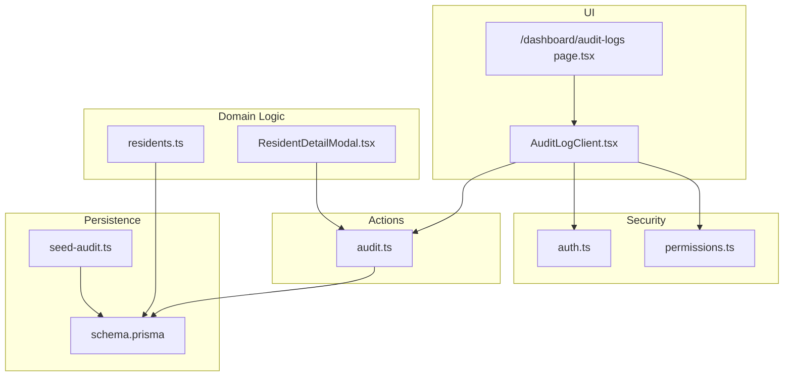
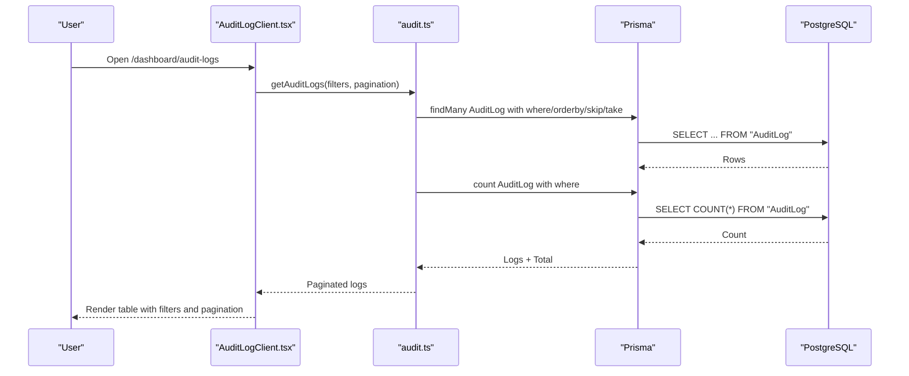
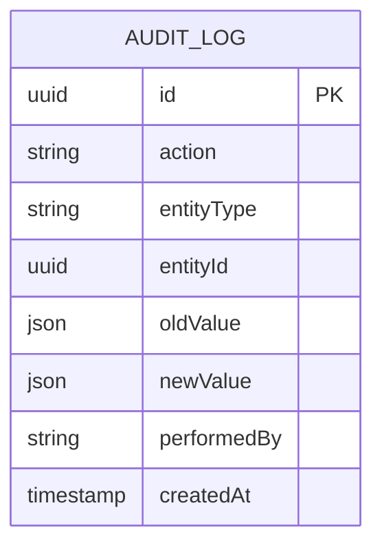
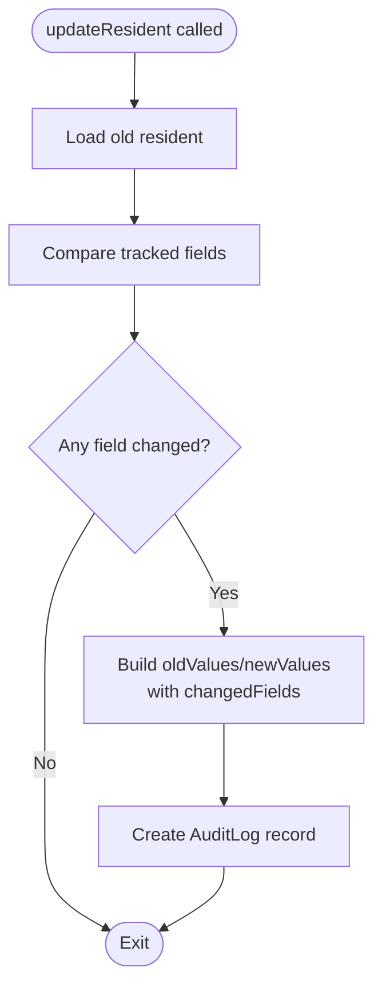
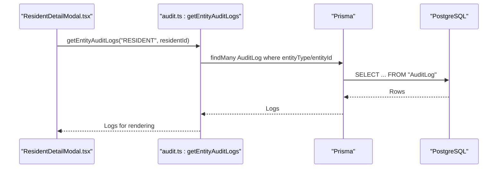
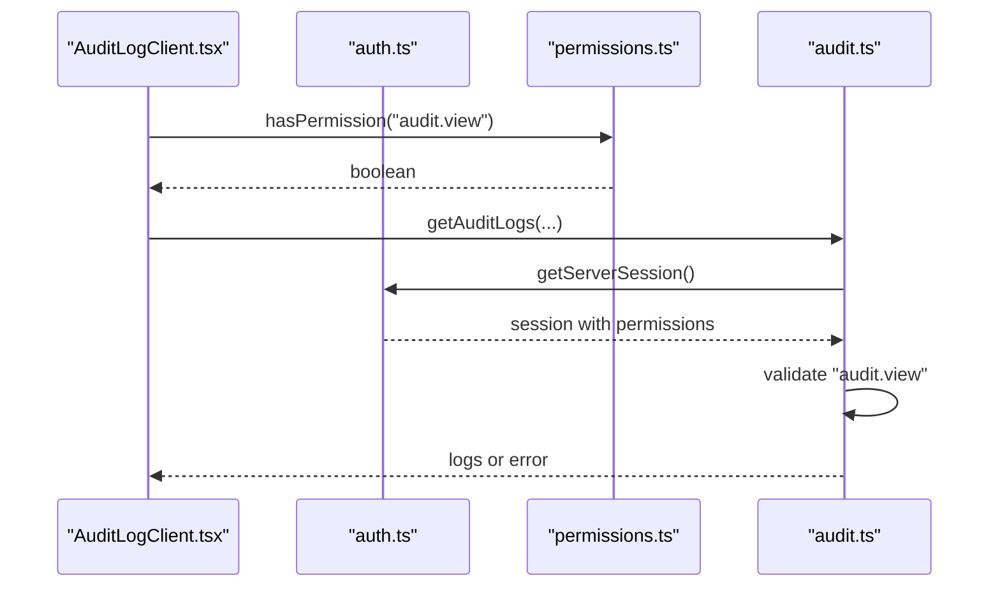
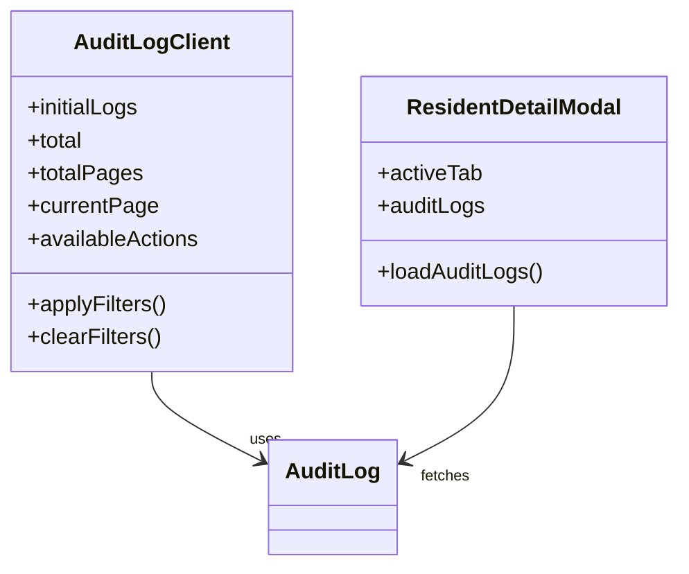
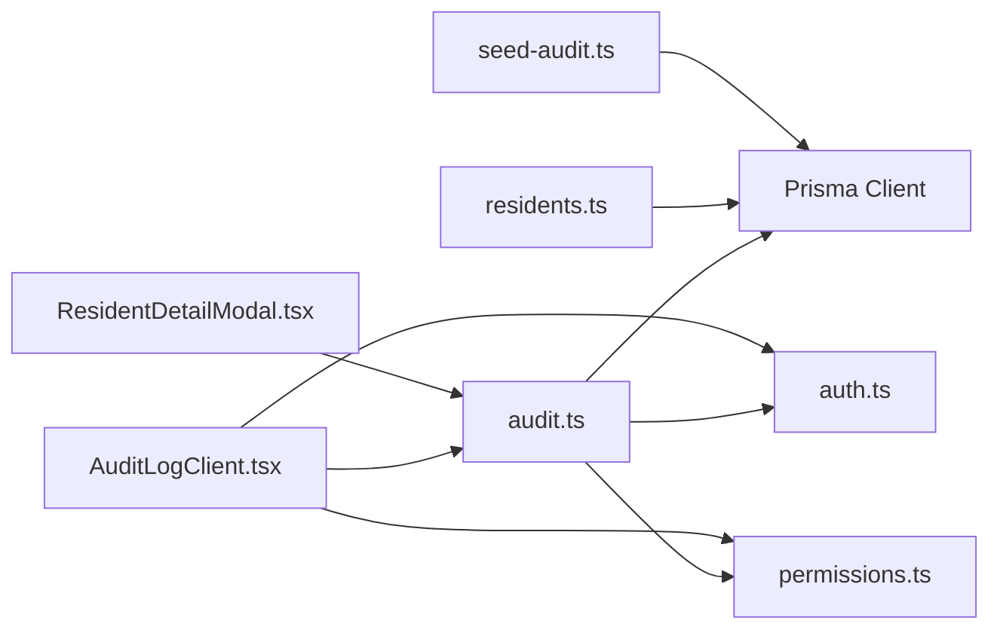

# Compliance Monitoring

<cite>
**Referenced Files in This Document**
- [audit.ts](file://src/app/actions/audit.ts)
- [audit-logs/page.tsx](file://src/app/dashboard/audit-logs/page.tsx)
- [AuditLogClient.tsx](file://src/components/dashboard/audit-log/AuditLogClient.tsx)
- [seed-audit.ts](file://scripts/seed-audit.ts)
- [schema.prisma](file://prisma/schema.prisma)
- [auth.ts](file://src/lib/auth.ts)
- [permissions.ts](file://src/lib/permissions.ts)
- [residents.ts](file://src/app/actions/residents.ts)
- [ResidentDetailModal.tsx](file://src/components/dashboard/ResidentDetailModal.tsx)
- [AUDIT_LOG_INVESTIGATION_REPORT.md](file://AUDIT_LOG_INVESTIGATION_REPORT.md)
</cite>

## Table of Contents
1. [Introduction](#introduction)
2. [Project Structure](#project-structure)
3. [Core Components](#core-components)
4. [Architecture Overview](#architecture-overview)
5. [Detailed Component Analysis](#detailed-component-analysis)
6. [Dependency Analysis](#dependency-analysis)
7. [Performance Considerations](#performance-considerations)
8. [Troubleshooting Guide](#troubleshooting-guide)
9. [Conclusion](#conclusion)
10. [Appendices](#appendices)

## Introduction
This document explains the compliance monitoring capabilities implemented in the system, focusing on automated audit logging, regulatory compliance tracking, policy enforcement, and investigation tools. It covers how the system records and surfaces data changes, enforces access controls, and supports compliance investigations. It also outlines reporting templates, retention considerations, and security measures for protecting sensitive audit data.

## Project Structure
The compliance monitoring features are centered around:
- Audit logging model and actions
- Global audit log viewer with filtering and pagination
- Entity-specific audit log retrieval for compliance investigations
- Permission-driven access control for viewing audit logs
- Automated audit entries for key entity updates
- Seed script to provision audit view permissions

**Diagram sources**
- [audit-logs/page.tsx:14-49](file://src/app/dashboard/audit-logs/page.tsx#L14-L49)
- [AuditLogClient.tsx:105-409](file://src/components/dashboard/audit-log/AuditLogClient.tsx#L105-L409)
- [audit.ts:8-117](file://src/app/actions/audit.ts#L8-L117)
- [residents.ts:246-442](file://src/app/actions/residents.ts#L246-L442)
- [ResidentDetailModal.tsx:307-366](file://src/components/dashboard/ResidentDetailModal.tsx#L307-L366)
- [schema.prisma:455-466](file://prisma/schema.prisma#L455-L466)
- [seed-audit.ts:11-36](file://scripts/seed-audit.ts#L11-L36)
- [auth.ts:1-81](file://src/lib/auth.ts#L1-L81)
- [permissions.ts:1-21](file://src/lib/permissions.ts#L1-L21)

**Section sources**
- [audit-logs/page.tsx:14-49](file://src/app/dashboard/audit-logs/page.tsx#L14-L49)
- [AuditLogClient.tsx:105-409](file://src/components/dashboard/audit-log/AuditLogClient.tsx#L105-L409)
- [audit.ts:8-117](file://src/app/actions/audit.ts#L8-L117)
- [residents.ts:246-442](file://src/app/actions/residents.ts#L246-L442)
- [ResidentDetailModal.tsx:307-366](file://src/components/dashboard/ResidentDetailModal.tsx#L307-L366)
- [schema.prisma:455-466](file://prisma/schema.prisma#L455-L466)
- [seed-audit.ts:11-36](file://scripts/seed-audit.ts#L11-L36)
- [auth.ts:1-81](file://src/lib/auth.ts#L1-L81)
- [permissions.ts:1-21](file://src/lib/permissions.ts#L1-L21)

## Core Components
- AuditLog model: central persistence for change events with fields for action, entity type, entity identifier, old/new values, actor, and timestamp.
- Audit actions: paginated, filterable queries for global audit logs and distinct action enumeration.
- Entity-specific audit retrieval: fetch audit logs scoped to a specific entity type and ID.
- Permission gating: audit viewing requires explicit permission.
- Automated audit entries: update operations on key entities automatically emit audit records with tracked fields.
- UI components: global audit log page and client-side filtering/pagination; entity-level audit tab in resident detail modal.

**Section sources**
- [schema.prisma:455-466](file://prisma/schema.prisma#L455-L466)
- [audit.ts:8-117](file://src/app/actions/audit.ts#L8-L117)
- [audit-logs/page.tsx:14-49](file://src/app/dashboard/audit-logs/page.tsx#L14-L49)
- [AuditLogClient.tsx:105-409](file://src/components/dashboard/audit-log/AuditLogClient.tsx#L105-L409)
- [ResidentDetailModal.tsx:307-366](file://src/components/dashboard/ResidentDetailModal.tsx#L307-L366)
- [residents.ts:246-442](file://src/app/actions/residents.ts#L246-L442)
- [seed-audit.ts:11-36](file://scripts/seed-audit.ts#L11-L36)

## Architecture Overview
The compliance monitoring architecture integrates domain operations with automatic audit recording and a secure, permissioned audit log viewer.

**Diagram sources**
- [audit-logs/page.tsx:33-36](file://src/app/dashboard/audit-logs/page.tsx#L33-L36)
- [audit.ts:27-98](file://src/app/actions/audit.ts#L27-L98)
- [AuditLogClient.tsx:139-158](file://src/components/dashboard/audit-log/AuditLogClient.tsx#L139-L158)

## Detailed Component Analysis

### AuditLog Model and Permissions
- Model fields capture the who, what, when, and how of changes: action, entityType, entityId, oldValue, newValue, performedBy, createdAt.
- Permissions: a dedicated permission code enables viewing audit logs; the seed script provisions this permission and assigns it to system roles.

**Diagram sources**
- [schema.prisma:455-466](file://prisma/schema.prisma#L455-L466)

**Section sources**
- [schema.prisma:455-466](file://prisma/schema.prisma#L455-L466)
- [seed-audit.ts:11-36](file://scripts/seed-audit.ts#L11-L36)

### Automated Audit Recording on Updates
- On resident updates, the system computes changed fields from a predefined set and writes a single AuditLog entry with structured oldValue/newValue and a changedFields list.
- This ensures compliance-relevant changes are captured consistently and efficiently.

**Diagram sources**
- [residents.ts:374-412](file://src/app/actions/residents.ts#L374-L412)

**Section sources**
- [residents.ts:246-442](file://src/app/actions/residents.ts#L246-L442)

### Global Audit Log Viewer
- The page initializes with filters derived from URL search parameters and loads logs concurrently with available actions.
- Client component provides:
  - Search across JSON values and identifiers
  - Action, user/email, and date range filters
  - Pagination and refresh
  - Expandable per-field diffs for UPDATE actions

**Diagram sources**
- [ResidentDetailModal.tsx:335-344](file://src/components/dashboard/ResidentDetailModal.tsx#L335-L344)
- [audit.ts:8-25](file://src/app/actions/audit.ts#L8-L25)

**Section sources**
- [audit-logs/page.tsx:14-49](file://src/app/dashboard/audit-logs/page.tsx#L14-L49)
- [AuditLogClient.tsx:105-409](file://src/components/dashboard/audit-log/AuditLogClient.tsx#L105-L409)
- [audit.ts:27-98](file://src/app/actions/audit.ts#L27-L98)
- [ResidentDetailModal.tsx:307-366](file://src/components/dashboard/ResidentDetailModal.tsx#L307-L366)

### Policy Enforcement and Access Control
- View access to audit logs is gated by a dedicated permission code validated server-side in action functions and client-side in UI components.
- Authentication integrates with JWT session tokens and role-permission resolution.

**Diagram sources**
- [AuditLogClient.tsx:105-126](file://src/components/dashboard/audit-log/AuditLogClient.tsx#L105-L126)
- [permissions.ts:4-20](file://src/lib/permissions.ts#L4-L20)
- [audit.ts:37-41](file://src/app/actions/audit.ts#L37-L41)
- [auth.ts:53-80](file://src/lib/auth.ts#L53-L80)

**Section sources**
- [permissions.ts:1-21](file://src/lib/permissions.ts#L1-L21)
- [audit.ts:37-41](file://src/app/actions/audit.ts#L37-L41)
- [audit-logs/page.tsx:22-23](file://src/app/dashboard/audit-logs/page.tsx#L22-L23)
- [ResidentDetailModal.tsx:307-311](file://src/components/dashboard/ResidentDetailModal.tsx#L307-L311)

### Investigation Tools for Compliance Breaches
- Entity-level audit tab in the resident detail modal displays per-field diffs with before/after values and timestamps.
- Global audit log supports advanced filtering and search to locate suspicious or unauthorized changes across the system.

**Diagram sources**
- [AuditLogClient.tsx:105-166](file://src/components/dashboard/audit-log/AuditLogClient.tsx#L105-L166)
- [ResidentDetailModal.tsx:307-366](file://src/components/dashboard/ResidentDetailModal.tsx#L307-L366)

**Section sources**
- [ResidentDetailModal.tsx:622-708](file://src/components/dashboard/ResidentDetailModal.tsx#L622-L708)
- [AuditLogClient.tsx:105-409](file://src/components/dashboard/audit-log/AuditLogClient.tsx#L105-L409)

### Anomaly Detection and Alerting Systems
- The current implementation focuses on automated audit logging and inspection. No built-in anomaly detection or alerting logic is present in the analyzed files.
- Recommendation: Integrate external alerting (e.g., email/SMS) and anomaly detection (e.g., ML-based pattern recognition) by extending the audit pipeline to trigger alerts on flagged patterns.

[No sources needed since this section provides general guidance]

### Regulatory Requirement Tracking
- The system captures auditable events for key entities and fields. To support regulatory tracking:
  - Define regulatory categories mapped to entity types and fields.
  - Enforce policy rules at write-time (e.g., require approvals for high-risk changes).
  - Generate compliance reports aligned with regulatory templates.

[No sources needed since this section provides general guidance]

### Security Measures for Protecting Sensitive Audit Data
- Access control: audit viewing requires explicit permission.
- Session-based authentication with JWT.
- Minimal data exposure: only necessary fields are stored and displayed.

**Section sources**
- [audit.ts:37-41](file://src/app/actions/audit.ts#L37-L41)
- [permissions.ts:1-21](file://src/lib/permissions.ts#L1-L21)
- [auth.ts:1-81](file://src/lib/auth.ts#L1-L81)

## Dependency Analysis
Key dependencies and their roles:
- Prisma client and PostgreSQL for persistent storage of AuditLog entries.
- NextAuth for session and permission resolution.
- React components for UI rendering and user interaction.

**Diagram sources**
- [audit.ts:3-6](file://src/app/actions/audit.ts#L3-L6)
- [AuditLogClient.tsx:1-8](file://src/components/dashboard/audit-log/AuditLogClient.tsx#L1-L8)
- [residents.ts:3-7](file://src/app/actions/residents.ts#L3-L7)
- [ResidentDetailModal.tsx](file://src/components/dashboard/ResidentDetailModal.tsx#L8)
- [seed-audit.ts:1-9](file://scripts/seed-audit.ts#L1-L9)
- [auth.ts:1-4](file://src/lib/auth.ts#L1-L4)
- [permissions.ts:1-2](file://src/lib/permissions.ts#L1-L2)

**Section sources**
- [audit.ts:3-6](file://src/app/actions/audit.ts#L3-L6)
- [AuditLogClient.tsx:1-8](file://src/components/dashboard/audit-log/AuditLogClient.tsx#L1-L8)
- [residents.ts:3-7](file://src/app/actions/residents.ts#L3-L7)
- [ResidentDetailModal.tsx](file://src/components/dashboard/ResidentDetailModal.tsx#L8)
- [seed-audit.ts:1-9](file://scripts/seed-audit.ts#L1-L9)
- [auth.ts:1-4](file://src/lib/auth.ts#L1-L4)
- [permissions.ts:1-2](file://src/lib/permissions.ts#L1-L2)

## Performance Considerations
- Pagination and indexing: the AuditLog model includes an index on entity type and ID, supporting efficient lookups for entity-scoped queries.
- Filtering: server-side filtering reduces payload sizes; in-memory JSON search is applied after fetching to support free-text search across values.
- Recommendations:
  - Add database indexes for frequently filtered columns (e.g., performedBy, createdAt).
  - Consider materialized views or summary tables for high-volume reporting.
  - Batch writes for bulk operations to reduce transaction overhead.

**Section sources**
- [schema.prisma:465-466](file://prisma/schema.prisma#L465-L466)
- [audit.ts:74-84](file://src/app/actions/audit.ts#L74-L84)

## Troubleshooting Guide
Common issues and resolutions:
- Permission denied: ensure the "audit.view" permission exists and is assigned to the user’s role. The seed script provisions this permission and assigns it to system roles.
- Empty audit tab: verify that the user has the "audit.view" permission; the tab is conditionally rendered based on permissions.
- Missing audit entries: confirm that update operations occur via the domain action that emits AuditLog entries.

**Section sources**
- [seed-audit.ts:11-36](file://scripts/seed-audit.ts#L11-L36)
- [ResidentDetailModal.tsx:307-311](file://src/components/dashboard/ResidentDetailModal.tsx#L307-L311)
- [AUDIT_LOG_INVESTIGATION_REPORT.md:5-38](file://AUDIT_LOG_INVESTIGATION_REPORT.md#L5-L38)

## Conclusion
The system provides robust, permissioned audit logging for compliance monitoring. Automated audit entries capture meaningful changes, while the global and entity-specific viewers enable effective investigations. Access control and minimal data exposure help protect sensitive audit data. Extending the system with policy enforcement, anomaly detection, and alerting would further strengthen compliance capabilities.

## Appendices

### Compliance Reporting Templates
- Monthly activity summary by actor and action type
- Entity change timelines with before/after diffs
- Bulk operation audit trail
- Export history tracking for sensitive reports

[No sources needed since this section provides general guidance]

### Retention Policies
- Define retention periods for AuditLog entries (e.g., 7 years for regulatory compliance).
- Implement periodic cleanup jobs to archive or purge expired entries.
- Maintain immutable exports for legal admissibility.

[No sources needed since this section provides general guidance]