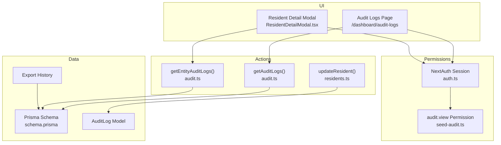
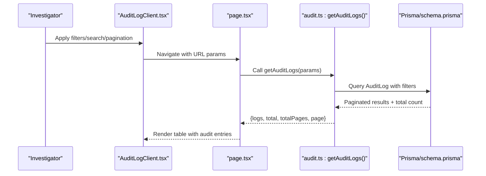
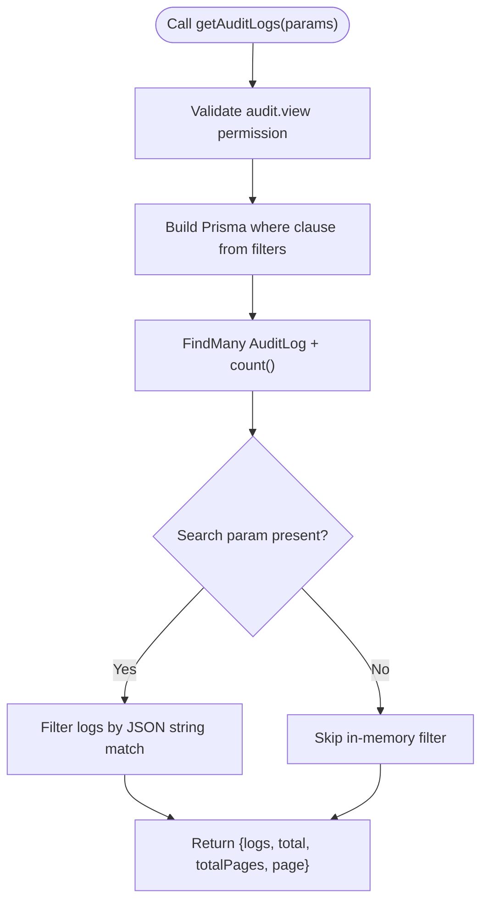
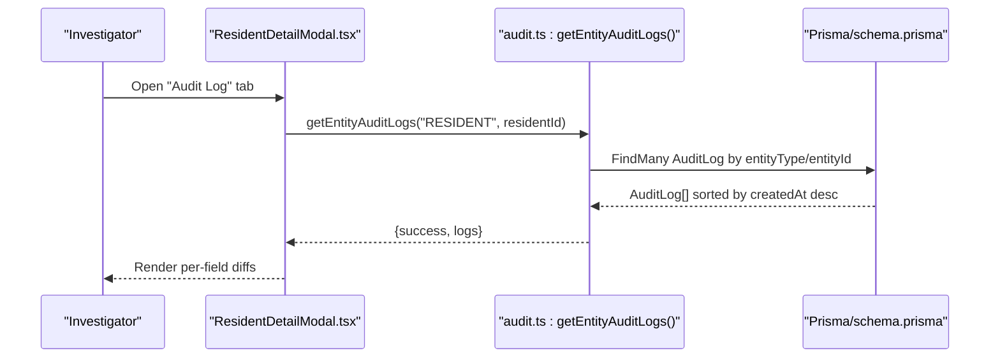
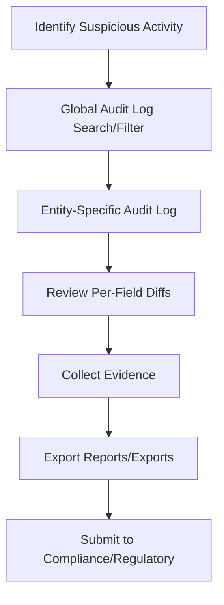
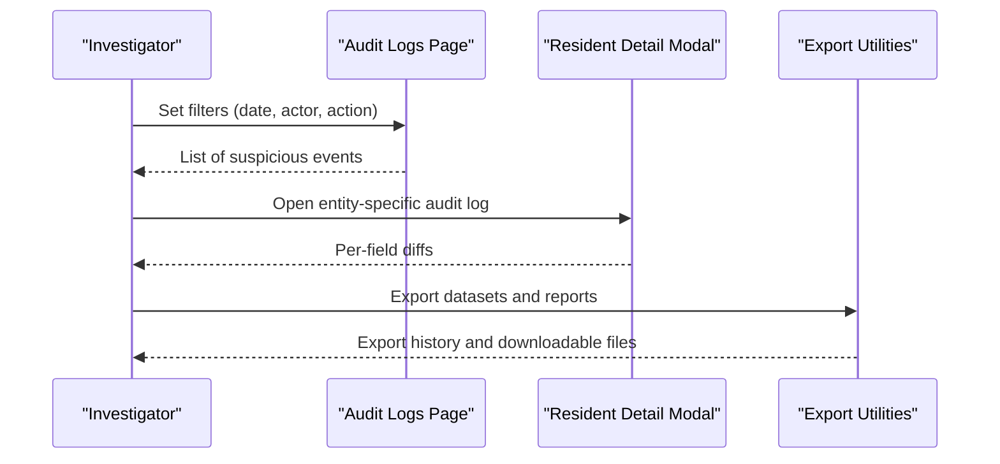
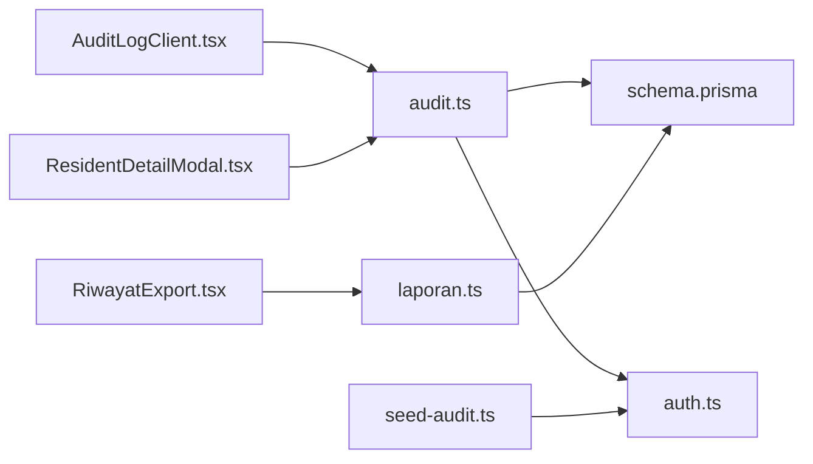

# Investigation Tools

<cite>
**Referenced Files in This Document**
- [audit.ts](file://src/app/actions/audit.ts)
- [AuditLogClient.tsx](file://src/components/dashboard/audit-log/AuditLogClient.tsx)
- [page.tsx](file://src/app/dashboard/audit-logs/page.tsx)
- [ResidentDetailModal.tsx](file://src/components/dashboard/ResidentDetailModal.tsx)
- [residents.ts](file://src/app/actions/residents.ts)
- [schema.prisma](file://prisma/schema.prisma)
- [seed-audit.ts](file://scripts/seed-audit.ts)
- [AUDIT_LOG_INVESTIGATION_REPORT.md](file://AUDIT_LOG_INVESTIGATION_REPORT.md)
- [auth.ts](file://src/lib/auth.ts)
- [ResidentsClient.tsx](file://src/components/dashboard/ResidentsClient.tsx)
- [residentExport.ts](file://src/utils/residentExport.ts)
- [laporan.ts](file://src/app/actions/laporan.ts)
- [page.tsx](file://src/app/dashboard/laporan/page.tsx)
- [RiwayatExport.tsx](file://src/components/dashboard/laporan/RiwayatExport.tsx)
</cite>

## Table of Contents
1. [Introduction](#introduction)
2. [Project Structure](#project-structure)
3. [Core Components](#core-components)
4. [Architecture Overview](#architecture-overview)
5. [Detailed Component Analysis](#detailed-component-analysis)
6. [Dependency Analysis](#dependency-analysis)
7. [Performance Considerations](#performance-considerations)
8. [Troubleshooting Guide](#troubleshooting-guide)
9. [Conclusion](#conclusion)
10. [Appendices](#appendices)

## Introduction
This document describes the audit investigation tools and techniques implemented in the system. It covers how suspicious activities are identified through audit logging, how search and filtering capabilities enable targeted investigations, and how the platform supports evidence collection and case management. It also outlines the investigation workflow, preservation of evidence integrity, and reporting procedures, along with integration points for compliance and regulatory submissions.

## Project Structure
The investigation capability centers around:
- Audit log storage and retrieval
- Global audit log viewer with filters and pagination
- Entity-specific audit log viewing within entity detail modals
- Evidence export and history tracking
- Permission-driven access control ensuring audit visibility is restricted appropriately

**Diagram sources**
- [page.tsx:14-49](file://src/app/dashboard/audit-logs/page.tsx#L14-L49)
- [AuditLogClient.tsx:105-409](file://src/components/dashboard/audit-log/AuditLogClient.tsx#L105-L409)
- [ResidentDetailModal.tsx:307-759](file://src/components/dashboard/ResidentDetailModal.tsx#L307-L759)
- [audit.ts:8-118](file://src/app/actions/audit.ts#L8-L118)
- [residents.ts:246-442](file://src/app/actions/residents.ts#L246-L442)
- [schema.prisma:455-466](file://prisma/schema.prisma#L455-L466)
- [auth.ts:1-81](file://src/lib/auth.ts#L1-L81)
- [seed-audit.ts:11-35](file://scripts/seed-audit.ts#L11-L35)

**Section sources**
- [page.tsx:14-49](file://src/app/dashboard/audit-logs/page.tsx#L14-L49)
- [AuditLogClient.tsx:105-409](file://src/components/dashboard/audit-log/AuditLogClient.tsx#L105-L409)
- [ResidentDetailModal.tsx:307-759](file://src/components/dashboard/ResidentDetailModal.tsx#L307-L759)
- [audit.ts:8-118](file://src/app/actions/audit.ts#L8-L118)
- [residents.ts:246-442](file://src/app/actions/residents.ts#L246-L442)
- [schema.prisma:455-466](file://prisma/schema.prisma#L455-L466)
- [auth.ts:1-81](file://src/lib/auth.ts#L1-L81)
- [seed-audit.ts:11-35](file://scripts/seed-audit.ts#L11-L35)

## Core Components
- Audit log retrieval and filtering:
  - Paginated, filterable audit log listing with search across JSON fields
  - Distinct action enumeration for quick filtering
- Entity-specific audit log:
  - Per-entity audit log view within the Resident Detail Modal
- Evidence export and history:
  - Export history tracking and UI for managing exports
- Permissions and access control:
  - Centralized session and permission handling via NextAuth
  - Seed script to provision the audit.view permission

Key implementation references:
- [getAuditLogs():27-98](file://src/app/actions/audit.ts#L27-L98)
- [getAuditLogActions():100-117](file://src/app/actions/audit.ts#L100-L117)
- [getEntityAuditLogs():8-25](file://src/app/actions/audit.ts#L8-L25)
- [AuditLogClient UI:105-409](file://src/components/dashboard/audit-log/AuditLogClient.tsx#L105-L409)
- [Resident Detail Audit Log Tab:622-708](file://src/components/dashboard/ResidentDetailModal.tsx#L622-L708)
- [Export History Actions:197-226](file://src/app/actions/laporan.ts#L197-L226)
- [Export History UI:1-111](file://src/components/dashboard/laporan/RiwayatExport.tsx#L1-L111)
- [NextAuth Session & Permissions:53-71](file://src/lib/auth.ts#L53-L71)
- [audit.view Permission Seed:14-30](file://scripts/seed-audit.ts#L14-L30)

**Section sources**
- [audit.ts:8-118](file://src/app/actions/audit.ts#L8-L118)
- [AuditLogClient.tsx:105-409](file://src/components/dashboard/audit-log/AuditLogClient.tsx#L105-L409)
- [ResidentDetailModal.tsx:622-708](file://src/components/dashboard/ResidentDetailModal.tsx#L622-L708)
- [laporan.ts:197-226](file://src/app/actions/laporan.ts#L197-L226)
- [RiwayatExport.tsx:1-111](file://src/components/dashboard/laporan/RiwayatExport.tsx#L1-L111)
- [auth.ts:53-71](file://src/lib/auth.ts#L53-L71)
- [seed-audit.ts:14-30](file://scripts/seed-audit.ts#L14-L30)

## Architecture Overview
The audit investigation architecture integrates UI, server actions, database models, and permissions to provide a secure, searchable, and actionable audit trail.

**Diagram sources**
- [AuditLogClient.tsx:139-158](file://src/components/dashboard/audit-log/AuditLogClient.tsx#L139-L158)
- [page.tsx:14-49](file://src/app/dashboard/audit-logs/page.tsx#L14-L49)
- [audit.ts:27-98](file://src/app/actions/audit.ts#L27-L98)
- [schema.prisma:455-466](file://prisma/schema.prisma#L455-L466)

**Section sources**
- [AuditLogClient.tsx:139-158](file://src/components/dashboard/audit-log/AuditLogClient.tsx#L139-L158)
- [page.tsx:14-49](file://src/app/dashboard/audit-logs/page.tsx#L14-L49)
- [audit.ts:27-98](file://src/app/actions/audit.ts#L27-L98)
- [schema.prisma:455-466](file://prisma/schema.prisma#L455-L466)

## Detailed Component Analysis

### Audit Log Retrieval and Filtering
- Purpose: Provide a paginated, filterable view of all audit events with optional free-text search across JSON fields.
- Capabilities:
  - Filter by action, performed-by, date range, and entity type
  - Search across oldValue/newValue JSON and entity identifiers
  - Pagination with total counts and page navigation
- Implementation highlights:
  - Server action validates permissions and constructs Prisma queries dynamically
  - In-memory filtering applied after DB fetch to support JSON text search
  - Distinct action enumeration for UI dropdowns

**Diagram sources**
- [audit.ts:27-98](file://src/app/actions/audit.ts#L27-L98)

**Section sources**
- [audit.ts:27-98](file://src/app/actions/audit.ts#L27-L98)

### Entity-Specific Audit Log View
- Purpose: Allow investigators to inspect the full audit history for a specific entity (e.g., a resident).
- Capabilities:
  - On-demand loading of entity audit logs
  - Clear indication of changed fields and before/after values
- Implementation highlights:
  - Uses getEntityAuditLogs(entityType, entityId)
  - Parses JSON oldValue/newValue to render per-field diffs

**Diagram sources**
- [ResidentDetailModal.tsx:335-346](file://src/components/dashboard/ResidentDetailModal.tsx#L335-L346)
- [audit.ts:8-25](file://src/app/actions/audit.ts#L8-L25)
- [schema.prisma:455-466](file://prisma/schema.prisma#L455-L466)

**Section sources**
- [ResidentDetailModal.tsx:335-346](file://src/components/dashboard/ResidentDetailModal.tsx#L335-L346)
- [audit.ts:8-25](file://src/app/actions/audit.ts#L8-L25)

### Evidence Collection and Case Management
- Evidence collection:
  - Audit logs capture all tracked field changes with timestamps and actor identities
  - Export history tracks who exported what and when
- Case management:
  - Use the global audit log to build timelines and identify suspicious activity
  - Drill down to entity-specific logs for precise before/after evidence
  - Export relevant datasets for further review or compliance submission

[No sources needed since this diagram shows conceptual workflow, not actual code structure]

**Section sources**
- [AUDIT_LOG_INVESTIGATION_REPORT.md:81-119](file://AUDIT_LOG_INVESTIGATION_REPORT.md#L81-L119)
- [laporan.ts:197-226](file://src/app/actions/laporan.ts#L197-L226)
- [RiwayatExport.tsx:1-111](file://src/components/dashboard/laporan/RiwayatExport.tsx#L1-L111)

### Pattern Recognition and Automated Anomaly Detection
- Current implementation:
  - The system records all tracked field updates with oldValue/newValue and changedFields
  - There is no built-in anomaly detection engine in the provided code
- Recommended approach:
  - Use the audit log dataset to train detection rules or ML models externally
  - Apply thresholds (e.g., rapid-fire updates, bulk changes) and cross-reference with user roles and time windows
  - Integrate detection results back into the audit log or a separate findings table for triage

[No sources needed since this section provides general guidance]

**Section sources**
- [residents.ts:374-412](file://src/app/actions/residents.ts#L374-L412)
- [schema.prisma:455-466](file://prisma/schema.prisma#L455-L466)

### Investigation Workflow
- Preparation:
  - Ensure the user has the audit.view permission
  - Confirm the audit log schema and tracked fields are configured
- Execution:
  - Use the global audit log page to search and filter
  - Narrow down to suspicious actors, dates, and actions
  - Inspect entity-specific logs for detailed diffs
- Preservation:
  - Export relevant datasets and maintain export history
  - Preserve original audit log entries; avoid modifying them
- Reporting:
  - Generate reports using built-in export utilities
  - Compose narrative reports referencing specific audit entries

**Diagram sources**
- [page.tsx:14-49](file://src/app/dashboard/audit-logs/page.tsx#L14-L49)
- [AuditLogClient.tsx:105-409](file://src/components/dashboard/audit-log/AuditLogClient.tsx#L105-L409)
- [ResidentDetailModal.tsx:622-708](file://src/components/dashboard/ResidentDetailModal.tsx#L622-L708)
- [residentExport.ts:6-31](file://src/utils/residentExport.ts#L6-L31)

**Section sources**
- [page.tsx:14-49](file://src/app/dashboard/audit-logs/page.tsx#L14-L49)
- [AuditLogClient.tsx:105-409](file://src/components/dashboard/audit-log/AuditLogClient.tsx#L105-L409)
- [ResidentDetailModal.tsx:622-708](file://src/components/dashboard/ResidentDetailModal.tsx#L622-L708)
- [residentExport.ts:6-31](file://src/utils/residentExport.ts#L6-L31)

### Guidelines for Internal Investigations
- Access control:
  - Verify the audit.view permission is granted to authorized users
- Evidence integrity:
  - Do not modify audit log entries; rely on immutable records
  - Use export history to track who accessed or exported sensitive data
- Report generation:
  - Use the built-in export utilities to produce CSV/PDF outputs
  - Include timestamps, actors, and per-field diffs in reports

**Section sources**
- [seed-audit.ts:14-30](file://scripts/seed-audit.ts#L14-L30)
- [laporan.ts:197-226](file://src/app/actions/laporan.ts#L197-L226)
- [RiwayatExport.tsx:1-111](file://src/components/dashboard/laporan/RiwayatExport.tsx#L1-L111)

### Integration with External Compliance Systems
- Audit log as source of truth:
  - Use the AuditLog model to populate compliance dashboards or external systems
- Export history for auditability:
  - Track who exported what and when for compliance audits
- Regulatory submission:
  - Package audit entries and export history into required formats
  - Maintain a paper trail of all investigative actions

**Section sources**
- [schema.prisma:455-466](file://prisma/schema.prisma#L455-L466)
- [laporan.ts:197-226](file://src/app/actions/laporan.ts#L197-L226)

## Dependency Analysis
The audit investigation system depends on:
- Prisma schema defining the AuditLog model and indexes
- Server actions for querying and enumerating audit data
- UI components for rendering and interacting with audit data
- NextAuth for enforcing permissions
- Export utilities for evidence packaging

**Diagram sources**
- [AuditLogClient.tsx:105-409](file://src/components/dashboard/audit-log/AuditLogClient.tsx#L105-L409)
- [audit.ts:27-98](file://src/app/actions/audit.ts#L27-L98)
- [schema.prisma:455-466](file://prisma/schema.prisma#L455-L466)
- [auth.ts:53-71](file://src/lib/auth.ts#L53-L71)
- [RiwayatExport.tsx:1-111](file://src/components/dashboard/laporan/RiwayatExport.tsx#L1-L111)
- [laporan.ts:197-226](file://src/app/actions/laporan.ts#L197-L226)
- [ResidentDetailModal.tsx:335-346](file://src/components/dashboard/ResidentDetailModal.tsx#L335-L346)
- [seed-audit.ts:14-30](file://scripts/seed-audit.ts#L14-L30)

**Section sources**
- [AuditLogClient.tsx:105-409](file://src/components/dashboard/audit-log/AuditLogClient.tsx#L105-L409)
- [audit.ts:27-98](file://src/app/actions/audit.ts#L27-L98)
- [schema.prisma:455-466](file://prisma/schema.prisma#L455-L466)
- [auth.ts:53-71](file://src/lib/auth.ts#L53-L71)
- [RiwayatExport.tsx:1-111](file://src/components/dashboard/laporan/RiwayatExport.tsx#L1-L111)
- [laporan.ts:197-226](file://src/app/actions/laporan.ts#L197-L226)
- [ResidentDetailModal.tsx:335-346](file://src/components/dashboard/ResidentDetailModal.tsx#L335-L346)
- [seed-audit.ts:14-30](file://scripts/seed-audit.ts#L14-L30)

## Performance Considerations
- Indexing:
  - The AuditLog model includes an index on entityType and entityId to optimize per-entity queries
- Pagination:
  - Server-side pagination reduces memory usage and improves responsiveness
- Search scope:
  - JSON text search is applied in-memory after fetching; keep filters tight to minimize unnecessary parsing
- Recommendations:
  - Add database-level JSON search indexes if supported by your database provider
  - Consider partitioning or archiving older audit logs for improved query performance

**Section sources**
- [schema.prisma:465-466](file://prisma/schema.prisma#L465-L466)
- [audit.ts:64-84](file://src/app/actions/audit.ts#L64-L84)

## Troubleshooting Guide
- Permission denied:
  - Ensure the audit.view permission exists and is assigned to the user’s role
  - Verify NextAuth session includes the permission
- Empty audit log:
  - Confirm that updateResident writes audit logs for tracked fields
  - Check that the entity-specific tab is opened for the correct entity
- Export history issues:
  - Validate export history creation and UI rendering
  - Confirm user has appropriate export permissions

**Section sources**
- [seed-audit.ts:14-30](file://scripts/seed-audit.ts#L14-L30)
- [auth.ts:53-71](file://src/lib/auth.ts#L53-L71)
- [residents.ts:374-412](file://src/app/actions/residents.ts#L374-L412)
- [ResidentDetailModal.tsx:335-346](file://src/components/dashboard/ResidentDetailModal.tsx#L335-L346)
- [laporan.ts:197-226](file://src/app/actions/laporan.ts#L197-L226)
- [RiwayatExport.tsx:1-111](file://src/components/dashboard/laporan/RiwayatExport.tsx#L1-L111)

## Conclusion
The system provides a robust foundation for audit investigations with permission-controlled access, comprehensive entity and global audit views, and export capabilities. Investigators can efficiently search, filter, and collect evidence, then package findings for compliance and regulatory needs. Extending the system with automated anomaly detection and advanced analytics would further strengthen its investigative capabilities.

## Appendices

### Appendix A: Audit Log Data Model
- Fields:
  - action: Type of operation (e.g., UPDATE_RESIDENT)
  - entityType: Target entity type (e.g., RESIDENT)
  - entityId: Identifier of the target entity
  - oldValue/newValue: JSON containing previous and new values; newValue embeds changedFields
  - performedBy: Actor who executed the change
  - createdAt: Timestamp of the change

**Section sources**
- [schema.prisma:455-466](file://prisma/schema.prisma#L455-L466)
- [AUDIT_LOG_INVESTIGATION_REPORT.md:57-78](file://AUDIT_LOG_INVESTIGATION_REPORT.md#L57-L78)

### Appendix B: Tracked Fields for Resident Updates
- The system tracks a predefined set of human-readable fields for resident updates to reduce noise and improve signal quality.

**Section sources**
- [residents.ts:380-384](file://src/app/actions/residents.ts#L380-L384)

### Appendix C: Evidence Export Utilities
- CSV export for resident lists
- PDF printing for resident reports
- Export history tracking for compliance

**Section sources**
- [residentExport.ts:6-31](file://src/utils/residentExport.ts#L6-L31)
- [residentExport.ts:44-122](file://src/utils/residentExport.ts#L44-L122)
- [laporan.ts:197-226](file://src/app/actions/laporan.ts#L197-L226)