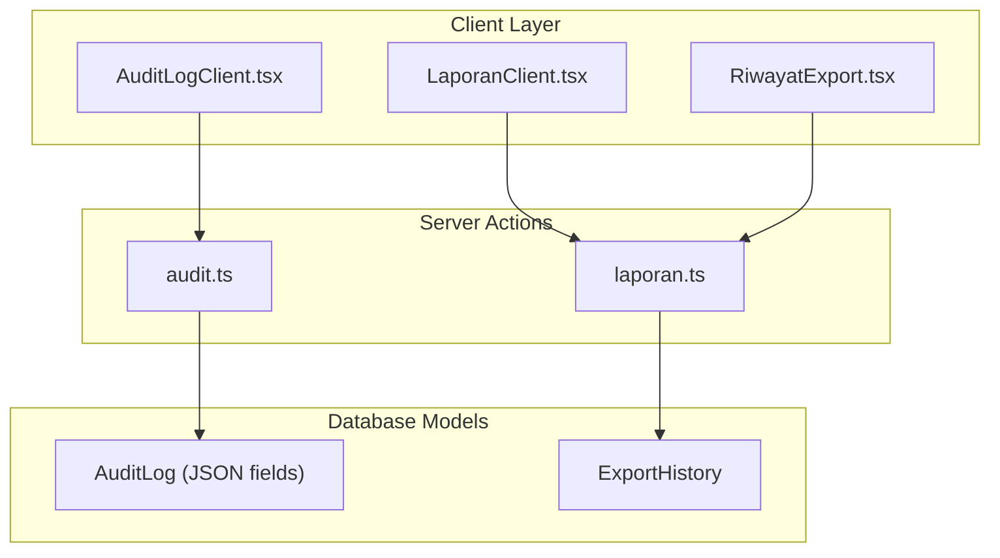
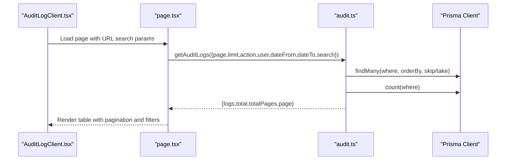
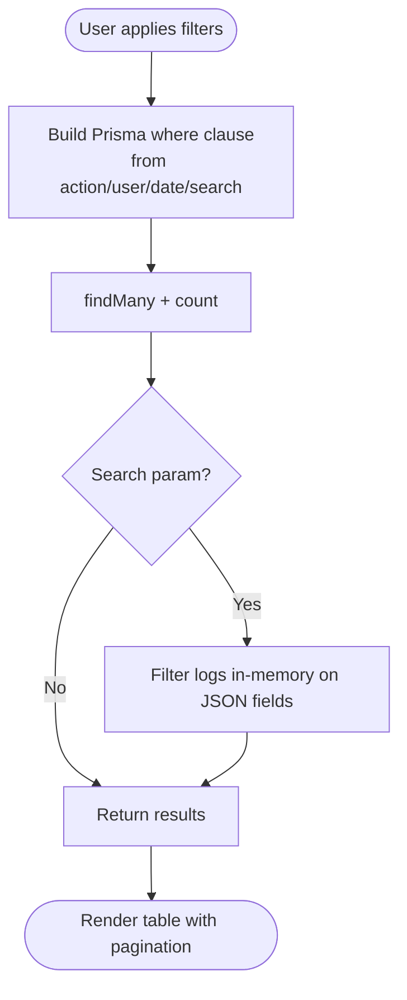
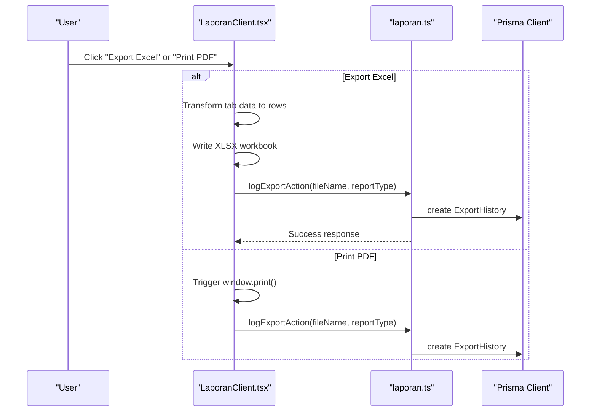
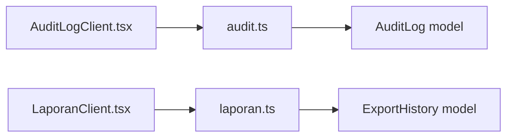

# Reporting & Export

<cite>
**Referenced Files in This Document**
- [audit.ts](file://src/app/actions/audit.ts)
- [laporan.ts](file://src/app/actions/laporan.ts)
- [AuditLogClient.tsx](file://src/components/dashboard/audit-log/AuditLogClient.tsx)
- [LaporanClient.tsx](file://src/components/dashboard/laporan/LaporanClient.tsx)
- [RiwayatExport.tsx](file://src/components/dashboard/laporan/RiwayatExport.tsx)
- [page.tsx](file://src/app/dashboard/audit-logs/page.tsx)
- [residentExport.ts](file://src/utils/residentExport.ts)
- [schema.prisma](file://prisma/schema.prisma)
- [AUDIT_LOG_INVESTIGATION_REPORT.md](file://AUDIT_LOG_INVESTIGATION_REPORT.md)
</cite>

## Table of Contents
1. [Introduction](#introduction)
2. [Project Structure](#project-structure)
3. [Core Components](#core-components)
4. [Architecture Overview](#architecture-overview)
5. [Detailed Component Analysis](#detailed-component-analysis)
6. [Dependency Analysis](#dependency-analysis)
7. [Performance Considerations](#performance-considerations)
8. [Security & Compliance](#security--compliance)
9. [Troubleshooting Guide](#troubleshooting-guide)
10. [Conclusion](#conclusion)

## Introduction
This document explains the reporting and export capabilities of the audit system, focusing on:
- Compliance reporting templates and automated report generation
- Supported data export formats
- Retention policies for audit records
- Secure data handling procedures
- Regulatory compliance considerations for data storage and transmission
- Examples of standard compliance reports, custom report creation, and integration with external audit systems
- Security measures for protecting sensitive audit data during export and transmission

## Project Structure
The reporting and export features span server actions, client components, and database models:
- Server actions encapsulate filtering, pagination, and export logging
- Client components render audit logs, manage filters, and trigger exports
- Database models define audit trails and export history persistence
- Utility functions provide CSV/PDF generation for resident data

**Diagram sources**
- [AuditLogClient.tsx:105-410](file://src/components/dashboard/audit-log/AuditLogClient.tsx#L105-L410)
- [LaporanClient.tsx:87-430](file://src/components/dashboard/laporan/LaporanClient.tsx#L87-L430)
- [RiwayatExport.tsx:1-111](file://src/components/dashboard/laporan/RiwayatExport.tsx#L1-L111)
- [audit.ts:1-118](file://src/app/actions/audit.ts#L1-L118)
- [laporan.ts:197-226](file://src/app/actions/laporan.ts#L197-L226)
- [schema.prisma:367-466](file://prisma/schema.prisma#L367-L466)

**Section sources**
- [audit.ts:1-118](file://src/app/actions/audit.ts#L1-L118)
- [laporan.ts:197-226](file://src/app/actions/laporan.ts#L197-L226)
- [AuditLogClient.tsx:105-410](file://src/components/dashboard/audit-log/AuditLogClient.tsx#L105-L410)
- [LaporanClient.tsx:87-430](file://src/components/dashboard/laporan/LaporanClient.tsx#L87-L430)
- [RiwayatExport.tsx:1-111](file://src/components/dashboard/laporan/RiwayatExport.tsx#L1-L111)
- [schema.prisma:367-466](file://prisma/schema.prisma#L367-L466)

## Core Components
- Audit log retrieval and filtering:
  - Paginated, filterable audit log listing with date range, actor, action, and free-text search
  - Distinct action enumeration for UI dropdowns
- Report generation and export:
  - Standardized dashboard reports (activity, assignments, monitoring, reactivation)
  - Export to Excel (.xlsx) and PDF printing
  - Export history tracking with user attribution
- Data export utilities:
  - CSV export for resident lists with UTF-8 BOM for Excel compatibility
  - PDF printing template for resident listings
- Audit trail persistence:
  - JSON fields for oldValue/newValue diffs with tracked resident attributes
  - Indexes on entity-type/entity-id for efficient lookups

**Section sources**
- [audit.ts:27-98](file://src/app/actions/audit.ts#L27-L98)
- [audit.ts:100-117](file://src/app/actions/audit.ts#L100-L117)
- [laporan.ts:197-226](file://src/app/actions/laporan.ts#L197-L226)
- [LaporanClient.tsx:161-221](file://src/components/dashboard/laporan/LaporanClient.tsx#L161-L221)
- [residentExport.ts:6-31](file://src/utils/residentExport.ts#L6-L31)
- [residentExport.ts:44-122](file://src/utils/residentExport.ts#L44-L122)
- [schema.prisma:455-466](file://prisma/schema.prisma#L455-L466)

## Architecture Overview
The system separates concerns across client, server, and persistence layers:
- Client components manage UI state, filters, and export triggers
- Server actions enforce permissions, build Prisma queries, and return paginated results
- Database models persist audit logs and export history with appropriate indexing

**Diagram sources**
- [page.tsx:14-49](file://src/app/dashboard/audit-logs/page.tsx#L14-L49)
- [audit.ts:27-98](file://src/app/actions/audit.ts#L27-L98)

**Section sources**
- [page.tsx:14-49](file://src/app/dashboard/audit-logs/page.tsx#L14-L49)
- [audit.ts:27-98](file://src/app/actions/audit.ts#L27-L98)

## Detailed Component Analysis

### Audit Log Management
- Filtering and pagination:
  - Supports action, performed-by, entity type, date range, and free-text search
  - In-memory JSON filtering for newValue/oldValue when search term provided
- Permissions:
  - Requires "audit.view" permission to access audit logs
- Rendering:
  - Color-coded action badges, entity labels, and expandable field diff view for updates

**Diagram sources**
- [audit.ts:47-92](file://src/app/actions/audit.ts#L47-L92)
- [AuditLogClient.tsx:139-158](file://src/components/dashboard/audit-log/AuditLogClient.tsx#L139-L158)

**Section sources**
- [audit.ts:27-98](file://src/app/actions/audit.ts#L27-L98)
- [AuditLogClient.tsx:105-410](file://src/components/dashboard/audit-log/AuditLogClient.tsx#L105-L410)

### Report Generation and Export
- Standard reports:
  - Dashboard summary cards, activity trends, distribution charts
  - Assignment, monitoring, and reactivation summaries
- Export formats:
  - Excel (.xlsx) via SheetJS for selected tabs
  - PDF printing via browser print dialog
- Export history:
  - Records filename, report type, and exporting user
  - UI displays export history with file type icons and deletion capability

**Diagram sources**
- [LaporanClient.tsx:161-221](file://src/components/dashboard/laporan/LaporanClient.tsx#L161-L221)
- [laporan.ts:197-215](file://src/app/actions/laporan.ts#L197-L215)
- [RiwayatExport.tsx:1-111](file://src/components/dashboard/laporan/RiwayatExport.tsx#L1-L111)

**Section sources**
- [LaporanClient.tsx:161-221](file://src/components/dashboard/laporan/LaporanClient.tsx#L161-L221)
- [laporan.ts:197-226](file://src/app/actions/laporan.ts#L197-L226)
- [RiwayatExport.tsx:1-111](file://src/components/dashboard/laporan/RiwayatExport.tsx#L1-L111)

### Data Export Utilities
- Resident CSV export:
  - Generates UTF-8 CSV with BOM for Excel compatibility
  - Includes key resident attributes and computed room labels
- Resident PDF printing:
  - Builds printable HTML with styled tables and badges
  - Automatically triggers print dialog and closes window after

**Section sources**
- [residentExport.ts:6-31](file://src/utils/residentExport.ts#L6-L31)
- [residentExport.ts:44-122](file://src/utils/residentExport.ts#L44-L122)

### Audit Trail Persistence
- AuditLog model stores:
  - Action, entity type, entity ID, performed-by
  - oldValue and newValue as JSON for field diffs
  - Creation timestamp
- Indexes:
  - Composite index on (entityType, entityId) for efficient lookups
- ExportHistory model:
  - Tracks exported filenames, report types, and associated user

**Section sources**
- [schema.prisma:455-466](file://prisma/schema.prisma#L455-L466)
- [schema.prisma:367-378](file://prisma/schema.prisma#L367-L378)

## Dependency Analysis
- Client-to-server:
  - AuditLogClient depends on audit.ts for fetching paginated logs and distinct actions
  - LaporanClient depends on laporan.ts for export logging and export history retrieval
- Server-to-database:
  - Both actions query Prisma models with where/count patterns
- Data models:
  - AuditLog supports JSON diffs; ExportHistory links exports to users

**Diagram sources**
- [AuditLogClient.tsx:105-410](file://src/components/dashboard/audit-log/AuditLogClient.tsx#L105-L410)
- [LaporanClient.tsx:87-430](file://src/components/dashboard/laporan/LaporanClient.tsx#L87-L430)
- [audit.ts:1-118](file://src/app/actions/audit.ts#L1-L118)
- [laporan.ts:197-226](file://src/app/actions/laporan.ts#L197-L226)
- [schema.prisma:455-466](file://prisma/schema.prisma#L455-L466)
- [schema.prisma:367-378](file://prisma/schema.prisma#L367-L378)

**Section sources**
- [audit.ts:1-118](file://src/app/actions/audit.ts#L1-L118)
- [laporan.ts:197-226](file://src/app/actions/laporan.ts#L197-L226)
- [schema.prisma:455-466](file://prisma/schema.prisma#L455-L466)
- [schema.prisma:367-378](file://prisma/schema.prisma#L367-L378)

## Performance Considerations
- Pagination:
  - Fixed page size with skip/take ensures bounded memory usage
- Query optimization:
  - Composite index on (entityType, entityId) improves targeted lookups
- In-memory filtering:
  - Search filtering on JSON fields occurs after database retrieval; consider adding database-side JSON search if scale grows
- Export volume:
  - Excel/PDF generation happens client-side; large datasets may benefit from server-side streaming

[No sources needed since this section provides general guidance]

## Security & Compliance

### Compliance Reporting Templates
- Standard compliance reports supported:
  - Audit logs (global and entity-scoped)
  - Resident activity and assignment monitoring
  - Resident listing exports (CSV/PDF)
- Custom report creation:
  - Extend server actions to add new report endpoints
  - Add export handlers in client components to trigger new formats

**Section sources**
- [audit.ts:8-25](file://src/app/actions/audit.ts#L8-L25)
- [laporan.ts:197-226](file://src/app/actions/laporan.ts#L197-L226)
- [LaporanClient.tsx:161-221](file://src/components/dashboard/laporan/LaporanClient.tsx#L161-L221)

### Automated Report Generation
- Audit logs:
  - Paginated, filterable, and searchable
  - Distinct action list for UI dropdowns
- Export history:
  - Logged with filename, type, and user
  - Deletion capability for compliance cleanup

**Section sources**
- [audit.ts:27-98](file://src/app/actions/audit.ts#L27-L98)
- [audit.ts:100-117](file://src/app/actions/audit.ts#L100-L117)
- [laporan.ts:197-226](file://src/app/actions/laporan.ts#L197-L226)
- [RiwayatExport.tsx:1-111](file://src/components/dashboard/laporan/RiwayatExport.tsx#L1-L111)

### Data Export Formats
- Excel (.xlsx): SheetJS-based generation for selected report tabs
- PDF: Browser print dialog for printable layouts
- CSV: UTF-8 with BOM for resident listings

**Section sources**
- [LaporanClient.tsx:161-221](file://src/components/dashboard/laporan/LaporanClient.tsx#L161-L221)
- [residentExport.ts:6-31](file://src/utils/residentExport.ts#L6-L31)
- [residentExport.ts:44-122](file://src/utils/residentExport.ts#L44-L122)

### Retention Policies for Audit Records
- Current schema does not define explicit retention policies
- Recommendations:
  - Define retention periods per jurisdiction (e.g., 7 years for education sector)
  - Implement scheduled cleanup jobs to anonymize or purge older entries
  - Maintain immutable archival copies for legal holds

[No sources needed since this section provides general guidance]

### Secure Data Handling Procedures
- Access control:
  - Audit log access requires "audit.view" permission
  - Export logging requires "laporan.export" permission
- Data minimization:
  - Export utilities focus on necessary fields only
- Transport security:
  - Use HTTPS/TLS for all endpoints and downloads
- Integrity:
  - Audit logs capture oldValue/newValue diffs for verifiability

**Section sources**
- [audit.ts:38-41](file://src/app/actions/audit.ts#L38-L41)
- [laporan.ts:197-200](file://src/app/actions/laporan.ts#L197-L200)
- [AUDIT_LOG_INVESTIGATION_REPORT.md:5-18](file://AUDIT_LOG_INVESTIGATION_REPORT.md#L5-L18)

### Regulatory Compliance for Data Storage and Transmission
- Storage:
  - JSON fields for diffs enable transparent auditing
  - Indexes optimize query performance without compromising privacy
- Transmission:
  - Export downloads occur client-side; ensure CSP allows local file writes
  - Consider signed URLs or temporary tokens for large exports
- Jurisdiction-specific requirements:
  - Align retention and deletion with applicable laws (e.g., GDPR, local education regulations)

**Section sources**
- [schema.prisma:455-466](file://prisma/schema.prisma#L455-L466)
- [schema.prisma:367-378](file://prisma/schema.prisma#L367-L378)

### Integration with External Audit Systems
- AuditLog JSON structure supports external parsing for third-party tools
- ExportHistory enables reconciliation of internal exports with external systems
- Consider adding standardized export formats (e.g., STIX/MAEC for security events) as needed

**Section sources**
- [schema.prisma:455-466](file://prisma/schema.prisma#L455-L466)
- [laporan.ts:197-226](file://src/app/actions/laporan.ts#L197-L226)

### Security Measures for Protecting Sensitive Audit Data During Export and Transmission
- Authentication and authorization:
  - Session-based checks for audit and export actions
- Least privilege:
  - Separate permissions for viewing vs. exporting
- Secure transport:
  - Enforce TLS for all endpoints
- Data masking:
  - Consider redacting sensitive fields in exports when required by policy
- Audit of exports:
  - ExportHistory tracks who exported what and when

**Section sources**
- [audit.ts:38-41](file://src/app/actions/audit.ts#L38-L41)
- [laporan.ts:197-200](file://src/app/actions/laporan.ts#L197-L200)
- [RiwayatExport.tsx:1-111](file://src/components/dashboard/laporan/RiwayatExport.tsx#L1-L111)

## Troubleshooting Guide
- Audit log tab not visible:
  - Ensure "audit.view" permission is granted; seed scripts must include this permission
- No audit logs found:
  - Verify date filters and search terms; confirm tracked resident changes occurred
- Export history shows "not available":
  - Download regeneration requires cloud storage configuration; regenerate from the originating report tab

**Section sources**
- [AUDIT_LOG_INVESTIGATION_REPORT.md:5-18](file://AUDIT_LOG_INVESTIGATION_REPORT.md#L5-L18)
- [RiwayatExport.tsx:86-89](file://src/components/dashboard/laporan/RiwayatExport.tsx#L86-L89)

## Conclusion
The system provides robust audit logging with granular filtering and pagination, alongside practical reporting and export capabilities. Audit trails are stored with JSON diffs for transparency, while export history ensures accountability. To meet compliance needs, define explicit retention policies, strengthen transport security, and consider integrating with external audit systems through standardized formats and secure APIs.