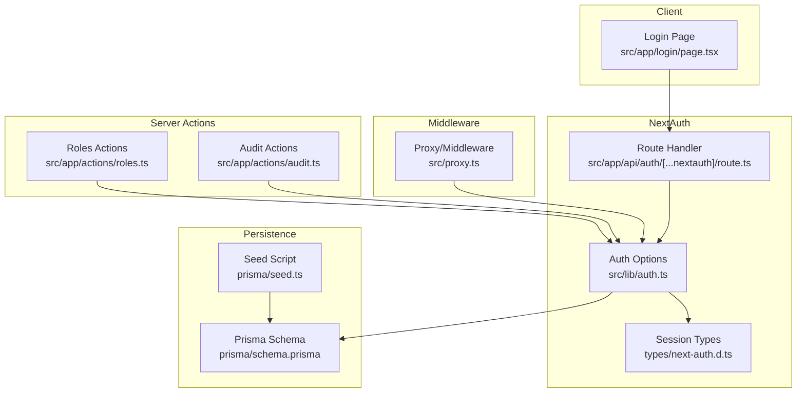
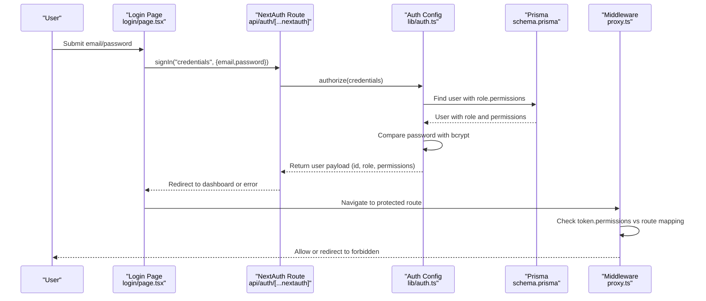
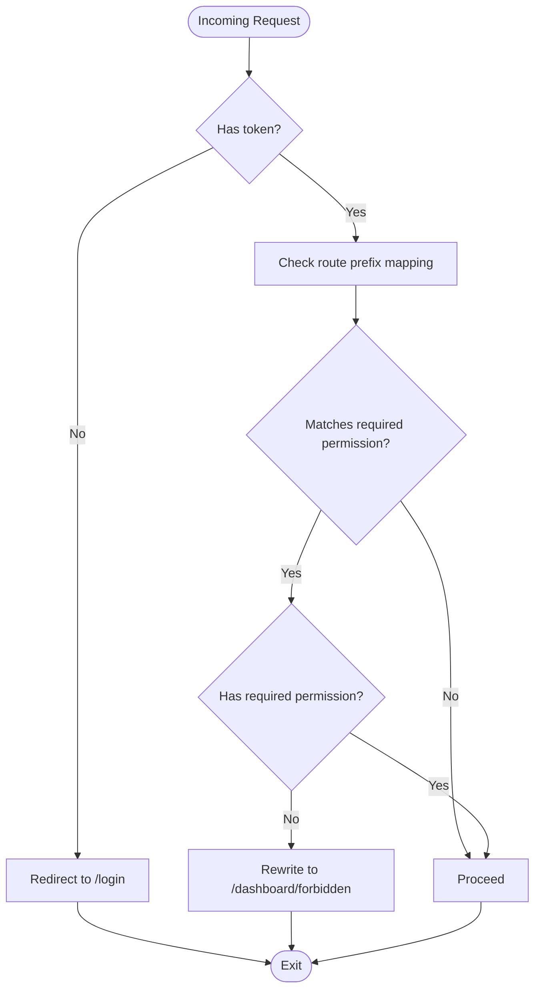
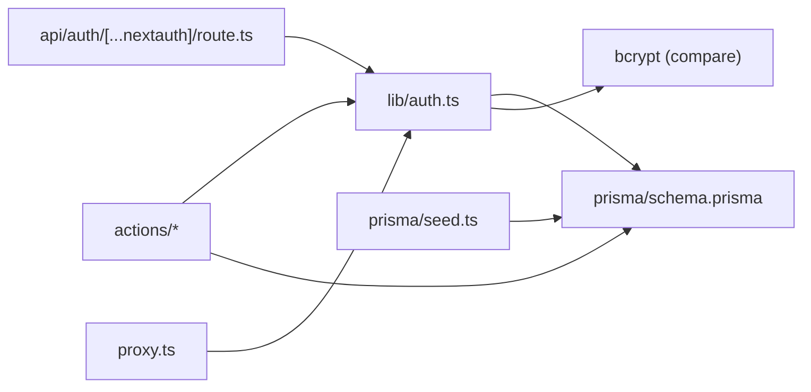

# Authentication & Authorization

<cite>
**Referenced Files in This Document**
- [auth.ts](file://src/lib/auth.ts)
- [permissions.ts](file://src/lib/permissions.ts)
- [next-auth.d.ts](file://types/next-auth.d.ts)
- [route.ts](file://src/app/api/auth/[...nextauth]/route.ts)
- [login/page.tsx](file://src/app/login/page.tsx)
- [proxy.ts](file://src/proxy.ts)
- [roles.ts](file://src/app/actions/roles.ts)
- [audit.ts](file://src/app/actions/audit.ts)
- [seed.ts](file://prisma/seed.ts)
- [schema.prisma](file://prisma/schema.prisma)
- [route.ts](file://src/app/api/users/route.ts)
</cite>

## Table of Contents
1. [Introduction](#introduction)
2. [Project Structure](#project-structure)
3. [Core Components](#core-components)
4. [Architecture Overview](#architecture-overview)
5. [Detailed Component Analysis](#detailed-component-analysis)
6. [Dependency Analysis](#dependency-analysis)
7. [Performance Considerations](#performance-considerations)
8. [Troubleshooting Guide](#troubleshooting-guide)
9. [Conclusion](#conclusion)
10. [Appendices](#appendices)

## Introduction
This document explains ApsAsrama’s authentication and authorization system built on NextAuth.js. It covers the NextAuth configuration, the custom credentials provider, bcrypt password verification, JWT-based session management, and the role-based access control (RBAC) model. It also documents permission checks, middleware-based route protection, audit logging, and security best practices.

## Project Structure
The authentication system spans several layers:
- NextAuth route handler exposes the OAuth-compatible endpoints under the NextAuth namespace.
- NextAuth configuration defines the credentials provider, JWT/session callbacks, and pages.
- TypeScript module augmentation extends session/user types to carry role and permissions.
- Middleware enforces route-level permissions using the session token.
- Actions enforce permission checks for server-side operations.
- Prisma models define the RBAC schema and audit logging.



**Diagram sources**
- [route.ts:1-7](file://src/app/api/auth/[...nextauth]/route.ts#L1-L7)
- [auth.ts:1-81](file://src/lib/auth.ts#L1-L81)
- [next-auth.d.ts:1-19](file://types/next-auth.d.ts#L1-L19)
- [proxy.ts:1-59](file://src/proxy.ts#L1-L59)
- [roles.ts:1-119](file://src/app/actions/roles.ts#L1-L119)
- [audit.ts:1-118](file://src/app/actions/audit.ts#L1-L118)
- [seed.ts:1-174](file://prisma/seed.ts#L1-L174)
- [schema.prisma:1-487](file://prisma/schema.prisma#L1-L487)

**Section sources**
- [route.ts:1-7](file://src/app/api/auth/[...nextauth]/route.ts#L1-L7)
- [auth.ts:1-81](file://src/lib/auth.ts#L1-L81)
- [next-auth.d.ts:1-19](file://types/next-auth.d.ts#L1-L19)
- [proxy.ts:1-59](file://src/proxy.ts#L1-L59)
- [roles.ts:1-119](file://src/app/actions/roles.ts#L1-L119)
- [audit.ts:1-118](file://src/app/actions/audit.ts#L1-L118)
- [seed.ts:1-174](file://prisma/seed.ts#L1-L174)
- [schema.prisma:1-487](file://prisma/schema.prisma#L1-L487)

## Core Components
- NextAuth configuration with a custom credentials provider and JWT/session callbacks.
- Permission utilities for server-side and client-side checks.
- Middleware enforcing route-level permissions.
- Prisma RBAC schema and seed script initializing permissions and roles.
- Audit logging for entity and administrative actions.

**Section sources**
- [auth.ts:6-81](file://src/lib/auth.ts#L6-L81)
- [permissions.ts:1-21](file://src/lib/permissions.ts#L1-L21)
- [proxy.ts:4-59](file://src/proxy.ts#L4-L59)
- [seed.ts:4-123](file://prisma/seed.ts#L4-L123)
- [schema.prisma:165-193](file://prisma/schema.prisma#L165-L193)

## Architecture Overview
The system authenticates users via credentials, verifies passwords using bcrypt, and builds a JWT containing role and permissions. Sessions are JWT-based, and middleware validates access to protected routes. Server actions enforce granular permissions per operation.



**Diagram sources**
- [login/page.tsx:16-34](file://src/app/login/page.tsx#L16-L34)
- [route.ts:1-7](file://src/app/api/auth/[...nextauth]/route.ts#L1-L7)
- [auth.ts:14-50](file://src/lib/auth.ts#L14-L50)
- [schema.prisma:10-25](file://prisma/schema.prisma#L10-L25)
- [proxy.ts:25-55](file://src/proxy.ts#L25-L55)

## Detailed Component Analysis

### NextAuth Configuration and Credentials Provider
- Provider: Credentials provider with email and password fields.
- Authorization: Loads user with role and permissions, compares bcrypt hashes, and returns a minimal user object for the session.
- Callbacks:
  - jwt: Stores role, permissions, id, and optional satkerId on the token.
  - session: Injects role, permissions, id, and satkerId into the session user object.
- Pages: Redirects unauthenticated users to the login page.
- Session: Uses JWT strategy with a secret from environment variables.

Security considerations:
- Password comparison uses bcrypt.
- Session strategy is JWT; ensure secure cookie policies and short-lived tokens where applicable.
- Environment secret is required for signing.

**Section sources**
- [auth.ts:6-81](file://src/lib/auth.ts#L6-L81)
- [login/page.tsx:21-33](file://src/app/login/page.tsx#L21-L33)

### Session Types Augmentation
- Extends NextAuth session and user types to include id, role, permissions, and optional satkerId.
- Ensures type-safe access to role and permissions across the app.

**Section sources**
- [next-auth.d.ts:1-19](file://types/next-auth.d.ts#L1-L19)

### Permission Utilities
- hasPermission(action): Checks if the current server session includes the requested permission code.
- requirePermission(action): Throws an error if the permission is missing.
- hasPermissionClient(permissions, action): Lightweight client-side check using provided permissions array.

Usage:
- Server actions wrap sensitive operations with requirePermission.
- UI components can gate features using hasPermissionClient.

**Section sources**
- [permissions.ts:1-21](file://src/lib/permissions.ts#L1-L21)

### Middleware-Based Route Protection
- Maps route prefixes to required permission codes.
- Validates presence of a session token and checks if user permissions include the required code.
- Redirects to a forbidden page if unauthorized.
- Applies to all paths under /dashboard.



**Diagram sources**
- [proxy.ts:25-55](file://src/proxy.ts#L25-L55)

**Section sources**
- [proxy.ts:4-59](file://src/proxy.ts#L4-L59)

### RBAC Model and Seed
- Models:
  - User: belongs to Role and optionally Satker.
  - Role: has many RolePermission entries linking to Permission.
  - Permission: defines module/action/code combinations.
  - RolePermission: junction table for role-permission relationships.
- Seed initializes default permissions and assigns them to SUPER_ADMIN.
- SUPER_ADMIN is system-protected and cannot be modified via UI.

```mermaid
erDiagram
USER {
string id PK
string name
string email UK
string password
string? roleId FK
string? satkerId FK
}
ROLE {
string id PK
string name UK
boolean isSystem
}
PERMISSION {
string id PK
string module
string action
string code UK
}
ROLE_PERMISSION {
string roleId PK,FK
string permissionId PK,FK
}
SATKER {
string id PK
string name UK
}
USER ||--o{ ROLE : "belongsTo"
ROLE ||--o{ ROLE_PERMISSION : "has"
PERMISSION ||--o{ ROLE_PERMISSION : "included in"
USER ||--o{ SATKER : "belongs to"
```

**Diagram sources**
- [schema.prisma:10-25](file://prisma/schema.prisma#L10-L25)
- [schema.prisma:165-193](file://prisma/schema.prisma#L165-L193)

**Section sources**
- [seed.ts:4-73](file://prisma/seed.ts#L4-L73)
- [seed.ts:75-123](file://prisma/seed.ts#L75-L123)
- [schema.prisma:165-193](file://prisma/schema.prisma#L165-L193)

### Role Management Actions
- getRoles/getPermissions: Enforce role.view permission before returning data.
- createRole/updateRole/deleteRole: Enforce role.create/update/delete permissions and apply business rules (e.g., preventing updates to SUPER_ADMIN).
- Uses transactions to safely update role-permission mappings.

**Section sources**
- [roles.ts:7-27](file://src/app/actions/roles.ts#L7-L27)
- [roles.ts:29-39](file://src/app/actions/roles.ts#L29-L39)
- [roles.ts:41-64](file://src/app/actions/roles.ts#L41-L64)
- [roles.ts:66-102](file://src/app/actions/roles.ts#L66-L102)
- [roles.ts:104-119](file://src/app/actions/roles.ts#L104-L119)

### Audit Logging
- getEntityAuditLogs: Fetches logs for a specific entity type and ID.
- getAuditLogs: Requires audit.view permission; supports filtering by action, performedBy, entityType, date range, and free-text search across JSON fields.
- getAuditLogActions: Lists distinct actions with audit.view permission.

**Section sources**
- [audit.ts:8-25](file://src/app/actions/audit.ts#L8-L25)
- [audit.ts:27-98](file://src/app/actions/audit.ts#L27-L98)
- [audit.ts:100-117](file://src/app/actions/audit.ts#L100-L117)

### API Endpoint Protection and Middleware
- Protected routes:
  - Dashboard routes are protected by middleware that checks permissions.
  - Server actions enforce permissions per operation.
- Public API endpoints:
  - Example users route returns 404, indicating intentional lack of public listing.

**Section sources**
- [proxy.ts:4-59](file://src/proxy.ts#L4-L59)
- [roles.ts:8-10](file://src/app/actions/roles.ts#L8-L10)
- [route.ts:3-5](file://src/app/api/users/route.ts#L3-L5)

## Dependency Analysis
- NextAuth route handler depends on the auth configuration.
- Auth configuration depends on Prisma for user lookup and bcrypt for password comparison.
- Middleware depends on NextAuth token to enforce permissions.
- Server actions depend on NextAuth session and Prisma for data access.
- Seed script depends on Prisma to initialize permissions and roles.



**Diagram sources**
- [route.ts:1-7](file://src/app/api/auth/[...nextauth]/route.ts#L1-L7)
- [auth.ts:1-81](file://src/lib/auth.ts#L1-L81)
- [proxy.ts:1-59](file://src/proxy.ts#L1-L59)
- [roles.ts:1-119](file://src/app/actions/roles.ts#L1-L119)
- [seed.ts:1-174](file://prisma/seed.ts#L1-L174)
- [schema.prisma:1-487](file://prisma/schema.prisma#L1-L487)

**Section sources**
- [route.ts:1-7](file://src/app/api/auth/[...nextauth]/route.ts#L1-L7)
- [auth.ts:1-81](file://src/lib/auth.ts#L1-L81)
- [proxy.ts:1-59](file://src/proxy.ts#L1-L59)
- [roles.ts:1-119](file://src/app/actions/roles.ts#L1-L119)
- [seed.ts:1-174](file://prisma/seed.ts#L1-L174)
- [schema.prisma:1-487](file://prisma/schema.prisma#L1-L487)

## Performance Considerations
- JWT-based sessions reduce server-side session storage overhead.
- Password hashing uses bcrypt; tune cost appropriately for your environment.
- Middleware performs in-memory permission checks; keep the permission list concise.
- Server actions should avoid redundant queries by leveraging included relations during authorization.

## Troubleshooting Guide
Common issues and resolutions:
- Invalid credentials:
  - The credentials provider returns null if email/password are missing or invalid; the login page displays an error and prevents navigation.
- Missing NEXTAUTH_SECRET:
  - JWT signing requires a secret; ensure it is configured in the environment.
- Unauthorized access to dashboard:
  - Middleware redirects to login if no token or to forbidden if insufficient permissions.
- Permission errors in server actions:
  - requirePermission throws an error if the current session lacks the required permission code.

**Section sources**
- [auth.ts:14-50](file://src/lib/auth.ts#L14-L50)
- [login/page.tsx:27-33](file://src/app/login/page.tsx#L27-L33)
- [proxy.ts:30-46](file://src/proxy.ts#L30-L46)
- [permissions.ts:11-16](file://src/lib/permissions.ts#L11-L16)

## Conclusion
ApsAsrama’s authentication and authorization system leverages NextAuth.js with a custom credentials provider and bcrypt for secure authentication. JWT-based sessions carry role and permission data, enabling robust middleware and server-action-level enforcement. The RBAC model, seeded with comprehensive permissions, supports fine-grained access control across modules. Audit logging captures administrative and data changes for compliance and traceability.

## Appendices

### Permission Matrix Overview
- Permissions are defined as module.action.code tuples.
- Default permissions include views, creates, updates, deletes, and exports across modules such as Dashboard, Formulir, Santri, Muallim, Penugasan, Monitoring, Absensi, Area, Akademik, KBM, Role User, Satker, Pengaturan, Laporan, Wilayah Administratif, and Audit Log.
- SUPER_ADMIN receives all permissions by default.

**Section sources**
- [seed.ts:4-73](file://prisma/seed.ts#L4-L73)
- [seed.ts:75-123](file://prisma/seed.ts#L75-L123)

### Security Best Practices
- Use HTTPS in production and secure cookies.
- Rotate NEXTAUTH_SECRET regularly.
- Limit JWT lifetime and refresh tokens if needed.
- Enforce permission checks at both middleware and server action levels.
- Log and alert on repeated failed login attempts.
- Regularly review and prune unused permissions and roles.