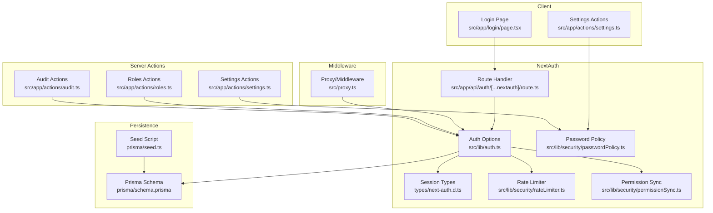
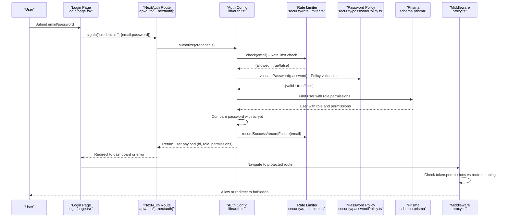
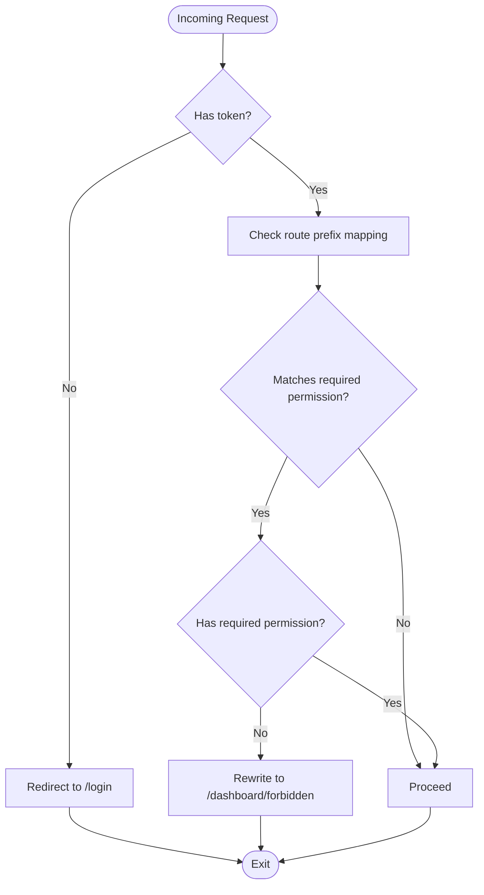
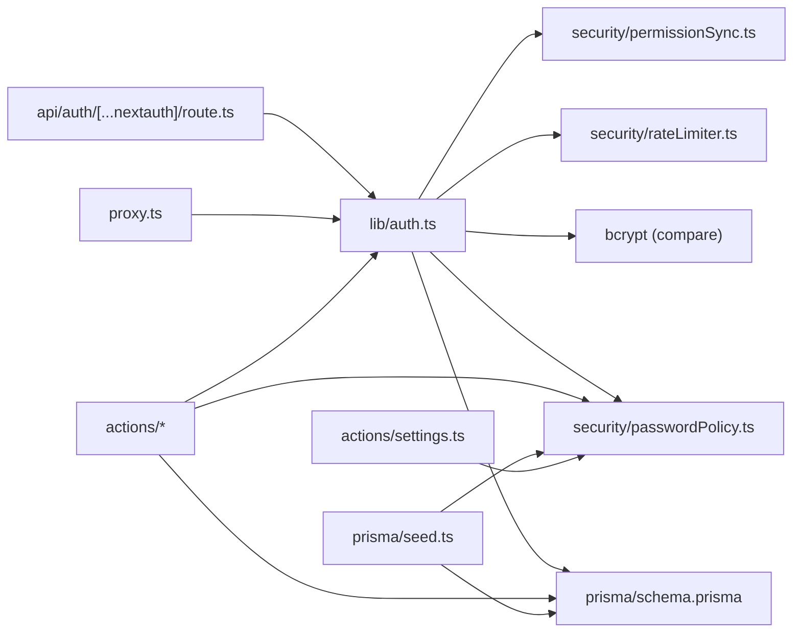

# Authentication & Authorization

<cite>
**Referenced Files in This Document**
- [auth.ts](file://src/lib/auth.ts)
- [permissions.ts](file://src/lib/permissions.ts)
- [next-auth.d.ts](file://types/next-auth.d.ts)
- [route.ts](file://src/app/api/auth/[...nextauth]/route.ts)
- [login/page.tsx](file://src/app/login/page.tsx)
- [proxy.ts](file://src/proxy.ts)
- [roles.ts](file://src/app/actions/roles.ts)
- [audit.ts](file://src/app/actions/audit.ts)
- [seed.ts](file://prisma/seed.ts)
- [schema.prisma](file://prisma/schema.prisma)
- [route.ts](file://src/app/api/users/route.ts)
- [rateLimiter.ts](file://src/lib/security/rateLimiter.ts)
- [permissionSync.ts](file://src/lib/security/permissionSync.ts)
- [passwordPolicy.ts](file://src/lib/security/passwordPolicy.ts)
- [settings.ts](file://src/app/actions/settings.ts)
- [route.ts](file://src/app/api/seed/route.ts)
</cite>

## Update Summary
**Changes Made**
- Added comprehensive password policy enforcement with centralized validation rules
- Implemented dynamic permission synchronization with 30-minute refresh intervals
- Enhanced NextAuth configuration with login rate limiting during authorize phase
- Added fail-open security patterns for rate limiting and permission refresh
- Updated session management with 8-hour maximum age and 30-minute update intervals

## Table of Contents
1. [Introduction](#introduction)
2. [Project Structure](#project-structure)
3. [Core Components](#core-components)
4. [Architecture Overview](#architecture-overview)
5. [Detailed Component Analysis](#detailed-component-analysis)
6. [Dependency Analysis](#dependency-analysis)
7. [Performance Considerations](#performance-considerations)
8. [Troubleshooting Guide](#troubleshooting-guide)
9. [Conclusion](#conclusion)
10. [Appendices](#appendices)

## Introduction
This document explains ApsAsrama's authentication and authorization system built on NextAuth.js. It covers the NextAuth configuration, the custom credentials provider, bcrypt password verification, JWT-based session management, and the role-based access control (RBAC) model. The system now includes comprehensive password policy enforcement, dynamic permission synchronization, and login rate limiting capabilities for enhanced security and operational efficiency.

## Project Structure
The authentication system spans several layers with enhanced security features:
- NextAuth route handler exposes the OAuth-compatible endpoints under the NextAuth namespace.
- NextAuth configuration defines the credentials provider, JWT/session callbacks, and pages.
- TypeScript module augmentation extends session/user types to carry role and permissions.
- Middleware enforces route-level permissions using the session token.
- Server actions enforce permission checks for server-side operations.
- Prisma models define the RBAC schema and audit logging.
- **New**: Password policy enforcement module provides centralized validation rules.
- **New**: Dynamic permission synchronization with configurable refresh intervals.
- **New**: Login rate limiting with fail-open security patterns.

```mermaid
graph TB
subgraph "Client"
Login["Login Page<br/>src/app/login/page.tsx"]
Settings["Settings Actions<br/>src/app/actions/settings.ts"]
end
subgraph "NextAuth"
RouteHandler["Route Handler<br/>src/app/api/auth/[...nextauth]/route.ts"]
Config["Auth Options<br/>src/lib/auth.ts"]
Types["Session Types<br/>types/next-auth.d.ts"]
RateLimiter["Rate Limiter<br/>src/lib/security/rateLimiter.ts"]
PermissionSync["Permission Sync<br/>src/lib/security/permissionSync.ts"]
PasswordPolicy["Password Policy<br/>src/lib/security/passwordPolicy.ts"]
end
subgraph "Middleware"
Proxy["Proxy/Middleware<br/>src/proxy.ts"]
end
subgraph "Server Actions"
Roles["Roles Actions<br/>src/app/actions/roles.ts"]
Audit["Audit Actions<br/>src/app/actions/audit.ts"]
SettingsAction["Settings Actions<br/>src/app/actions/settings.ts"]
end
subgraph "Persistence"
PrismaSchema["Prisma Schema<br/>prisma/schema.prisma"]
Seed["Seed Script<br/>prisma/seed.ts"]
end
Login --> RouteHandler
Settings --> PasswordPolicy
RouteHandler --> Config
Config --> Types
Config --> RateLimiter
Config --> PermissionSync
Proxy --> Config
Roles --> Config
Audit --> Config
SettingsAction --> PasswordPolicy
Config --> PrismaSchema
Seed --> PrismaSchema
```

**Diagram sources**
- [route.ts:1-7](file://src/app/api/auth/[...nextauth]/route.ts#L1-L7)
- [auth.ts:1-132](file://src/lib/auth.ts#L1-L132)
- [next-auth.d.ts:1-19](file://types/next-auth.d.ts#L1-L19)
- [proxy.ts:1-59](file://src/proxy.ts#L1-L59)
- [roles.ts:1-119](file://src/app/actions/roles.ts#L1-L119)
- [audit.ts:1-118](file://src/app/actions/audit.ts#L1-L118)
- [seed.ts:1-187](file://prisma/seed.ts#L1-L187)
- [schema.prisma:1-487](file://prisma/schema.prisma#L1-L487)
- [rateLimiter.ts:1-142](file://src/lib/security/rateLimiter.ts#L1-L142)
- [permissionSync.ts:1-83](file://src/lib/security/permissionSync.ts#L1-L83)
- [passwordPolicy.ts:1-112](file://src/lib/security/passwordPolicy.ts#L1-L112)
- [settings.ts:1-140](file://src/app/actions/settings.ts#L1-L140)

**Section sources**
- [route.ts:1-7](file://src/app/api/auth/[...nextauth]/route.ts#L1-L7)
- [auth.ts:1-132](file://src/lib/auth.ts#L1-L132)
- [next-auth.d.ts:1-19](file://types/next-auth.d.ts#L1-L19)
- [proxy.ts:1-59](file://src/proxy.ts#L1-L59)
- [roles.ts:1-119](file://src/app/actions/roles.ts#L1-L119)
- [audit.ts:1-118](file://src/app/actions/audit.ts#L1-L118)
- [seed.ts:1-187](file://prisma/seed.ts#L1-L187)
- [schema.prisma:1-487](file://prisma/schema.prisma#L1-L487)

## Core Components
- NextAuth configuration with a custom credentials provider and JWT/session callbacks.
- **Enhanced**: Login rate limiting with sliding window algorithm and fail-open security.
- **Enhanced**: Dynamic permission synchronization with 30-minute refresh intervals.
- **New**: Comprehensive password policy enforcement with centralized validation rules.
- Permission utilities for server-side and client-side checks.
- Middleware enforcing route-level permissions.
- Prisma RBAC schema and seed script initializing permissions and roles.
- Audit logging for entity and administrative actions.

**Section sources**
- [auth.ts:6-132](file://src/lib/auth.ts#L6-L132)
- [rateLimiter.ts:1-142](file://src/lib/security/rateLimiter.ts#L1-L142)
- [permissionSync.ts:1-83](file://src/lib/security/permissionSync.ts#L1-L83)
- [passwordPolicy.ts:1-112](file://src/lib/security/passwordPolicy.ts#L1-L112)
- [permissions.ts:1-21](file://src/lib/permissions.ts#L1-L21)
- [proxy.ts:4-59](file://src/proxy.ts#L4-L59)
- [seed.ts:4-123](file://prisma/seed.ts#L4-L123)
- [schema.prisma:165-193](file://prisma/schema.prisma#L165-L193)

## Architecture Overview
The system authenticates users via credentials with comprehensive security measures. It includes password policy validation, login rate limiting, dynamic permission synchronization, and JWT-based session management with automatic permission refresh. Middleware validates access to protected routes, while server actions enforce granular permissions per operation.

```mermaid
sequenceDiagram
participant U as "User"
participant LP as "Login Page<br/>login/page.tsx"
participant NA as "NextAuth Route<br/>api/auth/[...nextauth]"
participant AC as "Auth Config<br/>lib/auth.ts"
participant RL as "Rate Limiter<br/>security/rateLimiter.ts"
participant PS as "Password Policy<br/>security/passwordPolicy.ts"
participant PR as "Prisma<br/>schema.prisma"
participant MW as "Middleware<br/>proxy.ts"
U->>LP : Submit email/password
LP->>NA : signIn("credentials", {email,password})
NA->>AC : authorize(credentials)
AC->>RL : check(email) - Rate limit check
RL-->>AC : {allowed : true/false}
AC->>PS : validatePassword(password) - Policy validation
PS-->>AC : {valid : true/false}
AC->>PR : Find user with role.permissions
PR-->>AC : User with role and permissions
AC->>AC : Compare password with bcrypt
AC->>RL : recordSuccess/recordFailure(email)
AC-->>NA : Return user payload (id, role, permissions)
NA-->>LP : Redirect to dashboard or error
LP->>MW : Navigate to protected route
MW->>MW : Check token.permissions vs route mapping
MW-->>U : Allow or redirect to forbidden
```

**Diagram sources**
- [login/page.tsx:16-34](file://src/app/login/page.tsx#L16-L34)
- [route.ts:1-7](file://src/app/api/auth/[...nextauth]/route.ts#L1-L7)
- [auth.ts:16-76](file://src/lib/auth.ts#L16-L76)
- [rateLimiter.ts:44-78](file://src/lib/security/rateLimiter.ts#L44-L78)
- [passwordPolicy.ts:77-90](file://src/lib/security/passwordPolicy.ts#L77-L90)
- [schema.prisma:10-25](file://prisma/schema.prisma#L10-L25)
- [proxy.ts:25-55](file://src/proxy.ts#L25-L55)

## Detailed Component Analysis

### Enhanced NextAuth Configuration and Credentials Provider
- Provider: Credentials provider with email and password fields.
- **Enhanced**: Rate limiting check during authorization phase using sliding window algorithm.
- **Enhanced**: Password policy validation using centralized validation rules.
- Authorization: Loads user with role and permissions, compares bcrypt hashes, and returns a minimal user object for the session.
- **Enhanced**: Dynamic permission refresh logic in JWT callback with 30-minute intervals.
- Callbacks:
  - jwt: Stores role, permissions, id, and optional satkerId on the token with lastPermissionSync timestamp.
  - session: Injects role, permissions, id, and satkerId into the session user object.
- Session: Uses JWT strategy with 8-hour maximum age and 30-minute update intervals.
- Pages: Redirects unauthenticated users to the login page.
- Secret: Uses environment variable for JWT signing.

Security considerations:
- **Enhanced**: Rate limiting prevents brute force attacks with fail-open security patterns.
- **Enhanced**: Password policy enforcement ensures strong password requirements.
- **Enhanced**: Dynamic permission synchronization maintains up-to-date access controls.
- Password comparison uses bcrypt.
- Session strategy is JWT with secure cookie policies and appropriate token lifetimes.

**Section sources**
- [auth.ts:8-132](file://src/lib/auth.ts#L8-L132)
- [login/page.tsx:21-33](file://src/app/login/page.tsx#L21-L33)

### Login Rate Limiting System
- **New**: Sliding window rate limiter with configurable parameters (5 attempts per 15 minutes).
- **New**: Lockout mechanism prevents further attempts for 15 minutes after threshold exceeded.
- **New**: Fail-open security pattern ensures system continues operating even if rate limiter fails.
- **New**: Cleanup mechanism removes expired entries automatically.
- **New**: Thread-safe operations with proper error handling.

Configuration:
- Max attempts: 5 per 15-minute window
- Lockout duration: 15 minutes
- Cleanup interval: 1 minute
- Memory-based storage with lazy cleanup

**Section sources**
- [rateLimiter.ts:1-142](file://src/lib/security/rateLimiter.ts#L1-L142)

### Dynamic Permission Synchronization
- **New**: Permission refresh logic integrated into JWT callback with 30-minute intervals.
- **New**: Fail-open pattern preserves existing permissions if database queries fail.
- **New**: Automatic permission updates when user roles or permissions change.
- **New**: Support for user deletion scenarios with automatic permission clearing.
- **New**: Configurable refresh interval matching session updateAge setting.

Behavior:
- First login: immediate permission sync
- Subsequent requests: permission refresh every 30 minutes
- Database failures: keep existing permissions (fail-open)
- User deletion: clear all permissions automatically

**Section sources**
- [permissionSync.ts:1-83](file://src/lib/security/permissionSync.ts#L1-L83)
- [auth.ts:78-111](file://src/lib/auth.ts#L78-L111)

### Password Policy Enforcement
- **New**: Centralized password validation with comprehensive requirements.
- **New**: Configurable minimum length (8 characters).
- **New**: Multi-criteria validation including uppercase, lowercase, numbers, and special characters.
- **New**: Indonesian language error messages for user feedback.
- **New**: Reusable validation functions for consistent enforcement across the application.

Requirements:
- Minimum 8 characters
- At least 1 uppercase letter (A-Z)
- At least 1 lowercase letter (a-z)
- At least 1 digit (0-9)
- At least 1 special character

**Section sources**
- [passwordPolicy.ts:1-112](file://src/lib/security/passwordPolicy.ts#L1-L112)

### Session Types Augmentation
- Extends NextAuth session and user types to include id, role, permissions, and optional satkerId.
- **Enhanced**: Adds lastPermissionSync timestamp for dynamic permission tracking.
- Ensures type-safe access to role and permissions across the app.

**Section sources**
- [next-auth.d.ts:1-19](file://types/next-auth.d.ts#L1-L19)

### Permission Utilities
- hasPermission(action): Checks if the current server session includes the requested permission code.
- requirePermission(action): Throws an error if the permission is missing.
- hasPermissionClient(permissions, action): Lightweight client-side check using provided permissions array.

Usage:
- Server actions wrap sensitive operations with requirePermission.
- UI components can gate features using hasPermissionClient.

**Section sources**
- [permissions.ts:1-21](file://src/lib/permissions.ts#L1-L21)

### Middleware-Based Route Protection
- Maps route prefixes to required permission codes.
- Validates presence of a session token and checks if user permissions include the required code.
- Redirects to a forbidden page if unauthorized.
- Applies to all paths under /dashboard.

```mermaid
flowchart TD
Start(["Incoming Request"]) --> HasToken{"Has token?"}
HasToken --> |No| RedirectLogin["Redirect to /login"]
HasToken --> |Yes| CheckRoute["Check route prefix mapping"]
CheckRoute --> Match{"Matches required permission?"}
Match --> |No| Next["Proceed"]
Match --> |Yes| HasPerm{"Has required permission?"}
HasPerm --> |No| Forbidden["Rewrite to /dashboard/forbidden"]
HasPerm --> |Yes| Next
RedirectLogin --> End(["Exit"])
Forbidden --> End
Next --> End
```

**Diagram sources**
- [proxy.ts:25-55](file://src/proxy.ts#L25-L55)

**Section sources**
- [proxy.ts:4-59](file://src/proxy.ts#L4-L59)

### RBAC Model and Seed
- Models:
  - User: belongs to Role and optionally Satker.
  - Role: has many RolePermission entries linking to Permission.
  - Permission: defines module/action/code combinations.
  - RolePermission: junction table for role-permission relationships.
- Seed initializes default permissions and assigns them to SUPER_ADMIN.
- **Enhanced**: Password policy validation during seed process.
- SUPER_ADMIN is system-protected and cannot be modified via UI.

```mermaid
erDiagram
USER {
string id PK
string name
string email UK
string password
string? roleId FK
string? satkerId FK
}
ROLE {
string id PK
string name UK
boolean isSystem
}
PERMISSION {
string id PK
string module
string action
string code UK
}
ROLE_PERMISSION {
string roleId PK,FK
string permissionId PK,FK
}
SATKER {
string id PK
string name UK
}
USER ||--o{ ROLE : "belongsTo"
ROLE ||--o{ ROLE_PERMISSION : "has"
PERMISSION ||--o{ ROLE_PERMISSION : "included in"
USER ||--o{ SATKER : "belongs to"
```

**Diagram sources**
- [schema.prisma:10-25](file://prisma/schema.prisma#L10-L25)
- [schema.prisma:165-193](file://prisma/schema.prisma#L165-L193)

**Section sources**
- [seed.ts:4-73](file://prisma/seed.ts#L4-L73)
- [seed.ts:75-123](file://prisma/seed.ts#L75-L123)
- [seed.ts:140-177](file://prisma/seed.ts#L140-L177)
- [schema.prisma:165-193](file://prisma/schema.prisma#L165-L193)

### Role Management Actions
- getRoles/getPermissions: Enforce role.view permission before returning data.
- createRole/updateRole/deleteRole: Enforce role.create/update/delete permissions and apply business rules (e.g., preventing updates to SUPER_ADMIN).
- Uses transactions to safely update role-permission mappings.

**Section sources**
- [roles.ts:7-27](file://src/app/actions/roles.ts#L7-L27)
- [roles.ts:29-39](file://src/app/actions/roles.ts#L29-L39)
- [roles.ts:41-64](file://src/app/actions/roles.ts#L41-L64)
- [roles.ts:66-102](file://src/app/actions/roles.ts#L66-L102)
- [roles.ts:104-119](file://src/app/actions/roles.ts#L104-L119)

### Audit Logging
- getEntityAuditLogs: Fetches logs for a specific entity type and ID.
- getAuditLogs: Requires audit.view permission; supports filtering by action, performedBy, entityType, date range, and free-text search across JSON fields.
- getAuditLogActions: Lists distinct actions with audit.view permission.

**Section sources**
- [audit.ts:8-25](file://src/app/actions/audit.ts#L8-L25)
- [audit.ts:27-98](file://src/app/actions/audit.ts#L27-L98)
- [audit.ts:100-117](file://src/app/actions/audit.ts#L100-L117)

### API Endpoint Protection and Middleware
- Protected routes:
  - Dashboard routes are protected by middleware that checks permissions.
  - Server actions enforce permissions per operation.
- Public API endpoints:
  - Example users route returns 404, indicating intentional lack of public listing.

**Section sources**
- [proxy.ts:4-59](file://src/proxy.ts#L4-L59)
- [roles.ts:8-10](file://src/app/actions/roles.ts#L8-L10)
- [route.ts:3-5](file://src/app/api/users/route.ts#L3-L5)

### Password Policy Integration in Settings
- **New**: Password policy validation during user creation and password updates.
- **New**: Comprehensive error reporting with specific policy violations.
- **New**: Secure password hashing with bcrypt cost factor 10.

Features:
- User creation with password validation
- Profile password updates with current password verification
- Error handling for policy violations
- Secure password storage

**Section sources**
- [settings.ts:42-43](file://src/app/actions/settings.ts#L42-L43)
- [settings.ts:126-127](file://src/app/actions/settings.ts#L126-L127)

## Dependency Analysis
- NextAuth route handler depends on the auth configuration.
- **Enhanced**: Auth configuration depends on Prisma for user lookup, bcrypt for password comparison, rate limiter for security, and permission sync for dynamic updates.
- **Enhanced**: Rate limiter depends on in-memory storage and implements cleanup mechanisms.
- **Enhanced**: Permission sync module provides testable logic for permission refresh.
- **Enhanced**: Password policy module provides centralized validation across the application.
- Middleware depends on NextAuth token to enforce permissions.
- Server actions depend on NextAuth session and Prisma for data access.
- Seed script depends on Prisma and password policy for initialization.
- Settings actions depend on password policy for validation.

```mermaid
graph LR
RouteHandler["api/auth/[...nextauth]/route.ts"] --> AuthConfig["lib/auth.ts"]
AuthConfig --> Prisma["prisma/schema.prisma"]
AuthConfig --> Bcrypt["bcrypt (compare)"]
AuthConfig --> RateLimiter["security/rateLimiter.ts"]
AuthConfig --> PermissionSync["security/permissionSync.ts"]
AuthConfig --> PasswordPolicy["security/passwordPolicy.ts"]
Middleware["proxy.ts"] --> AuthConfig
Actions["actions/*"] --> AuthConfig
Actions --> Prisma
Actions --> PasswordPolicy
Seed["prisma/seed.ts"] --> Prisma
Seed --> PasswordPolicy
Settings["actions/settings.ts"] --> PasswordPolicy
```

**Diagram sources**
- [route.ts:1-7](file://src/app/api/auth/[...nextauth]/route.ts#L1-L7)
- [auth.ts:1-132](file://src/lib/auth.ts#L1-L132)
- [proxy.ts:1-59](file://src/proxy.ts#L1-L59)
- [roles.ts:1-119](file://src/app/actions/roles.ts#L1-L119)
- [seed.ts:1-187](file://prisma/seed.ts#L1-L187)
- [schema.prisma:1-487](file://prisma/schema.prisma#L1-L487)
- [rateLimiter.ts:1-142](file://src/lib/security/rateLimiter.ts#L1-L142)
- [permissionSync.ts:1-83](file://src/lib/security/permissionSync.ts#L1-L83)
- [passwordPolicy.ts:1-112](file://src/lib/security/passwordPolicy.ts#L1-L112)
- [settings.ts:1-140](file://src/app/actions/settings.ts#L1-L140)

**Section sources**
- [route.ts:1-7](file://src/app/api/auth/[...nextauth]/route.ts#L1-L7)
- [auth.ts:1-132](file://src/lib/auth.ts#L1-L132)
- [proxy.ts:1-59](file://src/proxy.ts#L1-L59)
- [roles.ts:1-119](file://src/app/actions/roles.ts#L1-L119)
- [seed.ts:1-187](file://prisma/seed.ts#L1-L187)
- [schema.prisma:1-487](file://prisma/schema.prisma#L1-L487)

## Performance Considerations
- JWT-based sessions reduce server-side session storage overhead.
- **Enhanced**: Rate limiting uses in-memory storage for low latency with automatic cleanup.
- **Enhanced**: Dynamic permission synchronization occurs only every 30 minutes to minimize database queries.
- Password hashing uses bcrypt with cost factor 10; tune appropriately for your environment.
- Middleware performs in-memory permission checks; keep the permission list concise.
- Server actions should avoid redundant queries by leveraging included relations during authorization.
- **Enhanced**: Permission refresh is fail-open to prevent service disruption during database issues.

## Troubleshooting Guide
Common issues and resolutions:
- Invalid credentials:
  - The credentials provider returns null if email/password are missing or invalid; the login page displays an error and prevents navigation.
  - **Enhanced**: Rate limiter may block login attempts after multiple failures.
- Missing NEXTAUTH_SECRET:
  - JWT signing requires a secret; ensure it is configured in the environment.
- Unauthorized access to dashboard:
  - Middleware redirects to login if no token or to forbidden if insufficient permissions.
- Permission errors in server actions:
  - requirePermission throws an error if the current session lacks the required permission code.
- **Enhanced**: Rate limiting blocking legitimate users:
  - Users may be temporarily blocked after 5 failed attempts; wait for lockout period to expire.
- **Enhanced**: Permission synchronization delays:
  - Permission changes may take up to 30 minutes to take effect due to refresh interval.
- **Enhanced**: Password policy violations:
  - User creation/updates fail if password doesn't meet policy requirements; check error messages for specific requirements.

**Section sources**
- [auth.ts:16-76](file://src/lib/auth.ts#L16-L76)
- [login/page.tsx:27-33](file://src/app/login/page.tsx#L27-L33)
- [proxy.ts:30-46](file://src/proxy.ts#L30-L46)
- [permissions.ts:11-16](file://src/lib/permissions.ts#L11-L16)
- [rateLimiter.ts:44-78](file://src/lib/security/rateLimiter.ts#L44-L78)
- [passwordPolicy.ts:77-90](file://src/lib/security/passwordPolicy.ts#L77-L90)

## Conclusion
ApsAsrama's authentication and authorization system leverages NextAuth.js with a custom credentials provider and bcrypt for secure authentication. The system has been significantly enhanced with comprehensive password policy enforcement, dynamic permission synchronization, and login rate limiting capabilities. JWT-based sessions with 8-hour maximum age and 30-minute update intervals carry role and permission data, enabling robust middleware and server-action-level enforcement. The fail-open security patterns ensure system reliability even during rate limiter or database failures. The RBAC model, seeded with comprehensive permissions, supports fine-grained access control across modules with automatic permission refresh for operational efficiency.

## Appendices

### Permission Matrix Overview
- Permissions are defined as module.action.code tuples.
- Default permissions include views, creates, updates, deletes, and exports across modules such as Dashboard, Formulir, Santri, Muallim, Penugasan, Monitoring, Absensi, Area, Akademik, KBM, Role User, Satker, Pengaturan, Laporan, Wilayah Administratif, and Audit Log.
- SUPER_ADMIN receives all permissions by default.

**Section sources**
- [seed.ts:4-73](file://prisma/seed.ts#L4-L73)
- [seed.ts:75-123](file://prisma/seed.ts#L75-L123)

### Security Best Practices
- Use HTTPS in production and secure cookies.
- Rotate NEXTAUTH_SECRET regularly.
- **Enhanced**: Monitor rate limiter effectiveness and adjust thresholds as needed.
- **Enhanced**: Regularly review password policy requirements and update as security standards evolve.
- **Enhanced**: Monitor permission synchronization performance and adjust refresh intervals if needed.
- Limit JWT lifetime and refresh tokens if needed.
- Enforce permission checks at both middleware and server action levels.
- **Enhanced**: Implement monitoring for rate limiting events and potential abuse detection.
- **Enhanced**: Regularly audit permission changes and synchronization logs.
- Log and alert on repeated failed login attempts.
- Regularly review and prune unused permissions and roles.
- **Enhanced**: Monitor database connectivity for permission refresh operations.

### Password Policy Requirements
- **Enhanced**: Minimum 8 characters required.
- **Enhanced**: At least 1 uppercase letter (A-Z).
- **Enhanced**: At least 1 lowercase letter (a-z).
- **Enhanced**: At least 1 digit (0-9).
- **Enhanced**: At least 1 special character.
- **Enhanced**: Indonesian language error messages for user feedback.

**Section sources**
- [passwordPolicy.ts:26-58](file://src/lib/security/passwordPolicy.ts#L26-L58)

### Rate Limiting Configuration
- **Enhanced**: 5 failed attempts per 15-minute sliding window.
- **Enhanced**: 15-minute lockout duration after threshold exceeded.
- **Enhanced**: 1-minute cleanup interval for memory management.
- **Enhanced**: Fail-open security pattern for system reliability.

**Section sources**
- [rateLimiter.ts:15-20](file://src/lib/security/rateLimiter.ts#L15-L20)

### Dynamic Permission Synchronization
- **Enhanced**: 30-minute refresh interval matching session updateAge.
- **Enhanced**: Fail-open pattern preserves existing permissions during database failures.
- **Enhanced**: Automatic permission clearing for deleted users.
- **Enhanced**: Support for role and permission changes without logout requirement.

**Section sources**
- [permissionSync.ts:11-23](file://src/lib/security/permissionSync.ts#L11-L23)
- [auth.ts:96-108](file://src/lib/auth.ts#L96-L108)