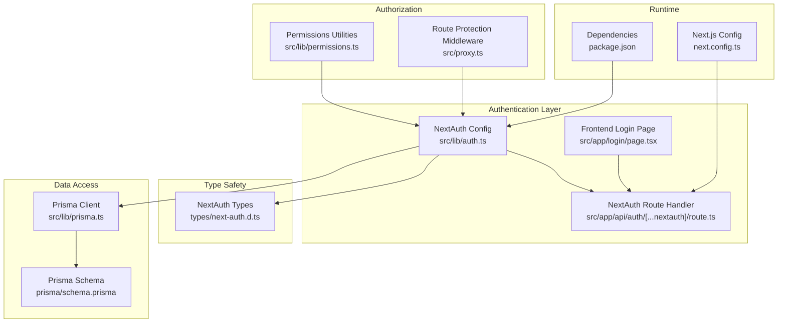
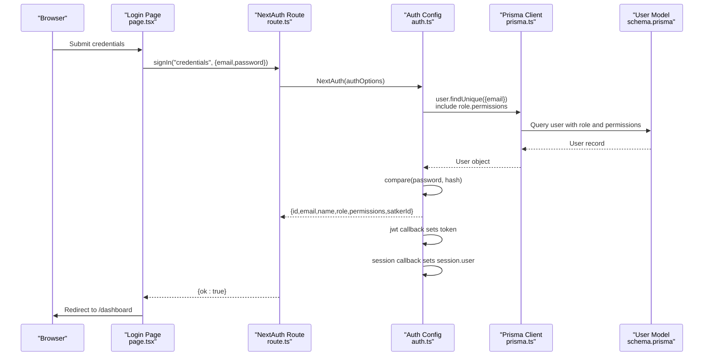
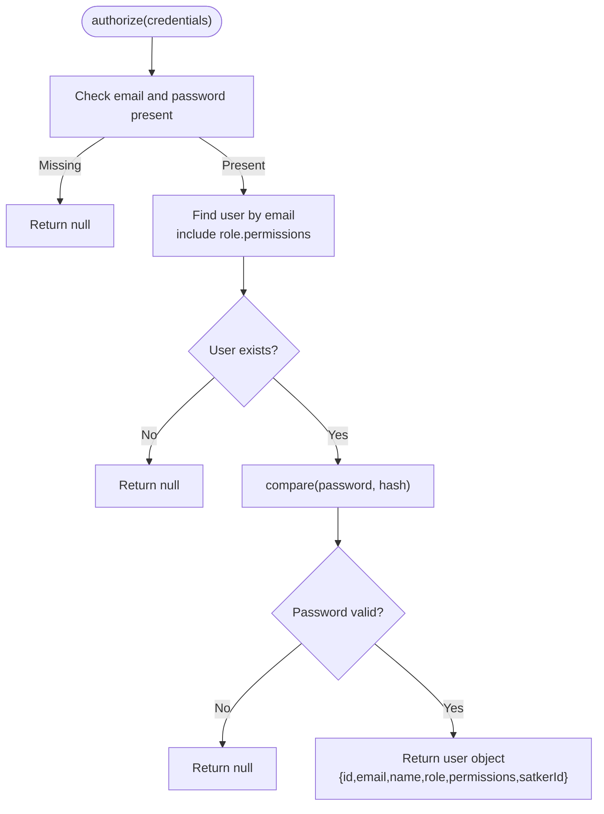
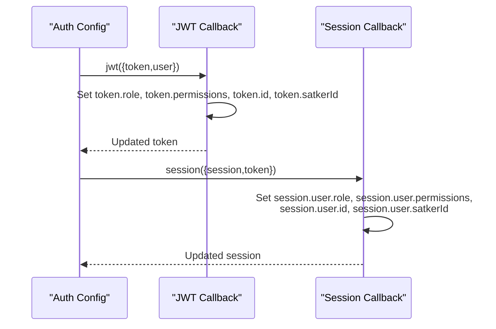
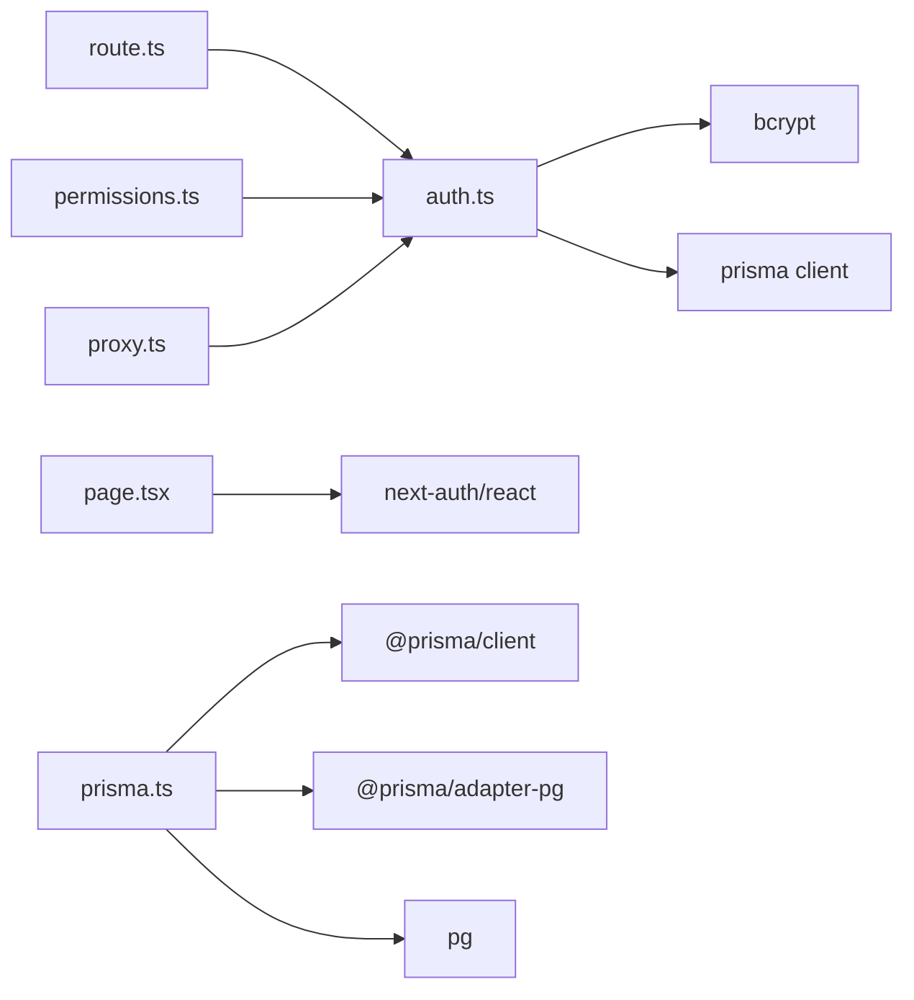

# Authentication System

<cite>
**Referenced Files in This Document**
- [auth.ts](file://src/lib/auth.ts)
- [route.ts](file://src/app/api/auth/[...nextauth]/route.ts)
- [page.tsx](file://src/app/login/page.tsx)
- [next-auth.d.ts](file://types/next-auth.d.ts)
- [prisma.ts](file://src/lib/prisma.ts)
- [schema.prisma](file://prisma/schema.prisma)
- [permissions.ts](file://src/lib/permissions.ts)
- [proxy.ts](file://src/proxy.ts)
- [package.json](file://package.json)
- [next.config.ts](file://next.config.ts)
</cite>

## Table of Contents
1. [Introduction](#introduction)
2. [Project Structure](#project-structure)
3. [Core Components](#core-components)
4. [Architecture Overview](#architecture-overview)
5. [Detailed Component Analysis](#detailed-component-analysis)
6. [Dependency Analysis](#dependency-analysis)
7. [Performance Considerations](#performance-considerations)
8. [Troubleshooting Guide](#troubleshooting-guide)
9. [Conclusion](#conclusion)

## Introduction
This document provides comprehensive documentation for ApsAsrama's authentication system built with NextAuth.js. It covers the NextAuth.js configuration, custom credentials provider setup, bcrypt password comparison, user authorization flow, JWT token structure, session management, and callback implementations. It also documents the user lookup process, credential validation, secure password verification, configuration options, environment variable requirements, security considerations, and integration patterns with the application's frontend components.

## Project Structure
The authentication system is organized around a small set of focused modules:
- NextAuth.js configuration and route handlers
- Frontend login page using NextAuth React helpers
- TypeScript module declarations for session typing
- Database access via Prisma
- Permission utilities and route protection middleware



**Diagram sources**
- [auth.ts:1-81](file://src/lib/auth.ts#L1-L81)
- [route.ts:1-7](file://src/app/api/auth/[...nextauth]/route.ts#L1-L7)
- [page.tsx:1-117](file://src/app/login/page.tsx#L1-L117)
- [next-auth.d.ts:1-19](file://types/next-auth.d.ts#L1-L19)
- [prisma.ts:1-31](file://src/lib/prisma.ts#L1-L31)
- [schema.prisma:10-25](file://prisma/schema.prisma#L10-L25)
- [permissions.ts:1-21](file://src/lib/permissions.ts#L1-L21)
- [proxy.ts:1-60](file://src/proxy.ts#L1-L60)
- [next.config.ts:1-24](file://next.config.ts#L1-L24)
- [package.json:12-22](file://package.json#L12-L22)

**Section sources**
- [auth.ts:1-81](file://src/lib/auth.ts#L1-L81)
- [route.ts:1-7](file://src/app/api/auth/[...nextauth]/route.ts#L1-L7)
- [page.tsx:1-117](file://src/app/login/page.tsx#L1-L117)
- [next-auth.d.ts:1-19](file://types/next-auth.d.ts#L1-L19)
- [prisma.ts:1-31](file://src/lib/prisma.ts#L1-L31)
- [schema.prisma:10-25](file://prisma/schema.prisma#L10-L25)
- [permissions.ts:1-21](file://src/lib/permissions.ts#L1-L21)
- [proxy.ts:1-60](file://src/proxy.ts#L1-L60)
- [next.config.ts:1-24](file://next.config.ts#L1-L24)
- [package.json:12-22](file://package.json#L12-L22)

## Core Components
- NextAuth.js configuration with a custom credentials provider
- JWT-based session strategy with token and session callbacks
- Secure password verification using bcrypt
- User lookup with role and permission eager loading
- Frontend integration using NextAuth React helpers
- Runtime type safety for session data
- Permission utilities and route protection middleware

**Section sources**
- [auth.ts:6-80](file://src/lib/auth.ts#L6-L80)
- [route.ts:1-7](file://src/app/api/auth/[...nextauth]/route.ts#L1-L7)
- [page.tsx:16-34](file://src/app/login/page.tsx#L16-L34)
- [next-auth.d.ts:3-18](file://types/next-auth.d.ts#L3-L18)
- [permissions.ts:4-20](file://src/lib/permissions.ts#L4-L20)
- [proxy.ts:25-55](file://src/proxy.ts#L25-L55)

## Architecture Overview
The authentication system follows a layered architecture:
- Presentation layer: Login page using NextAuth React hooks
- Application layer: NextAuth.js route handler and configuration
- Authorization layer: Token/session callbacks and permission utilities
- Data access layer: Prisma client with PostgreSQL adapter
- Security layer: bcrypt password hashing and environment-based secrets



**Diagram sources**
- [page.tsx:21-33](file://src/app/login/page.tsx#L21-L33)
- [route.ts:1-7](file://src/app/api/auth/[...nextauth]/route.ts#L1-L7)
- [auth.ts:14-50](file://src/lib/auth.ts#L14-L50)
- [prisma.ts:19-30](file://src/lib/prisma.ts#L19-L30)
- [schema.prisma:10-25](file://prisma/schema.prisma#L10-L25)

## Detailed Component Analysis

### NextAuth.js Configuration
The configuration defines a custom credentials provider with explicit credential fields and robust authorization logic.

Key aspects:
- Credentials provider with email and password fields
- User lookup with role and permission eager loading
- bcrypt password comparison
- JWT token storage of role, permissions, and user identifiers
- Session strategy set to JWT
- Secret configured from environment variable

```mermaid
classDiagram
class AuthOptions {
+providers : Provider[]
+callbacks : CallbacksOptions
+pages : PagesOptions
+session : SessionOptions
+secret : string
}
class CredentialsProvider {
+name : string
+credentials : object
+authorize(credentials) : Promise<User|null>
}
class JWTCallback {
+jwt({token,user}) : Promise<Token>
}
class SessionCallback {
+session({session,token}) : Promise<Session>
}
AuthOptions --> CredentialsProvider : "uses"
AuthOptions --> JWTCallback : "uses"
AuthOptions --> SessionCallback : "uses"
```

**Diagram sources**
- [auth.ts:6-80](file://src/lib/auth.ts#L6-L80)

**Section sources**
- [auth.ts:6-80](file://src/lib/auth.ts#L6-L80)

### Credentials Provider Implementation
The authorize function implements the complete authentication flow:
- Validates presence of email and password
- Performs user lookup with role and permission relations
- Compares provided password against stored hash
- Returns normalized user object for session creation



**Diagram sources**
- [auth.ts:14-50](file://src/lib/auth.ts#L14-L50)

**Section sources**
- [auth.ts:14-50](file://src/lib/auth.ts#L14-L50)

### JWT and Session Callbacks
Token and session callbacks handle data propagation between JWT and session objects.

Token callback stores:
- role: user role name
- permissions: array of permission codes
- id: user identifier
- satkerId: optional organizational unit identifier

Session callback ensures session.user contains the same enriched data.



**Diagram sources**
- [auth.ts:53-72](file://src/lib/auth.ts#L53-L72)

**Section sources**
- [auth.ts:53-72](file://src/lib/auth.ts#L53-L72)

### Frontend Login Integration
The login page integrates with NextAuth.js using React hooks:
- Uses signIn with credentials provider
- Handles errors and redirects on success
- Provides loading states and form validation

Integration pattern:
- Import signIn from next-auth/react
- Call signIn with provider "credentials"
- Disable automatic redirect by setting redirect: false
- Handle response.error for authentication failure
- Navigate to protected route on success

**Section sources**
- [page.tsx:16-34](file://src/app/login/page.tsx#L16-L34)

### TypeScript Session Typings
Custom module declarations extend NextAuth's session and user interfaces to include:
- User: role, permissions, and optional satkerId
- Session: enriched user object with typed properties

This enables type-safe access to session data throughout the application.

**Section sources**
- [next-auth.d.ts:3-18](file://types/next-auth.d.ts#L3-L18)

### Permission Utilities and Route Protection
Permission utilities provide server-side and client-side permission checks:
- hasPermission: checks if user has specific permission code
- requirePermission: throws error if permission missing
- hasPermissionClient: client-side permission checking

Route protection middleware enforces permission-based access control:
- Maps route prefixes to required permission codes
- Blocks access if user lacks required permissions
- Redirects unauthorized users to forbidden page

**Section sources**
- [permissions.ts:4-20](file://src/lib/permissions.ts#L4-L20)
- [proxy.ts:4-59](file://src/proxy.ts#L4-L59)

### Database Schema and User Model
The User model includes essential fields for authentication and authorization:
- Unique email for identification
- Hashed password for secure storage
- Role relationship with permissions
- Optional satker association
- Active status flag

The schema supports efficient user lookup with role and permission eager loading.

**Section sources**
- [schema.prisma:10-25](file://prisma/schema.prisma#L10-L25)

## Dependency Analysis
The authentication system has minimal external dependencies and clear internal relationships.



**Diagram sources**
- [auth.ts:2-4](file://src/lib/auth.ts#L2-L4)
- [route.ts:1-2](file://src/app/api/auth/[...nextauth]/route.ts#L1-L2)
- [page.tsx:4](file://src/app/login/page.tsx#L4)
- [permissions.ts:1-2](file://src/lib/permissions.ts#L1-L2)
- [proxy.ts:1](file://src/proxy.ts#L1)
- [prisma.ts:1-3](file://src/lib/prisma.ts#L1-L3)
- [package.json:12-22](file://package.json#L12-L22)

**Section sources**
- [package.json:12-22](file://package.json#L12-L22)
- [auth.ts:2-4](file://src/lib/auth.ts#L2-L4)
- [route.ts:1-2](file://src/app/api/auth/[...nextauth]/route.ts#L1-L2)
- [page.tsx:4](file://src/app/login/page.tsx#L4)
- [permissions.ts:1-2](file://src/lib/permissions.ts#L1-L2)
- [proxy.ts:1](file://src/proxy.ts#L1)
- [prisma.ts:1-3](file://src/lib/prisma.ts#L1-L3)

## Performance Considerations
- Password hashing: bcrypt is computationally intensive; consider adjusting cost factor if needed
- Database queries: User lookup includes role and permissions; ensure proper indexing on email and foreign keys
- Session strategy: JWT avoids server-side session storage but increases payload size
- Connection pooling: Prisma uses a single connection pool; monitor for concurrent access patterns
- Middleware overhead: Route protection adds minimal overhead but should be optimized for frequently accessed routes

## Troubleshooting Guide
Common issues and resolutions:

Authentication failures:
- Verify NEXTAUTH_SECRET environment variable is set
- Check bcrypt installation and compatibility
- Ensure user passwords are properly hashed before storage

Session and token issues:
- Confirm JWT callback is setting required fields
- Verify session callback propagates token data correctly
- Check browser cookie settings and SameSite policies

Database connectivity:
- Validate DATABASE_URL environment variable
- Monitor Prisma client initialization errors
- Ensure PostgreSQL server is accessible

Permission errors:
- Verify role-permission relationships in database
- Check permission codes match expected values
- Review route permission mappings

Environment configuration:
- Required variables: NEXTAUTH_SECRET, DATABASE_URL
- Optional: NEXTAUTH_URL for production deployments
- Verify variable availability in runtime environment

**Section sources**
- [auth.ts:79](file://src/lib/auth.ts#L79)
- [prisma.ts:6-9](file://src/lib/prisma.ts#L6-L9)
- [proxy.ts:30-31](file://src/proxy.ts#L30-L31)

## Conclusion
ApsAsrama's authentication system provides a secure, scalable foundation using NextAuth.js with custom credentials provider, bcrypt password verification, and JWT-based sessions. The implementation includes comprehensive role and permission management, type-safe session handling, and route protection middleware. The modular design enables easy maintenance and extension while maintaining strong security practices through environment-based configuration and proper password handling.