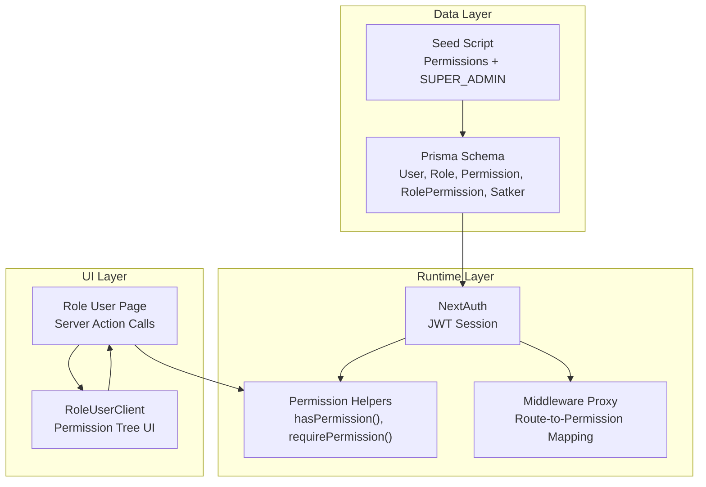
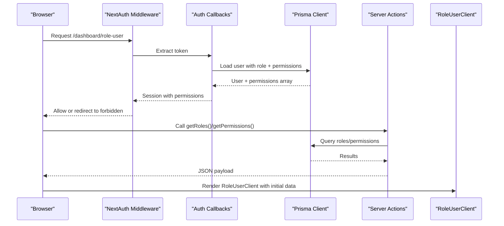
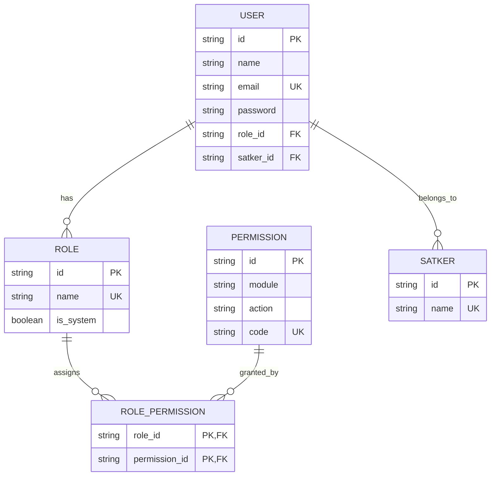
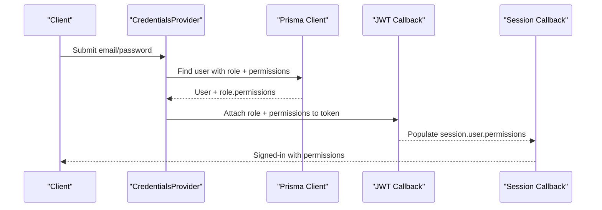
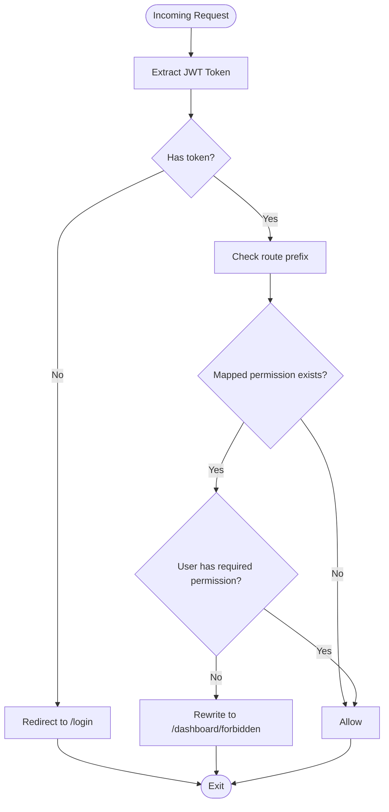
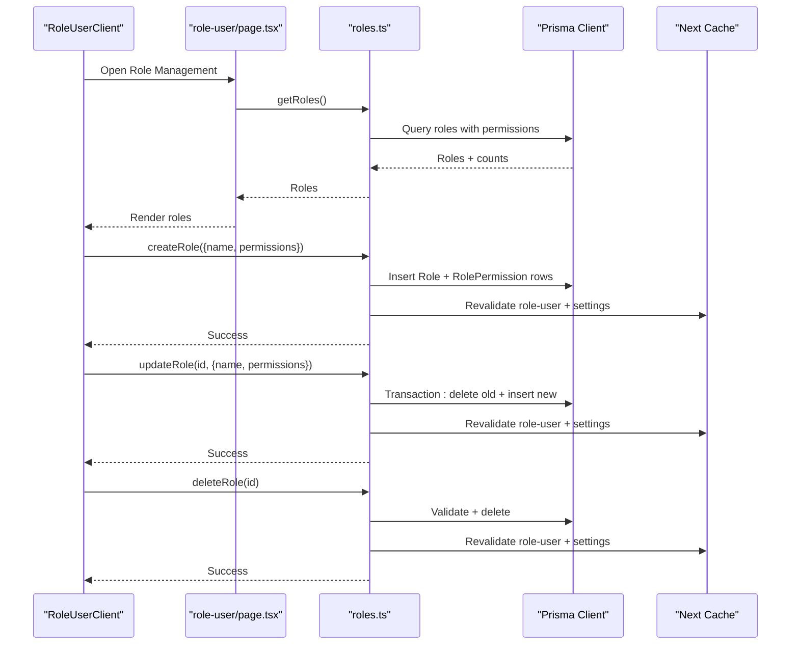
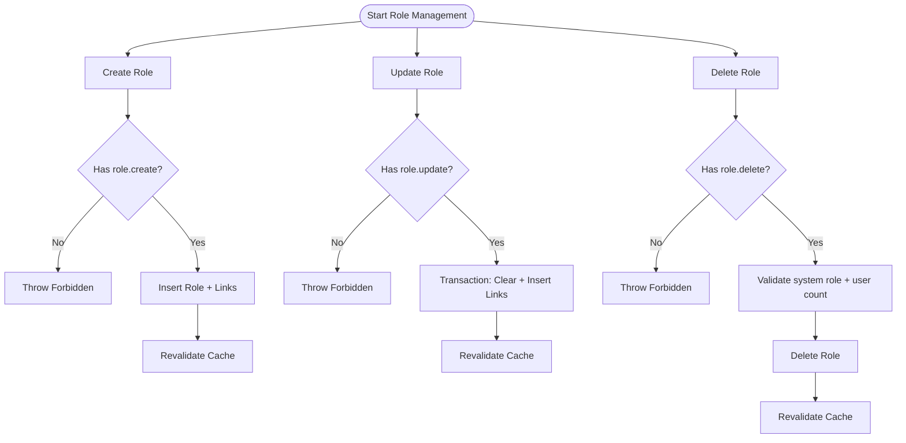
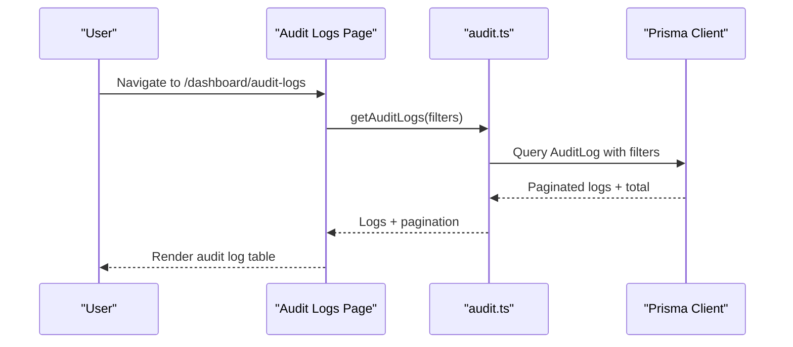
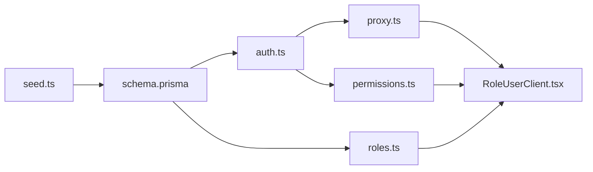

# Role & Permission Management

<cite>
**Referenced Files in This Document**
- [schema.prisma](file://prisma/schema.prisma)
- [seed.ts](file://prisma/seed.ts)
- [auth.ts](file://src/lib/auth.ts)
- [permissions.ts](file://src/lib/permissions.ts)
- [roles.ts](file://src/app/actions/roles.ts)
- [RoleUserClient.tsx](file://src/components/dashboard/role-user/RoleUserClient.tsx)
- [role-user/page.tsx](file://src/app/dashboard/role-user/page.tsx)
- [proxy.ts](file://src/proxy.ts)
- [audit.ts](file://src/app/actions/audit.ts)
- [audit-logs/page.tsx](file://src/app/dashboard/audit-logs/page.tsx)
</cite>

## Table of Contents
1. [Introduction](#introduction)
2. [Project Structure](#project-structure)
3. [Core Components](#core-components)
4. [Architecture Overview](#architecture-overview)
5. [Detailed Component Analysis](#detailed-component-analysis)
6. [Dependency Analysis](#dependency-analysis)
7. [Performance Considerations](#performance-considerations)
8. [Troubleshooting Guide](#troubleshooting-guide)
9. [Conclusion](#conclusion)
10. [Appendices](#appendices)

## Introduction
This document describes ApsAsrama's role-based access control (RBAC) system. It explains the Prisma schema-defined role hierarchy, permission matrix, and user-role relationships. It documents permission codes, role assignments, and how permissions are evaluated at runtime via middleware and server-side checks. It also covers role creation and management workflows, permission assignment procedures, and audit trail capabilities. Finally, it clarifies how user roles relate to institutional hierarchies (satker) and demonstrates permission-based UI component rendering.

## Project Structure
The RBAC system spans three primary areas:
- Data model: Prisma schema defines roles, permissions, and user relationships.
- Runtime enforcement: NextAuth-based authentication enriches sessions with computed permissions; middleware enforces route-level permissions; server actions enforce CRUD permissions.
- UI management: Dedicated dashboard page and client component manage role creation and permission assignment.

**Diagram sources**
- [schema.prisma](file://prisma/schema.prisma)
- [seed.ts](file://prisma/seed.ts)
- [auth.ts](file://src/lib/auth.ts)
- [permissions.ts](file://src/lib/permissions.ts)
- [proxy.ts](file://src/proxy.ts)
- [role-user/page.tsx](file://src/app/dashboard/role-user/page.tsx)
- [RoleUserClient.tsx](file://src/components/dashboard/role-user/RoleUserClient.tsx)

**Section sources**
- [schema.prisma](file://prisma/schema.prisma)
- [seed.ts](file://prisma/seed.ts)
- [auth.ts](file://src/lib/auth.ts)
- [permissions.ts](file://src/lib/permissions.ts)
- [proxy.ts](file://src/proxy.ts)
- [role-user/page.tsx](file://src/app/dashboard/role-user/page.tsx)
- [RoleUserClient.tsx](file://src/components/dashboard/role-user/RoleUserClient.tsx)

## Core Components
- Roles and Permissions
  - Roles are named entities with a system flag and a collection of assigned permissions.
  - Permissions are uniquely identified by a code combining module and action (e.g., "santri.view").
  - RolePermission is a junction table linking roles to permissions.
- Users and Institutions
  - Users belong to a single Role and optionally to a Satker (institutional unit).
  - Satker is an organizational entity with users and assignments.
- Authentication and Authorization
  - NextAuth computes user permissions during sign-in by traversing the role-permission graph and exposes them in JWT/session.
  - Middleware enforces route-level permissions using a route-to-permission mapping.
  - Server actions enforce CRUD permissions for role management and other protected operations.

**Section sources**
- [schema.prisma](file://prisma/schema.prisma)
- [auth.ts](file://src/lib/auth.ts)
- [proxy.ts](file://src/proxy.ts)

## Architecture Overview
The RBAC architecture integrates authentication, authorization, and UI:

**Diagram sources**
- [auth.ts](file://src/lib/auth.ts)
- [proxy.ts](file://src/proxy.ts)
- [roles.ts](file://src/app/actions/roles.ts)
- [role-user/page.tsx](file://src/app/dashboard/role-user/page.tsx)
- [RoleUserClient.tsx](file://src/components/dashboard/role-user/RoleUserClient.tsx)

## Detailed Component Analysis

### Data Model: Roles, Permissions, and Relationships
The Prisma schema defines the core RBAC entities and their relationships.

Key observations:
- Users are linked to a single Role and optional Satker.
- Roles link to permissions via RolePermission.
- Permission codes are unique and combine module and action for precise checks.

**Diagram sources**
- [schema.prisma](file://prisma/schema.prisma)

**Section sources**
- [schema.prisma](file://prisma/schema.prisma)

### Permission Matrix and Codes
The seed script defines the canonical permission matrix. Each permission has:
- Module: Functional domain (e.g., "Data Santri", "Role User").
- Action: Operation type (e.g., "View", "Create", "Update", "Delete", "Export").
- Code: Unique identifier (e.g., "santri.view").

Examples of seeded permissions include:
- Dashboard: dashboard.view
- Residents: santri.view, santri.create, santri.update, santri.delete
- Muallim: muallim.view, muallim.create, muallim.update, muallim.delete
- Assignments: penugasan.view, penugasan.create, penugasan.update, penugasan.delete
- Monitoring: monitoring.view, monitoring.create, monitoring.update, monitoring.delete
- Absensi: absensi.view, absensi.create, absensi.update, absensi.delete
- Area: area.view, area.create, area.update, area.delete
- Akademik: akademik.view, akademik.create, akademik.update, akademik.delete
- KBM: kbm.view, kbm.create, kbm.update, kbm.delete
- Role User: role.view, role.create, role.update, role.delete
- Satker: satker.view, satker.create, satker.update, satker.delete
- Settings: pengaturan.view, pengaturan.create, pengaturan.update, pengaturan.delete
- Reports: laporan.view, laporan.create, laporan.export
- Administrative Regions: wilayah.view, wilayah.create, wilayah.update, wilayah.delete
- Audit Logs: audit.view

These codes are used throughout the system for:
- Middleware route checks.
- Server action permission gates.
- Client-side UI visibility.

**Section sources**
- [seed.ts](file://prisma/seed.ts)

### Authentication and Permission Computation
NextAuth computes user permissions during sign-in:
- Loads user with nested role and role.permissions.
- Flattens permissions into an array of permission codes.
- Stores codes in JWT token and session for downstream checks.

**Diagram sources**
- [auth.ts](file://src/lib/auth.ts)

**Section sources**
- [auth.ts](file://src/lib/auth.ts)

### Middleware-Based Permission Checking
The middleware enforces route-level permissions using a route-to-permission mapping:
- Routes under /dashboard are protected.
- Base dashboard requires "dashboard.view".
- Specific routes require corresponding "module.view" permissions.

**Diagram sources**
- [proxy.ts](file://src/proxy.ts)

**Section sources**
- [proxy.ts](file://src/proxy.ts)

### Server-Side Permission Gates
Server actions enforce CRUD permissions for role management:
- getRoles/getPermissions require "role.view".
- createRole requires "role.create".
- updateRole requires "role.update".
- deleteRole requires "role.delete".

The update flow replaces all previous role-permission associations atomically using a transaction.

**Diagram sources**
- [roles.ts](file://src/app/actions/roles.ts)
- [role-user/page.tsx](file://src/app/dashboard/role-user/page.tsx)
- [RoleUserClient.tsx](file://src/components/dashboard/role-user/RoleUserClient.tsx)

**Section sources**
- [roles.ts](file://src/app/actions/roles.ts)
- [role-user/page.tsx](file://src/app/dashboard/role-user/page.tsx)
- [RoleUserClient.tsx](file://src/components/dashboard/role-user/RoleUserClient.tsx)

### Client-Side Permission Checks
Client-side helpers enable UI rendering decisions:
- hasPermissionClient(permissions, action) checks if a permission code is present.
- Used to conditionally render UI elements based on current user permissions.

**Section sources**
- [permissions.ts](file://src/lib/permissions.ts)

### Role Creation and Management Workflows
- Create Role
  - Requires "role.create".
  - Connects selected permission IDs to the new role.
  - Triggers cache revalidation for relevant dashboards.
- Update Role
  - Requires "role.update".
  - Deletes all existing role-permission links and inserts new ones.
  - Prevents modification of system roles (e.g., SUPER_ADMIN) via UI.
- Delete Role
  - Requires "role.delete".
  - Prevents deletion of system roles and roles still assigned to users.

**Diagram sources**
- [roles.ts](file://src/app/actions/roles.ts)

**Section sources**
- [roles.ts](file://src/app/actions/roles.ts)

### Permission Assignment Procedures
- Permissions are assigned to roles via the RolePermission junction table.
- The UI groups permissions by module and supports bulk selection per module.
- During updates, all existing links are removed and replaced with the new selection.

**Section sources**
- [RoleUserClient.tsx](file://src/components/dashboard/role-user/RoleUserClient.tsx)
- [roles.ts](file://src/app/actions/roles.ts)

### Audit Trail Capabilities
- Audit logs capture CREATE, UPDATE, DELETE, IMPORT actions across entities.
- Logged fields include action, entityType, entityId, oldValue, newValue, performedBy, and timestamps.
- Access to audit logs requires "audit.view".
- The audit page filters logs by action, performedBy, date range, and free-text search across JSON fields.

**Diagram sources**
- [audit.ts](file://src/app/actions/audit.ts)
- [audit-logs/page.tsx](file://src/app/dashboard/audit-logs/page.tsx)

**Section sources**
- [audit.ts](file://src/app/actions/audit.ts)
- [audit-logs/page.tsx](file://src/app/dashboard/audit-logs/page.tsx)

### Relationship Between Roles and Institutional Hierarchies (Satker)
- Users can be associated with a Satker, enabling institution-aware operations.
- While the schema supports this association, the current middleware and actions primarily enforce functional permissions rather than hierarchical scopes.
- Future enhancements could integrate Satker-aware permission checks (e.g., viewing only residents within the user's Satker).

**Section sources**
- [schema.prisma](file://prisma/schema.prisma)

### Permission-Based UI Component Rendering
- Client-side helpers allow components to render or hide controls based on permission codes.
- Example patterns:
  - Conditionally show "Create" buttons if "module.create" is present.
  - Hide "Delete" actions if "module.delete" is missing.
  - Disable editing controls if "module.update" is absent.

**Section sources**
- [permissions.ts](file://src/lib/permissions.ts)

## Dependency Analysis
The RBAC system exhibits clear separation of concerns:
- Data model: Prisma schema defines entities and relationships.
- Runtime: NextAuth enriches sessions with computed permissions; middleware enforces route-level checks; server actions enforce operation-level checks.
- UI: Client components consume permission arrays to render appropriate controls.

**Diagram sources**
- [schema.prisma](file://prisma/schema.prisma)
- [seed.ts](file://prisma/seed.ts)
- [auth.ts](file://src/lib/auth.ts)
- [permissions.ts](file://src/lib/permissions.ts)
- [roles.ts](file://src/app/actions/roles.ts)
- [proxy.ts](file://src/proxy.ts)
- [RoleUserClient.tsx](file://src/components/dashboard/role-user/RoleUserClient.tsx)

**Section sources**
- [schema.prisma](file://prisma/schema.prisma)
- [auth.ts](file://src/lib/auth.ts)
- [permissions.ts](file://src/lib/permissions.ts)
- [roles.ts](file://src/app/actions/roles.ts)
- [proxy.ts](file://src/proxy.ts)
- [RoleUserClient.tsx](file://src/components/dashboard/role-user/RoleUserClient.tsx)

## Performance Considerations
- Permission computation occurs once per sign-in; subsequent checks rely on cached JWT/session arrays.
- Middleware performs O(n) mapping lookups against route prefixes; keep the mapping minimal and ordered.
- Server actions use transactions for atomic updates, ensuring data consistency while minimizing redundant queries.
- UI grouping of permissions reduces client-side rendering overhead.

## Troubleshooting Guide
Common issues and resolutions:
- Missing permissions after login
  - Verify NextAuth callbacks populate permissions and that the user's role has linked permissions.
  - Confirm the seed script created permissions and assigned them to SUPER_ADMIN.
- Forbidden errors on role management
  - Ensure the current role has "role.view", "role.create", "role.update", or "role.delete" depending on the operation.
- Middleware redirects to forbidden
  - Confirm the requested route has a mapped permission and the user possesses it.
- Audit logs inaccessible
  - Ensure the user has "audit.view"; otherwise, access is denied.

**Section sources**
- [auth.ts](file://src/lib/auth.ts)
- [seed.ts](file://prisma/seed.ts)
- [roles.ts](file://src/app/actions/roles.ts)
- [proxy.ts](file://src/proxy.ts)
- [audit.ts](file://src/app/actions/audit.ts)

## Conclusion
ApsAsrama’s RBAC system combines a clean Prisma schema with NextAuth-driven permission computation, middleware enforcement, and server action gates. The permission matrix is standardized via unique codes, and the UI adapts dynamically to user permissions. The system supports robust role management and audit logging, with clear pathways for future enhancements such as Satker-aware scoping.

## Appendices

### Permission Reference Matrix
- Dashboard: dashboard.view
- Residents: santri.view, santri.create, santri.update, santri.delete
- Muallim: muallim.view, muallim.create, muallim.update, muallim.delete
- Assignments: penugasan.view, penugasan.create, penugasan.update, penugasan.delete
- Monitoring: monitoring.view, monitoring.create, monitoring.update, monitoring.delete
- Absensi: absensi.view, absensi.create, absensi.update, absensi.delete
- Area: area.view, area.create, area.update, area.delete
- Akademik: akademik.view, akademik.create, akademik.update, akademik.delete
- KBM: kbm.view, kbm.create, kbm.update, kbm.delete
- Role User: role.view, role.create, role.update, role.delete
- Satker: satker.view, satker.create, satker.update, satker.delete
- Settings: pengaturan.view, pengaturan.create, pengaturan.update, pengaturan.delete
- Reports: laporan.view, laporan.create, laporan.export
- Administrative Regions: wilayah.view, wilayah.create, wilayah.update, wilayah.delete
- Audit Logs: audit.view

**Section sources**
- [seed.ts](file://prisma/seed.ts)