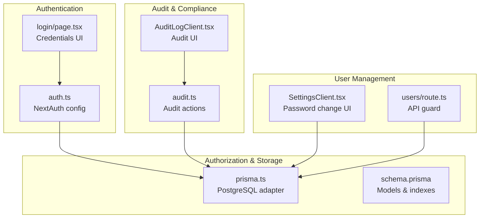
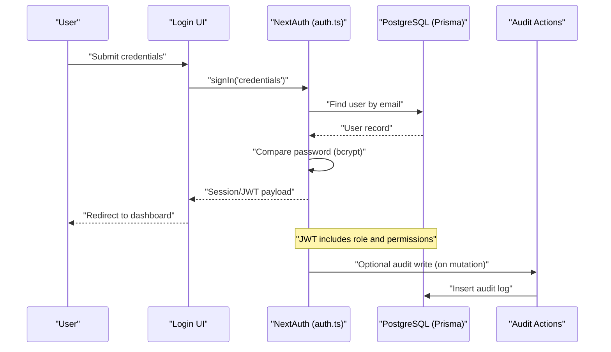
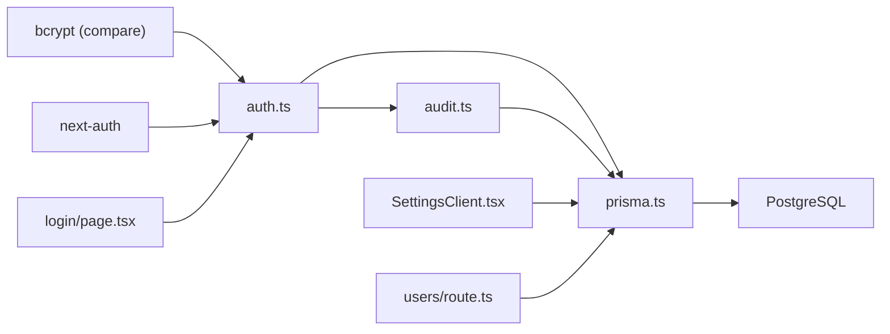

# Security Best Practices

<cite>
**Referenced Files in This Document**
- [auth.ts](file://src/lib/auth.ts)
- [prisma.ts](file://src/lib/prisma.ts)
- [audit.ts](file://src/app/actions/audit.ts)
- [schema.prisma](file://prisma/schema.prisma)
- [page.tsx](file://src/app/login/page.tsx)
- [AuditLogClient.tsx](file://src/components/dashboard/audit-log/AuditLogClient.tsx)
- [SettingsClient.tsx](file://src/components/dashboard/SettingsClient.tsx)
- [route.ts](file://src/app/api/users/route.ts)
- [package.json](file://package.json)
</cite>

## Table of Contents
1. [Introduction](#introduction)
2. [Project Structure](#project-structure)
3. [Core Components](#core-components)
4. [Architecture Overview](#architecture-overview)
5. [Detailed Component Analysis](#detailed-component-analysis)
6. [Dependency Analysis](#dependency-analysis)
7. [Performance Considerations](#performance-considerations)
8. [Troubleshooting Guide](#troubleshooting-guide)
9. [Conclusion](#conclusion)
10. [Appendices](#appendices)

## Introduction
This document outlines security best practices for ApsAsrama’s authentication and authorization system. It focuses on password security (hashing, salt generation, and strength requirements), JWT lifecycle and storage, input validation and sanitization, SQL injection prevention, XSS protections, audit logging for authentication events, environment variable management, secret key rotation, and security monitoring. Guidance also covers compliance and audit procedures aligned with data protection regulations.

## Project Structure
Security-relevant components are organized across:
- Authentication configuration and JWT handling
- Database connectivity and schema
- Audit logging actions and UI
- Login UI and user settings
- API routes and environment usage

**Diagram sources**
- [auth.ts:1-81](file://src/lib/auth.ts#L1-L81)
- [prisma.ts:1-31](file://src/lib/prisma.ts#L1-L31)
- [schema.prisma:1-487](file://prisma/schema.prisma#L1-L487)
- [audit.ts:1-118](file://src/app/actions/audit.ts#L1-L118)
- [AuditLogClient.tsx:1-410](file://src/components/dashboard/audit-log/AuditLogClient.tsx#L1-L410)
- [SettingsClient.tsx:334-549](file://src/components/dashboard/SettingsClient.tsx#L334-L549)
- [route.ts:1-6](file://src/app/api/users/route.ts#L1-L6)

**Section sources**
- [auth.ts:1-81](file://src/lib/auth.ts#L1-L81)
- [prisma.ts:1-31](file://src/lib/prisma.ts#L1-L31)
- [audit.ts:1-118](file://src/app/actions/audit.ts#L1-L118)
- [AuditLogClient.tsx:1-410](file://src/components/dashboard/audit-log/AuditLogClient.tsx#L1-L410)
- [SettingsClient.tsx:334-549](file://src/components/dashboard/SettingsClient.tsx#L334-L549)
- [route.ts:1-6](file://src/app/api/users/route.ts#L1-L6)

## Core Components
- Authentication and Authorization: NextAuth with JWT strategy, credential provider, and role/permission callbacks.
- Database Layer: PostgreSQL via Prisma with a dedicated adapter and connection pooling.
- Audit Logging: Server-side actions to query and filter audit logs with permission checks.
- UI Components: Login form and settings/password change forms.
- API Guard: Non-functional GET route to prevent accidental exposure.

Security posture is built around bcrypt for password verification, JWT tokens stored securely by NextAuth, Prisma ORM for safe queries, and explicit permission checks for sensitive operations.

**Section sources**
- [auth.ts:6-80](file://src/lib/auth.ts#L6-L80)
- [prisma.ts:5-28](file://src/lib/prisma.ts#L5-L28)
- [audit.ts:37-98](file://src/app/actions/audit.ts#L37-L98)
- [page.tsx:16-34](file://src/app/login/page.tsx#L16-L34)
- [SettingsClient.tsx:334-384](file://src/components/dashboard/SettingsClient.tsx#L334-L384)
- [route.ts:3-5](file://src/app/api/users/route.ts#L3-L5)

## Architecture Overview
The authentication flow uses NextAuth with a credentials provider against a database-backed user model. JWT tokens carry role and permissions for session-based authorization. Audit logs capture entity changes for compliance and forensic readiness.

**Diagram sources**
- [auth.ts:14-50](file://src/lib/auth.ts#L14-L50)
- [prisma.ts:6-17](file://src/lib/prisma.ts#L6-L17)
- [audit.ts:8-25](file://src/app/actions/audit.ts#L8-L25)

## Detailed Component Analysis

### Password Security
- Hashing and Salt Generation: Password comparison uses bcrypt via the compare utility. The schema stores hashed passwords; bcrypt handles salt internally.
- Password Strength Requirements: The settings UI enforces a minimum length for new passwords. Enforce stronger policies (mixed case, digits, symbols) at the application level and consider MFA for privileged accounts.
- Storage: Passwords are persisted as hashes; avoid storing plaintext or reversible encryption.

Recommendations:
- Enforce a minimum 12-character policy with complexity requirements.
- Add rate limiting and lockout after failed attempts.
- Rotate secrets and invalidate sessions during password changes.

**Section sources**
- [auth.ts:36](file://src/lib/auth.ts#L36)
- [schema.prisma:16](file://prisma/schema.prisma#L16)
- [SettingsClient.tsx:354](file://src/components/dashboard/SettingsClient.tsx#L354)

### JWT Security Considerations
- Token Strategy: JWT is used as the session strategy. Ensure secure cookie settings in production (sameSite, httpOnly, secure).
- Secret Management: NEXTAUTH_SECRET must be strong and rotated periodically. Store in environment variables and restrict access.
- Token Lifecycle: Implement short-lived sessions with refresh mechanisms if needed; monitor token issuance and revocation.

Best practices:
- Use a cryptographically random, sufficiently long secret.
- Rotate secrets regularly and provide a smooth rollout strategy.
- Limit token scope to minimal required claims.

**Section sources**
- [auth.ts:76-80](file://src/lib/auth.ts#L76-L80)

### Input Validation and SQL Injection Prevention
- ORM Usage: Queries are executed via Prisma, which prevents SQL injection by construction. Use strict typing and avoid raw SQL.
- Field Cleaning: Some components demonstrate cleaning of text inputs prior to persistence. Extend this pattern consistently across all mutations.

Recommendations:
- Centralize input sanitization and validation.
- Use schema validation libraries and enforce strict field types.
- Avoid dynamic query building; rely on Prisma’s query builder.

**Section sources**
- [prisma.ts:6-17](file://src/lib/prisma.ts#L6-L17)
- [audit.ts:10-25](file://src/app/actions/audit.ts#L10-L25)

### XSS Protection Measures
- Output Encoding: Audit UI renders structured JSON diffs; ensure any user-controlled content is escaped before rendering.
- Content Security Policy (CSP): Define CSP headers to mitigate script injection risks.
- Secure Defaults: Prefer server-side rendering with escaping and avoid innerHTML misuse.

Recommendations:
- Audit rendering paths for user-supplied data.
- Add CSP headers and sanitize HTML where applicable.

**Section sources**
- [AuditLogClient.tsx:45-103](file://src/components/dashboard/audit-log/AuditLogClient.tsx#L45-L103)

### Audit Logging for Authentication Events
- Scope: The audit model captures CREATE, UPDATE, DELETE, IMPORT actions with entity type and IDs, plus JSON oldValue/newValue snapshots.
- Access Control: Audit retrieval requires a specific permission check in server actions.
- Filtering and Pagination: Actions support filtering by action, performedBy, date range, and free-text search across JSON fields.

Recommendations:
- Log failed login attempts and suspicious activities separately.
- Include IP address, user agent, and device fingerprint where feasible.
- Retain logs for compliance periods and enable immutable archival.

**Section sources**
- [schema.prisma:455-466](file://prisma/schema.prisma#L455-L466)
- [audit.ts:37-98](file://src/app/actions/audit.ts#L37-L98)

### Environment Variable Management and Secret Rotation
- Database URL: DATABASE_URL must be present and properly scoped. Restrict access to runtime environments.
- Secrets: NEXTAUTH_SECRET must be set and rotated. Use secrets managers and CI/CD vaults.
- Rotation Strategy: Prepare dual-secret handling and staged rollout to minimize downtime.

**Section sources**
- [prisma.ts:6-9](file://src/lib/prisma.ts#L6-L9)
- [auth.ts:79](file://src/lib/auth.ts#L79)

### Security Monitoring
- Metrics: Track failed authentications, session durations, and audit query volumes.
- Alerts: Configure alerts for spikes in failed logins, repeated audit queries, and unauthorized access attempts.
- Logs: Centralize application and database logs for correlation and incident response.

[No sources needed since this section provides general guidance]

### Compliance and Audit Procedures
- Data Protection: Align with privacy frameworks requiring confidentiality, integrity, and availability. Document retention and deletion policies.
- Audits: Conduct periodic penetration testing and code reviews focusing on authentication and authorization.
- Evidence: Maintain audit trails and incident reports as evidence of due diligence.

[No sources needed since this section provides general guidance]

## Dependency Analysis
The authentication stack depends on bcrypt for password verification, NextAuth for session/JWT management, Prisma for database access, and PostgreSQL for persistence. Audit actions depend on Prisma and session permissions.

**Diagram sources**
- [auth.ts:1-81](file://src/lib/auth.ts#L1-L81)
- [prisma.ts:1-31](file://src/lib/prisma.ts#L1-L31)
- [audit.ts:1-118](file://src/app/actions/audit.ts#L1-L118)
- [page.tsx:16-34](file://src/app/login/page.tsx#L16-L34)
- [SettingsClient.tsx:334-384](file://src/components/dashboard/SettingsClient.tsx#L334-L384)
- [route.ts:1-6](file://src/app/api/users/route.ts#L1-L6)

**Section sources**
- [package.json:12-32](file://package.json#L12-L32)
- [auth.ts:1-81](file://src/lib/auth.ts#L1-L81)
- [prisma.ts:1-31](file://src/lib/prisma.ts#L1-L31)
- [audit.ts:1-118](file://src/app/actions/audit.ts#L1-L118)

## Performance Considerations
- Database Connections: The adapter uses a small pool; ensure adequate provisioning for concurrent sessions.
- JWT Size: Keep claims minimal to reduce payload overhead.
- Audit Queries: Use indexed filters and pagination to avoid heavy scans.

[No sources needed since this section provides general guidance]

## Troubleshooting Guide
Common issues and mitigations:
- Invalid credentials: The login UI surfaces a generic error; avoid leaking account existence. Implement exponential backoff.
- Session errors: Verify NEXTAUTH_SECRET and database connectivity. Confirm JWT callback mappings.
- Audit access denied: Ensure the user has the required permission before querying logs.
- Database errors: Check DATABASE_URL and network connectivity.

**Section sources**
- [page.tsx:27-33](file://src/app/login/page.tsx#L27-L33)
- [auth.ts:79](file://src/lib/auth.ts#L79)
- [audit.ts:38-41](file://src/app/actions/audit.ts#L38-L41)
- [prisma.ts:6-9](file://src/lib/prisma.ts#L6-L9)

## Conclusion
ApsAsrama’s authentication relies on bcrypt, NextAuth JWT, and Prisma ORM, providing a solid foundation. Strengthen it by enforcing robust password policies, rotating secrets, hardening JWT storage, validating inputs, preventing XSS, enriching audit logs, and establishing monitoring and compliance procedures.

[No sources needed since this section summarizes without analyzing specific files]

## Appendices
- Recommended minimums: 12+ character passwords, mixed case, digits, symbols; MFA for admin roles.
- Operational: Enable CSP, monitor failed logins, retain logs per policy, rotate secrets quarterly.

[No sources needed since this section provides general guidance]