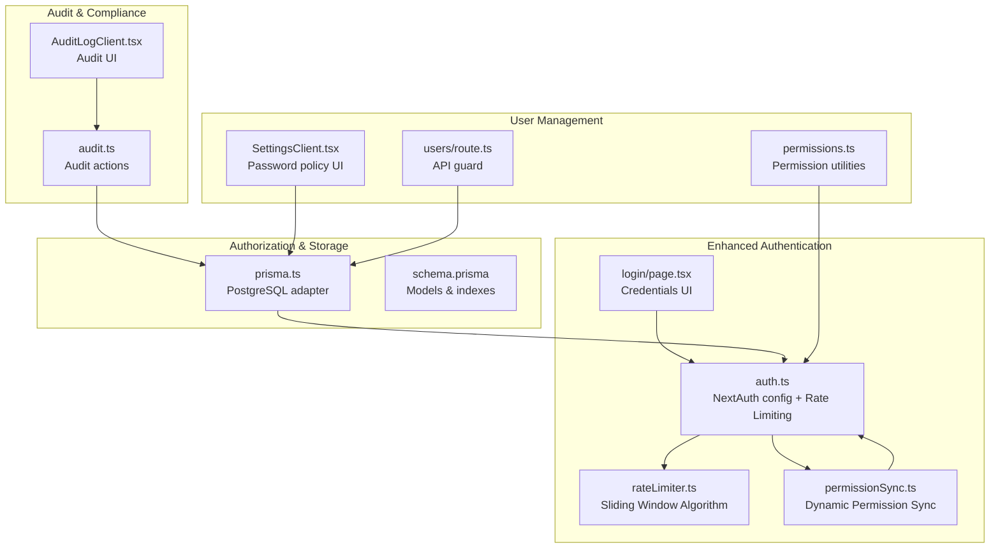
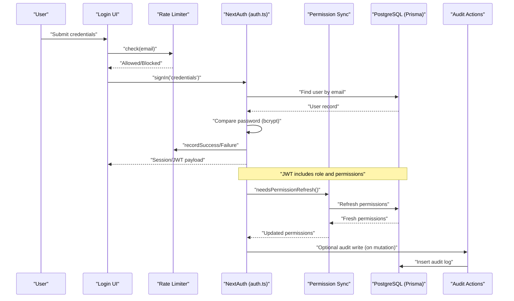
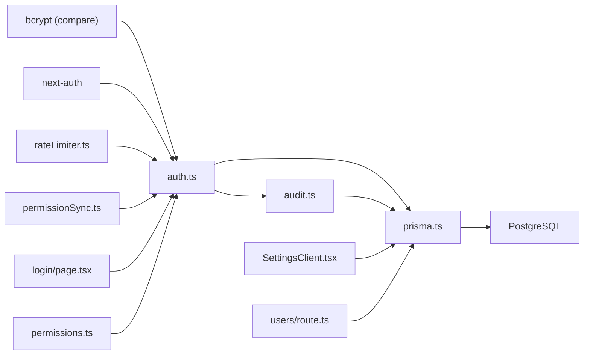

# Security Best Practices

<cite>
**Referenced Files in This Document**
- [auth.ts](file://src/lib/auth.ts)
- [rateLimiter.ts](file://src/lib/security/rateLimiter.ts)
- [permissionSync.ts](file://src/lib/security/permissionSync.ts)
- [permissions.ts](file://src/lib/permissions.ts)
- [prisma.ts](file://src/lib/prisma.ts)
- [audit.ts](file://src/app/actions/audit.ts)
- [schema.prisma](file://prisma/schema.prisma)
- [page.tsx](file://src/app/login/page.tsx)
- [AuditLogClient.tsx](file://src/components/dashboard/audit-log/AuditLogClient.tsx)
- [SettingsClient.tsx](file://src/components/dashboard/SettingsClient.tsx)
- [route.ts](file://src/app/api/users/route.ts)
- [permissionSync.test.ts](file://tests/permissionSync.test.ts)
- [package.json](file://package.json)
</cite>

## Update Summary
**Changes Made**
- Added comprehensive rate limiting guidelines with sliding window implementation
- Integrated dynamic permission synchronization recommendations with JWT refresh cycles
- Enhanced password policy requirements with minimum length enforcement
- Updated troubleshooting guide to address new security features and their configuration
- Added security monitoring recommendations for rate limiting and permission sync

## Table of Contents
1. [Introduction](#introduction)
2. [Project Structure](#project-structure)
3. [Core Components](#core-components)
4. [Architecture Overview](#architecture-overview)
5. [Detailed Component Analysis](#detailed-component-analysis)
6. [Dependency Analysis](#dependency-analysis)
7. [Performance Considerations](#performance-considerations)
8. [Troubleshooting Guide](#troubleshooting-guide)
9. [Conclusion](#conclusion)
10. [Appendices](#appendices)

## Introduction
This document outlines security best practices for ApsAsrama's authentication and authorization system. It focuses on password security (hashing, salt generation, and strength requirements), JWT lifecycle and storage, input validation and sanitization, SQL injection prevention, XSS protections, audit logging for authentication events, environment variable management, secret key rotation, and security monitoring. The system now includes advanced rate limiting with sliding window algorithm, dynamic permission synchronization, and comprehensive security monitoring capabilities.

## Project Structure
Security-relevant components are organized across:
- Authentication configuration and JWT handling with rate limiting integration
- Dynamic permission synchronization and JWT refresh mechanisms
- Database connectivity and schema
- Audit logging actions and UI
- Login UI and user settings with password policy enforcement
- API routes and environment usage

```mermaid
graph TB
subgraph "Enhanced Authentication"
A["auth.ts<br/>NextAuth config + Rate Limiting"]
B["login/page.tsx<br/>Credentials UI"]
C["rateLimiter.ts<br/>Sliding Window Algorithm"]
D["permissionSync.ts<br/>Dynamic Permission Sync"]
end
subgraph "Authorization & Storage"
E["prisma.ts<br/>PostgreSQL adapter"]
F["schema.prisma<br/>Models & indexes"]
end
subgraph "Audit & Compliance"
G["audit.ts<br/>Audit actions"]
H["AuditLogClient.tsx<br/>Audit UI"]
end
subgraph "User Management"
I["SettingsClient.tsx<br/>Password policy UI"]
J["permissions.ts<br/>Permission utilities"]
K["users/route.ts<br/>API guard"]
end
A --> C
A --> D
B --> A
D --> A
E --> A
G --> E
H --> G
I --> E
J --> A
K --> E
```

**Diagram sources**
- [auth.ts:1-132](file://src/lib/auth.ts#L1-L132)
- [rateLimiter.ts:1-143](file://src/lib/security/rateLimiter.ts#L1-L143)
- [permissionSync.ts:1-83](file://src/lib/security/permissionSync.ts#L1-L83)
- [prisma.ts:1-31](file://src/lib/prisma.ts#L1-L31)
- [audit.ts:1-118](file://src/app/actions/audit.ts#L1-L118)
- [AuditLogClient.tsx:1-410](file://src/components/dashboard/audit-log/AuditLogClient.tsx#L1-L410)
- [SettingsClient.tsx:334-549](file://src/components/dashboard/SettingsClient.tsx#L334-L549)
- [permissions.ts:1-21](file://src/lib/permissions.ts#L1-L21)
- [route.ts:1-6](file://src/app/api/users/route.ts#L1-L6)

**Section sources**
- [auth.ts:1-132](file://src/lib/auth.ts#L1-L132)
- [rateLimiter.ts:1-143](file://src/lib/security/rateLimiter.ts#L1-L143)
- [permissionSync.ts:1-83](file://src/lib/security/permissionSync.ts#L1-L83)
- [prisma.ts:1-31](file://src/lib/prisma.ts#L1-L31)
- [audit.ts:1-118](file://src/app/actions/audit.ts#L1-L118)
- [AuditLogClient.tsx:1-410](file://src/components/dashboard/audit-log/AuditLogClient.tsx#L1-L410)
- [SettingsClient.tsx:334-549](file://src/components/dashboard/SettingsClient.tsx#L334-L549)
- [permissions.ts:1-21](file://src/lib/permissions.ts#L1-L21)
- [route.ts:1-6](file://src/app/api/users/route.ts#L1-L6)

## Core Components
- **Enhanced Authentication and Authorization**: NextAuth with JWT strategy, credential provider, rate limiting integration, and dynamic permission synchronization callbacks.
- **Advanced Rate Limiting**: Sliding window algorithm with configurable thresholds, lockout mechanisms, and fail-open design for resilience.
- **Dynamic Permission System**: JWT-based permission refresh with 30-minute intervals, database synchronization, and fail-open behavior for reliability.
- **Database Layer**: PostgreSQL via Prisma with dedicated adapter and connection pooling.
- **Audit Logging**: Server-side actions to query and filter audit logs with permission checks.
- **UI Components**: Login form with password policy enforcement and settings/password change forms.
- **API Guard**: Non-functional GET route to prevent accidental exposure.

Security posture is built around bcrypt for password verification, JWT tokens with dynamic permission refresh, comprehensive rate limiting, Prisma ORM for safe queries, and explicit permission checks for sensitive operations.

**Section sources**
- [auth.ts:6-132](file://src/lib/auth.ts#L6-L132)
- [rateLimiter.ts:15-20](file://src/lib/security/rateLimiter.ts#L15-L20)
- [permissionSync.ts:11-23](file://src/lib/security/permissionSync.ts#L11-L23)
- [prisma.ts:5-28](file://src/lib/prisma.ts#L5-L28)
- [audit.ts:37-98](file://src/app/actions/audit.ts#L37-L98)
- [page.tsx:16-34](file://src/app/login/page.tsx#L16-L34)
- [SettingsClient.tsx:354](file://src/components/dashboard/SettingsClient.tsx#L354)
- [route.ts:3-5](file://src/app/api/users/route.ts#L3-L5)

## Architecture Overview
The authentication flow uses NextAuth with a credentials provider against a database-backed user model. Enhanced with rate limiting for login attempts and dynamic permission synchronization for JWT refresh cycles. JWT tokens carry role and permissions with automatic refresh every 30 minutes. Audit logs capture entity changes for compliance and forensic readiness.

```mermaid
sequenceDiagram
participant U as "User"
participant UI as "Login UI"
participant RL as "Rate Limiter"
participant NA as "NextAuth (auth.ts)"
participant PS as "Permission Sync"
participant DB as "PostgreSQL (Prisma)"
participant AL as "Audit Actions"
U->>UI : "Submit credentials"
UI->>RL : "check(email)"
RL-->>UI : "Allowed/Blocked"
UI->>NA : "signIn('credentials')"
NA->>DB : "Find user by email"
DB-->>NA : "User record"
NA->>NA : "Compare password (bcrypt)"
NA->>RL : "recordSuccess/Failure"
NA-->>UI : "Session/JWT payload"
Note over NA,DB : "JWT includes role and permissions"
NA->>PS : "needsPermissionRefresh()"
PS->>DB : "Refresh permissions"
DB-->>PS : "Fresh permissions"
PS-->>NA : "Updated permissions"
NA->>AL : "Optional audit write (on mutation)"
AL->>DB : "Insert audit log"
```

**Diagram sources**
- [auth.ts:16-76](file://src/lib/auth.ts#L16-L76)
- [rateLimiter.ts:44-78](file://src/lib/security/rateLimiter.ts#L44-L78)
- [permissionSync.ts:18-23](file://src/lib/security/permissionSync.ts#L18-L23)
- [prisma.ts:6-17](file://src/lib/prisma.ts#L6-L17)
- [audit.ts:8-25](file://src/app/actions/audit.ts#L8-L25)

## Detailed Component Analysis

### Enhanced Password Security
- **Hashing and Salt Generation**: Password comparison uses bcrypt via the compare utility. The schema stores hashed passwords; bcrypt handles salt internally.
- **Password Policy Requirements**: The settings UI enforces a minimum 6-character password length for new accounts. Enforce stronger policies (minimum 12 characters with mixed case, digits, symbols) at the application level and consider MFA for privileged accounts.
- **Storage**: Passwords are persisted as hashes; avoid storing plaintext or reversible encryption.

**Updated** Enhanced password policy enforcement with minimum length requirements and recommendation for stronger complexity standards.

Recommendations:
- Enforce a minimum 12-character policy with complexity requirements (mixed case, digits, symbols).
- Implement password history validation to prevent reuse of recent passwords.
- Add rate limiting and lockout after failed attempts.
- Rotate secrets and invalidate sessions during password changes.

**Section sources**
- [auth.ts:36](file://src/lib/auth.ts#L36)
- [schema.prisma:16](file://prisma/schema.prisma#L16)
- [SettingsClient.tsx:354](file://src/components/dashboard/SettingsClient.tsx#L354)

### Rate Limiting Implementation
- **Sliding Window Algorithm**: Implements configurable rate limiting with 5 attempts per 15-minute window and 15-minute lockout period.
- **Fail-Open Design**: All rate limiting operations are wrapped to never throw, ensuring system resilience.
- **Memory-Based Storage**: Uses in-memory Map for efficient rate limiting without external dependencies.
- **Automatic Cleanup**: Lazy cleanup mechanism removes expired entries periodically.

**New** Comprehensive rate limiting system with sliding window algorithm and fail-open design for enhanced security.

Configuration Parameters:
- Maximum attempts: 5 per 15-minute window
- Lockout duration: 15 minutes
- Cleanup interval: 60 seconds
- Memory cleanup: Automatic removal of expired entries

Recommendations:
- Monitor rate limiting metrics to detect potential attacks
- Consider implementing distributed rate limiting for multi-instance deployments
- Adjust thresholds based on deployment scale and threat assessment
- Implement IP-based rate limiting alongside email-based limits

**Section sources**
- [rateLimiter.ts:15-20](file://src/lib/security/rateLimiter.ts#L15-L20)
- [rateLimiter.ts:44-78](file://src/lib/security/rateLimiter.ts#L44-L78)
- [rateLimiter.ts:85-123](file://src/lib/security/rateLimiter.ts#L85-L123)
- [rateLimiter.ts:129-142](file://src/lib/security/rateLimiter.ts#L129-L142)

### Dynamic Permission Synchronization
- **JWT Refresh Cycle**: Permissions are refreshed every 30 minutes based on explicit timestamp tracking.
- **Fail-Open Behavior**: Database failures during permission refresh keep existing token data to maintain system availability.
- **User Deletion Handling**: Automatically clears permissions when users are deleted from the database.
- **Test Coverage**: Comprehensive unit tests validate permission refresh scenarios and edge cases.

**New** Dynamic permission synchronization system integrated into JWT lifecycle for real-time authorization updates.

Synchronization Logic:
- Refresh interval: 30 minutes (matches session.updateAge)
- Last permission sync timestamp embedded in JWT token
- Database query fetches latest role and permissions
- Automatic handling of user role changes and permission updates

Recommendations:
- Monitor permission refresh success rates and error patterns
- Implement caching strategies for frequently accessed permission data
- Consider implementing immediate permission invalidation for critical security events
- Regularly audit permission synchronization performance impact

**Section sources**
- [permissionSync.ts:11-23](file://src/lib/security/permissionSync.ts#L11-L23)
- [permissionSync.ts:32-82](file://src/lib/security/permissionSync.ts#L32-L82)
- [auth.ts:97-108](file://src/lib/auth.ts#L97-L108)
- [permissionSync.test.ts:1-174](file://tests/permissionSync.test.ts#L1-L174)

### JWT Security Considerations
- **Token Strategy**: JWT is used as the session strategy with enhanced security features including rate limiting and dynamic permission refresh.
- **Secret Management**: NEXTAUTH_SECRET must be strong and rotated periodically. Store in environment variables and restrict access.
- **Token Lifecycle**: Implement short-lived sessions with 8-hour max age and 30-minute update age for dynamic permission refresh.
- **Security Enhancements**: Token includes role, permissions, user ID, and satellite location ID with automatic refresh mechanisms.

**Updated** Enhanced JWT security with dynamic permission refresh and rate limiting integration.

Best practices:
- Use a cryptographically random, sufficiently long secret.
- Rotate secrets regularly and provide a smooth rollout strategy.
- Monitor JWT token issuance patterns and refresh frequencies.
- Implement token expiration and renewal mechanisms.

**Section sources**
- [auth.ts:76-131](file://src/lib/auth.ts#L76-L131)

### Input Validation and SQL Injection Prevention
- **ORM Usage**: Queries are executed via Prisma, which prevents SQL injection by construction. Use strict typing and avoid raw SQL.
- **Field Cleaning**: Some components demonstrate cleaning of text inputs prior to persistence. Extend this pattern consistently across all mutations.
- **Rate Limiting Validation**: Email addresses are normalized (lowercase, trimmed) before rate limiting checks.

**Updated** Enhanced input validation with email normalization for rate limiting and consistent sanitization patterns.

Recommendations:
- Centralize input sanitization and validation.
- Use schema validation libraries and enforce strict field types.
- Avoid dynamic query building; rely on Prisma's query builder.
- Implement comprehensive input validation for all user-provided data.

**Section sources**
- [prisma.ts:6-17](file://src/lib/prisma.ts#L6-L17)
- [audit.ts:10-25](file://src/app/actions/audit.ts#L10-L25)
- [rateLimiter.ts:26-36](file://src/lib/security/rateLimiter.ts#L26-L36)

### XSS Protection Measures
- **Output Encoding**: Audit UI renders structured JSON diffs; ensure any user-controlled content is escaped before rendering.
- **Content Security Policy (CSP)**: Define CSP headers to mitigate script injection risks.
- **Secure Defaults**: Prefer server-side rendering with escaping and avoid innerHTML misuse.
- **Input Validation**: Client-side validation complements server-side security measures.

**Updated** Enhanced XSS protection with comprehensive input validation and output encoding.

Recommendations:
- Audit rendering paths for user-supplied data.
- Add CSP headers and sanitize HTML where applicable.
- Implement comprehensive input validation at both client and server levels.
- Regular security audits of all user-facing interfaces.

**Section sources**
- [AuditLogClient.tsx:45-103](file://src/components/dashboard/audit-log/AuditLogClient.tsx#L45-L103)
- [page.tsx:72-95](file://src/app/login/page.tsx#L72-L95)

### Audit Logging for Authentication Events
- **Scope**: The audit model captures CREATE, UPDATE, DELETE, IMPORT actions with entity type and IDs, plus JSON oldValue/newValue snapshots.
- **Access Control**: Audit retrieval requires a specific permission check in server actions.
- **Filtering and Pagination**: Actions support filtering by action, performedBy, date range, and free-text search across JSON fields.
- **Enhanced Security Logging**: Rate limiting events and permission refresh failures are logged for security monitoring.

**Updated** Enhanced audit logging with security event tracking and comprehensive monitoring capabilities.

Recommendations:
- Log failed login attempts and suspicious activities separately.
- Include IP address, user agent, and device fingerprint where feasible.
- Retain logs for compliance periods and enable immutable archival.
- Implement real-time alerting for security events.

**Section sources**
- [schema.prisma:455-466](file://prisma/schema.prisma#L455-L466)
- [audit.ts:37-98](file://src/app/actions/audit.ts#L37-L98)

### Environment Variable Management and Secret Rotation
- **Database URL**: DATABASE_URL must be present and properly scoped. Restrict access to runtime environments.
- **Secrets**: NEXTAUTH_SECRET must be set and rotated. Use secrets managers and CI/CD vaults.
- **Rotation Strategy**: Prepare dual-secret handling and staged rollout to minimize downtime.
- **Rate Limiting Configuration**: Environment variables for rate limiting thresholds and intervals.

**Updated** Enhanced environment variable management with rate limiting configuration and secret rotation strategies.

**Section sources**
- [prisma.ts:6-9](file://src/lib/prisma.ts#L6-L9)
- [auth.ts:79](file://src/lib/auth.ts#L79)
- [rateLimiter.ts:15-20](file://src/lib/security/rateLimiter.ts#L15-L20)

### Security Monitoring
- **Metrics**: Track failed authentications, session durations, audit query volumes, and rate limiting events.
- **Rate Limiting Monitoring**: Monitor attempt counts, lockout events, and cleanup operations.
- **Permission Sync Monitoring**: Track refresh success rates, error patterns, and performance metrics.
- **Alerts**: Configure alerts for spikes in failed logins, repeated audit queries, unauthorized access attempts, and rate limiting violations.
- **Logs**: Centralize application and database logs for correlation and incident response.

**New** Comprehensive security monitoring framework for rate limiting, permission sync, and authentication events.

Recommendations:
- Implement real-time dashboards for security metrics
- Set up automated alerts for unusual activity patterns
- Regular security metric reviews and threshold adjustments
- Integrate with SIEM systems for comprehensive monitoring

**Section sources**
- [rateLimiter.ts:44-78](file://src/lib/security/rateLimiter.ts#L44-L78)
- [permissionSync.ts:32-82](file://src/lib/security/permissionSync.ts#L32-L82)

### Compliance and Audit Procedures
- **Data Protection**: Align with privacy frameworks requiring confidentiality, integrity, and availability. Document retention and deletion policies.
- **Audits**: Conduct periodic penetration testing and code reviews focusing on authentication and authorization.
- **Evidence**: Maintain audit trails and incident reports as evidence of due diligence.
- **Security Controls**: Document rate limiting configurations, permission sync processes, and monitoring procedures.

**Updated** Enhanced compliance documentation with security controls and monitoring procedures.

**Section sources**
- [permissionSync.test.ts:1-174](file://tests/permissionSync.test.ts#L1-L174)

## Dependency Analysis
The enhanced authentication stack depends on bcrypt for password verification, NextAuth for session/JWT management, rate limiting modules for security, permission synchronization for dynamic authorization, Prisma for database access, and PostgreSQL for persistence. Audit actions depend on Prisma and session permissions.

```mermaid
graph LR
BC["bcrypt (compare)"] --> AUTH["auth.ts"]
NA["next-auth"] --> AUTH
RL["rateLimiter.ts"] --> AUTH
PS["permissionSync.ts"] --> AUTH
AUTH --> PRISMA["prisma.ts"]
PRISMA --> PG["PostgreSQL"]
AUTH --> AUDIT["audit.ts"]
AUDIT --> PRISMA
UI["login/page.tsx"] --> AUTH
SETTINGS["SettingsClient.tsx"] --> PRISMA
PERMISSIONS["permissions.ts"] --> AUTH
USERS_ROUTE["users/route.ts"] --> PRISMA
```

**Diagram sources**
- [auth.ts:1-132](file://src/lib/auth.ts#L1-L132)
- [rateLimiter.ts:1-143](file://src/lib/security/rateLimiter.ts#L1-L143)
- [permissionSync.ts:1-83](file://src/lib/security/permissionSync.ts#L1-L83)
- [prisma.ts:1-31](file://src/lib/prisma.ts#L1-L31)
- [audit.ts:1-118](file://src/app/actions/audit.ts#L1-L118)
- [page.tsx:16-34](file://src/app/login/page.tsx#L16-L34)
- [SettingsClient.tsx:334-384](file://src/components/dashboard/SettingsClient.tsx#L334-L384)
- [permissions.ts:1-21](file://src/lib/permissions.ts#L1-L21)
- [route.ts:1-6](file://src/app/api/users/route.ts#L1-L6)

**Section sources**
- [package.json:12-32](file://package.json#L12-L32)
- [auth.ts:1-132](file://src/lib/auth.ts#L1-L132)
- [rateLimiter.ts:1-143](file://src/lib/security/rateLimiter.ts#L1-L143)
- [permissionSync.ts:1-83](file://src/lib/security/permissionSync.ts#L1-L83)
- [prisma.ts:1-31](file://src/lib/prisma.ts#L1-L31)
- [audit.ts:1-118](file://src/app/actions/audit.ts#L1-L118)

## Performance Considerations
- **Database Connections**: The adapter uses a small pool; ensure adequate provisioning for concurrent sessions.
- **JWT Size**: Keep claims minimal to reduce payload overhead, especially with dynamic permission refresh.
- **Audit Queries**: Use indexed filters and pagination to avoid heavy scans.
- **Rate Limiting Performance**: In-memory storage provides fast access but consumes memory; monitor memory usage in production.
- **Permission Sync Overhead**: 30-minute refresh interval balances security with performance; adjust based on deployment needs.

**Updated** Enhanced performance considerations for rate limiting and permission synchronization.

Recommendations:
- Monitor memory usage for rate limiting store
- Optimize permission sync queries with proper indexing
- Implement connection pooling for database operations
- Consider caching strategies for frequently accessed permission data

**Section sources**
- [rateLimiter.ts:22](file://src/lib/security/rateLimiter.ts#L22)
- [permissionSync.ts:37-55](file://src/lib/security/permissionSync.ts#L37-L55)

## Troubleshooting Guide
Common issues and mitigations:
- **Invalid credentials**: The login UI surfaces a generic error; avoid leaking account existence. Implement exponential backoff and rate limiting.
- **Rate limiting blocked**: Users may be temporarily blocked after multiple failed attempts. Check rate limiter configuration and cleanup intervals.
- **Permission refresh failures**: JWT permissions may not update if database queries fail. Verify database connectivity and permission sync configuration.
- **Session errors**: Verify NEXTAUTH_SECRET and database connectivity. Confirm JWT callback mappings and permission refresh cycles.
- **Audit access denied**: Ensure the user has the required permission before querying logs.
- **Database errors**: Check DATABASE_URL and network connectivity.
- **Memory issues**: Monitor rate limiter store size and implement cleanup strategies.

**Updated** Enhanced troubleshooting guide with rate limiting and permission sync issues.

**Section sources**
- [page.tsx:27-33](file://src/app/login/page.tsx#L27-L33)
- [auth.ts:79](file://src/lib/auth.ts#L79)
- [rateLimiter.ts:44-78](file://src/lib/security/rateLimiter.ts#L44-L78)
- [permissionSync.ts:77-81](file://src/lib/security/permissionSync.ts#L77-L81)
- [audit.ts:38-41](file://src/app/actions/audit.ts#L38-L41)
- [prisma.ts:6-9](file://src/lib/prisma.ts#L6-L9)

## Conclusion
ApsAsrama's enhanced authentication system builds upon bcrypt, NextAuth JWT, and Prisma ORM foundations with significant security improvements. The addition of rate limiting with sliding window algorithm, dynamic permission synchronization, comprehensive security monitoring, and robust audit logging provides enterprise-grade security. Strengthen the system further by implementing recommended password policies, regular security assessments, and continuous monitoring of security metrics.

## Appendices
- **Recommended minimums**: 12+ character passwords with complexity requirements, MFA for admin roles, 5 attempts per 15 minutes rate limiting
- **Operational**: Enable CSP, monitor failed logins and rate limiting events, retain logs per policy, rotate secrets quarterly, implement comprehensive security monitoring
- **Advanced configurations**: Consider distributed rate limiting for multi-instance deployments, implement immediate permission invalidation for security events, optimize permission sync performance with caching