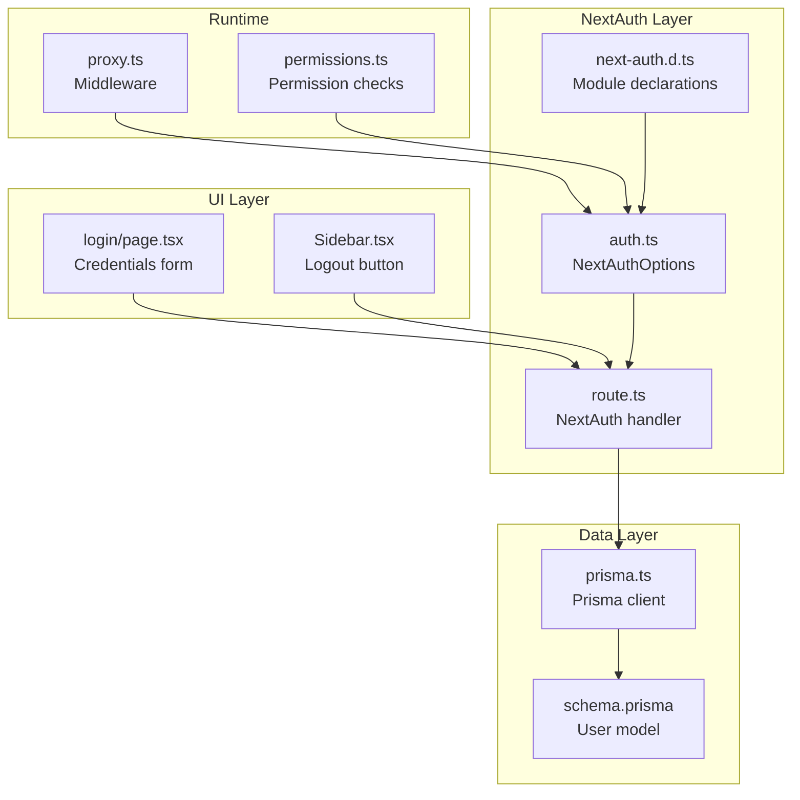
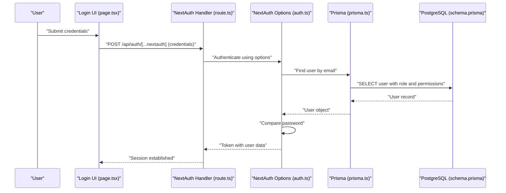
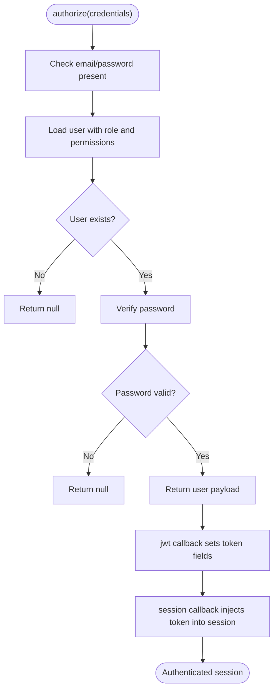
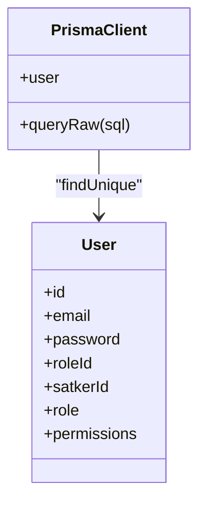
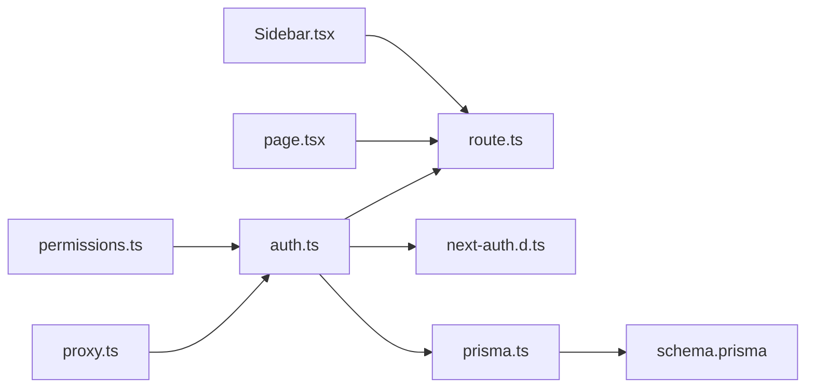

# User Session Management

<cite>
**Referenced Files in This Document**
- [auth.ts](file://src/lib/auth.ts)
- [route.ts](file://src/app/api/auth/[...nextauth]/route.ts)
- [next-auth.d.ts](file://types/next-auth.d.ts)
- [prisma.ts](file://src/lib/prisma.ts)
- [schema.prisma](file://prisma/schema.prisma)
- [page.tsx](file://src/app/login/page.tsx)
- [Sidebar.tsx](file://src/components/dashboard/Sidebar.tsx)
- [permissions.ts](file://src/lib/permissions.ts)
- [proxy.ts](file://src/proxy.ts)
</cite>

## Table of Contents
1. [Introduction](#introduction)
2. [Project Structure](#project-structure)
3. [Core Components](#core-components)
4. [Architecture Overview](#architecture-overview)
5. [Detailed Component Analysis](#detailed-component-analysis)
6. [Dependency Analysis](#dependency-analysis)
7. [Performance Considerations](#performance-considerations)
8. [Troubleshooting Guide](#troubleshooting-guide)
9. [Conclusion](#conclusion)

## Introduction
This document explains user session management in ApsAsrama, focusing on the JWT token lifecycle, session persistence, and token refresh mechanisms. It details how NextAuth.js integrates with Prisma for user data retrieval, how session callbacks manipulate tokens and validate sessions, and how logout and concurrent session handling are implemented. Security measures such as token encryption and protection against session hijacking are addressed.

## Project Structure
The session management system is centered around NextAuth.js configuration, a Next.js route handler, TypeScript module declarations, and Prisma database integration. The login UI triggers authentication, while middleware enforces route-level permissions.

**Diagram sources**
- [auth.ts:1-81](file://src/lib/auth.ts#L1-L81)
- [route.ts:1-7](file://src/app/api/auth/[...nextauth]/route.ts#L1-L7)
- [next-auth.d.ts:1-19](file://types/next-auth.d.ts#L1-L19)
- [prisma.ts:1-31](file://src/lib/prisma.ts#L1-L31)
- [schema.prisma:10-25](file://prisma/schema.prisma#L10-L25)
- [page.tsx:1-117](file://src/app/login/page.tsx#L1-L117)
- [Sidebar.tsx:390-404](file://src/components/dashboard/Sidebar.tsx#L390-L404)
- [proxy.ts:30-59](file://src/proxy.ts#L30-L59)
- [permissions.ts:1-20](file://src/lib/permissions.ts#L1-L20)

**Section sources**
- [auth.ts:1-81](file://src/lib/auth.ts#L1-L81)
- [route.ts:1-7](file://src/app/api/auth/[...nextauth]/route.ts#L1-L7)
- [next-auth.d.ts:1-19](file://types/next-auth.d.ts#L1-L19)
- [prisma.ts:1-31](file://src/lib/prisma.ts#L1-L31)
- [schema.prisma:10-25](file://prisma/schema.prisma#L10-L25)
- [page.tsx:1-117](file://src/app/login/page.tsx#L1-L117)
- [Sidebar.tsx:390-404](file://src/components/dashboard/Sidebar.tsx#L390-L404)
- [proxy.ts:30-59](file://src/proxy.ts#L30-L59)
- [permissions.ts:1-20](file://src/lib/permissions.ts#L1-L20)

## Core Components
- NextAuth Options: Defines the Credentials provider, JWT/session callbacks, pages, and session strategy.
- NextAuth Route Handler: Exposes NextAuth endpoints for authentication requests.
- TypeScript Declarations: Extends NextAuth session and user types with custom fields.
- Prisma Client: Provides database connectivity and user lookup during authorization.
- Login UI: Submits credentials to the authentication provider.
- Middleware and Permissions: Enforces route-level permissions and protected routes.

**Section sources**
- [auth.ts:6-80](file://src/lib/auth.ts#L6-L80)
- [route.ts:1-7](file://src/app/api/auth/[...nextauth]/route.ts#L1-L7)
- [next-auth.d.ts:1-19](file://types/next-auth.d.ts#L1-L19)
- [prisma.ts:1-31](file://src/lib/prisma.ts#L1-L31)
- [page.tsx:16-34](file://src/app/login/page.tsx#L16-L34)
- [proxy.ts:30-59](file://src/proxy.ts#L30-L59)
- [permissions.ts:1-20](file://src/lib/permissions.ts#L1-L20)

## Architecture Overview
The system uses a JWT-based session strategy. On successful credential validation, NextAuth stores user data in the JWT token and exposes it via the session. Middleware and client-side components enforce permissions and handle logout.

**Diagram sources**
- [page.tsx:16-34](file://src/app/login/page.tsx#L16-L34)
- [route.ts:1-7](file://src/app/api/auth/[...nextauth]/route.ts#L1-L7)
- [auth.ts:14-50](file://src/lib/auth.ts#L14-L50)
- [prisma.ts:19-30](file://src/lib/prisma.ts#L19-L30)
- [schema.prisma:10-25](file://prisma/schema.prisma#L10-L25)

## Detailed Component Analysis

### NextAuth Options and Callbacks
- Provider: Credentials provider validates email/password and loads user with role and permissions.
- JWT Callback: Stores role, permissions, id, and optional satkerId into the JWT token.
- Session Callback: Injects token-derived fields back into the session user object.
- Pages: Redirects unauthenticated users to the login page.
- Strategy: Uses JWT for session storage.
- Secret: Uses NEXTAUTH_SECRET environment variable for signing.

**Diagram sources**
- [auth.ts:14-50](file://src/lib/auth.ts#L14-L50)
- [auth.ts:54-71](file://src/lib/auth.ts#L54-L71)

**Section sources**
- [auth.ts:6-80](file://src/lib/auth.ts#L6-L80)

### NextAuth Route Handler
- Exposes NextAuth endpoints for GET and POST.
- Uses shared authOptions from the library.

**Section sources**
- [route.ts:1-7](file://src/app/api/auth/[...nextauth]/route.ts#L1-L7)

### TypeScript Module Declarations
- Extends Session and User interfaces to include id, role, permissions, and optional satkerId.

**Section sources**
- [next-auth.d.ts:1-19](file://types/next-auth.d.ts#L1-L19)

### Prisma Integration
- Singleton Prisma client configured with a PostgreSQL adapter.
- Environment variable DATABASE_URL required.
- Authorization queries load user with role and nested permissions.

**Diagram sources**
- [prisma.ts:1-31](file://src/lib/prisma.ts#L1-L31)
- [schema.prisma:10-25](file://prisma/schema.prisma#L10-L25)

**Section sources**
- [prisma.ts:1-31](file://src/lib/prisma.ts#L1-L31)
- [auth.ts:19-30](file://src/lib/auth.ts#L19-L30)

### Login UI and Authentication Flow
- Client-side form posts credentials to the NextAuth credentials provider.
- On success, navigates to the dashboard and refreshes the route.

**Section sources**
- [page.tsx:16-34](file://src/app/login/page.tsx#L16-L34)

### Logout and Session Termination
- Logout button triggers signOut with a redirect to the login page.
- No explicit token revocation is implemented; logout relies on token expiration and removal of local storage.

**Section sources**
- [Sidebar.tsx:393-399](file://src/components/dashboard/Sidebar.tsx#L393-L399)

### Token Refresh Mechanisms
- The JWT strategy does not implement automatic token refresh in the current configuration.
- Clients rely on the presence of a valid JWT; no refresh endpoint is exposed.

**Section sources**
- [auth.ts:76-78](file://src/lib/auth.ts#L76-L78)

### Session Storage and Persistence
- Session strategy is JWT; user data persists in the browser cookie signed by NEXTAUTH_SECRET.
- No server-side session store is used.

**Section sources**
- [auth.ts:76-79](file://src/lib/auth.ts#L76-L79)

### Session Validation and Expiration Handling
- Validation occurs during the authorize phase and via middleware.
- Middleware checks for a valid token and required permissions for protected routes.
- No explicit token expiration enforcement is visible in the provided code.

**Section sources**
- [proxy.ts:30-59](file://src/proxy.ts#L30-L59)
- [auth.ts:54-71](file://src/lib/auth.ts#L54-L71)

### Concurrent Session Handling
- There is no explicit mechanism to detect or terminate concurrent sessions in the current implementation.
- Each login generates a new JWT; clients are responsible for managing a single active session.

**Section sources**
- [auth.ts:54-71](file://src/lib/auth.ts#L54-L71)

### Security Token Management
- NEXTAUTH_SECRET is used to sign JWTs.
- Passwords are verified using bcrypt comparison.
- Middleware enforces route-level permissions based on token claims.

**Section sources**
- [auth.ts:79](file://src/lib/auth.ts#L79)
- [auth.ts:36](file://src/lib/auth.ts#L36)
- [proxy.ts:30-59](file://src/proxy.ts#L30-L59)

### Integration Between NextAuth Sessions and Prisma
- Authorization retrieves user with role and permissions from Prisma.
- Session callbacks propagate user attributes from token to session.
- Permission checks use getServerSession to validate access on the server.

**Section sources**
- [auth.ts:19-50](file://src/lib/auth.ts#L19-L50)
- [auth.ts:63-71](file://src/lib/auth.ts#L63-L71)
- [permissions.ts:4-9](file://src/lib/permissions.ts#L4-L9)

## Dependency Analysis

**Diagram sources**
- [auth.ts:1-81](file://src/lib/auth.ts#L1-L81)
- [route.ts:1-7](file://src/app/api/auth/[...nextauth]/route.ts#L1-L7)
- [next-auth.d.ts:1-19](file://types/next-auth.d.ts#L1-L19)
- [prisma.ts:1-31](file://src/lib/prisma.ts#L1-L31)
- [schema.prisma:10-25](file://prisma/schema.prisma#L10-L25)
- [page.tsx:1-117](file://src/app/login/page.tsx#L1-L117)
- [Sidebar.tsx:390-404](file://src/components/dashboard/Sidebar.tsx#L390-L404)
- [proxy.ts:30-59](file://src/proxy.ts#L30-L59)
- [permissions.ts:1-20](file://src/lib/permissions.ts#L1-L20)

**Section sources**
- [auth.ts:1-81](file://src/lib/auth.ts#L1-L81)
- [route.ts:1-7](file://src/app/api/auth/[...nextauth]/route.ts#L1-L7)
- [prisma.ts:1-31](file://src/lib/prisma.ts#L1-L31)
- [schema.prisma:10-25](file://prisma/schema.prisma#L10-L25)
- [page.tsx:1-117](file://src/app/login/page.tsx#L1-L117)
- [Sidebar.tsx:390-404](file://src/components/dashboard/Sidebar.tsx#L390-L404)
- [proxy.ts:30-59](file://src/proxy.ts#L30-L59)
- [permissions.ts:1-20](file://src/lib/permissions.ts#L1-L20)

## Performance Considerations
- JWT strategy avoids server-side session storage, reducing database load.
- Prisma client uses a singleton pattern with a PostgreSQL adapter; ensure DATABASE_URL is configured for production.
- Middleware checks occur on each protected route; keep token size minimal by limiting included fields.

## Troubleshooting Guide
- Authentication fails silently: Verify NEXTAUTH_SECRET is set and DATABASE_URL is configured.
- Unauthorized access errors: Confirm user has required permissions and that getServerSession is used for server-side checks.
- Logout does not work: Ensure signOut is called with a callbackUrl and that the client removes stored tokens.

**Section sources**
- [auth.ts:79](file://src/lib/auth.ts#L79)
- [prisma.ts:6-9](file://src/lib/prisma.ts#L6-L9)
- [permissions.ts:4-9](file://src/lib/permissions.ts#L4-L9)
- [Sidebar.tsx:393-399](file://src/components/dashboard/Sidebar.tsx#L393-L399)

## Conclusion
ApsAsrama uses NextAuth.js with a JWT-based session strategy, integrating Prisma for user and permission retrieval. The system establishes sessions on successful credential validation, propagates user attributes via callbacks, and enforces route-level permissions through middleware and server-side checks. While logout and token refresh are handled at the client level, the current implementation does not include explicit token revocation or concurrent session controls. Strengthening security can involve adding token expiration, refresh endpoints, and session invalidation mechanisms.