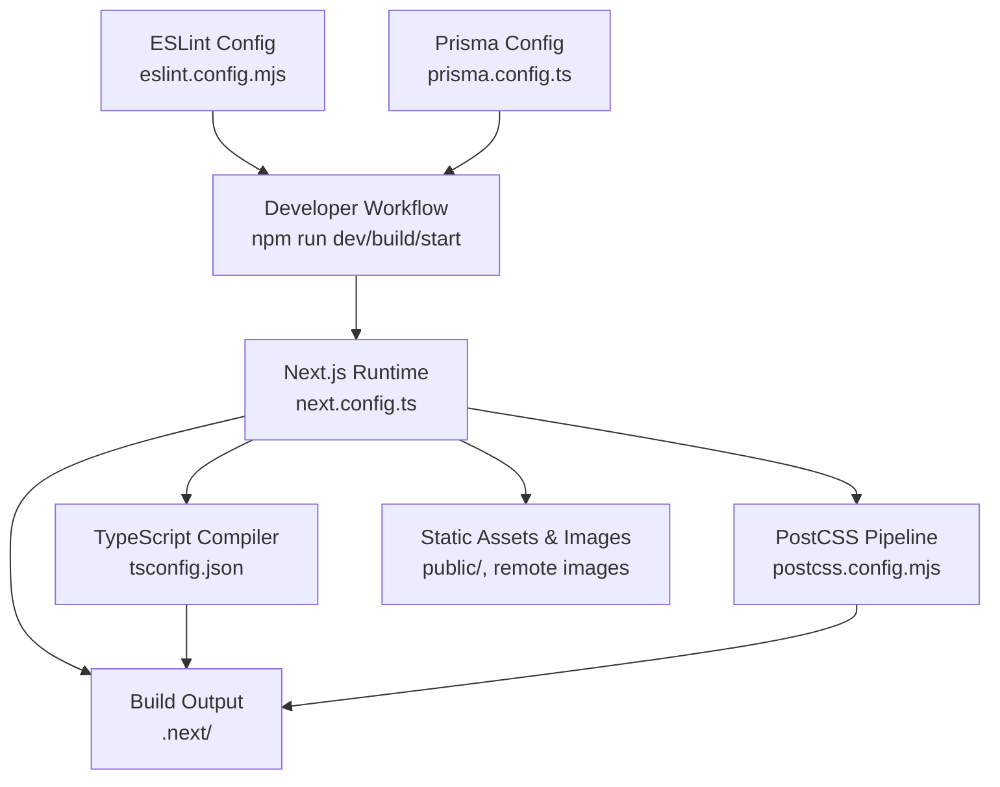
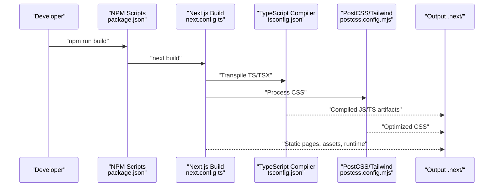
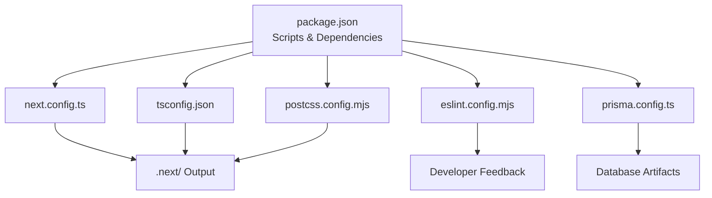

# Build Process & Optimization

<cite>
**Referenced Files in This Document**
- [next.config.ts](file://next.config.ts)
- [tsconfig.json](file://tsconfig.json)
- [package.json](file://package.json)
- [postcss.config.mjs](file://postcss.config.mjs)
- [eslint.config.mjs](file://eslint.config.mjs)
- [prisma.config.ts](file://prisma.config.ts)
</cite>

## Table of Contents
1. [Introduction](#introduction)
2. [Project Structure](#project-structure)
3. [Core Components](#core-components)
4. [Architecture Overview](#architecture-overview)
5. [Detailed Component Analysis](#detailed-component-analysis)
6. [Dependency Analysis](#dependency-analysis)
7. [Performance Considerations](#performance-considerations)
8. [Troubleshooting Guide](#troubleshooting-guide)
9. [Conclusion](#conclusion)
10. [Appendices](#appendices)

## Introduction
This document explains the build process and optimization strategies for the project, focusing on Next.js configuration, TypeScript compilation, asset optimization, and related performance techniques. It also covers bundle analysis, code splitting, static generation optimization, runtime performance, build caching, incremental compilation, development server tuning, and monitoring approaches.

## Project Structure
The project uses Next.js 16.2.6 with modern TypeScript settings and Tailwind CSS v4 via PostCSS. Key build-related files include Next.js configuration, TypeScript compiler options, PostCSS configuration, ESLint configuration, and Prisma configuration. Scripts in the package manifest define the standard development, build, and production commands.

**Diagram sources**
- [next.config.ts:1-24](file://next.config.ts#L1-L24)
- [tsconfig.json:1-35](file://tsconfig.json#L1-L35)
- [postcss.config.mjs:1-8](file://postcss.config.mjs#L1-L8)
- [eslint.config.mjs:1-26](file://eslint.config.mjs#L1-L26)
- [prisma.config.ts:1-16](file://prisma.config.ts#L1-L16)
- [package.json:5-11](file://package.json#L5-L11)

**Section sources**
- [package.json:5-11](file://package.json#L5-L11)
- [next.config.ts:1-24](file://next.config.ts#L1-L24)
- [tsconfig.json:1-35](file://tsconfig.json#L1-L35)
- [postcss.config.mjs:1-8](file://postcss.config.mjs#L1-L8)
- [eslint.config.mjs:1-26](file://eslint.config.mjs#L1-L26)
- [prisma.config.ts:1-16](file://prisma.config.ts#L1-L16)

## Core Components
- Next.js configuration controls compression, header removal, experimental stale times for dynamic/static routes, and image remote patterns for Cloudinary.
- TypeScript configuration enables strict mode, isolated modules, JSX transform, incremental builds, bundler module resolution, and path aliases.
- PostCSS pipeline integrates Tailwind CSS v4.
- ESLint configuration extends Next’s recommended rulesets for core web vitals and TypeScript support, with custom ignores.
- Prisma configuration defines schema location, migration path, and seed command.

**Section sources**
- [next.config.ts:3-20](file://next.config.ts#L3-L20)
- [tsconfig.json:2-24](file://tsconfig.json#L2-L24)
- [postcss.config.mjs:1-8](file://postcss.config.mjs#L1-L8)
- [eslint.config.mjs:5-23](file://eslint.config.mjs#L5-L23)
- [prisma.config.ts:6-15](file://prisma.config.ts#L6-L15)

## Architecture Overview
The build pipeline integrates developer scripts, Next.js compilation, TypeScript transpilation, and PostCSS processing. Asset optimization leverages Next’s built-in image optimization and configured remote patterns. Static generation and ISR are influenced by experimental stale times.

**Diagram sources**
- [package.json:5-11](file://package.json#L5-L11)
- [next.config.ts:3-20](file://next.config.ts#L3-L20)
- [tsconfig.json:2-24](file://tsconfig.json#L2-L24)
- [postcss.config.mjs:1-8](file://postcss.config.mjs#L1-L8)

## Detailed Component Analysis

### Next.js Build Configuration
Key areas:
- Compression: Enabled for smaller payloads.
- Header control: Removes the “powered by” header to reduce bytes.
- Experimental stale times: Sets cache lifetimes for dynamic and static routes to influence ISR behavior.
- Image optimization: Whitelists Cloudinary remote pattern for optimized delivery.

Recommendations:
- Monitor cache hit rates for dynamic/static routes to tune stale times.
- Validate image optimization impact by comparing sizes and CLS when adding/removing remote patterns.

**Section sources**
- [next.config.ts:3-20](file://next.config.ts#L3-L20)

### TypeScript Compilation Settings
Key areas:
- Strictness: Enforced via strict mode and skipLibCheck for faster checks.
- Module system: ESNext with bundler resolution for compatibility with Next’s toolchain.
- Incremental builds: Enabled to speed up development rebuilds.
- Isolated modules: Ensures safe transpilation per-file.
- JSX transform: Uses react-jsx with React 19.
- Path aliases: @/* mapped to ./src/* for cleaner imports.

Recommendations:
- Keep incremental enabled for fast dev cycles.
- Avoid disabling strict mode unless necessary; it improves reliability.
- Align module/target with Next’s expectations to prevent bundling mismatches.

**Section sources**
- [tsconfig.json:2-24](file://tsconfig.json#L2-L24)

### Asset Optimization and Image Handling
- Remote image optimization: Cloudinary is whitelisted for optimized delivery.
- Compression: Enabled at the framework level.
- CSS optimization: Tailwind CSS v4 via PostCSS reduces unused styles and optimizes output.

Recommendations:
- Prefer next/image for local/static assets; leverage remote patterns for external CDNs.
- Audit CSS bundle size after Tailwind purges and adjust purge directives if needed.
- Consider responsive image variants and appropriate formats (WebP/AVIF) for performance.

**Section sources**
- [next.config.ts:12-19](file://next.config.ts#L12-L19)
- [postcss.config.mjs:1-8](file://postcss.config.mjs#L1-L8)

### Bundle Analysis and Code Splitting
Approach:
- Next.js automatically splits chunks based on route boundaries and dynamic imports.
- Use the built-in analyzer or external tools to inspect bundle composition during development and post-build.

Recommendations:
- Identify large vendor bundles and externalize rarely changing dependencies if feasible.
- Split heavy pages/components using dynamic imports for non-critical paths.
- Monitor chunk sizes and entry points to avoid oversized initial payloads.

[No sources needed since this section provides general guidance]

### Static Generation Optimization
Approach:
- Experimental stale times influence ISR behavior for dynamic/static routes.
- Combine ISR with revalidation strategies for frequently updating content.

Recommendations:
- Tune stale times to balance freshness vs. caching benefits.
- Use fallback strategies for dynamic slugs to improve perceived performance.

**Section sources**
- [next.config.ts:6-11](file://next.config.ts#L6-L11)

### Runtime Performance Improvements
Approach:
- Compression reduces payload sizes.
- Removing unnecessary headers minimizes response overhead.
- Tailwind CSS v4 pipeline optimizes CSS output.

Recommendations:
- Enable HTTP/2 and keep connections alive for improved multiplexing.
- Serve compressed assets and enable browser caching for static resources.
- Minimize client-side hydration work by pre-rendering as much as possible.

**Section sources**
- [next.config.ts:4-5](file://next.config.ts#L4-L5)
- [postcss.config.mjs:1-8](file://postcss.config.mjs#L1-L8)

### Build Caching and Incremental Compilation
Approach:
- TypeScript incremental builds are enabled to speed up subsequent compilations.
- Next.js build cache persists artifacts between runs.

Recommendations:
- Clear caches when switching branches or updating tooling versions.
- Keep node_modules consistent across environments to maximize cache hits.

**Section sources**
- [tsconfig.json:15](file://tsconfig.json#L15)
- [package.json:5-11](file://package.json#L5-L11)

### Development Server Optimization
Approach:
- Use the standard dev script for fast refresh and incremental builds.
- ESLint integration helps catch issues early without blocking the dev loop.

Recommendations:
- Disable heavy lint rules during active development if needed; re-enable for CI.
- Keep dev dependencies minimal to reduce startup time.

**Section sources**
- [package.json:6](file://package.json#L6)
- [eslint.config.mjs:5-23](file://eslint.config.mjs#L5-L23)

### Monitoring Build Performance and Identifying Opportunities
Approach:
- Track build duration and artifact sizes across commits.
- Use bundle analyzers to identify regressions.
- Observe Lighthouse/Core Web Vitals metrics in staging.

Recommendations:
- Set up automated reporting for bundle sizes and build times.
- Establish thresholds for PR checks to prevent performance regressions.

[No sources needed since this section provides general guidance]

## Dependency Analysis
The project’s build-time dependencies include Next.js, TypeScript, ESLint, Tailwind CSS v4, and Prisma. These integrate through their respective configuration files and scripts.

**Diagram sources**
- [package.json:5-46](file://package.json#L5-L46)
- [next.config.ts:1-24](file://next.config.ts#L1-L24)
- [tsconfig.json:1-35](file://tsconfig.json#L1-L35)
- [eslint.config.mjs:1-26](file://eslint.config.mjs#L1-L26)
- [postcss.config.mjs:1-8](file://postcss.config.mjs#L1-L8)
- [prisma.config.ts:1-16](file://prisma.config.ts#L1-L16)

**Section sources**
- [package.json:5-46](file://package.json#L5-L46)
- [next.config.ts:1-24](file://next.config.ts#L1-L24)
- [tsconfig.json:1-35](file://tsconfig.json#L1-L35)
- [eslint.config.mjs:1-26](file://eslint.config.mjs#L1-L26)
- [postcss.config.mjs:1-8](file://postcss.config.mjs#L1-L8)
- [prisma.config.ts:1-16](file://prisma.config.ts#L1-L16)

## Performance Considerations
- Keep compression enabled for production builds.
- Use incremental TypeScript builds and avoid unnecessary strict checks in dev.
- Leverage Next’s automatic code splitting and route-based chunking.
- Optimize CSS via Tailwind and remove unused styles regularly.
- Monitor and adjust ISR stale times to balance freshness and caching.

[No sources needed since this section provides general guidance]

## Troubleshooting Guide
- Build fails due to TypeScript errors: Review strict mode and path alias resolutions.
- Unexpected CSS output: Verify Tailwind plugin configuration and purge settings.
- Slow dev rebuilds: Confirm incremental builds are enabled and node_modules are consistent.
- ESLint conflicts: Adjust overrides in the ESLint config to align with project needs.
- Prisma schema changes: Regenerate client and migrations accordingly.

**Section sources**
- [tsconfig.json:2-24](file://tsconfig.json#L2-L24)
- [postcss.config.mjs:1-8](file://postcss.config.mjs#L1-L8)
- [eslint.config.mjs:5-23](file://eslint.config.mjs#L5-L23)
- [prisma.config.ts:6-15](file://prisma.config.ts#L6-L15)

## Conclusion
The project’s build configuration emphasizes modern tooling with Next.js 16, TypeScript incremental compilation, and Tailwind CSS v4. By leveraging compression, ISR stale times, and optimized image handling, combined with careful bundle analysis and runtime tuning, the project can achieve efficient builds and strong performance in production.

[No sources needed since this section summarizes without analyzing specific files]

## Appendices
- Build commands:
  - Development: [package.json:6](file://package.json#L6)
  - Production build: [package.json:7](file://package.json#L7)
  - Production start: [package.json:8](file://package.json#L8)

**Section sources**
- [package.json:5-11](file://package.json#L5-L11)