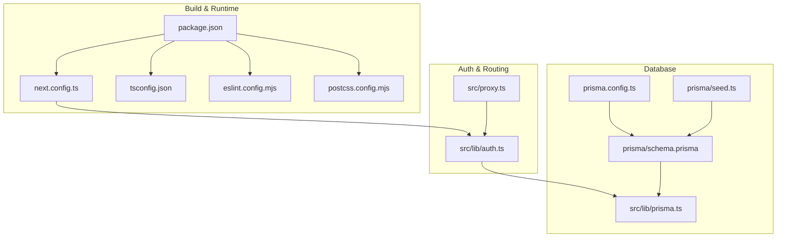
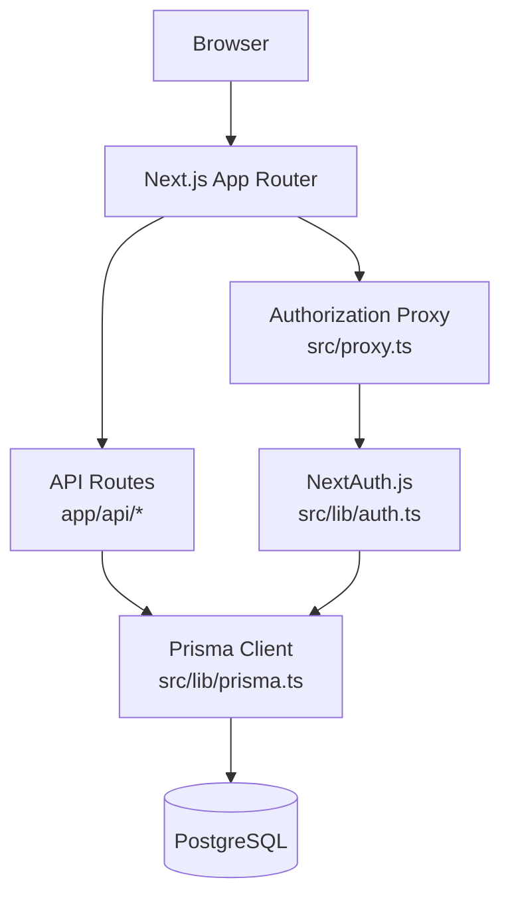
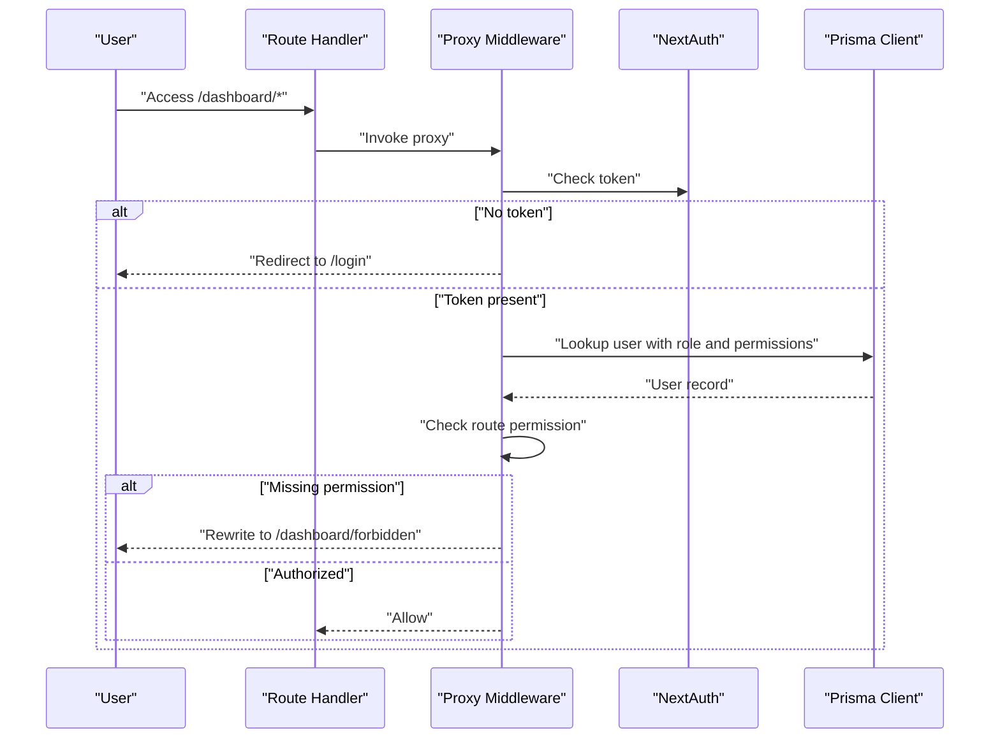
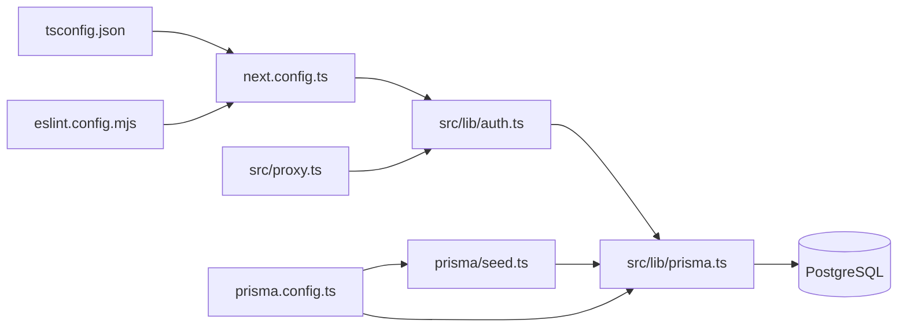

# Configuration & Deployment

<cite>
**Referenced Files in This Document**
- [package.json](file://package.json)
- [next.config.ts](file://next.config.ts)
- [tsconfig.json](file://tsconfig.json)
- [eslint.config.mjs](file://eslint.config.mjs)
- [postcss.config.mjs](file://postcss.config.mjs)
- [prisma/schema.prisma](file://prisma/schema.prisma)
- [prisma.config.ts](file://prisma.config.ts)
- [src/lib/prisma.ts](file://src/lib/prisma.ts)
- [src/lib/auth.ts](file://src/lib/auth.ts)
- [src/proxy.ts](file://src/proxy.ts)
- [prisma/seed.ts](file://prisma/seed.ts)
- [README.md](file://README.md)
</cite>

## Table of Contents
1. [Introduction](#introduction)
2. [Project Structure](#project-structure)
3. [Core Components](#core-components)
4. [Architecture Overview](#architecture-overview)
5. [Detailed Component Analysis](#detailed-component-analysis)
6. [Dependency Analysis](#dependency-analysis)
7. [Performance Considerations](#performance-considerations)
8. [Troubleshooting Guide](#troubleshooting-guide)
9. [Conclusion](#conclusion)
10. [Appendices](#appendices)

## Introduction
This document explains how to configure, build, and deploy the application. It covers environment configuration, build optimization, TypeScript compilation, Prisma database setup, production deployment options, performance monitoring, maintenance procedures, Docker containerization, CI/CD pipeline setup, cloud platform deployment, security hardening, backup strategies, and disaster recovery procedures. The guidance is grounded in the repository’s configuration files and implementation details.

## Project Structure
The project is a Next.js 16 application with TypeScript, Tailwind CSS v4, Prisma ORM, and NextAuth.js for authentication. Key configuration areas include:
- Build and runtime configuration via Next.js configuration
- Type checking and transpilation via TypeScript configuration
- Code quality and linting via ESLint configuration
- Styling via PostCSS/Tailwind
- Database modeling and client generation via Prisma
- Environment-driven database connectivity and seeding via Prisma CLI configuration
- Authentication and authorization middleware via NextAuth.js and a custom proxy

**Diagram sources**
- [next.config.ts:1-24](file://next.config.ts#L1-L24)
- [package.json:1-48](file://package.json#L1-L48)
- [tsconfig.json:1-35](file://tsconfig.json#L1-L35)
- [eslint.config.mjs:1-26](file://eslint.config.mjs#L1-L26)
- [postcss.config.mjs:1-8](file://postcss.config.mjs#L1-L8)
- [prisma/schema.prisma:1-487](file://prisma/schema.prisma#L1-L487)
- [prisma.config.ts:1-16](file://prisma.config.ts#L1-L16)
- [prisma/seed.ts:1-174](file://prisma/seed.ts#L1-L174)
- [src/lib/prisma.ts:1-31](file://src/lib/prisma.ts#L1-L31)
- [src/lib/auth.ts:1-81](file://src/lib/auth.ts#L1-L81)
- [src/proxy.ts:1-60](file://src/proxy.ts#L1-L60)

**Section sources**
- [package.json:1-48](file://package.json#L1-L48)
- [next.config.ts:1-24](file://next.config.ts#L1-L24)
- [tsconfig.json:1-35](file://tsconfig.json#L1-L35)
- [eslint.config.mjs:1-26](file://eslint.config.mjs#L1-L26)
- [postcss.config.mjs:1-8](file://postcss.config.mjs#L1-L8)
- [prisma/schema.prisma:1-487](file://prisma/schema.prisma#L1-L487)
- [prisma.config.ts:1-16](file://prisma.config.ts#L1-L16)
- [prisma/seed.ts:1-174](file://prisma/seed.ts#L1-L174)
- [src/lib/prisma.ts:1-31](file://src/lib/prisma.ts#L1-L31)
- [src/lib/auth.ts:1-81](file://src/lib/auth.ts#L1-L81)
- [src/proxy.ts:1-60](file://src/proxy.ts#L1-L60)

## Core Components
- Next.js configuration: Enables compression, removes server header, sets experimental stale timing, and whitelists Cloudinary for remote image optimization.
- TypeScript configuration: Strict mode, ES2017 target, bundler module resolution, isolated modules, JSX transform, path aliases, and incremental builds.
- ESLint configuration: Extends Next.js recommended configs for web vitals and TypeScript, with custom global ignores for database maintenance scripts.
- Prisma configuration: Driver adapters enabled, PostgreSQL provider, schema path, migrations path, and seed command configured via environment variable.
- Prisma client: Singleton pattern with a Postgres pool adapter, enforcing a single connection per serverless instance and safe timeouts.
- Authentication: NextAuth.js with JWT strategy, credential provider, bcrypt password comparison, and role/permission callbacks.
- Authorization proxy: Route-based permission checks for protected dashboard routes, redirecting unauthenticated or unauthorized users.

**Section sources**
- [next.config.ts:1-24](file://next.config.ts#L1-L24)
- [tsconfig.json:1-35](file://tsconfig.json#L1-L35)
- [eslint.config.mjs:1-26](file://eslint.config.mjs#L1-L26)
- [prisma/schema.prisma:1-487](file://prisma/schema.prisma#L1-L487)
- [prisma.config.ts:1-16](file://prisma.config.ts#L1-L16)
- [src/lib/prisma.ts:1-31](file://src/lib/prisma.ts#L1-L31)
- [src/lib/auth.ts:1-81](file://src/lib/auth.ts#L1-L81)
- [src/proxy.ts:1-60](file://src/proxy.ts#L1-L60)

## Architecture Overview
The application follows a layered architecture:
- Presentation layer: Next.js App Router pages and API routes
- Business logic: Actions under app/actions and UI clients under components/dashboard
- Persistence: Prisma client with a Postgres adapter
- Security: NextAuth.js for authentication and a custom authorization proxy for fine-grained permissions
- Build and tooling: TypeScript, ESLint, PostCSS/Tailwind, and Prisma CLI

**Diagram sources**
- [src/lib/auth.ts:1-81](file://src/lib/auth.ts#L1-L81)
- [src/proxy.ts:1-60](file://src/proxy.ts#L1-L60)
- [src/lib/prisma.ts:1-31](file://src/lib/prisma.ts#L1-L31)
- [prisma/schema.prisma:1-487](file://prisma/schema.prisma#L1-L487)

## Detailed Component Analysis

### Next.js Configuration
Key settings:
- Compression enabled for response compression
- Server header disabled for reduced fingerprinting
- Experimental stale timing for dynamic and static routes
- Remote image optimization restricted to Cloudinary domain

Operational impact:
- Improves bandwidth usage and latency
- Reduces server metadata exposure
- Balances freshness and caching for dynamic content

**Section sources**
- [next.config.ts:1-24](file://next.config.ts#L1-L24)

### TypeScript Compilation Settings
Key compiler options:
- Target ES2017, strict type checking, no emit, bundler module resolution
- Isolated modules and incremental builds for faster local development
- JSX transform and path aliases (@/*) for ergonomic imports
- Plugin integration for Next.js

Operational impact:
- Enforces strong typing and safer refactors
- Faster rebuilds during development
- Consistent module resolution across the monorepo-like structure

**Section sources**
- [tsconfig.json:1-35](file://tsconfig.json#L1-L35)

### ESLint Configuration
Highlights:
- Extends Next.js recommended configs for core web vitals and TypeScript
- Ignores default Next.js build artifacts and database maintenance scripts

Operational impact:
- Maintains code quality aligned with Next.js best practices
- Prevents noise from maintenance scripts in lint results

**Section sources**
- [eslint.config.mjs:1-26](file://eslint.config.mjs#L1-L26)

### Prisma Database Configuration
Schema overview:
- Client generator with driver adapters preview feature
- PostgreSQL datasource
- Rich domain models for users, roles, permissions, residents, assignments, monitoring, regions, audit logs, and room history

Client configuration:
- Singleton Prisma client backed by a Postgres pool adapter
- Single connection per serverless instance with explicit timeouts
- Environment-driven DATABASE_URL

Seed script:
- Seeds permissions, roles, and a default admin user
- Upserts permissions and assigns them to a SUPER_ADMIN role
- Creates or updates a default admin user with a hashed password

**Section sources**
- [prisma/schema.prisma:1-487](file://prisma/schema.prisma#L1-L487)
- [src/lib/prisma.ts:1-31](file://src/lib/prisma.ts#L1-L31)
- [prisma.config.ts:1-16](file://prisma.config.ts#L1-L16)
- [prisma/seed.ts:1-174](file://prisma/seed.ts#L1-L174)

### Authentication and Authorization
Authentication:
- Credentials provider with bcrypt password verification
- JWT strategy with callbacks to attach role and permissions
- Secret sourced from NEXTAUTH_SECRET

Authorization:
- Route-based permission mapping for dashboard prefixes
- Redirects unauthenticated users to login
- Rewrites unauthorized users to a forbidden page

**Diagram sources**
- [src/proxy.ts:1-60](file://src/proxy.ts#L1-L60)
- [src/lib/auth.ts:1-81](file://src/lib/auth.ts#L1-L81)
- [src/lib/prisma.ts:1-31](file://src/lib/prisma.ts#L1-L31)

**Section sources**
- [src/lib/auth.ts:1-81](file://src/lib/auth.ts#L1-L81)
- [src/proxy.ts:1-60](file://src/proxy.ts#L1-L60)

### Build and Tooling
- Scripts: dev, build, start, lint, and postinstall Prisma generation
- Dependencies: Next.js 16, NextAuth.js, Prisma client, Postgres adapter, Tailwind CSS v4, React 19, and others
- Dev dependencies: TypeScript, ESLint, Tailwind, and related tooling

Operational impact:
- Streamlined developer workflow with automated Prisma client generation
- Consistent linting and formatting aligned with Next.js conventions

**Section sources**
- [package.json:1-48](file://package.json#L1-L48)

## Dependency Analysis
High-level dependencies:
- Next.js runtime depends on TypeScript configuration and ESLint for development
- Prisma client depends on Postgres adapter and DATABASE_URL
- Authentication depends on NextAuth.js and Prisma for user lookup
- Authorization proxy depends on NextAuth tokens and Prisma for permissions

**Diagram sources**
- [tsconfig.json:1-35](file://tsconfig.json#L1-L35)
- [eslint.config.mjs:1-26](file://eslint.config.mjs#L1-L26)
- [next.config.ts:1-24](file://next.config.ts#L1-L24)
- [src/lib/auth.ts:1-81](file://src/lib/auth.ts#L1-L81)
- [src/lib/prisma.ts:1-31](file://src/lib/prisma.ts#L1-L31)
- [src/proxy.ts:1-60](file://src/proxy.ts#L1-L60)
- [prisma/seed.ts:1-174](file://prisma/seed.ts#L1-L174)
- [prisma.config.ts:1-16](file://prisma.config.ts#L1-L16)

**Section sources**
- [package.json:1-48](file://package.json#L1-L48)
- [prisma/schema.prisma:1-487](file://prisma/schema.prisma#L1-L487)

## Performance Considerations
- Next.js compression reduces payload sizes; disable if your CDN handles compression.
- Experimental stale timing balances cache freshness; tune dynamic/static values based on content volatility.
- Prisma singleton with a single pooled connection prevents connection thrashing in serverless environments.
- Incremental TypeScript builds accelerate local iteration.
- Tailwind CSS v4 with PostCSS minimizes CSS bundle size; ensure purging aligns with actual usage.

[No sources needed since this section provides general guidance]

## Troubleshooting Guide
Common issues and resolutions:
- Missing DATABASE_URL: The Prisma client throws an error if the environment variable is not set. Ensure DATABASE_URL is configured in the runtime environment.
- Authentication secret missing: NEXTAUTH_SECRET must be set; otherwise, session creation fails.
- Lint errors for maintenance scripts: ESLint ignores database maintenance scripts by design; exclude them from linting if necessary.
- Image optimization blocked: Remote images are restricted to Cloudinary; adjust remotePatterns if hosting images elsewhere.

**Section sources**
- [src/lib/prisma.ts:1-31](file://src/lib/prisma.ts#L1-L31)
- [src/lib/auth.ts:1-81](file://src/lib/auth.ts#L1-L81)
- [eslint.config.mjs:1-26](file://eslint.config.mjs#L1-L26)
- [next.config.ts:1-24](file://next.config.ts#L1-L24)

## Conclusion
The application is configured for modern development and production readiness with Next.js 16, TypeScript, Prisma, and NextAuth.js. The provided configurations enable efficient builds, secure authentication, and maintainable database operations. The subsequent appendices outline practical deployment and operational procedures.

[No sources needed since this section summarizes without analyzing specific files]

## Appendices

### Environment Configuration
Required environment variables:
- DATABASE_URL: Postgres connection string for Prisma
- NEXTAUTH_SECRET: Secret for signing JWT tokens
- NEXT_PUBLIC_APP_URL: Public application URL for redirects and links

Recommended practices:
- Store secrets in a secure secrets manager or platform vault
- Use distinct secrets for development, staging, and production
- Rotate NEXTAUTH_SECRET periodically and invalidate sessions as needed

**Section sources**
- [src/lib/prisma.ts:1-31](file://src/lib/prisma.ts#L1-L31)
- [src/lib/auth.ts:1-81](file://src/lib/auth.ts#L1-L81)
- [prisma.config.ts:1-16](file://prisma.config.ts#L1-L16)

### Build Optimization
- Use Next.js build output for static generation where possible
- Keep experimental stale timing tuned to content change frequency
- Enable compression and remove server headers for production deployments
- Leverage incremental TypeScript builds and isolated modules for faster local development

**Section sources**
- [next.config.ts:1-24](file://next.config.ts#L1-L24)
- [tsconfig.json:1-35](file://tsconfig.json#L1-L35)

### Prisma Database Configuration
- Provider: PostgreSQL
- Preview feature: driverAdapters enabled
- Migrations: Managed under prisma/migrations
- Seed: Executed via ts-node with CommonJS compiler options

Maintenance:
- Run migrations after schema changes
- Seed initial data using the seed script
- Monitor long-running queries and add indexes as needed

**Section sources**
- [prisma/schema.prisma:1-487](file://prisma/schema.prisma#L1-L487)
- [prisma.config.ts:1-16](file://prisma.config.ts#L1-L16)
- [prisma/seed.ts:1-174](file://prisma/seed.ts#L1-L174)

### Production Deployment Options
- Vercel: Official Next.js deployment platform; supports environment variables and serverless functions
- Self-hosted: Build the application and serve with a Node.js runtime or containerized deployment
- Static export: If applicable, leverage Next.js static generation for CDN delivery

**Section sources**
- [README.md:32-36](file://README.md#L32-L36)
- [package.json:1-48](file://package.json#L1-48)

### Performance Monitoring
- Instrument Next.js metrics and Web Vitals via platform dashboards
- Track database query performance and slow queries
- Monitor authentication and authorization latencies
- Set up alerting for error rates, response times, and resource utilization

[No sources needed since this section provides general guidance]

### Maintenance Procedures
- Regularly update dependencies and run type checks
- Review and prune unused permissions and roles
- Back up the database regularly and test restore procedures
- Rotate secrets and review access logs

[No sources needed since this section provides general guidance]

### Docker Containerization
- Build a minimal image with the Next.js production build
- Copy the .next build output and static assets
- Set environment variables for DATABASE_URL and NEXTAUTH_SECRET
- Expose the port configured by Next.js (default 3000)
- Use a non-root user and read-only filesystem for security

[No sources needed since this section provides general guidance]

### CI/CD Pipeline Setup
- Install dependencies and generate Prisma client
- Run linting and type checks
- Execute database migrations in CI/CD environment
- Build and test the application
- Push container image to registry and deploy to target environment

[No sources needed since this section provides general guidance]

### Cloud Platform Deployment
- AWS: Use Lambda with Layers for Node runtime, RDS for PostgreSQL, Parameter Store for secrets
- Azure: Use Functions with PostgreSQL flexible server, Key Vault for secrets
- GCP: Use Cloud Run with Cloud SQL, Secret Manager for secrets

[No sources needed since this section provides general guidance]

### Security Hardening
- Enforce HTTPS and secure cookies
- Limit exposed ports and reduce attack surface
- Use least-privilege IAM roles and service accounts
- Regularly audit permissions and access patterns
- Apply security patches promptly

[No sources needed since this section provides general guidance]

### Backup Strategies
- Schedule regular logical backups of the PostgreSQL database
- Store backups in secure, encrypted storage
- Automate backup verification and restore drills
- Maintain offsite copies for geographic redundancy

[No sources needed since this section provides general guidance]

### Disaster Recovery Procedures
- Document RTO/RPO targets and recovery steps
- Test failover scenarios for database and application tiers
- Maintain runbooks for incident response and escalation
- Coordinate with stakeholders for communication during incidents

[No sources needed since this section provides general guidance]