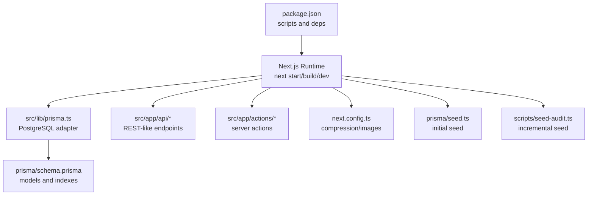
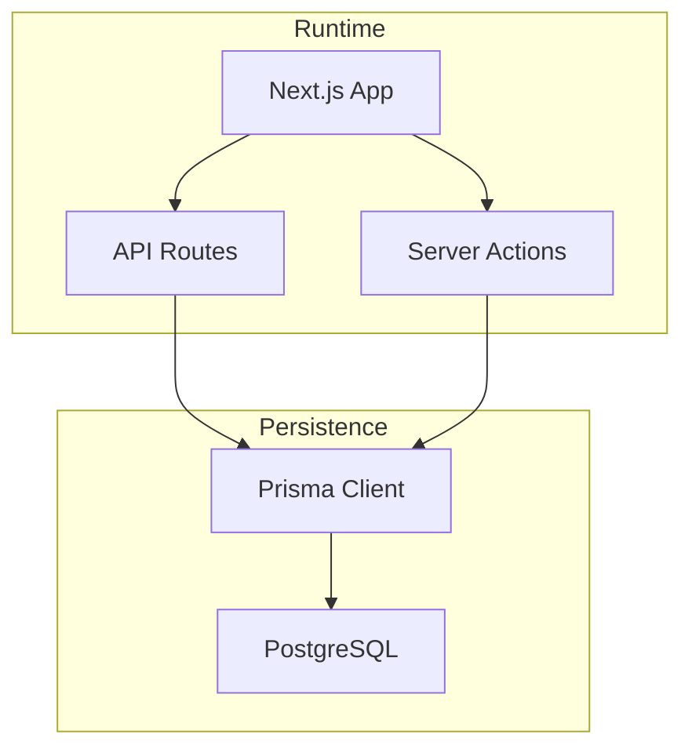
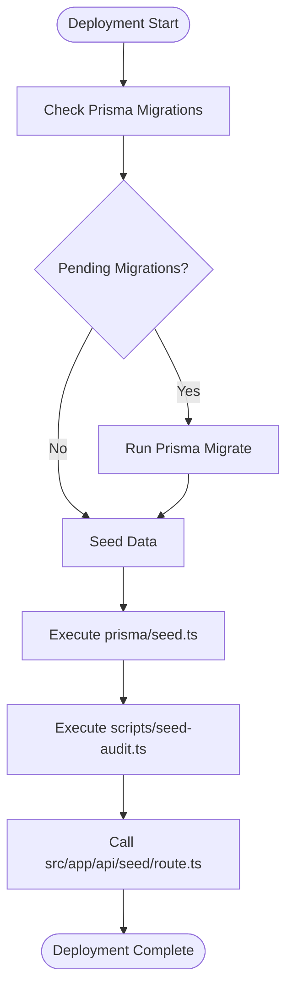
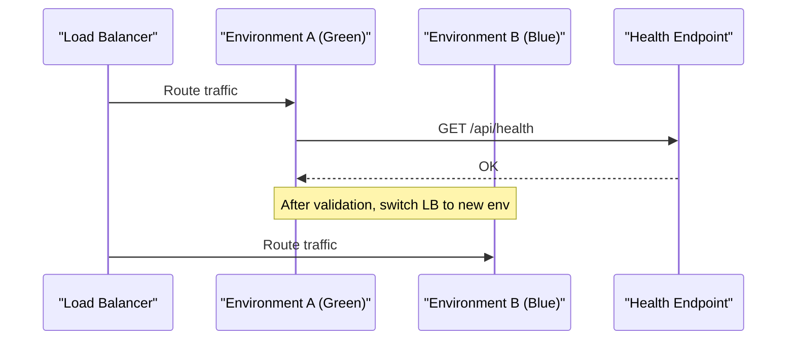
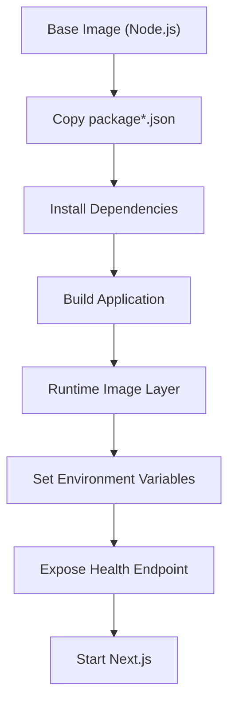
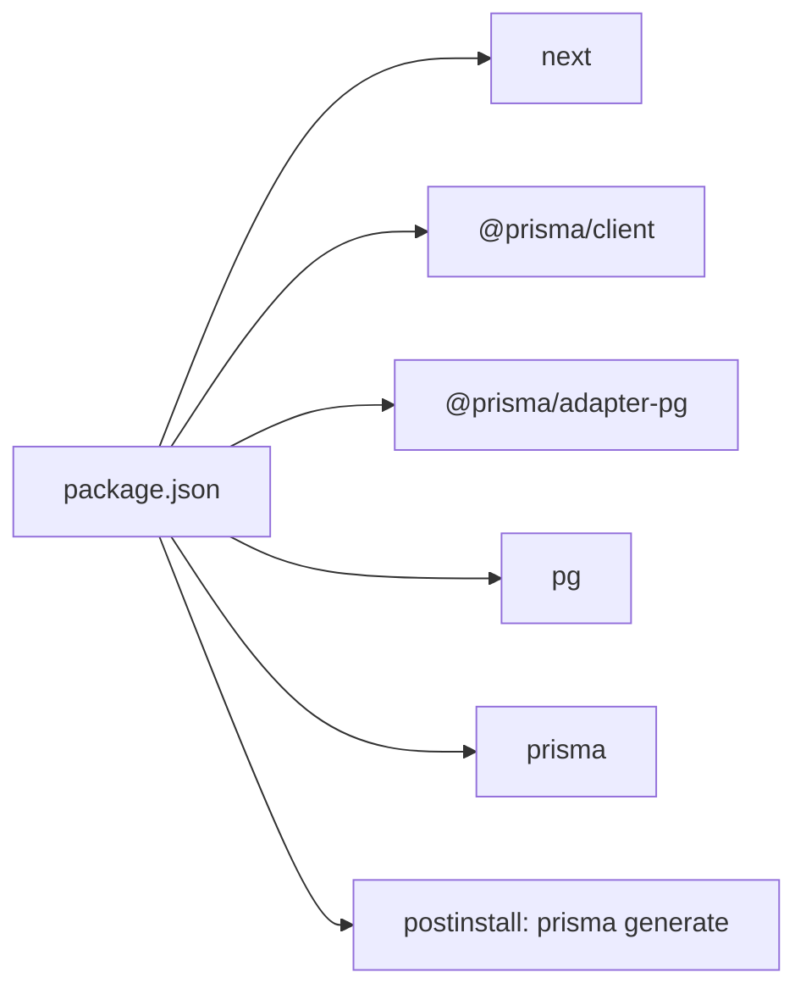

# Deployment Strategies

<cite>
**Referenced Files in This Document**
- [package.json](file://package.json)
- [README.md](file://README.md)
- [next.config.ts](file://next.config.ts)
- [prisma/schema.prisma](file://prisma/schema.prisma)
- [src/lib/prisma.ts](file://src/lib/prisma.ts)
- [prisma/seed.ts](file://prisma/seed.ts)
- [scripts/seed-audit.ts](file://scripts/seed-audit.ts)
- [src/app/api/seed/route.ts](file://src/app/api/seed/route.ts)
- [src/app/api/health/route.ts](file://src/app/api/health/route.ts)
- [src/app/api/upload/route.ts](file://src/app/api/upload/route.ts)
- [src/app/api/users/route.ts](file://src/app/api/users/route.ts)
- [src/app/api/referensi/provinces/route.ts](file://src/app/api/referensi/provinces/route.ts)
- [src/app/api/referensi/districts/route.ts](file://src/app/api/referensi/districts/route.ts)
- [src/app/api/referensi/countries/route.ts](file://src/app/api/referensi/countries/route.ts)
- [src/app/api/referensi/regencies/route.ts](file://src/app/api/referensi/regencies/route.ts)
- [src/app/api/referensi/villages/route.ts](file://src/app/api/referensi/villages/route.ts)
- [src/app/actions/residents.ts](file://src/app/actions/residents.ts)
- [src/app/actions/masterData.ts](file://src/app/actions/masterData.ts)
- [src/app/actions/roles.ts](file://src/app/actions/roles.ts)
- [src/app/actions/assignments.ts](file://src/app/actions/assignments.ts)
- [src/app/actions/audit.ts](file://src/app/actions/audit.ts)
- [src/app/actions/monitoring.ts](file://src/app/actions/monitoring.ts)
- [src/app/actions/muallim.ts](file://src/app/actions/muallim.ts)
- [src/app/actions/kbm.ts](file://src/app/actions/kbm.ts)
- [src/app/actions/wilayah.ts](file://src/app/actions/wilayah.ts)
- [src/app/actions/laporan.ts](file://src/app/actions/laporan.ts)
- [src/app/actions/settings.ts](file://src/app/actions/settings.ts)
- [src/app/actions/roomTransfer.ts](file://src/app/actions/roomTransfer.ts)
- [src/app/actions/absensiApel.ts](file://src/app/actions/absensiApel.ts)
- [src/app/actions/absensiKegiatan.ts](file://src/app/actions/absensiKegiatan.ts)
- [src/app/actions/absensiMuallim.ts](file://src/app/actions/absensiMuallim.ts)
- [src/lib/auth.ts](file://src/lib/auth.ts)
- [src/lib/permissions.ts](file://src/lib/permissions.ts)
- [src/utils/residentExport.ts](file://src/utils/residentExport.ts)
</cite>

## Table of Contents
1. [Introduction](#introduction)
2. [Project Structure](#project-structure)
3. [Core Components](#core-components)
4. [Architecture Overview](#architecture-overview)
5. [Detailed Component Analysis](#detailed-component-analysis)
6. [Dependency Analysis](#dependency-analysis)
7. [Performance Considerations](#performance-considerations)
8. [Troubleshooting Guide](#troubleshooting-guide)
9. [Conclusion](#conclusion)
10. [Appendices](#appendices)

## Introduction
This document provides comprehensive deployment strategies for the application, covering traditional server deployment, cloud platforms (Vercel, AWS, GCP), and containerized deployment with Docker. It also documents database migration and seed strategies, rollback procedures, CI/CD pipeline setup, automated testing integration, and deployment techniques such as blue-green deployments and canary releases. Guidance is grounded in the repository’s configuration and codebase.

## Project Structure
The application is a Next.js 16 application with a Prisma-managed PostgreSQL backend. Key deployment-relevant elements include:
- Build and runtime scripts defined in package.json
- Next.js configuration for compression, caching, and image optimization
- Prisma schema defining PostgreSQL models and indexes
- Environment-driven Prisma client initialization via a Postgres connection string
- API routes under src/app/api for seeding, health checks, uploads, and administrative endpoints
- Action modules under src/app/actions encapsulating server-side operations
- Seed scripts for initial data and incremental updates

**Diagram sources**
- [package.json:1-48](file://package.json#L1-L48)
- [next.config.ts:1-24](file://next.config.ts#L1-L24)
- [prisma/schema.prisma:1-487](file://prisma/schema.prisma#L1-L487)
- [src/lib/prisma.ts:1-31](file://src/lib/prisma.ts#L1-L31)
- [prisma/seed.ts:1-174](file://prisma/seed.ts#L1-L174)
- [scripts/seed-audit.ts:1-42](file://scripts/seed-audit.ts#L1-L42)

**Section sources**
- [package.json:1-48](file://package.json#L1-L48)
- [next.config.ts:1-24](file://next.config.ts#L1-L24)
- [prisma/schema.prisma:1-487](file://prisma/schema.prisma#L1-L487)
- [src/lib/prisma.ts:1-31](file://src/lib/prisma.ts#L1-L31)
- [prisma/seed.ts:1-174](file://prisma/seed.ts#L1-L174)
- [scripts/seed-audit.ts:1-42](file://scripts/seed-audit.ts#L1-L42)

## Core Components
- Build and runtime lifecycle:
  - Scripts define dev, build, start, lint, and postinstall hooks. The postinstall hook runs Prisma client generation.
- Database connectivity:
  - The Prisma client is initialized with a PostgreSQL adapter using a connection string from the environment. Connection pooling is configured with a single connection for serverless environments.
- API surface:
  - Health check endpoint, seed endpoint, upload endpoint, and administrative endpoints under src/app/api.
- Actions:
  - Server actions encapsulate write operations for residents, master data, roles, assignments, audit, monitoring, muallim, kbm, wilayah, laporan, settings, room transfers, and attendance.
- Configuration:
  - Compression enabled, stale times configured for dynamic/static routes, and Cloudinary remote image pattern allowed.

**Section sources**
- [package.json:5-11](file://package.json#L5-L11)
- [src/lib/prisma.ts:5-28](file://src/lib/prisma.ts#L5-L28)
- [src/app/api/health/route.ts:1-200](file://src/app/api/health/route.ts)
- [src/app/api/seed/route.ts:1-200](file://src/app/api/seed/route.ts)
- [src/app/api/upload/route.ts:1-200](file://src/app/api/upload/route.ts)
- [src/app/actions/residents.ts:1-200](file://src/app/actions/residents.ts)
- [src/app/actions/masterData.ts:1-200](file://src/app/actions/masterData.ts)
- [src/app/actions/roles.ts:1-200](file://src/app/actions/roles.ts)
- [src/app/actions/assignments.ts:1-200](file://src/app/actions/assignments.ts)
- [src/app/actions/audit.ts:1-200](file://src/app/actions/audit.ts)
- [src/app/actions/monitoring.ts:1-200](file://src/app/actions/monitoring.ts)
- [src/app/actions/muallim.ts:1-200](file://src/app/actions/muallim.ts)
- [src/app/actions/kbm.ts:1-200](file://src/app/actions/kbm.ts)
- [src/app/actions/wilayah.ts:1-200](file://src/app/actions/wilayah.ts)
- [src/app/actions/laporan.ts:1-200](file://src/app/actions/laporan.ts)
- [src/app/actions/settings.ts:1-200](file://src/app/actions/settings.ts)
- [src/app/actions/roomTransfer.ts:1-200](file://src/app/actions/roomTransfer.ts)
- [src/app/actions/absensiApel.ts:1-200](file://src/app/actions/absensiApel.ts)
- [src/app/actions/absensiKegiatan.ts:1-200](file://src/app/actions/absensiKegiatan.ts)
- [src/app/actions/absensiMuallim.ts:1-200](file://src/app/actions/absensiMuallim.ts)
- [next.config.ts:4-20](file://next.config.ts#L4-L20)

## Architecture Overview
The deployment architecture centers on a frontend built with Next.js and a backend composed of:
- API routes for administrative tasks and data operations
- Server actions for secure, server-side mutations
- Prisma ORM with a PostgreSQL adapter for data persistence
- Environment variables for secrets and configuration

**Diagram sources**
- [src/app/api/seed/route.ts:1-200](file://src/app/api/seed/route.ts)
- [src/app/api/upload/route.ts:1-200](file://src/app/api/upload/route.ts)
- [src/app/actions/residents.ts:1-200](file://src/app/actions/residents.ts)
- [src/lib/prisma.ts:1-31](file://src/lib/prisma.ts#L1-L31)
- [prisma/schema.prisma:1-487](file://prisma/schema.prisma#L1-L487)

## Detailed Component Analysis

### Database Migration and Seed Strategy
- Migrations:
  - A migration exists to relax a column constraint for a model. Apply migrations during deployment using Prisma CLI or equivalent commands.
- Seed:
  - Initial seed script creates permissions, roles, and a default admin user.
  - Incremental seed script assigns a new permission to existing system roles.
  - An API route exposes a seed endpoint for controlled seeding in production environments.

**Diagram sources**
- [prisma/schema.prisma:1-487](file://prisma/schema.prisma#L1-L487)
- [prisma/seed.ts:1-174](file://prisma/seed.ts#L1-L174)
- [scripts/seed-audit.ts:1-42](file://scripts/seed-audit.ts#L1-L42)
- [src/app/api/seed/route.ts:1-200](file://src/app/api/seed/route.ts)

**Section sources**
- [prisma/schema.prisma:1-487](file://prisma/schema.prisma#L1-L487)
- [prisma/seed.ts:1-174](file://prisma/seed.ts#L1-L174)
- [scripts/seed-audit.ts:1-42](file://scripts/seed-audit.ts#L1-L42)
- [src/app/api/seed/route.ts:1-200](file://src/app/api/seed/route.ts)

### Zero-Downtime and Release Techniques
- Blue-Green Deployment:
  - Maintain two identical environments. Deploy to the inactive environment, verify health, switch traffic, and decommission the previous environment.
- Canary Releases:
  - Gradually shift a percentage of traffic to the new release while monitoring metrics and logs.
- Health Checks:
  - Use the health endpoint to gate deployments and confirm readiness.

**Diagram sources**
- [src/app/api/health/route.ts:1-200](file://src/app/api/health/route.ts)

**Section sources**
- [src/app/api/health/route.ts:1-200](file://src/app/api/health/route.ts)

### Traditional Server Deployment
- Prerequisites:
  - Node.js runtime aligned with the project’s engine requirements
  - PostgreSQL instance reachable by the application
- Steps:
  - Install dependencies
  - Set environment variables (DATABASE_URL, NEXT_PUBLIC_APP_URL, etc.)
  - Build the application
  - Start the Next.js production server
- Observability:
  - Expose and monitor the health endpoint

**Section sources**
- [package.json:5-11](file://package.json#L5-L11)
- [src/lib/prisma.ts:6-8](file://src/lib/prisma.ts#L6-L8)
- [src/app/api/health/route.ts:1-200](file://src/app/api/health/route.ts)

### Vercel Deployment
- Platform Notes:
  - The project README indicates Vercel as a deployment option for Next.js applications.
- Recommendations:
  - Configure environment variables in Vercel settings (DATABASE_URL, NEXTAUTH providers)
  - Use Vercel’s serverless runtime; ensure database connections are handled by the Prisma adapter
  - Enable Next.js optimizations configured in next.config.ts

**Section sources**
- [README.md:32-36](file://README.md#L32-L36)
- [next.config.ts:4-20](file://next.config.ts#L4-L20)
- [src/lib/prisma.ts:10-17](file://src/lib/prisma.ts#L10-L17)

### AWS Deployment
- Options:
  - Elastic Beanstalk (Node.js)
  - ECS/EKS with Nginx/PM2
  - Lambda with API Gateway (limited suitability for long-lived sessions)
- Steps:
  - Package the application
  - Provision a RDS PostgreSQL instance
  - Set environment variables (DATABASE_URL, NEXTAUTH)
  - Deploy artifacts and configure health checks

**Section sources**
- [src/lib/prisma.ts:6-8](file://src/lib/prisma.ts#L6-L8)
- [src/app/api/health/route.ts:1-200](file://src/app/api/health/route.ts)

### Google Cloud Platform Deployment
- Options:
  - Cloud Run (recommended for stateless workloads)
  - App Engine (standard environment)
  - GKE
- Steps:
  - Build container image
  - Store credentials in Secret Manager
  - Deploy to Cloud Run and connect to Cloud SQL

**Section sources**
- [src/lib/prisma.ts:6-8](file://src/lib/prisma.ts#L6-L8)
- [src/app/api/health/route.ts:1-200](file://src/app/api/health/route.ts)

### Containerized Deployment with Docker
- Image Construction:
  - Use a Node.js base image matching the project’s runtime
  - Copy dependencies, install, build, and set NODE_ENV=production
- Environment Variables:
  - DATABASE_URL must be provided at runtime
- Health Endpoint:
  - Use the health route for container probes

**Diagram sources**
- [package.json:5-11](file://package.json#L5-L11)
- [src/app/api/health/route.ts:1-200](file://src/app/api/health/route.ts)

**Section sources**
- [package.json:5-11](file://package.json#L5-L11)
- [src/app/api/health/route.ts:1-200](file://src/app/api/health/route.ts)

### CI/CD Pipeline Setup
- Recommended Stages:
  - Install dependencies
  - Lint and test
  - Build
  - Push artifact/image
  - Deploy to target environment
- Secrets Management:
  - Store DATABASE_URL, NEXTAUTH secrets, and cloud provider credentials in CI/CD secret stores
- Rollout Strategy:
  - Use blue-green or canary gates with health checks

**Section sources**
- [package.json:9-10](file://package.json#L9-L10)
- [src/app/api/health/route.ts:1-200](file://src/app/api/health/route.ts)

### Automated Testing Integration
- Current Scripts:
  - Lint script is defined; unit/integration tests are not present in the repository snapshot
- Recommendations:
  - Add test runner configuration and integrate with CI stages
  - Run tests before building and deploying

**Section sources**
- [package.json:9-10](file://package.json#L9-L10)

### Rollback Procedures
- Database:
  - Use Prisma’s migration history to roll back to a known good migration
- Application:
  - Maintain multiple deployed versions behind a load balancer
  - Switch traffic back to the previous healthy version
- Verification:
  - Confirm service health via the health endpoint

**Section sources**
- [prisma/schema.prisma:1-487](file://prisma/schema.prisma#L1-L487)
- [src/app/api/health/route.ts:1-200](file://src/app/api/health/route.ts)

### Platform-Specific Deployment Guides

#### Vercel
- Configure environment variables for database and authentication
- Ensure serverless runtime compatibility with Prisma adapter
- Monitor with health checks

**Section sources**
- [README.md:32-36](file://README.md#L32-L36)
- [src/lib/prisma.ts:10-17](file://src/lib/prisma.ts#L10-L17)

#### AWS (Elastic Beanstalk)
- Provision RDS PostgreSQL
- Set environment variables in EB
- Deploy application and configure health checks

**Section sources**
- [src/lib/prisma.ts:6-8](file://src/lib/prisma.ts#L6-L8)

#### GCP (Cloud Run)
- Build image and push to Artifact Registry/Container Registry
- Connect to Cloud SQL
- Deploy with proper IAM and secrets management

**Section sources**
- [src/lib/prisma.ts:6-8](file://src/lib/prisma.ts#L6-L8)

#### Docker
- Build image with production steps
- Provide DATABASE_URL at runtime
- Use health checks for container probes

**Section sources**
- [package.json:5-11](file://package.json#L5-L11)
- [src/app/api/health/route.ts:1-200](file://src/app/api/health/route.ts)

## Dependency Analysis
- Application dependencies include Next.js, Prisma client, and PostgreSQL adapter
- Build-time dependency on Prisma client generation via postinstall
- Runtime dependency on DATABASE_URL for database connectivity

**Diagram sources**
- [package.json:12-32](file://package.json#L12-L32)
- [package.json:10](file://package.json#L10)

**Section sources**
- [package.json:12-32](file://package.json#L12-L32)
- [package.json:10](file://package.json#L10)

## Performance Considerations
- Compression and caching:
  - Compression is enabled; dynamic/static stale times are configured to balance freshness and performance
- Image optimization:
  - Remote image pattern allows Cloudinary-hosted assets
- Database connection:
  - Single connection pool recommended for serverless environments; ensure adequate connection limits for expected concurrency

**Section sources**
- [next.config.ts:4-20](file://next.config.ts#L4-L20)
- [src/lib/prisma.ts:10-17](file://src/lib/prisma.ts#L10-L17)

## Troubleshooting Guide
- Database connectivity errors:
  - Verify DATABASE_URL is set and reachable
  - Confirm Prisma adapter initialization and connection pool settings
- Build failures:
  - Ensure postinstall generates Prisma client
- Health check failures:
  - Confirm health endpoint responds and database is accessible
- Seed failures:
  - Review seed scripts and permissions; ensure database is migrated before seeding

**Section sources**
- [src/lib/prisma.ts:6-8](file://src/lib/prisma.ts#L6-L8)
- [package.json:10](file://package.json#L10)
- [src/app/api/health/route.ts:1-200](file://src/app/api/health/route.ts)
- [prisma/seed.ts:1-174](file://prisma/seed.ts#L1-L174)

## Conclusion
This guide outlines practical deployment strategies for the application across traditional servers, Vercel, AWS, GCP, and Docker environments. It emphasizes database migrations and seed management, zero-downtime techniques, CI/CD integration, and operational reliability using health checks and rollback procedures.

## Appendices

### API Surface for Operations
- Administrative and operational endpoints under src/app/api support seeding, uploads, and administrative tasks.

**Section sources**
- [src/app/api/seed/route.ts:1-200](file://src/app/api/seed/route.ts)
- [src/app/api/upload/route.ts:1-200](file://src/app/api/upload/route.ts)
- [src/app/api/users/route.ts:1-200](file://src/app/api/users/route.ts)
- [src/app/api/referensi/provinces/route.ts:1-200](file://src/app/api/referensi/provinces/route.ts)
- [src/app/api/referensi/districts/route.ts:1-200](file://src/app/api/referensi/districts/route.ts)
- [src/app/api/referensi/countries/route.ts:1-200](file://src/app/api/referensi/countries/route.ts)
- [src/app/api/referensi/regencies/route.ts:1-200](file://src/app/api/referensi/regencies/route.ts)
- [src/app/api/referensi/villages/route.ts:1-200](file://src/app/api/referensi/villages/route.ts)

### Server Actions Reference
- Server actions encapsulate write operations for core domain logic.

**Section sources**
- [src/app/actions/residents.ts:1-200](file://src/app/actions/residents.ts)
- [src/app/actions/masterData.ts:1-200](file://src/app/actions/masterData.ts)
- [src/app/actions/roles.ts:1-200](file://src/app/actions/roles.ts)
- [src/app/actions/assignments.ts:1-200](file://src/app/actions/assignments.ts)
- [src/app/actions/audit.ts:1-200](file://src/app/actions/audit.ts)
- [src/app/actions/monitoring.ts:1-200](file://src/app/actions/monitoring.ts)
- [src/app/actions/muallim.ts:1-200](file://src/app/actions/muallim.ts)
- [src/app/actions/kbm.ts:1-200](file://src/app/actions/kbm.ts)
- [src/app/actions/wilayah.ts:1-200](file://src/app/actions/wilayah.ts)
- [src/app/actions/laporan.ts:1-200](file://src/app/actions/laporan.ts)
- [src/app/actions/settings.ts:1-200](file://src/app/actions/settings.ts)
- [src/app/actions/roomTransfer.ts:1-200](file://src/app/actions/roomTransfer.ts)
- [src/app/actions/absensiApel.ts:1-200](file://src/app/actions/absensiApel.ts)
- [src/app/actions/absensiKegiatan.ts:1-200](file://src/app/actions/absensiKegiatan.ts)
- [src/app/actions/absensiMuallim.ts:1-200](file://src/app/actions/absensiMuallim.ts)