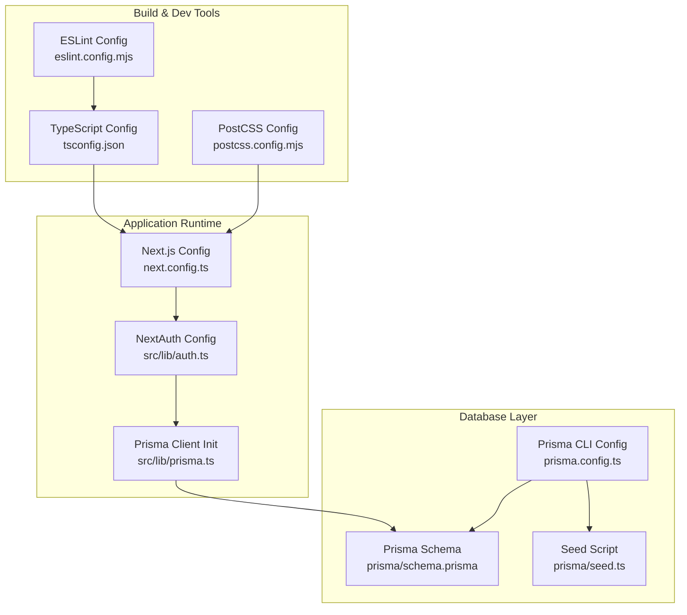
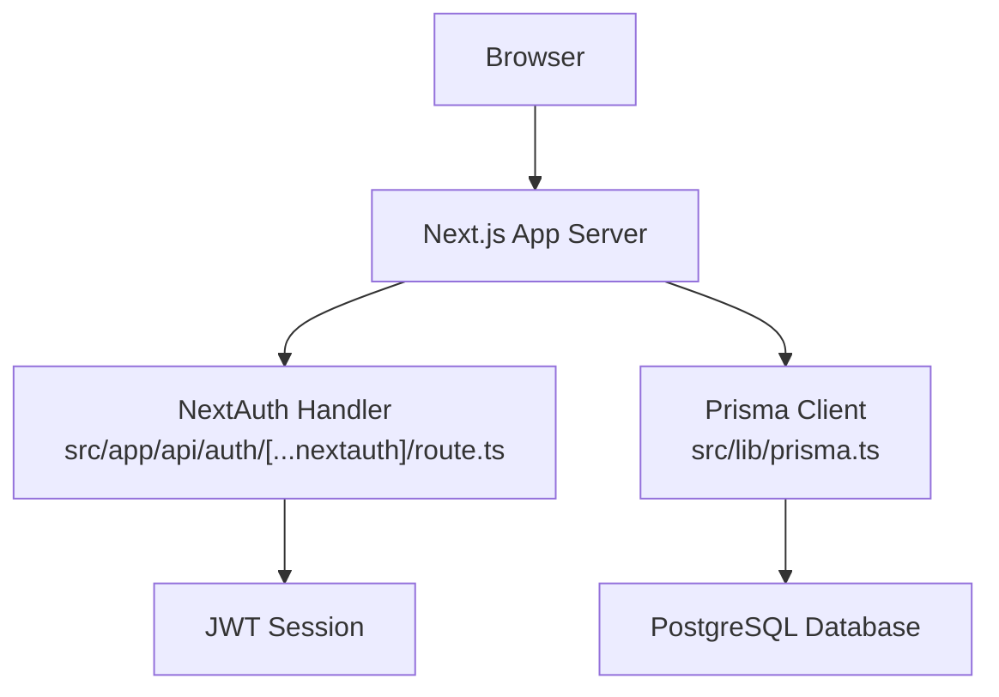
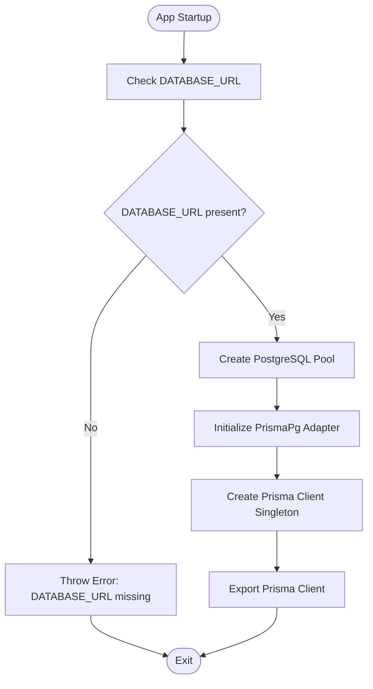
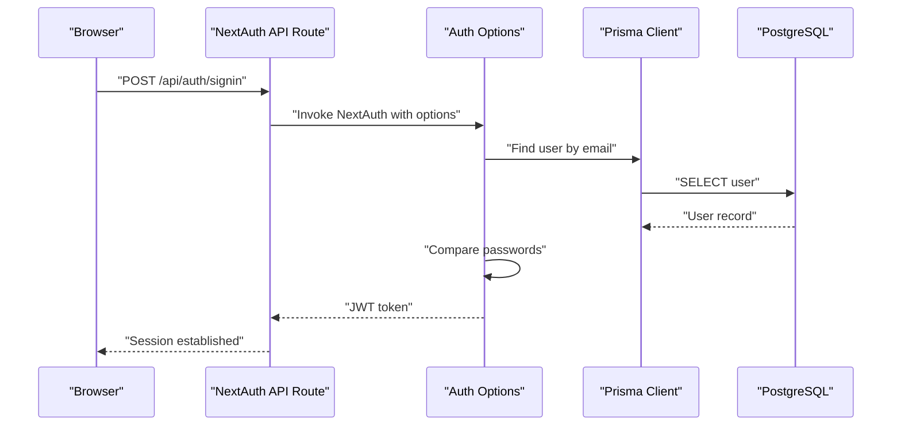
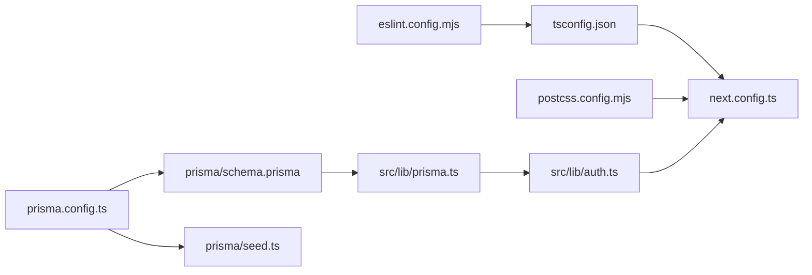

# Environment Setup & Configuration

<cite>
**Referenced Files in This Document**
- [package.json](file://package.json)
- [next.config.ts](file://next.config.ts)
- [tsconfig.json](file://tsconfig.json)
- [eslint.config.mjs](file://eslint.config.mjs)
- [postcss.config.mjs](file://postcss.config.mjs)
- [prisma/schema.prisma](file://prisma/schema.prisma)
- [prisma.config.ts](file://prisma.config.ts)
- [prisma/seed.ts](file://prisma/seed.ts)
- [src/lib/prisma.ts](file://src/lib/prisma.ts)
- [src/lib/auth.ts](file://src/lib/auth.ts)
- [src/app/api/auth/[...nextauth]/route.ts](file://src/app/api/auth/[...nextauth]/route.ts)
- [src/proxy.ts](file://src/proxy.ts)
- [src/lib/permissions.ts](file://src/lib/permissions.ts)
- [README.md](file://README.md)
</cite>

## Table of Contents
1. [Introduction](#introduction)
2. [Project Structure](#project-structure)
3. [Core Components](#core-components)
4. [Architecture Overview](#architecture-overview)
5. [Detailed Component Analysis](#detailed-component-analysis)
6. [Dependency Analysis](#dependency-analysis)
7. [Performance Considerations](#performance-considerations)
8. [Troubleshooting Guide](#troubleshooting-guide)
9. [Conclusion](#conclusion)
10. [Appendices](#appendices)

## Introduction
This document explains how to set up and manage the environment for the application, covering environment variables, database configuration, and application settings. It details Next.js configuration options, TypeScript compiler settings, and Prisma database connections. It also outlines development versus production environment differences, security considerations for sensitive data, configuration validation, step-by-step setup instructions for local development, staging, and production environments, and common configuration issues with troubleshooting techniques.

## Project Structure
The repository follows a standard Next.js 13+ App Router structure with a dedicated Prisma schema and configuration. Key configuration areas include:
- Application runtime configuration via Next.js configuration
- Type checking and compilation via TypeScript configuration
- Code quality and linting via ESLint configuration
- Build-time CSS processing via PostCSS configuration
- Database schema and Prisma configuration
- Runtime database client initialization and seeding

**Diagram sources**
- [next.config.ts:1-24](file://next.config.ts#L1-L24)
- [src/lib/auth.ts:1-81](file://src/lib/auth.ts#L1-L81)
- [src/lib/prisma.ts:1-31](file://src/lib/prisma.ts#L1-L31)
- [tsconfig.json:1-35](file://tsconfig.json#L1-L35)
- [eslint.config.mjs:1-26](file://eslint.config.mjs#L1-L26)
- [postcss.config.mjs:1-8](file://postcss.config.mjs#L1-L8)
- [prisma/schema.prisma:1-487](file://prisma/schema.prisma#L1-L487)
- [prisma.config.ts:1-16](file://prisma.config.ts#L1-L16)
- [prisma/seed.ts:1-174](file://prisma/seed.ts#L1-L174)

**Section sources**
- [README.md:1-37](file://README.md#L1-L37)
- [package.json:1-48](file://package.json#L1-L48)

## Core Components
This section documents the primary configuration components and their responsibilities.

- Next.js configuration
  - Enables response compression, disables the powered-by header, sets experimental stale times, and configures remote image domains for Cloudinary.
  - Reference: [next.config.ts:1-24](file://next.config.ts#L1-L24)

- TypeScript configuration
  - Strict mode enabled, ESNext module resolution, bundler module resolution, isolated modules, JSX transform, and path aliases mapped to the src directory.
  - Reference: [tsconfig.json:1-35](file://tsconfig.json#L1-L35)

- ESLint configuration
  - Extends Next.js recommended configs for web vitals and TypeScript, with custom global ignores for database maintenance scripts.
  - Reference: [eslint.config.mjs:1-26](file://eslint.config.mjs#L1-L26)

- PostCSS configuration
  - Uses Tailwind PostCSS plugin for build-time CSS processing.
  - Reference: [postcss.config.mjs:1-8](file://postcss.config.mjs#L1-L8)

- Prisma configuration
  - Defines PostgreSQL provider, driver adapters preview feature, and datasource URL sourced from environment variables.
  - Reference: [prisma/schema.prisma:1-10](file://prisma/schema.prisma#L1-L10)

- Prisma CLI configuration
  - Points to the schema file, migration path, and seed command that uses ts-node with CommonJS compiler options.
  - Reference: [prisma.config.ts:1-16](file://prisma.config.ts#L1-L16)

- Prisma client initialization
  - Creates a singleton Prisma client with a PostgreSQL adapter and a connection pool configured for serverless instances.
  - Reference: [src/lib/prisma.ts:1-31](file://src/lib/prisma.ts#L1-L31)

- Authentication configuration
  - NextAuth options with JWT strategy, credentials provider, and secret sourced from environment variables.
  - Reference: [src/lib/auth.ts:1-81](file://src/lib/auth.ts#L1-L81)

- Proxy middleware (authorization)
  - Route-based permission enforcement for protected dashboard routes and fallback to a forbidden page when unauthorized.
  - Reference: [src/proxy.ts:1-60](file://src/proxy.ts#L1-L60)

**Section sources**
- [next.config.ts:1-24](file://next.config.ts#L1-L24)
- [tsconfig.json:1-35](file://tsconfig.json#L1-L35)
- [eslint.config.mjs:1-26](file://eslint.config.mjs#L1-L26)
- [postcss.config.mjs:1-8](file://postcss.config.mjs#L1-L8)
- [prisma/schema.prisma:1-10](file://prisma/schema.prisma#L1-L10)
- [prisma.config.ts:1-16](file://prisma.config.ts#L1-L16)
- [src/lib/prisma.ts:1-31](file://src/lib/prisma.ts#L1-L31)
- [src/lib/auth.ts:1-81](file://src/lib/auth.ts#L1-L81)
- [src/proxy.ts:1-60](file://src/proxy.ts#L1-L60)

## Architecture Overview
The environment configuration spans runtime and build-time concerns. The runtime stack integrates NextAuth for authentication and a Prisma client initialized with a PostgreSQL adapter. The build pipeline uses TypeScript, ESLint, and PostCSS. Database operations are orchestrated via Prisma CLI configuration and seeded through a dedicated script.

**Diagram sources**
- [src/app/api/auth/[...nextauth]/route.ts:1-6](file://src/app/api/auth/[...nextauth]/route.ts#L1-L6)
- [src/lib/auth.ts:1-81](file://src/lib/auth.ts#L1-L81)
- [src/lib/prisma.ts:1-31](file://src/lib/prisma.ts#L1-L31)

## Detailed Component Analysis

### Next.js Configuration Options
- Compression: Enabled to reduce payload sizes.
- Header control: Powered-by header disabled for minimal exposure.
- Experimental stale times: Dynamic and static cache durations configured.
- Remote images: Whitelisted Cloudinary domain for SSR-safe image fetching.
- References:
  - [next.config.ts:1-24](file://next.config.ts#L1-L24)

**Section sources**
- [next.config.ts:1-24](file://next.config.ts#L1-L24)

### TypeScript Compiler Settings
- Target and library: ES2017 with DOM and ESNext libraries.
- Strictness: Enabled strict checks, no emit, and ES module interop.
- Module resolution: Bundler-driven resolution for modern builds.
- JSX transform: React JSX with automatic runtime.
- Path aliases: @/* mapped to ./src/* for clean imports.
- References:
  - [tsconfig.json:1-35](file://tsconfig.json#L1-L35)

**Section sources**
- [tsconfig.json:1-35](file://tsconfig.json#L1-L35)

### Prisma Database Connections
- Provider: PostgreSQL
- Driver adapters: Preview feature enabled
- Datasource URL: Sourced from DATABASE_URL environment variable
- Client initialization: Singleton pattern with a PostgreSQL adapter and a connection pool tuned for serverless environments
- Migration and seed configuration: CLI config defines schema path, migration path, and seed command
- References:
  - [prisma/schema.prisma:1-10](file://prisma/schema.prisma#L1-L10)
  - [prisma.config.ts:1-16](file://prisma.config.ts#L1-L16)
  - [src/lib/prisma.ts:1-31](file://src/lib/prisma.ts#L1-L31)

**Diagram sources**
- [src/lib/prisma.ts:1-31](file://src/lib/prisma.ts#L1-L31)

**Section sources**
- [prisma/schema.prisma:1-10](file://prisma/schema.prisma#L1-L10)
- [prisma.config.ts:1-16](file://prisma.config.ts#L1-L16)
- [src/lib/prisma.ts:1-31](file://src/lib/prisma.ts#L1-L31)

### Authentication and Authorization Configuration
- NextAuth options:
  - Credentials provider with email and password fields
  - JWT session strategy
  - Secret sourced from NEXTAUTH_SECRET environment variable
  - Redirects to login page on failure
- Middleware-based proxy enforces route-specific permissions and redirects unauthenticated or unauthorized requests to forbidden pages.
- References:
  - [src/lib/auth.ts:1-81](file://src/lib/auth.ts#L1-L81)
  - [src/app/api/auth/[...nextauth]/route.ts:1-6](file://src/app/api/auth/[...nextauth]/route.ts#L1-L6)
  - [src/proxy.ts:1-60](file://src/proxy.ts#L1-L60)

**Diagram sources**
- [src/app/api/auth/[...nextauth]/route.ts:1-6](file://src/app/api/auth/[...nextauth]/route.ts#L1-L6)
- [src/lib/auth.ts:1-81](file://src/lib/auth.ts#L1-L81)
- [src/lib/prisma.ts:1-31](file://src/lib/prisma.ts#L1-L31)

**Section sources**
- [src/lib/auth.ts:1-81](file://src/lib/auth.ts#L1-L81)
- [src/app/api/auth/[...nextauth]/route.ts:1-6](file://src/app/api/auth/[...nextauth]/route.ts#L1-L6)
- [src/proxy.ts:1-60](file://src/proxy.ts#L1-L60)

### Configuration Validation and Security Considerations
- Required environment variables:
  - DATABASE_URL: Required for Prisma client initialization; absence triggers an error during startup.
  - NEXTAUTH_SECRET: Required for NextAuth JWT signing and encryption.
- Validation patterns:
  - Prisma client throws an error if DATABASE_URL is missing.
  - NextAuth falls back to credentials provider; ensure NEXTAUTH_SECRET is set to avoid session errors.
- Security recommendations:
  - Store secrets in secure environment stores; never commit secrets to version control.
  - Use HTTPS and secure cookies in production.
  - Limit image remote patterns to trusted domains only.
  - Enforce least-privilege permissions in the database and restrict access to migration and seed commands.

References:
- [src/lib/prisma.ts:5-9](file://src/lib/prisma.ts#L5-L9)
- [src/lib/auth.ts:79](file://src/lib/auth.ts#L79)

**Section sources**
- [src/lib/prisma.ts:5-9](file://src/lib/prisma.ts#L5-L9)
- [src/lib/auth.ts:79](file://src/lib/auth.ts#L79)

## Dependency Analysis
The configuration components depend on each other as follows:
- Next.js configuration influences runtime behavior and image optimization.
- TypeScript configuration affects compile-time checks and module resolution.
- Prisma schema and CLI configuration govern database migrations and seeding.
- Prisma client initialization depends on environment variables and the PostgreSQL adapter.
- Authentication relies on the Prisma client and environment variables for secrets.

**Diagram sources**
- [tsconfig.json:1-35](file://tsconfig.json#L1-L35)
- [next.config.ts:1-24](file://next.config.ts#L1-L24)
- [eslint.config.mjs:1-26](file://eslint.config.mjs#L1-L26)
- [postcss.config.mjs:1-8](file://postcss.config.mjs#L1-L8)
- [prisma/schema.prisma:1-10](file://prisma/schema.prisma#L1-L10)
- [prisma.config.ts:1-16](file://prisma.config.ts#L1-L16)
- [prisma/seed.ts:1-174](file://prisma/seed.ts#L1-L174)
- [src/lib/prisma.ts:1-31](file://src/lib/prisma.ts#L1-L31)
- [src/lib/auth.ts:1-81](file://src/lib/auth.ts#L1-L81)

**Section sources**
- [tsconfig.json:1-35](file://tsconfig.json#L1-L35)
- [next.config.ts:1-24](file://next.config.ts#L1-L24)
- [eslint.config.mjs:1-26](file://eslint.config.mjs#L1-L26)
- [postcss.config.mjs:1-8](file://postcss.config.mjs#L1-L8)
- [prisma/schema.prisma:1-10](file://prisma/schema.prisma#L1-L10)
- [prisma.config.ts:1-16](file://prisma.config.ts#L1-L16)
- [prisma/seed.ts:1-174](file://prisma/seed.ts#L1-L174)
- [src/lib/prisma.ts:1-31](file://src/lib/prisma.ts#L1-L31)
- [src/lib/auth.ts:1-81](file://src/lib/auth.ts#L1-L81)

## Performance Considerations
- Next.js experimental stale times: Tune dynamic and static durations based on content volatility to balance freshness and caching.
- Prisma connection pooling: The singleton client with a small pool size is suitable for serverless environments; adjust pool size and timeouts according to workload.
- Image optimization: Restrict remote patterns to trusted domains to prevent unnecessary fetches and improve performance.
- TypeScript strictness: Helps catch errors early and improves DX; keep incremental builds enabled for faster rebuilds.

[No sources needed since this section provides general guidance]

## Troubleshooting Guide
Common configuration issues and resolutions:
- Missing DATABASE_URL
  - Symptom: Application fails to initialize Prisma client.
  - Resolution: Set DATABASE_URL to a valid PostgreSQL connection string.
  - Reference: [src/lib/prisma.ts:5-9](file://src/lib/prisma.ts#L5-L9)

- Missing NEXTAUTH_SECRET
  - Symptom: NextAuth session creation or verification failures.
  - Resolution: Provide NEXTAUTH_SECRET for JWT signing.
  - Reference: [src/lib/auth.ts:79](file://src/lib/auth.ts#L79)

- Prisma seed errors
  - Symptom: Seed script fails during upserts or hashing.
  - Resolution: Ensure database connectivity via DATABASE_URL and run migrations before seeding.
  - References:
    - [prisma.config.ts:8-11](file://prisma.config.ts#L8-L11)
    - [prisma/seed.ts:1-174](file://prisma/seed.ts#L1-L174)

- ESLint ignores database scripts
  - Symptom: Lint errors on maintenance scripts.
  - Resolution: Confirm global ignores exclude database maintenance scripts.
  - Reference: [eslint.config.mjs:15-22](file://eslint.config.mjs#L15-L22)

- PostCSS plugin not applied
  - Symptom: Tailwind classes not generating.
  - Resolution: Verify PostCSS plugin configuration and build process.
  - Reference: [postcss.config.mjs:1-8](file://postcss.config.mjs#L1-L8)

**Section sources**
- [src/lib/prisma.ts:5-9](file://src/lib/prisma.ts#L5-L9)
- [src/lib/auth.ts:79](file://src/lib/auth.ts#L79)
- [prisma.config.ts:8-11](file://prisma.config.ts#L8-L11)
- [prisma/seed.ts:1-174](file://prisma/seed.ts#L1-L174)
- [eslint.config.mjs:15-22](file://eslint.config.mjs#L15-L22)
- [postcss.config.mjs:1-8](file://postcss.config.mjs#L1-L8)

## Conclusion
Environment setup and configuration revolve around three pillars: Next.js runtime configuration, TypeScript compilation settings, and Prisma database connectivity. Ensuring environment variables are correctly defined, validating configuration at startup, and following security best practices are essential for reliable operation across development, staging, and production environments.

[No sources needed since this section summarizes without analyzing specific files]

## Appendices

### Step-by-Step Setup Instructions

- Local Development
  - Install dependencies: [package.json:5-11](file://package.json#L5-L11)
  - Start the development server: [README.md:5-15](file://README.md#L5-L15)
  - Configure environment variables:
    - DATABASE_URL: PostgreSQL connection string
    - NEXTAUTH_SECRET: Secure secret for JWT
  - Run Prisma migrations and seed:
    - [prisma.config.ts:8-11](file://prisma.config.ts#L8-L11)
    - [prisma/seed.ts:1-174](file://prisma/seed.ts#L1-L174)

- Staging
  - Provision a staging PostgreSQL instance and set DATABASE_URL accordingly.
  - Use a distinct NEXTAUTH_SECRET per environment.
  - Validate Next.js build and image remote patterns.
  - References:
    - [next.config.ts:12-19](file://next.config.ts#L12-L19)
    - [tsconfig.json:16-23](file://tsconfig.json#L16-L23)

- Production
  - Use managed PostgreSQL and secure credential storage.
  - Disable powered-by header and enable compression.
  - Enforce HTTPS and secure cookie policies.
  - References:
    - [next.config.ts:4-6](file://next.config.ts#L4-L6)
    - [src/lib/auth.ts:76-79](file://src/lib/auth.ts#L76-L79)

**Section sources**
- [package.json:5-11](file://package.json#L5-L11)
- [README.md:5-15](file://README.md#L5-L15)
- [prisma.config.ts:8-11](file://prisma.config.ts#L8-L11)
- [prisma/seed.ts:1-174](file://prisma/seed.ts#L1-L174)
- [next.config.ts:4-6](file://next.config.ts#L4-L6)
- [next.config.ts:12-19](file://next.config.ts#L12-L19)
- [tsconfig.json:16-23](file://tsconfig.json#L16-L23)
- [src/lib/auth.ts:76-79](file://src/lib/auth.ts#L76-L79)