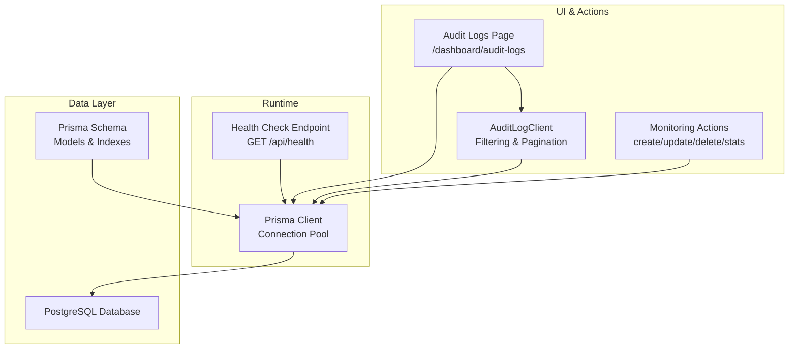
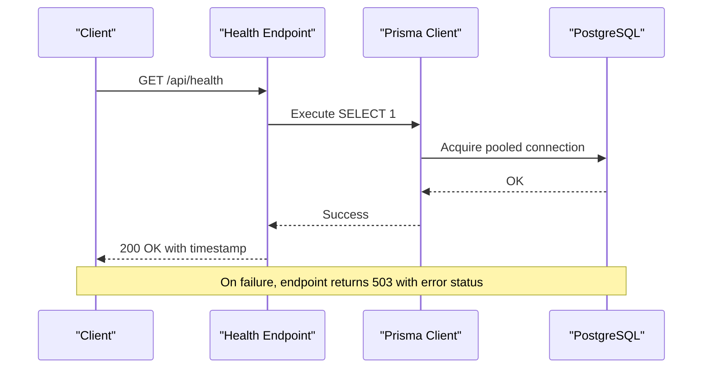
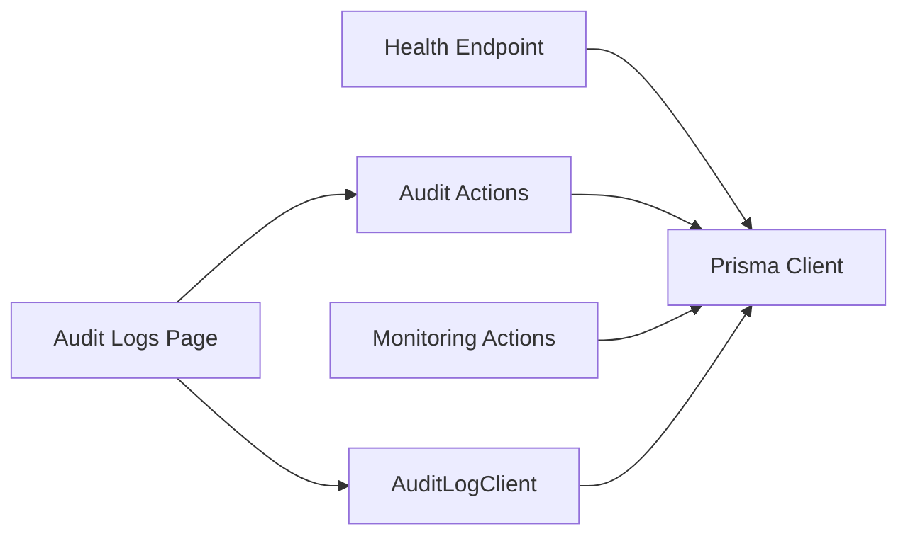

# Monitoring & Maintenance

<cite>
**Referenced Files in This Document**
- [health/route.ts](file://src/app/api/health/route.ts)
- [prisma.ts](file://src/lib/prisma.ts)
- [schema.prisma](file://prisma/schema.prisma)
- [audit.ts](file://src/app/actions/audit.ts)
- [audit-logs/page.tsx](file://src/app/dashboard/audit-logs/page.tsx)
- [AuditLogClient.tsx](file://src/components/dashboard/audit-log/AuditLogClient.tsx)
- [seed-audit.ts](file://scripts/seed-audit.ts)
- [monitoring.ts](file://src/app/actions/monitoring.ts)
- [next.config.ts](file://next.config.ts)
- [package.json](file://package.json)
- [README.md](file://README.md)
- [AUDIT_LOG_INVESTIGATION_REPORT.md](file://AUDIT_LOG_INVESTIGATION_REPORT.md)
</cite>

## Table of Contents
1. [Introduction](#introduction)
2. [Project Structure](#project-structure)
3. [Core Components](#core-components)
4. [Architecture Overview](#architecture-overview)
5. [Detailed Component Analysis](#detailed-component-analysis)
6. [Dependency Analysis](#dependency-analysis)
7. [Performance Considerations](#performance-considerations)
8. [Troubleshooting Guide](#troubleshooting-guide)
9. [Conclusion](#conclusion)
10. [Appendices](#appendices)

## Introduction
This document provides comprehensive guidance for monitoring and maintenance of the application. It covers health check endpoints, performance monitoring, system diagnostics, database maintenance and backup strategies, disaster recovery planning, audit logging configuration, alerting, incident response, application performance monitoring, database optimization, resource utilization tracking, maintenance schedules, update procedures, and troubleshooting for common operational issues.

## Project Structure
The monitoring and maintenance capabilities are implemented across several layers:
- Health check endpoint for runtime verification
- Database connectivity and connection pooling configuration
- Audit logging pipeline with filtering and pagination
- Monitoring dashboard actions for activity tracking
- Build-time and runtime configurations impacting performance and caching

**Diagram sources**
- [health/route.ts:8-23](file://src/app/api/health/route.ts#L8-L23)
- [prisma.ts:10-17](file://src/lib/prisma.ts#L10-L17)
- [schema.prisma:1-20](file://prisma/schema.prisma#L1-L20)
- [audit-logs/page.tsx:14-49](file://src/app/dashboard/audit-logs/page.tsx#L14-L49)
- [AuditLogClient.tsx:105-409](file://src/components/dashboard/audit-log/AuditLogClient.tsx#L105-L409)
- [monitoring.ts:6-134](file://src/app/actions/monitoring.ts#L6-L134)

**Section sources**
- [health/route.ts:1-24](file://src/app/api/health/route.ts#L1-L24)
- [prisma.ts:1-31](file://src/lib/prisma.ts#L1-L31)
- [schema.prisma:1-487](file://prisma/schema.prisma#L1-L487)
- [audit-logs/page.tsx:1-50](file://src/app/dashboard/audit-logs/page.tsx#L1-L50)
- [AuditLogClient.tsx:1-410](file://src/components/dashboard/audit-log/AuditLogClient.tsx#L1-L410)
- [monitoring.ts:1-249](file://src/app/actions/monitoring.ts#L1-L249)

## Core Components
- Health Check Endpoint: Lightweight endpoint to warm database connections and confirm service availability.
- Database Connectivity: Centralized Prisma client with connection pooling tailored for serverless environments.
- Audit Logging: Paginated, filterable audit log viewer with entity-level and global views.
- Monitoring Actions: CRUD and statistics for monitoring activities, including bulk operations and monthly reporting.
- Runtime Configuration: Next.js configuration affecting caching and compression.

**Section sources**
- [health/route.ts:8-23](file://src/app/api/health/route.ts#L8-L23)
- [prisma.ts:10-17](file://src/lib/prisma.ts#L10-L17)
- [audit.ts:27-98](file://src/app/actions/audit.ts#L27-L98)
- [audit-logs/page.tsx:14-49](file://src/app/dashboard/audit-logs/page.tsx#L14-L49)
- [AuditLogClient.tsx:105-409](file://src/components/dashboard/audit-log/AuditLogClient.tsx#L105-L409)
- [monitoring.ts:6-134](file://src/app/actions/monitoring.ts#L6-L134)
- [next.config.ts:6-11](file://next.config.ts#L6-L11)

## Architecture Overview
The monitoring and maintenance architecture integrates runtime health checks, database connectivity, audit logging, and dashboard actions. Health checks warm the database connection pool, while audit logging and monitoring actions persist operational data. The UI components provide filtering, pagination, and visualization.

**Diagram sources**
- [health/route.ts:8-23](file://src/app/api/health/route.ts#L8-L23)
- [prisma.ts:10-17](file://src/lib/prisma.ts#L10-L17)

**Section sources**
- [health/route.ts:8-23](file://src/app/api/health/route.ts#L8-L23)
- [prisma.ts:10-17](file://src/lib/prisma.ts#L10-L17)

## Detailed Component Analysis

### Health Check Endpoint
Purpose:
- Keep database connections warm in serverless environments
- Provide a lightweight readiness/liveness probe

Behavior:
- Forces dynamic responses to avoid caching
- Executes a simple query to validate database connectivity
- Returns success with timestamp or error with 503 on failure

Operational Notes:
- Suitable for periodic pings to prevent cold starts
- Combine with external monitoring systems for alerts

**Section sources**
- [health/route.ts:4-6](file://src/app/api/health/route.ts#L4-L6)
- [health/route.ts:8-23](file://src/app/api/health/route.ts#L8-L23)

### Database Connectivity and Connection Pooling
Configuration Highlights:
- Single connection per serverless instance with timeouts
- Uses Prisma adapter for PostgreSQL
- Environment-driven connection string

Impact:
- Limits concurrent connections to reduce cost and contention
- Ensures predictable latency in serverless contexts
- Requires careful transaction handling to avoid timeouts

**Section sources**
- [prisma.ts:10-17](file://src/lib/prisma.ts#L10-L17)
- [prisma.ts:6-9](file://src/lib/prisma.ts#L6-L9)

### Audit Logging Pipeline
Components:
- Server action for fetching paginated audit logs with filters
- UI page for audit logs with search, filters, and pagination
- Client component rendering audit entries and field diffs

Key Features:
- Filter by action, performedBy, date range, and free-text search
- Pagination with configurable limits
- Entity-level audit log lookup
- Color-coded actions and entity labels
- Expandable field change diff for updates

Security and Access:
- Requires explicit permission for viewing audit logs
- Session-based authorization enforced in actions

**Section sources**
- [audit.ts:27-98](file://src/app/actions/audit.ts#L27-L98)
- [audit.ts:100-117](file://src/app/actions/audit.ts#L100-L117)
- [audit-logs/page.tsx:14-49](file://src/app/dashboard/audit-logs/page.tsx#L14-L49)
- [AuditLogClient.tsx:105-409](file://src/components/dashboard/audit-log/AuditLogClient.tsx#L105-L409)

### Monitoring Actions
Capabilities:
- Fetch monitoring records with nested assignment and resident details
- Create, update, and delete monitoring entries
- Compute statistics across monitoring statuses
- Bulk save with transactional upsert for monthly reports
- Monthly aggregation and reporting

Transactions and Consistency:
- Uses Prisma transactions for atomic bulk operations
- Maintains referential integrity across monitoring and monthly reports

**Section sources**
- [monitoring.ts:6-23](file://src/app/actions/monitoring.ts#L6-L23)
- [monitoring.ts:25-105](file://src/app/actions/monitoring.ts#L25-L105)
- [monitoring.ts:107-134](file://src/app/actions/monitoring.ts#L107-L134)
- [monitoring.ts:136-202](file://src/app/actions/monitoring.ts#L136-L202)
- [monitoring.ts:204-246](file://src/app/actions/monitoring.ts#L204-L246)

### Runtime Configuration Impact
- Compression enabled for bandwidth savings
- Controlled stale times for dynamic/static routes
- Remote image optimization for Cloudinary

Operational Implications:
- Reduced payload sizes improve responsiveness
- Stale times influence cache freshness and CDN behavior

**Section sources**
- [next.config.ts:4-11](file://next.config.ts#L4-L11)
- [next.config.ts:12-19](file://next.config.ts#L12-L19)

## Dependency Analysis
External Dependencies:
- Prisma Client and PostgreSQL adapter for database operations
- Next.js runtime and server actions for UI-server communication
- UI libraries for dashboards and charts

Internal Dependencies:
- Audit actions depend on Prisma client and session management
- Monitoring actions depend on Prisma client and transaction support
- Health endpoint depends on Prisma client for connectivity checks

**Diagram sources**
- [health/route.ts:8-23](file://src/app/api/health/route.ts#L8-L23)
- [audit.ts:27-98](file://src/app/actions/audit.ts#L27-L98)
- [monitoring.ts:6-23](file://src/app/actions/monitoring.ts#L6-L23)
- [audit-logs/page.tsx:14-49](file://src/app/dashboard/audit-logs/page.tsx#L14-L49)
- [AuditLogClient.tsx:105-409](file://src/components/dashboard/audit-log/AuditLogClient.tsx#L105-L409)

**Section sources**
- [package.json:12-32](file://package.json#L12-L32)
- [prisma.ts:1-31](file://src/lib/prisma.ts#L1-L31)

## Performance Considerations
- Health Check Frequency: Schedule periodic pings to maintain warm connections without overloading the database.
- Connection Pooling: Keep single connection per serverless instance to minimize overhead; avoid long-running queries.
- Query Patterns: Use indexes defined in the schema for filtering and sorting (e.g., timestamps, foreign keys).
- Pagination: Prefer paginated audit and monitoring queries to limit memory usage.
- Caching: Leverage Next.js stale times judiciously; validate freshness for sensitive data.
- Compression: Enable compression to reduce bandwidth usage.

[No sources needed since this section provides general guidance]

## Troubleshooting Guide
Common Issues and Resolutions:
- Health Endpoint Returns Error:
  - Verify DATABASE_URL environment variable is set.
  - Confirm database connectivity and credentials.
  - Check for network policies and firewall rules.
  - Review connection pool settings and timeouts.

- Audit Logs Not Visible:
  - Ensure the audit.view permission exists and is assigned to roles.
  - Confirm user session has the required permission.
  - Use the dedicated audit logs page with filters to locate entries.

- Slow Audit or Monitoring Queries:
  - Apply appropriate filters (date range, action, user).
  - Use pagination to limit result sets.
  - Review database indexes and query plans.

- Bulk Monitoring Save Failures:
  - Validate transaction boundaries and required fields.
  - Ensure monthly report upsert conditions match existing records.

Operational References:
- Health check endpoint behavior and error handling
- Audit action filtering and unauthorized access protection
- Monitoring bulk save transaction logic

**Section sources**
- [health/route.ts:17-22](file://src/app/api/health/route.ts#L17-L22)
- [audit.ts:39-41](file://src/app/actions/audit.ts#L39-L41)
- [audit.ts:93-97](file://src/app/actions/audit.ts#L93-L97)
- [monitoring.ts:149-192](file://src/app/actions/monitoring.ts#L149-L192)

## Conclusion
The application provides robust monitoring and maintenance capabilities through a health check endpoint, centralized database connectivity, comprehensive audit logging, and monitoring actions. Proper configuration of runtime settings, adherence to connection pooling guidelines, and disciplined use of filters and pagination ensure reliable operation. The included troubleshooting guidance helps resolve common issues quickly.

[No sources needed since this section summarizes without analyzing specific files]

## Appendices

### Database Maintenance Procedures
- Connection Management:
  - Maintain a single pooled connection per serverless instance.
  - Monitor connection timeouts and adjust as needed.

- Index Utilization:
  - Use existing indexes for frequent filters (timestamps, foreign keys).
  - Add or refine indexes based on query patterns.

- Transaction Safety:
  - Wrap bulk operations in transactions to ensure atomicity.
  - Validate constraints and referential integrity.

**Section sources**
- [prisma.ts:10-17](file://src/lib/prisma.ts#L10-L17)
- [schema.prisma:39-42](file://prisma/schema.prisma#L39-L42)
- [monitoring.ts:149-192](file://src/app/actions/monitoring.ts#L149-L192)

### Backup Strategies and Disaster Recovery Planning
- Backup Approach:
  - Use managed PostgreSQL backups for point-in-time recovery.
  - Maintain offsite copies of backups for geographic redundancy.

- Recovery Testing:
  - Periodically test restore procedures to validate backup integrity.
  - Document recovery steps and maintain runbooks.

- Environment Parity:
  - Align development, staging, and production configurations.
  - Automate environment provisioning and database seeding.

[No sources needed since this section provides general guidance]

### Audit Logging Configuration
- Permission Management:
  - Seed and assign the audit.view permission to roles requiring access.
  - Regularly review and audit permission assignments.

- Data Capture:
  - Track meaningful field changes for auditability.
  - Store structured JSON for diffs to enable UI rendering.

- Access Control:
  - Enforce session-based authorization for audit views.
  - Restrict access to sensitive data via permissions.

**Section sources**
- [seed-audit.ts:14-31](file://scripts/seed-audit.ts#L14-L31)
- [audit.ts:39-41](file://src/app/actions/audit.ts#L39-L41)
- [AUDIT_LOG_INVESTIGATION_REPORT.md:5-18](file://AUDIT_LOG_INVESTIGATION_REPORT.md#L5-L18)

### System Alerting and Incident Response
- Alerting:
  - Monitor health endpoint status and database connectivity.
  - Alert on sustained errors or degraded response times.

- Incident Response:
  - Define escalation paths and on-call procedures.
  - Document remediation steps for common failures.

[No sources needed since this section provides general guidance]

### Application Performance Monitoring and Resource Utilization Tracking
- Metrics Collection:
  - Track request latency, error rates, and throughput.
  - Monitor database query durations and pool utilization.

- Resource Tracking:
  - Observe CPU and memory usage in serverless environments.
  - Adjust concurrency and timeouts based on observed metrics.

[No sources needed since this section provides general guidance]

### Maintenance Schedules and Update Procedures
- Routine Maintenance:
  - Apply schema migrations during scheduled maintenance windows.
  - Validate health checks after updates.

- Deployment Updates:
  - Use blue-green or canary deployments to minimize downtime.
  - Roll back safely if health checks fail.

**Section sources**
- [README.md:32-37](file://README.md#L32-L37)