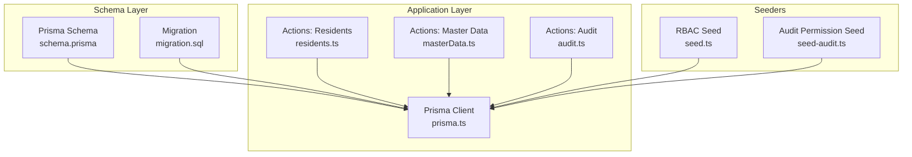
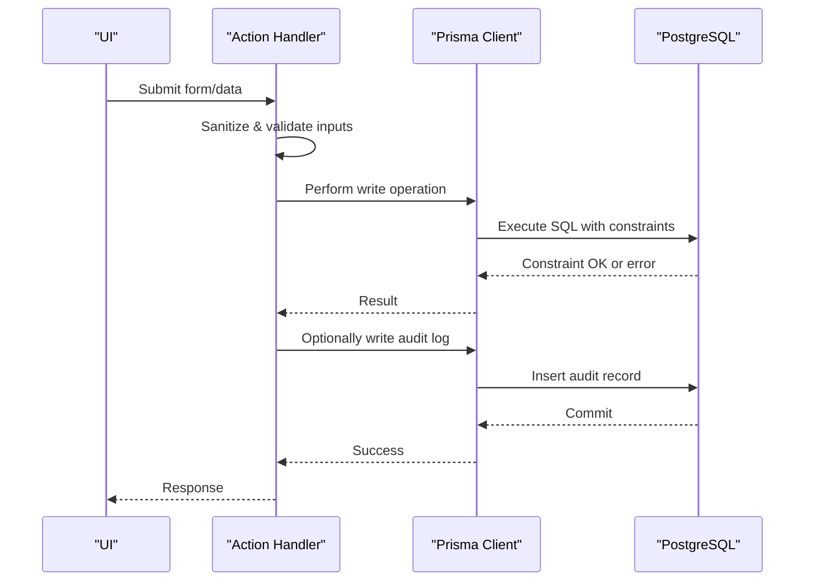
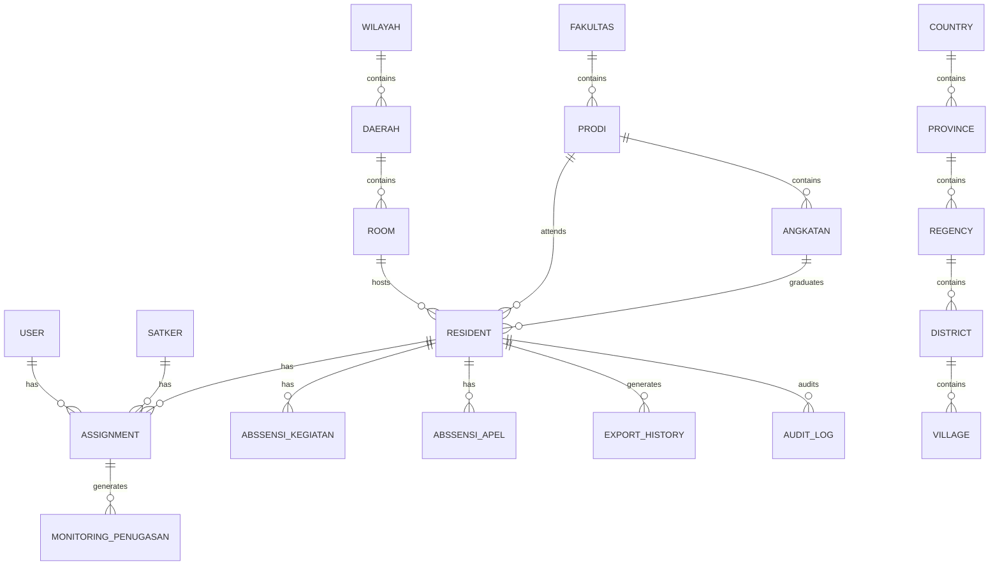
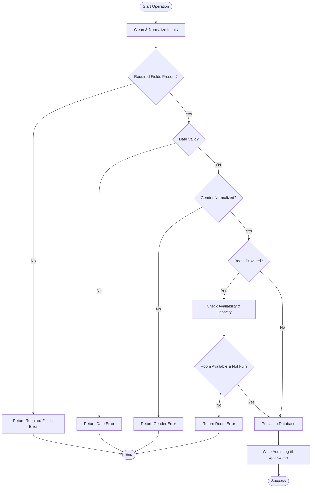
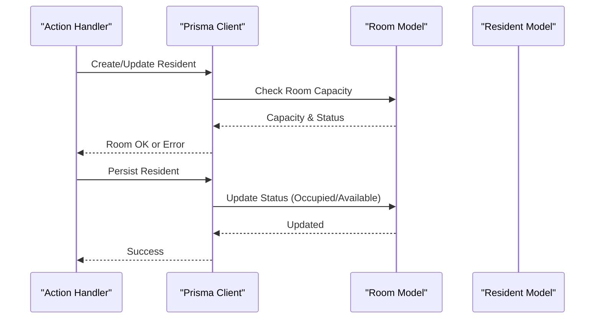
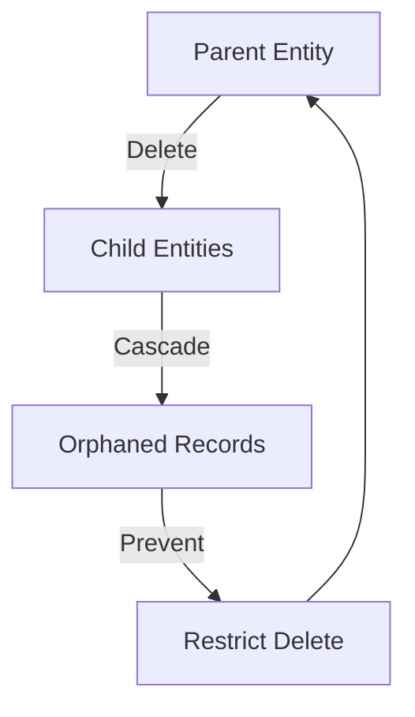
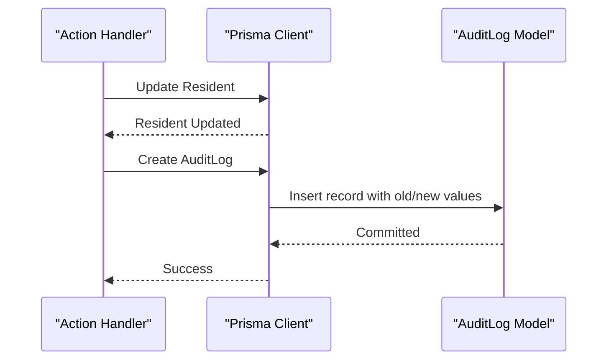
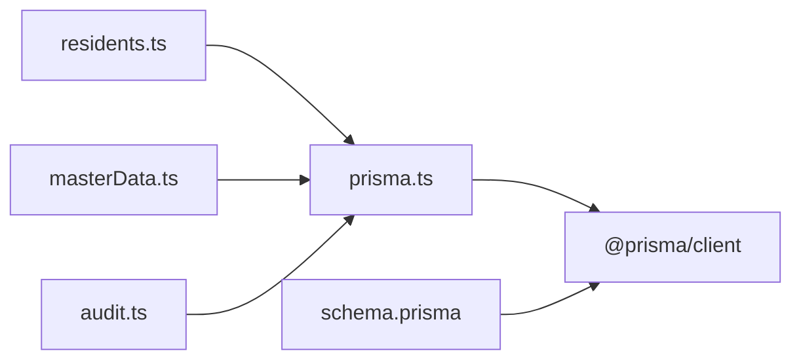

# Data Integrity & Validation

<cite>
**Referenced Files in This Document**
- [schema.prisma](file://prisma/schema.prisma)
- [migration.sql](file://prisma/migrations/202606230001_make_resident_nim_optional/migration.sql)
- [seed.ts](file://prisma/seed.ts)
- [seed-audit.ts](file://scripts/seed-audit.ts)
- [residents.ts](file://src/app/actions/residents.ts)
- [masterData.ts](file://src/app/actions/masterData.ts)
- [audit.ts](file://src/app/actions/audit.ts)
- [prisma.ts](file://src/lib/prisma.ts)
</cite>

## Table of Contents
1. [Introduction](#introduction)
2. [Project Structure](#project-structure)
3. [Core Components](#core-components)
4. [Architecture Overview](#architecture-overview)
5. [Detailed Component Analysis](#detailed-component-analysis)
6. [Dependency Analysis](#dependency-analysis)
7. [Performance Considerations](#performance-considerations)
8. [Troubleshooting Guide](#troubleshooting-guide)
9. [Conclusion](#conclusion)

## Introduction
This document provides comprehensive data integrity and validation documentation for ApsAsrama’s database schema and application-layer safeguards. It covers unique constraints, composite keys, business rule enforcement, foreign key relationships with cascading behavior, referential integrity, schema-level validation, input sanitization, constraint checking, error handling strategies, and audit trail mechanisms for change tracking.

## Project Structure
ApsAsrama uses Prisma ORM with PostgreSQL to define the schema and enforce integrity constraints at the database level. Application actions implement input sanitization, business validations, and audit logging to maintain data consistency and traceability.

**Diagram sources**
- [schema.prisma](file://prisma/schema.prisma)
- [migration.sql](file://prisma/migrations/202606230001_make_resident_nim_optional/migration.sql)
- [residents.ts](file://src/app/actions/residents.ts)
- [masterData.ts](file://src/app/actions/masterData.ts)
- [audit.ts](file://src/app/actions/audit.ts)
- [prisma.ts](file://src/lib/prisma.ts)
- [seed.ts](file://prisma/seed.ts)
- [seed-audit.ts](file://scripts/seed-audit.ts)

**Section sources**
- [schema.prisma](file://prisma/schema.prisma)
- [prisma.ts](file://src/lib/prisma.ts)

## Core Components
- Unique constraints enforced by Prisma:
  - Username and email uniqueness for users
  - Room number uniqueness per administrative region
  - Resident identifiers (NIM, NIUP) uniqueness
  - Administrative entities (countries, provinces, regencies, districts, villages) with unique names and composite unique keys
  - Academic entities (programs and cohorts) with unique constraints
  - Roles and permissions with unique codes
- Composite keys:
  - Assignment records indexed by resident and satker combination
  - Monthly reports per satker by year-month tuple
  - Audit log entries indexed by entity type and ID
- Business rule enforcement:
  - Room occupancy and capacity checks during resident registration and updates
  - Room status transitions (available, occupied, maintenance)
  - Gender normalization and required field validation for residents
  - Room availability checks for bulk operations
- Foreign keys and cascading:
  - Deletion cascades on dependent records for assignments, monitoring, absence records, academic relations, and audit history
  - Restrict behavior for parent entities to prevent orphaned child records
- Audit trail:
  - Centralized audit log model capturing create/update/delete/import actions with old/new values and performer identity

**Section sources**
- [schema.prisma](file://prisma/schema.prisma)
- [residents.ts](file://src/app/actions/residents.ts)
- [masterData.ts](file://src/app/actions/masterData.ts)
- [audit.ts](file://src/app/actions/audit.ts)

## Architecture Overview
The system enforces integrity at two layers:
- Database layer via Prisma schema definitions (unique, composite, relation, and index constraints)
- Application layer via action handlers (input sanitization, business validations, and audit logging)

**Diagram sources**
- [residents.ts](file://src/app/actions/residents.ts)
- [masterData.ts](file://src/app/actions/masterData.ts)
- [audit.ts](file://src/app/actions/audit.ts)
- [prisma.ts](file://src/lib/prisma.ts)
- [schema.prisma](file://prisma/schema.prisma)

## Detailed Component Analysis

### Database Schema Constraints and Relationships
- Unique constraints:
  - Users: username, email
  - Rooms: composite (daerahId, number)
  - Residents: NIM, NIUP
  - Administrative hierarchy: unique name per parent (country/province/regency/district/village)
  - Academic hierarchy: unique program per faculty, unique cohort per program
  - Roles and permissions: unique name/code
- Composite keys:
  - Assignments: (residentId, satkerId)
  - Monthly reports: (satkerId, bulan, tahun)
  - Role-permission mapping: composite primary key
- Foreign keys and cascading:
  - Assignments, monitoring, absence records cascade on resident/satker deletion
  - Academic relations cascade on parent deletions
  - Export history and audit logs cascade on user deletion
  - Administrative relations cascade on parent deletions
- Indexes:
  - Status, floor, and room ID indices improve query performance for filtering and joins
  - Audit log indexed by entity type and ID for efficient lookups

**Diagram sources**
- [schema.prisma](file://prisma/schema.prisma)

**Section sources**
- [schema.prisma](file://prisma/schema.prisma)

### Input Sanitization and Validation
- Text cleaning and trimming for all textual fields
- Gender normalization to standardized enum-like values
- Required field validation for resident creation and import
- Date validation ensuring valid date formats
- Room capacity and availability checks during resident operations
- Bulk operations with optimistic capacity updates and rollback-friendly writes

**Diagram sources**
- [residents.ts](file://src/app/actions/residents.ts)

**Section sources**
- [residents.ts](file://src/app/actions/residents.ts)

### Business Rule Enforcement
- Room occupancy management:
  - Automatic status transitions when capacity thresholds are met or exceeded
  - Release of room status upon checkout or bulk moves
- Resident identifier uniqueness:
  - Cross-check against existing records for NIM/NIUP during create/update
- Administrative data integrity:
  - Upsert operations with unique constraint handling for master data CRUD actions
- Academic hierarchy integrity:
  - Unique constraints on program and cohort combinations enforced at schema level

**Diagram sources**
- [residents.ts](file://src/app/actions/residents.ts)
- [schema.prisma](file://prisma/schema.prisma)

**Section sources**
- [residents.ts](file://src/app/actions/residents.ts)
- [schema.prisma](file://prisma/schema.prisma)

### Foreign Keys, Cascading, and Referential Integrity
- Cascading deletes:
  - Assignments, monitoring records, absence records, academic relations, and audit/export history cascade on resident/satker/user deletion
- Restrict behavior:
  - Prevents deletion of parents when children exist unless cascading is explicitly configured
- Migration evidence:
  - Historical migration adjusts nullable constraints for resident identifiers, reflecting evolving business rules

**Diagram sources**
- [schema.prisma](file://prisma/schema.prisma)
- [migration.sql](file://prisma/migrations/202606230001_make_resident_nim_optional/migration.sql)

**Section sources**
- [schema.prisma](file://prisma/schema.prisma)
- [migration.sql](file://prisma/migrations/202606230001_make_resident_nim_optional/migration.sql)

### Audit Trail and Change Tracking
- Centralized audit log captures:
  - Action type (CREATE, UPDATE, DELETE, IMPORT)
  - Entity type and ID
  - Old and new values as JSON
  - Performed by (user identifier)
  - Timestamps
- Application-level audit:
  - Resident updates compare tracked fields and persist differences
- Access control:
  - Dedicated permission code for audit viewing
- Filtering and pagination:
  - Actions, logs, and entity-specific queries support filtering and search across JSON fields

**Diagram sources**
- [residents.ts](file://src/app/actions/residents.ts)
- [audit.ts](file://src/app/actions/audit.ts)
- [schema.prisma](file://prisma/schema.prisma)

**Section sources**
- [audit.ts](file://src/app/actions/audit.ts)
- [residents.ts](file://src/app/actions/residents.ts)
- [schema.prisma](file://prisma/schema.prisma)

### Seeders and Initial Data Integrity
- RBAC seeding:
  - Creates system roles and assigns comprehensive permissions
- Audit permission seeding:
  - Ensures audit viewing permission exists and is assigned to system roles
- Consistent initialization:
  - Prevents duplicate entries via upsert patterns

**Section sources**
- [seed.ts](file://prisma/seed.ts)
- [seed-audit.ts](file://scripts/seed-audit.ts)

## Dependency Analysis
- Prisma client initialization enforces a single connection pool per runtime instance, reducing contention and ensuring predictable resource usage.
- Action modules depend on Prisma client for all persistence operations and on shared enums/types for validation.
- Audit actions depend on session permissions to gate access to sensitive audit data.

**Diagram sources**
- [prisma.ts](file://src/lib/prisma.ts)
- [residents.ts](file://src/app/actions/residents.ts)
- [masterData.ts](file://src/app/actions/masterData.ts)
- [audit.ts](file://src/app/actions/audit.ts)
- [schema.prisma](file://prisma/schema.prisma)

**Section sources**
- [prisma.ts](file://src/lib/prisma.ts)
- [residents.ts](file://src/app/actions/residents.ts)
- [masterData.ts](file://src/app/actions/masterData.ts)
- [audit.ts](file://src/app/actions/audit.ts)
- [schema.prisma](file://prisma/schema.prisma)

## Performance Considerations
- Indexes on frequently queried fields (room status, floor, resident room ID, audit entity type and ID) improve query performance.
- Batch operations (bulk create/move/delete) leverage optimistic capacity updates and minimal round-trips.
- Connection pooling limits concurrency to avoid overwhelming the database in serverless environments.

[No sources needed since this section provides general guidance]

## Troubleshooting Guide
- Unique constraint violations:
  - Users: duplicate username or email
  - Rooms: duplicate room number per daerah
  - Residents: duplicate NIM/NIUP
  - Administrative entities: duplicate names per parent
  - Academic entities: duplicate program/cohort combinations
- Business rule violations:
  - Room under maintenance or at capacity
  - Missing required fields for resident creation
  - Invalid date formats
  - Gender normalization errors
- Audit access denied:
  - Missing audit.view permission
- Migration-related changes:
  - Nullable constraints adjustments for resident identifiers

Resolution strategies:
- Validate inputs before submission using provided validators
- Check room availability and capacity prior to operations
- Use audit logs to trace changes and identify conflicting updates
- Review seeders to confirm initial permission setup

**Section sources**
- [residents.ts](file://src/app/actions/residents.ts)
- [masterData.ts](file://src/app/actions/masterData.ts)
- [audit.ts](file://src/app/actions/audit.ts)
- [seed.ts](file://prisma/seed.ts)
- [seed-audit.ts](file://scripts/seed-audit.ts)
- [migration.sql](file://prisma/migrations/202606230001_make_resident_nim_optional/migration.sql)

## Conclusion
ApsAsrama’s data integrity model combines robust schema-level constraints with application-layer validations and comprehensive audit logging. Together, these mechanisms ensure referential integrity, enforce business rules, and provide a reliable audit trail for compliance and troubleshooting.