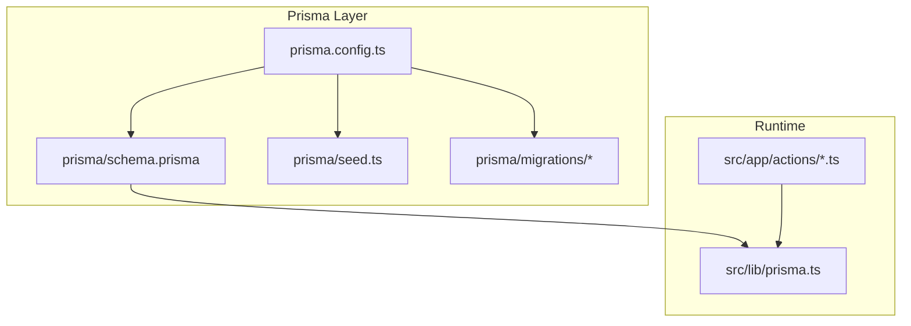
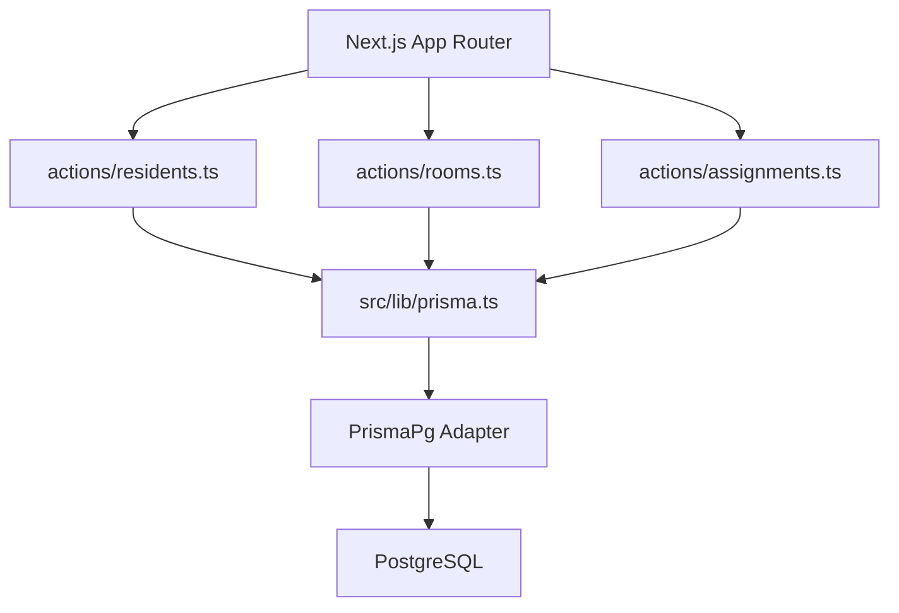
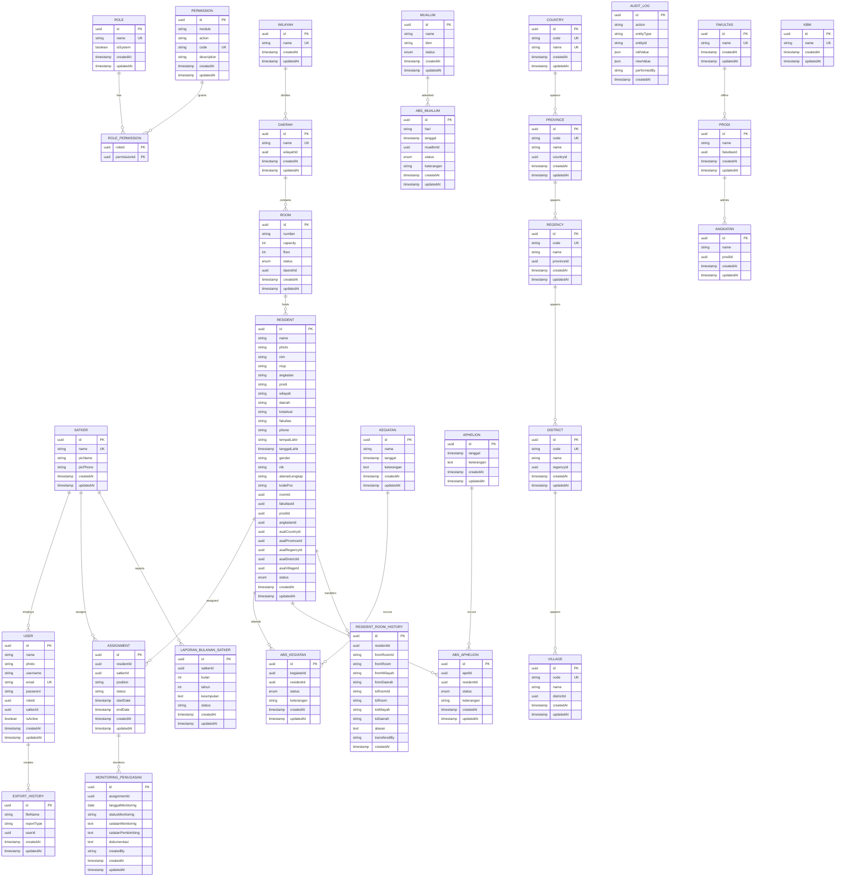
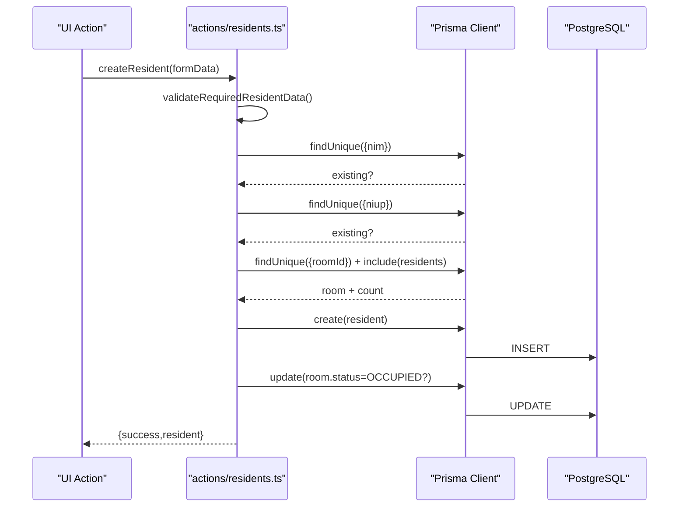
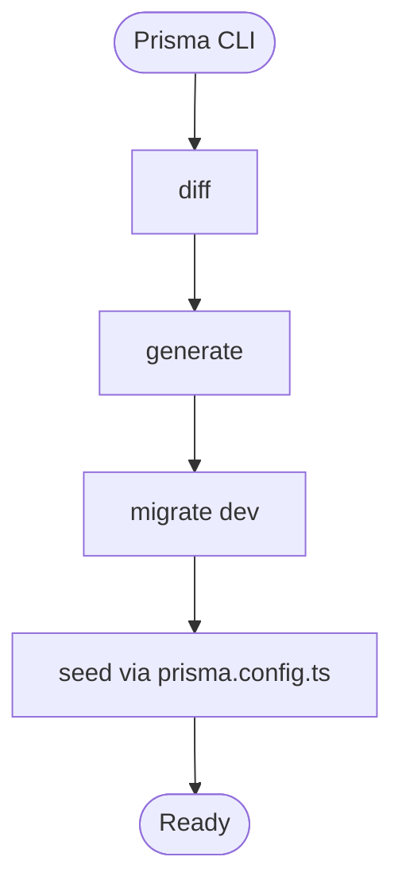
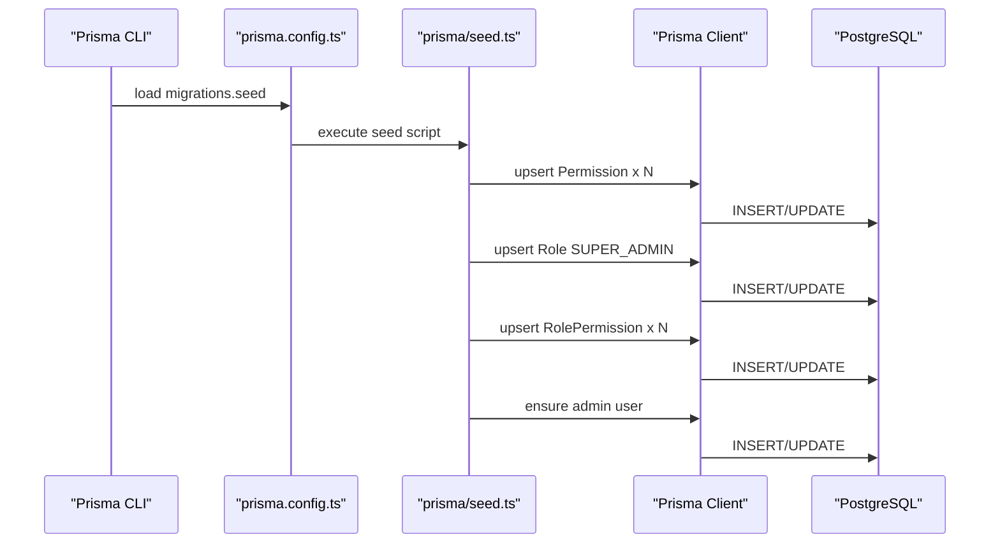
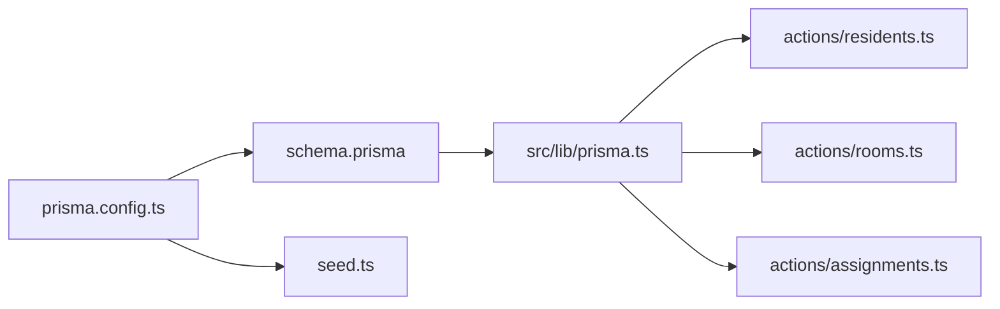

# Database Design

<cite>
**Referenced Files in This Document**
- [schema.prisma](file://prisma/schema.prisma)
- [seed.ts](file://prisma/seed.ts)
- [prisma.config.ts](file://prisma.config.ts)
- [prisma.ts](file://src/lib/prisma.ts)
- [residents.ts](file://src/app/actions/residents.ts)
- [rooms.ts](file://src/app/actions/rooms.ts)
- [assignments.ts](file://src/app/actions/assignments.ts)
- [202606230001_make_resident_nim_optional/migration.sql](file://prisma/migrations/202606230001_make_resident_nim_optional/migration.sql)
</cite>

## Table of Contents
1. [Introduction](#introduction)
2. [Project Structure](#project-structure)
3. [Core Components](#core-components)
4. [Architecture Overview](#architecture-overview)
5. [Detailed Component Analysis](#detailed-component-analysis)
6. [Dependency Analysis](#dependency-analysis)
7. [Performance Considerations](#performance-considerations)
8. [Troubleshooting Guide](#troubleshooting-guide)
9. [Conclusion](#conclusion)
10. [Appendices](#appendices)

## Introduction
This document describes the ApsAsrama database schema and design decisions implemented via Prisma. It covers entity definitions, relationships, indexes, constraints, and the operational model for data access, integrity, and lifecycle. It also documents migration management, seeding, and practical performance and security considerations derived from the repository’s configuration.

## Project Structure
The database schema is defined declaratively with Prisma and enforced against a PostgreSQL datasource. Seeding initializes roles, permissions, and a default admin user. Data access is encapsulated in server action modules that interact with Prisma and coordinate UI revalidation.

**Diagram sources**
- [prisma.config.ts:1-16](file://prisma.config.ts#L1-L16)
- [schema.prisma:1-487](file://prisma/schema.prisma#L1-L487)
- [seed.ts:1-174](file://prisma/seed.ts#L1-L174)
- [prisma.ts:1-31](file://src/lib/prisma.ts#L1-L31)
- [residents.ts:1-666](file://src/app/actions/residents.ts#L1-L666)
- [rooms.ts:1-118](file://src/app/actions/rooms.ts#L1-L118)
- [assignments.ts:1-215](file://src/app/actions/assignments.ts#L1-L215)

**Section sources**
- [prisma.config.ts:1-16](file://prisma.config.ts#L1-L16)
- [schema.prisma:1-487](file://prisma/schema.prisma#L1-L487)
- [seed.ts:1-174](file://prisma/seed.ts#L1-L174)
- [prisma.ts:1-31](file://src/lib/prisma.ts#L1-L31)

## Core Components
This section outlines the principal entities and their attributes, constraints, and indexes. All models use UUID primary keys except where noted.

- User
  - Keys: id (UUID), optional username (unique), unique email
  - Relations: belongs to Role (roleId), belongs to Satker (satkerId)
  - Defaults: createdAt defaults to now(), updatedAt auto-updated
  - Indexes: none declared (managed by relations)
  - Notes: isActive flag enabled by default

- Role
  - Keys: id (UUID), unique name
  - Relations: many-to-many with Permission via RolePermission
  - Defaults: createdAt defaults to now(), updatedAt auto-updated

- Permission
  - Keys: id (UUID), unique code
  - Relations: many-to-many with Role via RolePermission
  - Defaults: createdAt defaults to now(), updatedAt auto-updated

- RolePermission
  - Composite primary key: (roleId, permissionId)
  - Cascading deletes on relation removal

- Satker
  - Keys: id (UUID), unique name
  - Relations: one-to-many with User and Assignment
  - Defaults: createdAt defaults to now(), updatedAt auto-updated

- Room
  - Keys: id (UUID), composite unique (daerahId, number)
  - Attributes: number, capacity, floor, status (RoomStatus)
  - Relations: belongs to Daerah (daerahId), one-to-many with Resident
  - Indexes: status, floor
  - Defaults: createdAt defaults to now(), updatedAt auto-updated

- Resident
  - Keys: id (UUID), optional unique nim, optional unique niup
  - Attributes: personal and academic info, contact, status (ResidentStatus)
  - Relations: belongs to Room (roomId), belongs to Country/Province/Regency/District/Village via foreign keys
  - Academic relations: Fakultas (fakultasId), Prodi (prodiId), Angkatan (angkatanId)
  - Indexes: roomId, status, angkatan
  - Defaults: createdAt defaults to now(), updatedAt auto-updated

- Assignment
  - Keys: id (UUID)
  - Attributes: residentId, satkerId, position, status, startDate, endDate
  - Relations: belongs to Resident and Satker
  - Unique constraint: (residentId, satkerId)
  - Indexes: satkerId
  - Defaults: createdAt defaults to now(), updatedAt auto-updated

- MonitoringPenugasan
  - Keys: id (UUID), mapped column penugasan_id
  - Attributes: date, status, notes, documentation, createdBy
  - Relations: belongs to Assignment
  - Indexes: penugasan_id, tanggal_monitoring
  - Defaults: created_at defaults to now(), updated_at auto-updated

- LaporanBulananSatker
  - Keys: id (UUID)
  - Attributes: satkerId, month, year, conclusion, status
  - Relations: belongs to Satker
  - Unique constraint: (satkerId, month, year)
  - Defaults: createdAt defaults to now(), updatedAt auto-updated

- Academic and Administrative Hierarchies
  - Fakultas: unique name; many Prodi
  - Prodi: unique (name, fakultasId); many Angkatan
  - Angkatan: unique (name, prodiId)
  - Country: unique (code, name); many Province
  - Province: unique (name, countryId); many Regency
  - Regency: unique (name, provinceId); many District
  - District: unique (name, regencyId); many Village
  - Wilayah: unique name; many Daerah
  - Daerah: belongs to Wilayah; many Room

- Attendance and Activity Entities
  - Muallim: name, kbm, status (MuallimStatus)
  - AbsensiMuallim: index on muallimId, tanggal
  - Kegiatan: name, date, description; many AbsensiKegiatan
  - AbsensiKegiatan: unique (kegiatanId, residentId), index on residentId
  - Apel: date, description; many AbsensiApel
  - AbsensiApel: unique (apelId, residentId), index on residentId

- Audit and History
  - AuditLog: action, entityType, entityId, oldValue, newValue, performedBy
  - ResidentRoomHistory: room transfer history with from/to room copies and reasons

- Enums
  - RoomStatus: AVAILABLE, OCCUPIED, MAINTENANCE
  - ResidentStatus: ACTIVE, INACTIVE
  - MuallimStatus: ACTIVE, INACTIVE
  - AbsensiStatus: HADIR, IZIN, DIWAKILKAN
  - KehadiranStatus: HADIR, IZIN, SAKIT, ALPA
  - KehadiranApel: HADIR, ALPA, IZIN

**Section sources**
- [schema.prisma:10-487](file://prisma/schema.prisma#L10-L487)

## Architecture Overview
The runtime connects to PostgreSQL through Prisma with a Postgres adapter and a single connection pool per serverless instance. Server actions orchestrate CRUD operations, enforce domain rules, and trigger Next.js cache revalidation.

**Diagram sources**
- [prisma.ts:1-31](file://src/lib/prisma.ts#L1-L31)
- [residents.ts:1-666](file://src/app/actions/residents.ts#L1-L666)
- [rooms.ts:1-118](file://src/app/actions/rooms.ts#L1-L118)
- [assignments.ts:1-215](file://src/app/actions/assignments.ts#L1-L215)

**Section sources**
- [prisma.ts:1-31](file://src/lib/prisma.ts#L1-L31)
- [residents.ts:1-666](file://src/app/actions/residents.ts#L1-L666)
- [rooms.ts:1-118](file://src/app/actions/rooms.ts#L1-L118)
- [assignments.ts:1-215](file://src/app/actions/assignments.ts#L1-L215)

## Detailed Component Analysis

### Entity Relationship Model
The schema enforces referential integrity via explicit relation fields and foreign keys. Composite unique constraints prevent duplicates (e.g., Room(daerahId, number), Prodi(name, fakultasId)). Indexes optimize frequent queries (e.g., Room(status), Room(floor), Resident(roomId), Resident(status)).

**Diagram sources**
- [schema.prisma:10-487](file://prisma/schema.prisma#L10-L487)

**Section sources**
- [schema.prisma:10-487](file://prisma/schema.prisma#L10-L487)

### Data Access Patterns and Validation Rules
- Residents
  - Creation validates required fields, normalizes gender, checks uniqueness of nim/niup, and enforces room availability/capacity. Room status updates automatically when capacity is met.
  - Updates enforce uniqueness excluding self, track changes via AuditLog, and adjust room statuses when moving residents.
  - Bulk operations support import and batch moves with optimistic capacity updates and final consistency adjustments.
- Rooms
  - Enforce unique room numbers, disallow deletion if occupied, and maintain status transitions.
- Assignments
  - Upsert prevents duplicate active assignments; supports creation/update/delete of Satker and Assignment records.

**Diagram sources**
- [residents.ts:143-244](file://src/app/actions/residents.ts#L143-L244)
- [schema.prisma:44-101](file://prisma/schema.prisma#L44-L101)

**Section sources**
- [residents.ts:143-244](file://src/app/actions/residents.ts#L143-L244)
- [rooms.ts:26-51](file://src/app/actions/rooms.ts#L26-L51)
- [assignments.ts:128-173](file://src/app/actions/assignments.ts#L128-L173)

### Migration Management
- The repository includes a migration that relaxes the NOT NULL constraint on Resident.nim.
- Prisma config defines the schema path and migration directory, and seeds via a TypeScript script.

**Diagram sources**
- [prisma.config.ts:6-15](file://prisma.config.ts#L6-L15)
- [202606230001_make_resident_nim_optional/migration.sql:1-2](file://prisma/migrations/202606230001_make_resident_nim_optional/migration.sql#L1-L2)

**Section sources**
- [prisma.config.ts:6-15](file://prisma.config.ts#L6-L15)
- [202606230001_make_resident_nim_optional/migration.sql:1-2](file://prisma/migrations/202606230001_make_resident_nim_optional/migration.sql#L1-L2)

### Seed Data Configuration
- Seeds default permissions, assigns them to SUPER_ADMIN, creates system roles, and ensures a default admin user exists with a hashed password.

**Diagram sources**
- [prisma.config.ts:10](file://prisma.config.ts#L10)
- [seed.ts:75-164](file://prisma/seed.ts#L75-L164)

**Section sources**
- [seed.ts:4-73](file://prisma/seed.ts#L4-L73)
- [seed.ts:75-164](file://prisma/seed.ts#L75-L164)

## Dependency Analysis
- Prisma client is initialized with a Postgres adapter and a shared connection pool. The singleton pattern ensures a single client instance per runtime context.
- Actions depend on Prisma for data access and Next.js revalidation for cache synchronization.
- Schema-level relations define foreign keys and cascades; composite constraints ensure uniqueness across related fields.

**Diagram sources**
- [prisma.config.ts:1-16](file://prisma.config.ts#L1-L16)
- [schema.prisma:1-487](file://prisma/schema.prisma#L1-L487)
- [prisma.ts:1-31](file://src/lib/prisma.ts#L1-L31)
- [residents.ts:1-666](file://src/app/actions/residents.ts#L1-L666)
- [rooms.ts:1-118](file://src/app/actions/rooms.ts#L1-L118)
- [assignments.ts:1-215](file://src/app/actions/assignments.ts#L1-L215)

**Section sources**
- [prisma.ts:1-31](file://src/lib/prisma.ts#L1-L31)
- [schema.prisma:10-487](file://prisma/schema.prisma#L10-L487)

## Performance Considerations
- Indexes
  - Room: status, floor
  - Resident: roomId, status, angkatan
  - Assignment: satkerId
  - Attendance: AbsensiKegiatan and AbsensiApel on (kegiatanId,residentId), AbsensiMuallim on (muallimId,tanggal)
  - Geographic hierarchy: Country(name), Province(name,countryId), Regency(name,provinceId), District(name,regencyId), Village(name,districtId)
  - AuditLog: (entityType,entityId)
  - ExportHistory: (userId,createdAt)
  - ResidentRoomHistory: (residentId,createdAt)
- Query patterns
  - Prefer filtered queries with indexed columns (e.g., status, date ranges).
  - Use include/select judiciously to avoid N+1; actions already demonstrate selective includes.
- Concurrency and pooling
  - Single connection per serverless instance reduces contention; ensure transactions are short-lived.
- Data normalization
  - Separate academic and administrative hierarchies reduce duplication and improve join performance.

[No sources needed since this section provides general guidance]

## Troubleshooting Guide
- Connection errors
  - Verify DATABASE_URL environment variable is set; the client throws if missing.
- Migration issues
  - Confirm migration path and seed command configured in prisma.config.ts.
  - Review the included migration altering Resident.nim to nullable.
- Seeding failures
  - Ensure seed script runs after schema generation and that the admin user email is reachable.
- Data integrity violations
  - Unique constraints on (daerahId, number) for Room, (name, countryId) for Province, (name, provinceId) for Regency, etc., will cause insert/update conflicts if violated.
  - Assignment uniqueness on (residentId, satkerId) prevents duplicate active assignments.
- Room capacity and status
  - Room status transitions occur when capacity is met or released; verify room capacity and resident counts after bulk operations.

**Section sources**
- [prisma.ts:7-9](file://src/lib/prisma.ts#L7-L9)
- [prisma.config.ts:8-11](file://prisma.config.ts#L8-L11)
- [202606230001_make_resident_nim_optional/migration.sql:1-2](file://prisma/migrations/202606230001_make_resident_nim_optional/migration.sql#L1-L2)
- [seed.ts:136-163](file://prisma/seed.ts#L136-L163)
- [schema.prisma:39](file://prisma/schema.prisma#L39)
- [schema.prisma:403](file://prisma/schema.prisma#L403)
- [schema.prisma:419](file://prisma/schema.prisma#L419)
- [schema.prisma:435](file://prisma/schema.prisma#L435)
- [schema.prisma:450](file://prisma/schema.prisma#L450)
- [schema.prisma:129](file://prisma/schema.prisma#L129)
- [schema.prisma:130](file://prisma/schema.prisma#L130)

## Conclusion
The ApsAsrama schema models a comprehensive residential and administrative system with strong referential integrity, deliberate composite constraints, and pragmatic indexes. Prisma manages migrations and seeding, while server actions enforce business rules and maintain data consistency. The design balances flexibility (optional identifiers, nullable fields) with safety (unique constraints, cascading deletes, and audit logging).

[No sources needed since this section summarizes without analyzing specific files]

## Appendices

### Appendix A: Field Reference Highlights
- Identity and metadata
  - UUID primary keys across most entities
  - createdAt/updatedAt timestamps
- Security-sensitive fields
  - User.password stored as hashed value (seed script hashes "admin123")
- Optional identifiers
  - Resident.nim and Resident.niup are optional and unique when present
- Status enums
  - RoomStatus, ResidentStatus, AbsensiStatus, KehadiranStatus, KehadiranApel
- Academic and administrative hierarchy
  - Fakultas → Prodi → Angkatan
  - Country → Province → Regency → District → Village
- Geographic linkage
  - Room.daerahId links to Daerah; Resident.*Id fields link to administrative regions

**Section sources**
- [schema.prisma:10-487](file://prisma/schema.prisma#L10-L487)
- [seed.ts:136](file://prisma/seed.ts#L136)