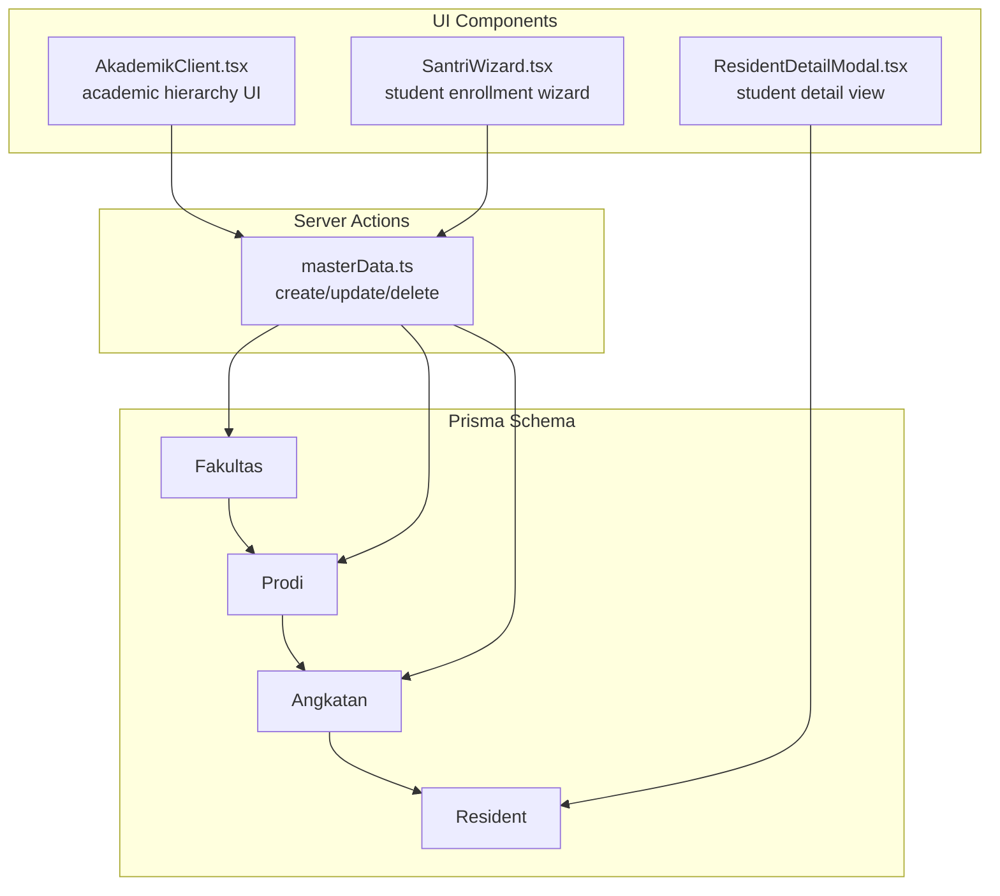
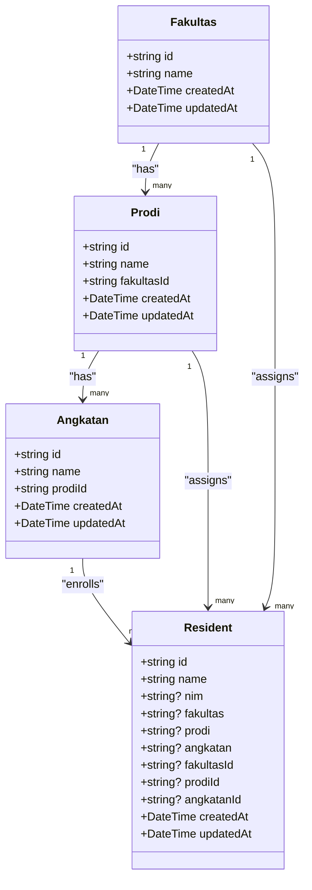
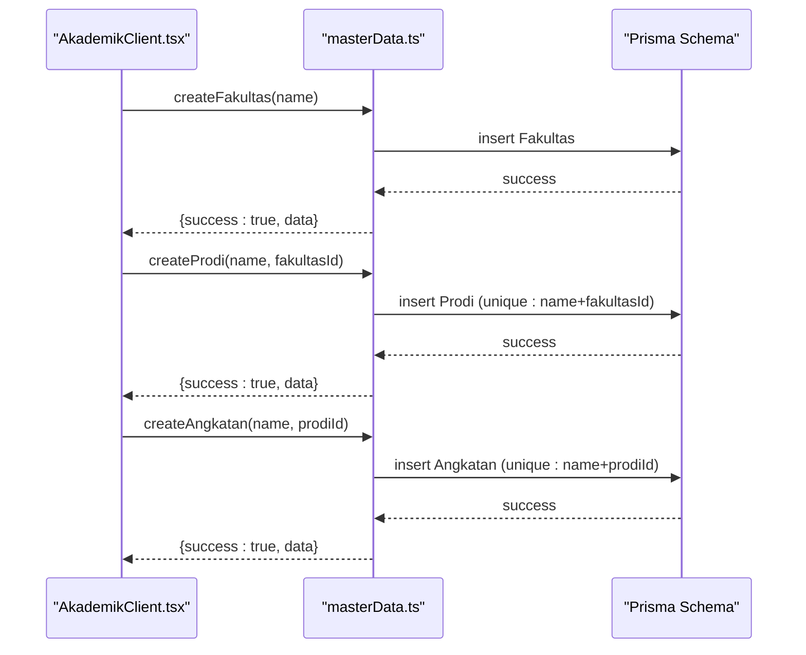
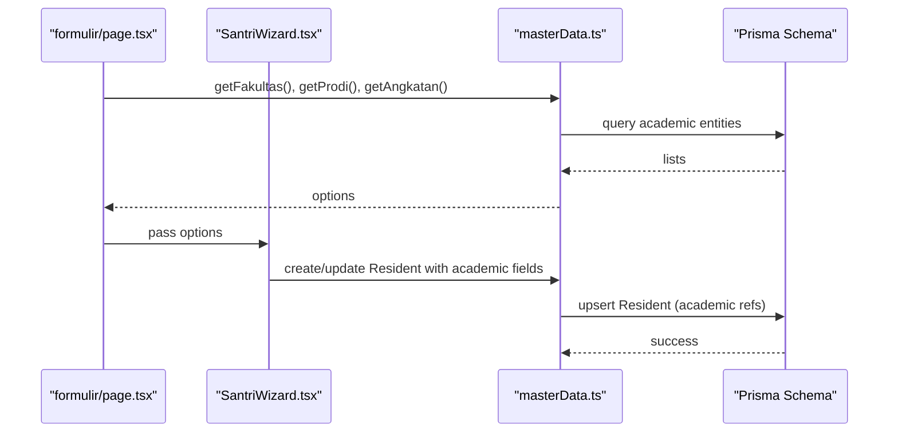

# Academic Entities

<cite>
**Referenced Files in This Document**
- [schema.prisma](file://prisma/schema.prisma)
- [masterData.ts](file://src/app/actions/masterData.ts)
- [AkademikClient.tsx](file://src/components/dashboard/AkademikClient.tsx)
- [akademik/page.tsx](file://src/app/dashboard/akademik/page.tsx)
- [SantriWizard.tsx](file://src/components/dashboard/santri/wizard/SantriWizard.tsx)
- [formulir/page.tsx](file://src/app/dashboard/formulir/page.tsx)
- [ResidentDetailModal.tsx](file://src/components/dashboard/ResidentDetailModal.tsx)
</cite>

## Table of Contents
1. [Introduction](#introduction)
2. [Project Structure](#project-structure)
3. [Core Components](#core-components)
4. [Architecture Overview](#architecture-overview)
5. [Detailed Component Analysis](#detailed-component-analysis)
6. [Dependency Analysis](#dependency-analysis)
7. [Performance Considerations](#performance-considerations)
8. [Troubleshooting Guide](#troubleshooting-guide)
9. [Conclusion](#conclusion)

## Introduction
This document explains ApsAsrama's academic hierarchy entities: Fakultas (Faculty), Prodi (Program Study), and Angkatan (Batch/Cohort). It documents the hierarchical relationships, field definitions, unique constraints, foreign key relationships, and how these entities support student enrollment and progression tracking. It also covers common query patterns and practical examples of academic data relationships.

## Project Structure
The academic hierarchy is defined in the Prisma schema and surfaced through UI components and server actions:

- Prisma schema defines the academic entities and their relationships
- Server actions manage CRUD operations for the hierarchy
- UI components render the hierarchy and collect student enrollment data
- Student records reference academic entities via dedicated fields



**Diagram sources**
- [schema.prisma:326-358](file://prisma/schema.prisma#L326-L358)
- [masterData.ts:81-190](file://src/app/actions/masterData.ts#L81-L190)
- [AkademikClient.tsx:1-330](file://src/components/dashboard/AkademikClient.tsx#L1-L330)
- [SantriWizard.tsx:585-628](file://src/components/dashboard/santri/wizard/SantriWizard.tsx#L585-L628)
- [ResidentDetailModal.tsx:609-618](file://src/components/dashboard/ResidentDetailModal.tsx#L609-L618)

**Section sources**
- [schema.prisma:326-358](file://prisma/schema.prisma#L326-L358)
- [masterData.ts:81-190](file://src/app/actions/masterData.ts#L81-L190)
- [AkademikClient.tsx:1-330](file://src/components/dashboard/AkademikClient.tsx#L1-L330)
- [akademik/page.tsx:1-22](file://src/app/dashboard/akademik/page.tsx#L1-L22)
- [SantriWizard.tsx:585-628](file://src/components/dashboard/santri/wizard/SantriWizard.tsx#L585-L628)
- [formulir/page.tsx:1-21](file://src/app/dashboard/formulir/page.tsx#L1-L21)
- [ResidentDetailModal.tsx:609-618](file://src/components/dashboard/ResidentDetailModal.tsx#L609-L618)

## Core Components
This section documents the academic entities and their relationships.

- Fakultas (Faculty)
  - Fields: id, name (unique), timestamps
  - Relationships: contains Prodi entries; referenced by Resident via fakultasId
  - Unique constraint: name is unique
  - Indexes: createdAt/updatedAt

- Prodi (Program Study)
  - Fields: id, name, fakultasId, timestamps
  - Relationships: belongs to Fakultas; contains Angkatan entries; referenced by Resident via prodiId
  - Unique constraint: (name, fakultasId) combination is unique
  - Foreign key: fakultasId -> Fakultas.id with cascade delete
  - Indexes: createdAt/updatedAt

- Angkatan (Batch/Cohort)
  - Fields: id, name, prodiId, timestamps
  - Relationships: belongs to Prodi; referenced by Resident via angkatanId
  - Unique constraint: (name, prodiId) combination is unique
  - Foreign key: prodiId -> Prodi.id with cascade delete
  - Indexes: createdAt/updatedAt

Student enrollment and progression:
- Resident stores both denormalized academic fields (fakultas, prodi, angkatan) and normalized foreign keys (fakultasId, prodiId, angkatanId)
- Resident also includes legacy fields (angkatan, prodi, fakultas) for backward compatibility

**Section sources**
- [schema.prisma:326-358](file://prisma/schema.prisma#L326-L358)
- [schema.prisma:44-101](file://prisma/schema.prisma#L44-L101)

## Architecture Overview
The academic hierarchy drives student enrollment and progression through a structured three-tier model: Faculty → Program Study → Batch/Cohort. Students are associated with a specific batch, which belongs to a program study, which belongs to a faculty.



**Diagram sources**
- [schema.prisma:326-358](file://prisma/schema.prisma#L326-L358)
- [schema.prisma:44-101](file://prisma/schema.prisma#L44-L101)

## Detailed Component Analysis

### Fakultas (Faculty)
- Purpose: Top-level academic unit
- Unique constraint: name must be unique
- Relationship: Contains multiple Prodi entries
- Usage in UI: Created/edited/deleted via server actions and rendered in the academic hierarchy UI

Common operations:
- Create: validated uniqueness of name
- Update: validated uniqueness of name
- Delete: cascades to Prodi

**Section sources**
- [schema.prisma:326-333](file://prisma/schema.prisma#L326-L333)
- [masterData.ts:86-116](file://src/app/actions/masterData.ts#L86-L116)
- [AkademikClient.tsx:49-62](file://src/components/dashboard/AkademikClient.tsx#L49-L62)

### Prodi (Program Study)
- Purpose: Academic program within a faculty
- Unique constraint: (name, fakultasId) combination must be unique
- Foreign key: fakultasId references Fakultas.id with cascade delete
- Relationship: Contains multiple Angkatan entries

Common operations:
- Create: requires fakultasId
- Update: requires fakultasId
- Delete: cascades to Angkatan

**Section sources**
- [schema.prisma:335-346](file://prisma/schema.prisma#L335-L346)
- [masterData.ts:123-153](file://src/app/actions/masterData.ts#L123-L153)
- [AkademikClient.tsx:65-82](file://src/components/dashboard/AkademikClient.tsx#L65-L82)

### Angkatan (Batch/Cohort)
- Purpose: Student cohort within a program study
- Unique constraint: (name, prodiId) combination must be unique
- Foreign key: prodiId references Prodi.id with cascade delete
- Relationship: Enrolls many Resident students

Common operations:
- Create: requires prodiId
- Update: requires prodiId
- Delete: removes cohort association

**Section sources**
- [schema.prisma:348-358](file://prisma/schema.prisma#L348-L358)
- [masterData.ts:160-190](file://src/app/actions/masterData.ts#L160-L190)
- [AkademikClient.tsx:85-102](file://src/components/dashboard/AkademikClient.tsx#L85-L102)

### Academic Hierarchy UI and Data Flow
The academic hierarchy is managed through a client component that renders nested lists and triggers server actions for persistence.



**Diagram sources**
- [AkademikClient.tsx:104-123](file://src/components/dashboard/AkademikClient.tsx#L104-L123)
- [masterData.ts:86-190](file://src/app/actions/masterData.ts#L86-L190)
- [schema.prisma:326-358](file://prisma/schema.prisma#L326-L358)

**Section sources**
- [AkademikClient.tsx:1-330](file://src/components/dashboard/AkademikClient.tsx#L1-L330)
- [masterData.ts:81-190](file://src/app/actions/masterData.ts#L81-L190)

### Student Enrollment and Progression Tracking
Students are associated with academic entities during enrollment and can be tracked through their academic status.

- Enrollment flow:
  - Student wizard collects academic choices: Fakultas → Prodi → Angkatan
  - Backend resolves fakultasId/prodiId/angkatanId and persists
  - Resident record stores both denormalized fields and normalized foreign keys

- Progression tracking:
  - Resident status can change (e.g., ACTIVE, INACTIVE, CUTI, ALUMNI)
  - Academic fields reflect current affiliation (faculty, program, cohort)



**Diagram sources**
- [formulir/page.tsx:7-21](file://src/app/dashboard/formulir/page.tsx#L7-L21)
- [SantriWizard.tsx:585-628](file://src/components/dashboard/santri/wizard/SantriWizard.tsx#L585-L628)
- [masterData.ts:81-190](file://src/app/actions/masterData.ts#L81-L190)
- [schema.prisma:44-101](file://prisma/schema.prisma#L44-L101)

**Section sources**
- [formulir/page.tsx:1-21](file://src/app/dashboard/formulir/page.tsx#L1-L21)
- [SantriWizard.tsx:585-628](file://src/components/dashboard/santri/wizard/SantriWizard.tsx#L585-L628)
- [ResidentDetailModal.tsx:609-618](file://src/components/dashboard/ResidentDetailModal.tsx#L609-L618)

## Dependency Analysis
The academic entities form a strict hierarchy with enforced referential integrity and unique constraints.

```mermaid
erDiagram
FAKULTAS {
string id PK
string name UK
datetime createdAt
datetime updatedAt
}
PRODI {
string id PK
string name
string fakultasId FK
datetime createdAt
datetime updatedAt
}
ANGKATAN {
string id PK
string name
string prodiId FK
datetime createdAt
datetime updatedAt
}
RESIDENT {
string id PK
string name
string? nim
string? fakultas
string? prodi
string? angkatan
string? fakultasId
string? prodiId
string? angkatanId
datetime createdAt
datetime updatedAt
}
FAKULTAS ||--o{ PRODI : "has"
PRODI ||--o{ ANGKATAN : "has"
ANGKATAN ||--o{ RESIDENT : "enrolls"
FAKULTAS ||--o{ RESIDENT : "assigns"
PRODI ||--o{ RESIDENT : "assigns"
```

**Diagram sources**
- [schema.prisma:326-358](file://prisma/schema.prisma#L326-L358)
- [schema.prisma:44-101](file://prisma/schema.prisma#L44-L101)

**Section sources**
- [schema.prisma:326-358](file://prisma/schema.prisma#L326-L358)
- [schema.prisma:44-101](file://prisma/schema.prisma#L44-L101)

## Performance Considerations
- Unique constraints on (name, fakultasId) and (name, prodiId) prevent duplicates and enable fast lookups by academic name within a parent entity.
- Cascade deletes ensure referential integrity when deleting higher-level entities.
- Indexes on timestamps and common filters (e.g., Resident.status) improve query performance for reporting and filtering.
- UI rendering uses client-side expansion toggles to minimize unnecessary re-renders while maintaining interactivity.

## Troubleshooting Guide
Common issues and resolutions:

- Duplicate academic entries
  - Symptom: Error indicating entity already exists
  - Cause: Unique constraint violation (e.g., duplicate name within a faculty or program)
  - Resolution: Change the name or ensure uniqueness within the parent scope

- Deletion conflicts
  - Symptom: Cannot delete a faculty or program because children exist
  - Cause: Child entities (program study or batch) still reference the parent
  - Resolution: Delete child entities first or rely on cascade behavior when deleting parents

- Student enrollment errors
  - Symptom: Validation failures when selecting academic fields
  - Cause: Missing required selections (e.g., Prodi or Angkatan not selected)
  - Resolution: Ensure the wizard selects a valid Prodi and Angkatan; availability depends on prior selections

**Section sources**
- [masterData.ts:86-190](file://src/app/actions/masterData.ts#L86-L190)
- [AkademikClient.tsx:125-144](file://src/components/dashboard/AkademikClient.tsx#L125-L144)
- [SantriWizard.tsx:585-628](file://src/components/dashboard/santri/wizard/SantriWizard.tsx#L585-L628)

## Conclusion
ApsAsrama’s academic hierarchy provides a robust foundation for organizing academic data and tracking student enrollment and progression. The Fakultas → Prodi → Angkatan model enforces referential integrity and unique constraints, while the UI and server actions offer a seamless experience for managing academic entities and collecting student enrollment data. This structure supports scalable reporting, filtering, and administrative workflows.