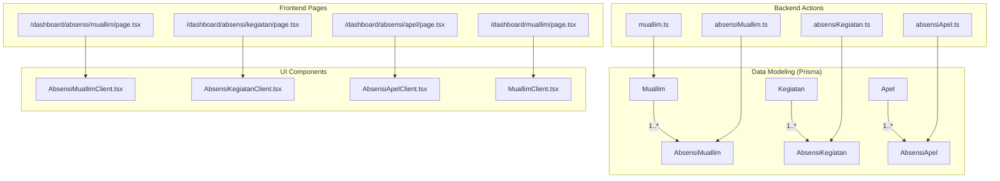
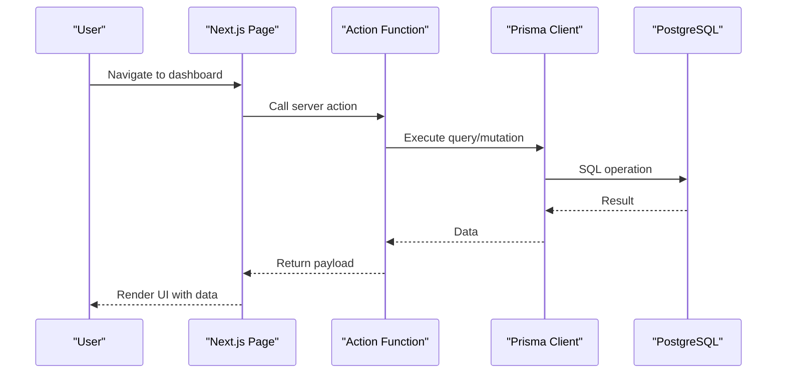
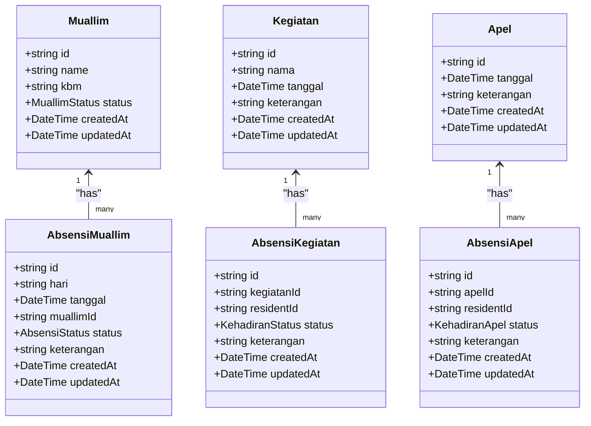
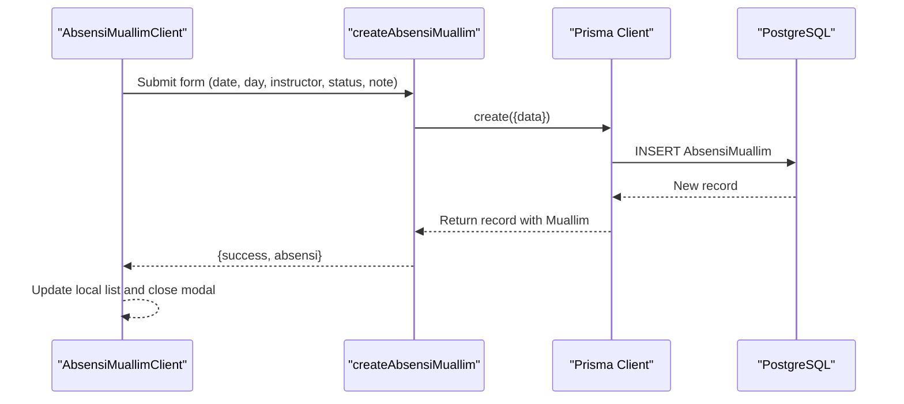
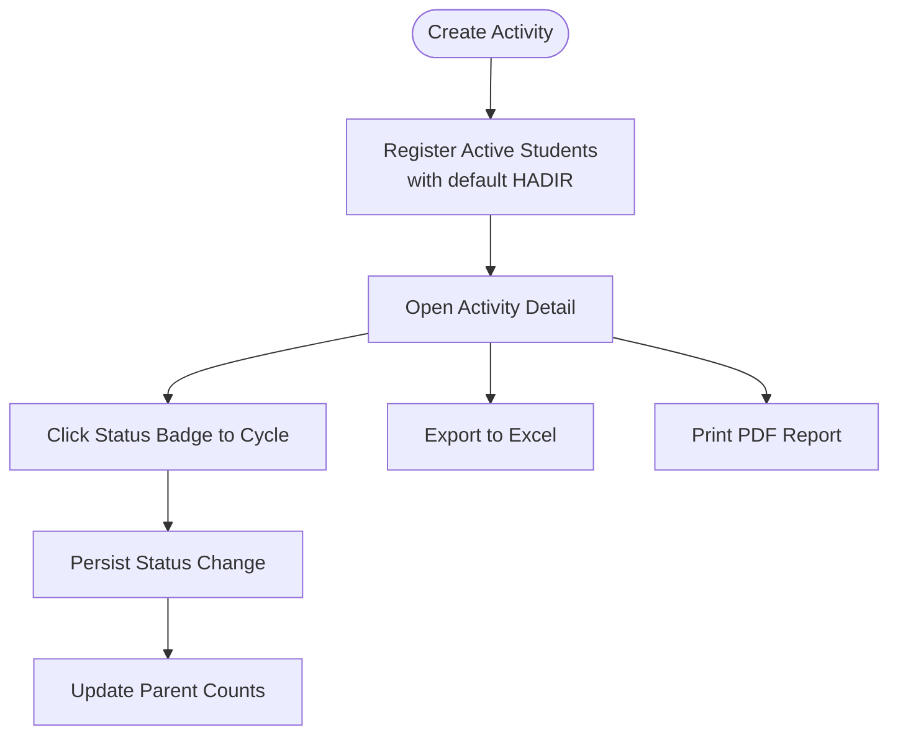
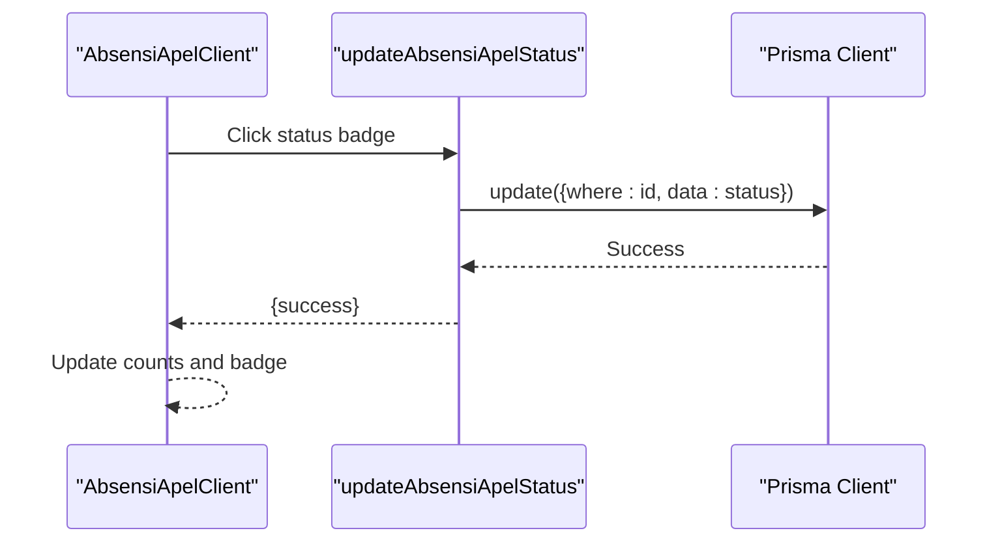
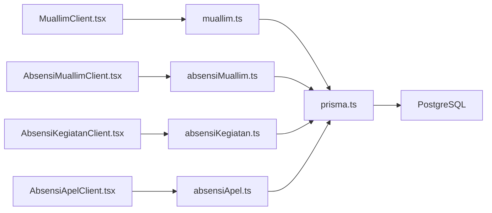

# Attendance & Activity Entities

<cite>
**Referenced Files in This Document**
- [schema.prisma](file://prisma/schema.prisma)
- [prisma.ts](file://src/lib/prisma.ts)
- [absensiMuallim.ts](file://src/app/actions/absensiMuallim.ts)
- [absensiKegiatan.ts](file://src/app/actions/absensiKegiatan.ts)
- [absensiApel.ts](file://src/app/actions/absensiApel.ts)
- [AbsensiMuallimClient.tsx](file://src/components/dashboard/AbsensiMuallimClient.tsx)
- [AbsensiKegiatanClient.tsx](file://src/components/dashboard/AbsensiKegiatanClient.tsx)
- [AbsensiApelClient.tsx](file://src/components/dashboard/AbsensiApelClient.tsx)
- [muallim.ts](file://src/app/actions/muallim.ts)
- [MuallimClient.tsx](file://src/components/dashboard/MuallimClient.tsx)
- [page.tsx (Muallim)](file://src/app/dashboard/muallim/page.tsx)
- [page.tsx (Absensi Muallim)](file://src/app/dashboard/absensi/muallim/page.tsx)
- [page.tsx (Absensi Kegiatan)](file://src/app/dashboard/absensi/kegiatan/page.tsx)
- [page.tsx (Absensi Apel)](file://src/app/dashboard/absensi/apel/page.tsx)
</cite>

## Table of Contents
1. [Introduction](#introduction)
2. [Project Structure](#project-structure)
3. [Core Components](#core-components)
4. [Architecture Overview](#architecture-overview)
5. [Detailed Component Analysis](#detailed-component-analysis)
6. [Dependency Analysis](#dependency-analysis)
7. [Performance Considerations](#performance-considerations)
8. [Troubleshooting Guide](#troubleshooting-guide)
9. [Conclusion](#conclusion)

## Introduction
This document explains ApsAsrama’s attendance and activity tracking system with a focus on four core entities: Muallim (Instructor), Kegiatan (Activity), Apel (Assembly), and their respective attendance models. It details the AbsensiMuallim, AbsensiKegiatan, and AbsensiApel models, their status enumerations, relationships, and the end-to-end workflow for daily monitoring. It also covers reporting capabilities and how the system supports behavioral assessment through structured attendance records.

## Project Structure
The attendance and activity tracking spans three layers:
- Data modeling: Prisma schema defines entities, relationships, and enums.
- Backend actions: Server-side functions encapsulate CRUD and aggregation logic.
- Frontend components: Client components render forms, dashboards, and reports.

**Diagram sources**
- [schema.prisma](file://prisma/schema.prisma)
- [absensiMuallim.ts](file://src/app/actions/absensiMuallim.ts)
- [absensiKegiatan.ts](file://src/app/actions/absensiKegiatan.ts)
- [absensiApel.ts](file://src/app/actions/absensiApel.ts)
- [MuallimClient.tsx](file://src/components/dashboard/MuallimClient.tsx)
- [AbsensiMuallimClient.tsx](file://src/components/dashboard/AbsensiMuallimClient.tsx)
- [AbsensiKegiatanClient.tsx](file://src/components/dashboard/AbsensiKegiatanClient.tsx)
- [AbsensiApelClient.tsx](file://src/components/dashboard/AbsensiApelClient.tsx)
- [page.tsx (Muallim)](file://src/app/dashboard/muallim/page.tsx)
- [page.tsx (Absensi Muallim)](file://src/app/dashboard/absensi/muallim/page.tsx)
- [page.tsx (Absensi Kegiatan)](file://src/app/dashboard/absensi/kegiatan/page.tsx)
- [page.tsx (Absensi Apel)](file://src/app/dashboard/absensi/apel/page.tsx)

**Section sources**
- [schema.prisma](file://prisma/schema.prisma)
- [prisma.ts](file://src/lib/prisma.ts)

## Core Components
This section introduces the entities and their relationships, focusing on how Absensi* models capture attendance and how status enums define behavioral states.

- Muallim (Instructor)
  - Tracks instructor identity and teaching subject (KBM).
  - Has a status enum (ACTIVE/INACTIVE).
  - Links to AbsensiMuallim via a one-to-many relationship.

- Kegiatan (Activity)
  - Represents scheduled activities with date and optional description.
  - Links to AbsensiKegiatan via a one-to-many relationship.

- Apel (Assembly)
  - Represents daily assembly events with date and optional description.
  - Links to AbsensiApel via a one-to-many relationship.

- AbsensiMuallim
  - Records daily attendance for instructors with status (HADIR, IZIN, DIWAKILKAN) and optional notes.
  - Indexed by instructor and date for efficient queries.

- AbsensiKegiatan
  - Records student attendance for activities with status (HADIR, IZIN, SAKIT, ALPA) and optional notes.
  - Ensures uniqueness per activity-student pair.

- AbsensiApel
  - Records student attendance for assemblies with status (HADIR, ALPA, IZIN) and optional notes.
  - Ensures uniqueness per apel-student pair.

Status definitions and relationships are defined in the Prisma schema and enforced at the database level.

**Section sources**
- [schema.prisma](file://prisma/schema.prisma)

## Architecture Overview
The system follows a layered architecture:
- Data layer: Prisma schema and PostgreSQL define entities and constraints.
- Application layer: Action functions encapsulate business logic and data access.
- Presentation layer: Next.js pages and client components render UI and manage user interactions.

**Diagram sources**
- [prisma.ts](file://src/lib/prisma.ts)
- [absensiMuallim.ts](file://src/app/actions/absensiMuallim.ts)
- [absensiKegiatan.ts](file://src/app/actions/absensiKegiatan.ts)
- [absensiApel.ts](file://src/app/actions/absensiApel.ts)

## Detailed Component Analysis

### Entity Model and Relationships
The entity model establishes strong relationships and constraints that underpin accurate attendance tracking.

**Diagram sources**
- [schema.prisma](file://prisma/schema.prisma)

**Section sources**
- [schema.prisma](file://prisma/schema.prisma)

### AbsensiMuallim: Instructor Attendance Tracking
- Purpose: Capture daily attendance of instructors with status and notes.
- Workflow:
  - Create: Collects date, day-of-week, instructor, status, and optional note; auto-fills day-of-week on date change.
  - List: Fetches all entries ordered by date descending and includes instructor details.
  - Delete: Removes a specific record and refreshes cached routes.

**Diagram sources**
- [AbsensiMuallimClient.tsx](file://src/components/dashboard/AbsensiMuallimClient.tsx)
- [absensiMuallim.ts](file://src/app/actions/absensiMuallim.ts)

**Section sources**
- [AbsensiMuallimClient.tsx](file://src/components/dashboard/AbsensiMuallimClient.tsx)
- [absensiMuallim.ts](file://src/app/actions/absensiMuallim.ts)

### AbsensiKegiatan: Activity Attendance Tracking
- Purpose: Manage activity sessions and student attendance with quick status cycling.
- Workflow:
  - Create: Stores activity metadata; automatically registers all active students with default HADIR status.
  - Update status: Provides a one-click cycle through statuses (HADIR → ALPA → SAKIT → IZIN → HADIR).
  - Aggregate counts: Computes present counts per activity for quick overview.
  - Reporting: Exports detailed attendance to Excel and prints PDF reports.

**Diagram sources**
- [absensiKegiatan.ts](file://src/app/actions/absensiKegiatan.ts)
- [AbsensiKegiatanClient.tsx](file://src/components/dashboard/AbsensiKegiatanClient.tsx)

**Section sources**
- [absensiKegiatan.ts](file://src/app/actions/absensiKegiatan.ts)
- [AbsensiKegiatanClient.tsx](file://src/components/dashboard/AbsensiKegiatanClient.tsx)

### AbsensiApel: Assembly Attendance Tracking
- Purpose: Track daily assembly attendance with quick status toggling and reporting.
- Workflow:
  - Create: Registers all active students with default HADIR status upon creation.
  - Update status: Cycles through HADIR → ALPA → IZIN → HADIR.
  - Filtering: Supports date-range filtering for historical views.
  - Reporting: Exports to Excel and prints PDF.

**Diagram sources**
- [absensiApel.ts](file://src/app/actions/absensiApel.ts)
- [AbsensiApelClient.tsx](file://src/components/dashboard/AbsensiApelClient.tsx)

**Section sources**
- [absensiApel.ts](file://src/app/actions/absensiApel.ts)
- [AbsensiApelClient.tsx](file://src/components/dashboard/AbsensiApelClient.tsx)

### Behavioral Assessment System
- Status-based classification:
  - AbsensiMuallim: HADIR, IZIN, DIWAKILKAN.
  - AbsensiKegiatan: HADIR, IZIN, SAKIT, ALPA.
  - AbsensiApel: HADIR, ALPA, IZIN.
- Daily monitoring:
  - Automatic registration of active residents during activity/apel creation ensures comprehensive coverage.
  - One-click status cycling enables rapid corrections and updates.
- Reporting:
  - Export to Excel and PDF for administrative review and compliance.
  - Count summaries (present/total) provide quick insights.

**Section sources**
- [absensiMuallim.ts](file://src/app/actions/absensiMuallim.ts)
- [absensiKegiatan.ts](file://src/app/actions/absensiKegiatan.ts)
- [absensiApel.ts](file://src/app/actions/absensiApel.ts)
- [AbsensiKegiatanClient.tsx](file://src/components/dashboard/AbsensiKegiatanClient.tsx)
- [AbsensiApelClient.tsx](file://src/components/dashboard/AbsensiApelClient.tsx)

## Dependency Analysis
The system exhibits clean separation of concerns:
- UI components depend on action functions for data mutations and queries.
- Action functions depend on Prisma client for database operations.
- Prisma client depends on PostgreSQL via a driver adapter.

**Diagram sources**
- [MuallimClient.tsx](file://src/components/dashboard/MuallimClient.tsx)
- [AbsensiMuallimClient.tsx](file://src/components/dashboard/AbsensiMuallimClient.tsx)
- [AbsensiKegiatanClient.tsx](file://src/components/dashboard/AbsensiKegiatanClient.tsx)
- [AbsensiApelClient.tsx](file://src/components/dashboard/AbsensiApelClient.tsx)
- [muallim.ts](file://src/app/actions/muallim.ts)
- [absensiMuallim.ts](file://src/app/actions/absensiMuallim.ts)
- [absensiKegiatan.ts](file://src/app/actions/absensiKegiatan.ts)
- [absensiApel.ts](file://src/app/actions/absensiApel.ts)
- [prisma.ts](file://src/lib/prisma.ts)

**Section sources**
- [prisma.ts](file://src/lib/prisma.ts)

## Performance Considerations
- Indexing: Entities are indexed on critical fields (e.g., AbsensiMuallim on muallimId and tanggal, Kegiatan and Apel on tanggal) to optimize queries.
- Batch operations: Creation of activities triggers batch creation of AbsensiKegiatan entries for active residents; batching reduces round-trips.
- Client-side caching: Next.js revalidation paths ensure UI updates after mutations.
- Pagination and filtering: Client components implement search and date-range filters to limit rendered datasets.

[No sources needed since this section provides general guidance]

## Troubleshooting Guide
Common issues and resolutions:
- Database connectivity errors:
  - Verify DATABASE_URL environment variable is set and reachable.
  - Confirm connection pool settings and timeouts align with deployment environment.
- Mutations failing:
  - Check Prisma client error codes and messages returned by action functions.
  - Validate unique constraints (e.g., activity-student pairing in AbsensiKegiatan).
- UI not updating:
  - Ensure revalidatePath is called after successful mutations.
  - Confirm Next.js cache revalidation settings.

**Section sources**
- [prisma.ts](file://src/lib/prisma.ts)
- [absensiKegiatan.ts](file://src/app/actions/absensiKegiatan.ts)
- [absensiApel.ts](file://src/app/actions/absensiApel.ts)
- [absensiMuallim.ts](file://src/app/actions/absensiMuallim.ts)

## Conclusion
ApsAsrama’s attendance and activity tracking system provides a robust foundation for daily monitoring through well-defined entities and status enums. The AbsensiMuallim, AbsensiKegiatan, and AbsensiApel models, combined with intuitive UI components and server actions, enable efficient data capture, real-time updates, and comprehensive reporting. The behavioral assessment framework leverages status classifications to support administrative oversight and compliance.