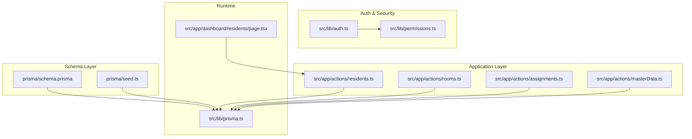
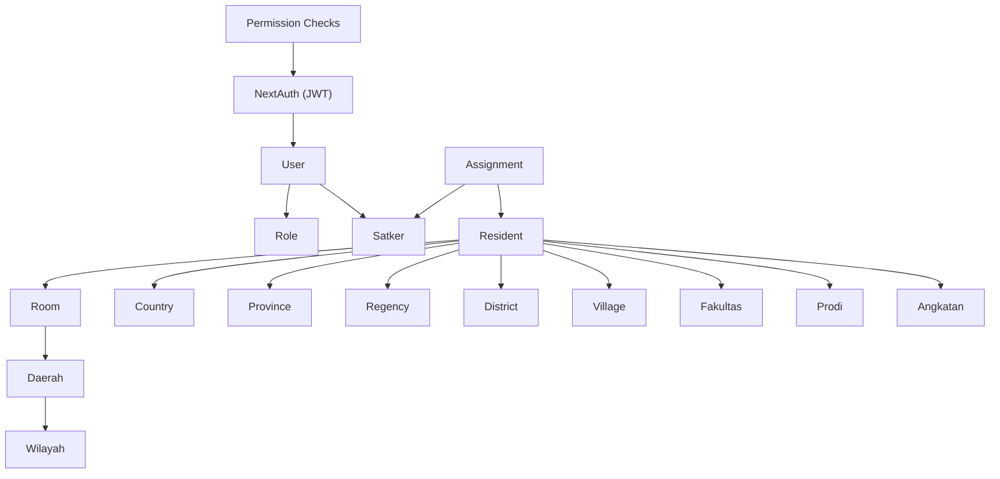
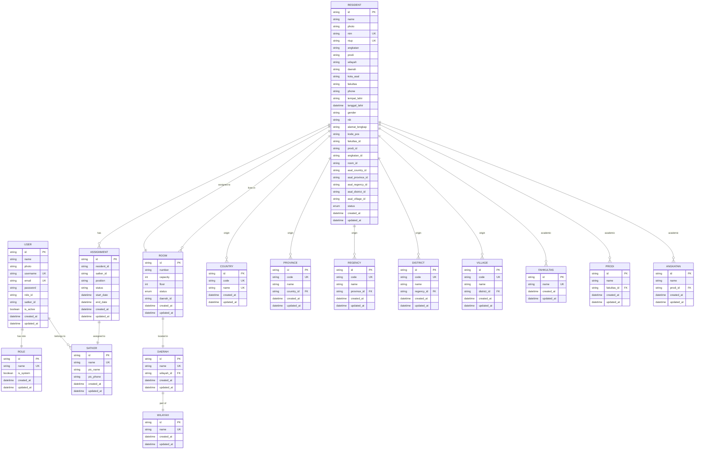
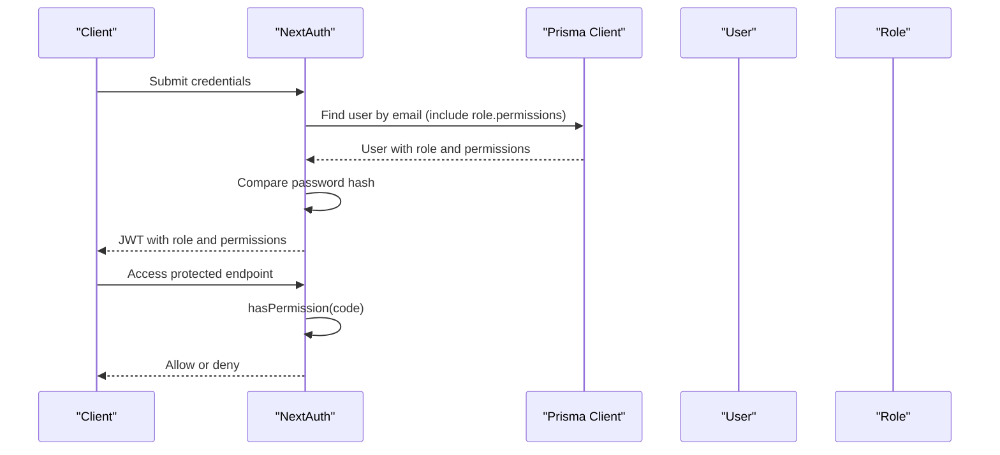
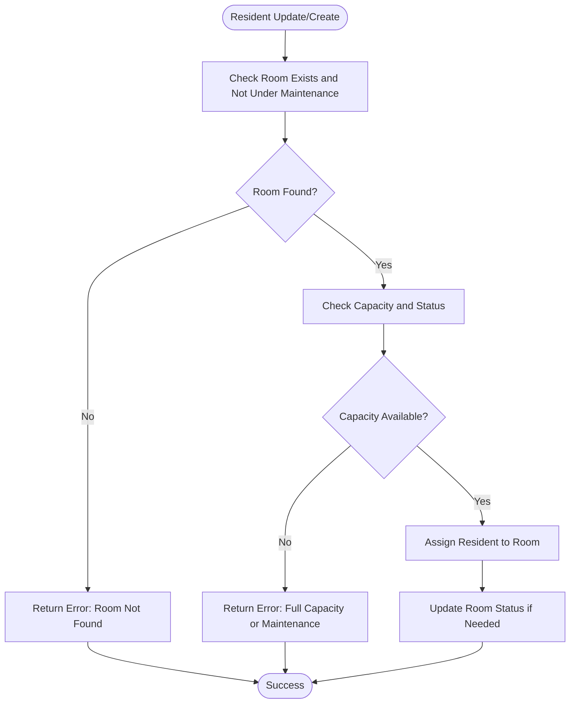
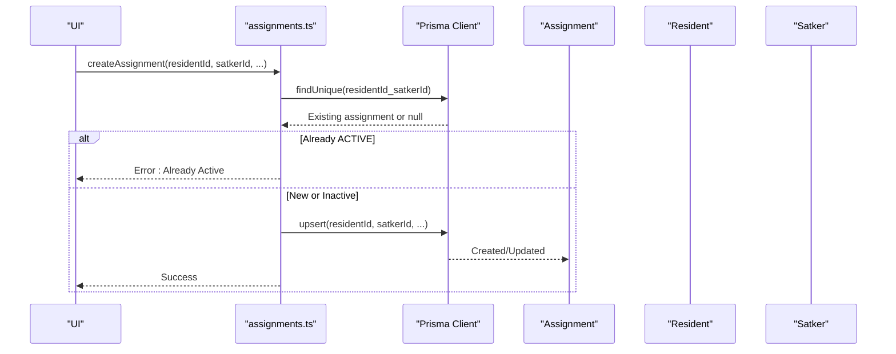
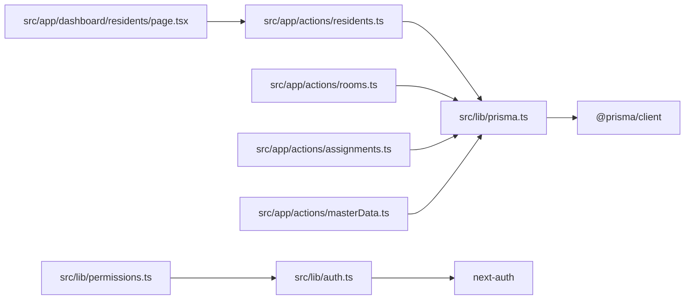

# Core Business Entities

<cite>
**Referenced Files in This Document**
- [schema.prisma](file://prisma/schema.prisma)
- [seed.ts](file://prisma/seed.ts)
- [residents.ts](file://src/app/actions/residents.ts)
- [rooms.ts](file://src/app/actions/rooms.ts)
- [assignments.ts](file://src/app/actions/assignments.ts)
- [masterData.ts](file://src/app/actions/masterData.ts)
- [prisma.ts](file://src/lib/prisma.ts)
- [auth.ts](file://src/lib/auth.ts)
- [permissions.ts](file://src/lib/permissions.ts)
- [page.tsx](file://src/app/dashboard/residents/page.tsx)
</cite>

## Table of Contents
1. [Introduction](#introduction)
2. [Project Structure](#project-structure)
3. [Core Components](#core-components)
4. [Architecture Overview](#architecture-overview)
5. [Detailed Component Analysis](#detailed-component-analysis)
6. [Dependency Analysis](#dependency-analysis)
7. [Performance Considerations](#performance-considerations)
8. [Troubleshooting Guide](#troubleshooting-guide)
9. [Conclusion](#conclusion)
10. [Appendices](#appendices)

## Introduction
This document provides comprehensive documentation for ApsAsrama’s core business entities: User, Resident, Room, Assignment, and Satker. It details field definitions, data types, constraints, validation rules, primary/foreign key relationships, cascading behaviors, referential integrity, and embedded business logic such as user-role relationships, resident-room associations, and assignment-satker connections. Entity relationship diagrams illustrate table connections and cardinalities, and practical operation examples are included to guide common tasks and validation scenarios.

## Project Structure
The schema is defined declaratively using Prisma ORM, with TypeScript action modules orchestrating business operations and NextAuth managing authentication and authorization. The Prisma client is configured to use a PostgreSQL adapter with a connection pool suitable for serverless environments.

**Diagram sources**
- [schema.prisma](file://prisma/schema.prisma)
- [seed.ts](file://prisma/seed.ts)
- [residents.ts](file://src/app/actions/residents.ts)
- [rooms.ts](file://src/app/actions/rooms.ts)
- [assignments.ts](file://src/app/actions/assignments.ts)
- [masterData.ts](file://src/app/actions/masterData.ts)
- [prisma.ts](file://src/lib/prisma.ts)
- [auth.ts](file://src/lib/auth.ts)
- [permissions.ts](file://src/lib/permissions.ts)
- [page.tsx](file://src/app/dashboard/residents/page.tsx)

**Section sources**
- [schema.prisma](file://prisma/schema.prisma)
- [prisma.ts](file://src/lib/prisma.ts)

## Core Components
This section defines each core entity with its fields, data types, constraints, and business rules derived from the Prisma schema and action modules.

### User
- Purpose: Authenticates and authorizes system access with role-based permissions.
- Fields and Constraints:
  - id: String, @id, @default(uuid())
  - name: String
  - photo: String? (optional profile image)
  - username: String? (@unique)
  - email: String (@unique)
  - password: String
  - roleId: String? (foreign key to Role)
  - role: Role? (relation)
  - isActive: Boolean (@default(true))
  - satkerId: String? (foreign key to Satker)
  - satker: Satker? (relation)
  - createdAt: DateTime (@default(now()))
  - updatedAt: DateTime (@updatedAt)
- Business Logic:
  - Authentication via NextAuth with JWT callback embedding role and permissions.
  - Authorization enforced by checking permission codes before operations.
- Validation Rules:
  - Unique constraints on username and email.
  - Password validated against stored hash during login.
- Referential Integrity:
  - roleId references Role(id); optional cascade on delete.
  - satkerId references Satker(id); optional cascade on delete.

**Section sources**
- [schema.prisma](file://prisma/schema.prisma)
- [auth.ts](file://src/lib/auth.ts)
- [permissions.ts](file://src/lib/permissions.ts)

### Resident
- Purpose: Represents a boarder student with personal, academic, and administrative attributes.
- Fields and Constraints:
  - id: String, @id, @default(uuid())
  - name: String
  - photo: String? (optional profile image)
  - nim: String? (@unique; optional student ID)
  - niup: String? (@unique; optional pesantren-specific ID)
  - angkatan: String? (academic cohort/year)
  - prodi: String? (program of study)
  - wilayah: String? (origin region)
  - daerah: String? (origin district)
  - kotaAsal: String? (origin city)
  - fakultas: String? (faculty)
  - phone: String?
  - tempatLahir: String? (place of birth)
  - tanggalLahir: DateTime? (date of birth)
  - gender: String? (normalized to LAKI_LAKI or PEREMPUAN)
  - nik: String?
  - alamatLengkap: String? (full address)
  - kodePos: String?
  - fakultasId: String? (foreign key to Fakultas)
  - fakultasRef: Fakultas? (relation)
  - prodiId: String? (foreign key to Prodi)
  - prodiRef: Prodi? (relation)
  - angkatanId: String? (foreign key to Angkatan)
  - angkatanRef: Angkatan? (relation)
  - roomId: String? (foreign key to Room)
  - room: Room? (relation)
  - asalCountryId: String? (foreign key to Country)
  - asalCountry: Country? (relation)
  - asalProvinceId: String? (foreign key to Province)
  - asalProvince: Province? (relation)
  - asalRegencyId: String? (foreign key to Regency)
  - asalRegency: Regency? (relation)
  - asalDistrictId: String? (foreign key to District)
  - asalDistrict: District? (relation)
  - asalVillageId: String? (foreign key to Village)
  - asalVillage: Village? (relation)
  - status: ResidentStatus (@default(ACTIVE))
  - createdAt: DateTime (@default(now()))
  - updatedAt: DateTime (@updatedAt)
  - Indexes: roomId, status, angkatan
- Business Logic:
  - Unique constraints on nim and niup enforced at creation/update.
  - Room association validated for availability and capacity.
  - Gender normalization to standardized values.
  - Room status auto-updated when capacity thresholds are met.
  - Audit logging captures changes for tracked fields.
- Validation Rules:
  - Required fields for registration include name, gender, place of birth, date of birth, program of study, and cohort.
  - Date of birth must be a valid date.
  - Gender must normalize to LAKI_LAKI or PEREMPUAN.
- Referential Integrity:
  - roomId references Room(id); optional cascade on delete.
  - Academic relations (fakultasId/prodiId/angkatanId) reference respective entities.
  - Administrative origin relations (Country/Province/Regency/District/Village) reference hierarchical regions.

**Section sources**
- [schema.prisma](file://prisma/schema.prisma)
- [residents.ts](file://src/app/actions/residents.ts)

### Room
- Purpose: Defines dormitory accommodations with capacity and floor information.
- Fields and Constraints:
  - id: String, @id, @default(uuid())
  - number: String
  - capacity: Int
  - floor: Int
  - status: RoomStatus (@default(AVAILABLE))
  - daerahId: String? (foreign key to Daerah)
  - daerah: Daerah? (relation)
  - createdAt: DateTime (@default(now()))
  - updatedAt: DateTime (@updatedAt)
  - Unique: (daerahId, number)
  - Indexes: status, floor
- Business Logic:
  - Room number uniqueness enforced per daerah.
  - Capacity checked before assigning residents.
  - Status transitions to OCCUPIED when capacity met; AVAILABLE when unassigned.
- Validation Rules:
  - Room number must be unique.
  - Capacity must be a positive integer.
- Referential Integrity:
  - daerahId references Daerah(id); optional cascade on delete.

**Section sources**
- [schema.prisma](file://prisma/schema.prisma)
- [rooms.ts](file://src/app/actions/rooms.ts)
- [residents.ts](file://src/app/actions/residents.ts)

### Assignment
- Purpose: Links a Resident to a Satker with a role and timeline.
- Fields and Constraints:
  - id: String, @id, @default(uuid())
  - residentId: String
  - resident: Resident (@relation with onDelete: Cascade)
  - satkerId: String
  - satker: Satker (@relation with onDelete: Cascade)
  - position: String (@default("Anggota"))
  - status: String (@default("ACTIVE")) (ACTIVE, COMPLETED)
  - startDate: DateTime (@default(now()))
  - endDate: DateTime?
  - createdAt: DateTime (@default(now()))
  - updatedAt: DateTime (@updatedAt)
  - Unique: (residentId, satkerId)
  - Index: satkerId
- Business Logic:
  - Prevents duplicate active assignments between the same resident and satker.
  - Upsert semantics to reactivate or update existing assignments.
- Validation Rules:
  - startDate defaults to current time if not provided.
  - endDate must be a valid date if provided.
- Referential Integrity:
  - residentId references Resident(id) with CASCADE on delete.
  - satkerId references Satker(id) with CASCADE on delete.

**Section sources**
- [schema.prisma](file://prisma/schema.prisma)
- [assignments.ts](file://src/app/actions/assignments.ts)

### Satker
- Purpose: Organizational unit responsible for supervision and reporting.
- Fields and Constraints:
  - id: String, @id, @default(uuid())
  - name: String (@unique)
  - picName: String (responsible person)
  - picPhone: String?
  - createdAt: DateTime (@default(now()))
  - updatedAt: DateTime (@updatedAt)
- Business Logic:
  - Uniqueness enforced on name.
  - Linked to Users and Assignments.
- Validation Rules:
  - Name must be unique.
- Referential Integrity:
  - No explicit foreign keys; maintains relationships via User.satkerId and Assignment.satkerId.

**Section sources**
- [schema.prisma](file://prisma/schema.prisma)
- [assignments.ts](file://src/app/actions/assignments.ts)

## Architecture Overview
The system enforces referential integrity at the database level and augments it with application-level validations and business rules. Authentication and authorization are handled centrally via NextAuth and permission checks.

**Diagram sources**
- [schema.prisma](file://prisma/schema.prisma)
- [auth.ts](file://src/lib/auth.ts)
- [permissions.ts](file://src/lib/permissions.ts)

## Detailed Component Analysis

### Entity Relationship Diagram
This diagram maps the core entities and their relationships, highlighting primary and foreign keys, unique constraints, and cascading behaviors.

**Diagram sources**
- [schema.prisma](file://prisma/schema.prisma)

### User-Role Relationship
- One-to-many: Role has many Users; User belongs to one Role.
- Authentication flow resolves user role and permissions via JWT claims.
- Authorization checks enforce permission codes before sensitive operations.

**Diagram sources**
- [auth.ts](file://src/lib/auth.ts)
- [permissions.ts](file://src/lib/permissions.ts)
- [schema.prisma](file://prisma/schema.prisma)

### Resident-Room Association
- Many-to-one: Resident belongs to one Room; Room has many Residents.
- Application-level validation ensures room availability and capacity before assignment.
- Room status transitions automatically reflect occupancy.

**Diagram sources**
- [residents.ts](file://src/app/actions/residents.ts)
- [rooms.ts](file://src/app/actions/rooms.ts)
- [schema.prisma](file://prisma/schema.prisma)

### Assignment-Satker Link
- Unique composite key prevents duplicate active assignments between the same Resident and Satker.
- Upsert logic supports reactivation or updates to existing assignments.

**Diagram sources**
- [assignments.ts](file://src/app/actions/assignments.ts)
- [schema.prisma](file://prisma/schema.prisma)

## Dependency Analysis
- Prisma client is initialized with a PostgreSQL adapter and a single-pool configuration for serverless environments.
- Action modules depend on Prisma for data access and NextAuth for session and permissions.
- UI pages orchestrate parallel data fetching and pass permissions to client components.

**Diagram sources**
- [prisma.ts](file://src/lib/prisma.ts)
- [auth.ts](file://src/lib/auth.ts)
- [permissions.ts](file://src/lib/permissions.ts)
- [residents.ts](file://src/app/actions/residents.ts)
- [rooms.ts](file://src/app/actions/rooms.ts)
- [assignments.ts](file://src/app/actions/assignments.ts)
- [masterData.ts](file://src/app/actions/masterData.ts)
- [page.tsx](file://src/app/dashboard/residents/page.tsx)

**Section sources**
- [prisma.ts](file://src/lib/prisma.ts)
- [auth.ts](file://src/lib/auth.ts)
- [permissions.ts](file://src/lib/permissions.ts)
- [page.tsx](file://src/app/dashboard/residents/page.tsx)

## Performance Considerations
- Indexes: Room (status, floor), Resident (roomId, status, angkatan), Assignment (satkerId), and others improve query performance for filtering and joins.
- Unique constraints: Enforced at DB level reduce application-level duplication checks.
- Connection pooling: Single connection per serverless instance minimizes overhead while ensuring safe concurrent access.
- Recommendations:
  - Use pagination for large lists (residents, rooms).
  - Batch operations for bulk resident imports/moves to reduce round trips.
  - Monitor Prisma query logs and optimize frequently accessed joins.

[No sources needed since this section provides general guidance]

## Troubleshooting Guide
- Authentication failures:
  - Verify credentials and ensure user exists with a valid role and permissions.
  - Confirm NEXTAUTH_SECRET is set and JWT session strategy is active.
- Authorization errors:
  - Ensure permission codes match those seeded and assigned to roles.
  - Use hasPermission checks before invoking protected actions.
- Data conflicts:
  - Unique violations on username/email, room number, nim, or niup will surface as constraint errors.
  - For assignments, “already active” indicates a duplicate active record.
- Operational errors:
  - Room deletion fails if residents are assigned; unassign before deleting.
  - Resident updates fail if target room is under maintenance or full.
  - Bulk operations log skipped rows and successes; review counts for diagnostics.

**Section sources**
- [auth.ts](file://src/lib/auth.ts)
- [permissions.ts](file://src/lib/permissions.ts)
- [residents.ts](file://src/app/actions/residents.ts)
- [rooms.ts](file://src/app/actions/rooms.ts)
- [assignments.ts](file://src/app/actions/assignments.ts)
- [seed.ts](file://prisma/seed.ts)

## Conclusion
ApsAsrama’s core entities form a cohesive domain model with strong referential integrity and embedded business logic. The schema enforces uniqueness and constraints, while action modules implement validation, cascading behaviors, and operational safeguards. Authentication and authorization are centralized, enabling secure and auditable access to resources.

[No sources needed since this section summarizes without analyzing specific files]

## Appendices

### Field Reference Summary
- User: identity, authentication, role, and organizational affiliation.
- Resident: personal, academic, administrative, and housing data with normalization and uniqueness.
- Room: accommodation metadata with capacity and location linkage.
- Assignment: residency-satker relationship with position and timeline.
- Satker: organizational unit with contact information.

**Section sources**
- [schema.prisma](file://prisma/schema.prisma)