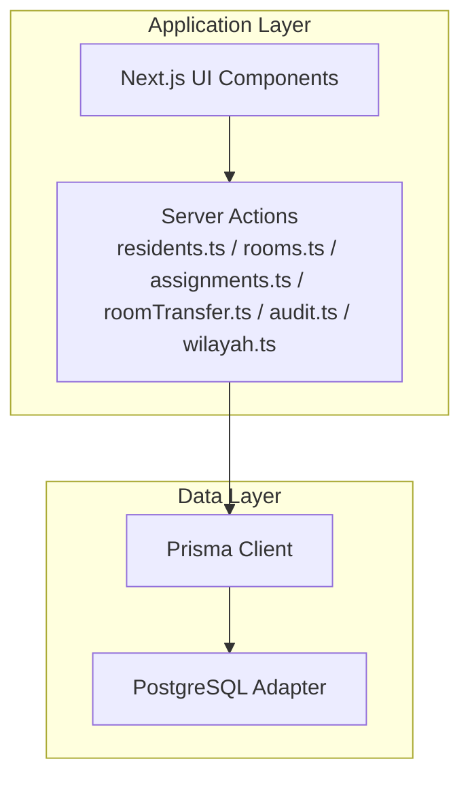
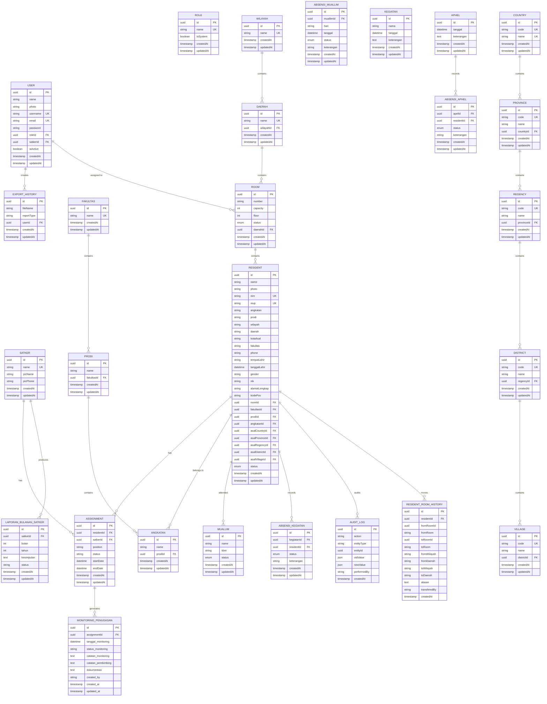
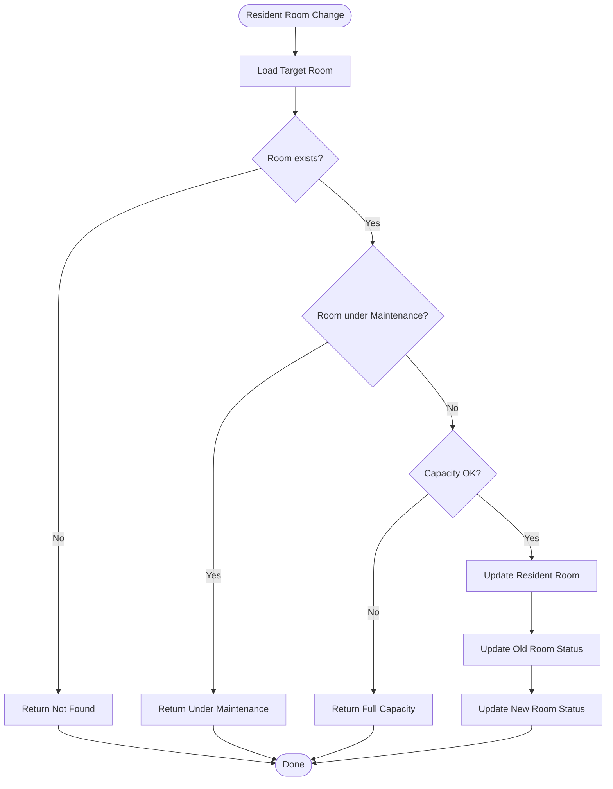
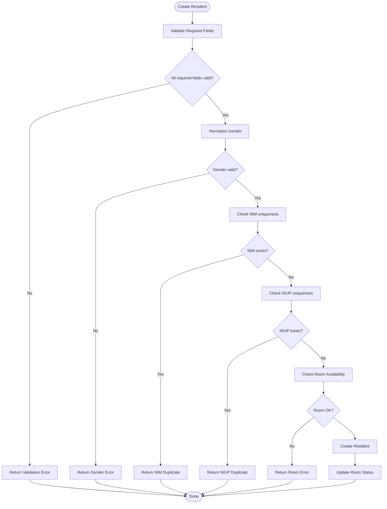
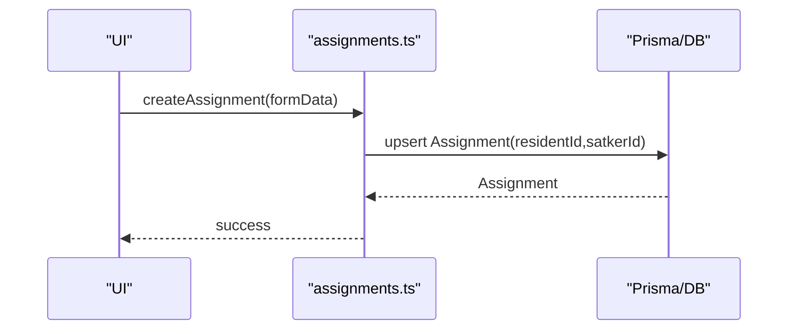
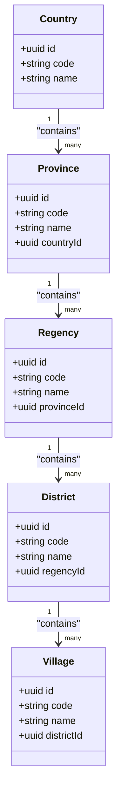
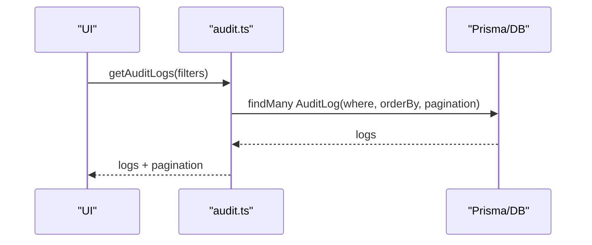
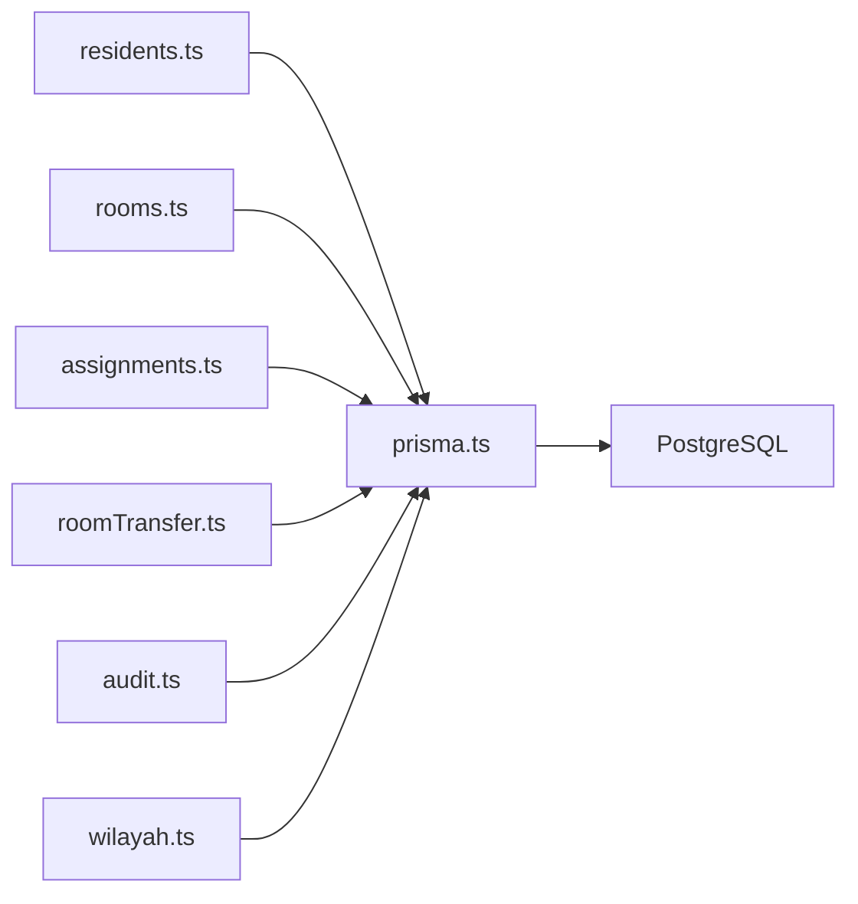

# Entity Models & Relationships

<cite>
**Referenced Files in This Document**
- [schema.prisma](file://prisma/schema.prisma)
- [seed.ts](file://prisma/seed.ts)
- [prisma.ts](file://src/lib/prisma.ts)
- [residents.ts](file://src/app/actions/residents.ts)
- [rooms.ts](file://src/app/actions/rooms.ts)
- [assignments.ts](file://src/app/actions/assignments.ts)
- [roomTransfer.ts](file://src/app/actions/roomTransfer.ts)
- [audit.ts](file://src/app/actions/audit.ts)
- [wilayah.ts](file://src/app/actions/wilayah.ts)
- [migration.sql](file://prisma/migrations/202606230001_make_resident_nim_optional/migration.sql)
</cite>

## Table of Contents
1. [Introduction](#introduction)
2. [Project Structure](#project-structure)
3. [Core Components](#core-components)
4. [Architecture Overview](#architecture-overview)
5. [Detailed Component Analysis](#detailed-component-analysis)
6. [Dependency Analysis](#dependency-analysis)
7. [Performance Considerations](#performance-considerations)
8. [Troubleshooting Guide](#troubleshooting-guide)
9. [Conclusion](#conclusion)

## Introduction
This document provides a comprehensive entity model reference for ApsAsrama’s core data layer. It covers 25+ database models including Users, Residents, Rooms, Assignments, Satkers, and the full geographic administrative hierarchy (Countries, Provinces, Regencies, Districts, Villages). For each entity, we describe fields, data types, constraints, indexes, unique keys, and referential integrity enforced by Prisma and PostgreSQL. We also explain business rules embedded in the schema and application logic, and present entity relationship diagrams with cardinalities.

## Project Structure
The data model is defined declaratively in Prisma’s schema and enforced by a PostgreSQL adapter. Application-level validation and business rules live in server actions that interact with Prisma.

**Diagram sources**
- [prisma.ts:1-31](file://src/lib/prisma.ts#L1-L31)
- [residents.ts:1-666](file://src/app/actions/residents.ts#L1-L666)
- [rooms.ts:1-118](file://src/app/actions/rooms.ts#L1-L118)
- [assignments.ts:1-215](file://src/app/actions/assignments.ts#L1-L215)
- [roomTransfer.ts:1-156](file://src/app/actions/roomTransfer.ts#L1-L156)
- [audit.ts:1-118](file://src/app/actions/audit.ts#L1-L118)
- [wilayah.ts:1-326](file://src/app/actions/wilayah.ts#L1-L326)

**Section sources**
- [prisma.ts:1-31](file://src/lib/prisma.ts#L1-L31)
- [schema.prisma:1-487](file://prisma/schema.prisma#L1-L487)

## Core Components
Below are the core entities and their attributes. Each entity lists:
- Primary key
- Fields and types
- Constraints (@unique, @default, relation directives)
- Indexes and unique constraints
- Enumerations used
- Business rules and validations

### Users
- Purpose: Authentication and authorization for operators.
- Keys and relations:
  - id (UUID, PK)
  - roleId → Role.id (optional)
  - satkerId → Satker.id (optional)
  - exportHistory → ExportHistory[]
- Constraints:
  - username: unique
  - email: unique
  - isActive: default true
- Indexes:
  - None explicit (PK implied)
- Notes:
  - Role and Satker relations are optional; users can be unassigned.

**Section sources**
- [schema.prisma:10-25](file://prisma/schema.prisma#L10-L25)

### Roles and Permissions
- Role
  - id (UUID, PK)
  - name: unique
  - isSystem: default false
  - permissions: RolePermission[]
  - users: User[]
- Permission
  - id (UUID, PK)
  - module: string
  - action: string
  - code: unique
  - description: string?
  - roles: RolePermission[]
- RolePermission
  - Composite PK: roleId, permissionId
  - Cascading deletes on roleId, permissionId

**Section sources**
- [schema.prisma:165-193](file://prisma/schema.prisma#L165-L193)
- [seed.ts:4-73](file://prisma/seed.ts#L4-L73)

### Rooms
- Purpose: Dormitory rooms with capacity and status.
- Keys and relations:
  - id (UUID, PK)
  - daerahId → Daerah.id (optional)
  - residents: Resident[]
- Constraints:
  - Unique constraint: (daerahId, number)
  - status: default AVAILABLE
- Indexes:
  - status
  - floor

**Section sources**
- [schema.prisma:27-42](file://prisma/schema.prisma#L27-L42)

### Residents
- Purpose: Boarding students with personal and academic info.
- Keys and relations:
  - id (UUID, PK)
  - roomId → Room.id (optional)
  - assignments: Assignment[]
  - absensiKegiatan: AbsensiKegiatan[]
  - absensiApel: AbsensiApel[]
  - roomHistory: ResidentRoomHistory[]
  - fakultasId → Fakultas.id (optional)
  - prodiId → Prodi.id (optional)
  - angkatanId → Angkatan.id (optional)
  - asalCountryId → Country.id (optional)
  - asalProvinceId → Province.id (optional)
  - asalRegencyId → Regency.id (optional)
  - asalDistrictId → District.id (optional)
  - asalVillageId → Village.id (optional)
- Constraints:
  - nim: unique (nullable until migration)
  - niup: unique (nullable)
  - status: default ACTIVE
- Indexes:
  - roomId
  - status
  - angkatan

**Section sources**
- [schema.prisma:44-101](file://prisma/schema.prisma#L44-L101)
- [migration.sql:1-2](file://prisma/migrations/202606230001_make_resident_nim_optional/migration.sql#L1-L2)

### Satkers (Organizational Units)
- Purpose: Work units (e.g., committees) that assign residents.
- Keys and relations:
  - id (UUID, PK)
  - users: User[]
  - assignments: Assignment[]
  - laporanBulanan: LaporanBulananSatker[]
- Constraints:
  - name: unique

**Section sources**
- [schema.prisma:103-113](file://prisma/schema.prisma#L103-L113)

### Assignments
- Purpose: Links residents to satkers with position/status and dates.
- Keys and relations:
  - id (UUID, PK)
  - residentId → Resident.id (onDelete: Cascade)
  - satkerId → Satker.id (onDelete: Cascade)
  - monitorings: MonitoringPenugasan[]
- Constraints:
  - Unique constraint: (residentId, satkerId)
  - position: default "Anggota"
  - status: default "ACTIVE"
  - startDate: default now()

**Section sources**
- [schema.prisma:115-131](file://prisma/schema.prisma#L115-L131)

### MonitoringPenugasan
- Purpose: Monthly monitoring records for assignments.
- Keys and relations:
  - id (UUID, PK)
  - assignmentId → Assignment.id (onDelete: Cascade)
- Constraints:
  - Mapped table name: monitoring_penugasan
- Indexes:
  - assignmentId
  - tanggal_monitoring

**Section sources**
- [schema.prisma:133-149](file://prisma/schema.prisma#L133-L149)

### LaporanBulananSatker
- Purpose: Monthly summaries per satker.
- Keys and relations:
  - id (UUID, PK)
  - satkerId → Satker.id
- Constraints:
  - Unique constraint: (satkerId, bulan, tahun)
  - status: default "DRAFT"

**Section sources**
- [schema.prisma:151-163](file://prisma/schema.prisma#L151-L163)

### Academic Hierarchy
- Fakultas
  - id (UUID, PK)
  - name: unique
  - prodis: Prodi[]
  - residents: Resident[]
- Prodi
  - id (UUID, PK)
  - name: string
  - fakultasId → Fakultas.id (onDelete: Cascade)
  - angkatans: Angkatan[]
  - residents: Resident[]
  - Unique constraint: (name, fakultasId)
- Angkatan
  - id (UUID, PK)
  - name: string
  - prodiId → Prodi.id (onDelete: Cascade)
  - residents: Resident[]
  - Unique constraint: (name, prodiId)

**Section sources**
- [schema.prisma:326-358](file://prisma/schema.prisma#L326-L358)

### Geographic Reference Models
- Wilayah
  - id (UUID, PK)
  - name: unique
  - daerahs: Daerah[]
- Daerah
  - id (UUID, PK)
  - name: unique
  - wilayahId → Wilayah.id (optional)
  - rooms: Room[]
- Country
  - id (UUID, PK)
  - code: unique
  - name: unique
  - provinces: Province[]
  - residents: Resident[]
  - Indexed: name
- Province
  - id (UUID, PK)
  - code: unique
  - name: string
  - countryId → Country.id (onDelete: Cascade)
  - regencies: Regency[]
  - residents: Resident[]
  - Unique constraint: (name, countryId)
  - Indexed: name, countryId
- Regency
  - id (UUID, PK)
  - code: unique
  - name: string
  - provinceId → Province.id (onDelete: Cascade)
  - districts: District[]
  - residents: Resident[]
  - Unique constraint: (name, provinceId)
  - Indexed: name, provinceId
- District
  - id (UUID, PK)
  - code: unique
  - name: string
  - regencyId → Regency.id (onDelete: Cascade)
  - villages: Village[]
  - residents: Resident[]
  - Unique constraint: (name, regencyId)
  - Indexed: name, regencyId
- Village
  - id (UUID, PK)
  - code: unique
  - name: string
  - districtId → District.id (onDelete: Cascade)
  - residents: Resident[]
  - Unique constraint: (name, districtId)
  - Indexed: name, districtId

**Section sources**
- [schema.prisma:308-453](file://prisma/schema.prisma#L308-L453)

### Attendance Entities
- Muallim
  - id (UUID, PK)
  - name: string
  - kbm: string
  - status: default ACTIVE
  - absensi: AbsensiMuallim[]
- AbsensiMuallim
  - id (UUID, PK)
  - muallimId → Muallim.id
  - status: default HADIR
  - Indexed: muallimId, tanggal
- Kegiatan
  - id (UUID, PK)
  - nama: string
  - tanggal: DateTime
  - absensi: AbsensiKegiatan[]
  - Indexed: tanggal
- AbsensiKegiatan
  - id (UUID, PK)
  - kegiatanId → Kegiatan.id (onDelete: Cascade)
  - residentId → Resident.id (onDelete: Cascade)
  - Unique constraint: (kegiatanId, residentId)
  - Indexed: residentId
- Apel
  - id (UUID, PK)
  - tanggal: DateTime
  - absensi: AbsensiApel[]
  - Indexed: tanggal
- AbsensiApel
  - id (UUID, PK)
  - apelId → Apel.id (onDelete: Cascade)
  - residentId → Resident.id (onDelete: Cascade)
  - Unique constraint: (apelId, residentId)
  - Indexed: residentId

**Section sources**
- [schema.prisma:206-306](file://prisma/schema.prisma#L206-L306)

### Audit and Room History
- AuditLog
  - id (UUID, PK)
  - action: string
  - entityType: string
  - entityId: string?
  - oldValue/newValue: JSON
  - performedBy: string?
  - Indexed: entityType, entityId
- ResidentRoomHistory
  - id (UUID, PK)
  - residentId → Resident.id (onDelete: Cascade)
  - fromRoomId/toRoomId: string?
  - fromRoom/toRoom: string?
  - fromWilayah/fromDaerah/toWilayah/toDaerah: string?
  - alasan: text?
  - transferedBy: string?
  - Indexed: residentId, createdAt

**Section sources**
- [schema.prisma:455-486](file://prisma/schema.prisma#L455-L486)

### Enums
- RoomStatus: AVAILABLE, OCCUPIED, MAINTENANCE
- ResidentStatus: ACTIVE, INACTIVE
- MuallimStatus: ACTIVE, INACTIVE
- AbsensiStatus: HADIR, IZIN, DIWAKILKAN
- KehadiranStatus: HADIR, IZIN, SAKIT, ALPA
- KehadiranApel: HADIR, ALPA, IZIN

**Section sources**
- [schema.prisma:195-204](file://prisma/schema.prisma#L195-L204)
- [schema.prisma:216-219](file://prisma/schema.prisma#L216-L219)
- [schema.prisma:236-240](file://prisma/schema.prisma#L236-L240)
- [schema.prisma:269-274](file://prisma/schema.prisma#L269-L274)
- [schema.prisma:302-306](file://prisma/schema.prisma#L302-L306)

## Architecture Overview
The system enforces referential integrity at the database level via Prisma relations and foreign keys. Application-level business rules (e.g., room capacity, residency status, audit logging) are implemented in server actions.

**Diagram sources**
- [schema.prisma:10-486](file://prisma/schema.prisma#L10-L486)

## Detailed Component Analysis

### Room Capacity and Status Management
Room availability is governed by capacity and status. The application enforces:
- Room capacity checks during resident creation/update/move
- Automatic status transitions:
  - AVAILABLE when last resident leaves
  - OCCUPIED when capacity is reached
  - MAINTENANCE for repair/inactive rooms

**Diagram sources**
- [residents.ts:170-235](file://src/app/actions/residents.ts#L170-L235)
- [rooms.ts:92-117](file://src/app/actions/rooms.ts#L92-L117)
- [roomTransfer.ts:14-125](file://src/app/actions/roomTransfer.ts#L14-L125)

**Section sources**
- [residents.ts:170-235](file://src/app/actions/residents.ts#L170-L235)
- [rooms.ts:92-117](file://src/app/actions/rooms.ts#L92-L117)
- [roomTransfer.ts:14-125](file://src/app/actions/roomTransfer.ts#L14-L125)

### Resident Registration and Validation
Key validations and constraints:
- Required fields: name, gender, place of birth, birth date, program study, cohort
- Gender normalization to predefined enum values
- Unique constraints: nim, niup
- Room availability and capacity checks
- Optional NIM introduced via migration

**Diagram sources**
- [residents.ts:20-51](file://src/app/actions/residents.ts#L20-L51)
- [residents.ts:143-244](file://src/app/actions/residents.ts#L143-L244)
- [migration.sql:1-2](file://prisma/migrations/202606230001_make_resident_nim_optional/migration.sql#L1-L2)

**Section sources**
- [residents.ts:20-51](file://src/app/actions/residents.ts#L20-L51)
- [residents.ts:143-244](file://src/app/actions/residents.ts#L143-L244)
- [migration.sql:1-2](file://prisma/migrations/202606230001_make_resident_nim_optional/migration.sql#L1-L2)

### Assignment Lifecycle
- Prevents duplicate active assignments between resident and satker
- Upsert semantics maintain continuity across updates
- Cascading deletes on assignment deletion

**Diagram sources**
- [assignments.ts:128-173](file://src/app/actions/assignments.ts#L128-L173)
- [schema.prisma:115-131](file://prisma/schema.prisma#L115-L131)

**Section sources**
- [assignments.ts:128-173](file://src/app/actions/assignments.ts#L128-L173)
- [schema.prisma:115-131](file://prisma/schema.prisma#L115-L131)

### Geographic Administrative Hierarchy
Administrative boundaries form a strict hierarchy:
- Country → Province → Regency → District → Village
- Each level enforces unique codes and names within parent scope
- Residents link to origin via nested foreign keys

**Diagram sources**
- [schema.prisma:380-453](file://prisma/schema.prisma#L380-L453)

**Section sources**
- [schema.prisma:380-453](file://prisma/schema.prisma#L380-L453)
- [wilayah.ts:270-326](file://src/app/actions/wilayah.ts#L270-L326)

### Audit Logging
- Centralized audit log captures create/update/delete/import actions
- Resident updates track changed fields and values
- Room transfers and administrative changes logged with oldValue/newValue

**Diagram sources**
- [audit.ts:27-98](file://src/app/actions/audit.ts#L27-L98)
- [schema.prisma:455-466](file://prisma/schema.prisma#L455-L466)

**Section sources**
- [audit.ts:27-98](file://src/app/actions/audit.ts#L27-L98)
- [schema.prisma:455-466](file://prisma/schema.prisma#L455-L466)

## Dependency Analysis
- Prisma client connects to PostgreSQL via a dedicated adapter with connection pooling.
- Server actions orchestrate business logic and enforce domain rules before hitting the database.
- Referential integrity is ensured by Prisma relations and database foreign keys.
- No circular dependencies observed among entities; hierarchy is acyclic.

**Diagram sources**
- [prisma.ts:1-31](file://src/lib/prisma.ts#L1-L31)
- [residents.ts:1-666](file://src/app/actions/residents.ts#L1-L666)
- [rooms.ts:1-118](file://src/app/actions/rooms.ts#L1-L118)
- [assignments.ts:1-215](file://src/app/actions/assignments.ts#L1-L215)
- [roomTransfer.ts:1-156](file://src/app/actions/roomTransfer.ts#L1-L156)
- [audit.ts:1-118](file://src/app/actions/audit.ts#L1-L118)
- [wilayah.ts:1-326](file://src/app/actions/wilayah.ts#L1-L326)

**Section sources**
- [prisma.ts:1-31](file://src/lib/prisma.ts#L1-L31)

## Performance Considerations
- Indexes:
  - Room: status, floor
  - Resident: roomId, status, angkatan
  - Assignment: residentId, satkerId
  - Attendance: kegiatanId, residentId, apelId, muallimId, tanggal
  - Geographic: name, countryId/provinceId/regencyId,districtId
  - AuditLog: entityType, entityId
- Unique constraints prevent redundant data and speed up lookups.
- Use pagination and filtering in server actions to avoid heavy queries.
- Batch operations (bulk import/move) leverage transactions to maintain consistency.

[No sources needed since this section provides general guidance]

## Troubleshooting Guide
Common issues and resolutions:
- Room capacity exceeded:
  - Ensure target room has available capacity before resident assignment.
  - Verify room status is not MAINTENANCE.
- Duplicate NIM/NIUP:
  - Check uniqueness constraints; update only if value differs.
- Room not deletable:
  - Cannot delete room with assigned residents; unassign first.
- Audit log access:
  - Requires permission “audit.view”; verify role permissions.
- Geographic import errors:
  - Validate unique codes within batch; ensure parent selection for child levels.

**Section sources**
- [rooms.ts:92-117](file://src/app/actions/rooms.ts#L92-L117)
- [residents.ts:143-244](file://src/app/actions/residents.ts#L143-L244)
- [audit.ts:37-41](file://src/app/actions/audit.ts#L37-L41)
- [wilayah.ts:270-326](file://src/app/actions/wilayah.ts#L270-L326)

## Conclusion
ApsAsrama’s data model centers on Residents, Rooms, and organizational Assignments, anchored by a robust geographic hierarchy and comprehensive audit logging. Prisma relations and database constraints ensure referential integrity, while server actions enforce business rules such as room capacity, residency status, and administrative change tracking. The documented entities, constraints, indexes, and flows provide a reliable foundation for development and maintenance.