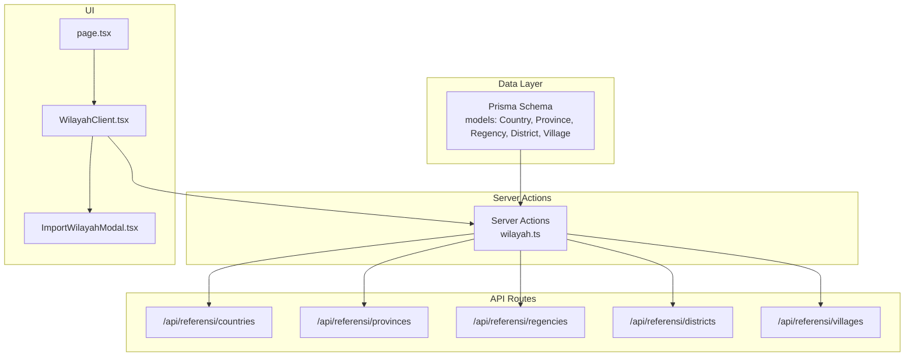
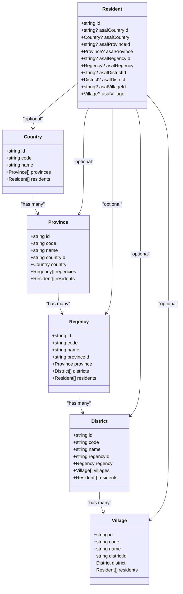
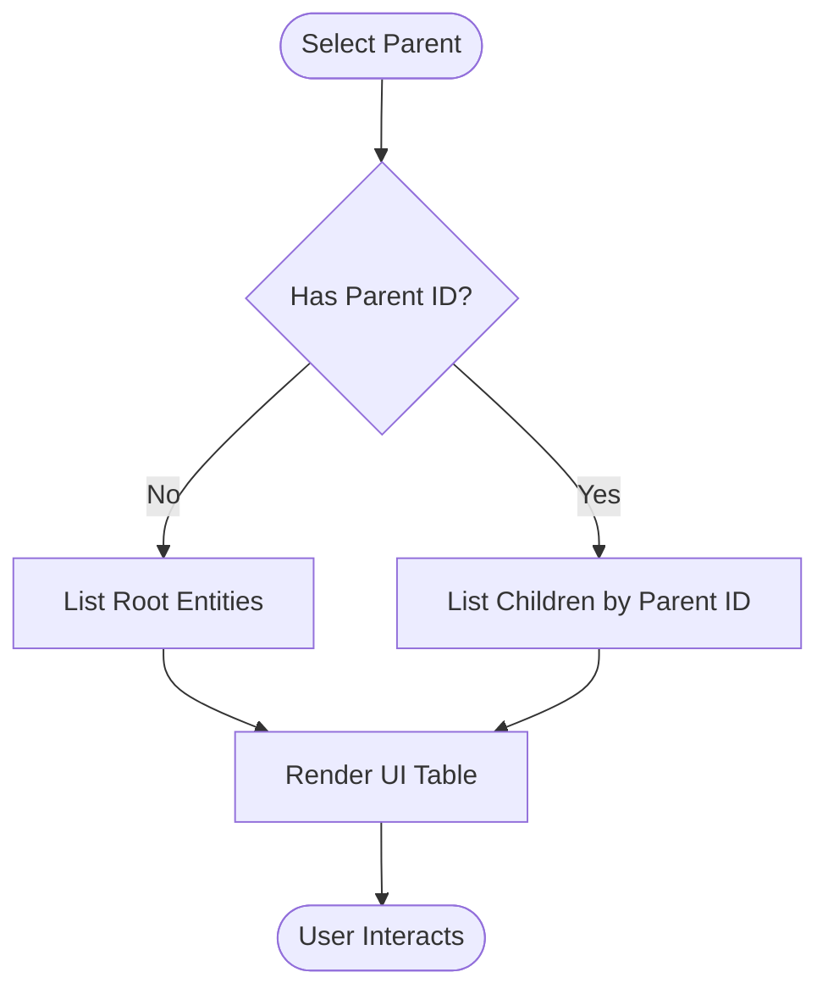
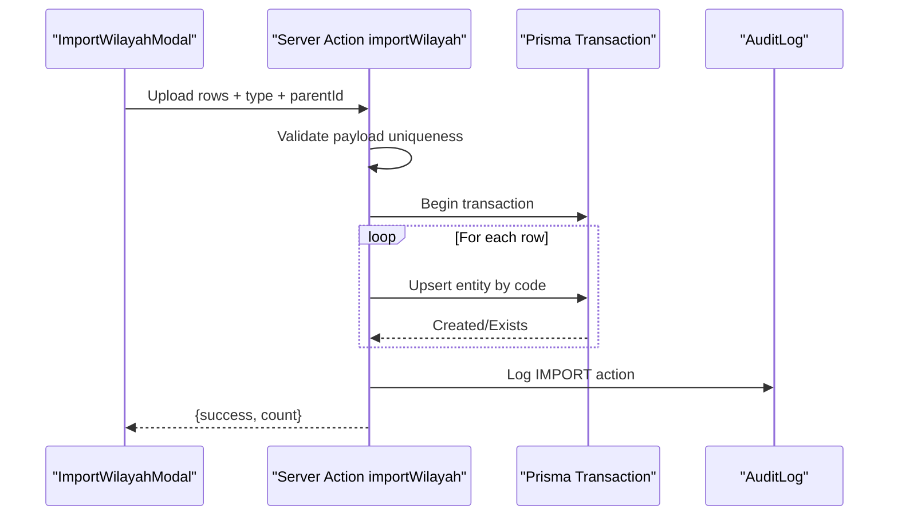
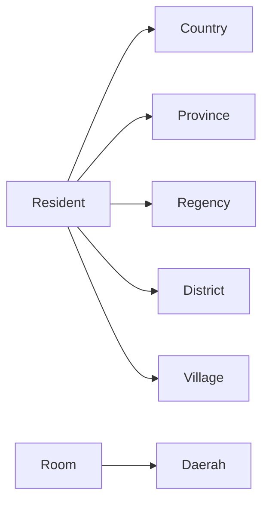
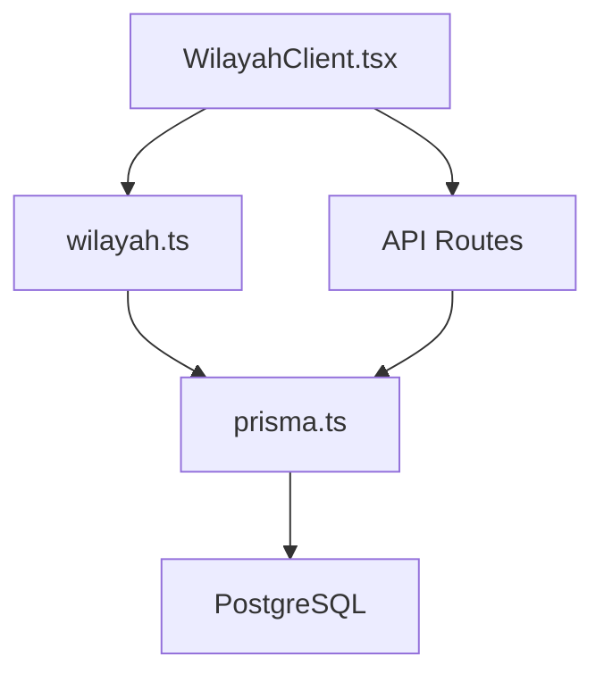

# Geographic Hierarchy

<cite>
**Referenced Files in This Document**
- [schema.prisma](file://prisma/schema.prisma)
- [wilayah.ts](file://src/app/actions/wilayah.ts)
- [countries/route.ts](file://src/app/api/referensi/countries/route.ts)
- [provinces/route.ts](file://src/app/api/referensi/provinces/route.ts)
- [regencies/route.ts](file://src/app/api/referensi/regencies/route.ts)
- [districts/route.ts](file://src/app/api/referensi/districts/route.ts)
- [villages/route.ts](file://src/app/api/referensi/villages/route.ts)
- [WilayahClient.tsx](file://src/components/dashboard/referensi/wilayah/WilayahClient.tsx)
- [ImportWilayahModal.tsx](file://src/components/dashboard/referensi/wilayah/ImportWilayahModal.tsx)
- [page.tsx](file://src/app/dashboard/referensi/wilayah/page.tsx)
- [prisma.ts](file://src/lib/prisma.ts)
- [types.ts](file://src/components/dashboard/residents/types.ts)
- [constants.ts](file://src/components/dashboard/residents/constants.ts)
</cite>

## Table of Contents
1. [Introduction](#introduction)
2. [Project Structure](#project-structure)
3. [Core Components](#core-components)
4. [Architecture Overview](#architecture-overview)
5. [Detailed Component Analysis](#detailed-component-analysis)
6. [Dependency Analysis](#dependency-analysis)
7. [Performance Considerations](#performance-considerations)
8. [Troubleshooting Guide](#troubleshooting-guide)
9. [Conclusion](#conclusion)
10. [Appendices](#appendices)

## Introduction
This document explains ApsAsrama’s geographic reference hierarchy and how geographic data supports resident origin tracking. It covers the Country, Province, Regency, District, and Village models, their hierarchical relationships, unique constraints, and how these geographic entities integrate with resident profiles and room allocations. It also documents query patterns, import mechanisms, and operational guidelines for managing reference data.

## Project Structure
The geographic hierarchy is defined in the Prisma schema and surfaced via server actions and API routes. The UI for managing reference data resides in the dashboard, while resident-related integrations are present in resident components and types.

**Diagram sources**
- [schema.prisma:380-453](file://prisma/schema.prisma#L380-L453)
- [wilayah.ts:27-326](file://src/app/actions/wilayah.ts#L27-L326)
- [countries/route.ts:1-29](file://src/app/api/referensi/countries/route.ts#L1-L29)
- [provinces/route.ts:1-32](file://src/app/api/referensi/provinces/route.ts#L1-L32)
- [regencies/route.ts:1-32](file://src/app/api/referensi/regencies/route.ts#L1-L32)
- [districts/route.ts:1-32](file://src/app/api/referensi/districts/route.ts#L1-L32)
- [villages/route.ts:1-32](file://src/app/api/referensi/villages/route.ts#L1-L32)
- [page.tsx:1-108](file://src/app/dashboard/referensi/wilayah/page.tsx#L1-L108)
- [WilayahClient.tsx:1-533](file://src/components/dashboard/referensi/wilayah/WilayahClient.tsx#L1-L533)
- [ImportWilayahModal.tsx:1-221](file://src/components/dashboard/referensi/wilayah/ImportWilayahModal.tsx#L1-L221)

**Section sources**
- [schema.prisma:380-453](file://prisma/schema.prisma#L380-L453)
- [wilayah.ts:27-326](file://src/app/actions/wilayah.ts#L27-L326)
- [page.tsx:1-108](file://src/app/dashboard/referensi/wilayah/page.tsx#L1-L108)
- [WilayahClient.tsx:1-533](file://src/components/dashboard/referensi/wilayah/WilayahClient.tsx#L1-L533)
- [ImportWilayahModal.tsx:1-221](file://src/components/dashboard/referensi/wilayah/ImportWilayahModal.tsx#L1-L221)

## Core Components
- Country: Top-level entity with unique code and name; links to Province.
- Province: Unique per country; links to Country; links to Regency.
- Regency: Unique per province; links to Province; links to District.
- District: Unique per regency; links to Regency; links to Village.
- Village: Unique per district; links to District; links to Resident.
- Resident: Optional foreign keys to Country, Province, Regency, District, Village for origin tracking.
- API routes: Read-only endpoints for cascading selection in UI.
- Server actions: CRUD operations with audit logging and permission checks.
- UI: Dashboard page, client component, and import modal for reference data management.

**Section sources**
- [schema.prisma:380-453](file://prisma/schema.prisma#L380-L453)
- [countries/route.ts:1-29](file://src/app/api/referensi/countries/route.ts#L1-L29)
- [provinces/route.ts:1-32](file://src/app/api/referensi/provinces/route.ts#L1-L32)
- [regencies/route.ts:1-32](file://src/app/api/referensi/regencies/route.ts#L1-L32)
- [districts/route.ts:1-32](file://src/app/api/referensi/districts/route.ts#L1-L32)
- [villages/route.ts:1-32](file://src/app/api/referensi/villages/route.ts#L1-L32)
- [wilayah.ts:27-326](file://src/app/actions/wilayah.ts#L27-L326)
- [WilayahClient.tsx:1-533](file://src/components/dashboard/referensi/wilayah/WilayahClient.tsx#L1-L533)
- [ImportWilayahModal.tsx:1-221](file://src/components/dashboard/referensi/wilayah/ImportWilayahModal.tsx#L1-L221)

## Architecture Overview
The geographic hierarchy follows a strict parent-child chain. Resident origin is captured via optional foreign keys to Country, Province, Regency, District, and Village. The UI fetches cascading lists via API endpoints, and server actions manage persistence with audit logs and permission enforcement.

**Diagram sources**
- [schema.prisma:380-453](file://prisma/schema.prisma#L380-L453)
- [schema.prisma:44-101](file://prisma/schema.prisma#L44-L101)

**Section sources**
- [schema.prisma:380-453](file://prisma/schema.prisma#L380-L453)
- [schema.prisma:44-101](file://prisma/schema.prisma#L44-L101)

## Detailed Component Analysis

### Geographic Models and Constraints
- Country
  - Unique constraints: code, name
  - Indexes: name
  - Relations: Province, Resident
- Province
  - Unique constraint: name+countryId
  - Unique: code
  - Indexes: name, countryId
  - Relations: Country, Regency, Resident
- Regency
  - Unique constraint: name+provinceId
  - Unique: code
  - Indexes: name, provinceId
  - Relations: Province, District, Resident
- District
  - Unique constraint: name+regencyId
  - Unique: code
  - Indexes: name, regencyId
  - Relations: Regency, Village, Resident
- Village
  - Unique constraint: name+districtId
  - Unique: code
  - Indexes: name, districtId
  - Relations: District, Resident

These constraints enforce referential integrity and prevent duplicate entries at the database level.

**Section sources**
- [schema.prisma:380-453](file://prisma/schema.prisma#L380-L453)

### Hierarchical Relationship Pattern
- Parent-to-child navigation is explicit via foreign keys.
- Cascading filters are supported in UI/API via parent ID parameters.
- Deletion cascades are configured in the schema for child entities.

**Diagram sources**
- [provinces/route.ts:9](file://src/app/api/referensi/provinces/route.ts#L9)
- [regencies/route.ts:9](file://src/app/api/referensi/regencies/route.ts#L9)
- [districts/route.ts:9](file://src/app/api/referensi/districts/route.ts#L9)
- [villages/route.ts:9](file://src/app/api/referensi/villages/route.ts#L9)

**Section sources**
- [provinces/route.ts:1-32](file://src/app/api/referensi/provinces/route.ts#L1-L32)
- [regencies/route.ts:1-32](file://src/app/api/referensi/regencies/route.ts#L1-L32)
- [districts/route.ts:1-32](file://src/app/api/referensi/districts/route.ts#L1-L32)
- [villages/route.ts:1-32](file://src/app/api/referensi/villages/route.ts#L1-L32)

### Geographic Queries and API Endpoints
- Countries: GET /api/referensi/countries?page=&search=
- Provinces: GET /api/referensi/provinces?countryId=&page=&search=
- Regencies: GET /api/referensi/regencies?provinceId=&page=&search=
- Districts: GET /api/referensi/districts?regencyId=&page=&search=
- Villages: GET /api/referensi/villages?districtId=&page=&search=

Each endpoint supports pagination and server-side search, returning structured JSON responses.

**Section sources**
- [countries/route.ts:1-29](file://src/app/api/referensi/countries/route.ts#L1-L29)
- [provinces/route.ts:1-32](file://src/app/api/referensi/provinces/route.ts#L1-L32)
- [regencies/route.ts:1-32](file://src/app/api/referensi/regencies/route.ts#L1-L32)
- [districts/route.ts:1-32](file://src/app/api/referensi/districts/route.ts#L1-L32)
- [villages/route.ts:1-32](file://src/app/api/referensi/villages/route.ts#L1-L32)

### Data Import Patterns for Reference Data
- Excel import via ImportWilayahModal reads XLSX sheets and maps columns to code and name.
- Validation ensures unique codes within the batch and required fields.
- Server action performs a transaction to insert records and logs the import event.
- Parent selection is enforced for non-root levels (e.g., selecting Country for Province).

**Diagram sources**
- [ImportWilayahModal.tsx:26-78](file://src/components/dashboard/referensi/wilayah/ImportWilayahModal.tsx#L26-L78)
- [wilayah.ts:270-325](file://src/app/actions/wilayah.ts#L270-L325)
- [schema.prisma:455-466](file://prisma/schema.prisma#L455-L466)

**Section sources**
- [ImportWilayahModal.tsx:1-221](file://src/components/dashboard/referensi/wilayah/ImportWilayahModal.tsx#L1-L221)
- [wilayah.ts:270-325](file://src/app/actions/wilayah.ts#L270-L325)

### Integration with Resident Profiles and Room Allocations
- Origin tracking: Resident model includes optional foreign keys to Country, Province, Regency, District, and Village, enabling precise origin attribution.
- UI integration: The dashboard page orchestrates data fetching for metrics, dropdowns, and paginated lists. The client component renders tables and modals for CRUD and import.
- Room allocation: Rooms are associated with a Daerah entity; while not directly tied to the geographic hierarchy, the UI surfaces metrics and filtering that complement geographic context.

**Diagram sources**
- [schema.prisma:44-101](file://prisma/schema.prisma#L44-L101)
- [schema.prisma:27-42](file://prisma/schema.prisma#L27-L42)
- [types.ts:13-42](file://src/components/dashboard/residents/types.ts#L13-L42)

**Section sources**
- [schema.prisma:44-101](file://prisma/schema.prisma#L44-L101)
- [page.tsx:15-107](file://src/app/dashboard/referensi/wilayah/page.tsx#L15-L107)
- [WilayahClient.tsx:1-533](file://src/components/dashboard/referensi/wilayah/WilayahClient.tsx#L1-L533)
- [types.ts:13-42](file://src/components/dashboard/residents/types.ts#L13-L42)

## Dependency Analysis
- UI depends on server actions for mutations and API routes for read-only cascading queries.
- Server actions depend on Prisma client and enforce permissions.
- Prisma client uses a PostgreSQL adapter with connection pooling.

**Diagram sources**
- [WilayahClient.tsx:1-533](file://src/components/dashboard/referensi/wilayah/WilayahClient.tsx#L1-L533)
- [wilayah.ts:1-326](file://src/app/actions/wilayah.ts#L1-L326)
- [prisma.ts:1-31](file://src/lib/prisma.ts#L1-L31)

**Section sources**
- [WilayahClient.tsx:1-533](file://src/components/dashboard/referensi/wilayah/WilayahClient.tsx#L1-L533)
- [wilayah.ts:1-326](file://src/app/actions/wilayah.ts#L1-L326)
- [prisma.ts:1-31](file://src/lib/prisma.ts#L1-L31)

## Performance Considerations
- Pagination: API endpoints and server actions use skip/take patterns to limit result sets.
- Indexes: Unique constraints and indexes on name and parent foreign keys optimize lookups.
- Transactions: Bulk imports use transactions to reduce overhead and maintain consistency.
- Connection pooling: Prisma adapter configures a small pool suitable for serverless environments.

[No sources needed since this section provides general guidance]

## Troubleshooting Guide
- Permission errors: Server actions check for specific permissions before mutating data; ensure the session has the required permission codes.
- Duplicate codes: Import validation rejects duplicate codes within a batch; ensure unique codes per upload.
- Missing parent selection: Import requires a parent ID for non-root levels; confirm the correct parent is selected.
- Audit logs: Import actions are logged; review audit logs for entity type and IDs to diagnose issues.

**Section sources**
- [wilayah.ts:270-325](file://src/app/actions/wilayah.ts#L270-L325)
- [schema.prisma:455-466](file://prisma/schema.prisma#L455-L466)

## Conclusion
The geographic hierarchy in ApsAsrama provides a robust, uniquely constrained foundation for administrative boundaries. Its integration with resident origin tracking and cascading UI/API enables efficient data management and accurate reporting. The import pipeline and audit logging support scalable maintenance of reference data.

[No sources needed since this section summarizes without analyzing specific files]

## Appendices

### Field Definitions and Unique Constraints Summary
- Country: code (unique), name (unique)
- Province: code (unique), name+countryId (unique), indexes(name, countryId)
- Regency: code (unique), name+provinceId (unique), indexes(name, provinceId)
- District: code (unique), name+regencyId (unique), indexes(name, regencyId)
- Village: code (unique), name+districtId (unique), indexes(name, districtId)

**Section sources**
- [schema.prisma:380-453](file://prisma/schema.prisma#L380-L453)