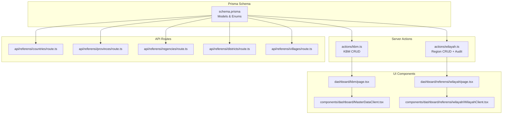
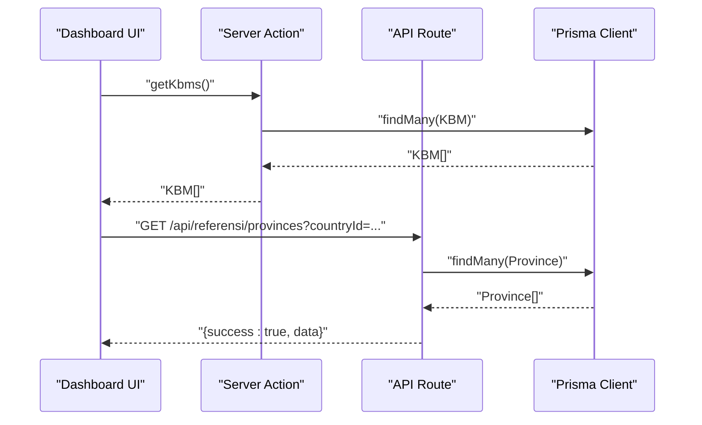
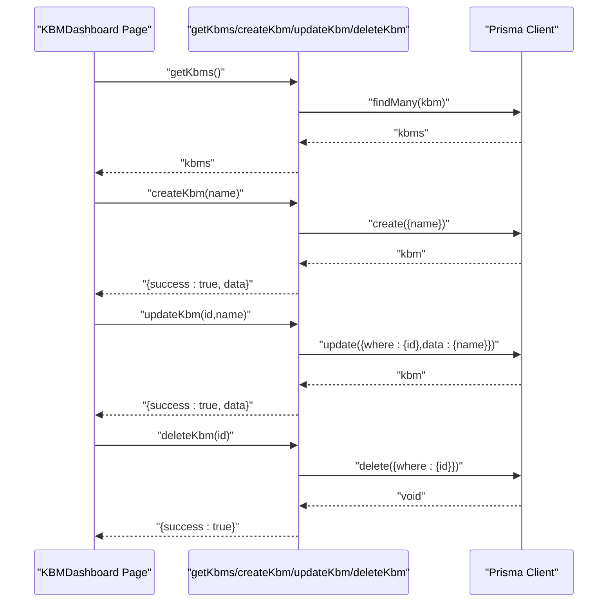
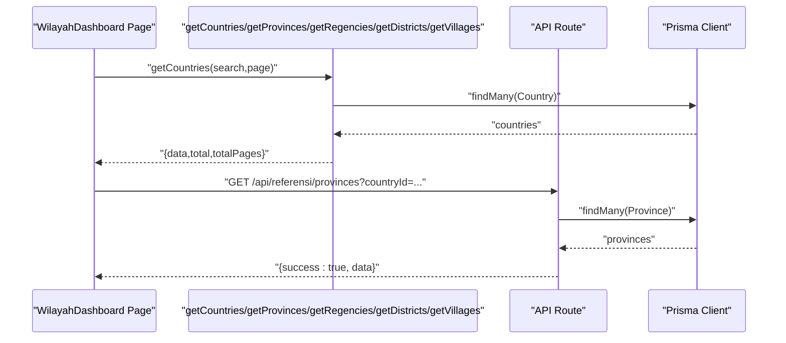
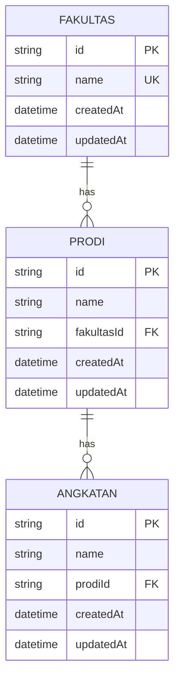
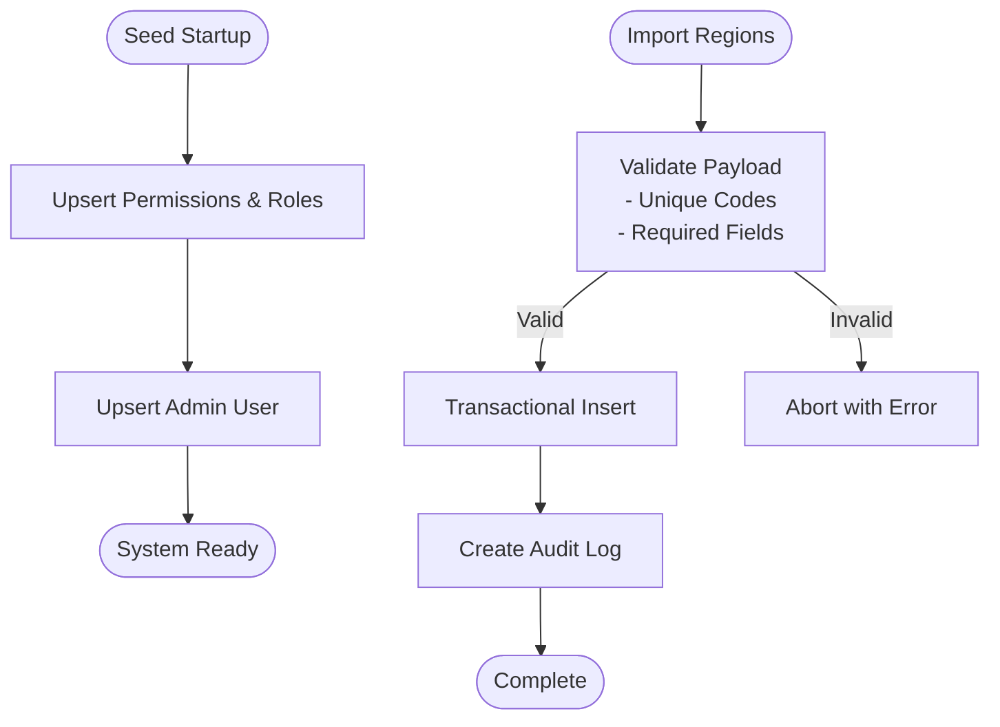
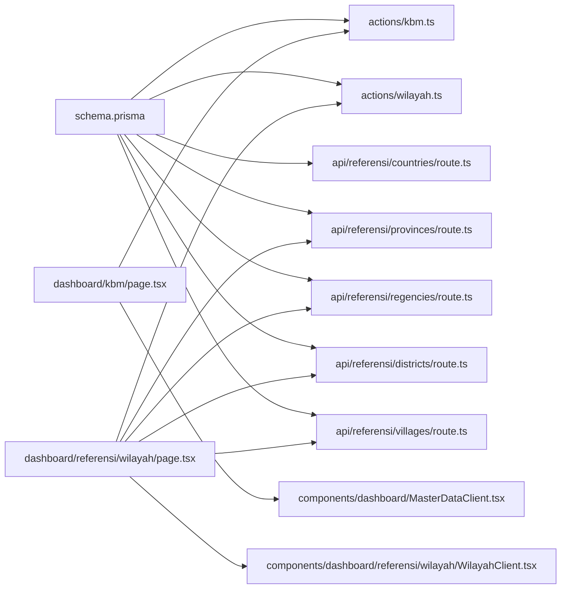

# Reference Data Entities

<cite>
**Referenced Files in This Document**
- [schema.prisma](file://prisma/schema.prisma)
- [seed.ts](file://prisma/seed.ts)
- [kbm.ts](file://src/app/actions/kbm.ts)
- [wilayah.ts](file://src/app/actions/wilayah.ts)
- [route.ts (countries)](file://src/app/api/referensi/countries/route.ts)
- [route.ts (provinces)](file://src/app/api/referensi/provinces/route.ts)
- [route.ts (regencies)](file://src/app/api/referensi/regencies/route.ts)
- [route.ts (districts)](file://src/app/api/referensi/districts/route.ts)
- [route.ts (villages)](file://src/app/api/referensi/villages/route.ts)
- [WilayahClient.tsx](file://src/components/dashboard/referensi/wilayah/WilayahClient.tsx)
- [page.tsx (KBM dashboard)](file://src/app/dashboard/kbm/page.tsx)
- [page.tsx (Wilayah dashboard)](file://src/app/dashboard/referensi/wilayah/page.tsx)
- [MasterDataClient.tsx](file://src/components/dashboard/MasterDataClient.tsx)
</cite>

## Table of Contents
1. [Introduction](#introduction)
2. [Project Structure](#project-structure)
3. [Core Components](#core-components)
4. [Architecture Overview](#architecture-overview)
5. [Detailed Component Analysis](#detailed-component-analysis)
6. [Dependency Analysis](#dependency-analysis)
7. [Performance Considerations](#performance-considerations)
8. [Troubleshooting Guide](#troubleshooting-guide)
9. [Conclusion](#conclusion)

## Introduction
This document describes the reference data entities that underpin ApsAsrama’s administrative and academic workflows. It focuses on:
- Kbm (Teaching Activity): a master lookup for activity names used in attendance systems
- Wilayah (Administrative Region): a hierarchical taxonomy of countries, provinces, regencies, districts, and villages
- Supporting lookup tables: Fakultas (Faculty), Prodi (Program Study), and Angkatan (Academic Cohort)
- Static reference data and seeding strategy
- How these entities integrate with UI components and business processes

These reference datasets are essential for accurate student registration, location-based room allocation, academic tracking, and auditability.

## Project Structure
The reference data spans the Prisma schema, server actions, API routes, and UI components:
- Prisma schema defines models, enums, and relationships
- Server actions encapsulate CRUD operations for reference entities
- API routes expose paginated, searchable endpoints for administrative regions
- UI components render reference data in dashboards and wizards

**Diagram sources**
- [schema.prisma](file://prisma/schema.prisma)
- [kbm.ts](file://src/app/actions/kbm.ts)
- [wilayah.ts](file://src/app/actions/wilayah.ts)
- [route.ts (countries)](file://src/app/api/referensi/countries/route.ts)
- [route.ts (provinces)](file://src/app/api/referensi/provinces/route.ts)
- [route.ts (regencies)](file://src/app/api/referensi/regencies/route.ts)
- [route.ts (districts)](file://src/app/api/referensi/districts/route.ts)
- [route.ts (villages)](file://src/app/api/referensi/villages/route.ts)
- [page.tsx (KBM dashboard)](file://src/app/dashboard/kbm/page.tsx)
- [page.tsx (Wilayah dashboard)](file://src/app/dashboard/referensi/wilayah/page.tsx)
- [MasterDataClient.tsx](file://src/components/dashboard/MasterDataClient.tsx)
- [WilayahClient.tsx](file://src/components/dashboard/referensi/wilayah/WilayahClient.tsx)

**Section sources**
- [schema.prisma](file://prisma/schema.prisma)
- [kbm.ts](file://src/app/actions/kbm.ts)
- [wilayah.ts](file://src/app/actions/wilayah.ts)
- [route.ts (countries)](file://src/app/api/referensi/countries/route.ts)
- [route.ts (provinces)](file://src/app/api/referensi/provinces/route.ts)
- [route.ts (regencies)](file://src/app/api/referensi/regencies/route.ts)
- [route.ts (districts)](file://src/app/api/referensi/districts/route.ts)
- [route.ts (villages)](file://src/app/api/referensi/villages/route.ts)
- [page.tsx (KBM dashboard)](file://src/app/dashboard/kbm/page.tsx)
- [page.tsx (Wilayah dashboard)](file://src/app/dashboard/referensi/wilayah/page.tsx)
- [MasterDataClient.tsx](file://src/components/dashboard/MasterDataClient.tsx)
- [WilayahClient.tsx](file://src/components/dashboard/referensi/wilayah/WilayahClient.tsx)

## Core Components
This section outlines the primary reference data entities and their roles.

- Kbm (Teaching Activity)
  - Purpose: Stores activity names used in attendance workflows
  - Model: Unique name field, auto-generated timestamps
  - Usage: Populates dropdowns in activity and attendance screens
  - Operations: List, create, update, delete via server action

- Wilayah (Administrative Region)
  - Purpose: Hierarchical geographic taxonomy
  - Models: Country → Province → Regency → District → Village
  - Relationships: Each child model references its parent
  - UI: Tabbed interface with search, pagination, and parent filters

- Supporting Lookup Tables
  - Fakultas (Faculty): Academic unit
  - Prodi (Program Study): Academic program linked to Faculty
  - Angkatan (Academic Cohort): Graduation cohort linked to Program Study
  - Usage: Student profile and academic tracking

- Static Reference Data and Seeding
  - RBAC permissions and roles are seeded at startup
  - Administrative region data is imported via bulk upload

**Section sources**
- [schema.prisma](file://prisma/schema.prisma)
- [kbm.ts](file://src/app/actions/kbm.ts)
- [page.tsx (KBM dashboard)](file://src/app/dashboard/kbm/page.tsx)
- [page.tsx (Wilayah dashboard)](file://src/app/dashboard/referensi/wilayah/page.tsx)
- [seed.ts](file://prisma/seed.ts)

## Architecture Overview
The reference data architecture follows a layered pattern:
- Data layer: Prisma models define entities and relationships
- Service layer: Server actions orchestrate reads/writes and enforce permissions
- API layer: REST-like endpoints expose paginated region data
- Presentation layer: UI dashboards and modals render and edit reference data

**Diagram sources**
- [kbm.ts](file://src/app/actions/kbm.ts)
- [route.ts (provinces)](file://src/app/api/referensi/provinces/route.ts)
- [schema.prisma](file://prisma/schema.prisma)

## Detailed Component Analysis

### Kbm (Teaching Activity)
Kbm serves as a controlled vocabulary for teaching activities and other asrama events. The UI leverages a reusable master data component to manage entries.

**Diagram sources**
- [page.tsx (KBM dashboard)](file://src/app/dashboard/kbm/page.tsx)
- [kbm.ts](file://src/app/actions/kbm.ts)
- [MasterDataClient.tsx](file://src/components/dashboard/MasterDataClient.tsx)

**Section sources**
- [schema.prisma](file://prisma/schema.prisma)
- [kbm.ts](file://src/app/actions/kbm.ts)
- [page.tsx (KBM dashboard)](file://src/app/dashboard/kbm/page.tsx)
- [MasterDataClient.tsx](file://src/components/dashboard/MasterDataClient.tsx)

### Wilayah (Administrative Region)
The administrative region hierarchy supports student origin tracking and room allocation. The UI provides tabbed navigation across Country, Province, Regency, District, and Village.

**Diagram sources**
- [page.tsx (Wilayah dashboard)](file://src/app/dashboard/referensi/wilayah/page.tsx)
- [wilayah.ts](file://src/app/actions/wilayah.ts)
- [route.ts (provinces)](file://src/app/api/referensi/provinces/route.ts)

**Section sources**
- [schema.prisma](file://prisma/schema.prisma)
- [wilayah.ts](file://src/app/actions/wilayah.ts)
- [route.ts (countries)](file://src/app/api/referensi/countries/route.ts)
- [route.ts (provinces)](file://src/app/api/referensi/provinces/route.ts)
- [route.ts (regencies)](file://src/app/api/referensi/regencies/route.ts)
- [route.ts (districts)](file://src/app/api/referensi/districts/route.ts)
- [route.ts (villages)](file://src/app/api/referensi/villages/route.ts)
- [page.tsx (Wilayah dashboard)](file://src/app/dashboard/referensi/wilayah/page.tsx)
- [WilayahClient.tsx](file://src/components/dashboard/referensi/wilayah/WilayahClient.tsx)

### Supporting Lookup Tables (Fakultas, Prodi, Angkatan)
These entities enable academic tracking and reporting:
- Fakultas: Academic unit with unique name
- Prodi: Program study linked to a faculty, with unique constraint on (name, fakultasId)
- Angkatan: Academic cohort linked to a program study, with unique constraint on (name, prodiId)

**Diagram sources**
- [schema.prisma](file://prisma/schema.prisma)

**Section sources**
- [schema.prisma](file://prisma/schema.prisma)

### Data Seeding and Reference Data Management
- RBAC seeding: Permissions and roles are upserted during seeding to establish baseline access controls
- Region import: Bulk import of administrative regions supports rapid onboarding of new areas
- Audit logging: All create/update/delete operations on regions are recorded for compliance

**Diagram sources**
- [seed.ts](file://prisma/seed.ts)
- [wilayah.ts](file://src/app/actions/wilayah.ts)

**Section sources**
- [seed.ts](file://prisma/seed.ts)
- [wilayah.ts](file://src/app/actions/wilayah.ts)

### Examples of Reference Data Usage in Business Processes
- Student Registration Wizard
  - Uses API endpoints to populate cascading region dropdowns (Country → Province → Regency → District)
  - Ensures accurate origin data capture and validation
- Attendance Systems
  - Kbm names feed dropdowns for activity selection in attendance creation
  - Muallim (teacher) records associate with Kbm to track sessions
- Reporting and Auditing
  - Audit logs record changes to administrative regions and other entities
  - Reports leverage region hierarchies and academic cohorts for filtering

[No sources needed since this section synthesizes usage patterns without quoting specific code]

## Dependency Analysis
The following diagram highlights key dependencies among reference data components:

**Diagram sources**
- [schema.prisma](file://prisma/schema.prisma)
- [kbm.ts](file://src/app/actions/kbm.ts)
- [wilayah.ts](file://src/app/actions/wilayah.ts)
- [route.ts (countries)](file://src/app/api/referensi/countries/route.ts)
- [route.ts (provinces)](file://src/app/api/referensi/provinces/route.ts)
- [route.ts (regencies)](file://src/app/api/referensi/regencies/route.ts)
- [route.ts (districts)](file://src/app/api/referensi/districts/route.ts)
- [route.ts (villages)](file://src/app/api/referensi/villages/route.ts)
- [page.tsx (KBM dashboard)](file://src/app/dashboard/kbm/page.tsx)
- [page.tsx (Wilayah dashboard)](file://src/app/dashboard/referensi/wilayah/page.tsx)
- [MasterDataClient.tsx](file://src/components/dashboard/MasterDataClient.tsx)
- [WilayahClient.tsx](file://src/components/dashboard/referensi/wilayah/WilayahClient.tsx)

**Section sources**
- [schema.prisma](file://prisma/schema.prisma)
- [kbm.ts](file://src/app/actions/kbm.ts)
- [wilayah.ts](file://src/app/actions/wilayah.ts)
- [route.ts (countries)](file://src/app/api/referensi/countries/route.ts)
- [route.ts (provinces)](file://src/app/api/referensi/provinces/route.ts)
- [route.ts (regencies)](file://src/app/api/referensi/regencies/route.ts)
- [route.ts (districts)](file://src/app/api/referensi/districts/route.ts)
- [route.ts (villages)](file://src/app/api/referensi/villages/route.ts)
- [page.tsx (KBM dashboard)](file://src/app/dashboard/kbm/page.tsx)
- [page.tsx (Wilayah dashboard)](file://src/app/dashboard/referensi/wilayah/page.tsx)
- [MasterDataClient.tsx](file://src/components/dashboard/MasterDataClient.tsx)
- [WilayahClient.tsx](file://src/components/dashboard/referensi/wilayah/WilayahClient.tsx)

## Performance Considerations
- Pagination and indexing
  - API routes use skip/take with reasonable limits to prevent large payloads
  - Prisma models include strategic indexes (e.g., name, code, foreign keys) to optimize lookups
- Client-side caching
  - Next.js revalidation paths trigger cache invalidation after CRUD operations
- Cascading region queries
  - UI components fetch dependent regions on demand to minimize initial load

[No sources needed since this section provides general guidance]

## Troubleshooting Guide
Common issues and resolutions:
- Duplicate Kbm names
  - Symptom: Creation fails with duplicate name
  - Resolution: Choose a unique name; server action validates uniqueness
- Region import errors
  - Symptom: Import aborts with “duplicate code” or “missing parent”
  - Resolution: Ensure unique codes within batch; select appropriate parent level
- Permission denied
  - Symptom: “Forbidden” thrown on region operations
  - Resolution: Verify user permissions for “Wilayah” module actions

**Section sources**
- [kbm.ts](file://src/app/actions/kbm.ts)
- [wilayah.ts](file://src/app/actions/wilayah.ts)

## Conclusion
ApsAsrama’s reference data layer consists of robust, hierarchical entities that power core workflows:
- Kbm enables standardized activity tracking
- Wilayah provides a scalable geographic taxonomy with auditability
- Supporting academic entities (Fakultas, Prodi, Angkatan) facilitate student lifecycle management

The combination of Prisma modeling, server actions, API endpoints, and UI components ensures maintainable, permission-aware, and user-friendly reference data management.