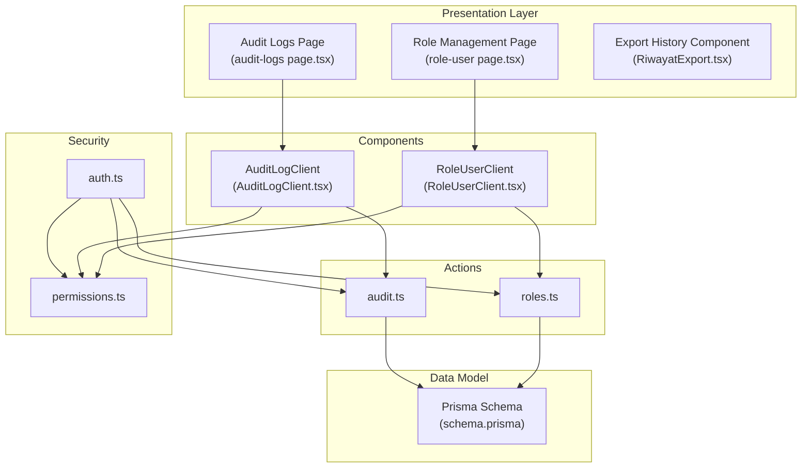
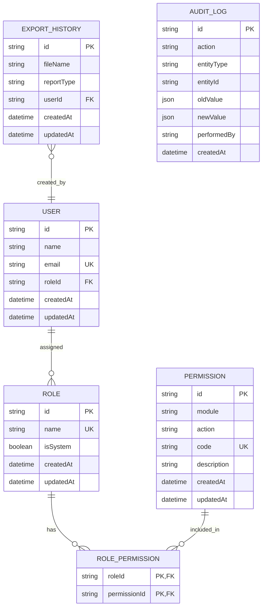
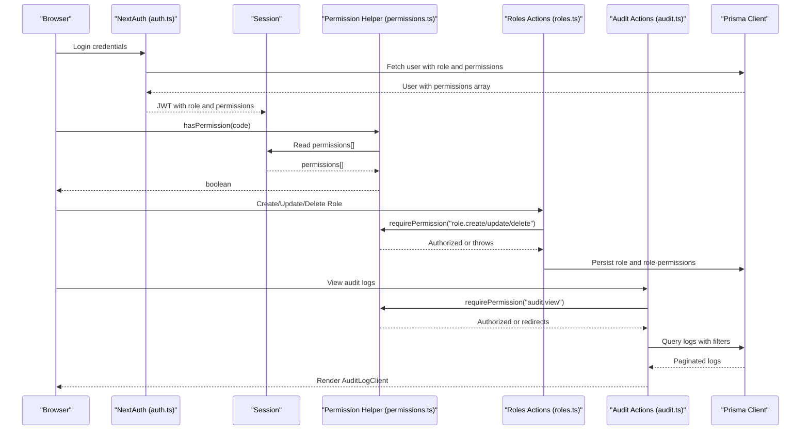
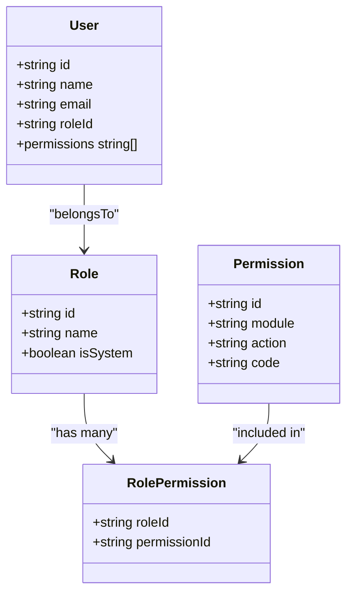
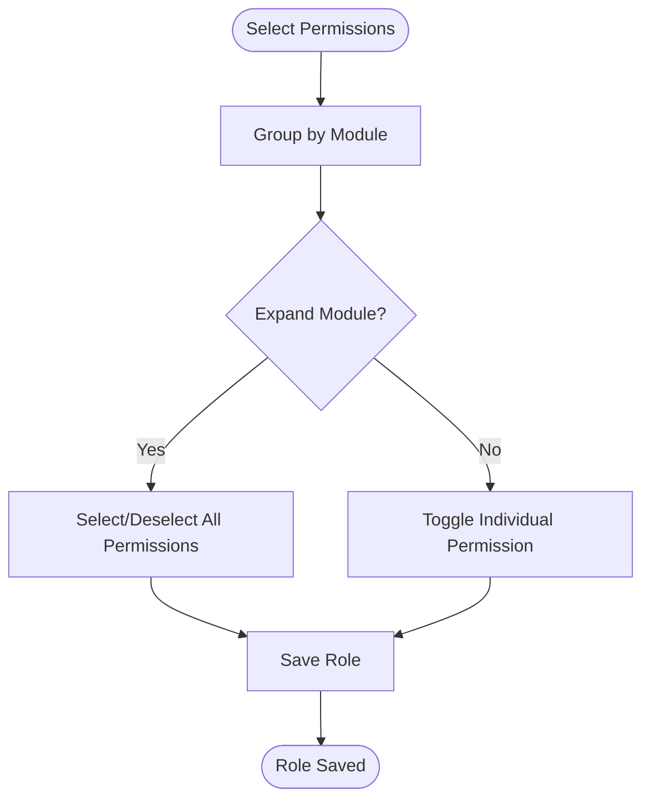
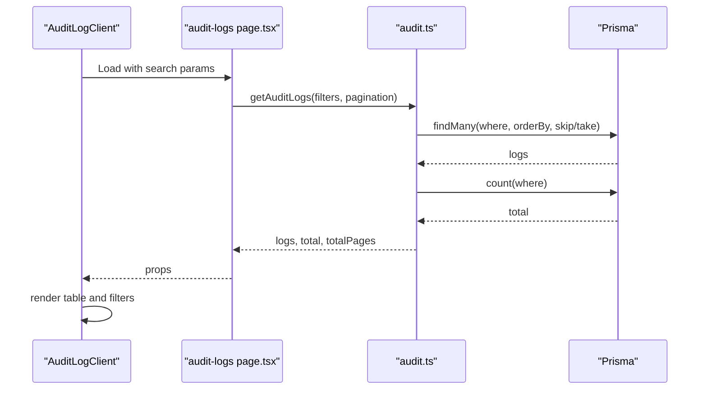
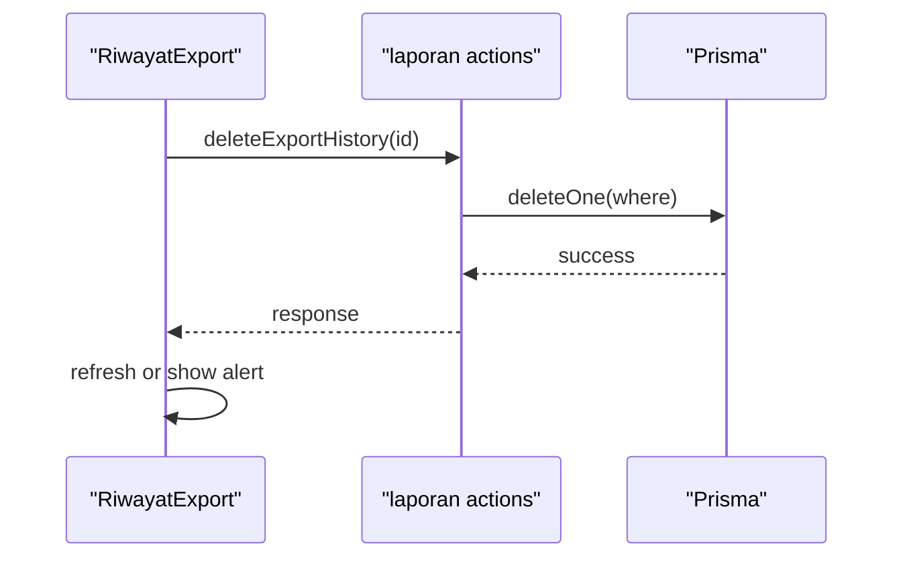
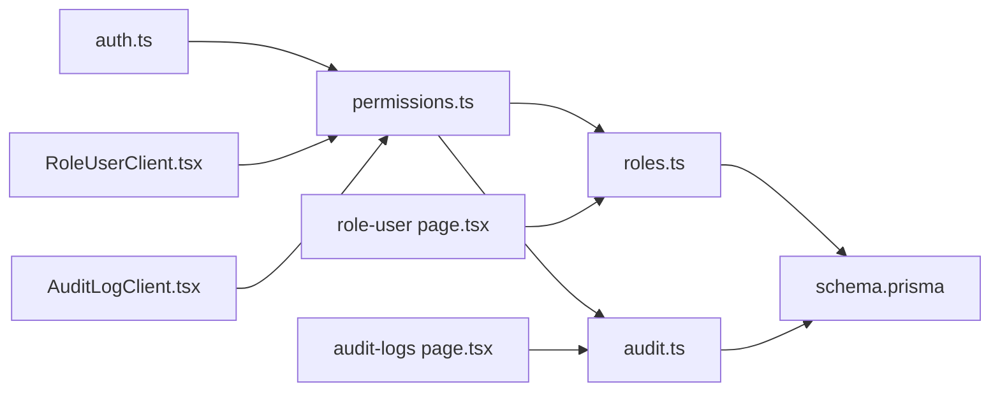

# System Support Entities

<cite>
**Referenced Files in This Document**
- [schema.prisma](file://prisma/schema.prisma)
- [permissions.ts](file://src/lib/permissions.ts)
- [auth.ts](file://src/lib/auth.ts)
- [roles.ts](file://src/app/actions/roles.ts)
- [audit.ts](file://src/app/actions/audit.ts)
- [seed-audit.ts](file://scripts/seed-audit.ts)
- [audit-logs page.tsx](file://src/app/dashboard/audit-logs/page.tsx)
- [AuditLogClient.tsx](file://src/components/dashboard/audit-log/AuditLogClient.tsx)
- [role-user page.tsx](file://src/app/dashboard/role-user/page.tsx)
- [RoleUserClient.tsx](file://src/components/dashboard/role-user/RoleUserClient.tsx)
- [RiwayatExport.tsx](file://src/components/dashboard/laporan/RiwayatExport.tsx)
- [residentExport.ts](file://src/utils/residentExport.ts)
- [upload route.ts](file://src/app/api/upload/route.ts)
</cite>

## Table of Contents
1. [Introduction](#introduction)
2. [Project Structure](#project-structure)
3. [Core Components](#core-components)
4. [Architecture Overview](#architecture-overview)
5. [Detailed Component Analysis](#detailed-component-analysis)
6. [Dependency Analysis](#dependency-analysis)
7. [Performance Considerations](#performance-considerations)
8. [Troubleshooting Guide](#troubleshooting-guide)
9. [Conclusion](#conclusion)

## Introduction
This document explains ApsAsrama’s system support entities and the underlying access control and audit mechanisms. It focuses on:
- Role, Permission, and RolePermission models and their relationships
- The permission-based access control system and how runtime checks are enforced
- Audit trail functionality for compliance and change tracking
- Export history system supporting data management workflows
- Practical examples of permission configurations and audit log analysis patterns

## Project Structure
The system is built with a layered architecture:
- Data modeling via Prisma schema defines entities and relationships
- Authentication and session management via NextAuth
- Permission enforcement helpers for server-side and client-side checks
- Action modules orchestrating CRUD operations with permission gating
- UI components rendering dashboards for roles, audit logs, and export history
- Utilities for exporting and printing reports

**Diagram sources**
- [role-user page.tsx:1-27](file://src/app/dashboard/role-user/page.tsx#L1-L27)
- [audit-logs page.tsx:1-50](file://src/app/dashboard/audit-logs/page.tsx#L1-L50)
- [RoleUserClient.tsx:1-294](file://src/components/dashboard/role-user/RoleUserClient.tsx#L1-L294)
- [AuditLogClient.tsx:1-410](file://src/components/dashboard/audit-log/AuditLogClient.tsx#L1-L410)
- [roles.ts:1-119](file://src/app/actions/roles.ts#L1-L119)
- [audit.ts:1-118](file://src/app/actions/audit.ts#L1-L118)
- [permissions.ts:1-21](file://src/lib/permissions.ts#L1-L21)
- [auth.ts:1-81](file://src/lib/auth.ts#L1-L81)
- [schema.prisma:165-193](file://prisma/schema.prisma#L165-L193)

**Section sources**
- [role-user page.tsx:1-27](file://src/app/dashboard/role-user/page.tsx#L1-L27)
- [audit-logs page.tsx:1-50](file://src/app/dashboard/audit-logs/page.tsx#L1-L50)
- [RoleUserClient.tsx:1-294](file://src/components/dashboard/role-user/RoleUserClient.tsx#L1-L294)
- [AuditLogClient.tsx:1-410](file://src/components/dashboard/audit-log/AuditLogClient.tsx#L1-L410)
- [roles.ts:1-119](file://src/app/actions/roles.ts#L1-L119)
- [audit.ts:1-118](file://src/app/actions/audit.ts#L1-L118)
- [permissions.ts:1-21](file://src/lib/permissions.ts#L1-L21)
- [auth.ts:1-81](file://src/lib/auth.ts#L1-L81)
- [schema.prisma:165-193](file://prisma/schema.prisma#L165-L193)

## Core Components
This section documents the core entities and their relationships, focusing on Role, Permission, RolePermission, ExportHistory, and AuditLog.

- Role
  - Unique name, optional system flag, timestamps, and relationships to users and role-permission mappings
- Permission
  - Module and action descriptors, unique code, optional description, and reverse relationship to role-permission mappings
- RolePermission
  - Composite primary key linking roles to permissions
- ExportHistory
  - Tracks exported files with filename, report type, creator, and timestamps
- AuditLog
  - Captures entity changes with action, entity type and ID, old/new values, and performed-by identity

**Diagram sources**
- [schema.prisma:165-193](file://prisma/schema.prisma#L165-L193)
- [schema.prisma:367-378](file://prisma/schema.prisma#L367-L378)
- [schema.prisma:455-466](file://prisma/schema.prisma#L455-L466)
- [schema.prisma:10-25](file://prisma/schema.prisma#L10-L25)

**Section sources**
- [schema.prisma:165-193](file://prisma/schema.prisma#L165-L193)
- [schema.prisma:367-378](file://prisma/schema.prisma#L367-L378)
- [schema.prisma:455-466](file://prisma/schema.prisma#L455-L466)
- [schema.prisma:10-25](file://prisma/schema.prisma#L10-L25)

## Architecture Overview
The system enforces role-based access control (RBAC) and maintains audit trails for compliance. Authentication resolves user identity, role, and permissions into the session. Permission checks gate access to sensitive operations. Audit logs record changes to entities. Export history tracks generated reports.

**Diagram sources**
- [auth.ts:1-81](file://src/lib/auth.ts#L1-L81)
- [permissions.ts:1-21](file://src/lib/permissions.ts#L1-L21)
- [roles.ts:1-119](file://src/app/actions/roles.ts#L1-L119)
- [audit.ts:1-118](file://src/app/actions/audit.ts#L1-L118)
- [audit-logs page.tsx:1-50](file://src/app/dashboard/audit-logs/page.tsx#L1-L50)

## Detailed Component Analysis

### Role-Based Access Control (RBAC)
- Authentication pipeline loads user with role and permissions into the session
- Permission checks are available server-side and client-side
- Role management actions enforce permissions before allowing changes
- System roles and SUPER_ADMIN safeguards prevent unauthorized modifications

**Diagram sources**
- [auth.ts:19-49](file://src/lib/auth.ts#L19-L49)
- [schema.prisma:165-193](file://prisma/schema.prisma#L165-L193)

Key implementation references:
- Session population with permissions: [auth.ts:19-49](file://src/lib/auth.ts#L19-L49)
- Server-side permission checks: [permissions.ts:4-9](file://src/lib/permissions.ts#L4-L9)
- Role management actions and permission gating: [roles.ts:7-27](file://src/app/actions/roles.ts#L7-L27), [roles.ts:41-64](file://src/app/actions/roles.ts#L41-L64), [roles.ts:66-102](file://src/app/actions/roles.ts#L66-L102), [roles.ts:104-118](file://src/app/actions/roles.ts#L104-L118)
- Role management page permission checks: [role-user page.tsx:15-18](file://src/app/dashboard/role-user/page.tsx#L15-L18)

**Section sources**
- [auth.ts:19-49](file://src/lib/auth.ts#L19-L49)
- [permissions.ts:4-9](file://src/lib/permissions.ts#L4-L9)
- [roles.ts:7-27](file://src/app/actions/roles.ts#L7-L27)
- [roles.ts:41-64](file://src/app/actions/roles.ts#L41-L64)
- [roles.ts:66-102](file://src/app/actions/roles.ts#L66-L102)
- [roles.ts:104-118](file://src/app/actions/roles.ts#L104-L118)
- [role-user page.tsx:15-18](file://src/app/dashboard/role-user/page.tsx#L15-L18)

### Permission Matrix and Configuration Examples
- Permissions are grouped by module and action (e.g., View, Create, Update, Delete, Export)
- RoleUserClient renders a hierarchical permission tree for selection during role creation/edit
- Example permission codes include “audit.view” and typical CRUD-style codes derived from module.action

**Diagram sources**
- [RoleUserClient.tsx:36-45](file://src/components/dashboard/role-user/RoleUserClient.tsx#L36-L45)
- [RoleUserClient.tsx:58-76](file://src/components/dashboard/role-user/RoleUserClient.tsx#L58-L76)
- [RoleUserClient.tsx:214-269](file://src/components/dashboard/role-user/RoleUserClient.tsx#L214-L269)

Practical examples:
- Granting audit viewing: see [seed-audit.ts:14-31](file://scripts/seed-audit.ts#L14-L31)
- Enforcing role management permissions: see [roles.ts:8-10](file://src/app/actions/roles.ts#L8-L10), [roles.ts:42-44](file://src/app/actions/roles.ts#L42-L44), [roles.ts:67-69](file://src/app/actions/roles.ts#L67-L69), [roles.ts:105-107](file://src/app/actions/roles.ts#L105-L107)

**Section sources**
- [RoleUserClient.tsx:36-45](file://src/components/dashboard/role-user/RoleUserClient.tsx#L36-L45)
- [RoleUserClient.tsx:58-76](file://src/components/dashboard/role-user/RoleUserClient.tsx#L58-L76)
- [RoleUserClient.tsx:214-269](file://src/components/dashboard/role-user/RoleUserClient.tsx#L214-L269)
- [seed-audit.ts:14-31](file://scripts/seed-audit.ts#L14-L31)
- [roles.ts:8-10](file://src/app/actions/roles.ts#L8-L10)
- [roles.ts:42-44](file://src/app/actions/roles.ts#L42-L44)
- [roles.ts:67-69](file://src/app/actions/roles.ts#L67-L69)
- [roles.ts:105-107](file://src/app/actions/roles.ts#L105-L107)

### Audit Trail Functionality
- AuditLog captures CREATE, UPDATE, DELETE, IMPORT actions across entities
- Filtering by action, entity type, performed-by, and date range
- Full-text search across JSON oldValue/newValue, entity ID, and performed-by
- Client-side UI renders actionable labels, entity labels, and changed fields for updates

**Diagram sources**
- [audit-logs page.tsx:25-47](file://src/app/dashboard/audit-logs/page.tsx#L25-L47)
- [audit.ts:36-98](file://src/app/actions/audit.ts#L36-L98)
- [AuditLogClient.tsx:139-158](file://src/components/dashboard/audit-log/AuditLogClient.tsx#L139-L158)

Operational highlights:
- Authorization for audit viewing: [audit.ts:38-41](file://src/app/actions/audit.ts#L38-L41), [audit-logs page.tsx:22-23](file://src/app/dashboard/audit-logs/page.tsx#L22-L23)
- Filtering and pagination: [audit.ts:47-72](file://src/app/actions/audit.ts#L47-L72)
- In-memory JSON search: [audit.ts:74-84](file://src/app/actions/audit.ts#L74-L84)
- Client-side parsing of changed fields for UPDATE entries: [AuditLogClient.tsx:95-103](file://src/components/dashboard/audit-log/AuditLogClient.tsx#L95-L103)

**Section sources**
- [audit.ts:36-98](file://src/app/actions/audit.ts#L36-L98)
- [audit-logs page.tsx:22-23](file://src/app/dashboard/audit-logs/page.tsx#L22-L23)
- [AuditLogClient.tsx:95-103](file://src/components/dashboard/audit-log/AuditLogClient.tsx#L95-L103)
- [AuditLogClient.tsx:139-158](file://src/components/dashboard/audit-log/AuditLogClient.tsx#L139-L158)

### Export History System
- ExportHistory records filenames, report types, creators, and timestamps
- UI displays export history with file-type icons and deletion capability
- Utility functions support CSV generation and PDF printing for resident reports
- Cloudinary upload endpoint enables storing generated artifacts externally

**Diagram sources**
- [RiwayatExport.tsx:18-27](file://src/components/dashboard/laporan/RiwayatExport.tsx#L18-L27)
- [residentExport.ts:6-31](file://src/utils/residentExport.ts#L6-L31)
- [residentExport.ts:44-122](file://src/utils/residentExport.ts#L44-L122)
- [upload route.ts:12-36](file://src/app/api/upload/route.ts#L12-L36)

Notes:
- Download regeneration is currently placeholder; requires external storage configuration
- Cloudinary integration demonstrates artifact storage pattern

**Section sources**
- [RiwayatExport.tsx:18-27](file://src/components/dashboard/laporan/RiwayatExport.tsx#L18-L27)
- [residentExport.ts:6-31](file://src/utils/residentExport.ts#L6-L31)
- [residentExport.ts:44-122](file://src/utils/residentExport.ts#L44-L122)
- [upload route.ts:12-36](file://src/app/api/upload/route.ts#L12-L36)

## Dependency Analysis
- Authentication depends on Prisma to load user, role, and permissions
- Permission helpers depend on the session to evaluate access
- Actions depend on permission helpers and Prisma to enforce RBAC and persist changes
- UI components depend on actions and permission helpers to render and operate securely

**Diagram sources**
- [auth.ts:1-81](file://src/lib/auth.ts#L1-L81)
- [permissions.ts:1-21](file://src/lib/permissions.ts#L1-L21)
- [roles.ts:1-119](file://src/app/actions/roles.ts#L1-L119)
- [audit.ts:1-118](file://src/app/actions/audit.ts#L1-L118)
- [role-user page.tsx:1-27](file://src/app/dashboard/role-user/page.tsx#L1-L27)
- [audit-logs page.tsx:1-50](file://src/app/dashboard/audit-logs/page.tsx#L1-L50)
- [RoleUserClient.tsx:1-294](file://src/components/dashboard/role-user/RoleUserClient.tsx#L1-L294)
- [AuditLogClient.tsx:1-410](file://src/components/dashboard/audit-log/AuditLogClient.tsx#L1-L410)
- [schema.prisma:165-193](file://prisma/schema.prisma#L165-L193)

**Section sources**
- [auth.ts:1-81](file://src/lib/auth.ts#L1-L81)
- [permissions.ts:1-21](file://src/lib/permissions.ts#L1-L21)
- [roles.ts:1-119](file://src/app/actions/roles.ts#L1-L119)
- [audit.ts:1-118](file://src/app/actions/audit.ts#L1-L118)
- [role-user page.tsx:1-27](file://src/app/dashboard/role-user/page.tsx#L1-L27)
- [audit-logs page.tsx:1-50](file://src/app/dashboard/audit-logs/page.tsx#L1-L50)
- [RoleUserClient.tsx:1-294](file://src/components/dashboard/role-user/RoleUserClient.tsx#L1-L294)
- [AuditLogClient.tsx:1-410](file://src/components/dashboard/audit-log/AuditLogClient.tsx#L1-L410)
- [schema.prisma:165-193](file://prisma/schema.prisma#L165-L193)

## Performance Considerations
- Indexes on frequently queried fields (e.g., AuditLog entity type and ID, ExportHistory user and createdAt) improve filtering and pagination performance
- Pagination with skip/take prevents loading large datasets
- Client-side JSON search is applied after fetching paginated logs; consider database-side JSON search for very large datasets
- Role and permission loading is optimized by joining relations in the authentication callback

[No sources needed since this section provides general guidance]

## Troubleshooting Guide
Common issues and resolutions:
- Unauthorized access to audit logs
  - Ensure the user has the “audit.view” permission and that the page checks are in place
  - References: [audit.ts:38-41](file://src/app/actions/audit.ts#L38-L41), [audit-logs page.tsx:22-23](file://src/app/dashboard/audit-logs/page.tsx#L22-L23)
- Role modification blocked
  - SUPER_ADMIN restrictions and system role protections prevent direct edits
  - References: [roles.ts:73-77](file://src/app/actions/roles.ts#L73-L77), [roles.ts:109-112](file://src/app/actions/roles.ts#L109-L112)
- Permission not taking effect
  - Verify permission code exists and is assigned to the role; seed script demonstrates upsert and assignment
  - References: [seed-audit.ts:14-31](file://scripts/seed-audit.ts#L14-L31)
- Export history deletion errors
  - Confirm the record exists and the current user has permission; UI triggers action and handles errors
  - References: [RiwayatExport.tsx:18-27](file://src/components/dashboard/laporan/RiwayatExport.tsx#L18-L27)

**Section sources**
- [audit.ts:38-41](file://src/app/actions/audit.ts#L38-L41)
- [audit-logs page.tsx:22-23](file://src/app/dashboard/audit-logs/page.tsx#L22-L23)
- [roles.ts:73-77](file://src/app/actions/roles.ts#L73-L77)
- [roles.ts:109-112](file://src/app/actions/roles.ts#L109-L112)
- [seed-audit.ts:14-31](file://scripts/seed-audit.ts#L14-L31)
- [RiwayatExport.tsx:18-27](file://src/components/dashboard/laporan/RiwayatExport.tsx#L18-L27)

## Conclusion
ApsAsrama’s system support entities form a robust foundation for access control, compliance, and operational reporting:
- RBAC ensures least-privilege access through modular permissions
- Audit logs provide comprehensive change tracking for compliance needs
- Export history supports data lifecycle management and reporting workflows
- The architecture balances security, usability, and scalability