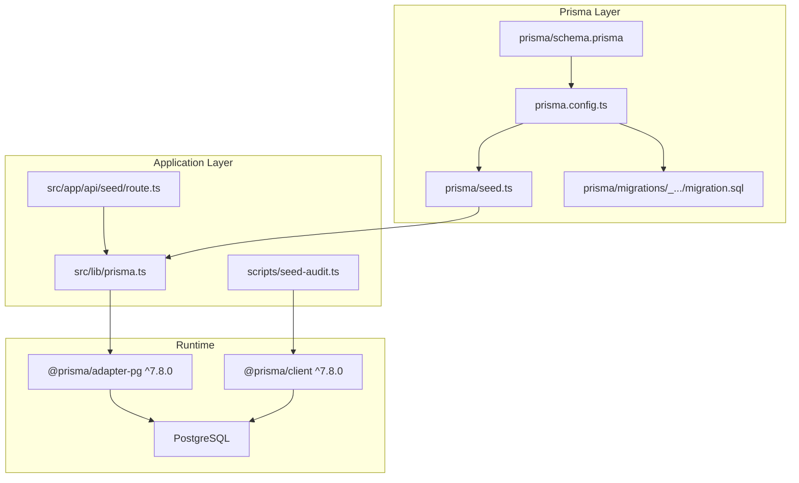
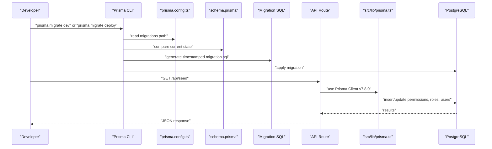
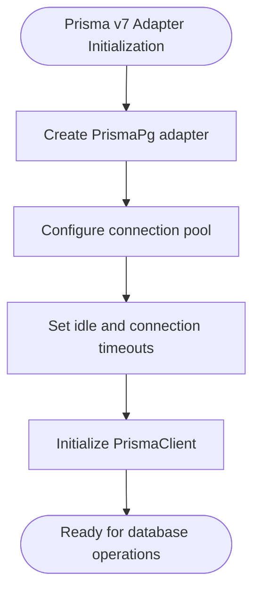
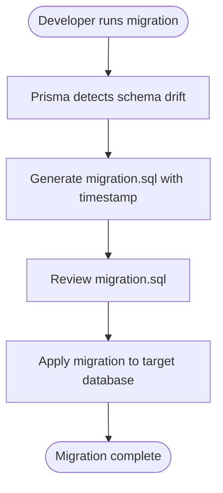
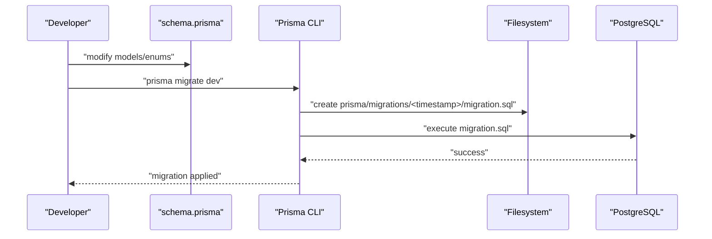
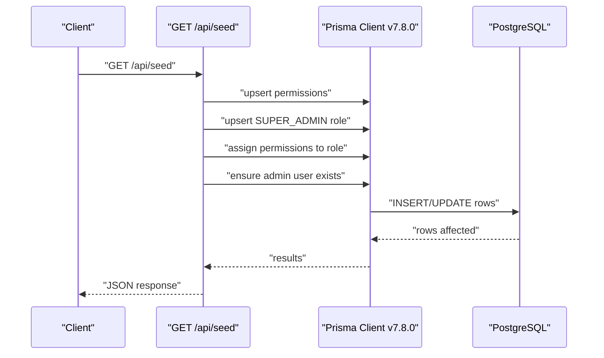
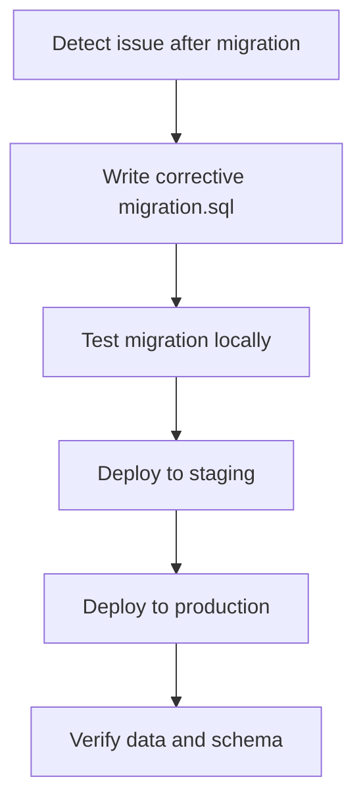
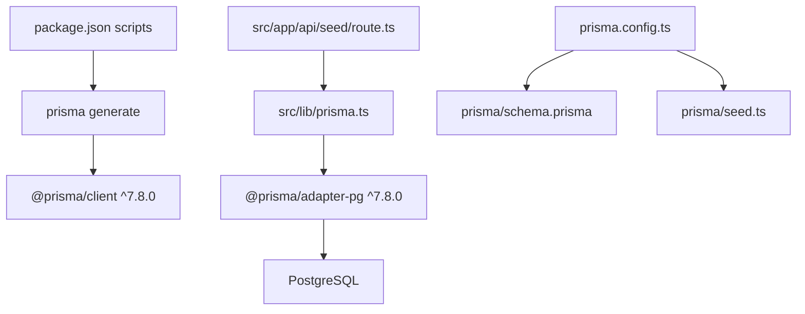

# Migration Management

<cite>
**Referenced Files in This Document**
- [schema.prisma](file://prisma/schema.prisma)
- [seed.ts](file://prisma/seed.ts)
- [prisma.ts](file://src/lib/prisma.ts)
- [seed-audit.ts](file://scripts/seed-audit.ts)
- [route.ts](file://src/app/api/seed/route.ts)
- [prisma.config.ts](file://prisma.config.ts)
- [package.json](file://package.json)
- [migration.sql](file://prisma/migrations/202606230001_make_resident_nim_optional/migration.sql)
- [drop_type.sql](file://drop_type.sql)
</cite>

## Update Summary
**Changes Made**
- Updated Prisma v7 adapter initialization section to reflect new adapter pattern
- Added documentation for schema field reorganization improvements
- Removed references to driverAdapters preview feature
- Enhanced adapter configuration documentation with new connection pooling options
- Updated Prisma version information to v7.8.0

## Table of Contents
1. [Introduction](#introduction)
2. [Project Structure](#project-structure)
3. [Core Components](#core-components)
4. [Architecture Overview](#architecture-overview)
5. [Detailed Component Analysis](#detailed-component-analysis)
6. [Dependency Analysis](#dependency-analysis)
7. [Performance Considerations](#performance-considerations)
8. [Troubleshooting Guide](#troubleshooting-guide)
9. [Conclusion](#conclusion)
10. [Appendices](#appendices)

## Introduction
This document explains how ApsAsrama manages database migrations and seeds using Prisma v7. It covers the migration workflow, creation process, deployment strategies, file structure, timestamp-based ordering, rollback procedures, and seed data management. It also includes best practices for version control, production deployments, rollback scenarios, data preservation strategies, and troubleshooting techniques.

## Project Structure
The migration and seeding system centers around the Prisma schema, configuration, and seed scripts. Migrations are stored under a timestamped folder structure, and seed scripts populate initial data such as permissions, roles, and users.

**Diagram sources**
- [prisma.config.ts:1-16](file://prisma.config.ts#L1-L16)
- [schema.prisma:1-477](file://prisma/schema.prisma#L1-L477)
- [seed.ts:1-174](file://prisma/seed.ts#L1-L174)
- [prisma.ts:1-29](file://src/lib/prisma.ts#L1-L29)
- [route.ts:1-183](file://src/app/api/seed/route.ts#L1-L183)
- [seed-audit.ts:1-42](file://scripts/seed-audit.ts#L1-L42)
- [migration.sql:1-2](file://prisma/migrations/202606230001_make_resident_nim_optional/migration.sql#L1-L2)

**Section sources**
- [prisma.config.ts:1-16](file://prisma.config.ts#L1-L16)
- [schema.prisma:1-477](file://prisma/schema.prisma#L1-L477)
- [prisma.ts:1-29](file://src/lib/prisma.ts#L1-L29)
- [seed.ts:1-174](file://prisma/seed.ts#L1-L174)
- [route.ts:1-183](file://src/app/api/seed/route.ts#L1-L183)
- [seed-audit.ts:1-42](file://scripts/seed-audit.ts#L1-L42)
- [package.json:1-48](file://package.json#L1-L48)

## Core Components
- **Prisma Schema**: Defines models, enums, relations, and indexes. It is the source of truth for database structure.
- **Prisma Config**: Declares schema location, migration path, and seed command.
- **Migration Files**: Timestamped SQL scripts representing incremental changes.
- **Seed Scripts**: Populate initial data (RBAC, roles, users) via Prisma Client or direct SQL.
- **Application Integration**: API route exposes seeding for runtime environments; library configures Prisma adapter for PostgreSQL.

Key responsibilities:
- schema.prisma: Model definitions and constraints.
- prisma.config.ts: Migration and seed configuration.
- prisma/seed.ts: Initial RBAC and admin user seeding.
- src/app/api/seed/route.ts: HTTP endpoint to seed data at runtime.
- src/lib/prisma.ts: Prisma client with PostgreSQL adapter v7.8.0.
- scripts/seed-audit.ts: Specialized seed script for audit permission.

**Section sources**
- [schema.prisma:1-477](file://prisma/schema.prisma#L1-L477)
- [prisma.config.ts:1-16](file://prisma.config.ts#L1-L16)
- [seed.ts:1-174](file://prisma/seed.ts#L1-L174)
- [route.ts:1-183](file://src/app/api/seed/route.ts#L1-L183)
- [prisma.ts:1-29](file://src/lib/prisma.ts#L1-L29)
- [seed-audit.ts:1-42](file://scripts/seed-audit.ts#L1-L42)

## Architecture Overview
The migration and seeding pipeline connects developer actions (schema changes) with runtime operations (seeding and migrations) and the database.

**Diagram sources**
- [prisma.config.ts:1-16](file://prisma.config.ts#L1-L16)
- [schema.prisma:1-477](file://prisma/schema.prisma#L1-L477)
- [migration.sql:1-2](file://prisma/migrations/202606230001_make_resident_nim_optional/migration.sql#L1-L2)
- [route.ts:1-183](file://src/app/api/seed/route.ts#L1-L183)
- [prisma.ts:1-29](file://src/lib/prisma.ts#L1-L29)

## Detailed Component Analysis

### Prisma v7 Adapter Initialization
**Updated** The Prisma v7 adapter initialization has been updated to use the new adapter pattern with enhanced connection pooling capabilities.

The Prisma v7 adapter provides improved performance and reliability through:
- **Connection Pooling**: Configurable pool size with max connections per serverless instance
- **Timeout Management**: Customizable idle and connection timeouts
- **Direct Connection**: Uses connection string directly instead of separate pool configuration
- **Enhanced Stability**: Better error handling and resource management

**Diagram sources**
- [prisma.ts:9-15](file://src/lib/prisma.ts#L9-L15)

**Section sources**
- [prisma.ts:1-29](file://src/lib/prisma.ts#L1-L29)
- [package.json:13-14](file://package.json#L13-L14)

### Migration File Structure and Timestamp Ordering
- **Location**: prisma/migrations/<timestamp>_.../
- **Naming convention**: timestamp followed by a human-readable label (e.g., 202606230001_make_resident_nim_optional).
- **Content**: Single migration.sql containing SQL statements to alter the database schema.
- **Example**: A migration adjusts column nullability for a model field.

**Diagram sources**
- [prisma.config.ts:1-16](file://prisma.config.ts#L1-L16)
- [migration.sql:1-2](file://prisma/migrations/202606230001_make_resident_nim_optional/migration.sql#L1-L2)

**Section sources**
- [prisma.config.ts:1-16](file://prisma.config.ts#L1-L16)
- [migration.sql:1-2](file://prisma/migrations/202606230001_make_resident_nim_optional/migration.sql#L1-L2)

### Migration Creation Workflow
- Edit schema.prisma to introduce changes (add fields, modify constraints, add models).
- Run Prisma CLI to create and apply migrations.
- Commit migration files to version control.

**Diagram sources**
- [schema.prisma:1-477](file://prisma/schema.prisma#L1-L477)
- [prisma.config.ts:1-16](file://prisma.config.ts#L1-L16)

**Section sources**
- [schema.prisma:1-477](file://prisma/schema.prisma#L1-L477)
- [prisma.config.ts:1-16](file://prisma.config.ts#L1-L16)

### Deployment Strategies
- **Local development**: Use prisma migrate dev to create and apply migrations locally.
- **CI/CD**: Use prisma migrate deploy to apply migrations to staging/production databases.
- **Seeding**: Use the API route or seed scripts to populate initial data.

**Diagram sources**
- [route.ts:1-183](file://src/app/api/seed/route.ts#L1-L183)
- [prisma.config.ts:1-16](file://prisma.config.ts#L1-L16)

**Section sources**
- [route.ts:1-183](file://src/app/api/seed/route.ts#L1-L183)
- [prisma.config.ts:1-16](file://prisma.config.ts#L1-L16)

### Seed Data Management
- **Initial RBAC and admin user seeding**:
  - prisma/seed.ts: Seeds permissions, creates SUPER_ADMIN role, assigns all permissions, and ensures a default admin user exists.
  - src/app/api/seed/route.ts: Exposes a GET endpoint to perform the same seeding at runtime.
  - scripts/seed-audit.ts: Specialized script to add and assign a specific permission to system roles.

**Diagram sources**
- [route.ts:1-183](file://src/app/api/seed/route.ts#L1-L183)
- [seed.ts:1-174](file://prisma/seed.ts#L1-L174)
- [seed-audit.ts:1-42](file://scripts/seed-audit.ts#L1-L42)

**Section sources**
- [seed.ts:1-174](file://prisma/seed.ts#L1-L174)
- [route.ts:1-183](file://src/app/api/seed/route.ts#L1-L183)
- [seed-audit.ts:1-42](file://scripts/seed-audit.ts#L1-L42)

### Rollback Procedures
- Prisma migrations are designed to be forward-only. Rollbacks are typically achieved by generating a new corrective migration that reverses the effects of prior changes.
- For the provided repository, a drop type SQL snippet indicates a potential manual rollback step if needed outside of Prisma's migration system.

**Diagram sources**
- [migration.sql:1-2](file://prisma/migrations/202606230001_make_resident_nim_optional/migration.sql#L1-L2)
- [drop_type.sql:1-2](file://drop_type.sql#L1-L2)

**Section sources**
- [migration.sql:1-2](file://prisma/migrations/202606230001_make_resident_nim_optional/migration.sql#L1-L2)
- [drop_type.sql:1-2](file://drop_type.sql#L1-L2)

### Data Preservation Strategies
- Use upsert semantics in seed scripts to avoid duplication and preserve existing records.
- Keep seed scripts idempotent so repeated runs do not cause conflicts.
- Prefer additive changes in migrations to minimize destructive operations.

**Section sources**
- [seed.ts:1-174](file://prisma/seed.ts#L1-L174)
- [route.ts:1-183](file://src/app/api/seed/route.ts#L1-L183)

### Migration Best Practices
- Always review migration.sql before applying.
- Keep migrations small and focused.
- Add indexes and constraints explicitly in the schema to ensure consistent migrations.
- Use enums and relations in schema.prisma to reduce manual SQL complexity.
- Version control all migration files and seed scripts.

**Section sources**
- [schema.prisma:1-477](file://prisma/schema.prisma#L1-L477)
- [prisma.config.ts:1-16](file://prisma.config.ts#L1-L16)

### Version Control Considerations
- Commit migration files alongside schema changes.
- Avoid renaming or deleting migration folders.
- Use descriptive migration names to improve readability.

**Section sources**
- [prisma.config.ts:1-16](file://prisma.config.ts#L1-L16)

### Production Deployment Procedures
- Ensure DATABASE_URL is configured in production.
- Use prisma migrate deploy to apply migrations.
- Trigger GET /api/seed in production to initialize RBAC and admin user if needed.

**Section sources**
- [prisma.ts:1-29](file://src/lib/prisma.ts#L1-L29)
- [route.ts:1-183](file://src/app/api/seed/route.ts#L1-L183)

## Dependency Analysis
The migration and seeding system depends on Prisma Client v7.8.0, the PostgreSQL adapter v7.8.0, and the database itself. The application integrates Prisma through a singleton client configured with environment variables.

**Diagram sources**
- [package.json:1-48](file://package.json#L1-L48)
- [prisma.ts:1-29](file://src/lib/prisma.ts#L1-L29)
- [prisma.config.ts:1-16](file://prisma.config.ts#L1-L16)
- [schema.prisma:1-477](file://prisma/schema.prisma#L1-L477)
- [seed.ts:1-174](file://prisma/seed.ts#L1-L174)
- [route.ts:1-183](file://src/app/api/seed/route.ts#L1-L183)

**Section sources**
- [package.json:1-48](file://package.json#L1-L48)
- [prisma.ts:1-29](file://src/lib/prisma.ts#L1-L29)
- [prisma.config.ts:1-16](file://prisma.config.ts#L1-L16)
- [schema.prisma:1-477](file://prisma/schema.prisma#L1-L477)
- [seed.ts:1-174](file://prisma/seed.ts#L1-L174)
- [route.ts:1-183](file://src/app/api/seed/route.ts#L1-L183)

## Performance Considerations
- Use indexes defined in schema.prisma to optimize queries.
- Keep migrations minimal to reduce downtime during deployment.
- Batch seed operations to avoid long-running transactions.
- **Prisma v7 Connection Pooling**: Leverage the enhanced connection pooling with configurable timeouts for optimal performance in serverless environments.

## Troubleshooting Guide
Common issues and resolutions:
- **Missing DATABASE_URL**: The Prisma client constructor throws an error if the environment variable is not set. Ensure DATABASE_URL is configured in production.
- **Migration failures**: Review the generated migration.sql and confirm it targets the correct tables and columns. Use corrective migrations for rollbacks.
- **Seed failures**: The API route returns structured errors; check logs for stack traces and retry after fixing the underlying issue.
- **Prisma v7 Adapter Issues**: Check connection string format and verify PostgreSQL connectivity. Monitor connection pool metrics for optimal performance.

**Section sources**
- [prisma.ts:1-29](file://src/lib/prisma.ts#L1-L29)
- [route.ts:1-183](file://src/app/api/seed/route.ts#L1-L183)

## Conclusion
ApsAsrama's migration system leverages Prisma v7's enhanced adapter pattern, timestamped migrations, and seed scripts to manage database evolution safely. The updated adapter initialization provides improved connection pooling and stability, while the reorganized schema enhances readability and maintainability. By following the documented workflow, version control practices, and deployment procedures, teams can maintain reliable and repeatable database changes while preserving data integrity.

## Appendices
- **Migration naming convention**: timestamp + descriptive label.
- **Seed scripts**: idempotent upserts for permissions, roles, and admin user.
- **Production readiness**: configure DATABASE_URL, apply migrations with prisma migrate deploy, and optionally seed via GET /api/seed.
- **Prisma v7 Features**: Enhanced adapter pattern, improved connection pooling, and better error handling.
- **Connection Pool Configuration**: Max 1 connection per serverless instance with 10-second timeout settings.