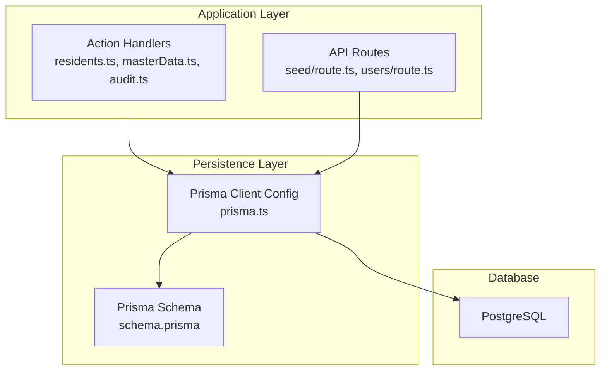
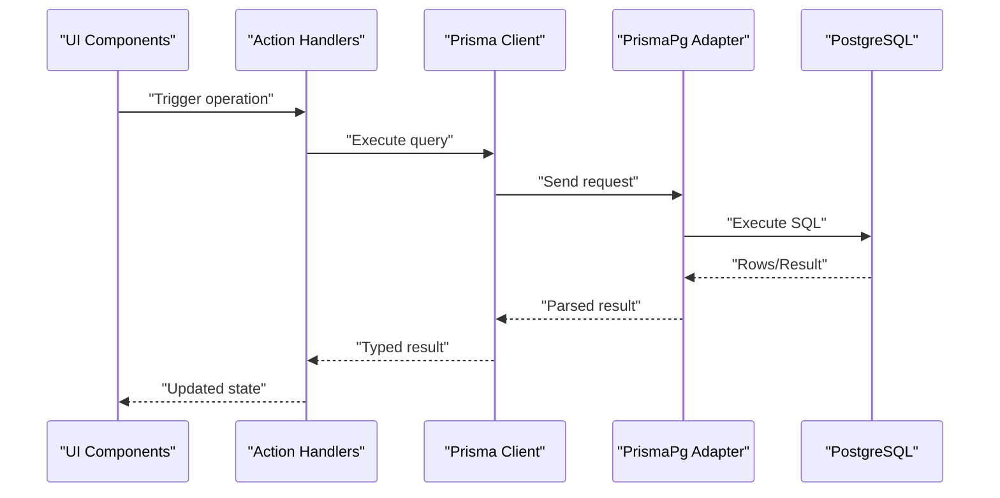
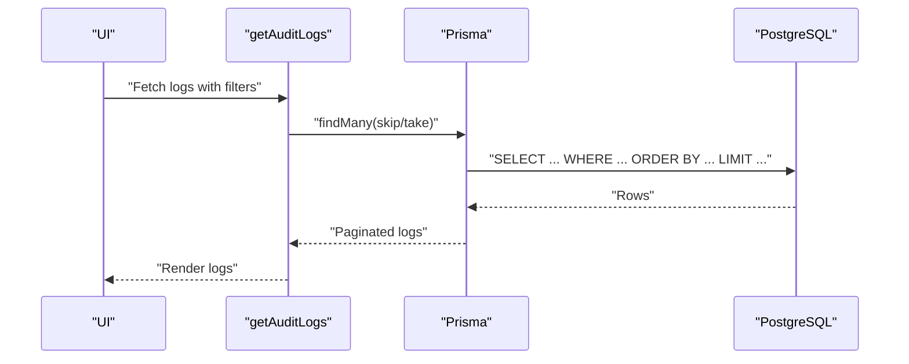
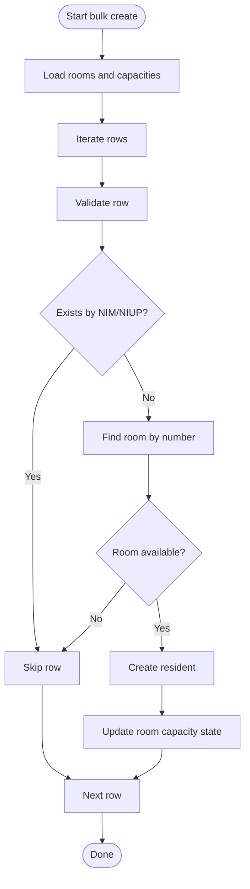

# Performance & Indexing

<cite>
**Referenced Files in This Document**
- [schema.prisma](file://prisma/schema.prisma)
- [prisma.ts](file://src/lib/prisma.ts)
- [residents.ts](file://src/app/actions/residents.ts)
- [masterData.ts](file://src/app/actions/masterData.ts)
- [audit.ts](file://src/app/actions/audit.ts)
- [route.ts](file://src/app/api/seed/route.ts)
- [route.ts](file://src/app/api/users/route.ts)
- [seed.ts](file://prisma/seed.ts)
- [package.json](file://package.json)
</cite>

## Table of Contents
1. [Introduction](#introduction)
2. [Project Structure](#project-structure)
3. [Core Components](#core-components)
4. [Architecture Overview](#architecture-overview)
5. [Detailed Component Analysis](#detailed-component-analysis)
6. [Dependency Analysis](#dependency-analysis)
7. [Performance Considerations](#performance-considerations)
8. [Troubleshooting Guide](#troubleshooting-guide)
9. [Conclusion](#conclusion)
10. [Appendices](#appendices)

## Introduction
This document focuses on performance optimization for ApsAsrama’s database design and query patterns. It covers indexing strategies derived from the Prisma schema, query optimization techniques observed in action handlers, database connection pooling configuration, and practical guidance for query caching, batching, and monitoring. It also outlines maintenance procedures, bottleneck identification, and scalability considerations tailored to the current codebase.

## Project Structure
The performance-relevant parts of the project are organized around:
- Prisma schema defining models, relations, and indexes
- Prisma client initialization with PostgreSQL adapter and connection pooling
- Action handlers orchestrating reads/writes and pagination/search
- API routes for seeding and administrative tasks
- Seed script for initial data population

**Diagram sources**
- [prisma.ts:1-31](file://src/lib/prisma.ts#L1-L31)
- [schema.prisma:1-487](file://prisma/schema.prisma#L1-L487)
- [residents.ts:1-666](file://src/app/actions/residents.ts#L1-L666)
- [masterData.ts:1-191](file://src/app/actions/masterData.ts#L1-L191)
- [audit.ts:1-118](file://src/app/actions/audit.ts#L1-L118)
- [route.ts:1-183](file://src/app/api/seed/route.ts#L1-L183)
- [route.ts:1-6](file://src/app/api/users/route.ts#L1-L6)

**Section sources**
- [prisma.ts:1-31](file://src/lib/prisma.ts#L1-L31)
- [schema.prisma:1-487](file://prisma/schema.prisma#L1-L487)

## Core Components
- Prisma schema defines models and indexes used by queries. Notable indexes include composite and single-column indexes on foreign keys and frequently filtered/sorted columns.
- Prisma client is configured with a PostgreSQL adapter and a small connection pool suitable for serverless environments.
- Action handlers implement pagination, filtering, and batch operations, which are key areas for performance tuning.

Key performance-relevant schema indexes:
- Room: status, floor
- Resident: roomId, status, angkatan
- Assignment: satkerId
- MonitoringPenugasan: assignmentId, tanggalMonitoring
- AbsensiMuallim: muallimId, tanggal
- Kegiatan: tanggal
- AbsensiKegiatan: residentId
- Apel: tanggal
- AbsensiApel: residentId
- ExportHistory: userId, createdAt
- Country: name
- Province: name, countryId
- Regency: name, provinceId
- District: name, regencyId
- Village: name, districtId
- AuditLog: entityType, entityId
- ResidentRoomHistory: residentId, createdAt

Observed query patterns:
- Pagination via skip/take in audit logs
- Filtering by entity type and date range
- Bulk operations for residents (create/update/delete/move)
- Unique constraints enforced at DB level (e.g., NIM/NIUP, academic entities)

**Section sources**
- [schema.prisma:27-487](file://prisma/schema.prisma#L27-L487)
- [residents.ts:76-111](file://src/app/actions/residents.ts#L76-L111)
- [audit.ts:27-98](file://src/app/actions/audit.ts#L27-L98)

## Architecture Overview
The runtime database flow connects UI actions and API routes to Prisma, which uses the PostgreSQL adapter and a minimal pool.

**Diagram sources**
- [prisma.ts:1-31](file://src/lib/prisma.ts#L1-L31)
- [residents.ts:1-666](file://src/app/actions/residents.ts#L1-L666)
- [audit.ts:1-118](file://src/app/actions/audit.ts#L1-L118)

## Detailed Component Analysis

### Database Design and Indexing Strategy
- Single-column indexes on foreign keys and frequently filtered/sorted columns improve join and filter performance.
- Composite indexes on (entityType, entityId) in AuditLog support targeted log retrieval.
- Unique constraints on identifiers (e.g., NIM, NIUP, academic entities) prevent duplicates and enable fast lookups.

Recommended index enhancements (conceptual):
- Add partial indexes for active residents or occupied rooms to accelerate common filters.
- Consider expression indexes for normalized text fields if frequent case-insensitive searches occur.
- Evaluate covering indexes for common projection queries to avoid heap fetches.

Index usage patterns observed:
- Queries filter by status, floor, angkatan, and dates; indexes on these columns reduce scans.
- Foreign key joins (e.g., resident.roomId, assignment.satkerId) benefit from indexes.

**Section sources**
- [schema.prisma:27-487](file://prisma/schema.prisma#L27-L487)
- [residents.ts:76-111](file://src/app/actions/residents.ts#L76-L111)
- [audit.ts:47-92](file://src/app/actions/audit.ts#L47-L92)

### Query Optimization Techniques Observed
- Pagination: Audit logs use skip/take for scalable listing.
- Selective projections: Resident options use select to minimize payload.
- Conditional includes: Resident lists conditionally include related entities.
- Unique checks: Upserts and existence checks prevent unnecessary writes.

Optimization opportunities:
- Replace in-memory JSON search with database-side LIKE/ILIKE or full-text search if needed.
- Batch operations: Bulk create/update/delete/move leverage fewer round-trips.
- Denormalized summaries: Precompute counts for dashboards to reduce per-request aggregation.

**Section sources**
- [audit.ts:47-92](file://src/app/actions/audit.ts#L47-L92)
- [residents.ts:95-111](file://src/app/actions/residents.ts#L95-L111)
- [residents.ts:477-578](file://src/app/actions/residents.ts#L477-L578)

### Database Connection Pooling
- The Prisma client uses a PostgreSQL adapter with a pool configured to a single connection, appropriate for serverless environments.
- Idle and connection timeouts are set to manage resource usage.

Implications:
- High concurrency workloads may bottleneck on connection contention.
- Consider increasing pool.max for stateful deployments or using a managed database with higher connection limits.

**Section sources**
- [prisma.ts:10-17](file://src/lib/prisma.ts#L10-L17)

### Query Caching Strategies
- No explicit caching layer is present in the current codebase.
- Recommendations:
  - Cache read-mostly entities (countries/provinces/regencies/districts/villages) with TTL.
  - Cache paginated audit logs with ETags or last-modified timestamps.
  - Use database-side caching (e.g., materialized views) for frequently accessed aggregates.

[No sources needed since this section provides general guidance]

### Batch Operation Optimization
- Bulk resident creation, deletion, and movement reduce round-trips and maintain referential integrity efficiently.
- Room capacity checks are performed before writes to avoid partial failures.

Recommendations:
- Use transaction blocks for multi-row updates to ensure atomicity.
- Monitor batch sizes to balance memory usage and latency.

**Section sources**
- [residents.ts:477-578](file://src/app/actions/residents.ts#L477-L578)
- [residents.ts:580-608](file://src/app/actions/residents.ts#L580-L608)
- [residents.ts:610-665](file://src/app/actions/residents.ts#L610-L665)

### Performance Monitoring Approaches
- Enable Prisma query logging during development to inspect generated SQL.
- Use database EXPLAIN/EXPLAIN ANALYZE to review query plans for slow queries.
- Track metrics such as query duration, rows examined, and index usage.

[No sources needed since this section provides general guidance]

### Database Maintenance Procedures
- Periodic vacuum/analyze to keep statistics fresh.
- Reindex if index bloat is detected.
- Review unused indexes to reduce write overhead.

[No sources needed since this section provides general guidance]

### Performance Benchmarking and Bottleneck Identification
- Benchmark representative queries (e.g., resident listing with filters, audit log pagination).
- Compare execution plans before/after index changes.
- Identify hotspots: joins, sorts, scans, or repeated subqueries.

[No sources needed since this section provides general guidance]

### Scalability Considerations
- Sharding by geographic regions or academic programs if growth demands.
- Read replicas for reporting-heavy dashboards.
- Asynchronous jobs for heavy exports or batch transformations.

[No sources needed since this section provides general guidance]

## Dependency Analysis
The application depends on Prisma client and PostgreSQL. The adapter bridges Prisma to pg.Pool, which controls connection lifecycle.

**Diagram sources**
- [prisma.ts:1-31](file://src/lib/prisma.ts#L1-L31)
- [package.json:12-32](file://package.json#L12-L32)

**Section sources**
- [prisma.ts:1-31](file://src/lib/prisma.ts#L1-L31)
- [package.json:12-32](file://package.json#L12-L32)

## Performance Considerations
- Index coverage: Ensure queries leverage declared indexes; verify with EXPLAIN.
- Connection limits: Increase pool.max cautiously and monitor DB connection usage.
- Pagination: Prefer keyset pagination for large datasets to avoid deep offsets.
- Selectivity: Filter early and narrow result sets to reduce downstream processing.
- Batching: Consolidate writes to minimize network overhead.
- Caching: Cache static/reference data and expensive computed results.

[No sources needed since this section provides general guidance]

## Troubleshooting Guide
Common issues and remedies:
- Slow audit log listing: Verify createdAt index usage; consider adding a composite index on (entityType, entityId, createdAt) if queries often filter by both.
- High DB load on bulk operations: Confirm batch sizes and transaction boundaries; ensure room capacity checks are efficient.
- Connection exhaustion: Review pool.max and idle timeouts; consider scaling the database tier.

**Section sources**
- [audit.ts:47-92](file://src/app/actions/audit.ts#L47-L92)
- [residents.ts:477-578](file://src/app/actions/residents.ts#L477-L578)
- [prisma.ts:10-17](file://src/lib/prisma.ts#L10-L17)

## Conclusion
ApsAsrama’s schema includes strategic indexes aligned with common query patterns. The Prisma client configuration is tuned for serverless environments. By focusing on index verification, connection tuning, selective projections, and batch operations, the system can achieve robust performance. Introducing caching and monitoring will further enhance reliability and responsiveness.

## Appendices

### Appendix A: Representative Query Workflows

**Diagram sources**
- [audit.ts:64-72](file://src/app/actions/audit.ts#L64-L72)

### Appendix B: Bulk Resident Creation Flow

**Diagram sources**
- [residents.ts:477-578](file://src/app/actions/residents.ts#L477-L578)