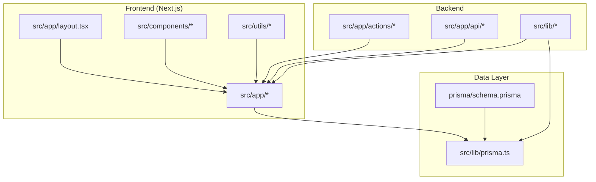
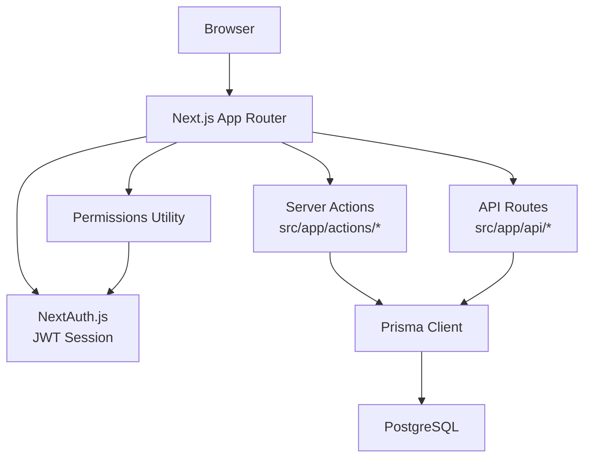
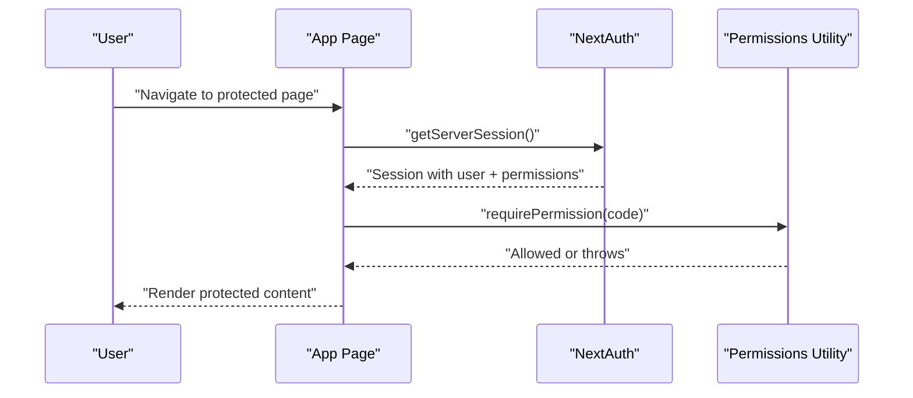
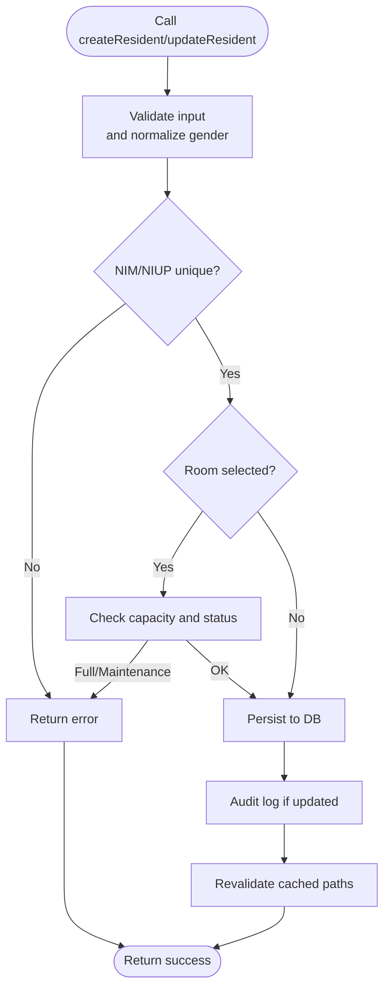
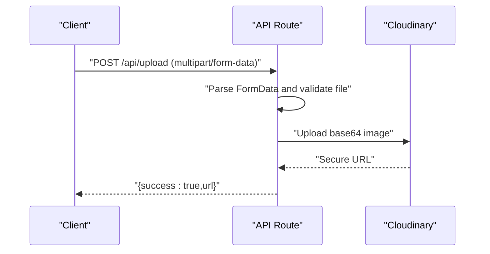
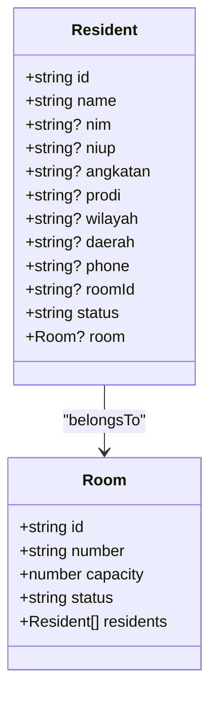
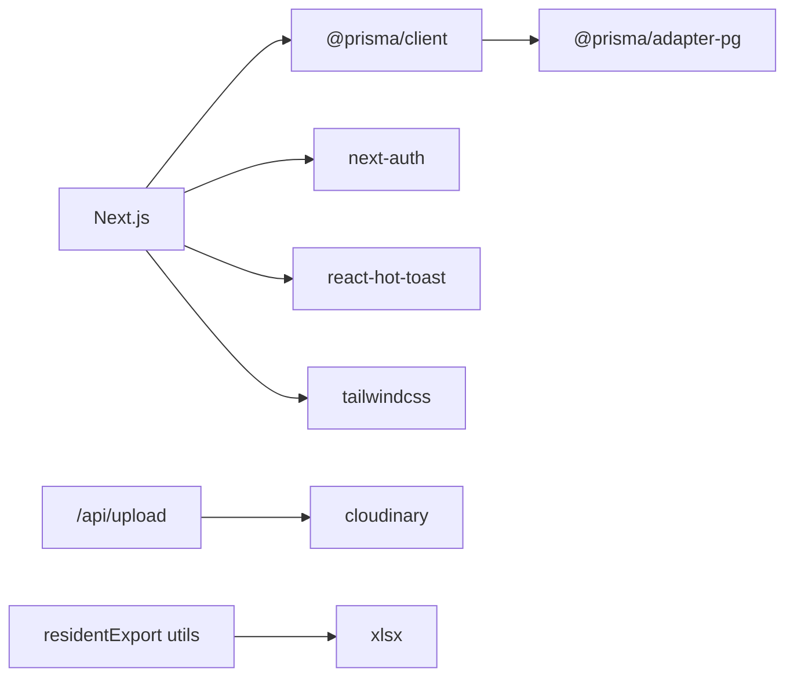

# Development Guidelines

<cite>
**Referenced Files in This Document**
- [package.json](file://package.json)
- [tsconfig.json](file://tsconfig.json)
- [eslint.config.mjs](file://eslint.config.mjs)
- [next.config.ts](file://next.config.ts)
- [prisma/schema.prisma](file://prisma/schema.prisma)
- [src/lib/prisma.ts](file://src/lib/prisma.ts)
- [src/lib/auth.ts](file://src/lib/auth.ts)
- [src/lib/permissions.ts](file://src/lib/permissions.ts)
- [src/app/layout.tsx](file://src/app/layout.tsx)
- [src/app/actions/residents.ts](file://src/app/actions/residents.ts)
- [src/app/api/upload/route.ts](file://src/app/api/upload/route.ts)
- [src/components/dashboard/residents/types.ts](file://src/components/dashboard/residents/types.ts)
- [src/components/dashboard/residents/useResidentFilter.ts](file://src/components/dashboard/residents/useResidentFilter.ts)
- [src/utils/residentExport.ts](file://src/utils/residentExport.ts)
</cite>

## Table of Contents
1. [Introduction](#introduction)
2. [Project Structure](#project-structure)
3. [Core Components](#core-components)
4. [Architecture Overview](#architecture-overview)
5. [Detailed Component Analysis](#detailed-component-analysis)
6. [Dependency Analysis](#dependency-analysis)
7. [Performance Considerations](#performance-considerations)
8. [Testing Strategies](#testing-strategies)
9. [Code Review Processes](#code-review-processes)
10. [Contribution Guidelines](#contribution-guidelines)
11. [Release Management](#release-management)
12. [Debugging and Profiling](#debugging-and-profiling)
13. [Development Environment Setup](#development-environment-setup)
14. [Conclusion](#conclusion)

## Introduction
This document provides comprehensive development guidelines and best practices for contributors working on ApsAsrama. It covers code standards, TypeScript conventions, architectural patterns, development workflow, testing strategies, code review processes, linting configuration, type safety practices, performance optimization, contribution procedures, release management, debugging techniques, and environment setup. The goal is to ensure consistent, maintainable, and secure development across the frontend (Next.js), backend APIs, and database layer.

## Project Structure
ApsAsrama follows a modular Next.js application structure with a clear separation of concerns:
- Frontend pages and layouts under src/app
- Shared UI components under src/components
- Utilities and helpers under src/utils
- Backend actions and API routes under src/app/actions and src/app/api
- Database client initialization and permissions under src/lib
- Prisma schema and seed under prisma

**Diagram sources**
- [src/app/layout.tsx:1-42](file://src/app/layout.tsx#L1-L42)
- [src/lib/prisma.ts:1-31](file://src/lib/prisma.ts#L1-L31)
- [prisma/schema.prisma:1-487](file://prisma/schema.prisma#L1-L487)

**Section sources**
- [package.json:1-48](file://package.json#L1-L48)
- [tsconfig.json:1-35](file://tsconfig.json#L1-L35)
- [next.config.ts:1-24](file://next.config.ts#L1-L24)

## Core Components
Key runtime components and their responsibilities:
- Authentication and session management via NextAuth.js with JWT strategy
- Database client initialized with Prisma using a PostgreSQL adapter and connection pooling
- Permission enforcement utilities for server-side and client-side checks
- Action functions encapsulating server-side mutations and validations
- API routes for external integrations (e.g., Cloudinary uploads)
- UI hooks and types for consistent data modeling across the client

**Section sources**
- [src/lib/auth.ts:1-81](file://src/lib/auth.ts#L1-L81)
- [src/lib/prisma.ts:1-31](file://src/lib/prisma.ts#L1-L31)
- [src/lib/permissions.ts:1-21](file://src/lib/permissions.ts#L1-L21)
- [src/app/actions/residents.ts:1-666](file://src/app/actions/residents.ts#L1-L666)
- [src/app/api/upload/route.ts:1-37](file://src/app/api/upload/route.ts#L1-L37)
- [src/components/dashboard/residents/types.ts:1-46](file://src/components/dashboard/residents/types.ts#L1-L46)

## Architecture Overview
The system uses a layered architecture:
- Presentation layer: Next.js App Router pages and components
- Domain actions: Server Actions for mutations and validations
- API layer: REST-like API routes for integrations
- Persistence layer: Prisma ORM with PostgreSQL adapter

**Diagram sources**
- [src/app/actions/residents.ts:1-666](file://src/app/actions/residents.ts#L1-L666)
- [src/app/api/upload/route.ts:1-37](file://src/app/api/upload/route.ts#L1-L37)
- [src/lib/auth.ts:1-81](file://src/lib/auth.ts#L1-L81)
- [src/lib/permissions.ts:1-21](file://src/lib/permissions.ts#L1-L21)
- [src/lib/prisma.ts:1-31](file://src/lib/prisma.ts#L1-L31)
- [prisma/schema.prisma:1-487](file://prisma/schema.prisma#L1-L487)

## Detailed Component Analysis

### Authentication and Permissions
- NextAuth.js configuration defines credentials provider, JWT callbacks, and session strategy.
- Permission checks are enforced both server-side and client-side using a shared utility.

**Diagram sources**
- [src/lib/auth.ts:1-81](file://src/lib/auth.ts#L1-L81)
- [src/lib/permissions.ts:1-21](file://src/lib/permissions.ts#L1-L21)

**Section sources**
- [src/lib/auth.ts:1-81](file://src/lib/auth.ts#L1-L81)
- [src/lib/permissions.ts:1-21](file://src/lib/permissions.ts#L1-L21)

### Server Actions: Resident Management
- Centralized server actions encapsulate CRUD operations, validations, and revalidation of cached paths.
- Includes bulk operations, room capacity checks, and audit logging for updates.

**Diagram sources**
- [src/app/actions/residents.ts:143-244](file://src/app/actions/residents.ts#L143-L244)

**Section sources**
- [src/app/actions/residents.ts:1-666](file://src/app/actions/residents.ts#L1-L666)

### API Route: Cloudinary Upload
- Accepts multipart form data, converts to base64, and uploads to Cloudinary with a configured folder.

**Diagram sources**
- [src/app/api/upload/route.ts:1-37](file://src/app/api/upload/route.ts#L1-L37)

**Section sources**
- [src/app/api/upload/route.ts:1-37](file://src/app/api/upload/route.ts#L1-L37)

### Data Types and Filtering
- Strongly-typed interfaces for domain entities and enums from Prisma.
- Client-side filtering hook computes unique filter options and applies filters to resident lists.

**Diagram sources**
- [src/components/dashboard/residents/types.ts:1-46](file://src/components/dashboard/residents/types.ts#L1-L46)
- [prisma/schema.prisma:44-101](file://prisma/schema.prisma#L44-L101)

**Section sources**
- [src/components/dashboard/residents/types.ts:1-46](file://src/components/dashboard/residents/types.ts#L1-L46)
- [src/components/dashboard/residents/useResidentFilter.ts:1-73](file://src/components/dashboard/residents/useResidentFilter.ts#L1-L73)

### Layout and Global Styles
- Root layout configures fonts, theme script injection, toast notifications, and metadata.

**Section sources**
- [src/app/layout.tsx:1-42](file://src/app/layout.tsx#L1-L42)

## Dependency Analysis
External dependencies and their roles:
- Next.js 16.x for framework and App Router
- Prisma with PostgreSQL adapter for type-safe database operations
- NextAuth.js for authentication and session management
- Tailwind CSS 4.x for styling
- Cloudinary SDK for media uploads
- react-hot-toast for toast notifications
- xlsx for spreadsheet exports

**Diagram sources**
- [package.json:12-32](file://package.json#L12-L32)
- [src/app/api/upload/route.ts:1-37](file://src/app/api/upload/route.ts#L1-L37)
- [src/utils/residentExport.ts:1-123](file://src/utils/residentExport.ts#L1-L123)

**Section sources**
- [package.json:12-32](file://package.json#L12-L32)

## Performance Considerations
- Enable compression and disable unnecessary headers in Next.js configuration.
- Configure stale times for dynamic/static routes to optimize caching behavior.
- Use database indexes defined in Prisma schema to speed up queries.
- Minimize payload sizes by selecting only required fields in queries.
- Avoid blocking operations in rendering; delegate heavy work to server actions or API routes.
- Use pagination and virtualization for large lists.

**Section sources**
- [next.config.ts:1-24](file://next.config.ts#L1-L24)
- [prisma/schema.prisma:39-42](file://prisma/schema.prisma#L39-L42)
- [prisma/schema.prisma:98-101](file://prisma/schema.prisma#L98-L101)

## Testing Strategies
Recommended testing approaches:
- Unit tests for pure functions (e.g., normalization utilities, validation helpers).
- Integration tests for server actions covering success and failure paths.
- E2E tests for critical user journeys (authentication, resident CRUD, uploads).
- Snapshot tests for UI components to prevent regressions.
- Mock external services (e.g., Cloudinary) during tests.

[No sources needed since this section provides general guidance]

## Code Review Processes
Guidelines for code reviews:
- Ensure type safety and strict mode compliance.
- Verify adherence to lint rules and formatting.
- Confirm presence of unit/integration tests for new features.
- Check for proper error handling and user-friendly messages.
- Validate permissions and access controls for protected actions.
- Review performance implications (queries, revalidation, caching).
- Approve only after confirming documentation and changelog updates.

[No sources needed since this section provides general guidance]

## Contribution Guidelines
Workflow for contributors:
- Fork and branch off develop or main as appropriate.
- Install dependencies and run pre-push checks (lint, type-check).
- Write tests alongside new functionality.
- Keep commits small and focused with clear messages.
- Open a pull request with a detailed description and checklist.
- Address review feedback promptly and update tests accordingly.

[No sources needed since this section provides general guidance]

## Release Management
Release practices:
- Tag releases with semantic versioning.
- Maintain a changelog summarizing breaking changes, features, fixes, and deprecations.
- Run full CI pipeline (lint, type-check, tests, build) before releasing.
- Deploy to staging first, then production after approval.
- Rollback plan should include database migrations and cache invalidation steps.

[No sources needed since this section provides general guidance]

## Debugging and Profiling
Debugging techniques:
- Use browser DevTools and React DevTools for frontend issues.
- Enable Next.js debug logs and inspect server action errors.
- Add structured logging around Prisma queries and mutations.
- Profile API routes and server actions for latency.
- Monitor Cloudinary upload failures and retries.

Profiling tools:
- Chrome DevTools Performance panel
- React DevTools Profiler
- Next.js telemetry and built-in metrics
- Database query analyzer for slow Prisma queries

**Section sources**
- [src/app/api/upload/route.ts:32-35](file://src/app/api/upload/route.ts#L32-L35)

## Development Environment Setup
Environment prerequisites:
- Node.js LTS recommended
- PostgreSQL instance reachable via DATABASE_URL
- Cloudinary account and credentials for media uploads
- NextAuth secret configured for JWT sessions

Local setup steps:
- Install dependencies using package manager
- Generate Prisma client after schema changes
- Seed database if needed using provided scripts
- Start dev server and verify authentication flow

**Section sources**
- [package.json:5-11](file://package.json#L5-L11)
- [src/lib/prisma.ts:6-9](file://src/lib/prisma.ts#L6-L9)
- [src/lib/auth.ts:79-80](file://src/lib/auth.ts#L79-L80)

## Conclusion
These guidelines establish a consistent foundation for building, maintaining, and extending ApsAsrama. By adhering to the outlined standards—strict typing, robust validation, secure permissions, efficient data access, and disciplined testing—you contribute to a reliable, scalable, and developer-friendly codebase.